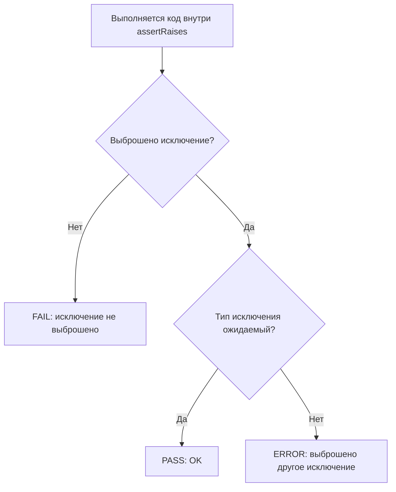

# Проверка исключений в `unittest`: `assertRaises` без `try/except`, с понятными причинами падения

В тестах важно проверять не только “счастливые” сценарии, но и то, как система **правильно ломается**: отклоняет неверный ввод, запрещает недопустимое состояние, сигнализирует об ошибке понятным типом исключения. Если это не тестировать, баги в обработке ошибок проявляются поздно — уже в интеграции, в логах или в поддержке.

В `unittest` для этого есть специализированный инструмент: **`TestCase.assertRaises`**. Он позволяет проверить, что код *обязан* выбросить исключение, и сделать это аккуратно, без ручного `try/except` в тесте. В документации это описано явно: тест **проходит**, если выброшено ожидаемое исключение; считается **ошибкой** (error), если выброшено другое; и считается **провалом** (failure), если исключение не выброшено вовсе. ([Python documentation][1])

## Что именно делает `assertRaises` и почему это лучше “ручного” `try/except`

`assertRaises` — это assert‑метод `unittest.TestCase`, который проверяет “обязательную ошибку”. Его логика фиксирована:

* если ожидаемое исключение выброшено — тест **OK**;
* если выброшено другое исключение — это **ERROR** (непредвиденная ошибка);
* если исключение не выброшено — это **FAIL** (утверждение не выполнено). ([Python documentation][1])

Это поведение полезно именно для QA: оно разделяет два разных случая — “код не выбросил ошибку, хотя должен” и “код упал не тем, чем ожидалось”.

> `assertRaises` — это проверка контракта “при этих условиях обязан быть выброс ошибки такого типа”. ([Python documentation][1])

Если писать тест через `try/except`, легко допустить ошибки структуры: поймать слишком широкое исключение, проглотить чужую ошибку, забыть `self.fail`, или получить неочевидное сообщение при падении. `assertRaises` стандартизирует и сокращает этот код.

## Две формы `assertRaises`: “callable” и “контекст‑менеджер”

`unittest` поддерживает два эквивалентных по смыслу варианта.

### 1) Форма “callable + args”

Вы передаёте *функцию* (callable) и её аргументы отдельно:

```python
self.assertRaises(ValueError, int, "XYZ")
```

Это описано в документации как `assertRaises(exc, fun, *args, **kwds)`: проверяется, что `fun(*args, **kwds)` выбрасывает `exc`. ([Python documentation][1])

Эта форма удобна, когда вызов однострочный и не требует подготовки внутри блока.

### 2) Форма контекст‑менеджера `with`

Если Вы передаёте только класс исключения (и, опционально, `msg`), `assertRaises` возвращает контекст‑менеджер. Тогда код под тестом пишется “inline”:

```python
with self.assertRaises(ValueError):
    int("XYZ")
```

Документация прямо говорит: если переданы только `exception` (и возможно `msg`), возвращается context manager, чтобы код был записан внутри `with`. ([Python documentation][1])

Эта форма обычно лучше для читаемости: внутри блока видно, какая операция должна “сломаться”.

## Схема результатов: PASS / FAIL / ERROR

Важно понимать, как будет выглядеть исход теста в отчёте `unittest`.



Это не теория ради схемы: при разборе отчёта CI Вы быстро отличаете “не тот контракт” (FAIL) от “непредвиденное падение” (ERROR). Поведение описано в документации `unittest`. ([Python documentation][1])

## Самая частая ошибка: передать результат вызова вместо callable

`assertRaises` в форме callable принимает **функцию**, а не результат её выполнения. Ошибка выглядит так:

```python
# ПЛОХО: функция вызывается до assertRaises
self.assertRaises(ValueError, int("XYZ"))
```

Здесь `int("XYZ")` будет выполнен сразу, и `ValueError` поднимется *до* того, как `assertRaises` начнёт что‑то проверять. Тест упадёт “как ошибка”, а не как управляемая проверка.

Правильно так:

```python
# ХОРОШО: передаём callable и аргумент отдельно
self.assertRaises(ValueError, int, "XYZ")
```

Или через контекст‑менеджер:

```python
with self.assertRaises(ValueError):
    int("XYZ")
```

Обе формы приведены и описаны в документации. ([Python documentation][1])

## Как проверять детали исключения без `try/except`: `as cm` и `cm.exception`

Иногда Вам важно не только “тип ошибки”, но и **данные** в исключении: код ошибки, поле, которое не прошло валидацию, параметры запроса.

`assertRaises` как контекст‑менеджер позволяет поймать исключение и затем проверить его содержимое. Контекст‑менеджер сохраняет пойманный объект исключения в атрибуте `exception`. ([Python documentation][1])

Пример с кастомным исключением и кодом ошибки (типичный приём в доменной логике и API):

```python
import unittest
from dataclasses import dataclass

@dataclass(frozen=True)
class ValidationError(Exception):
    field: str
    code: str
    message: str

    def __str__(self) -> str:
        return f"{self.field}:{self.code}:{self.message}"

def parse_age(text: str) -> int:
    if not text.isdigit():
        raise ValidationError("age", "not_a_number", "age must contain digits only")
    age = int(text)
    if age < 0 or age > 150:
        raise ValidationError("age", "out_of_range", "age must be in 0..150")
    return age

class TestParseAge(unittest.TestCase):
    def test_rejects_non_numeric(self):
        # Arrange
        raw = "12 years"

        # Act + Assert
        with self.assertRaises(ValidationError) as cm:
            parse_age(raw)

        # Assert (дополнительно)
        err = cm.exception
        self.assertEqual(err.field, "age")
        self.assertEqual(err.code, "not_a_number")

if __name__ == "__main__":
    unittest.main(verbosity=2)
```

Здесь нет `try/except` в тесте, но есть точная проверка полей. Механика `cm.exception` описана в официальной документации `unittest`. ([Python documentation][1])

## Когда нужен `assertRaisesRegex` и как не превратить тест в “хрупкий”

Бывает, что сообщение исключения — часть контракта. Например, библиотека обязана выдавать понятное сообщение пользователю, либо CLI‑утилита печатает конкретный текст.

Для этого есть `assertRaisesRegex`: он делает то же, что `assertRaises`, но дополнительно проверяет, что регулярное выражение совпадает со строковым представлением исключения. Документация уточняет, что `regex` может быть строкой или объектом регулярного выражения, а сопоставление идёт через `re.search()`. ([Python documentation][1])

Пример:

```python
import unittest

def to_int(text: str) -> int:
    return int(text)

class TestToInt(unittest.TestCase):
    def test_message_contains_literal_word(self):
        with self.assertRaisesRegex(ValueError, r"invalid literal"):
            to_int("XYZ")
```

Используйте regex осознанно: фиксируйте только стабильную часть сообщения (ключевую фразу), а не весь текст целиком. Тогда тест меньше зависит от мелких изменений формулировок.

## Граница точности: какое исключение ожидать и насколько “широко” ловить

`assertRaises` позволяет передать не только один класс исключения, но и **кортеж классов**, если допустимы несколько вариантов. Это официально поддерживается: “To catch any of a group of exceptions, a tuple containing the exception classes may be passed as exception.” ([Python documentation][1])

Это может быть оправдано, когда контракт допускает несколько типов из-за слоя адаптера или совместимости. Но здесь легко переборщить.

Если Вы используете слишком широкую группу (например, `(Exception,)`), тест начинает пропускать дефекты: он будет “зелёным” даже при совершенно неожиданной ошибке, и Вы потеряете диагностическую ценность. Лучше выбирать самый конкретный тип, который действительно является контрактом.

## `assertRaises` и побочные эффекты: как проверить, что “ничего лишнего” не произошло

Сценарий “должна быть ошибка” часто означает, что дальше по цепочке **ничего не должно выполниться**: не должно быть записи в репозиторий, отправки письма, запроса в платёжку.

Такой тест обычно состоит из двух частей:

1. проверить, что исключение выброшено;
2. проверить, что побочные эффекты не произошли.

В `unittest` это удобно делать через моки и проверки `assert_not_called`. Ниже пример без привязки к конкретному фреймворку, только стандартная библиотека.

```python
import unittest
from unittest.mock import Mock

class Repo:
    def save(self, data):  # интерфейс
        raise NotImplementedError

def create_user(email: str, repo: Repo) -> None:
    email = email.strip().lower()
    if "@" not in email:
        raise ValueError("invalid email")
    repo.save({"email": email})

class TestCreateUser(unittest.TestCase):
    def test_invalid_email_raises_and_does_not_save(self):
        # Arrange
        repo = Mock(spec=Repo)

        # Act + Assert (исключение)
        with self.assertRaises(ValueError):
            create_user("not-an-email", repo)

        # Assert (побочный эффект)
        repo.save.assert_not_called()

if __name__ == "__main__":
    unittest.main()
```

Смысл здесь QA‑ориентированный: Вы не только фиксируете “ошибка была”, но и защищаете систему от частичных действий при ошибке.

## Как `assertRaises` вписывается в AAA и делает тест “сценарием”

Если Вы пишете тест по шаблону AAA (Arrange–Act–Assert), то исключение — это часть Assert. Но в `unittest` для исключений “Act и Assert” естественно совмещаются в одном блоке `with`:

```python
# Arrange: входы и зависимости
# Act+Assert: код внутри with должен выбросить исключение
with self.assertRaises(ExpectedError):
    do_something()
# Assert: дополнительные проверки по cm.exception или по побочным эффектам
```

Эта форма совпадает с рекомендацией документации: контекст‑менеджер используется, чтобы код был записан inline. ([Python documentation][1])

## Мини‑шпаргалка: какой вариант выбирать

| Задача                                                                              | Лучше писать так                            | Почему                                                                    |
| ----------------------------------------------------------------------------------- | ------------------------------------------- | ------------------------------------------------------------------------- |
| Однострочный вызов, не нужно проверять детали исключения                            | `self.assertRaises(ValueError, int, "XYZ")` | коротко, без блока `with` ([Python documentation][1])                     |
| Вызов многострочный или нужно подчеркнуть “вот действие, которое обязано сломаться” | `with self.assertRaises(ValueError): ...`   | читабельность, явная граница сценария ([Python documentation][1])         |
| Нужно проверить поля/код ошибки                                                     | `with ... as cm:` + `cm.exception`          | доступ к объекту исключения для доп. assert ([Python documentation][1])   |
| Сообщение — часть контракта                                                         | `assertRaisesRegex`                         | проверка формата/фрагмента сообщения regex’ом ([Python documentation][1]) |

## Заключение

`assertRaises` — базовый инструмент для негативных сценариев и проверки контрактов обработки ошибок. Он даёт структурированный результат: PASS, FAIL или ERROR в зависимости от того, выброшено ли исключение и соответствует ли оно ожиданию. ([Python documentation][1])
Форма контекст‑менеджера делает тест читабельным и позволяет проверять детали исключения через `cm.exception`. ([Python documentation][1])
Если сообщение исключения — часть контракта, используйте `assertRaisesRegex`, фиксируя только устойчивые фрагменты текста. ([Python documentation][1])

## Дополнительные материалы

Официальная документация `unittest`: описание `assertRaises` (обе формы, поведение PASS/FAIL/ERROR, `cm.exception`, кортеж исключений). ([Python documentation][1])
Официальная документация `unittest`: описание `assertRaisesRegex` и примеры использования. ([Python documentation][1])

[1]: https://docs.python.org/3/library/unittest.html "unittest — Unit testing framework — Python 3.14.3 documentation"
