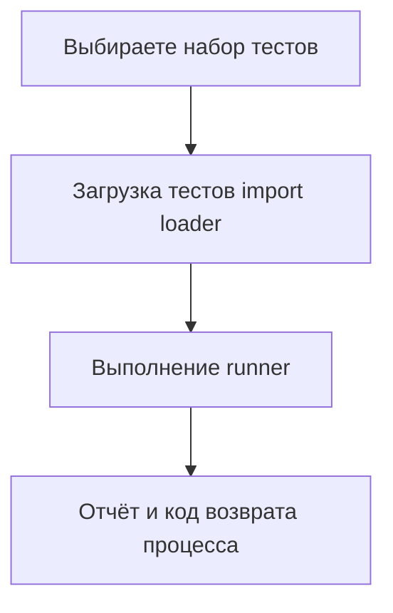

# Полезные опции CLI `unittest`: `-v`, `-f/--failfast`, `-b/--buffer`, `-k`, `--locals`, `--durations` — как ускорить диагностику и итерации

Долгий цикл обратной связи в тестах почти всегда складывается из мелочей: Вы запускаете слишком много тестов “на всякий случай”, теряете время в шумном выводе, не можете быстро найти нужный тест по имени, или получаете traceback без контекста. У `unittest` есть набор CLI‑опций, которые решают эти проблемы прямо на уровне запуска. Эти флаги не “улучшают тесты сами по себе”, но **сжимают время от изменения кода до понятного сигнала**, а значит повышают скорость разработки и отладки.

`unittest` официально поддерживает эти параметры в режиме `python -m unittest` и описывает их в разделе Command‑Line Interface. ([Python documentation][1])

## Как думать про запуск: что именно вы ускоряете

Когда Вы запускаете тесты, происходит примерно один и тот же конвейер:



Опции CLI из этой темы влияют на разные участки:

- `-k` ускоряет **выбор набора** (запускаете только нужное).
- `-f` ускоряет **выполнение** (останавливает прогон на первой проблеме).
- `-v` ускоряет **понимание** (в отчёте видно, что именно запускалось).
- `-b` ускоряет **поиск причины** в шумных тестах (показывает вывод только там, где он нужен).
- `--locals` ускоряет **локализацию дефекта** (traceback содержит локальные переменные).
- `--durations` ускоряет **оптимизацию времени прогона** (видно, какие тесты самые медленные). ([Python documentation][1])

## Короткая “таблица намерений”: какой флаг под какую боль

| Боль при отладке                                             | Что включить    | Что Вы получите                                                                                                 |
| ------------------------------------------------------------ | --------------- | --------------------------------------------------------------------------------------------------------------- |
| “Не понимаю, какие тесты реально запускаются”                | `-v`            | имена тестов и более подробный отчёт ([Python documentation][1])                                                |
| “Упало 50 тестов, хочу чинить по одному”                     | `-f`            | остановка на первом fail/error ([Python documentation][1])                                                      |
| “Логи засоряют консоль, а нужное сообщение теряется”         | `-b`            | вывод от passing‑тестов выкинут, от failing‑тестов — показан и добавлен в сообщение ([Python documentation][1]) |
| “Нужен быстрый запуск только тестов про auth/checkout/regex” | `-k`            | фильтр по имени теста, можно несколько раз ([Python documentation][1])                                          |
| “В traceback нет контекста, почему значение стало таким”     | `--locals`      | локальные переменные в traceback ([Python documentation][1])                                                    |
| “Прогон стал медленным, надо найти виновника”                | `--durations N` | N самых медленных тестов (0 — все) ([Python documentation][1])                                                  |

## `-v`: verbose как инструмент копирования “полного имени” теста

`-v` (verbosity) включает более подробный вывод: в отчёте появляются строки вида `test_xxx (package.module.ClassName.test_xxx) ... ok`. В документации показано, что `-v` можно передавать как при запуске модуля (`python -m unittest -v test_module`), так и при запуске файла через `unittest.main()`. ([Python documentation][1])

Почему это ускоряет работу, а не просто делает “больше текста”:

1. В verbose‑выводе видно **полностью квалифицированное имя** теста (dotted name). Его можно сразу использовать для точечного запуска конкретного метода (`python -m unittest package.module.TestClass.test_method`) без угадываний и поисков. ([Python documentation][1])
2. Если тесты падают нестабильно, `-v` позволяет увидеть, **какой тест шёл последним** перед зависанием/крашем процесса. Это важно при проблемах с ресурсами или некорректной очисткой.

Мини‑пример запуска:

```bash
python -m unittest -v tests.test_calc
```

Типичный фрагмент вывода:

```text
test_add_negative (tests.test_calc.TestAdd.test_add_negative) ... ok
test_add_two_numbers (tests.test_calc.TestAdd.test_add_two_numbers) ... FAIL
```

С такого вывода удобно перейти к прицельному запуску одного метода (это уже тема 3.1), потому что имя выдано в “готовом виде”. ([Python documentation][1])

## `-f/--failfast`: чинить “первую причину”, а не всю лавину

`-f`/`--failfast` останавливает прогон на **первой** ошибке или падении. Официальное описание короткое: “Stop the test run on the first error or failure.” ([Python documentation][1])

Где failfast реально ускоряет:

- после рефакторинга упал большой набор тестов, но причина, как правило, одна: неправильный импорт, сломанный контракт, изменённый формат данных;
- тесты долгие, и ждать полный прогон ради одного дефекта бессмысленно;
- Вы работаете итерациями “правка → прогон → правка”.

Команда обычно выглядит так:

```bash
python -m unittest -v -f
```

Практическая оговорка: failfast полезен **во время исправления**, но вреден как “финальный контроль”. Пока `-f` включён, остальные дефекты скрыты и могут всплыть позже. Поэтому типичный цикл такой: сначала `-f` для скорости, затем прогон без `-f` перед фиксацией результата.

## `-b/--buffer`: вывод только там, где он нужен

`-b`/`--buffer` буферизует `stdout` и `stderr` во время теста. Если тест проходит, вывод **выбрасывается**. Если тест падает или даёт ошибку, вывод показывается “нормально” и дополнительно добавляется в текст failure/error. Это поведение описано прямо в документации. ([Python documentation][1])

Это особенно полезно в двух ситуациях:

1. В коде или в тестах есть `print()`/логирование, и консоль превращается в “простыню”, где сложно найти сообщение, относящееся к падению.
2. Тесты запускаются в CI и шумный вывод затрудняет анализ (и иногда увеличивает размер логов/замедляет пайплайн).

### Мини‑пример, чтобы почувствовать эффект

Тестовый файл:

```python
# tests/test_buffer_demo.py
import unittest


def calc(x: int) -> int:
    print(f"[debug] calc got x={x}")
    return 10 // x


class TestBuffer(unittest.TestCase):
    def test_ok(self):
        self.assertEqual(calc(2), 5)

    def test_fail(self):
        self.assertEqual(calc(3), 4)  # намеренно неверно


if __name__ == "__main__":
    unittest.main()
```

Запуск без буфера:

```bash
python -m unittest -v tests.test_buffer_demo
```

В консоли будет много `[debug] ...` даже от “зелёных” тестов.

Запуск с буфером:

```bash
python -m unittest -v -b tests.test_buffer_demo
```

Тогда `[debug] ...` появится только для падающего теста (и попадёт в failure‑сообщение), а для `test_ok` будет отброшен. Именно это и заявлено как поведение `--buffer`. ([Python documentation][1])

Важно: если тесты проверяют реальный вывод в stdout/stderr, они должны делать это явно (например, через `unittest.mock`/перехват потоков). Полагаться на “случайный print” — плохая практика, а `-b` быстро выявляет такие зависимости.

## `-k`: фильтрация по имени без ручного перечисления тестов

`-k` — самый удобный способ быстро отфильтровать набор тестов по имени. Документация фиксирует сразу несколько важных деталей:

- запускаются только те классы и методы, которые **совпали** с pattern или подстрокой; ([Python documentation][1])
- `-k` можно указать **несколько раз**, и тогда включаются тесты, совпавшие **с любым** из паттернов (логика “OR”); ([Python documentation][1])
- если в паттерне есть `*`, используется сопоставление через `fnmatch.fnmatchcase()`; иначе используется простое case‑sensitive сравнение по подстроке; ([Python documentation][1])
- матчинг идёт по **полностью квалифицированному имени тестового метода**, как его импортировал загрузчик. ([Python documentation][1])

### Что такое “pattern с \*” и почему это не regex

`fnmatch` — это shell‑style wildcard‑шаблоны: `*` соответствует “всё”, `?` — одному символу и т. п. Это не регулярные выражения. ([Python documentation][2])
`fnmatchcase` делает сопоставление **с учётом регистра**, что соответствует описанию поведения `-k` как case‑sensitive. ([Python documentation][2])

### Практические команды, которые реально экономят время

Запустить всё, где в полном имени теста встречается `login`:

```bash
python -m unittest -v -k login
```

Запустить тесты, где имя совпадает с wildcard‑паттерном (например, все тесты классов `TestAuth*`):

```bash
python -m unittest -v -k "TestAuth*"
```

Запустить объединение двух фильтров (любой из них):

```bash
python -m unittest -v -k token -k refresh
```

Смысл такой команды — быстрый фокус на функциональном блоке без знания точных dotted names. Важно помнить, что сравнение case‑sensitive, поэтому `-k Login` и `-k login` — разные фильтры. ([Python documentation][1])

## `--locals`: traceback с локальными переменными, когда “почему так получилось” не видно

`--locals` добавляет локальные переменные в traceback. Это официально описано одной строкой, но эффект ощутимый: при падении в глубине стека Вы видите не только “где упало”, но и “с какими значениями”. ([Python documentation][1])

Запуск:

```bash
python -m unittest --locals -v tests.test_pricing
```

Где это помогает:

- дефект в ветвлениях и границах (в traceback сразу видно, какие входы попали в функцию);
- ошибки преобразований (видно промежуточные значения: очищенная строка, parsed int, итоговый dict);
- нестабильные тесты из‑за времени/окружения (видно, какие переменные окружения/параметры реально были в момент падения).

Практическая оговорка: `--locals` может вывести в лог **чувствительные данные** (токены, пароли, содержимое payload). Для локальной отладки это нормально, но в CI‑логах нужно быть осторожным: либо не включать `--locals` постоянно, либо следить за тем, что попадает в локальные переменные (маскировать секреты в тестовых данных).

## `--durations N`: увидеть “тормоза” и не спорить на ощущениях

`--durations N` показывает N самых медленных тест‑кейсов, а при `N=0` — все. Это зафиксировано в документации буквально. ([Python documentation][1])

Запуск:

```bash
python -m unittest --durations 10
```

или, если нужно увидеть все времена:

```bash
python -m unittest --durations 0
```

Это инструмент не только “про производительность”. Он ускоряет диагностику по двум причинам:

1. Если прогон неожиданно стал медленным, `--durations` показывает конкретные тесты‑виновники: обычно это случайно оставленный `sleep`, обращение к сети, работа с диском без моков, или тяжёлая фикстура, выполняемая слишком часто.
2. При оптимизации набора Вы перестаёте действовать вслепую: сначала улучшаете самые медленные 5–10 тестов, потом смотрите новый топ‑10.

Важная практическая деталь совместимости: в документации указано, что `--durations` добавлен в Python 3.12. Если окружение на 3.11 и ниже, этой опции не будет. ([Python documentation][1])

## Сочетания, которые дают “готовые режимы” диагностики

Здесь полезнее думать не “один флаг”, а “набор под задачу”. Ниже — несколько рабочих комбинаций.

| Задача                                            | Команда                             | Почему это быстрее                                                                                                 |
| ------------------------------------------------- | ----------------------------------- | ------------------------------------------------------------------------------------------------------------------ |
| Быстро чинить один дефект в конкретной области    | `python -m unittest -v -f -k auth`  | `-k` сужает набор, `-f` останавливает сразу, `-v` показывает точное имя упавшего теста ([Python documentation][1]) |
| Утопаете в логах, но хотите видеть их при падении | `python -m unittest -v -b`          | `-b` отбрасывает stdout/stderr у passing‑тестов и прикрепляет к failing‑тесту ([Python documentation][1])          |
| Падение “непонятно почему” (нужны значения)       | `python -m unittest -v --locals`    | локальные переменные в traceback дают контекст причины ([Python documentation][1])                                 |
| Регресс по времени прогона                        | `python -m unittest --durations 10` | видно, какие тесты самые медленные ([Python documentation][1])                                                     |

## Где посмотреть полный список опций и не гадать

`unittest` прямо предлагает способ получить список всех CLI‑опций:

```bash
python -m unittest -h
```

Это полезно, когда Вы не уверены в синтаксисе или хотите проверить наличие опции в конкретной версии Python. ([Python documentation][1])

## Заключение

Эти флаги решают практическую задачу: **минимизировать время от изменения кода до объяснимого результата**. `-k` даёт быстрый фокус, `-f` отсекает лишние итерации, `-v` делает отчёт пригодным для навигации, `-b` превращает “шумный вывод” в диагностический артефакт, `--locals` добавляет контекст в traceback, `--durations` выявляет тормоза по фактам. Всё это является частью стандартного интерфейса командной строки `unittest`. ([Python documentation][1])

## Дополнительные материалы

Официальная документация `unittest`, раздел Command‑Line options (описания `-b`, `-f`, `-k`, `--locals`, `--durations` и примеры запуска). ([Python documentation][1])
Документация `fnmatch` (что означает `*` и почему это wildcard‑шаблоны, а не regex; `fnmatchcase` как case‑sensitive сопоставление). ([Python documentation][2])

[1]: https://docs.python.org/3/library/unittest.html "unittest — Unit testing framework — Python 3.14.3 documentation"
[2]: https://docs.python.org/3/library/fnmatch.html "fnmatch — Unix filename pattern matching — Python 3.14.3 documentation"
