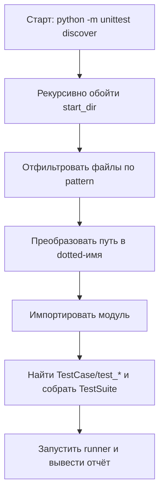

# Test discovery в `unittest`: как работает `python -m unittest discover`, зачем нужны `-s/-p/-t` и почему тест‑модули обязаны быть импортируемыми

Иногда тесты “пропадают”: `python -m unittest` печатает `Ran 0 tests`, хотя файлы лежат в `tests/`, имена начинаются с `test_`, а в IDE всё “как будто” запускается. Почти всегда причина одна: **test discovery в `unittest` — это не поиск файлов и не исполнение по путям, а импорт модулей**. Он сначала находит подходящие файлы, затем превращает пути в dotted‑имена и импортирует их. ([Python documentation][1])

Эта особенность определяет всё остальное: требования к структуре проекта, к именам файлов/папок, к параметрам `-s/-p/-t`, к тому, из какого каталога запускается команда, и даже к тому, почему `unittest` иногда предупреждает про “не тот пакет” и завершает работу. ([Python documentation][1])

## Как `discover` находит тесты: модель “поиск → преобразование → импорт → сбор suite”

В `unittest` discovery реализован методом `TestLoader.discover()`, а CLI‑команда `python -m unittest discover` — просто удобная оболочка над ним. ([Python documentation][1])

Ниже — схема, которая лучше всего объясняет, почему так важны “импортируемость” и параметр `-t`:



Ключевой узел тут — “импортировать модуль”. Документация говорит прямо: discovery загружает тесты **путём импорта**, и после того как найден набор файлов, их пути преобразуются в имена пакетов/модулей для импорта (пример: `foo/bar/baz.py` импортируется как `foo.bar.baz`). ([Python documentation][1])

## Базовая команда и важный нюанс: `python -m unittest` = `discover`, но без параметров

Самый короткий запуск discovery выглядит так:

```bash
cd project_directory
python -m unittest discover
```

Это “базовое” использование, указанное в документации. ([Python documentation][1])

Важный нюанс: запуск **без аргументов** эквивалентен `discover`, то есть:

```bash
python -m unittest
# == python -m unittest discover
```

Но если нужно передать параметры discovery, под‑команду `discover` нужно указывать явно. ([Python documentation][1])

## Параметры `-s/-p/-t`: что они означают на практике

CLI `discover` поддерживает три основные опции:

- `-s, --start-directory` — откуда начинать обход (по умолчанию `.`). ([Python documentation][1])
- `-p, --pattern` — шаблон для файлов тестов (по умолчанию `test*.py`). ([Python documentation][1])
- `-t, --top-level-directory` — “верх” проекта, относительно которого строятся dotted‑имена модулей; по умолчанию равен `start-directory`. ([Python documentation][1])

Эти параметры напрямую связаны с тем, **какое dotted‑имя получится у тестового файла**, а значит — сможет ли Python его импортировать.

### Визуальная шпаргалка: как `-t` влияет на импорт

Представьте структуру:

```text
project/
├─ src/
│  └─ app/
│     ├─ __init__.py
│     └─ calc.py
└─ tests/
   └─ test_calc.py
```

Если запускать так:

```bash
python -m unittest discover -s tests
```

то `-t` по умолчанию станет равен `tests`, и `tests/test_calc.py` будет импортироваться как **`test_calc`** (без пакета `tests`), потому что “верх” для построения имени — каталог `tests/`. Это может работать, но создаёт два типовых эффекта:

1. тест‑модули становятся “плоскими” и могут конфликтовать по именам;
2. импорты приложения из `src/` чаще ломаются, если проект не установлен как пакет.

Если запускать так (часто это более предсказуемо):

```bash
python -m unittest discover -s tests -t .
```

то `tests/test_calc.py` будет импортироваться как **`tests.test_calc`** (потому что верхний уровень — корень проекта). Но тогда `tests` должен быть импортируемым пакетом (см. дальше “импортируемость”). ([Python documentation][1])

## `-s/-p/-t` можно передать позиционно — и это может запутать

Документация явно говорит: `-s`, `-p`, `-t` можно передавать как позиционные аргументы в указанном порядке, и приводит пример эквивалентных команд. ([Python documentation][1])

Эквивалентны:

```bash
python -m unittest discover -s project_directory -p "*_test.py"
python -m unittest discover project_directory "*_test.py"
```

Если цель — читаемость и меньше сюрпризов, лучше использовать именованные флаги `-s/-p/-t`: так команда не зависит от порядка аргументов.

## Что значит “импортируемость” тест‑модулей: главный контракт discovery

Документация формулирует требование жёстко:

> чтобы быть совместимыми с test discovery, все тестовые файлы должны быть модулями или пакетами, импортируемыми из top‑level directory проекта (то есть имена файлов должны быть валидными идентификаторами). ([Python documentation][1])

А на уровне `TestLoader.discover()` уточняется:

- загружаются только файлы, совпавшие с `pattern`, и только те модули, чьи имена импортируемы (то есть валидные Python‑идентификаторы); ([Python documentation][1])
- все тестовые модули должны быть импортируемы от top‑level; если `start_dir` не является top‑level, нужно отдельно задать `top_level_dir`. ([Python documentation][1])

И именно поэтому “просто положить файлы в папку” недостаточно: discovery не исполняет файл по пути, он пытается сделать `import some.package.test_module`.

### Практическое правило для имён

Путь превращается в dotted‑имя. Пример из документации:

- `foo/bar/baz.py` → импорт `foo.bar.baz` ([Python documentation][1])

Отсюда вытекают ограничения:

- имя файла должно быть валидным идентификатором: `test_calc.py` — ок, `test-calc.py` — нет (дефис недопустим в имени модуля);
- имена директорий на пути тоже должны становиться валидными компонентами dotted‑имени (`foo-bar/` ломает импорт так же, как `test-calc.py`).

Ниже — короткая таблица, чтобы не ошибаться:

| На диске                  | Во что превращается при импорте | Итог                                          |
| ------------------------- | ------------------------------- | --------------------------------------------- |
| `tests/test_calc.py`      | `tests.test_calc`               | ок (если `tests` импортируем)                 |
| `tests/unit/test_calc.py` | `tests.unit.test_calc`          | ок (если `tests` и `tests.unit` импортируемы) |
| `tests/test-calc.py`      | `tests.test-calc`               | не импортируется (дефис)                      |
| `tests/2026/test_calc.py` | `tests.2026.test_calc`          | не импортируется (`2026` не идентификатор)    |

## Почему нужны `__init__.py`: пакеты, подкаталоги и “почему не нашлось”

Чтобы dotted‑имя импортировалось, директория обычно должна быть пакетом Python. Классический маркер пакета — файл `__init__.py`.

В документации `unittest` есть важное уточнение, которое влияет на структуру тестов:

- начиная с Python 3.14, чтобы не сканировать “не‑Python” директории, discovery **не ищет тесты в поддиректориях без `__init__.py`**. ([Python documentation][1])
- также отмечены изменения поддержки namespace packages: поддержку добавляли, убирали (в 3.11) и снова возвращали для `start_dir` (в 3.14). ([Python documentation][1])

Если нужно, чтобы discovery стабильно работал в разных версиях Python и на разных структурах, самый надёжный путь — делать тестовые каталоги **обычными пакетами** (класть `__init__.py` хотя бы в ключевые уровни, которые попадают в dotted‑имена).

### Мини‑демо “почему 0 тестов”: нет пакета на пути импорта

Пусть есть:

```text
project/
└─ tests/
   └─ test_api.py
```

и в `tests/test_api.py` есть класс `TestAPI(unittest.TestCase)`.

Запуск:

```bash
python -m unittest discover -s tests -t .
```

Discovery найдёт файл по шаблону, затем попробует импортировать `tests.test_api`. Если `tests/` не является пакетом (нет `tests/__init__.py` и это не namespace package в вашей версии Python), импорт провалится, и тесты не будут корректно загружены. Это следствие того, что discovery работает через импорт и преобразует пути в package names. ([Python documentation][1])

Исправление, которое делает поведение предсказуемым:

```text
project/
└─ tests/
   ├─ __init__.py
   └─ test_api.py
```

## `-p/--pattern`: как выбрать шаблон и не превратить его в ловушку

`pattern` определяет, какие файлы будут загружаться, и используется “shell style pattern matching”. ([Python documentation][1])
То есть это не regex, а wildcard‑шаблоны вида `test*.py`, `*_test.py`, `test_*.py`.

Две практические детали:

1. Шаблон лучше брать такой, чтобы он не ловил вспомогательные файлы, и в то же время был единым для команды и репозитория. Например, если принято `test_*.py`, фиксируйте это в запуске и в нейминге.
2. В shell `*` может раскрыться до списка файлов ещё до передачи Python‑процессу, поэтому шаблоны разумно брать в кавычки:

```bash
python -m unittest discover -s tests -t . -p "test_*.py"
python -m unittest discover -s tests -t . -p "*_test.py"
```

## `-s` как dotted‑имя пакета: когда это полезно и что меняется

Помимо пути, в `-s` можно передать **имя пакета**, например `myproject.subpackage.test`. Тогда этот пакет будет импортирован, а его путь на файловой системе будет использован как `start_dir`. ([Python documentation][1])

Это удобно в двух случаях:

- тесты лежат не рядом с корнем репозитория, и вы хотите запускать discovery, опираясь на пакетную структуру;
- вы хотите явно сказать “стартуйте из того места, откуда реально импортируется пакет” (это снижает риск неверного “старта” из случайного каталога).

## Важная “Caution” из документации: discovery может импортировать “не ту копию” пакета

Документация предупреждает о специфической, но очень реальной проблеме: если пакет установлен глобально (или в окружении) и вы запускаете discovery на другой копии того же пакета, импорт может произойти **из другого места**, не из того, где лежит ваш код. В такой ситуации discovery предупреждает и завершает работу. ([Python documentation][1])

И отдельно: если вы указали `start_dir` как package name, discover предполагает, что импортируемая локация и была вашей целью, и предупреждения не будет. ([Python documentation][1])

Практический вывод (без “магии”): discovery опирается на механизм импорта Python и `sys.path`. Если на `sys.path` раньше попадается установленный пакет, будет импортирован он. Типичный способ избежать этого — работать в виртуальном окружении и запускать команды из корня репозитория, а также корректно выбирать `-t` (чтобы top‑level был именно ваш проект).

## Что происходит при проблемах импорта: ошибки, скипы и “почему прогон не остановился”

`TestLoader.discover()` ведёт себя прагматично:

- если импорт модуля падает (например, из‑за синтаксической ошибки), это записывается как один error, и discovery продолжает работу; ([Python documentation][1])
- если импорт падает потому, что при импорте был поднят `SkipTest`, это фиксируется как skip, а не error. ([Python documentation][1])

Это удобно, когда в проекте есть условные тесты (например, зависящие от платформы), но опасно, если в тест‑модулях появляются побочные эффекты при импорте. Для discovery импорт должен быть “лёгким”: объявления классов/функций и минимальные константы, без реальных подключений к БД/сети и без выполнения логики на верхнем уровне.

## Детерминированность порядка: discovery сортирует пути перед импортом

Чтобы порядок выполнения был стабильным, discovery сортирует найденные пути до импорта, чтобы порядок не зависел от особенностей файловой системы. ([Python documentation][1])

Это помогает воспроизводимости, но не отменяет принцип независимости тестов: даже при стабильном порядке discovery тесты должны быть корректны при любом порядке.

## “Продвинутая ручка”: `load_tests` как способ управлять discovery внутри пакета

Есть официальный “escape hatch”: протокол `load_tests`.

Если в пакете (директория с `__init__.py`) находится функция `load_tests`, discovery **не рекурсирует внутрь пакета**, а передаёт управление этой функции; `load_tests` отвечает за сбор тестов. ([Python documentation][1])

Мини‑пример (когда нужно собрать suite не по умолчанию, или исключить медленные поднаборы):

```python
# tests/__init__.py
import os
import unittest


def load_tests(
    loader: unittest.TestLoader, standard_tests: unittest.TestSuite, pattern: str
):
    """
    Пример: в пакете tests грузим только unit-тесты из tests/unit,
    игнорируя tests/integration.
    """
    this_dir = os.path.dirname(__file__)
    unit_dir = os.path.join(this_dir, "unit")
    suite = loader.discover(start_dir=unit_dir, pattern=pattern)
    standard_tests.addTests(suite)
    return standard_tests
```

`unittest` описывает, что наличие `load_tests` меняет поведение discovery для пакета и что именно передаётся в эту функцию. ([Python documentation][1])

## Референс‑команды: “рабочие” варианты запусков

Чтобы зафиксировать практику, ниже три команды, которые покрывают 90% ежедневных сценариев.

Запуск всего набора тестов из корня проекта (старт из `tests/`, top‑level — корень проекта, шаблон — `test_*.py`):

```bash
python -m unittest discover -s tests -t . -p "test_*.py" -v
```

Запуск discovery с нестандартным шаблоном (например, файлы заканчиваются на `_test.py`):

```bash
python -m unittest discover -s tests -t . -p "*_test.py" -v
```

Запуск из пакета по dotted‑имени (когда стартовая точка — пакет, а не путь):

```bash
python -m unittest discover -s myproject.tests -t . -p "test*.py" -v
```

Поддержка `-s/-p/-t`, их значения по умолчанию и возможность передавать `-s` как имя пакета описаны в документации `unittest`. ([Python documentation][1])

## Заключение

`unittest discover` — это механизм, который собирает тесты **через импорт**, а не через прямое исполнение файлов. Поэтому ключевые требования — импортируемость тест‑модулей (валидные идентификаторы в именах, корректные пакеты на пути), понимание того, как путь превращается в dotted‑имя, и правильная настройка `-s/-p/-t`. ([Python documentation][1])
`-s` задаёт старт обхода, `-p` ограничивает список файлов шаблоном, а `-t` фиксирует “верх” проекта, относительно которого строятся имена модулей; без правильного `-t` легко получить неожиданные импорты и “0 тестов”. ([Python documentation][1])
Discovery сортирует пути для детерминированного порядка и аккуратно обрабатывает ошибки импорта и `SkipTest`, но это не заменяет чистые импорты и изоляцию тестов. ([Python documentation][1])

## Дополнительные материалы

Официальная документация `unittest`: раздел **Test Discovery** (CLI `discover`, опции `-s/-p/-t`, импортируемость, преобразование путей в dotted‑имена, предупреждение про “не тот пакет”, поддержка namespace packages и изменения по версиям). ([Python documentation][1])
Официальная документация `unittest`: описание `TestLoader.discover()` (shell‑style pattern matching, требование importable module names, необходимость `top_level_dir`, обработка ошибок импорта, сортировка путей, поведение `load_tests`). ([Python documentation][1])

[1]: https://docs.python.org/3/library/unittest.html "unittest — Unit testing framework — Python 3.14.3 documentation"
