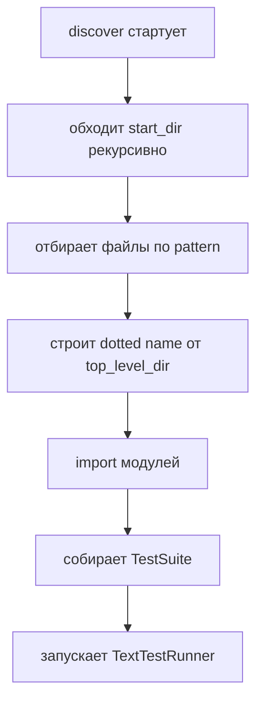

# Практика `unittest` discovery: как настроить запуск “под ваш проект” и быстро гонять подмножества тестов

Самая неприятная ситуация с unit‑тестами — когда тесты **есть**, а запуск ведёт себя непредсказуемо: локально запускается “что‑то”, в CI внезапно `Ran 0 tests`, или один и тот же модуль то импортируется, то нет. Почти всегда корень проблемы в том, что `unittest` discovery — это не “поиск файлов и запуск по путям”, а **поиск подходящих файлов → преобразование путей в имена модулей → импорт**. ([Python documentation][1])

## Discovery в `unittest` — это импорт: почему от этого зависит структура проекта

`unittest` прямо фиксирует контракт discovery: чтобы тесты были совместимы с discovery, все test‑файлы должны быть **модулями или пакетами, импортируемыми из top‑level директории проекта**; имена файлов должны быть валидными идентификаторами Python. ([Python documentation][1])

Ещё важнее следующее: после того как discovery нашёл файлы, он **превращает пути в package‑names для импорта**. Пример из документации: `foo/bar/baz.py` будет импортирован как `foo.bar.baz`. ([Python documentation][1])

Схема процесса выглядит так:



Если на шаге **E** импорт ломается (не тот `sys.path`, нет пакета, имя файла “не модуль”), тесты не будут собраны корректно.

> Discovery нельзя “починить” в тестах. Его чинят структурой проекта и параметрами `-s/-p/-t`. ([Python documentation][1])

## Три параметра, которыми настраивается 90% запусков: `-s`, `-p`, `-t`

Команда запуска discovery в базовом виде такая:

```bash
cd project_directory
python -m unittest discover
```

Её важно читать буквально: “перейти в корень проекта” и запустить discovery. ([Python documentation][1])

Дальше появляются три параметра:

- `-s/--start-directory` — откуда начинать обход (по умолчанию `.`). ([Python documentation][1])
- `-p/--pattern` — какие файлы считать тестами (по умолчанию `test*.py`). ([Python documentation][1])
- `-t/--top-level-directory` — “верх” проекта, от которого строятся dotted‑имена модулей (по умолчанию равен `start-directory`). ([Python documentation][1])

Здесь находится типовая ловушка: если `-t` не задан, он становится равным `-s`, и dotted‑имена тестов будут строиться **не от корня репозитория**, а от выбранной стартовой папки. Это влияет на импортируемость и на “полные имена” тестов (а значит — на фильтрацию `-k`). ([Python documentation][1])

### Мини‑таблица выбора `-s/-p/-t` под типовую структуру

Предположим, тесты лежат в `tests/`, а запуск всегда из корня репозитория.

| Задача                                             | Команда                                                         | Комментарий                                                            |
| -------------------------------------------------- | --------------------------------------------------------------- | ---------------------------------------------------------------------- |
| Запустить стандартные тесты `test*.py` из `tests/` | `python -m unittest discover -s tests -t . -v`                  | `-t .` делает dotted‑имена стабильными от корня проекта                |
| У Вас другой нейминг, например `*_spec.py`         | `python -m unittest discover -s tests -t . -p "*_spec.py" -v`   | `pattern` — shell‑style шаблон, а не regex ([Python documentation][1]) |
| Разделение на unit/integration по директориям      | `python -m unittest discover -s tests/unit -t . -p "test_*.py"` | Вторая команда аналогично для `tests/integration`                      |

`-v` здесь не “для красоты”. Это быстрый способ убедиться, что discovery реально нашёл нужные тесты и какие именно. ([Python documentation][1])

## Импортируемость: что должно быть “правильным”, чтобы discovery не развалился

### 1) Имена файлов и папок должны превращаться в валидные модульные имена

Если файл называется `test-calc.py`, dotted‑имя будет содержать `test-calc`, а это невалидно для импорта. `unittest` прямо говорит: загрузятся только модули с импортируемыми именами (валидные идентификаторы). ([Python documentation][1])

Рабочие имена:

- `test_calc.py`
- `pricing_spec.py`
- `auth_it.py`

Нерабочие:

- `test-calc.py`
- `2026_test.py`
- `test.calc.py` (точки — отдельная история, но почти всегда создают не то dotted‑имя, которое ожидается)

### 2) Пакеты и `__init__.py` в тестовых подпапках

Начиная с Python 3.14 в документации явно отмечено: чтобы не сканировать каталоги, не относящиеся к Python, тесты **не ищутся в поддиректориях, которые не содержат `__init__.py`**. ([Python documentation][1])

Практический эффект: если у Вас `tests/unit/` и `tests/integration/`, то наличие `__init__.py` в этих директориях перестаёт быть “традицией” и становится способом сделать discovery предсказуемым между окружениями.

### 3) `start_dir` может быть не только путём, но и dotted‑именем пакета

Можно передать стартовую директорию как имя пакета, например `myproject.subpackage.test`: этот пакет будет импортирован, и его location на диске будет использован как `start_dir`. ([Python documentation][1])

Это удобно, когда тесты живут внутри пакета, и Вы хотите запуск от “логического” имени, а не от относительных путей.

### 4) Важное предупреждение: можно импортировать “не ту копию” пакета

Discovery импортирует тесты. Если пакет установлен глобально и Вы запускаете discovery на другой копии пакета, импорт может произойти “не оттуда”, и `unittest` предупреждает и завершает работу. ([Python documentation][1])

Это типичный симптом “в venv всё ок, а на CI странно”. Лечится дисциплиной: запуск из корня проекта, корректный `-t`, понятный способ установки/подключения пакета (например, editable install) и отсутствие “двух копий” в `sys.path`.

## Быстрая диагностика, когда тесты не находятся или находятся “не те”

Ниже — минимальный набор проверок, который обычно закрывает `Ran 0 tests` за несколько минут.

1. Запуск из корня проекта, как в примере документации: `cd project_directory`. ([Python documentation][1])
2. Явно задать `-s` и `-t`, чтобы убрать неоднозначность: `-s tests -t .`. ([Python documentation][1])
3. Убедиться, что pattern совпадает с реальными именами файлов (`test*.py` по умолчанию). ([Python documentation][1])
4. Проверить импортируемость: нет дефисов в именах, папки на пути к тестам являются пакетами/доступны как пакеты; вложенные тестовые директории содержат `__init__.py` (особенно важно для новых версий). ([Python documentation][1])
5. Запустить с `-v`, чтобы увидеть, что реально исполняется. ([Python documentation][1])

## Подмножество тестов: два способа, которые нужны каждый день

### 1) Точечный запуск по полному имени (модуль/класс/метод)

`unittest` поддерживает запуск модулей, классов и отдельных методов через CLI. Это базовый “скальпель”, когда известно точное имя теста. ([Python documentation][1])

Примеры:

```bash
python -m unittest tests.test_calc
python -m unittest tests.test_calc.TestAdd
python -m unittest tests.test_calc.TestAdd.test_add_negative
```

### 2) Фильтрация по имени через `-k`

`-k` — быстрый “поиск по имени” без необходимости помнить dotted‑пути. Опция запускает только те тестовые классы и методы, которые совпали с подстрокой или шаблоном; `-k` можно указывать несколько раз (логика “OR”). Если в паттерне есть `*`, используется `fnmatch.fnmatchcase`, иначе — простое case‑sensitive совпадение по подстроке. Сопоставление идёт по **полностью квалифицированному имени** теста, как его импортировал loader. ([Python documentation][1])

Практические команды:

```bash
# Запустить всё, что содержит "discount" в полном имени
python -m unittest -v -k discount

# Запустить тесты, чьё имя подходит под wildcard-шаблон
python -m unittest -v -k "TestAuth*"

# Объединить фильтры
python -m unittest -v -k token -k refresh
```

Фильтрация особенно удобна вместе с discovery, потому что discovery даёт полный набор, а `-k` превращает его в “актуальный поднабор”.

## Как закрепить discovery-настройки в проекте: один вход, одинаковый для всех

Хорошая практика — не заставлять людей помнить длинную команду `discover -s ... -t ... -p ...`. Её можно “упаковать” в небольшой скрипт, который делает две вещи:

- кодом фиксирует `start_dir/pattern/top_level_dir`;
- даёт опцию `-k`, чтобы запускать подмножество без переписывания команд.

Ниже — пример такого скрипта. Он использует `TestLoader.discover()` (который рекурсивно собирает тестовые модули по `pattern`) и затем фильтрует suite по `test.id()` (это полностью квалифицированное имя). В документации `discover()` отдельно подчёркнуто, что загружаются только файлы, совпадающие с `pattern`, используются shell‑style шаблоны, и что все тестовые модули должны быть импортируемыми от top‑level; если `start_dir` не является top‑level, `top_level_dir` нужно указать. ([Python documentation][1])

```python
# tools/run_tests.py
from __future__ import annotations

import argparse
import fnmatch
import sys
import unittest
from typing import Iterable


def _iter_cases(suite: unittest.TestSuite) -> Iterable[unittest.TestCase]:
    """Разворачивает вложенные suites в плоский поток TestCase."""
    for item in suite:
        if isinstance(item, unittest.TestSuite):
            yield from _iter_cases(item)
        else:
            yield item


def _match_k(test_id: str, patterns: list[str]) -> bool:
    """
    Семантика как у unittest -k:
    - если в паттерне есть '*' -> fnmatchcase по полному имени
    - иначе -> case-sensitive поиск подстроки
    """
    for p in patterns:
        if "*" in p:
            if fnmatch.fnmatchcase(test_id, p):
                return True
        else:
            if p in test_id:
                return True
    return False


def build_suite(start: str, pattern: str, top: str, k: list[str]) -> unittest.TestSuite:
    loader = unittest.TestLoader()
    suite = loader.discover(start_dir=start, pattern=pattern, top_level_dir=top)

    if not k:
        return suite

    filtered = unittest.TestSuite()
    for case in _iter_cases(suite):
        if _match_k(case.id(), k):
            filtered.addTest(case)

    return filtered


def main(argv: list[str] | None = None) -> int:
    parser = argparse.ArgumentParser(
        description="Project test runner (unittest discovery wrapper)"
    )
    parser.add_argument(
        "-s", "--start", default="tests", help="Start directory for discovery"
    )
    parser.add_argument(
        "-p", "--pattern", default="test*.py", help="File pattern for tests (glob)"
    )
    parser.add_argument("-t", "--top", default=".", help="Top-level project directory")
    parser.add_argument(
        "-k",
        action="append",
        default=[],
        help="Filter by substring or fnmatch pattern; may be repeated",
    )
    parser.add_argument(
        "-v",
        "--verbose",
        action="count",
        default=0,
        help="Increase verbosity (-v, -vv)",
    )
    parser.add_argument(
        "-f", "--failfast", action="store_true", help="Stop on first fail/error"
    )
    parser.add_argument(
        "-b", "--buffer", action="store_true", help="Buffer stdout/stderr during tests"
    )

    args = parser.parse_args(argv)

    suite = build_suite(start=args.start, pattern=args.pattern, top=args.top, k=args.k)

    verbosity = 1 + args.verbose
    runner = unittest.TextTestRunner(
        verbosity=verbosity, failfast=args.failfast, buffer=args.buffer
    )
    result = runner.run(suite)

    return 0 if result.wasSuccessful() else 1


if __name__ == "__main__":
    raise SystemExit(main())
```

Такой файл выполняет роль “единых правил запуска” внутри репозитория. CI может вызывать ровно его, а локально можно быстро переключать поднаборы:

```bash
python tools/run_tests.py -s tests/unit -t . -p "*_spec.py" -v
python tools/run_tests.py -s tests/unit -t . -p "*_spec.py" -k discount -v -f
```

## Дополнительные материалы

Официальная документация `unittest`: CLI, опции `-k`, `-v`, `-b`, `-f`, `--locals`, `--durations`; правила сопоставления `-k` с `fnmatch.fnmatchcase` и “полным именем теста”. ([Python documentation][1])
Официальная документация `unittest`: раздел Test Discovery, опции `-s/-p/-t`, требование импортируемости, преобразование путей в package‑names, предупреждение про импорт “не той копии” пакета, изменения по версиям (в т.ч. про `__init__.py`). ([Python documentation][1])
Официальная документация `unittest`: `TestLoader.discover()` — pattern, importable module names, необходимость `top_level_dir`, поведение `load_tests`. ([Python documentation][1])

# Практическое задание

## Цель

Настроить `unittest` discovery под конкретную структуру проекта: выбрать `start-directory`, свой `pattern` для unit‑тестов, зафиксировать `top-level-directory` для стабильных импортов и научиться запускать подмножество тестов (через `-k` и через полный dotted‑путь).

## Задание (шаги)

1. Создайте структуру проекта (специально с нестандартными паттернами, чтобы пришлось настраивать `-p`):

```text
discovery-lab/
├─ src/
│  └─ shop/
│     ├─ __init__.py
│     └─ pricing.py
├─ tests/
│  ├─ __init__.py
│  ├─ unit/
│  │  ├─ __init__.py
│  │  └─ pricing_spec.py
│  └─ integration/
│     ├─ __init__.py
│     └─ pricing_it.py
└─ tools/
   └─ run_tests.py
```

2. В `src/shop/pricing.py` создайте функцию с ветвлениями и явным контрактом:

```python
# src/shop/pricing.py
def final_price_cents(
    base_cents: int, discount_percent: int = 0, tax_percent: int = 20
) -> int:
    """
    Контракт:
    - base_cents: int, >= 0
    - discount_percent: int, 0..100
    - tax_percent: int, 0..100
    Логика:
    - discount применяется к base
    - затем добавляется tax
    - результат округляется до целых центов (int)
    """
    raise NotImplementedError
```

3. В `tests/unit/pricing_spec.py` напишите unit‑тесты (минимум 6–8 проверок): базовый сценарий, крайние значения процентов (0 и 100), неправильные типы (например, `None`, `str`), отрицательная база, проценты за границами. Имена тестов должны содержать ключевые слова вроде `discount`, `tax`, `invalid`.

4. В `tests/integration/pricing_it.py` напишите 2–3 “интеграционных” теста на сценарии (например, цепочка вычислений с несколькими значениями). Здесь цель не “настоящая интеграция”, а наличие второго набора тестов с другим паттерном `_it.py`.

5. Настройте discovery‑команды так, чтобы они запускали **только нужный набор**:

- только unit‑тесты (`*_spec.py` из `tests/unit`):

```bash
python -m unittest discover -s tests/unit -t . -p "*_spec.py" -v
```

- только integration‑тесты (`*_it.py` из `tests/integration`):

```bash
python -m unittest discover -s tests/integration -t . -p "*_it.py" -v
```

6. Научитесь запускать “подмножество” unit‑тестов:

- через `-k` (например, только тесты, где в имени есть `discount`):

```bash
python -m unittest discover -s tests/unit -t . -p "*_spec.py" -k discount -v
```

- через полное имя метода (должно работать, потому что `tests/unit` — пакет и модуль импортируется как `tests.unit.pricing_spec`):

```bash
python -m unittest tests.unit.pricing_spec.TestFinalPrice.test_discount_100
```

7. Скопируйте в `tools/run_tests.py` обёртку‑раннер из материала (или реализуйте аналог) и закрепите в ней “канонические” значения по умолчанию: `-t .`, `-s tests/unit`, `-p "*_spec.py"`. Добейтесь, чтобы работало:

```bash
python tools/run_tests.py -v
python tools/run_tests.py -k discount -v
python tools/run_tests.py -s tests/integration -p "*_it.py" -v
```

## Подсказки по ключевым частям

- `-t .` — это способ сделать dotted‑имена модулей и `test.id()` стабильными относительно корня проекта; это влияет на импорт и на предсказуемость фильтрации по `-k`. ([Python documentation][1])
- `pattern` — shell‑style шаблон. Начните с точного (`"*_spec.py"`), чтобы не зацепить лишние файлы. ([Python documentation][1])
- Если видите `Ran 0 tests`, первым делом проверьте: запускаетесь из корня проекта, `tests/unit` содержит `__init__.py`, имена файлов — валидные идентификаторы. ([Python documentation][1])
- `-k` матчится по **полностью квалифицированному имени** теста; wildcard `*` работает через `fnmatchcase`, иначе — подстрока. ([Python documentation][1])

## Что проверить перед отправкой (чек-лист)

- [ ] Команда unit‑discovery запускает тесты и не даёт `Ran 0 tests`:
      `python -m unittest discover -s tests/unit -t . -p "*_spec.py" -v` ([Python documentation][1])
- [ ] Команда integration‑discovery запускает тесты:
      `python -m unittest discover -s tests/integration -t . -p "*_it.py" -v` ([Python documentation][1])
- [ ] `-k` реально фильтрует поднабор (меняется число запущенных тестов):
      `... -k discount -v` ([Python documentation][1])
- [ ] Точечный запуск по полному dotted‑имени теста работает (модуль/класс/метод). ([Python documentation][1])
- [ ] В `tests/`, `tests/unit/`, `tests/integration/` есть `__init__.py`, чтобы discovery и импорты были предсказуемыми. ([Python documentation][1])
- [ ] В тестовых файлах нет тяжёлых побочных эффектов на уровне импорта (подключения к сети/БД/файлам “при импорте”). Discovery импортирует тесты. ([Python documentation][1])

## Советы по улучшению работы

- Зафиксируйте канонический запуск в одном месте (скрипт `tools/run_tests.py`, Makefile‑таргет или README). Это снижает риск “у меня запускается, у вас — нет”.
- Для отладки используйте связку `-v` + `-k` + `-f`: видно имена, запускается поднабор, остановка на первом дефекте. ([Python documentation][1])
- Если часть тестов “вдруг стала долгой”, подключайте `--durations 10`, чтобы видеть топ‑медленных и оптимизировать точечно. ([Python documentation][1])
- Если команда discovery ведёт себя “магически”, временно упростите: один каталог (`-s tests/unit`), один паттерн (`-p "*_spec.py"`), `-t .`, verbose. Затем усложняйте по одному параметру.

[1]: https://docs.python.org/3/library/unittest.html "unittest — Unit testing framework — Python 3.14.3 documentation"
