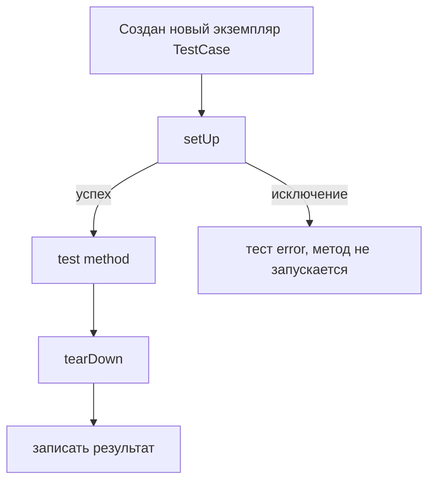
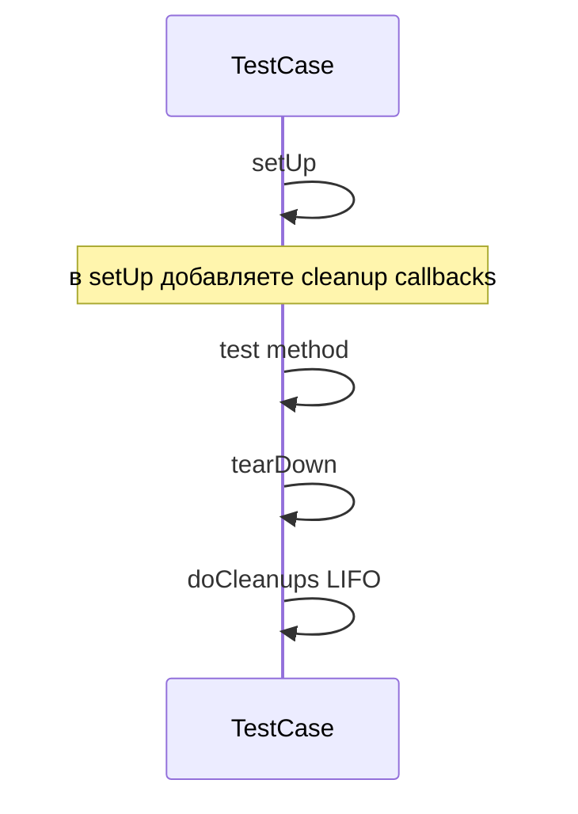

# `setUp()` / `tearDown()` в `unittest`: что гарантирует фреймворк и как писать подготовку/очистку без утечек

Тесты начинают “плыть” не в момент, когда Вы написали плохой `assert`, а когда **фикстуры перестают быть изолированными**. Типичная картина: один тест проходит при запуске отдельно, но падает в наборе; прогон стал нестабильным; временные файлы остаются на диске; моки “протекают” в соседние тесты; окружение (`os.environ`) меняется и не возвращается обратно. Почти всегда это означает, что код подготовки и очистки написан без учёта того, **какие вызовы реально гарантирует `unittest`**, и что будет, если тест упадёт “в неудобный момент”.

## Что именно гарантирует `unittest` в жизненном цикле теста

В `unittest` фикстура — это рабочее окружение теста: созданные объекты, подготовленные данные, открытые ресурсы. Фреймворк предлагает два ключевых “хука” на уровне одного тестового метода:

- `setUp()` вызывается **непосредственно перед** тестовым методом.
- `tearDown()` вызывается **сразу после** тестового метода и фиксации результата выполнения. ([Python documentation][1])

Но важно не только “до/после”, а условия вызова:

1. Если `setUp()` поднял исключение, `unittest` считает это ошибкой теста, **сам тестовый метод не выполнится**. ([Python documentation][1])
2. `tearDown()` будет вызван **только если `setUp()` завершился успешно**, и будет вызван независимо от того, прошёл тест или упал. ([Python documentation][1])
3. `tearDown()` вызывается даже если тестовый метод выбросил исключение, поэтому в `tearDown()` нельзя “предполагать нормальное состояние” и нужно аккуратно проверять, что успело создаться. ([Python documentation][1])
4. На каждый тестовый метод создаётся **новый экземпляр `TestCase`**, то есть `self` — уникальная фикстура конкретного теста; `setUp()` и `tearDown()` вызываются один раз на тестовый метод. ([Python documentation][1])

Визуально жизненный цикл одного теста выглядит так:



Слабое место в этой схеме видно сразу: если Вы открыли ресурс в `setUp()`, а затем `setUp()` упал до конца, то `tearDown()` **не будет вызван** — и ресурс может утечь.

## Почему `tearDown()` не спасает от утечек

Ментальная ловушка выглядит так: “я закрою всё в `tearDown()`”. Это работает только при условии, что `setUp()` всегда доходит до конца. А в реальной жизни `setUp()` падает:

- из‑за ошибки в тестовых данных,
- из‑за опечатки в импорте,
- из‑за `SkipTest`,
- из‑за неожиданного исключения при подготовке окружения.

Фреймворк прямо предупреждает: `tearDown()` вызывается только если `setUp()` успешен. ([Python documentation][1])
Отсюда следствие: **ресурс нужно “прикреплять” к очистке сразу в момент успешного захвата**, а не “в конце setUp” и не “потом в tearDown”.

> Надёжная фикстура — это фикстура, которая корректно освобождает ресурсы даже при частично выполненном `setUp()`.

## `addCleanup()` и стек очистки: главный инструмент против утечек

В `unittest` есть механизм “cleanup stack” на уровне `TestCase`:

- `addCleanup(func, *args, **kwargs)` регистрирует функцию очистки.
- Эти функции вызываются **после `tearDown()`** в порядке LIFO (последняя добавленная — выполняется первой). ([Python documentation][1])
- Если `setUp()` упал (а значит `tearDown()` не будет), cleanup‑функции **всё равно будут вызваны**. ([Python documentation][1])
- `doCleanups()` вызывается фреймворком безусловно после `tearDown()`, либо после `setUp()`, если `setUp()` выбросил исключение. ([Python documentation][1])

Схема порядка вызовов:



Почему LIFO важно: обычно ресурсы создаются “снаружи внутрь” (директория → файл → дескриптор), а освобождаться должны “изнутри наружу” (сначала закрыть файл, потом удалить директорию). Стек как раз делает это автоматически.

## Практический паттерн: “сначала захват — сразу `addCleanup` — потом работа”

Эту последовательность стоит зафиксировать как стиль:

1. Захватили ресурс.
2. Немедленно зарегистрировали, как его освобождать.
3. Только потом делаете остальную подготовку, которая может упасть.

Это устраняет класс утечек “частичный `setUp()`”.

## Пример 1: временная директория для теста без мусора на диске

`tempfile.TemporaryDirectory()` — контекстный менеджер, который удаляет созданную директорию и её содержимое при выходе из контекста (или при явной очистке через `cleanup()`). ([Python documentation][2])

Если Вам нужна временная директория на время теста, можно сделать это в `setUp()` двумя способами: через `addCleanup()` или через `enterContext()` (Python 3.11+).

### Вариант A: через `addCleanup()` (работает везде)

```python
import tempfile
import unittest
from pathlib import Path


class TestExport(unittest.TestCase):
    def setUp(self) -> None:
        # 1) Захват
        tmp = tempfile.TemporaryDirectory()
        # 2) Сразу закрепили очистку (сработает даже если setUp упадёт)
        self.addCleanup(tmp.cleanup)

        # 3) Дальше используете уже безопасно
        self.tmp_path = Path(tmp.name)

    def test_creates_report_file(self):
        report = self.tmp_path / "report.txt"
        report.write_text("ok", encoding="utf-8")

        self.assertTrue(report.exists())
```

Здесь важен не `tempfile`, а сам принцип: очистка регистрируется сразу после захвата ресурса, а не “где‑то потом”. `addCleanup()` гарантирует вызов даже при падении `setUp()`. ([Python documentation][1])

### Вариант B: через `enterContext()` (Python 3.11+)

`TestCase.enterContext(cm)` входит в контекстный менеджер и автоматически добавляет его `__exit__` как cleanup‑функцию через `addCleanup`. ([Python documentation][1])

```python
import tempfile
import unittest
from pathlib import Path


class TestExport(unittest.TestCase):
    def setUp(self) -> None:
        tmp_name = self.enterContext(tempfile.TemporaryDirectory())
        self.tmp_path = Path(tmp_name)

    def test_creates_report_file(self):
        report = self.tmp_path / "report.txt"
        report.write_text("ok", encoding="utf-8")
        self.assertTrue(report.exists())
```

Такой код компактнее и сложнее “сломать”, потому что Вам не нужно помнить про `cleanup()` вручную: `enterContext()` делает это за Вас. ([Python documentation][1])

## Пример 2: моки и патчи в `setUp()` без протекания в другие тесты

Патчинг — это изменение глобального состояния (атрибут модуля/класса). В документации `unittest.mock` подчёркивается: если патч не снять, он будет “жить” дальше и ломать соседние тесты, поэтому патч должен быть отменён после теста. ([Python documentation][3])

У `patch()` есть два режима: декоратор/контекстный менеджер и “ручной” start/stop. Для `setUp()` часто используют start/stop, но у этого подхода есть проблема: если `setUp()` упадёт, `tearDown()` не вызовется — патч останется. `unittest.mock` прямо показывает решение: привязать `patcher.stop` через `addCleanup()`. ([Python documentation][3])

```python
import unittest
from unittest.mock import patch
import mymodule


class TestService(unittest.TestCase):
    def setUp(self) -> None:
        patcher = patch("mymodule.TIMEOUT_SECONDS", 1)
        self.addCleanup(patcher.stop)  # гарантированно снимет патч
        patcher.start()

    def test_uses_timeout(self):
        self.assertEqual(mymodule.TIMEOUT_SECONDS, 1)
```

Здесь `tearDown()` может вообще не понадобиться: патч будет снят cleanup‑механизмом в любом случае. Логика “фиксируем уборку сразу после успешного захвата” остаётся такой же, как и с файловыми ресурсами. ([Python documentation][3])

## Как писать `tearDown()` так, чтобы он не ухудшал диагностику

`tearDown()` вызывается после тестового метода и после фиксации результата. Если `tearDown()` сам выбросит исключение, это будет засчитано как **дополнительная ошибка**, увеличивая количество ошибок и усложняя чтение отчёта. ([Python documentation][1])

Практическое следствие: `tearDown()` должен быть максимально “неубиваемым” и не добавлять шум.

Две рабочие техники:

1. Проверять, что атрибут реально создан, прежде чем его использовать. Это особенно важно, если объект создаётся в середине `setUp()` и потенциально не успел появиться.

2. Подавлять ожидаемые ошибки очистки (например, файл уже удалён). Для этого удобно использовать `contextlib.suppress`, который глушит указанные исключения внутри блока `with`. ([Python documentation][4])

Пример “устойчивого” `tearDown()`:

```python
import os
import unittest
from contextlib import suppress


class TestEnv(unittest.TestCase):
    def setUp(self):
        self._old = os.environ.get("APP_MODE")
        os.environ["APP_MODE"] = "test"

    def tearDown(self):
        # Не добавляем новых ошибок в отчёт
        with suppress(KeyError):
            if self._old is None:
                del os.environ["APP_MODE"]
            else:
                os.environ["APP_MODE"] = self._old
```

В реальных проектах для словарей окружения часто используют `patch.dict()` как контекстный менеджер; он сам возвращает состояние назад (и не требует ручного `tearDown`). В примерах `unittest.mock` показано, что `patch.dict()` восстанавливает исходное содержимое после выхода из контекста. ([Python documentation][3])

## Мини‑инфографика: когда использовать `tearDown()`, а когда `addCleanup()`

| Ситуация                                                     |    Лучше `tearDown()` |                                             Лучше `addCleanup()` |
| ------------------------------------------------------------ | --------------------: | ---------------------------------------------------------------: |
| Очистка всегда возможна и объект всегда создаётся            |                иногда |                                                               да |
| `setUp()` может упасть после частичной подготовки            |                   нет |     да (cleanup всё равно вызовется) ([Python documentation][1]) |
| Нужен гарантированный порядок “закрыть → удалить → откатить” | сложно контролировать |                        удобно (LIFO) ([Python documentation][1]) |
| Нужно освободить ресурс раньше конца теста                   |  вручную и рискованно | можно вызвать `doCleanups()` вручную ([Python documentation][1]) |

## Частые ошибки фикстур, которые делают тесты хрупкими

### Очистка “в конце” вместо “сразу после захвата”

Если ресурс создаётся, а очистка регистрируется только в конце `setUp()`, любое исключение между этими точками оставит мусор. Убирается паттерном “захват → сразу cleanup”.

### Глобальное состояние без возврата

Любое изменение глобального состояния (патч, `os.environ`, глобальные настройки) обязано иметь обратную операцию. У патчей это `stop()`, и документация прямо подчёркивает необходимость “undo”. ([Python documentation][3])

### Слишком “умный” `tearDown()`

`tearDown()` должен быть простым. Чем больше логики в очистке, тем выше шанс, что очистка начнёт падать и будет маскировать первопричину. Это особенно критично, потому что `tearDown()` выполняется даже после исключения в тесте. ([Python documentation][1])

## Итоги

`setUp()`/`tearDown()` — это не просто “два метода по соглашению”, а контракт с чёткими условиями вызова: `tearDown()` работает только если `setUp()` завершился успешно. ([Python documentation][1])
Чтобы фикстуры не текли и тесты не становились флаковыми, используйте `addCleanup()` как стандартный механизм освобождения ресурсов: он выполняется после `tearDown()` и всё равно выполняется, если `setUp()` упал, причём в порядке LIFO. ([Python documentation][1])
Если ресурс уже является контекстным менеджером, `TemporaryDirectory()` и похожие API позволяют строить фикстуры так, чтобы очистка была автоматической и воспроизводимой. ([Python documentation][2])

## Дополнительные материалы

Документация `unittest`: жизненный цикл `setUp()`/`tearDown()`, уникальный `TestCase` на тест, семантика исключений в фикстурах, `addCleanup()`/`doCleanups()`/`enterContext()`. ([Python documentation][1])
Документация `unittest.mock`: управление патчами, пример “start/stop в setUp/tearDown” и рекомендация использовать `addCleanup()` из‑за падений в `setUp()`. ([Python documentation][3])
Документация `tempfile`: `TemporaryDirectory`, `cleanup()`, поведение удаления на выходе из контекста. ([Python documentation][2])
Документация `contextlib`: `suppress()` как инструмент безопасной очистки без лишних ошибок. ([Python documentation][4])

[1]: https://docs.python.org/3/library/unittest.html "unittest — Unit testing framework — Python 3.14.3 documentation"
[2]: https://docs.python.org/3/library/tempfile.html "tempfile — Generate temporary files and directories — Python 3.14.3 documentation"
[3]: https://docs.python.org/3/library/unittest.mock-examples.html "unittest.mock — getting started — Python 3.14.3 documentation"
[4]: https://docs.python.org/3/library/contextlib.html "contextlib — Utilities for with-statement contexts — Python 3.14.3 documentation"
