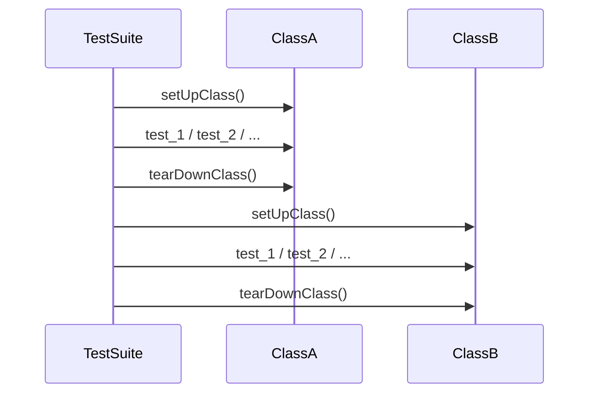

# `setUpClass()` / `tearDownClass()` в `unittest`: дорогие ресурсы, общие фикстуры и типовые ловушки

`setUp()` и `tearDown()` решают задачу “каждый тест в своём пузыре”: подготовили окружение → проверили → убрали за собой. Но иногда подготовка настолько дорогая, что такой подход превращает прогон в ожидание: 200 тестов по 2 секунды подготовки — и Вы уже не тестируете, а смотрите на spinner. Именно для этого в `unittest` существуют **классовые фикстуры**: `setUpClass()` и `tearDownClass()` — единая подготовка/очистка для всех тестов внутри одного `TestCase`‑класса. ([Python documentation][1])

Цена ускорения — **потеря изоляции**: общий ресурс становится общей точкой отказа, а неосторожная мутация превращает тесты в цепочку зависимостей. Документация предупреждает об этом напрямую:

> “Shared fixtures … break test isolation.” ([Python documentation][1])

## Что гарантирует фреймворк: когда вызываются `setUpClass()` и `tearDownClass()`

`setUpClass()` — это **classmethod**, вызываемый **перед запуском тестов данного класса**. Он получает единственный аргумент `cls` и должен быть оформлен как `@classmethod`. ([Python documentation][1])
`tearDownClass()` — тоже **classmethod**, вызываемый **после того, как тесты класса отработали**. ([Python documentation][1])

Минимальный шаблон:

```python
import unittest


class TestSomething(unittest.TestCase):
    @classmethod
    def setUpClass(cls):
        cls.resource = object()  # создать дорогой ресурс

    @classmethod
    def tearDownClass(cls):
        cls.resource = None  # освободить ресурс
```

Это выглядит как “один раз на класс”, но важно понимать механизм, потому что он объясняет несколько неожиданных эффектов.

## Как устроен порядок вызовов: почему это важно для ловушек

Классовые и модульные фикстуры реализованы на уровне `TestSuite`. Когда suite встречает тест **из нового класса**, он вызывает `tearDownClass()` предыдущего класса (если он был), а затем `setUpClass()` нового класса. После завершения всех тестов вызывается финальный `tearDownClass()`. ([Python documentation][1])

Визуально это похоже на переключение контекста:



Есть два принципиальных следствия.

Первое: **общие фикстуры плохо сочетаются с параллелизацией и рандомизацией порядка тестов**. Это указано в документации: shared fixtures “не играют хорошо” с потенциальной параллелизацией, ломают изоляцию и должны использоваться осторожно. ([Python documentation][1])

Второе: в стандартной загрузке `unittest` тесты группируются по модулям и классам, поэтому `setUpClass()`/`tearDownClass()` обычно вызываются “ровно один раз на класс”. Но если порядок тестов **перемешан** так, что рядом оказываются тесты из разных классов/модулей, shared‑фикстуры могут вызываться **несколько раз за один прогон**. Документация прямо описывает это как ограничение: shared fixtures не предназначены для suites с нестандартным порядком. ([Python documentation][1])

Практический вывод: в `setUpClass()` нельзя закладываться на “гарантированно один раз за весь прогон” в широком смысле. Гарантия сильнее звучит так: “вызывается при входе в класс в рамках текущего порядка suite”.

## Когда `setUpClass()` действительно оправдан

`setUpClass()` стоит включать не “для красоты”, а когда есть измеримая причина.

Хорошие кандидаты:

- **Дорогие внешние ресурсы**, которые бессмысленно поднимать на каждый тест: тяжёлая коннекция, поднятие сервиса, подготовка большого датасета. (В документации прямо приводится пример “createExpensiveConnectionObject”.) ([Python documentation][1])
- **Дорогая, но неизменяемая подготовка**, которую можно сделать один раз и затем использовать как read‑only.
- **Кеширование**: один раз прочитать большой файл/JSON, один раз собрать индекс, один раз сгенерировать большой набор эталонных данных.

Плохие кандидаты:

- Всё, что легко создать/удалить за миллисекунды.
- Всё, что тесты будут менять (или могут поменять по ошибке).
- Всё, что зависит от порядка тестов.

## Ловушка №1: общий ресурс становится общей мутацией

Самая частая ошибка: подготовить объект в `setUpClass()` и позволить тестам его менять.

Ниже пример, который выглядит безобидно, но создаёт зависимость от порядка:

```python
import unittest


class TestSharedList(unittest.TestCase):
    @classmethod
    def setUpClass(cls):
        cls.items = ["a", "b", "c"]  # общий mutable объект

    def test_remove(self):
        self.items.remove("b")
        self.assertNotIn("b", self.items)

    def test_len(self):
        # Этот тест "случайно" зависит от test_remove()
        self.assertEqual(len(self.items), 3)
```

Если `test_remove` выполнится раньше — `test_len` упадёт. Если порядок поменяется — упадёт в другом месте. Это и есть нарушение изоляции.

Два практических способа исправить, не отказываясь от `setUpClass()`:

**Вариант A: в `setUpClass()` держать “эталон”, а в `setUp()` — копию на тест.**

```python
import unittest
import copy


class TestCopyPerTest(unittest.TestCase):
    @classmethod
    def setUpClass(cls):
        cls._items_template = ["a", "b", "c"]  # read-only шаблон

    def setUp(self):
        self.items = copy.deepcopy(self._items_template)  # новая копия на тест

    def test_remove(self):
        self.items.remove("b")
        self.assertNotIn("b", self.items)

    def test_len(self):
        self.assertEqual(len(self.items), 3)
```

**Вариант B: сделать общий объект неизменяемым** (кортеж, frozenset, dataclass(frozen=True) и т.п.) и тестировать только чтение.

Оба варианта сохраняют смысл `setUpClass()` (дорогая подготовка) и возвращают изоляцию на уровне теста.

## Ловушка №2: `tearDownClass()` не вызовется, если `setUpClass()` упал

Документация `unittest` фиксирует поведение явно: если в `setUpClass()` поднято исключение, тесты класса не запускаются и `tearDownClass()` не выполняется. Исключение `SkipTest` при этом помечает класс как skipped, а не error. ([Python documentation][1])

Это означает: если Вы открыли ресурс в `setUpClass()` и после этого случилась ошибка — ресурс может утечь.

Правильный инструмент здесь — **`addClassCleanup()`**: он регистрирует функции очистки, которые выполняются после `tearDownClass()`, в порядке LIFO. И ключевое: даже если `setUpClass()` упал (а значит `tearDownClass()` не вызовется), зарегистрированные class‑cleanup функции всё равно будут вызваны. ([Python documentation][1])

Надёжный шаблон “взял ресурс → сразу прикрепил очистку”:

```python
import json
import tempfile
import unittest
from pathlib import Path


class TestWithClassFixture(unittest.TestCase):
    @classmethod
    def setUpClass(cls):
        tmp = tempfile.TemporaryDirectory()
        cls.addClassCleanup(tmp.cleanup)  # гарантированная уборка
        cls.tmp_path = Path(tmp.name)

        # имитируем "дорогую" подготовку: большой fixture-файл
        cls.fixture_file = cls.tmp_path / "rates.json"
        cls.fixture_file.write_text(
            json.dumps({"vat": 20, "discount": 10}), encoding="utf-8"
        )

        # дальше может быть код, который потенциально падает
        cls.rates = json.loads(cls.fixture_file.read_text(encoding="utf-8"))

    def test_vat_present(self):
        self.assertIn("vat", self.rates)

    def test_discount_present(self):
        self.assertIn("discount", self.rates)
```

Если в середине `setUpClass()` вылетит исключение, `tmp.cleanup()` всё равно будет вызван, потому что он уже зарегистрирован через `addClassCleanup()`. ([Python documentation][1])

### `enterClassContext()` — компактнее, если Python ≥ 3.11

Начиная с Python 3.11 есть `enterClassContext(cm)`: он входит в context manager и автоматически добавляет `__exit__` как class‑cleanup. ([Python documentation][1])

```python
import tempfile
import unittest
from pathlib import Path


class TestEnterClassContext(unittest.TestCase):
    @classmethod
    def setUpClass(cls):
        tmp_name = cls.enterClassContext(tempfile.TemporaryDirectory())
        cls.tmp_path = Path(tmp_name)
```

## Ловушка №3: наследование `TestCase` и “почему не сработало”

Если у Вас есть базовый класс с `setUpClass()` и дочерний класс, который тоже определяет `setUpClass()`, то базовый `setUpClass()` **не будет вызван автоматически** — нужно вызвать его вручную через `super()`. Документация прямо говорит: если Вы хотите, чтобы `setUpClass`/`tearDownClass` базовых классов выполнялись, “нужно вызывать их самим”; реализации в `unittest.TestCase` пустые. ([Python documentation][1])

Пример правильного наследования:

```python
import unittest


class BaseDBTests(unittest.TestCase):
    @classmethod
    def setUpClass(cls):
        super().setUpClass()
        cls.base_resource = "base"

    @classmethod
    def tearDownClass(cls):
        cls.base_resource = None
        super().tearDownClass()


class TestFeature(BaseDBTests):
    @classmethod
    def setUpClass(cls):
        super().setUpClass()  # иначе base_resource не будет готов
        cls.feature_flag = True

    @classmethod
    def tearDownClass(cls):
        cls.feature_flag = False
        super().tearDownClass()

    def test_flag(self):
        self.assertTrue(self.feature_flag)
        self.assertEqual(self.base_resource, "base")
```

## Ловушка №4: патчи и моки на уровне класса

Иногда хочется пропатчить что‑то один раз “на весь класс”, потому что патч дорогой или потому что он нужен почти всем тестам. Это допустимо, но опять же важно не протечь.

У `unittest.mock` патчеры имеют методы `start()` и `stop()`, которые удобны именно для фикстур (включая `setUp`‑стиль). ([Python documentation][2])
На уровне класса паттерн будет таким же, как и с временной директорией: “start → сразу addClassCleanup(stop)”.

```python
import unittest
from unittest.mock import patch


class TestPatchingOnce(unittest.TestCase):
    @classmethod
    def setUpClass(cls):
        cls._patcher = patch("time.sleep", return_value=None)
        cls.mock_sleep = cls._patcher.start()
        cls.addClassCleanup(
            cls._patcher.stop
        )  # гарантирует stop даже при сбое setUpClass

    def test_sleep_is_patched(self):
        import time

        time.sleep(10)
        self.mock_sleep.assert_called()
```

Почему именно так: `stop()` обязателен, потому что патч меняет глобальное состояние; `addClassCleanup()` гарантирует снятие патча даже если `setUpClass()` упал и `tearDownClass()` не будет вызван. ([Python documentation][1])

## Ловушка №5: “ошибка не привязана к тесту” и отчёт выглядит странно

Когда исключение происходит в shared‑фикстуре (например, в `setUpClass()`), это **ошибка прогона**, но не ошибка конкретного тестового метода: фреймворк создаёт специальный объект‑держатель ошибки (`_ErrorHolder`), чтобы отобразить её в результатах. Это деталь, которую редко нужно помнить ежедневно, но она объясняет, почему отчёт иногда показывает “ошибку класса”, а не “провал test\_\*”. ([Python documentation][1])

Практический совет здесь простой: в `setUpClass()` полезно делать ранние проверки и падать максимально информативно (с понятным текстом, с указанием, какой ресурс не поднялся). Это экономит время на диагностике.

## Рабочие правила использования `setUpClass()` без деградации качества тестов

Ниже — компактные правила, которые обычно предотвращают 80% проблем.

**Правило 1.** В `setUpClass()` создавайте только то, что действительно дорого, и старайтесь сделать это “read‑only”.
**Правило 2.** Если объект может быть изменён тестом, держите в классе “шаблон”, а на тест создавайте копию в `setUp()`.
**Правило 3.** Любой ресурс, захваченный в `setUpClass()`, должен немедленно получить `addClassCleanup()` (или `enterClassContext()`), иначе утечка при сбое подготовки почти гарантирована. ([Python documentation][1])
**Правило 4.** Не рассчитывайте на shared‑фикстуры при параллельном запуске/нестандартном порядке. Документация предупреждает: shared fixtures ломают изоляцию и не рассчитаны на такие режимы. ([Python documentation][1])
**Правило 5.** При наследовании `TestCase` всегда явно вызывайте `super().setUpClass()` / `super().tearDownClass()` там, где это нужно. ([Python documentation][1])

## Заключение

`setUpClass()`/`tearDownClass()` — инструмент для ускорения, но не “универсальная замена” `setUp()`/`tearDown()`. Фреймворк гарантирует вызов `setUpClass()` до тестов класса и `tearDownClass()` после, но при ошибке в `setUpClass()` тесты не выполнятся и `tearDownClass()` не будет вызван. ([Python documentation][1])
Чтобы не получить утечки и нестабильность, используйте `addClassCleanup()` (или `enterClassContext()`), держите общий ресурс неизменяемым или делайте копии на тест, и помните, что shared fixtures плохо совместимы с параллелизацией и нестандартным порядком выполнения. ([Python documentation][1])

## Дополнительные материалы

Официальная документация `unittest`: секция **Class and Module Fixtures**, описание `setUpClass`/`tearDownClass`, порядок вызовов в `TestSuite`, предупреждения про параллелизацию/рандомизацию, `addClassCleanup`/`enterClassContext`/`doClassCleanups`. ([Python documentation][1])
Официальная документация `unittest.mock`: секция про `patcher.start()`/`patcher.stop()` и зачем они нужны в фикстурах. ([Python documentation][2])

[1]: https://docs.python.org/3/library/unittest.html "unittest — Unit testing framework — Python 3.14.3 documentation"
[2]: https://docs.python.org/3/library/unittest.mock.html?utm_source=chatgpt.com "unittest.mock — mock object library"
