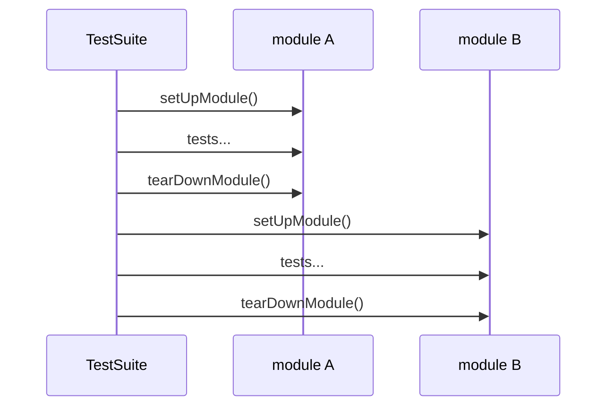

# `setUpModule()` / `tearDownModule()` в `unittest`: модульные фикстуры для общего окружения

Если в тестовом модуле много классов `TestCase`, но всем им нужно одно и то же “общее окружение” (дорогая подготовка, общий набор данных, временная рабочая директория, поднятый сервис‑заглушка), повторять это в `setUp()` каждого теста — прямой путь к медленному прогону. Модульные фикстуры `setUpModule()` и `tearDownModule()` решают эту задачу: подготовка делается один раз “на модуль”, а не “на тест” или “на класс”. ([Python documentation][1])

Цена ускорения — риск потери изоляции и утечек ресурсов. `unittest` честно предупреждает: shared‑фикстуры (к ним относятся и модульные) ломают изоляцию тестов и плохо сочетаются с потенциальной параллелизацией. Использовать их нужно аккуратно. ([Python documentation][1])

## Что такое модульная фикстура и как она выглядит в коде

Модульная фикстура — это **две функции уровня модуля** (не методы класса):

- `setUpModule()` — запускается перед тестами в модуле;
- `tearDownModule()` — запускается после тестов в модуле. ([Python documentation][1])

Минимальный шаблон:

```python
# tests/test_payments.py
import unittest

_connection = None


def setUpModule():
    global _connection
    _connection = create_connection()  # дорого


def tearDownModule():
    global _connection
    _connection.close()
    _connection = None


class TestCard(unittest.TestCase):
    def test_charge(self):
        self.assertTrue(_connection.is_alive())


class TestRefund(unittest.TestCase):
    def test_refund(self):
        self.assertTrue(_connection.is_alive())
```

`unittest` прямо показывает, что `setUpModule`/`tearDownModule` “должны быть реализованы как функции”. ([Python documentation][1])

## Где модульный уровень уместен среди остальных фикстур

Чтобы выбирать уровень фикстуры осознанно, удобно держать в голове четыре “масштаба” подготовки:

| Масштаб            | Хук                                           | Когда вызывается                            | Сильная сторона            | Главный риск                      |
| ------------------ | --------------------------------------------- | ------------------------------------------- | -------------------------- | --------------------------------- |
| На тест            | `setUp/tearDown`                              | перед/после каждого `test_*`                | максимальная изоляция      | медленно при дорогих ресурсах     |
| На класс           | `setUpClass/tearDownClass`                    | вокруг всех тестов одного `TestCase`‑класса | ускоряет класс             | общий mutable‑стейт внутри класса |
| На модуль          | `setUpModule/tearDownModule`                  | вокруг всех тестов одного файла             | ускоряет модуль            | общий стейт для разных классов    |
| “Аварийная уборка” | `addCleanup/addClassCleanup/addModuleCleanup` | гарантированная очистка                     | спасает при падениях setup | требует дисциплины                |

Для модульного уровня правило простое: если ресурс нужен **нескольким классам в одном тестовом файле**, и подготовка ощутимо дорогая — модульный уровень имеет смысл. Если ресурс нужен только одному классу — чаще достаточно `setUpClass`. Если ресурс дешёвый — держите его на уровне `setUp` для изоляции.

## Гарантии `unittest`: порядок вызова, ошибки и пропуски

### Как `unittest` “переключается” между модулями

Модульные фикстуры реализованы на уровне `TestSuite`: если следующий тест относится к **другому модулю**, то сначала выполняется `tearDownModule` предыдущего модуля, затем `setUpModule` нового. После завершения всех тестов выполняется финальный `tearDownModule`. ([Python documentation][1])

Схема переключения модулей:



### Почему `setUpModule()` может вызываться больше одного раза за прогон

По умолчанию загрузчики `unittest` группируют тесты так, что тесты одного модуля идут вместе — и тогда `setUpModule/tearDownModule` вызываются ровно один раз на модуль. Но если порядок тестов рандомизировать так, что тесты разных модулей чередуются, shared‑фикстуры могут вызываться **несколько раз** за один прогон. Документация подчёркивает, что shared‑фикстуры не рассчитаны на нестандартный порядок. ([Python documentation][1])

Практический вывод: модульные фикстуры должны быть **идемпотентными** или хотя бы устойчивыми к повторному созданию/уничтожению ресурса.

### Что будет, если `setUpModule()` упадёт

`unittest` фиксирует поведение явно:

- если в `setUpModule()` выброшено исключение, **ни один тест этого модуля не будет запущен**, и `tearDownModule()` **не будет вызван**;
- если исключение — `SkipTest`, модуль будет помечен как skipped, а не error. ([Python documentation][1])

И ещё одна важная деталь: пропущенные модули не получают вызовов `setUpModule/tearDownModule`. ([Python documentation][1])

> Ключевой риск модульных фикстур: `tearDownModule()` не гарантирован, если `setUpModule()` не завершился успешно. ([Python documentation][1])

## Почему одного `tearDownModule()` недостаточно: `addModuleCleanup`, `enterModuleContext`, `doModuleCleanups`

Чтобы уборка выполнялась **даже при падении `setUpModule()`**, `unittest` предлагает модульный cleanup‑стек:

- `unittest.addModuleCleanup(func, *args, **kwargs)` — регистрирует функцию очистки (LIFO);
- если `setUpModule()` упал и `tearDownModule()` не будет вызван, зарегистрированные cleanup‑функции **всё равно будут вызваны**;
- `unittest.doModuleCleanups()` вызывается фреймворком безусловно после `tearDownModule()` или после неудачного `setUpModule()`, и исполняет стек cleanup‑функций. ([Python documentation][1])

А для контекстных менеджеров есть удобная оболочка:

- `unittest.enterModuleContext(cm)` входит в контекстный менеджер и автоматически добавляет его `__exit__` как module‑cleanup. ([Python documentation][1])

### Надёжный паттерн “захват → сразу cleanup”

В модульных фикстурах это правило особенно критично: любая ошибка после захвата ресурса иначе оставит утечку.

Пример с временной директорией (контекстный менеджер) и гарантированной уборкой:

```python
# tests/test_export.py
import json
import unittest
from pathlib import Path
import tempfile

TMP_DIR: Path | None = None
RATES: dict | None = None


def setUpModule():
    global TMP_DIR, RATES

    # Вариант 1: через enterModuleContext (Python 3.11+)
    tmp_name = unittest.enterModuleContext(tempfile.TemporaryDirectory())
    TMP_DIR = Path(tmp_name)

    # Дорогая подготовка: создаём большой fixture-файл один раз
    rates_file = TMP_DIR / "rates.json"
    rates_file.write_text(json.dumps({"vat": 20, "discount": 10}), encoding="utf-8")
    RATES = json.loads(rates_file.read_text(encoding="utf-8"))


def tearDownModule():
    # Здесь можно делать "мягкую" очистку ссылок,
    # но реальная уборка TMP_DIR выполнится автоматически через module cleanup.
    global TMP_DIR, RATES
    TMP_DIR = None
    RATES = None
```

Почему `TemporaryDirectory()` подходит: это контекстный менеджер, который удаляет созданную директорию и содержимое при выходе из контекста или при `cleanup()`. ([Python documentation][2])

Если Вы не используете `enterModuleContext`, тот же смысл даёт ручной вариант:

```python
def setUpModule():
    import tempfile, unittest

    global _tmp
    _tmp = tempfile.TemporaryDirectory()
    unittest.addModuleCleanup(_tmp.cleanup)  # выполнится даже если setUpModule упадёт
```

Семантика `addModuleCleanup` и гарантия вызова даже при провале `setUpModule` — это именно то, ради чего он существует. ([Python documentation][1])

## Типовой сценарий: модульные фикстуры для “общего окружения”, а не “общего состояния”

### 1) Общий read‑only объект и копии на тест

Если в `setUpModule()` создаётся общий объект, и тесты его меняют, модуль превращается в цепочку зависимостей. Это нарушение изоляции, о котором предупреждает `unittest`. ([Python documentation][1])

Практический компромисс: в модуле держать “эталон” (read‑only), а в `setUp()` каждого теста делать копию.

```python
# tests/test_discounts.py
import copy
import unittest

_TEMPLATE: dict | None = None


def setUpModule():
    global _TEMPLATE
    _TEMPLATE = {"tier": "silver", "discount": 10, "limits": {"max": 5}}


class TestDiscountLogic(unittest.TestCase):
    def setUp(self):
        # изоляция: каждый тест получает свою копию
        self.data = copy.deepcopy(_TEMPLATE)

    def test_can_change_local_copy(self):
        self.data["limits"]["max"] = 99
        self.assertEqual(self.data["limits"]["max"], 99)
```

Это сохраняет ускорение (дорогая подготовка один раз) и возвращает тестовую независимость на уровне “данные на тест”.

### 2) Глобальные эффекты (окружение, `sys.path`, конфиги) — только с автоматическим откатом

Модульная фикстура часто используется, чтобы “выставить режим тестирования”: переменные окружения, флаги конфигурации, временные каталоги. Но это **глобальное состояние процесса**, поэтому откат обязателен.

Для словарей и `os.environ` удобен `unittest.mock.patch.dict`: он патчит словарь “на время” и восстанавливает исходное состояние (восстановление идёт из копии исходных данных). ([Python documentation][3])

Связка `patch.dict` + `enterModuleContext` делает откат автоматическим:

```python
# tests/test_env_mode.py
import os
import unittest
from unittest.mock import patch


def setUpModule():
    # Откат произойдёт автоматически при module cleanup
    unittest.enterModuleContext(
        patch.dict(os.environ, {"APP_MODE": "test"}, clear=False)
    )


class TestEnv(unittest.TestCase):
    def test_env_is_set(self):
        self.assertEqual(os.environ["APP_MODE"], "test")
```

## Ловушки, о которые чаще всего бьются

### Модуль пропущен — фикстуры “не работают”

Если модуль помечен как skipped, `setUpModule/tearDownModule` не запускаются. Это нормальная семантика `unittest`, а не баг. ([Python documentation][1])

### `tearDownModule()` добавляет “вторую ошибку” и маскирует первопричину

Если в `tearDownModule()` выбросить исключение, отчёт станет хуже читаемым: появится дополнительная ошибка, которая может отвлекать от реального падения. Поэтому очистка должна быть максимально устойчивой.

Если нужно “тихо удалить, если уже удалено”, используйте `contextlib.suppress` точечно — он подавляет указанные исключения и продолжает выполнение. ([Python documentation][4])

```python
from contextlib import suppress
import os


def tearDownModule():
    with suppress(FileNotFoundError):
        os.remove("tmp.out")
```

### Нестандартный порядок запуска → повторные вызовы `setUpModule`

Если Вы используете внешний раннер, который меняет порядок тестов, или сами собираете suite с перемешиванием, shared‑фикстуры могут вызываться несколько раз за прогон. Документация предупреждает: shared‑фикстуры не рассчитаны на нестандартный порядок и ломают изоляцию. ([Python documentation][1])

Практическая защита: делайте `setUpModule` и `tearDownModule` безопасными к повторному запуску, и держите общий ресурс “в одном месте” (контекст + cleanup‑стек), чтобы повторный вход/выход не оставлял утечки.

## Короткий “контроль качества” модульной фикстуры

Это не чек‑лист ради чек‑листа, а три условия, которые предотвращают большинство проблем:

1. `setUpModule()` не должен оставлять частично подготовленное окружение без уборки, если он упал. Для этого используйте `addModuleCleanup`/`enterModuleContext`. ([Python documentation][1])
2. Общие объекты должны быть либо read‑only, либо копироваться на тест, иначе тесты начнут зависеть от порядка. ([Python documentation][1])
3. Модульные фикстуры должны быть устойчивы к повторному вызову, если порядок тестов нестандартный. ([Python documentation][1])

## Заключение

`setUpModule()` и `tearDownModule()` — это способ вынести “общее окружение” на уровень тестового файла и ускорить прогон, когда подготовка дорогая и нужна нескольким `TestCase`‑классам. Но это shared‑фикстуры: они ломают изоляцию, могут плохо сочетаться с параллелизацией и нестандартным порядком тестов, и требуют дисциплины. ([Python documentation][1])

Критически важная деталь: если `setUpModule()` падает, `tearDownModule()` не вызывается. Поэтому безопасный стандарт — регистрировать очистку сразу через `unittest.addModuleCleanup()` или входить в контекст через `unittest.enterModuleContext()`. ([Python documentation][1])

## Дополнительные материалы

Официальная документация `unittest`, раздел _Class and Module Fixtures_: порядок вызова `setUpModule/tearDownModule`, поведение при исключениях и `SkipTest`, `addModuleCleanup/enterModuleContext/doModuleCleanups`, замечания про изоляцию и порядок выполнения. ([Python documentation][1])
Документация `unittest.mock`: `patch.dict` и восстановление словаря/`os.environ` после патча (восстановление из копии исходного состояния). ([Python documentation][3])
Документация `tempfile`: `TemporaryDirectory` как контекстный менеджер и `cleanup()`. ([Python documentation][2])
Документация `contextlib`: `suppress()` для точечного подавления ожидаемых ошибок при очистке. ([Python documentation][4])

[1]: https://docs.python.org/3/library/unittest.html "unittest — Unit testing framework — Python 3.14.3 documentation"
[2]: https://docs.python.org/3/library/tempfile.html "tempfile — Generate temporary files and directories — Python 3.14.3 documentation"
[3]: https://docs.python.org/3/library/unittest.mock.html "unittest.mock — mock object library — Python 3.14.3 documentation"
[4]: https://docs.python.org/3/library/contextlib.html "contextlib — Utilities for with-statement contexts — Python 3.14.3 documentation"
