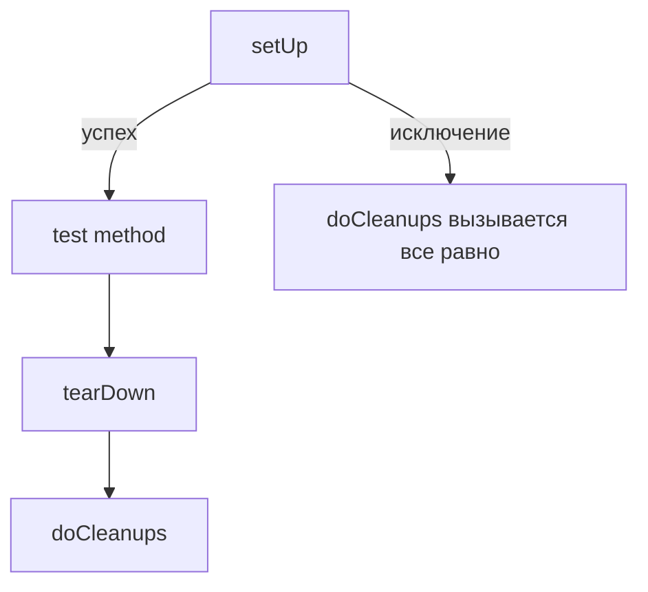

# `addCleanup()` и `enterContext()` в `unittest`: безопасная уборка ресурсов даже при падениях `setUp()`

Самая дорогая категория проблем в unit‑тестах — не “неправильный `assert`”, а **утечки состояния**. Тест упал, но оставил после себя изменённую переменную окружения, незакрытый файл, временную директорию, активный `patch`. Следующий тест стартует не в “чистом мире”, а в обломках предыдущего, и Вы получаете флаки: “падает только в наборе”, “падает только на CI”, “падает только после такого‑то теста”. Чтобы это не происходило, недостаточно знать `setUp()`/`tearDown()`. Нужно понимать, что `unittest` гарантирует (и чего **не** гарантирует) при исключениях, и почему `addCleanup()`/`enterContext()` — более надёжный механизм управления ресурсами. ([Python documentation][1])

## Почему `tearDown()` не является страховкой от утечек

Интуитивно кажется, что “всё, что открыл в `setUp()`, можно закрыть в `tearDown()`”. Это верно только при одном условии: `tearDown()` действительно будет вызван. А `unittest` прямо описывает обратный сценарий: если `setUp()` падает, то `tearDown()` **не вызывается**. В документации это сформулировано через поведение `addCleanup()`: “If `setUp()` fails, meaning that `tearDown()` is not called…”. ([Python documentation][1])

С практической точки зрения это означает: любой ресурс, захваченный в начале `setUp()`, может “утечь”, если дальше в `setUp()` случится исключение (опечатка, неверный конфиг, неожиданный тип данных, ошибка импорта, и т.п.). И это не редкий кейс: подготовка часто сложнее самого теста.

Ниже — минимальный пример утечки, который хорошо воспроизводит типовую проблему. Тесты неважны — важен факт, что `setUp()` может упасть после создания ресурса:

```python
import tempfile
import unittest
from pathlib import Path


class TestLeakExample(unittest.TestCase):
    def setUp(self):
        # Создали временную директорию…
        self._tmp = tempfile.TemporaryDirectory()
        self.tmp_path = Path(self._tmp.name)

        # …а потом setUp упал, tearDown не будет вызван
        raise RuntimeError("ошибка в подготовке окружения")

    def tearDown(self):
        # До этого кода управление не дойдёт
        self._tmp.cleanup()

    def test_something(self):
        self.assertTrue(True)
```

Если таких тестов много, на CI остаются мусорные каталоги, на локальной машине копятся файлы, и следующий прогон может начать падать “из‑за нехватки места” или из‑за конфликтов имён. Это уже не тестирование, а борьба с побочными эффектами.

## Идея `addCleanup()`: очистка как стек, который сработает даже при падении `setUp()`

`addCleanup(function, *args, **kwargs)` добавляет функцию очистки, которую `unittest` вызовет **после `tearDown()`**. Вызовы происходят в обратном порядке добавления (LIFO). Ключевое: **если `setUp()` упал и `tearDown()` не будет, функции cleanup всё равно будут вызваны**. ([Python documentation][1])

Это меняет стиль фикстур: Вы больше не пишете “в конце уберу”, Вы пишете “взял ресурс → сразу прикрепил уборку”.

> **Критический принцип фикстур:** уборка регистрируется сразу после успешного захвата ресурса, а не “потом в `tearDown()`”.

### Как `unittest` гарантирует запуск очистки: `doCleanups()`

Механизм работает через `doCleanups()`: этот метод вызывается **безусловно** после `tearDown()`, либо после `setUp()`, если `setUp()` поднял исключение. Именно он выполняет стек функций, добавленных через `addCleanup()`. ([Python documentation][1])

На этом месте полезна небольшая схема:



## Практика: временные директории и файлы без мусора

Модуль `tempfile` предоставляет высокоуровневые интерфейсы, которые “умеют сами убираться” и могут использоваться как context managers (в том числе `TemporaryDirectory`). ([Python documentation][2])

Самая надёжная версия `setUp()` для временной директории выглядит так: создать `TemporaryDirectory()` и **сразу** зарегистрировать её `cleanup()` через `addCleanup()`.

```python
import tempfile
import unittest
from pathlib import Path


class TestWithTmpDir(unittest.TestCase):
    def setUp(self):
        tmp = tempfile.TemporaryDirectory()
        self.addCleanup(tmp.cleanup)  # гарантия уборки даже если setUp упадёт
        self.tmp_path = Path(tmp.name)

    def test_write_file(self):
        p = self.tmp_path / "out.txt"
        p.write_text("ok", encoding="utf-8")
        self.assertTrue(p.exists())
```

Обратите внимание на деталь “LIFO”: если внутри временной директории Вы открываете файл и хотите закрыть его/удалить раньше удаления каталога, порядок регистрации cleanup’ов станет важен. `unittest` вызывает cleanup‑функции в обратном порядке добавления. ([Python documentation][1])

## Почему LIFO — это не теория, а инструмент против “полусломанной уборки”

В реальных фикстурах ресурсы часто вложены:

- сначала создаётся директория,
- потом файл внутри,
- потом открывается файловый дескриптор,
- потом поверх него создаётся обёртка (например, writer/reader).

Освобождать их нужно в обратном порядке: закрыть writer → закрыть файл → удалить файл → удалить директорию. LIFO решает это автоматически.

Небольшая “инфографика” на одном примере:

| Шаг подготовки               | Что регистрировать | Почему так                                    |
| ---------------------------- | ------------------ | --------------------------------------------- |
| Создали временную директорию | `tmp.cleanup`      | “внешний” ресурс должен закрываться последним |
| Открыли файл внутри          | `fh.close`         | файл нужно закрыть до удаления каталога       |
| Создали обёртку/стрим        | `stream.close`     | закрыть “самое внутреннее” первым             |

Сам факт LIFO‑порядка является частью контракта `addCleanup()`. ([Python documentation][1])

## `enterContext()`: “with‑контекст” без `with` и без ручного `addCleanup`

`enterContext(cm)` делает две вещи одним действием:

1. входит в переданный контекстный менеджер;
2. если вход успешен, добавляет его `__exit__()` в cleanup‑стек через `addCleanup()`, а затем возвращает результат `__enter__()`. ([Python documentation][1])

Метод добавлен в Python 3.11. ([Python documentation][1])

Это означает, что многие фикстуры можно писать без “ручного” `cleanup()` — достаточно использовать корректный context manager.

### Пример: `TemporaryDirectory()` через `enterContext()`

```python
import tempfile
import unittest
from pathlib import Path


class TestEnterContextTmp(unittest.TestCase):
    def setUp(self):
        tmp_name = self.enterContext(tempfile.TemporaryDirectory())
        self.tmp_path = Path(tmp_name)

    def test_smoke(self):
        (self.tmp_path / "a.txt").write_text("hi", encoding="utf-8")
```

С точки зрения поведения это эквивалентно “создать `TemporaryDirectory`, затем `addCleanup(tmp.cleanup)`”, только короче и менее подвержено ошибкам.

### Пример: патч как context manager (без `tearDown()`)

`unittest.mock.patch()` и другие patch‑варианты (`patch.object`, `patch.dict`) поддерживают контекстный менеджер. А значит, их можно “прикрепить” к тесту через `enterContext()` и не думать об откате вручную. ([Python documentation][3])

```python
import unittest
from unittest.mock import patch


class TestEnterContextPatch(unittest.TestCase):
    def setUp(self):
        self.mock_sleep = self.enterContext(patch("time.sleep", return_value=None))

    def test_sleep_called(self):
        import time

        time.sleep(10)
        self.mock_sleep.assert_called_once()
```

## Патчи в `setUp()`: почему `addCleanup()` — стандарт де‑факто

Документация `unittest.mock` описывает технику `patcher.start()`/`patcher.stop()` как удобную для `setUp()`, но отдельно подчёркивает проблему: если исключение произошло в `setUp()`, `tearDown()` не вызовется, и патч не будет снят. Дальше документ прямо рекомендует `unittest.TestCase.addCleanup()` как способ сделать это надёжно. ([Python documentation][3])

Практический шаблон:

```python
import unittest
from unittest.mock import patch


class TestPatchInSetUp(unittest.TestCase):
    def setUp(self):
        patcher = patch("package.module.Client")
        self.MockClient = patcher.start()
        self.addCleanup(patcher.stop)  # снимет патч даже если setUp упадёт

    def test_client_used(self):
        from package.module import Client

        self.assertIs(Client, self.MockClient)
```

Этот приём стоит воспринимать как “гигиенический минимум” при патчинге в фикстурах.

## Порядок выполнения: `tearDown()` сначала, cleanup‑стек потом

`addCleanup()` добавляет функции, которые вызываются **после `tearDown()`**. Это важно не только для понимания, но и для проектирования фикстур: иногда Вы хотите, чтобы ресурс оставался активным до конца `tearDown()` (например, чтобы `tearDown()` мог читать логи из временной директории или проверять вызовы моков). ([Python documentation][1])

Но встречается и обратная задача: “нужно освободить ресурс раньше `tearDown()`”. В `unittest` это предусмотрено: `doCleanups()` можно вызвать вручную, и он снимает элементы по одному со стека (то есть может вызываться в любой момент). ([Python documentation][1])

Пример, где это полезно: один тестовый метод делает несколько итераций (например, через `subTest`), и каждая итерация создаёт временный ресурс. Если регистрировать cleanup в каждой итерации, а чистить только в конце теста, можно накопить слишком много ресурсов. В таком случае можно чистить “порциями” прямо в тесте:

```python
import unittest
import tempfile
from pathlib import Path


class TestManualCleanups(unittest.TestCase):
    def test_many_iterations(self):
        for i in range(5):
            with self.subTest(i=i):
                tmp_name = self.enterContext(tempfile.TemporaryDirectory())
                tmp = Path(tmp_name)
                (tmp / f"{i}.txt").write_text("x", encoding="utf-8")

            # освободили ресурсы текущей итерации сразу
            self.doCleanups()
```

Факт, что `doCleanups()` можно вызывать вручную и что он “pop’ает” функции по одной, описан в документации. ([Python documentation][1])

## `enterContext()` и “пачка” ресурсов: аналогия с `ExitStack`

Если Вы входите в несколько контекстов, `enterContext()` позволяет делать это последовательно, а выходы будут выполнены в правильном порядке (LIFO), потому что `__exit__` добавляется через `addCleanup()`. ([Python documentation][1])

Это концептуально похоже на `contextlib.ExitStack`, который тоже управляет набором контекстов и “разматывает” их в обратном порядке регистрации. В документации `ExitStack` описано, что закрытие “unwinds the callback stack” в reverse order. ([Python documentation][4])

Практический пример: временная директория + патч окружения + патч функции.

```python
import os
import tempfile
import unittest
from pathlib import Path
from unittest.mock import patch


class TestMultipleContexts(unittest.TestCase):
    def setUp(self):
        tmp_name = self.enterContext(tempfile.TemporaryDirectory())
        self.tmp = Path(tmp_name)

        self.enterContext(patch.dict(os.environ, {"APP_MODE": "test"}, clear=False))
        self.mock_sleep = self.enterContext(patch("time.sleep", return_value=None))

    def test_all_active(self):
        self.assertEqual(os.environ["APP_MODE"], "test")
        (self.tmp / "probe.txt").write_text("ok", encoding="utf-8")

        import time

        time.sleep(1)
        self.mock_sleep.assert_called_once()
```

Смысл здесь не в конкретных патчах, а в том, что фикстура не разваливается при исключениях и не требует “комбинаторики `with`”.

## Сравнение подходов: `tearDown()` vs `addCleanup()` vs `enterContext()`

| Критерий                               | `tearDown()` | `addCleanup()`                                   | `enterContext()`                                                            |
| -------------------------------------- | ------------ | ------------------------------------------------ | --------------------------------------------------------------------------- |
| Выполнится ли при падении `setUp()`    | нет          | да ([Python documentation][1])                   | да (через `addCleanup`) ([Python documentation][1])                         |
| Порядок освобождения ресурсов          | вручную      | LIFO автоматически ([Python documentation][1])   | LIFO автоматически ([Python documentation][1])                              |
| Удобство для context managers          | не относится | вручную (`cm.__exit__`)                          | встроено (`__exit__` добавляется автоматически) ([Python documentation][1]) |
| “Раннее освобождение” в середине теста | вручную      | через `doCleanups()` ([Python documentation][1]) | через `doCleanups()` ([Python documentation][1])                            |

Вывод практический: `tearDown()` остаётся полезным для очень простых сценариев, но как “универсальная страховка” он слаб, потому что не покрывает провалы `setUp()`. Для ресурсов используйте cleanup‑стек как базовый механизм.

## Приём для проектов: “маленькие фабрики ресурсов” в базовом `TestCase`

Чтобы команда не писала каждый раз “патчер, старт, addCleanup(stop)”, обычно делают маленькие helper‑методы в базовом классе. Это повышает единообразие и снижает риск забыть уборку.

```python
import tempfile
import unittest
from pathlib import Path
from unittest.mock import patch


class BaseTest(unittest.TestCase):
    def make_tmpdir(self) -> Path:
        name = self.enterContext(tempfile.TemporaryDirectory())
        return Path(name)

    def patch(self, target: str, **kwargs):
        patcher = patch(target, **kwargs)
        mocked = patcher.start()
        self.addCleanup(patcher.stop)
        return mocked
```

Дальше в тестах остается только “деловая” часть:

```python
class TestUsingHelpers(BaseTest):
    def setUp(self):
        self.tmp = self.make_tmpdir()
        self.mock_sleep = self.patch("time.sleep", return_value=None)

    def test_smoke(self):
        (self.tmp / "x.txt").write_text("ok", encoding="utf-8")
```

Этот стиль напрямую следует из контрактов `enterContext()` и `addCleanup()`: `enterContext` сам добавляет `__exit__` в cleanup‑стек, а `addCleanup` гарантированно отработает даже при падении `setUp()` и выполняется LIFO. ([Python documentation][1])

## Заключение

`addCleanup()` — это механизм “гарантированной уборки” в `unittest`: функции выполняются после `tearDown()` в LIFO‑порядке и будут вызваны даже если `setUp()` упал (когда `tearDown()` не вызывается). ([Python documentation][1])
`enterContext()` упаковывает работу с context managers: он входит в контекст, добавляет `__exit__` в cleanup‑стек и возвращает результат `__enter__()`. Это встроенный способ писать фикстуры без утечек и без громоздких `with`‑вложенностей; метод добавлен в Python 3.11. ([Python documentation][1])
`doCleanups()` — “двигатель” этого подхода: он вызывается фреймворком безусловно после `tearDown()` или после провалившегося `setUp()`, а при необходимости может быть вызван вручную в середине теста. ([Python documentation][1])

## Дополнительные материалы

Официальная документация `unittest`: `addCleanup()`, `enterContext()`, `doCleanups()` и связанные гарантии порядка и вызова при падениях `setUp()`. ([Python documentation][1])
What’s New in Python 3.11: добавление `TestCase.enterContext()` и родственных методов. ([Python documentation][5])
Официальная документация `unittest.mock`: `patcher.start()/stop()`, предупреждение про исключения в `setUp()` и рекомендация использовать `addCleanup()`. ([Python documentation][3])
Официальная документация `tempfile`: `TemporaryDirectory` как высокоуровневый интерфейс с автоматической очисткой и поддержкой контекстного менеджера. ([Python documentation][2])
Официальная документация `contextlib`: `ExitStack` и обратный порядок разматывания стека колбэков как общий принцип управления множеством контекстов. ([Python documentation][4])

[1]: https://docs.python.org/3/library/unittest.html "unittest — Unit testing framework — Python 3.14.3 documentation"
[2]: https://docs.python.org/3/library/tempfile.html "tempfile — Generate temporary files and directories — Python 3.14.3 documentation"
[3]: https://docs.python.org/3/library/unittest.mock.html "unittest.mock — mock object library — Python 3.14.3 documentation"
[4]: https://docs.python.org/3/library/contextlib.html "contextlib — Utilities for with-statement contexts — Python 3.14.3 documentation"
[5]: https://docs.python.org/3/whatsnew/3.11.html "What’s New In Python 3.11 — Python 3.14.3 documentation"
