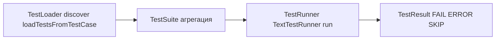

# `unittest.TestSuite`: ручная группировка тестов и случаи, когда она действительно нужна

Большая часть времени на проекте уходит не на написание `assert`, а на организацию запуска: “быстро прогнать smoke перед MR”, “ночью гонять всё”, “в CI разделить тесты по стадиям”, “на локальной машине запускать только подсистему”. В `unittest` эти задачи решаются тремя сущностями: **loader** собирает тесты, **suite** группирует и хранит их как единый объект, **runner** запускает и печатает результат. `TestSuite` — инструмент ровно про второй пункт: **собрать набор тестов в явную структуру и запускать её как один тестовый объект**. ([Python documentation][1])

## Loader → Suite → Runner: как выглядит “трубопровод” в `unittest`

`unittest` рассчитан на то, что тесты будут запускаться не “по файлам”, а как объектная модель:

- `TestLoader` умеет **строить** `TestSuite` из классов, модулей или discovery. Он возвращает именно suite, а не “список функций”. ([Python documentation][1])
- `TestSuite` — **агрегатор**: внутри него могут быть тест-кейсы (`TestCase`) и другие `TestSuite`. Запуск `TestSuite` эквивалентен итерации по нему и запуску каждого теста. ([Python documentation][1])
- `TextTestRunner` (или другой runner) принимает `TestSuite`/`TestCase`, создаёт `TestResult`, запускает тесты и печатает отчёт. ([Python documentation][1])

Полезная “карта” для ориентации:



Этот трубопровод важен по одной причине: **если Вы строите suite вручную, Вы берёте на себя часть работы loader’а**. Это даёт контроль, но и ответственность.

## Что такое `TestSuite` по контракту `unittest`

Официальная документация определяет `TestSuite` как объект, который “представляет агрегацию” тестов и имеет интерфейс, позволяющий runner’у запускать его как обычный тест. ([Python documentation][1])
С практической стороны важны четыре детали.

### 1) Внутрь можно класть `TestCase` и другие suite

У `TestSuite` есть `addTest()` и `addTests()`. Первое добавляет один `TestCase` или `TestSuite`, второе — добавляет все элементы из iterable (эквивалентно циклу с `addTest`). ([Python documentation][1])

### 2) Запуск — это итерация (и итерация может происходить не один раз)

Тесты, сгруппированные `TestSuite`, всегда “достаются” через итерацию. Более того: `__iter__()` могут вызвать несколько раз до запуска (например, при подсчёте тестов или сравнении), и повторные итерации до `run()` должны возвращать один и тот же набор тестов. ([Python documentation][1])

Это критично, если хочется “лениво” генерировать тесты генератором: генератор одноразовый и нарушит контракт (вторая итерация вернёт пусто). Если нужен lazy suite — придётся делать его детерминированным и повторяемым.

### 3) После `run()` нельзя полагаться на состав suite (по умолчанию)

Документация отдельно предупреждает: после `TestSuite.run()` не стоит полагаться на то, что `__iter__()` вернёт исходные тесты, если Вы не переопределяли поведение сохранения ссылок. ([Python documentation][1])
Практический вывод: suite — это структура **для запуска**, а не “вечный объект-каталог” для дальнейшего анализа.

### 4) Порядок выполнения — порядок добавления

CPython в описании `TestSuite` фиксирует, что suite запускает отдельные тесты **в порядке, в котором они были добавлены**, агрегируя результаты. ([GitHub][2])

Это звучит как “инструмент управления порядком”, но тут есть важная оговорка: управлять порядком ради того, чтобы тесты проходили, — признак проблемной изоляции. Если порядок нужен “временно, чтобы воспроизвести баг” или “для стабильного сценарного прогона интеграционных проверок” — ок. Если порядок нужен, чтобы тесты не падали, — это сигнал чинить фикстуры/изоляцию.

## Когда ручная сборка `TestSuite` реально нужна

Дальше — случаи, где `TestSuite` даёт полезный контроль, который сложно (или неудобно) получить только discovery/CLI.

### 1) Несколько “профилей запуска” в одном репозитории

Типовая CI-схема: быстрый smoke (минуты) и полный регресс (десятки минут). С discovery это тоже можно сделать (по паттернам имён/каталогам), но `TestSuite` позволяет описать “профиль запуска” как код: какие классы/модули входят, в каком составе, с какими условиями.

### 2) Программная сборка набора из разных источников

`TestSuite` — универсальный контейнер: в него можно сложить тесты, собранные loader’ом из `TestCase`, плюс дополнительные suite’ы, которые приходят из других подсистем.

Хороший, очень практичный пример — интеграция doctest. `doctest.DocTestSuite()` и `doctest.DocFileSuite()` возвращают `unittest.TestSuite`, который можно добавить к обычным юнит‑тестам. ([Python documentation][3])

### 3) Динамическая фильтрация: “включить/исключить” по окружению

Если набор зависит от наличия внешнего сервиса, переменной окружения, платформы или optional-зависимости, можно использовать `skip`, но иногда удобнее **не добавлять тесты в suite вообще**, чтобы они не фигурировали в отчётах и не тянули подготовку.

### 4) Нужно явно зафиксировать границы набора (как контракт)

Когда набор тестов — часть “контракта” (например, отдельный пакет smoke), ручная сборка полезна тем, что уменьшает шанс “вчера тест случайно переехал — и сегодня smoke стал пустым”.

### 5) Нужно кастомизировать загрузку при discovery через `load_tests`

`unittest` поддерживает протокол `load_tests`: если модуль/пакет определяет функцию `load_tests(loader, standard_tests, pattern)`, loader вызывает её, а она **должна вернуть `TestSuite`**. ([Python documentation][1])
Это способ внедрить “ручную сборку suite” в стандартный запуск `python -m unittest`/discovery без отдельного runner-скрипта.

## Базовый шаблон: вручную собрать suite и запустить runner’ом

Минимальная рабочая форма — создать suite, добавить тесты, передать runner’у.

```python
import unittest


class CalcTests(unittest.TestCase):
    def test_add(self):
        self.assertEqual(2 + 2, 4)

    def test_div_zero(self):
        with self.assertRaises(ZeroDivisionError):
            _ = 1 / 0


def smoke_suite() -> unittest.TestSuite:
    suite = unittest.TestSuite()
    suite.addTest(CalcTests("test_add"))  # точечно: один метод
    suite.addTest(CalcTests("test_div_zero"))  # ещё один
    return suite


if __name__ == "__main__":
    runner = unittest.TextTestRunner(verbosity=2)
    runner.run(smoke_suite())
```

Здесь важно понимать механику: `TextTestRunner.run(test)` принимает `TestSuite` или `TestCase`, создаёт `TestResult`, запускает и печатает результаты. ([Python documentation][1])
Если вместо runner’а вызвать `suite.run()`, придётся вручную передать `result` (в отличие от `TestCase.run`). Документация подчёркивает это различие. ([Python documentation][1])

## Более практичный шаблон: наполнять suite через `TestLoader`

Указывать строковые имена методов удобно для малого smoke, но для “группы классов” проще использовать loader. `TestLoader.loadTestsFromTestCase()` возвращает suite со всеми тестами из класса. ([Python documentation][1])

```python
import unittest


class ApiSmoke(unittest.TestCase):
    def test_health(self):
        self.assertTrue(True)


class ApiRegression(unittest.TestCase):
    def test_something_slow(self):
        self.assertTrue(True)


def build_suite() -> unittest.TestSuite:
    loader = unittest.defaultTestLoader
    suite = unittest.TestSuite()

    suite.addTests(loader.loadTestsFromTestCase(ApiSmoke))
    # Важно: suite может содержать другие suite — addTests это поддерживает
    suite.addTests(loader.loadTestsFromTestCase(ApiRegression))

    return suite


if __name__ == "__main__":
    unittest.TextTestRunner(verbosity=2).run(build_suite())
```

Почему этот стиль обычно лучше: Вы не привязываетесь к строковым именам методов и меньше рискуете “забыть добавить тест”.

## Составные suite: smoke + regression как разные “точки входа”

У `TestSuite` естественная композиция: suite внутри suite. Это удобно, если Вы хотите общий “all”, но ещё и отдельные поднаборы.

```python
import unittest


class Smoke(unittest.TestCase):
    def test_ping(self):
        self.assertTrue(True)


class Regression(unittest.TestCase):
    def test_case_1(self):
        self.assertTrue(True)

    def test_case_2(self):
        self.assertTrue(True)


loader = unittest.defaultTestLoader


def smoke_suite():
    return loader.loadTestsFromTestCase(Smoke)


def regression_suite():
    return loader.loadTestsFromTestCase(Regression)


def all_suite():
    suite = unittest.TestSuite()
    suite.addTests(smoke_suite())
    suite.addTests(regression_suite())
    return suite


if __name__ == "__main__":
    unittest.TextTestRunner(verbosity=2).run(all_suite())
```

Контракт `addTest/addTests` явно допускает добавление как отдельных `TestCase`, так и `TestSuite`. ([Python documentation][1])

## `load_tests`: как “встроить” ручную группировку в discovery и стандартный запуск

Если нужно, чтобы `python -m unittest` и discovery работали “как обычно”, но набор тестов формировался по Вашим правилам, используйте `load_tests`.

`unittest` описывает протокол так: если модуль определил `load_tests`, loader вызовет её с `loader`, стандартно загруженными тестами и `pattern`, и функция **должна вернуть `TestSuite`**. ([Python documentation][1])

Пример: добавить doctest к обычным тестам (это ровно тот сценарий, который doctest-документация показывает как интеграцию с discovery). ([Python documentation][3])

```python
# tests/test_all.py
import doctest
import unittest
import my_module_with_doctests


def load_tests(loader, standard_tests, pattern):
    # standard_tests уже содержит TestSuite, который unittest собрал по умолчанию
    standard_tests.addTests(doctest.DocTestSuite(my_module_with_doctests))
    return standard_tests
```

Эта схема удобна тем, что не требует отдельного `run_tests.py`: стандартный loader сам “подцепит” вашу логику. При этом важно помнить: если `load_tests` определён в пакете (`__init__.py`), discovery перестаёт рекурсивно заходить внутрь и ожидает, что весь сбор будет сделан внутри `load_tests`. Это уже зона повышенной ответственности — легко случайно “спрятать” тесты. ([Python documentation][1])

## Ловушки `TestSuite`, которые чаще всего ломают ожидания

### Итерация должна быть повторяемой

`__iter__()` может вызываться несколько раз до `run()`, и до запуска повторные итерации должны возвращать один и тот же набор. Это ломает “генераторные” suite и любые конструкции, которые случайно меняются от вызова к вызову. ([Python documentation][1])

### После `run()` suite — не “источник истины”

Если Вы планировали после прогона пройтись по suite и “собрать список тестов” — это ненадёжно по умолчанию: документация прямо предупреждает, что после `run()` нельзя полагаться на `__iter__()` без специальных переопределений. ([Python documentation][1])

### Не превращайте suite в костыль для shared fixtures и “особого порядка”

`unittest` отдельно говорит, что shared fixtures (модульные/классовые) **не предназначены** для suites с нестандартным порядком, и упоминает `BaseTestSuite` как вариант для фреймворков, которые не хотят поддерживать shared fixtures. ([Python documentation][1])

Это не запрет, а предупреждение: как только suite начинает “управлять жизненным циклом окружения” через порядок — тесты становятся хрупкими.

## Быстрый критерий: suite нужен для “выбора”, а не для “лечения”

Хорошая эвристика: `TestSuite` оправдан, когда он помогает **выбрать** и **собрать** тесты в нужный профиль запуска (smoke/regression/подсистема/доктесты) и делает запуск удобнее. Если `TestSuite` нужен, чтобы тесты “проходили только в правильном порядке”, это обычно означает, что у тестов проблемы с независимостью и изоляцией, и suite скрывает симптом вместо исправления причины.

## Дополнительные материалы

Документация `unittest`: раздел _Grouping tests_ (`TestSuite`, `addTest/addTests`, `__iter__` и ограничения), раздел _Loading and running tests_ (`TestLoader`, `TextTestRunner`), протокол `load_tests`. ([Python documentation][1])
Исходники CPython `unittest.suite`: описание того, что `TestSuite` запускает тесты в порядке добавления, и как устроен `run()`. ([GitHub][2])
Документация `doctest`: `DocTestSuite`/`DocFileSuite` возвращают `unittest.TestSuite` и пример интеграции через `load_tests`. ([Python documentation][3])

[1]: https://docs.python.org/3/library/unittest.html "unittest — Unit testing framework — Python 3.14.3 documentation"
[2]: https://github.com/python/cpython/blob/main/Lib/unittest/suite.py "cpython/Lib/unittest/suite.py at main · python/cpython · GitHub"
[3]: https://docs.python.org/3/library/doctest.html "doctest — Test interactive Python examples — Python 3.14.3 documentation"
