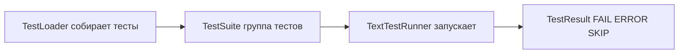

# `TestLoader` и `discover()` в `unittest`: как собирается набор тестов и как управлять загрузкой

Запуск `python -m unittest` должен быть скучным: тесты нашлись, импортировались, выполнились, результат предсказуем. На практике самые неприятные сбои начинаются раньше выполнения `assert`: `Ran 0 tests`, неожиданные `ImportError`, внезапные “лишние” тесты в прогоне, или тесты “видны” локально, но не видны в CI. Почти всегда причина одна: **в `unittest` тесты не “находятся по файлам”, тесты “загружаются через импорт модулей”**. А объект, который этим управляет, — `unittest.TestLoader`. ([Python documentation][1])

## Картина целиком: Loader → Suite → Runner

`unittest` устроен как конвейер:

1. **Loader** строит набор тестов (возвращает `TestSuite`).
2. **Suite** хранит тесты как структуру данных.
3. **Runner** запускает suite и формирует отчёт.

Это не “архитектура ради архитектуры”: если Вы понимаете, на каком шаге что происходит, диагностика становится механической.



`TextTestRunner.run()` принимает `TestSuite` или `TestCase` и создаёт `TestResult`. ([Python documentation][1])

## `TestLoader` — “компилятор” тестов в `TestSuite`

`TestLoader` — класс, который строит `TestSuite` из классов, модулей, “dotted name” и директорий. В большинстве случаев его не создают руками, потому что есть общий экземпляр `unittest.defaultTestLoader`, но кастомизация делается именно через `TestLoader` (субкласс или настройка атрибутов). ([Python documentation][1])

### Какие методы реально нужно знать

Ниже — минимальная карта методов. Это не справочник “на все случаи”, а практическая привязка “что использовать, когда”.

| Метод `TestLoader`        | Вход                                             | Что делает                                                                                                     | Типичный сценарий                                                                                              |
| ------------------------- | ------------------------------------------------ | -------------------------------------------------------------------------------------------------------------- | -------------------------------------------------------------------------------------------------------------- |
| `loadTestsFromTestCase()` | класс `TestCase`                                 | создаёт экземпляр теста на каждый метод, найденный `getTestCaseNames()`                                        | собрать тесты одного класса (например, smoke для подсистемы) ([Python documentation][1])                       |
| `loadTestsFromModule()`   | импортированный модуль                           | ищет в модуле классы-наследники `TestCase` и собирает их методы; если в модуле есть `load_tests`, вызывает его | собрать тесты конкретного файла/модуля, плюс точка кастомизации через `load_tests` ([Python documentation][1]) |
| `loadTestsFromName()`     | строка “dotted name”                             | по строке может найти модуль / класс / метод / suite / callable (в заданном порядке)                           | точечный запуск: “один класс” или “один метод” по имени ([Python documentation][1])                            |
| `loadTestsFromNames()`    | список “dotted name”                             | то же, но пачкой                                                                                               | запуск нескольких точек входа ([Python documentation][1])                                                      |
| `discover()`              | директория или dotted name + pattern + top level | рекурсивно ищет тестовые модули и импортирует их                                                               | запуск проекта целиком / поднабора по каталогу ([Python documentation][1])                                     |

## `discover()` под микроскопом: что именно происходит

### 1) Discovery ищет файлы, но **загружает импортом**

`discover(start_dir, pattern='test*.py', top_level_dir=None)` рекурсивно проходит директории от `start_dir`, берёт только файлы, совпавшие с `pattern` (shell-style pattern matching), и пытается загрузить их как модули. Загружаются только имена модулей, которые можно импортировать (то есть валидные Python-идентификаторы). ([Python documentation][1])

Из этого следуют два практических правила:

- `test-login.py` (дефис) не будет корректным модулем → discovery не сможет его импортировать.
- Файл может “лежать правильно”, но тестов “0”, если импорт невозможен из-за структуры путей.

### 2) “Top level” — это то, откуда модуль **должен быть импортируемым**

Документация формулирует требование прямо: все тестовые модули должны быть **importable from the top level of the project**; если `start_dir` не равен top-level, то `top_level_dir` нужно задать отдельно. ([Python documentation][1])

Здесь важно понимать не термин, а механику: discovery строит dotted name и делает `import`. Чтобы импорт сработал, Python должен видеть top-level в `sys.path`.

CPython-реализация `discover()` при необходимости добавляет `top_level_dir` в `sys.path` (в начало списка), чтобы обеспечить импортируемость тестовых модулей. ([GitHub][2])

### 3) Как путь превращается в dotted name

Discovery мыслит модулями. Пример:

```text
tests/unit/test_calc.py
↓
tests.unit.test_calc
↓
import tests.unit.test_calc
```

Если `tests/` и `tests/unit/` не воспринимаются Python как пакеты в Вашей конфигурации импорта (или top-level выбран неправильно), импорт ломается — и тесты не будут загружены.

Отдельная деталь из документации: `start_dir` может быть не только директорией, но и dotted module name. Это удобно, когда тесты оформлены как пакет и Вы хотите стартовать discovery “по модулю”. ([Python documentation][1])

### 4) Что происходит при ошибках импорта

Discovery не падает “всё сразу”. Если импорт модуля не удался (например, синтаксическая ошибка), это записывается как одна ошибка, а discovery продолжает поиск. Если при импорте поднят `SkipTest`, это будет записано как skip, а не error. ([Python documentation][1])

Это важный момент для диагностики: “часть тестов нашлась” и “половина не импортировалась” могут выглядеть как нормальный прогон, если не смотреть на отчёт/verbosity.

### 5) Порядок импорта стабилизируют

Документация и реализация подчёркивают, что пути сортируются перед импортом, чтобы порядок выполнения был воспроизводимым независимо от порядка файловой системы. ([Python documentation][1])

Стабильный порядок — это хорошо для воспроизводимости, но он не должен быть зависимостью тестов: корректный набор тестов должен проходить при любом порядке, иначе проблема в изоляции.

## Как влиять на загрузку: три уровня контроля

### Уровень 1. Параметры `discover()` и CLI: управляете **границами поиска**

Discovery доступен и как API (`TestLoader.discover()`), и как CLI. В CLI есть ключевые параметры:

- `-s/--start-directory` — откуда стартовать;
- `-p/--pattern` — какие файлы считать тестовыми;
- плюс важная деталь: `python -m unittest` — это эквивалент `python -m unittest discover`. Если нужны аргументы discovery, нужно явно писать `discover`. ([Python documentation][1])

Типовой “предсказуемый” запуск из корня проекта:

```bash
python -m unittest discover -s tests -p "test*.py" -v
```

Если структура проекта сложнее, параметр top-level часто решает “плавающие импорты” (когда запускаете не из корня):

```bash
python -m unittest discover -s tests -t . -v
```

Смысл ровно тот, который описан в контракте `discover`: тестовые модули должны импортироваться от top-level. ([Python documentation][1])

### Уровень 2. `load_tests`: управляете **тем, что считается тестами внутри модуля/пакета**

`load_tests` — официальный протокол кастомизации загрузки. Если модуль определяет `load_tests(loader, standard_tests, pattern)`, то `TestLoader.loadTestsFromModule()` вызовет его вместо стандартного поиска тест-классов. `pattern` передаётся третьим аргументом. ([Python documentation][1])

Для пакетов есть дополнительный нюанс: если discovery встречает пакет (директория с `__init__.py`), он проверяет `__init__.py` на `load_tests`. Если `load_tests` существует, discovery **не рекурсирует внутрь пакета**, а считает, что `load_tests` сам загрузит всё нужное. ([Python documentation][1])

Это один из самых сильных рычагов: можно явно определять “профили запуска” и гарантировать, что набор тестов не зависит от расположения файлов.

Пример: выбрать только конкретные `TestCase` и исключить “служебные” базовые классы.

```python
# tests/unit/test_api.py
import unittest


class BaseApiCase(unittest.TestCase):
    # базовый класс, не предназначен для прямого запуска
    def helper(self): ...


class TestHealth(unittest.TestCase):
    def test_ping(self):
        self.assertTrue(True)


class TestAuth(unittest.TestCase):
    def test_login(self):
        self.assertTrue(True)


def load_tests(loader, standard_tests, pattern):
    suite = unittest.TestSuite()
    for tc in (TestHealth, TestAuth):  # явно перечисляем, что входит
        suite.addTests(loader.loadTestsFromTestCase(tc))
    return suite
```

Отдельно полезный “нулевой” шаблон для пакета: оставить стандартные тесты и дополнительно запустить discovery внутри пакета (документация прямо показывает идею “do nothing load_tests”, где `load_tests` продолжает discovery). ([Python documentation][1])

### Уровень 3. Настройки `TestLoader`: управляете **правилами отбора и формой suite**

У `TestLoader` есть несколько конфигурируемых атрибутов. Их можно переопределять в подклассе или на экземпляре. ([Python documentation][1])

Ключевые:

- `testMethodPrefix` — какой префикс у методов считается тестом (по умолчанию `test`). Это влияет на `getTestCaseNames()` и все `loadTestsFrom*`. ([Python documentation][1])
- `sortTestMethodsUsing` — функция сравнения имён методов при сортировке. В реализации сортировка применяется, если атрибут “истинный” (truthy). ([Python documentation][1])
- `suiteClass` — фабрика, которая строит suite из списка тестов (по умолчанию `TestSuite`). Это влияет на все `loadTestsFrom*`. ([Python documentation][1])
- `testNamePatterns` — список shell-style паттернов, которым должны соответствовать тестовые методы для включения в suite; матчинг делается через `fnmatch.fnmatchcase`. Атрибут связан с CLI-опцией `-k`. ([Python documentation][1])

#### Практический пример: другой префикс методов и “фильтр” по именам

```python
# run_tests.py
import unittest


class CustomLoader(unittest.TestLoader):
    testMethodPrefix = "check"  # check_* вместо test_*


def main():
    loader = CustomLoader()
    # Аналог идеи "-k payment" только через patterns: "*payment*"
    loader.testNamePatterns = ["*payment*"]

    suite = loader.discover(start_dir="tests", pattern="test*.py", top_level_dir=".")
    unittest.TextTestRunner(verbosity=2).run(suite)


if __name__ == "__main__":
    main()
```

Разница между `-k` и `testNamePatterns` принципиальная: в CLI `-k` без `*` работает как подстрока, а `testNamePatterns` всегда использует `fnmatchcase`, поэтому подстроку нужно явно превращать в `*подстрока*`. ([Python documentation][1])

#### Интеграция с `unittest.main()`: как подменить loader “официально”

`unittest.main()` принимает параметр `testLoader` (экземпляр `TestLoader`), по умолчанию используется `unittest.defaultTestLoader`. Это легальный способ запускать тесты “как обычно”, но с Вашими правилами загрузки. ([Python documentation][1])

```python
# tests/__main__.py  (чтобы можно было: python -m tests)
import unittest


class Loader(unittest.TestLoader):
    testNamePatterns = ["*smoke*"]


if __name__ == "__main__":
    unittest.main(testLoader=Loader(), verbosity=2)
```

## Диагностика загрузки: что делать, когда “не нашлось” или “нашлось не то”

### 1) Проверять не только результат, но и причины ошибок загрузки

`TestLoader` ведёт список **нефатальных ошибок** в `loader.errors`. Документация подчёркивает: такие ошибки не сбрасываются, и они могут быть представлены синтетическим тестом, который при запуске поднимет исходную ошибку. ([Python documentation][1])

Самый простой “сканер проблем”:

```python
import unittest

loader = unittest.TestLoader()
suite = loader.discover("tests", pattern="test*.py", top_level_dir=".")

print("Ошибки загрузки:", loader.errors)
unittest.TextTestRunner(verbosity=2).run(suite)
```

Если в `loader.errors` есть `ImportError`/`AttributeError`, это сигнал, что discovery нашёл файл, но не смог корректно разрешить dotted name или импорт зависимостей. ([Python documentation][1])

### 2) Понимать, что `loadTestsFromName()` тоже импортирует

`loadTestsFromName()` может ссылаться на модули/пакеты, которые ещё не импортированы — они будут импортированы “как побочный эффект”. Если при обходе dotted name возникает `ImportError` или `AttributeError`, loader вернёт синтетический тест и добавит ошибку в `self.errors`. ([Python documentation][1])

Это удобно для “точечного” запуска, но важно для отладки: иногда проще воспроизвести проблему загрузки через один dotted name, чем через весь discover.

## Где чаще всего ломают загрузку (и почему это именно про loader)

Есть две типовые поломки, которые выглядят как “unittest не работает”.

**Поломка №1: файл совпал с `pattern`, но не импортируется как модуль.**
Discovery грузит только импортируемые имена (валидные идентификаторы), и требует импортируемости от top-level. ([Python documentation][1])

**Поломка №2: в пакете добавили `load_tests` и “пропали” тесты ниже.**
Если `load_tests` существует в пакете, discovery не рекурсирует внутрь пакета — теперь Вы ответственны за загрузку всех дочерних тестов внутри `load_tests`. ([Python documentation][1])

Обе проблемы решаются не “переустановкой Python”, а приведением структуры импорта и правил загрузки к явной модели.

## Заключение

`TestLoader` — центральная точка, где `unittest` превращает “файлы и классы” в запускаемый `TestSuite`. Discovery — это не просто поиск по файловой системе: это **поиск + импорт + загрузка**. Поэтому управлять загрузкой нужно теми же инструментами, которыми она строится:

- параметрами `discover()`/CLI (`start_dir`, `pattern`, `top_level_dir`) и корректной “границей импортируемости”; ([Python documentation][1])
- протоколом `load_tests` для модулей и пакетов, когда нужен контроль состава набора; ([Python documentation][1])
- настройками `TestLoader` (`testMethodPrefix`, `testNamePatterns`, `suiteClass`), когда нужно изменить правила отбора/фильтрации или форму suite. ([Python documentation][1])

## Дополнительные материалы

Официальная документация `unittest` (разделы: Command-line options, Test Discovery, Loading and running tests, load_tests protocol). ([Python documentation][1])
Реализация `unittest.loader.TestLoader.discover()` в CPython (важно для понимания: добавление `top_level_dir` в `sys.path`, сортировка путей, поведение `load_tests`). ([GitHub][2])

[1]: https://docs.python.org/3/library/unittest.html "unittest — Unit testing framework — Python 3.14.3 documentation"
[2]: https://github.com/python/cpython/blob/main/Lib/unittest/loader.py "cpython/Lib/unittest/loader.py at main · python/cpython · GitHub"
