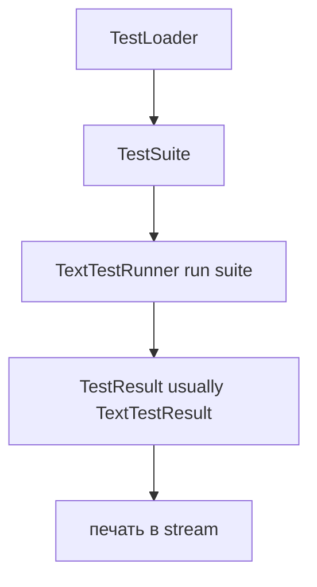

# TextTestRunner в `unittest`: как читать отчёты и повышать сигнал/шум

Когда тесты падают, проблема часто не в коде — а в том, что Вы тонете в выводе: тысячи строк лога, десятки трейсбеков, непонятные “F…E…s…”, и ещё CI добавляет свои украшения. `unittest.TextTestRunner` — это тот слой, который превращает «сырые» события прогона в текстовый отчёт. Если Вы умеете его читать и настраивать, время диагностики сокращается с «пятнадцать минут на поиск первого полезного места» до «две минуты до причины». ([Python documentation][1])

## Где стоит TextTestRunner: «переводчик» между тестами и человеком

`unittest` разделяет три роли:

- **что запускать**: это решают `TestLoader` и `TestSuite`;
- **как запускать**: это делает раннер (runner), чаще всего `TextTestRunner`;
- **что получилось**: это фиксирует объект результата (`TestResult`), а раннер уже печатает отчёт на его основе. ([Python documentation][1])

Ниже — схема потока данных. Она полезна, чтобы не путать причины и следствия: если «отчёт странный», не всегда виноват раннер; иногда проблема в том, какие тесты собраны, или в том, как тесты пишут в `stdout`.



Ключевая мысль простая: **раннер не «угадывает» результат**, он лишь реагирует на события и печатает их в удобном формате. Если Вы хотите больше сигнала, чаще всего Вам нужно либо (а) настроить раннер, либо (б) улучшить сами тесты (сообщения ассертов, контроль вывода), либо (в) изменить то, что попало в прогон. ([GitHub][2])

## TestResult как источник правды: что именно «знает» unittest про прогон

Текстовый отчёт — это про человека. Но для понимания прогона важнее структура данных, которую накапливает `TestResult`.

### Базовые контейнеры результата

`TestResult` хранит отдельные списки для разных исходов:

- `errors`: неожиданные исключения (ошибка выполнения теста);
- `failures`: провалы проверок (например, `AssertionError`);
- `skipped`: пропуски тестов с причиной;
- `expectedFailures`: ожидаемые падения (помеченные `expectedFailure`);
- `unexpectedSuccesses`: «неожиданный успех» — тест был помечен как ожидаемо падающий, но прошёл. ([Python documentation][1])

У результата есть счётчик `testsRun` и метод `wasSuccessful()`. Метод возвращает `True`, если «всё хорошо» (и отдельно отмечено, что наличие `unexpectedSuccesses` делает результат неуспешным). ([Python documentation][1])

> **Практическое правило:**
> В первую очередь смотрите на _тип_ проблемы: `ERROR` (исключение) или `FAIL` (не прошёл assert). Это почти всегда быстрее приводит к правильной ветке диагностики. ([Python documentation][1])

### Флаги, которые меняют поведение раннера во время прогона

У `TestResult` есть поля, которые напрямую влияют на «шум»:

- `buffer`: буферизация `sys.stdout`/`sys.stderr` между `startTest()` и `stopTest()`. Вывод от успешных тестов отбрасывается. Вывод от упавших тестов приклеивается к сообщению об ошибке/провале. ([Python documentation][1])
- `failfast`: если включён, раннер должен остановить прогон на первой ошибке/провале. Это реализуется через механизм `stop()`/`shouldStop`. ([Python documentation][1])
- `tb_locals`: показывает локальные переменные в трейсбеках. Это повышает информативность, но резко увеличивает объём вывода. ([Python documentation][1])
- `collectedDurations`: список длительностей тестов (для `--durations`). ([Python documentation][1])

Важный нюанс: эти поля — не «настройки `TestResult` сами по себе». `TextTestRunner` выставляет их перед прогоном (например, присваивает `result.buffer = self.buffer`). Поэтому думайте о них как о договоре между раннером и результатом. ([GitHub][2])

## Что печатает TextTestRunner: разбор отчёта по слоям

`TextTestRunner` — стандартный текстовый раннер. В CPython он по умолчанию пишет в `sys.stderr` (если `stream` не задан). Он создаёт объект `TextTestResult`, запускает тесты и печатает финальную сводку. ([Python documentation][1])

Типовой отчёт можно мысленно разделить на три слоя.

### Слой 1. Прогресс прогона: точки и буквы

При `verbosity=1` (это дефолт для `unittest`) раннер печатает компактный «шумометр»: символ на каждый исход теста.

В текущей реализации символы такие:

- `.` — успех
- `F` — failure
- `E` — error
- `s` — skipped
- `x` — expected failure
- `u` — unexpected success ([GitHub][3])

Эти символы полезны как индикатор «что-то пошло не так» и как грубая оценка масштаба: одно `F` — обычно одна точка входа; много `E` подряд — часто проблема в фикстуре/инициализации, а не в бизнес-логике.

### Слой 2. Детализация проблем: списки ERROR/FAIL и трейcбеки

После прогона раннер вызывает `result.printErrors()`, которая печатает сначала список `ERROR`, затем список `FAIL`. Каждый элемент включает заголовок с описанием теста и трейсбек. ([GitHub][2])

Важная деталь: **порядок — сначала ошибки, потом провалы**. Если у Вас и то и другое, не перескакивайте между ними: чаще всего ошибка «ломает» часть тестов каскадом, и её фикса сразу убирает несколько последующих провалов. ([GitHub][2])

### Слой 3. Итог: “Ran N tests …” и статус OK/FAILED

В конце раннер печатает строку вида `Ran 123 tests in 0.456s`, затем пишет `OK`, либо `FAILED`, либо `NO TESTS RAN`. При неуспехе он добавляет счётчики `failures=…`, `errors=…`, а также `skipped=…`, `expected failures=…` и т.п. ([GitHub][2])

Отдельный практический момент для CI: если Вы запускаете тесты через `unittest.main()`/`python -m unittest`, то exit code зависит от результата: `1` при неуспехе, `0` при успехе, и отдельный код (в CPython задан как 5) если не запустилось ни одного теста и при этом нет пропусков. ([GitHub][4])

## Как читать отчёт быстро: рабочий алгоритм диагностики

Ниже — последовательность действий, которая экономит время именно на «чтении отчёта», а не на дебаге кода.

1. Сначала найдите финальную строку (`OK`/`FAILED`/`NO TESTS RAN`) и счётчики. Это говорит, что искать: ошибки исполнения (`errors`) или провалы проверок (`failures`), и насколько их много. ([GitHub][2])

2. Если есть `ERROR`, начинайте с первого `ERROR`. Ошибка чаще всего означает: исключение в тесте, в `setUp`/`tearDown`, в фикстуре модуля/класса, либо в коде, который тест вызывает. По трейсбеку почти всегда видно, где «первый полезный фрейм» в Вашем проекте. ([Python documentation][1])

3. Если ошибок нет, переходите к `FAIL`. В `FAIL` почти всегда есть конкретное сравнение/проверка. Смотрите на последнюю строку (`AssertionError: …`) и сообщение ассерта — там должен быть смысл. Если смысла нет, это не проблема раннера, а проблема теста: сообщение слишком бедное. ([GitHub][2])

4. Если включён `-b/--buffer`, помните: вывод `print()` успешных тестов пропадает. Это хорошо для шума, но при расследовании иногда хочется увидеть промежуточные значения. В таких случаях на локальной машине временно отключайте буфер или используйте отладчик, а не «навсегда убирайте buffer». ([Python documentation][1])

5. Если в отчёте много `s` и в конце `OK (skipped=…)`, отличайте «зелёный прогон» от «прогон, который ничего не проверил». `skipped` — это не успех, это сознательное непрогоняние теста по причине. ([Python documentation][1])

## Сигнал/шум в выводе тестов: что считать шумом и где его устранять

В контексте `TextTestRunner` «шум» обычно появляется из четырёх источников:

1. **Вывод приложения/тестов в `stdout`/`stderr`**, который не связан с провалом (debug-print, логи в консоль).
2. **Предупреждения (warnings)**, особенно деприкации, которые могут быть валидны, но мешают увидеть реальные провалы.
3. **Слишком подробные трейсбеки**: полезны в момент дебага, но токсичны в стабильном CI.
4. **Сервисный шум CI**: цветовые escape-последовательности, повторяющиеся блоки, дублирование выводов.

Важный принцип: повышать сигнал лучше «сверху вниз». Сначала меняйте настройки раннера и CLI, затем — структуру тестов и сообщений, и только потом — пишите кастомный раннер.

## Настройки TextTestRunner, которые реально меняют читаемость

### 1) `verbosity`: управляет тем, _сколько_ раннер печатает во время прогона

`TextTestResult` включает два режима: “dots” (точки/буквы) и “showAll” (построчный вывод “test_name … ok”). В CPython это привязано к `verbosity`: при `verbosity==1` Вы получаете точки; при `verbosity>1` — подробные строки. ([GitHub][3])

Полезная тактика:

- **локально, когда падает**: `-v` (или `verbosity=2`) — Вы сразу видите, какой тест сейчас выполняется и какой именно упал;
- **в CI по умолчанию**: часто хватает `verbosity=1`, чтобы логи не раздувались;
- **в очень больших наборах**: иногда уместен `verbosity=0` (почти ничего не печатает по успешным тестам), но тогда Вы теряете «прогресс-бар» и ощущение, что прогон не завис. Это компромисс. ([GitHub][2])

### 2) `buffer` / `-b`: самый «дешёвый» способ убрать мусор

Опция `-b/--buffer` делает две вещи:
(а) буферизует `stdout`/`stderr` на время одного теста;
(б) выбрасывает вывод успешного теста, а вывод упавшего — прикрепляет к сообщению о падении. ([Python documentation][1])

Это почти всегда улучшает сигнал/шум, если в коде есть лишние `print()` или если логи не настроены на нормальную маршрутизацию.

Точка контроля: если Ваши тесты зависят от вывода в консоль (например, проверяют CLI), буферизация может мешать. Тогда вместо отключения `-b` лучше локально в таких тестах перенаправлять вывод через `capsys` (в pytest) или через `contextlib.redirect_stdout` (в чистом `unittest`) — но это уже уровень проектирования тестов, а не раннера.

### 3) `failfast` / `-f`: уменьшает шум ценой потери полной картины

`-f/--failfast` останавливает прогон на первом `ERROR` или `FAIL`. Это экономит время локально, когда Вы знаете, что падение одно и Вы его чините. ([Python documentation][1])

В CI `failfast` часто вреден: Вы чините одну проблему, пушите, а на следующем прогоне вылезает следующая. Для CI обычно ценнее полный отчёт.

### 4) `--locals` / `tb_locals=True`: даёт максимум информации, но может взорвать объём

`--locals` включает показ локальных переменных в трейсбеках. Это помогает, когда падение связано с неожиданным состоянием: Вы сразу видите, какие значения реально были в момент исключения. ([Python documentation][1])

Два аккуратных ограничения:

- локальные переменные могут содержать секреты (токены, пароли из окружения);
- большие структуры (JSON, большие списки) делают трейсбек нечитаемым.

Практика: включайте `--locals` временно, когда расследуете конкретный инцидент, и выключайте после.

### 5) `--durations N` / `durations=`: добавляет сигнал про производительность

Опция `--durations N` печатает список самых медленных тестов (N=0 — показать все). В реализации раннера печать идёт отдельным блоком `Slowest test durations` после `printErrors()`. При невысокой verbosity длительности меньше 0.001s скрываются, чтобы не шуметь. ([Python documentation][1])

Это полезно для регулярного контроля деградации скорости. Вы не обязаны тащить `pytest` или внешние репортеры, если Вам нужен только список «топ медленных».

### 6) `warnings`: как не утонуть в деприкациях

В `unittest` есть тонкость: CLI-обёртка (`TestProgram`) по умолчанию выставляет фильтр предупреждений в режим `'default'`, если Вы явно не задавали предупреждения и не использовали `-W` флаги интерпретатора. Это сделано, чтобы показывать деприкации даже если они обычно скрыты настройками Python. ([GitHub][4])

`TextTestRunner` применяет свой фильтр в `warnings.catch_warnings()` и вызывает `warnings.simplefilter(self.warnings)`, если `warnings` задан. ([GitHub][2])

Что это значит для сигнал/шум:

- если деприкации полезны (Вы обновляете зависимости) — оставляйте поведение по умолчанию;
- если деприкации превращают лог в мусор (Вы уже контролируете это линтерами) — управляйте предупреждениями через `-W`/`PYTHONWARNINGS` и/или явно передайте `warnings=None` в `unittest.main(..., warnings=None)` и используйте нужные фильтры на уровне интерпретатора. ([GitHub][4])

### 7) Цветной вывод: полезно в терминале, токсично в артефактах

Начиная с Python 3.14, вывод `unittest` по умолчанию цветной (в отчёте добавляются ANSI-коды). Это улучшает читаемость в интерактивном терминале, но может портить логи в некоторых CI/лог-системах. ([Python documentation][1])

Цвет управляется общими переменными окружения: `TERM=dumb` отключает цвет; `NO_COLOR` отключает цвет и имеет приоритет над `FORCE_COLOR`; а `PYTHON_COLORS` позволяет управлять цветом только для интерпретатора Python и имеет приоритет над `NO_COLOR`. ([Python documentation][5])

## “Читаемый отчёт” начинается в тестах: `descriptions` и описание теста

`TextTestRunner` умеет включать «описания» тестов: он берёт `shortDescription()` (обычно первую строку docstring тест-метода) и добавляет её к стандартному имени теста, если `descriptions=True`. Это одна из самых недооценённых ручек повышения сигнала: вместо абстрактного `test_total` Вы можете видеть краткую формулировку проверки. ([GitHub][2])

Здесь работает простое правило инфостиля:

- первая строка docstring теста — это _заголовок_ (“Считает скидку для суммы > 1000”), без подробностей;
- детали пусть останутся в коде AAA и в сообщениях ассертов.

Так Вы повышаете смысловую плотность вывода, не увеличивая объём.

## Два практичных приёма для кастомизации: когда стандартного вывода мало

Если Вы остаетесь внутри `unittest`, у Вас есть два безопасных рычага: `stream` и `resultclass`.

### Приём 1. Перенаправление `stream`: сохраняем отчёт как артефакт

По умолчанию `TextTestRunner` пишет в `sys.stderr`, но Вы можете передать любой поток. ([GitHub][2])

Пример: сохранить отчёт в строку и потом положить её в артефакты CI или вывести компактно:

```python
import io
import unittest

suite = unittest.defaultTestLoader.discover("tests")

buf = io.StringIO()
runner = unittest.TextTestRunner(stream=buf, verbosity=2, buffer=True)
result = runner.run(suite)

report_text = buf.getvalue()
print(report_text)  # или сохранить в файл
print("OK?", result.wasSuccessful())
```

Здесь важная идея: **текстовый отчёт — это представление**. А объект `result` — данные, с которыми можно работать программно: например, посчитать, сколько именно ошибок в каком модуле, или решить, нужно ли переслать уведомление. ([Python documentation][1])

### Приём 2. Свой `resultclass`: добавляем «сигнал», не ломая всё остальное

`TextTestRunner` позволяет заменить класс результата через `resultclass=`. В CPython раннер создаёт результат через `_makeResult()` и потом запускает тесты; после прогона он печатает ошибки и сводку. ([GitHub][2])

Реалистичный сценарий: Вы хотите печатать **короткий однострочный “FAIL: …” сразу в момент падения**, чтобы в длинных прогонах не листать лог до конца.

```python
import unittest


class EarlyFailLineResult(unittest.TextTestResult):
    def addFailure(self, test, err):
        super().addFailure(test, err)
        # Короткая строка-«якорь» для логов
        self.stream.writeln(f"\nFAIL: {self.getDescription(test)}")

    def addError(self, test, err):
        super().addError(test, err)
        self.stream.writeln(f"\nERROR: {self.getDescription(test)}")


runner = unittest.TextTestRunner(verbosity=1, resultclass=EarlyFailLineResult)
unittest.main(testRunner=runner, exit=False)
```

Почему это «безопасно»:

- Вы не трогаете механику хранения ошибок/падений: `super()` добавляет их в стандартные списки `failures`/`errors`; ([Python documentation][1])
- стандартный отчёт в конце останется, но у Вас появятся якоря для навигации по логам;
- Вы не вмешиваетесь в загрузку тестов, только в отображение.

Если Вы начинаете переписывать `printErrors()` и «форматировать трейсбек по-своему», Вы быстро попадаете в поддержку собственного мини-репортера. В большинстве проектов это оправдано только тогда, когда нужно интегрироваться в специфичный формат (например, корпоративная система отчётности) и это действительно бизнес-требование.

## Частые ловушки при чтении отчёта (и быстрые контрмеры)

**Ловушка 1. Путают `FAIL` и `ERROR`.**
`FAIL` — это результат проверки (assert), `ERROR` — исключение, часто из фикстуры или из тестируемого кода вне assert. Начинайте с `ERROR`, если он есть: так быстрее. ([Python documentation][1])

**Ловушка 2. “OK (skipped=N)” воспринимают как чистый успех.**
Это “успех с оговоркой”: N тестов вообще не исполнялись. В некоторых командах это нормально (условные тесты по окружению), в некоторых — это красный флаг, что CI не проверяет важные сценарии. ([Python documentation][1])

**Ловушка 3. Включают `--locals` навсегда.**
Один раз это помогает. Навсегда — раздувает логи и может утечь секрет. Держите как диагностический режим. ([Python documentation][1])

**Ловушка 4. Цвет ломает логи.**
Если лог-система плохо дружит с ANSI, отключайте цвет через `NO_COLOR` или `PYTHON_COLORS=0`, либо выставляйте `TERM=dumb`. ([Python documentation][5])

**Ловушка 5. “NO TESTS RAN” в CI остаётся незамеченным.**
Это отдельное состояние: тестов не было, либо discovery ничего не нашёл. В `unittest` есть отдельный exit code для случая «не было тестов и не было skipped». Это полезно, чтобы CI не показывал зелёный, когда Вы случайно сломали discovery. ([GitHub][4])

## Заключение

`TextTestRunner` — это не просто «красивая печать точек». Это слой, который связывает прогон тестов, накопление результата и диагностику человеком или CI.

Если Вы хотите быстрее разбирать падения и уменьшить шум, держите в голове три опоры:

1. **`TestResult` — источник правды**: ошибки/провалы/пропуски живут там, раннер лишь показывает. ([Python documentation][1])
2. **самый большой выигрыш по сигнал/шум дают `-b`, разумная `verbosity`, управление warnings и `--durations`**, а не кастомные репортеры. ([Python documentation][1])
3. **читаемость отчёта начинается в тестах**: хорошие сообщения ассертов и короткие описания тестов дают больше, чем любые настройки раннера. ([GitHub][2])

## Дополнительные материалы

Официальная документация по `TextTestRunner` и его параметрам (`stream`, `verbosity`, `buffer`, `failfast`, `warnings`, `tb_locals`, `durations`). ([Python documentation][1])
Описание структуры `TestResult`: списки `errors`/`failures`/`skipped`, метод `wasSuccessful()`, буферизация вывода. ([Python documentation][2])
Опции CLI `unittest`: `-b/--buffer`, `-f/--failfast`, `--locals`, `--durations`. ([Python documentation][3])
Как Python управляет цветом вывода через `NO_COLOR`, `FORCE_COLOR`, `PYTHON_COLORS`, `TERM`. ([Python documentation][4])
Реализация `TextTestRunner`/`TextTestResult` в CPython (полезно для понимания: какие символы печатаются, где формируется сводка, как печатаются durations). ([GitHub][5])
Реализация `unittest.main()`/`TestProgram` в CPython (полезно для понимания: как CLI опции прокидываются в раннер, какие exit codes используются, почему warnings по умолчанию “включаются”). ([GitHub][6])
Что изменилось в `unittest` в Python 3.14 (включая цветной вывод по умолчанию). ([Python documentation][7])

[1]: https://docs.python.org/3.14/library/unittest.html#unittest.TextTestRunner "unittest.TextTestRunner — Python 3.14 documentation"
[2]: https://docs.python.org/3.14/library/unittest.html#unittest.TestResult "unittest.TestResult — Python 3.14 documentation"
[3]: https://docs.python.org/3.14/library/unittest.html#command-line-interface "unittest command line interface — Python 3.14 documentation"
[4]: https://docs.python.org/3.14/using/cmdline.html#controlling-color "Controlling color — Python 3.14 documentation"
[5]: https://github.com/python/cpython/blob/v3.14.3/Lib/unittest/runner.py "CPython source: Lib/unittest/runner.py (v3.14.3)"
[6]: https://github.com/python/cpython/blob/v3.14.3/Lib/unittest/main.py "CPython source: Lib/unittest/main.py (v3.14.3)"
[7]: https://docs.python.org/3.14/whatsnew/3.14.html#unittest "What’s new in Python 3.14 — unittest"
[1]: https://docs.python.org/3/library/unittest.html "unittest — Unit testing framework — Python 3.14.3 documentation"
[2]: https://github.com/python/cpython/blob/v3.14.3/Lib/unittest/runner.py "cpython/Lib/unittest/runner.py at v3.14.3 · python/cpython · GitHub"
[3]: https://github.com/python/cpython/blob/main/Lib/unittest/runner.py "cpython/Lib/unittest/runner.py at main · python/cpython · GitHub"
[4]: https://github.com/python/cpython/blob/v3.14.3/Lib/unittest/main.py "cpython/Lib/unittest/main.py at v3.14.3 · python/cpython · GitHub"
[5]: https://docs.python.org/3/using/cmdline.html "1. Command line and environment — Python 3.14.3 documentation"
