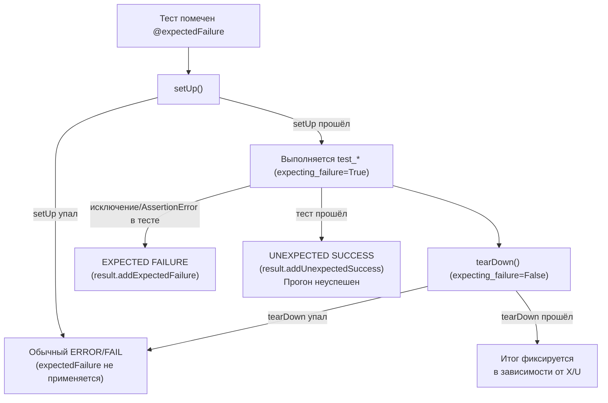

# `expectedFailure` в `unittest`: как «жить с известным багом» и не потерять контроль

В разработке есть неприятный момент: Вы нашли дефект, написали тест, он стабильно падает — и теперь у Вас выбор. Либо чинить баг прямо сейчас, либо оставить как есть. Если Вы просто закомментируете тест, Вы потеряете проверку и забудете о проблеме. Если Вы оставите тест падающим, у Вас «красный» прогон, который блокирует CI и мешает работать.

В `unittest` для этого случая есть отдельный режим результата: **ожидаемое падение**. Он оформляется декоратором `@unittest.expectedFailure`. Идея простая: тест запускается, но если он падает из‑за известного дефекта, это не считается провалом всего прогона. При этом, если дефект внезапно исчезнет и тест начнёт проходить, фреймворк поднимет тревогу: это будет **unexpected success** и прогон станет неуспешным. ([Python documentation][1])

## Что такое expected failure и зачем он вообще нужен

`@unittest.expectedFailure` помечает тест как «сломанный и ожидаемо падающий». В документации это описано прямо: если тест **падает или даёт ошибку в самой тестовой функции**, это будет считаться «успехом» в смысле итогового статуса. Если тест проходит, это будет считаться проблемой — «неожиданным успехом», который делает прогон неуспешным. ([Python documentation][1])

> **Определение в практических терминах:**
> `expectedFailure` — это режим «проверка есть, но мы знаем, что она сейчас сигналит о старом дефекте».
> Ценность в том, что проверка продолжает выполняться и _не исчезает из набора_. ([Python documentation][1])

Если провести аналогию с дисциплиной разработки, `expectedFailure` — это управляемый долг. Вы не «прячете» тест, Вы документируете состояние продукта: тест есть, но пока он показывает известный баг.

## `expectedFailure` не равен `skip`: ключевое различие

Пропуск (`skip`) — это «не запускать». Ожидаемое падение (`expectedFailure`) — это «запускать и наблюдать».

Эта разница важнее синтаксиса. С `skip` тест даже не начинает выполняться, и фреймворк явно говорит, что для пропущенных тестов не вызываются `setUp()`/`tearDown()` и соответствующие фикстуры классов/модулей. ([Python documentation][1])

С `expectedFailure` тест **выполняется** (с фикстурами), но его «плохой исход» переклассифицируется. Это означает, что:

- Вы продолжаете прогонять код (иногда это важно, например, чтобы поймать другие регрессии рядом).
- Вы получаете «датчик», который покажет, что дефект исчез (unexpected success), и заставит Вас принять решение: убрать декоратор, переписать тест, уточнить ожидания. ([GitHub][2])

## Как `unittest` это реализует: никакой магии, только флаги и классификация результата

Полезно понимать механику, потому что она объясняет почти все «почему так?» вокруг `expectedFailure`.

### Декоратор не оборачивает тест — он ставит маркер

В CPython `expectedFailure` устроен минималистично: он просто выставляет атрибут `__unittest_expecting_failure__ = True` на объекте (методе или классе) и возвращает его обратно. ([GitHub][2])

Это означает две вещи.

Первая: `expectedFailure` может применяться не только к тест-методу, но и к классу `TestCase` (атрибут окажется на классе, а экземпляр увидит его через `getattr(self, ...)`). В `TestCase.run()` проверка делает OR между атрибутом на экземпляре (то есть классе) и на методе. ([GitHub][2])

Вторая: «логика ожидаемого падения» живёт не в декораторе, а в рантайме `TestCase.run()` и в объекте `_Outcome`, который управляет тем, как записывать исход в `TestResult`. ([GitHub][2])

### Ожидаемость включается только на время выполнения _тестового метода_

Документация подчёркивает: ожидаемое падение считается «выполненным», только если ошибка/падение происходит в тестовой функции, а не в фикстурах. ([Python documentation][1])

В исходниках это видно буквально по порядку:

1. `setUp()` выполняется в контексте `testPartExecutor`, но флаг `outcome.expecting_failure` ещё не установлен;
2. если `setUp()` прошёл, `outcome.expecting_failure` выставляется в значение `expecting_failure`;
3. выполняется тестовый метод;
4. затем `outcome.expecting_failure` сбрасывается в `False` перед `tearDown()`. ([GitHub][2])

Следствие: если упадёт `setUp()` или `tearDown()`, это **не** будет считаться ожидаемым падением, даже если тест помечен `expectedFailure`. Фреймворк интерпретирует это как обычный `ERROR` или `FAIL` (в зависимости от типа исключения), потому что «ожидаемость» там не включена. ([Python documentation][1])

Это очень правильная политика. Иначе было бы слишком легко «скрыть» реальные поломки инфраструктуры тестов за меткой expected failure.

## Дерево исходов: что именно получит раннер

Чтобы не держать в голове десятки условий, удобно рассмотреть четыре сценария: тест помечен `expectedFailure`, и он либо падает, либо проходит; плюс отдельная ветка «упало в фикстуре».



Ключевой факт здесь — **ожидаемое падение фиксируется как отдельная категория**, не как `FAIL` и не как `ERROR`. С технической точки зрения `TestResult.addExpectedFailure(test, err)` добавляет запись в `expectedFailures`, а `addUnexpectedSuccess(test)` добавляет тест в `unexpectedSuccesses`. ([Python documentation][1])

## Как `unittest` отличает failure от error внутри expected failure

Внутри `unittest` «обычная» классификация такая: если исключение — это `failureException` теста (обычно `AssertionError`), это `FAIL`, иначе это `ERROR`. ([GitHub][2])

При `expectedFailure` классификация другая. В `_Outcome.testPartExecutor()` любой «не SkipTest и не KeyboardInterrupt» exception в тестовом методе, когда `expecting_failure=True`, записывается в `self.expectedFailure`, а `success` не становится False. ([GitHub][2])

То есть expected failure «съедает» и `AssertionError`, и неожиданное исключение, если оно случилось в тестовом методе. Это отражено и в документации: “expected failure or error”. ([Python documentation][1])

Это важно для практики: если Вы хотите проверить, что код **должен** выбрасывать исключение, используйте `assertRaises`. `expectedFailure` — не инструмент для проверки исключений. Это инструмент для известного дефекта. Он не делает тест «лучше формализованным», он делает прогон «управляемым». ([Python documentation][1])

## Как это выглядит в отчёте: `x`, `u` и финальная сводка

Тема модуля — управление прогоном и качество отчёта. Для `expectedFailure` это особенно важно, потому что «на глаз» в точечном выводе легко пропустить смысл.

### Символы прогресса

`TextTestResult` в режиме «точек» печатает:

- `x` для expected failure;
- `u` для unexpected success. ([GitHub][3])

В баг-трекере Python есть наглядный пример: один тест с `@expectedFailure`, который _на самом деле проходит_, печатает `u` и завершает прогон как `FAILED (unexpected successes=1)`. Если тест действительно падает, печатается `x`, а итог — `OK (expected failures=1)`. ([bugs.python.org][4])

Это удобно помнить как «две буквы управления долгом»: `x` — долг ещё не погашен, `u` — долг внезапно погашен, нужно обновить статус.

### Что печатается в verbose-режиме

Если `verbosity>1`, раннер выводит человекочитаемые слова. Для unexpected success это будет строка `... unexpected success`. ([GitHub][3])

### Почему unexpected success ломает прогон

В `unittest` это не «предупреждение», а причина неуспешного результата. В документации к `TestResult.wasSuccessful()` явно указано: начиная с Python 3.4 метод возвращает `False`, если есть любые `unexpectedSuccesses` от тестов, помеченных `expectedFailure`. ([Python documentation][1])

В исходниках это реализовано так же: `wasSuccessful()` проверяет, что `unexpectedSuccesses` пуст, либо атрибута нет. ([GitHub][5])

Исторический контекст здесь полезен для понимания мотивации. В старых версиях `wasSuccessful()` мог возвращать `True` даже при unexpected success; это обсуждалось как проблема, потому что неожиданные успехи легко пропускались CI и превращались в «дыры» — тест мог начать проходить, но так и остаться помеченным как ожидаемо падающий, а затем баг мог вернуться, и никто бы этого не заметил. ([bugs.python.org][6])

## Таблица интерпретации: один и тот же тест, разные статусы

Ниже — краткая таблица, которую удобно держать как «шпаргалку чтения отчёта».

| Тест помечен `@expectedFailure` | Что произошло на самом деле        | Что записывает `unittest`  | Что видит `TextTestRunner`                    |
| ------------------------------- | ---------------------------------- | -------------------------- | --------------------------------------------- |
| Да                              | `AssertionError` в тестовом методе | `expectedFailures += 1`    | `x`, итог `OK (expected failures=...)`        |
| Да                              | Любое исключение в тестовом методе | `expectedFailures += 1`    | `x`, итог `OK (expected failures=...)`        |
| Да                              | Тест прошёл                        | `unexpectedSuccesses += 1` | `u`, итог `FAILED (unexpected successes=...)` |
| Да                              | Ошибка в `setUp()`/`tearDown()`    | `errors` или `failures`    | `E` или `F`, обычный FAIL/ERROR               |

Содержимое списков и смысл категорий описаны и в документации (`expectedFailures` как список `(test, traceback)`, `unexpectedSuccesses` как список тестов). ([Python documentation][1])

## Практический сюжет: как использовать expectedFailure без самообмана

Ожидаемые падения работают хорошо, когда у них есть жизненный цикл. Его удобно воспринимать как историю с чёткими шагами.

### Шаг 1. Вы фиксируете дефект тестом, но не можете чинить прямо сейчас

Правильная последовательность обычно такая:

1. Вы пишете тест, который воспроизводит баг. Он падает.
2. Вы убеждаетесь, что падение связано с дефектом, а не с фикстурой или окружением.
3. Вы помечаете тест `@unittest.expectedFailure` и добавляете в причину контекст (например, идентификатор задачи или краткое описание). ([Python documentation][1])

В `unittest` у `expectedFailure` нет текстового аргумента как у `skip`. Поэтому причина должна быть в другом месте: в названии теста, в docstring, в комментарии, в ссылке на задачу. Это дисциплина проекта, а не функция фреймворка.

### Шаг 2. Вы принимаете, что тест продолжает выполняться

Это критично. Ожидаемое падение — это не «не запускать». Это «запускать и видеть статус». Поэтому Вы должны следить, чтобы тест был корректно изолирован, а фикстуры и очистка работали как обычно. ([GitHub][2])

### Шаг 3. Баг починили — и тест внезапно стал “unexpected success”

Это кульминация, ради которой expected failure существует. Если тест прошёл, `unittest` записывает unexpected success, а `wasSuccessful()` станет ложным. То есть CI должен «покраснеть», и Вы увидите событие. ([GitHub][2])

Дальше Ваш ход. Вы удаляете `@expectedFailure` и превращаете тест в обычный. Если тест прошёл не потому, что баг исправлен, а потому, что тест больше не соответствует реальности, Вы исправляете тест.

### Почему это лучше, чем `skip`

Если бы тест был пропущен, он не дал бы Вам сигнал “проблема исчезла” и не заставил бы обновить ожидания. Вы бы просто продолжали жить с дырой. ([Python documentation][1])

## Где `expectedFailure` оправдан, а где это злоупотребление

У expected failure есть узкий, но полезный коридор применимости.

### Оправдано

Если у Вас есть **известный дефект**, и Вы хотите:

- держать тест как документ дефекта;
- не блокировать сборку, пока дефект не исправлен;
- получить «триггер» на момент исправления (unexpected success). ([Python documentation][1])

### Почти всегда неправильно

Если Вы пытаетесь `expectedFailure` заменить другие инструменты:

- «Проверить, что выбрасывается исключение» — это `assertRaises`, а не expected failure.
- «Тест флакит» — expected failure превратит флаки в постоянную серую зону. Здесь нужно стабилизировать тест (моки времени/сети, устранение гонок), а не менять классификацию результата.
- «Окружение не подходит» — это `skipIf/skipUnless/skipTest`, потому что тест **неприменим**, а не “известно сломан”. ([Python documentation][1])

> **Быстрый критерий:**
> Если Вы ожидаете, что этот тест станет зелёным после исправления бага в продукте — это кандидат на `expectedFailure`.
> Если тест должен стать зелёным после изменения окружения — это кандидат на `skip`. ([Python documentation][1])

## Ловушка №1: «падает в `setUp()` — почему это не expected failure?»

Потому что так задумано и так реализовано. `unittest` включает режим `expecting_failure` только вокруг выполнения тестового метода. ([GitHub][2])

Что это значит для Вас на практике:

- Если у Вас в `setUp()` есть риск падения по известному багу, `@expectedFailure` не спасёт. Это будет `ERROR`, и прогон станет красным.
- Если проблема действительно в фикстуре, чаще всего это не «известный баг продукта», а баг тестовой инфраструктуры. Его лучше чинить, а не маркировать.

Иногда хочется «перенести» проблемный шаг из `setUp()` внутрь тестового метода именно потому, что он про баг продукта, а не про тестовую среду. Такой рефакторинг часто делает тест честнее: setUp остаётся про подготовку, а дефект — внутри проверки.

## Ловушка №2: expected failures без контроля превращаются в «забытые тесты»

В отчёте `unittest` expected failures не ломают результат. Они отражаются в сводке (`OK (expected failures=...)`) и живут в `result.expectedFailures`. ([Python documentation][1])

Если команда перестаёт реагировать на их количество, происходит неприятное:

- дефект «нормализуется»;
- тест перестаёт быть инструментом качества и превращается в статус “у нас так принято”.

Поэтому expected failures требуют дисциплины. Минимальная — иметь явную причину (issue-id) и периодически пересматривать список.

## Ловушка №3: `subTest` и `expectedFailure` не дают нужной гранулярности

`expectedFailure` работает на уровне тестового метода (и, через атрибут класса, на уровне всего `TestCase`). Но в реальных проектах Вы часто делаете «табличные тесты» через `subTest`, где часть кейсов падает по известной причине, а часть должна быть зелёной.

В Python-tracker есть открытое обсуждение ровно этой проблемы: автор хотел помечать отдельные `subTest` как ожидаемо падающие, но стандартного способа нет. В итоге люди вынуждены делать костыли вроде `try/except` + `skipTest()` для конкретных кейсов, что плохо тем, что не даёт сигнала «внезапно починилось». ([bugs.python.org][7])

Если Вы в такой ситуации, у Вас есть неприятный, но практичный выбор:

- либо разнести кейсы по отдельным тест-методам (да, их станет больше, но появится возможность `@expectedFailure` на уровне метода);
- либо генерировать тесты программно (старый подход), чтобы каждый кейс стал отдельным `TestCase`;
- либо оставить `subTest` и использовать `skipTest` на известных проблемных кейсах, понимая ограничение (и документируя его).

Важно зафиксировать: если Вам нужен “xfail на уровне subTest”, в стандартном `unittest` это не закрыто «из коробки». ([bugs.python.org][7])

## Что увидит CI и человек: как `TextTestRunner` печатает expected failures и unexpected successes

Для управления прогоном важно, чтобы статус был читаемым.

`TextTestRunner` в финальной строке добавляет счётчики, включая `expected failures=...` и `unexpected successes=...`. ([GitHub][3])

Кроме того, `TextTestResult.printErrors()` печатает отдельную секцию для unexpected successes: он выводит заголовок и описание каждого теста, который «прошёл неожиданно». ([GitHub][3])

Это хорошая деталь: у unexpected success нет трейсбека (потому что не было исключения), поэтому ключевая информация — имя теста и его описание. И раннер это показывает.

## Мини-пример, который стоит один раз проделать руками

Сценарий: есть функция, которая должна округлять вниз, но сейчас округляет вверх. Вы пишете тест, он падает, и Вы помечаете его как `expectedFailure`.

```python
import unittest


def buggy_floor_div(a, b):
    # дефект: округляет вверх при a % b != 0
    q, r = divmod(a, b)
    return q + (1 if r else 0)


class TestMath(unittest.TestCase):
    @unittest.expectedFailure
    def test_floor_div_should_round_down(self):
        self.assertEqual(buggy_floor_div(5, 2), 2)
```

Пока баг есть, Вы увидите `x` и итог “OK (expected failures=1)”. Когда Вы исправите функцию, тест станет `u`, и прогон станет `FAILED (unexpected successes=1)`. Ровно так устроен контракт `expectedFailure`: прохождение теста — это событие, которое требует реакции. ([bugs.python.org][4])

## Заключение

`@unittest.expectedFailure` — это механизм для известного дефекта, который Вы уже зафиксировали тестом, но пока не исправили. Он позволяет сохранить тест в наборе, продолжать выполнять его и не блокировать прогон, пока дефект жив. При этом `unittest` специально устроен так, чтобы «внезапное исправление» не прошло незаметно: если тест начинает проходить, это становится **unexpected success**, и `TestResult.wasSuccessful()` возвращает `False`, то есть прогон считается неуспешным. ([Python documentation][1])

Чтобы инструмент не превратился в маскировку проблем, держите два правила. Первое: expected failure — только для дефектов продукта, а не для неподходящего окружения (там нужен `skip`). Второе: expected failure должен иметь жизненный цикл: появился — значит есть задача; задача закрыта — декоратор убран; неожиданно позеленел — значит нужно отреагировать. ([Python documentation][1])

## Дополнительные материалы

Официальная документация `unittest`: раздел _Skipping tests and expected failures_ (определение `expectedFailure`, связь с `expectedFailures`/`unexpectedSuccesses`, поведение “passes → failure”). ([Python documentation][1])
Документация `unittest`: `TestResult` (атрибуты `expectedFailures` и `unexpectedSuccesses`, методы `addExpectedFailure`, `addUnexpectedSuccess`, изменение `wasSuccessful()` начиная с 3.4). ([Python documentation][2])
Исходники CPython: `Lib/unittest/case.py` (реализация `expectedFailure`, как флаг `expecting_failure` включается только вокруг тела тестового метода, как фиксируется expected/unexpected). ([GitHub][3])
Исходники CPython: `Lib/unittest/result.py` (реализация `wasSuccessful()` и учёт `unexpectedSuccesses`, методы `addExpectedFailure`/`addUnexpectedSuccess`). ([GitHub][4])
Исходники CPython: `Lib/unittest/runner.py` (как `TextTestRunner/TextTestResult` печатает `x` и `u`, и как выводит секцию UNEXPECTED SUCCESS). ([GitHub][5])
Python issue: почему unexpected success должен делать прогон неуспешным (пример «баг починился, но тест остался xfail и снова перестал ловить регрессию»). ([Python tracker][6])
Python issue: невозможность пометить отдельный `subTest` как expected failure и типичный костыль через `skipTest`. ([Python tracker][7])

[1]: `https://docs.python.org/3.14/library/unittest.html#skipping-tests-and-expected-failures` "unittest — Skipping tests and expected failures — Python 3.14 documentation"
[2]: `https://docs.python.org/3.14/library/unittest.html#unittest.TestResult` "unittest — TestResult — Python 3.14 documentation"
[3]: `https://github.com/python/cpython/blob/v3.14.3/Lib/unittest/case.py` "CPython v3.14.3 — Lib/unittest/case.py"
[4]: `https://github.com/python/cpython/blob/v3.14.3/Lib/unittest/result.py` "CPython v3.14.3 — Lib/unittest/result.py"
[5]: `https://github.com/python/cpython/blob/v3.14.3/Lib/unittest/runner.py` "CPython v3.14.3 — Lib/unittest/runner.py"
[6]: `https://bugs.python.org/issue20165` "Issue 20165 — unittest TestResult wasSuccessful returns True when there are unexpected successes (historical rationale)"
[7]: `https://bugs.python.org/issue30997` "Issue 30997 — TestCase.subTest and expectedFailure (granularity limitation)"
[1]: https://docs.python.org/3/library/unittest.html "unittest — Unit testing framework — Python 3.14.3 documentation"
[2]: https://github.com/python/cpython/blob/v3.14.3/Lib/unittest/case.py "cpython/Lib/unittest/case.py at v3.14.3 · python/cpython · GitHub"
[3]: https://github.com/python/cpython/blob/v3.14.3/Lib/unittest/runner.py "cpython/Lib/unittest/runner.py at v3.14.3 · python/cpython · GitHub"

[4]: https://bugs.python.org/issue22815 "
Issue 22815: unexpected successes are not output - Python tracker

"
[5]: https://github.com/python/cpython/blob/v3.14.3/Lib/unittest/result.py "cpython/Lib/unittest/result.py at v3.14.3 · python/cpython · GitHub"
[6]: https://bugs.python.org/issue20165 "
Issue 20165: unittest TestResult wasSuccessful returns True when there are unexpected successes - Python tracker

"
[7]: https://bugs.python.org/issue30997 "
Issue 30997: TestCase.subTest and expectedFailure - Python tracker

"
