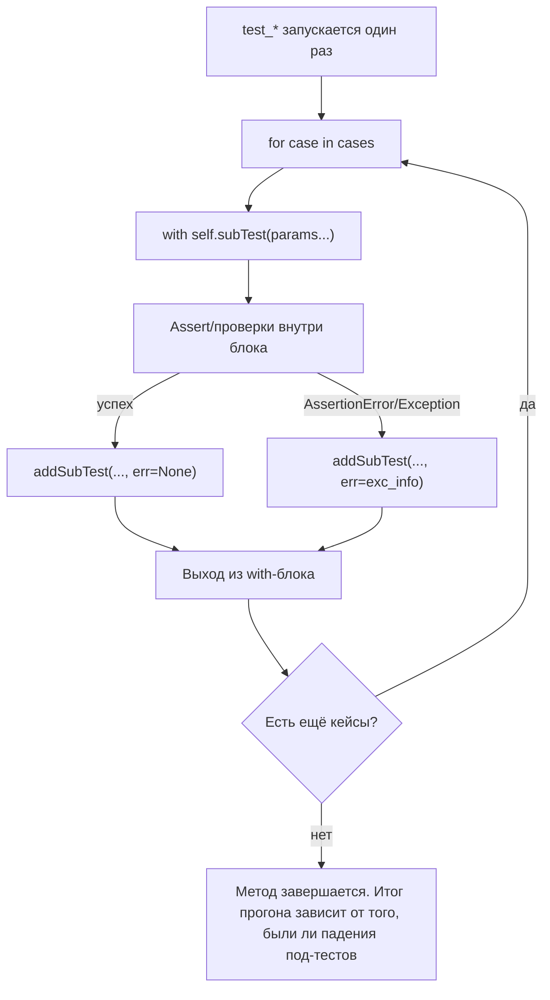

# `subTest()` в `unittest`: параметризация внутри одного теста без сторонних библиотек

Вы добавляете к тесту ещё один кейс. Потом ещё десять. Один из них падает — и прогон останавливается на первой же ошибке. В отчёте видно, что «тест упал», но не видно, **сколько** кейсов ещё сломаны и **какие именно**. Вы чините первый, запускаете снова, ловите следующий, и так по кругу. Это не «качество», это шум.

`unittest.TestCase.subTest()` решает ровно эту практическую проблему: он позволяет внутри одного тестового метода выделять итерации (кейсы) так, чтобы падение в одном кейсе не останавливало весь метод. Вы получаете более информативный отчёт и быстрее находите закономерность в дефекте. Встроенная параметризация без внешних библиотек — это прежде всего про скорость диагностики и про управляемый сигнал/шум. ([Python documentation][1])

## Проблема: «табличный» тест без `subTest` даёт мало информации

Обычно параметризация «в лоб» выглядит так: Вы заводите таблицу кейсов и гоняете её в цикле.

```python
import unittest


def clamp(x: int, low: int, high: int) -> int:
    return max(low, min(high, x))


class TestClamp(unittest.TestCase):
    def test_clamp_table(self):
        cases = [
            (-10, 0, 5, 0),
            (0, 0, 5, 0),
            (3, 0, 5, 3),
            (10, 0, 5, 5),
        ]
        for x, low, high, expected in cases:
            self.assertEqual(clamp(x, low, high), expected)
```

Логически это правильно. Но как только один кейс падает, тестовый метод завершается исключением, и Вы видите только первый проблемный набор входных данных. Именно это `unittest` демонстрирует в документации: без subtest выполнение останавливается на первой ошибке, а в отчёте нет параметра `i`, который привёл к падению. ([Python documentation][1])

То есть Вы теряете два важных сигнала:

1. **масштаб проблемы** — сломан один кейс или половина таблицы;
2. **локализацию** — какие входные данные связаны с дефектом.

## Что такое `subTest()` по контракту: минимальная, но важная гарантия

`subTest(msg=None, **params)` — это метод `TestCase`, который возвращает контекст-менеджер. Код внутри `with self.subTest(...):` выполняется как «под‑тест», идентифицируемый сообщением и параметрами. Эти значения показываются в отчёте при падении под‑теста и помогают отличить одну итерацию от другой. ([Python documentation][1])

Важные свойства, которые стоит зафиксировать сразу:

- `subTest` появился в `unittest` начиная с Python 3.4. ([Python documentation][1])
- В одном тестовом методе может быть сколько угодно `subTest`, и они могут быть вложенными. ([Python documentation][1])
- Цель механизма — различать «очень похожие проверки» внутри одного метода, когда отличаются лишь параметры. ([Python documentation][1])

> **Определение, которое стоит запомнить:**
> `subTest` — это способ превратить «цикл с проверками» в набор именованных итераций, которые падают независимо и оставляют след в отчёте. ([Python documentation][1])

## Базовый шаблон: таблица кейсов, но с читабельным отчётом

Перепишем первый пример так, как он задуман в `unittest`.

```python
import unittest


def clamp(x: int, low: int, high: int) -> int:
    return max(low, min(high, x))


class TestClamp(unittest.TestCase):
    def test_clamp_table(self):
        cases = [
            (-10, 0, 5, 0),
            (0, 0, 5, 0),
            (3, 0, 5, 3),
            (10, 0, 5, 5),
        ]
        for x, low, high, expected in cases:
            with self.subTest(x=x, low=low, high=high):
                self.assertEqual(clamp(x, low, high), expected)
```

Теперь, если один кейс упадёт, тестовый метод **не обязан** прекращать выполнение целиком. `unittest` показывает это на каноническом примере с проверкой чётности: отчёт содержит отдельные FAIL-блоки с припиской вида `(i=1)`, `(i=3)` и т. д., что сразу локализует проблемные входные значения. ([Python documentation][1])

Вы получаете практическое преимущество: один прогон даёт Вам список всех «битых» кейсов, а не только первый.

## Как `subTest` “продолжает после падения”: модель выполнения

Если говорить строго, `subTest` не делает проверку «мягкой». Он делает её **изолированной** на уровне итерации: падение внутри контекста фиксируется как результат под‑теста, а исполнение продолжает идти после `with`‑блока.

Это отражено и в описании метода в исходниках CPython: контекст-менеджер помечает тест как упавший, но «возобновляет выполнение в конце блока», чтобы оставшийся тестовый код мог выполниться. ([GitHub][2])

Ниже — схема, которая полезна как ментальная модель. Она намеренно показывает две «точки записи результата»: под‑тесты записываются сразу по завершении блока.



Обратите внимание на важный нюанс: `TestResult.addSubTest(test, subtest, outcome)` получает `outcome=None` при успехе и `outcome=exc_info` при падении. Это часть публичного контракта `unittest`. ([Python documentation][1])

## `msg` и `params`: как делать идентификаторы, которые действительно помогают

`subTest` принимает два вида «маркеров»:

- `msg` — позиционный маркер (по умолчанию `None`), который тоже выводится при падении;
- `**params` — именованные параметры, которые отображаются в отчёте и позволяют быстро понять, какие входные данные привели к проблеме. ([Python documentation][1])

Практика здесь простая: **в отчёте должно быть достаточно контекста, чтобы Вы не открывали код**, чтобы понять, что сломано.

Хороший пример — когда таблица кейсов сложнее, чем «вход → выход». Допустим, функция может и возвращать значение, и выбрасывать исключение.

```python
import unittest


def parse_port(value: str) -> int:
    value = value.strip()
    port = int(value)
    if not (0 <= port <= 65535):
        raise ValueError("port out of range")
    return port


class TestParsePort(unittest.TestCase):
    def test_parse_port_table(self):
        cases = [
            {"raw": "80", "expected": 80},
            {"raw": " 443 ", "expected": 443},
            {"raw": "-1", "exc": ValueError},
            {"raw": "70000", "exc": ValueError},
            {"raw": "not-int", "exc": ValueError},
        ]

        for case in cases:
            raw = case["raw"]
            with self.subTest(raw=raw):
                if "exc" in case:
                    with self.assertRaises(case["exc"]):
                        parse_port(raw)
                else:
                    self.assertEqual(parse_port(raw), case["expected"])
```

Здесь `raw=...` — ровно тот маркер, который Вы хотите увидеть в отчёте. А ветвление внутри под‑теста делает тест компактным, но не прячет смысл.

Если Вы чувствуете, что «параметров слишком много», используйте `msg` как краткую метку группы.

```python
with self.subTest("whitespace handling", raw=raw):
    ...
```

С точки зрения `unittest` это нормально: `msg` и `params` — произвольные значения, которые отображаются при падении под‑теста. ([Python documentation][1])

## Вложенные `subTest`: двумерная (и больше) параметризация без метапрограммирования

Рано или поздно Вы сталкиваетесь с «двумя осями» тестовых данных. Классический пример — парсер, который зависит и от входной строки, и от режима/формата.

Вместо того чтобы строить комбинации вручную, Вы делаете вложенные циклы и вложенные `subTest`.

```python
import unittest
from datetime import datetime, date


def parse_date(raw: str, fmt: str) -> date:
    return datetime.strptime(raw, fmt).date()


class TestParseDate(unittest.TestCase):
    def test_parse_date_formats(self):
        cases = [
            ("2026-03-06", "%Y-%m-%d", date(2026, 3, 6)),
            ("06.03.2026", "%d.%m.%Y", date(2026, 3, 6)),
        ]

        for raw, fmt, expected in cases:
            with self.subTest(raw=raw, fmt=fmt):
                self.assertEqual(parse_date(raw, fmt), expected)
```

Это ещё «одномерно». А вот пример, где формат и вход разделены:

```python
class TestParseDate(unittest.TestCase):
    def test_parse_date_matrix(self):
        formats = ["%Y-%m-%d", "%d.%m.%Y"]
        inputs = {
            "%Y-%m-%d": ["2026-03-06", "1999-12-31"],
            "%d.%m.%Y": ["06.03.2026", "31.12.1999"],
        }

        for fmt in formats:
            with self.subTest(fmt=fmt):
                for raw in inputs[fmt]:
                    with self.subTest(raw=raw):
                        d = parse_date(raw, fmt)
                        self.assertIsInstance(d, date)
```

Документация прямо говорит, что под‑тесты могут быть «сколько угодно и как угодно вложены». ([Python documentation][1])

И это не просто слова. В реализации CPython видно, что при вложенности `subTest` аккуратно хранит «родителя» и строит карту параметров так, чтобы дочерний под‑тест наследовал параметры родительского. ([GitHub][2])

Практический вывод: **для многомерных таблиц Вы почти всегда можете обойтись вложенными `subTest` и читабельными параметрами**, без генерации тестовых методов.

## Важная граница: `setUp/tearDown` не повторяются для каждого под‑теста

Это то место, где `subTest` часто используют неправильно.

Под‑тесты выполняются _внутри_ одного тестового метода. Это значит, что:

- `setUp()` и `tearDown()` выполняются один раз на метод, а не на каждый кейс;
- любой «грязный» стейт, который копится в цикле, становится Вашей ответственностью.

Сам `unittest` подчёркивает, что `TestCase` инстанцируется на один тестовый метод, и базовая единица запуска — это метод `test_*`. ([Python documentation][1])

Если Вам нужна реальная независимость кейсов на уровне фикстуры, `subTest` не даст её автоматически. Варианта обычно два.

Первый — переносите создание объекта внутрь каждого под‑теста, чтобы стейт был изолирован.

```python
class TestWithMutableState(unittest.TestCase):
    def test_each_case_has_clean_object(self):
        cases = [1, 2, 3]
        for n in cases:
            with self.subTest(n=n):
                items = []  # создаётся заново на каждый кейс
                items.append(n)
                self.assertEqual(items, [n])
```

Второй — если подготовка дорогая и общая, делайте её один раз, но следите, чтобы она была неизменяемой. Это как раз тот случай, где `subTest` особенно уместен: Вы один раз получаете ресурс и затем прогоняете много независимых проверок, не оплачивая `setUp()` для каждого кейса. Такую мотивацию часто приводят и практики, и разборы subtests. ([blog.ganssle.io][3])

## Как `subTest` попадает в отчёт: `addSubTest` в `TestResult`

Чтобы `subTest` стал частью отчёта, раннеру нужен “крючок” на уровне результата. Этим крючком является `TestResult.addSubTest(test, subtest, outcome)`.

По документации:

- `test` — это исходный `TestCase` (родительский тестовый метод);
- `subtest` — специальный `TestCase`‑объект, описывающий под‑тест;
- `outcome` — `None` при успехе или `exc_info` при падении. ([Python documentation][1])

Критичный момент: **по умолчанию успешные под‑тесты не записываются**. Стандартная реализация `TestResult.addSubTest` ничего не делает для успешного под‑теста и записывает только падения, добавляя их в `failures` или `errors`. ([GitHub][4])

Отсюда берётся типичное ощущение: “subTest показывает только плохие кейсы”. Это не баг, это дефолтная политика: отчёт шуметь успехами не должен.

Ещё один нюанс, который важен для управления прогоном: если включён `failfast`, то при первом падении под‑теста `addSubTest` может остановить дальнейший прогон (`self.stop()`), а также переводит флаг `_mirrorOutput`, связанный с буферизацией вывода. ([GitHub][4])

## Что именно печатает `TextTestRunner`: почему Вы видите `F/E`, а не «под‑тесты как отдельные тесты»

`unittest.TextTestRunner` использует `TextTestResult`, который переопределяет `addSubTest`. Логика простая:

- если у под‑теста есть ошибка (`err is not None`), он печатает статус;
- при `verbosity` (“showAll”) печатает `FAIL` или `ERROR`;
- в режиме “dots” печатает `F` или `E`;
- затем вызывает `super().addSubTest(...)`, чтобы стандартный механизм записал ошибку в коллекции результата. ([GitHub][5])

Важно понимать, что под‑тест — это не отдельный тестовый метод. Это «результат внутри метода». Поэтому счётчик `Ran N tests` отражает количество запущенных _методов_, а не количество под‑тестов. В документации это видно на примере: один метод `test_even` даёт несколько FAIL‑секций с разными параметрами `(i=...)`. ([Python documentation][1])

Если Вам нужно, чтобы **успешные** под‑тесты тоже были видны (например, для учебного режима или для нестандартной отчётности), Вы можете расширить `TextTestResult.addSubTest`. Это уже «кастомизация раннера», но она иногда оправдана.

```python
import unittest


class VerboseSubTestResult(unittest.TextTestResult):
    def addSubTest(self, test, subtest, err):
        super().addSubTest(test, subtest, err)
        if err is None:
            # По умолчанию успехи под‑тестов игнорируются. Здесь делаем их видимыми.
            self.stream.writeln(f"SUBTEST OK: {subtest}")


class VerboseSubTestRunner(unittest.TextTestRunner):
    resultclass = VerboseSubTestResult
```

Смысл этого примера не в том, чтобы «так делать всегда», а в том, чтобы Вы понимали архитектуру: `subTest` — это не магия, а протокол между `TestCase` и `TestResult` через `addSubTest`. ([Python documentation][1])

## `failfast`: когда `subTest` перестаёт «собирать все падения»

В большинстве учебных и рабочих сценариев Вы используете `subTest`, чтобы увидеть все проблемные кейсы за один прогон. Но у `unittest` есть режим `failfast`: остановить прогон на первой ошибке.

Если `failfast` включён, поведение меняется, и это видно прямо в реализации `subTest`: после под‑теста, если общий `outcome` уже неуспешен и `result.failfast` истинен, поднимается внутреннее исключение `_ShouldStop`, которое прекращает дальнейшее выполнение. ([GitHub][2])

Даже на уровне `TestResult.addSubTest` есть дополнительная страховка: при `failfast` и наличии ошибки `addSubTest` вызывает `stop()`. ([GitHub][4])

Практический вывод простой: если Вы включаете `failfast`, Вы осознанно обмениваете «полную картину» на «быстро остановиться на первом сигнале». Это не конфликт с `subTest`, это конфликт целей.

## `expectedFailure` и `subTest`: ограничение, о котором лучше знать заранее

Иногда хочется пометить _часть_ кейсов как «ожидаемо падающие» (например, платформа‑специфичные дефекты), оставив остальные нормальными. Для отдельных тестовых методов есть `@expectedFailure`. Для отдельных **под‑тестов** такого механизма в стандартном `unittest` нет.

Это не догадка, это обсуждаемое ограничение: в Python tracker есть запрос «пометить `TestCase.subTest` как expected failure», и авторы прямо пишут, что приходится костылить через `skipTest`, теряя сигнал «внезапно починилось». ([bugs.python.org][6])

Если Вы сталкиваетесь с такой задачей, чаще всего честнее одно из двух решений:

- разнести проблемные кейсы в отдельные тестовые методы, где можно использовать `expectedFailure`;
- или оставить `subTest` и документировать ограничение, используя `skipTest` для отдельных платформенных кейсов (понимая, что это другой тип результата).

## Практика: `subTest` как «табличный тест» и как «разделитель свойств»

Чтобы закрепить, полезно увидеть два характерных сценария, где `subTest` даёт максимум пользы.

### Сценарий 1. Классическая параметризация: вход → ожидаемый результат/исключение

Вы уже видели этот шаблон на `parse_port`. Критерий качества здесь простой: в отчёте должно быть видно значение `raw` и, если нужно, дополнительные параметры (режим, флаг, формат).

### Сценарий 2. Один вход, много независимых свойств результата

Иногда параметризовать нужно не входные данные, а **свойства** результата. Это особенно полезно, когда подготовка дорогая, а проверок много.

```python
import re
import unittest


def normalize_username(raw: str) -> str:
    raw = raw.strip().lower()
    raw = re.sub(r"\s+", "_", raw)
    if not raw or raw.startswith("_"):
        raise ValueError("invalid username")
    return raw


class TestNormalizeUsername(unittest.TestCase):
    def test_properties(self):
        raw = "  John   Doe  "
        username = normalize_username(raw)

        with self.subTest(property="lowercase"):
            self.assertEqual(username, username.lower())

        with self.subTest(property="no_spaces"):
            self.assertNotIn(" ", username)

        with self.subTest(property="no_leading_underscore"):
            self.assertFalse(username.startswith("_"))
```

Здесь `subTest(property=...)` превращает один метод с «кучей assert» в набор различимых проверок. Если сломано два свойства, Вы увидите оба, а не только первое.

## Когда `subTest` — хороший выбор, а когда лучше писать отдельные тесты

Эту часть удобно воспринимать как инженерный компромисс.

`subTest` хорош, когда Вам важны:

- компактный код без генерации десятков методов;
- один прогон, который собирает несколько падений сразу;
- читабельная диагностика через параметры прямо в отчёте. ([Python documentation][1])

Отдельные тестовые методы обычно лучше, когда Вам нужна:

- жёсткая независимость и отдельная фикстура на каждый кейс (`setUp/tearDown` на каждый параметр);
- адресный запуск конкретного кейса через выбор метода теста;
- отдельная статистика времени на каждый кейс (поскольку базовая единица “Ran N tests” — это методы). ([GitHub][2])

Ниже — короткая таблица, чтобы закрепить различия.

| Подход                                  | Что Вы получаете                                            | Что Вы платите                                                    |
| --------------------------------------- | ----------------------------------------------------------- | ----------------------------------------------------------------- |
| Отдельные `test_*` методы               | максимальная изоляция, точечный запуск                      | много кода/шаблона, сложнее поддерживать большие таблицы          |
| `subTest` внутри цикла                  | компактная параметризация, несколько падений за один прогон | фикстуры на метод, а не на кейс; выбор запуска — на уровне метода |
| Генерация тестов (метапрограммирование) | отдельные тесты без ручного дублирования                    | сложнее читать/отлаживать, особенно новичкам                      |

## Заключение

`subTest()` — это встроенный механизм `unittest` для различения итераций внутри одного тестового метода. Он нужен не ради «красоты», а ради диагностики: при большом количестве похожих кейсов Вы перестаёте терять время на перезапуски, потому что один прогон показывает, какие параметры приводят к падению. По контракту `subTest(msg=None, **params)` — контекст‑менеджер, который помечает блок как под‑тест; при падении параметры отображаются в отчёте, а под‑тесты могут быть вложенными. ([Python documentation][1])

Технически `subTest` работает через `TestResult.addSubTest`: успешные под‑тесты по умолчанию игнорируются, а падения записываются как обычные ошибки/провалы. `TextTestRunner` печатает статусы под‑тестов в `addSubTest`, поэтому в выводе Вы видите `FAIL/ERROR` (или `F/E`) с параметрами. ([Python documentation][1])

Главное ограничение, которое стоит держать в голове: `subTest` параметризует **внутри метода**, а не на уровне фикстур и discovery. `setUp/tearDown` работают один раз на метод, `failfast` может остановить сбор всех падений, а пометить отдельные под‑тесты как `expectedFailure` стандартными средствами нельзя. ([GitHub][2])

## Дополнительные материалы

Официальная документация `unittest`: раздел про `subTest` и пример вывода с параметрами (это “канон” поведения). ([Python documentation][1])
Официальная документация `unittest`: контракт `TestResult.addSubTest(test, subtest, outcome)` и его смысл для отчётности. ([Python documentation][2])
Исходники CPython: реализация `TestCase.subTest()` и логика «продолжать после падения», вложенность и реакция на `failfast`. ([GitHub][3])
Исходники CPython: дефолтная реализация `TestResult.addSubTest()` (почему успехи молчат и как записываются падения). ([GitHub][4])
Исходники CPython: как `TextTestResult.addSubTest()` печатает `FAIL/ERROR` и `F/E` в отчёт. ([GitHub][5])
Ограничение: обсуждение невозможности пометить отдельные subtests как `expectedFailure` (и типичные обходы). ([Python tracker][6])
Разбор практических сценариев и компромиссов subtests (в том числе про дорогую подготовку ресурса). ([Article][7])

[1]: https://docs.python.org/3.14/library/unittest.html#distinguishing-test-iterations-using-subtests "unittest — Distinguishing test iterations using subtests — Python 3.14 documentation"
[2]: https://docs.python.org/3.14/library/unittest.html#unittest.TestResult.addSubTest "unittest — TestResult.addSubTest — Python 3.14 documentation"
[3]: https://github.com/python/cpython/blob/v3.14.3/Lib/unittest/case.py "CPython v3.14.3 — Lib/unittest/case.py (subTest implementation)"
[4]: https://github.com/python/cpython/blob/v3.14.3/Lib/unittest/result.py "CPython v3.14.3 — Lib/unittest/result.py (addSubTest implementation)"
[5]: https://github.com/python/cpython/blob/v3.14.3/Lib/unittest/runner.py "CPython v3.14.3 — Lib/unittest/runner.py (TextTestResult.addSubTest output)"
[6]: https://bugs.python.org/issue30997 "Issue 30997 — TestCase.subTest and expectedFailure (Python tracker, read-only mirror)"
[7]: https://blog.ganssle.io/articles/2020/04/subtests-in-python.html "Paul Ganssle — Subtests in Python (use cases and tradeoffs)"
[1]: https://docs.python.org/3/library/unittest.html "unittest — Unit testing framework — Python 3.14.3 documentation"
[2]: https://github.com/python/cpython/blob/v3.14.3/Lib/unittest/case.py "cpython/Lib/unittest/case.py at v3.14.3 · python/cpython · GitHub"
[3]: https://blog.ganssle.io/articles/2020/04/subtests-in-python.html "Subtests in Python"
[4]: https://github.com/python/cpython/blob/v3.14.3/Lib/unittest/result.py "cpython/Lib/unittest/result.py at v3.14.3 · python/cpython · GitHub"
[5]: https://github.com/python/cpython/blob/v3.14.3/Lib/unittest/runner.py "cpython/Lib/unittest/runner.py at v3.14.3 · python/cpython · GitHub"

[6]: https://bugs.python.org/issue30997 "
Issue 30997: TestCase.subTest and expectedFailure - Python tracker

"
