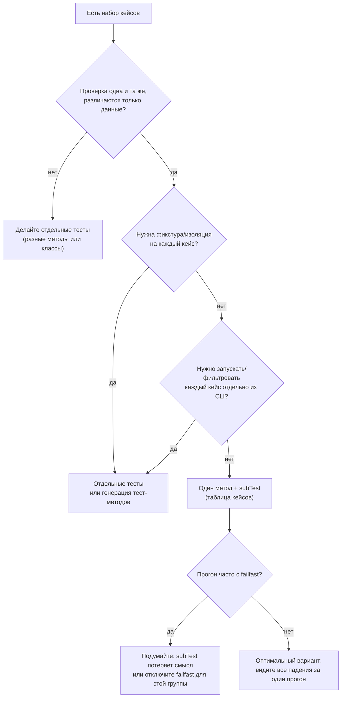

# 50 похожих проверок: писать 50 тестов или один тест с `subTest()`?

Вы добавляете в проект проверку простой функции. Потом ещё одну. Потом появляется список граничных случаев: пустые строки, пробелы, разные локали, неверные типы, «почти правильные» значения. В какой‑то момент тестов становится много, и перед Вами встаёт вопрос не про синтаксис `unittest`, а про стратегию:

- писать **много маленьких тестов**, где каждый метод проверяет одну мысль;
- или написать **один тест**, который прогоняет таблицу кейсов и различает их через `self.subTest(...)`.

Оба подхода «правильные» с точки зрения фреймворка. Ошибки начинаются тогда, когда Вы используете подход не по назначению: превращаете табличные кейсы в копипасту из десятков методов, или наоборот — запихиваете разную бизнес‑логику в один большой цикл, после чего отчёт становится нечитаемым, а тест — хрупким.

## Введение: сначала договоримся о «единице» теста

В `unittest` базовая единица исполнения — это **тестовый метод** `test_*` в классе `unittest.TestCase`. Для каждого такого метода фреймворк создаёт **новый экземпляр `TestCase`** и вызывает `setUp()` → тестовый метод → `tearDown()`. То есть фикстура и жизненный цикл привязаны именно к методу, а не к проверке внутри метода. ([Python documentation][1])

Это важно, потому что стратегия «много маленьких тестов» фактически означает:

- много отдельных методов `test_*`;
- много отдельных циклов `setUp/tearDown` (если они определены);
- больше точек входа для выборочного запуска из CLI.

Стратегия «один тест + `subTest`» означает другое:

- один метод `test_*`;
- одна фикстура `setUp/tearDown` на весь набор под‑кейсов;
- внутри метода — несколько «под‑проверок», которые фреймворк умеет отличать в отчёте.

Сам `subTest()` задуман именно для ситуации «тесты отличаются очень мало, например, параметрами» — это дословно отражено в документации. ([Python documentation][1])

## Что такое `subTest()` с точки зрения механики `unittest`

`self.subTest(msg=None, **params)` — это контекст‑менеджер. Вы помещаете внутрь `with self.subTest(...):` одну итерацию проверки. Если внутри этой итерации случается ошибка или ассерция падает, `unittest` фиксирует это как отдельный результат **под‑теста**, но выполнение метода продолжается после блока. В исходниках это сформулировано прямым текстом: «ошибка в под‑тесте помечает тест‑кейс как проваленный, но выполнение продолжается в конце блока». ([GitHub][2])

Ключевой интерфейс, через который под‑тесты попадают в отчёт, — `TestResult.addSubTest(test, subtest, err)`.

- `err` равен `None`, если под‑тест завершился успешно.
- иначе `err` — это `sys.exc_info()`‑кортеж.
- стандартная реализация **ничего не делает** для успешных под‑тестов и записывает неуспехи как обычные failures/errors. ([Python documentation][1])

Это объясняет, почему `subTest` обычно «молчит» на успехах и «говорит» только на падениях: это базовая политика `unittest` по снижению шума. Если Вам нужно видеть успешные под‑тесты (учебный режим, нестандартная отчётность), это уже задача кастомного `TestResult`, а не ожидание от дефолта.

Ещё один нюанс, который влияет на стратегию: если Вы включаете `failfast` (CLI `-f/--failfast`), то на первом падении под‑теста фреймворк остановит прогон. В реализации `subTest` это видно буквально: при `result.failfast` поднимается внутреннее исключение `_ShouldStop`. ([Python documentation][1])

## Две стратегии: что Вы выигрываете и что теряете

Чтобы решение не было «делом вкуса», полезно разложить выбор на несколько осей. Ниже — не «список ради списка», а набор реальных конфликтов, которые проявляются в больших проектах.

### Ось 1. Читаемость как спецификация: что легче понять без контекста

Много маленьких тестов часто читаются как оглавление требований. Один тест — одна мысль.

```python
class TestParsePort(unittest.TestCase):
    def test_strips_spaces(self):
        self.assertEqual(parse_port(" 443 "), 443)

    def test_rejects_negative(self):
        with self.assertRaises(ValueError):
            parse_port("-1")

    def test_rejects_too_large(self):
        with self.assertRaises(ValueError):
            parse_port("70000")
```

Плюс такого кода — Вы почти не думаете «какой кейс сейчас упал». Имя метода уже несёт смысл. Минус — если кейсов 40, Вы либо пишете 40 методов, либо начинаете «переиспользовать» хелперы так, что тесты превращаются в тонкую обёртку вокруг общего цикла.

`subTest` даёт другой тип читаемости. Он удобен, когда смысл теста — «одна и та же проверка для набора параметров». Тогда цикл — это не шум, а форма.

```python
class TestParsePort(unittest.TestCase):
    def test_table(self):
        cases = [
            ("80", 80),
            (" 443 ", 443),
            ("0", 0),
            ("65535", 65535),
        ]
        for raw, expected in cases:
            with self.subTest(raw=raw):
                self.assertEqual(parse_port(raw), expected)
```

Здесь метод — одна мысль: «валидные значения парсятся». Различия — в параметрах. Это ровно тот сценарий, для которого `subTest` и описан в документации. ([Python documentation][1])

Риск начинается, когда Вы смешиваете внутри одного цикла **разные** мысли. Например, «валидные значения возвращают число» и «невалидные значения бросают исключение» в одном месте. Такой тест быстро превращается в условный комбайн с ветвлениями и перестаёт объяснять намерение.

Практическое правило: если Вам приходится вставлять в табличный тест много `if/else`, значит таблица описывает не «варианты параметров», а «разные поведения». Это сигнал дробить.

### Ось 2. Гранулярность сигнала в отчёте и управление из CLI

**Много маленьких тестов** дают Вам максимальную управляемость: Вы можете запускать конкретный метод, искать его через `-k`, смотреть длительности по каждому методу, шардировать по списку тестов (если Ваш раннер/CI это поддерживает).

Опция `-k` в `unittest` матчится по **полностью квалифицированному имени тестового метода**. В документации это описано явно: паттерны матчятся по полному имени метода как импортированного лоадером. ([Python documentation][1])

`subTest` не создаёт новых имён тестов на уровне loader’а. У Вас всё равно один метод `test_table`, а параметры под‑теста существуют «внутри результата». Поэтому:

- Вы не сможете сказать CLI «запусти только кейс `raw='70000'`» штатным `-k`.
- Вы сможете запустить метод целиком — и внутри него уже отфильтровать кейсы вручную (например, временным условием в цикле), но это будет логика теста, а не инструмент фреймворка.

Это не “плохо”. Это цена табличного подхода.

Отдельная деталь про шум: дефолтный `TextTestResult.addSubTest` печатает статусы только для падающих под‑тестов (и только тогда, когда `err is not None`). Это видно в исходниках раннера. ([GitHub][3])
Такой вывод обычно легче читать, чем «40 зелёных строк», но он ухудшает ощущение “сколько на самом деле прогналось” — потому что `Ran N tests` считает методы, а не под‑кейсы.

Если для Вас критично, чтобы каждый кейс был отдельной сущностью с отдельным именем, `subTest` не даст этого без дополнительной инфраструктуры.

### Ось 3. Изоляция и утечки состояния: кто отвечает за «чистоту» между кейсами

Когда у Вас много маленьких тестов, изоляция в `unittest` «встроена в модель»: новый `TestCase` на каждый метод, значит новый набор полей, новый `setUp/tearDown`. Документация прямо фиксирует это: `setUp()`, `tearDown()` и `TestCase.__init__()` вызываются один раз на тест (метод). ([Python documentation][1])

Когда у Вас один метод с `subTest`, фреймворк **не** сбрасывает состояние между кейсами. Это один и тот же объект `self`.

И здесь возникает типовая ловушка: Вы начинаете мутировать объект в одном кейсе и забываете вернуть его в исходное состояние для следующего.

Плохой пример (часто случается незаметно):

```python
class TestNormalizer(unittest.TestCase):
    def setUp(self):
        self.buf = []

    def test_table(self):
        cases = ["a", "b", "c"]
        for s in cases:
            with self.subTest(s=s):
                self.buf.append(s)  # состояние копится
                self.assertEqual(
                    self.buf[-1], s
                )  # тест "проходит", но он уже зависит от порядка
```

Этот тест формально зелёный, но он не проверяет того, что Вы думаете. Он проверяет, что список растёт.

Как это чинится в табличной стратегии? Вы переносите состояние внутрь `with`‑блока или делаете явный сброс в начале каждой итерации.

```python
class TestNormalizer(unittest.TestCase):
    def test_table(self):
        cases = ["a", "b", "c"]
        for s in cases:
            with self.subTest(s=s):
                buf = []  # новое состояние на кейс
                buf.append(s)
                self.assertEqual(buf, [s])
```

Смысл здесь не «создайте переменную», а «изолируйте то, что меняется». В маленьких тестах это делает фреймворк. В `subTest` это делаете Вы.

Практическое правило: если тест на `subTest` использует `self.*` как изменяемое хранилище, у Вас должен быть осознанный ответ, почему порядок кейсов не важен и почему состояние не протекает.

### Ось 4. Стоимость фикстуры: где у Вас “дорогой” прогон

Иногда спор «50 методов или `subTest`» на самом деле спор про стоимость `setUp()`.

`unittest` явно позиционирует `setUp/tearDown` как механизм, который выполняется **до и после каждого тестового метода**. ([Python documentation][1])
Если `setUp()` дорогой (создать временную БД, поднять HTTP‑сервер, собрать большой объект), то «много маленьких тестов» может стать заметно медленнее.

В таких случаях у Вас есть три разных инструмента, и важно не перепутать их роли:

1. **Перенести подготовку внутрь теста и переиспользовать результат** — это часто приводит к `subTest`.
2. Использовать **`setUpClass` / `tearDownClass`** (или модульные фикстуры) — Вы сохраняете гранулярность методов, но снижаете стоимость подготовки.
3. Оставить `setUp` как есть, но «пакетно» структурировать тесты (разделить юниты и интеграции, чтобы тяжёлое гонялось реже).

`subTest` выгоден, когда подготовка одна, а проверок много, и эта подготовка действительно общая для всех кейсов. Типовой пример — компиляция большого regex или построение парсера.

```python
class TestParser(unittest.TestCase):
    @classmethod
    def setUpClass(cls):
        cls.parser = build_expensive_parser()

    def test_valid_inputs(self):
        cases = ["a=1", "b=2", "c=3"]
        for raw in cases:
            with self.subTest(raw=raw):
                self.assertTrue(self.parser.accepts(raw))
```

Здесь Вы сочетаете оба мира: дорогое вынесено в `setUpClass`, а табличная проверка остаётся компактной. Это часто лучше, чем выбирать «или‑или».

### Ось 5. “Сколько проблем я увижу за один прогон”

Это одна из причин, почему `subTest` любят: один прогон показывает сразу много падающих кейсов.

В документации `unittest` прямо демонстрирует мотивацию: без `subTest` цикл остановится на первом падении, и диагностика будет хуже, потому что значение параметра не покажется так наглядно. ([Python documentation][1])

Это особенно полезно при валидациях, форматах, парсерах, нормализациях. Вы не хотите чинить дефект “по одному входу за запуск”. Вы хотите увидеть, что ломается весь класс входов.

Но есть два ограничения, которые легко забыть.

Первое: если у Вас включён `failfast`, «собрать все падения» не получится. Прогон остановится на первом плохом под‑тесте. Это прямое следствие `--failfast` и того, как `subTest` реагирует на `result.failfast`. ([Python documentation][1])

Второе: если падение связано с «глобальным состоянием» (например, соединение умерло), то десяток одинаковых ошибок в рамках `subTest` может превратиться в шум. Иногда лучше упасть на первом сигнале и чинить причину, а не собирать все последствия.

Практическое правило: `subTest` полезен, когда падения **разные** и дают информацию. Если падения будут «копиями одного и того же сбоя инфраструктуры», `subTest` увеличит шум.

### Ось 6. Пропуски и ожидаемые падения: насколько тонко Вы хотите управлять кейсами

У маленьких тестов тонкая управляемость встроена: один метод — один статус. Вы можете пометить конкретный кейс `@skipIf` или `@expectedFailure`, не затрагивая остальные.

У `subTest` управляемость другая. В стандартном `unittest` нет отдельного декоратора “expectedFailure для под‑кейса”; под‑тест — это часть выполнения метода. Вы можете внутри цикла вызывать `self.skipTest(...)` для конкретных параметров, но это уже логика теста, а не “метаданные на уровне метода”.

С точки зрения стратегии это означает: если у Вас есть набор кейсов, где половина зависит от платформы, половина нет, и Вам нужна прозрачность в отчёте по каждому кейсу, то проще держать кейсы отдельными тестами или хотя бы отдельными методами по группам, чем строить сложные ветвления внутри одного табличного теста.

## Сравнение в одном месте: краткая таблица компромиссов

| Критерий                                       | Много маленьких тестов                                                    | Один тест + `subTest`                                         |
| ---------------------------------------------- | ------------------------------------------------------------------------- | ------------------------------------------------------------- |
| “Один тест — одна мысль”                       | Обычно отлично                                                            | Отлично, если мысль одна и различия только в параметрах       |
| Изоляция состояния                             | Почти «бесплатно» (новый `TestCase` на метод) ([Python documentation][1]) | На Вашей ответственности (один `self` на все кейсы)           |
| Скорость при дорогом `setUp`                   | Может быть хуже (много `setUp/tearDown`) ([Python documentation][1])      | Может быть лучше (одна подготовка на таблицу)                 |
| Выборочный запуск из CLI (`-k`, запуск метода) | Точечно и удобно ([Python documentation][1])                              | Только на уровне метода, не на уровне кейса                   |
| Диагностика «за один прогон»                   | Часто один дефект → один прогон                                           | Часто видите сразу много дефектов ([Python documentation][1]) |
| Отчётность по успехам                          | Видно по тестам                                                           | Успешные под‑тесты по умолчанию не записываются ([GitHub][4]) |
| Совместимость с `failfast`                     | Ожидаемо (остановка на первом упавшем тесте) ([Python documentation][1])  | Теряется смысл “собрать все падения” ([GitHub][2])            |

## Кульминация: решаем как инженер, а не “по вкусу”

Когда Вы выбираете стратегию, полезно задать себе три вопроса. Они почти всегда снимают спор.

### Вопрос 1. Отличаются ли кейсы **смыслом**, или только **данными**?

Если смысл разный — делайте разные тесты.
Если смысл один, а отличается только вход/выход — это кандидат на `subTest`.

Пример «разный смысл»: “строка очищается от пробелов” и “невалидная строка вызывает исключение”. Это разные требования, разные исходы, разный тип ассертов. Их лучше разделить.

Пример «один смысл»: “все эти строки — валидные идентификаторы”. Там разные данные, но одна проверка.

### Вопрос 2. Нужна ли Вам фикстура на каждый кейс?

Если каждому кейсу нужна независимая подготовка (или он мутирует состояние), маленькие тесты проще и безопаснее.

Если подготовка общая и дорогая, `subTest` может дать заметный выигрыш по времени. Но только если Вы дисциплинированно держите состояние «чистым» внутри каждой итерации.

### Вопрос 3. Должен ли кейс быть адресуемым из CLI как отдельная сущность?

Если да — лучше отдельный тестовый метод (или генерация методов). Опция `-k` матчится по имени метода, а не по параметрам `subTest`. ([Python documentation][1])
Если нет — табличный тест нормален.

## Диаграмма решения: когда использовать `subTest`, а когда дробить



## Развязка: практические шаблоны, которые работают в реальных репозиториях

### Шаблон 1. Комбинируйте: «поведения» — отдельными тестами, «данные» — через `subTest`

Обычно лучший результат даёт смешанный подход.

- Отдельные тесты описывают разные поведения (успех, исключение, крайние случаи).
- Табличный `subTest` закрывает “вариации данных” внутри одного поведения.

```python
class TestParsePort(unittest.TestCase):
    def test_valid_inputs(self):
        cases = [("80", 80), (" 443 ", 443), ("0", 0)]
        for raw, expected in cases:
            with self.subTest(raw=raw):
                self.assertEqual(parse_port(raw), expected)

    def test_rejects_out_of_range(self):
        for raw in ["-1", "70000"]:
            with self.subTest(raw=raw):
                with self.assertRaises(ValueError):
                    parse_port(raw)

    def test_rejects_non_int(self):
        with self.assertRaises(ValueError):
            parse_port("not-int")
```

Здесь `subTest` используется не как «универсальный комбайн», а как инструмент внутри одной мысли. Так код остаётся читабельным.

### Шаблон 2. Делайте таблицу кейсов самодокументируемой

Плохая таблица — это кортежи без смысла. Хорошая — это данные с именами.

```python
from dataclasses import dataclass
import unittest


@dataclass(frozen=True)
class Case:
    name: str
    raw: str
    expected: int | None = None
    raises: type[Exception] | None = None


class TestParsePort(unittest.TestCase):
    def test_cases(self):
        cases = [
            Case(name="trim spaces", raw=" 443 ", expected=443),
            Case(name="min value", raw="0", expected=0),
            Case(name="too large", raw="70000", raises=ValueError),
        ]

        for c in cases:
            with self.subTest(case=c.name, raw=c.raw):
                if c.raises:
                    with self.assertRaises(c.raises):
                        parse_port(c.raw)
                else:
                    self.assertEqual(parse_port(c.raw), c.expected)
```

Да, тут есть `if`. Но он отделяет два **явных** сценария: «ожидаю исключение» и «ожидаю значение». Таблица не прячет смысл, она его несёт.

### Шаблон 3. Если кейсов очень много и нужна адресуемость — генерируйте методы

Иногда у Вас 200 кейсов, и `subTest` начинает мешать: нужно запускать отдельный кейс, видеть время по каждому, шардировать по кейсам. Тогда разумный компромисс — **сгенерировать много маленьких тестов из таблицы**, но без копипасты.

```python
import unittest

CASES = {
    "trim_spaces": (" 443 ", 443),
    "min_value": ("0", 0),
    "max_value": ("65535", 65535),
}


class TestParsePort(unittest.TestCase):
    pass


def _make_test(raw: str, expected: int):
    def test(self):
        self.assertEqual(parse_port(raw), expected)

    return test


for name, (raw, expected) in CASES.items():
    setattr(TestParsePort, f"test_valid__{name}", _make_test(raw, expected))
```

Этот подход даёт Вам:

- отдельные имена методов (значит, `-k` и точечный запуск работают естественно) ([Python documentation][1])
- изоляцию `TestCase` на каждый кейс ([Python documentation][1])
- отсутствие ручного копирования.

Цена — больше «магии» в тестовом модуле. Но иногда это ровно то, что нужно, особенно в больших матрицах совместимости.

### Шаблон 4. Не используйте `subTest` в многопоточном коде без особой причины

Если внутри одного тестового метода Вы запускаете несколько потоков и одновременно используете `self.subTest()` из разных потоков, Вы можете столкнуться с некорректными результатами: `subTest` хранит текущий под‑тест в `self._subtest`, то есть модифицирует состояние `self`. Это обсуждалось как проблема в трекере CPython. ([GitHub][5])

Это не «запрет», но это сигнал: под‑тесты рассчитаны на последовательное выполнение внутри метода. Если Вам нужна многопоточность, лучше либо синхронизировать вызовы, либо отказаться от `subTest` в пользу отдельных тестовых методов.

## Заключение

Выбор между «много маленьких тестов» и «один тест с `subTest`» в `unittest` — это выбор между **гранулярностью управления** и **компактностью табличной проверки**.

Много маленьких тестов дают Вам адресуемость, изоляцию и самодокументируемые имена. Они естественно дружат с CLI‑фильтрацией (`-k`) и с жизненным циклом `TestCase`, где на каждый метод создаётся отдельная фикстура. ([Python documentation][1])

`subTest` полезен, когда проверка одна и та же, а различия — только в параметрах. Он помогает увидеть несколько падающих кейсов за один прогон и делает отчёт информативнее без лишнего шума, потому что дефолтный `TestResult.addSubTest` не фиксирует успешные под‑тесты. ([Python documentation][1])

На практике чаще всего выигрывает смешанная стратегия: разные поведения — отдельными тестами, вариации данных внутри одного поведения — через `subTest`. Это сохраняет читаемость и даёт управляемый сигнал в отчёте без потери контроля.

## Дополнительные материалы

Официальная документация `unittest`: subtests (`TestCase.subTest`) и мотивация «малые различия → отличать итерации». ([Python documentation][1])
Официальная документация `unittest`: опции CLI `-f/--failfast` и `-k` (почему выборочный запуск работает по имени метода, а не по параметрам под‑теста). ([Python documentation][2])
Официальная документация `unittest`: контракт `TestResult.addSubTest` и дефолтное поведение «успехи под‑тестов не записываем». ([Python documentation][3])
Реализация `TestCase.subTest()` в CPython (как продолжается выполнение после падения, и почему `failfast` останавливает прогон). ([GitHub][4])
Реализация `TestResult.addSubTest()` в CPython (почему успехи игнорируются, и как `failfast` вызывает `stop()`). ([GitHub][5])
Реализация вывода под‑тестов в `TextTestResult.addSubTest()` (когда печатаются `FAIL/ERROR` или `F/E`). ([GitHub][6])
Разбор преимуществ и недостатков `subTest` на практике (с примерами и обсуждением компромиссов). ([Article][7])

[1]: `https://docs.python.org/3/library/unittest.html#distinguishing-test-iterations-using-subtests` "unittest — Distinguishing test iterations using subtests — Python documentation"
[2]: `https://docs.python.org/3/library/unittest.html#command-line-options` "unittest — Command-line options (-f/--failfast, -k) — Python documentation"
[3]: `https://docs.python.org/3/library/unittest.html#unittest.TestResult.addSubTest` "unittest — unittest.TestResult.addSubTest — Python documentation"
[4]: `https://github.com/python/cpython/blob/v3.14.3/Lib/unittest/case.py#L3092-L3149` "CPython v3.14.3 — unittest.case.TestCase.subTest implementation"
[5]: `https://github.com/python/cpython/blob/v3.14.3/Lib/unittest/result.py#L950-L984` "CPython v3.14.3 — unittest.result.TestResult.addSubTest implementation"
[6]: `https://github.com/python/cpython/blob/v3.14.3/Lib/unittest/runner.py#L980-L1030` "CPython v3.14.3 — unittest.runner.TextTestResult.addSubTest output"
[7]: `https://blog.ganssle.io/articles/2020/04/subtests-in-python.html` "Paul Ganssle — Subtests in Python (tradeoffs and use cases)"
[1]: https://docs.python.org/3/library/unittest.html "unittest — Unit testing framework — Python 3.14.3 documentation"
[2]: https://github.com/python/cpython/blob/main/Lib/unittest/case.py "cpython/Lib/unittest/case.py at main · python/cpython · GitHub"
[3]: https://github.com/python/cpython/blob/v3.14.3/Lib/unittest/runner.py "cpython/Lib/unittest/runner.py at v3.14.3 · python/cpython · GitHub"
[4]: https://github.com/python/cpython/blob/v3.14.3/Lib/unittest/result.py "cpython/Lib/unittest/result.py at v3.14.3 · python/cpython · GitHub"
[5]: https://github.com/python/cpython/issues/131677?utm_source=chatgpt.com "Flaky test `test_lru_cache_threaded3` · Issue #131677 · python/ ..."
