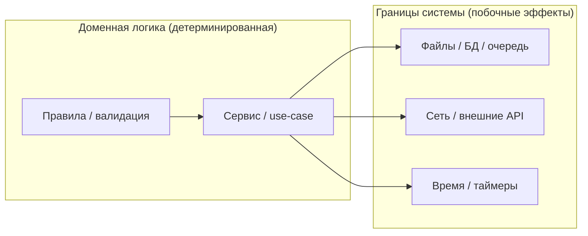

# Мокать или не мокать: как провести границу системы и не испортить тесты

Вы добавляете unit‑тесты к модулю, который «просто парсит конфиг». Потом в коде появляется чтение файла, обращение к HTTP‑сервису, проверка срока действия по текущему времени. И тесты начинают вести себя как погода: то зелёные, то красные, то медленные, то «работает у меня».

Типичная реакция — начать мокать всё подряд. Сеть? Мок. Файлы? Мок. Время? Мок. Внутренние классы? Тоже мок, на всякий случай. Через пару итераций Вы получаете набор тестов, который проходит быстро, но перестаёт быть страховкой: чуть меняете реализацию — тесты ломаются без изменения требований. Или хуже: тесты продолжают проходить, хотя код уже не работает так, как нужно.

`unittest.mock` действительно создан, чтобы «заменять части системы под тестом мок‑объектами и делать утверждения о том, как они использовались». ([Python documentation][1]) Но вопрос не в том, _можете_ ли Вы мокать. Вопрос в том, _где_ мок оправдан, а где он создаёт ложную уверенность и лишний шум.

## Сначала договоримся о терминах: test double ≠ mock

В тестах Вы часто заменяете реальный объект «дублёром» — тестовой подменой. Мартин Фаулер использует для этого общее название **test double** и перечисляет типы: dummy, fake, stub, spy, mock. ([martinfowler.com][2])

> **Короткая полезная шкала (по смыслу, не по “моде”)**
> **Fake** — рабочая реализация «с упрощением» (например, in‑memory база).
> **Stub** — заранее заданные ответы на вызовы.
> **Spy** — stub, который ещё и записывает факты вызовов.
> **Mock** — подмена с ожиданиями/проверкой взаимодействий. ([martinfowler.com][2])

Это важно, потому что на вопрос «мокать или нет?» правильный ответ часто звучит как «не мокать, а сделать фейк» или «вообще не заменять, использовать реальный объект».

В мире `unittest.mock` терминология чуть «прагматичнее»: `Mock` — универсальный объект, который записывает, как его использовали, и позволяет потом сделать проверки по вызовам. ([Python documentation][1]) В документации прямо сказано, что `Mock` ориентирован на паттерн “action → assertion”, то есть сначала Вы выполняете действие, затем проверяете, какие методы и с какими аргументами были вызваны. ([Python documentation][1])

## Где проходит граница системы: почему именно I/O, сеть и время

Почти всегда проблемы с тестируемостью начинаются не в «логике», а на границе, где код общается с внешним миром.

- **I/O**: файлы, база данных, сокеты, stdout/stderr.
- **Сеть**: HTTP, очереди, внешние API, DNS.
- **Время**: `now()`, тайм‑ауты, TTL, расписания, ретраи, “сегодня/вчера”.

Общее у этих границ одно: они либо недетерминированы, либо медленны, либо имеют побочные эффекты, либо всё сразу.

Если Вы пытаетесь тестировать доменную логику и одновременно ходить в сеть, то тест становится «интеграционным по факту», даже если Вы назвали его unit‑тестом. Если Вы пытаетесь стабилизировать это моками, Вы рискуете получить тест, который проверяет не поведение системы, а то, что Вы _вчера_ подумали про реализацию.

Нагляднее всего границу видно в «слоёной» модели. Вам не нужно называться архитектором, чтобы ей пользоваться: достаточно отделить то, что считает и принимает решения, от того, что читает/пишет/звонит.



Смысл диаграммы простой: если Вы тестируете **Core**, то внешние зависимости лучше контролировать. Но контролировать можно по‑разному: моками, стабами, фейками или реальными объектами в изолированной среде.

## Когда мокать: три типовых сценария, где мок оправдан

### 1) Когда внешний эффект опасен или дорог

Если вызов реально «делает действие» (списывает деньги, отправляет письмо, удаляет запись), Вы не хотите, чтобы unit‑тест трогал этот мир.

Здесь мок — разумная подмена, потому что Вы проверяете именно **факт взаимодействия**: «мы попытались отправить письмо с таким-то payload» или «мы вызвали шлюз оплаты один раз». Это соответствует модели `unittest.mock`: заменить часть системы и затем проверить, как её использовали. ([Python documentation][1])

### 2) Когда зависимость недетерминирована

Сеть и время не дают стабильности. Сегодня `now()` одно, завтра другое. API может вернуть 500, тайм‑аут, другой порядок полей.

Если поведение системы зависит от **конкретного ответа** сети/времени, для unit‑теста Вам нужна контролируемая среда. Значит, сеть и время должны быть подменяемыми.

### 3) Когда Вы хотите протестировать обработку ошибок, которые сложно воспроизвести «по-настоящему»

Например, ошибка чтения файла, тайм‑аут сети, “сломанный” ответ JSON. Делать это через реальные условия иногда можно, но часто это или сложно (нужно настраивать окружение), или медленно, или нестабильно. Тогда мок/стаб — практичное решение.

## Когда НЕ мокать: четыре ситуации, где мок чаще вредит

### 1) Когда можно проверить состояние, а Вы проверяете “какие методы вызывали”

Фаулер противопоставляет **state verification** (“проверяем итоговое состояние/результат”) и **behavior verification** (“проверяем взаимодействия/вызовы”). ([martinfowler.com][3])

Для доменной логики почти всегда полезнее state verification. Если функция должна вернуть конкретный результат, проще и надёжнее проверить результат, чем проверять, что она «вызвала метод X у объекта Y».

Моки по умолчанию тянут Вас в сторону проверок взаимодействий. Это не плохо само по себе. Это плохо, когда Вы начинаете проверять внутреннюю механику, которая не является контрактом.

### 2) Когда Вы мокаете «простые» вещи вместо реальных объектов

Если зависимость лёгкая, детерминированная и не имеет побочных эффектов, мок почти ничего не даёт, но добавляет хрупкость.

Пример: мокать `datetime.date` ради сравнения дат внутри чистой функции — обычно хуже, чем просто передать дату параметром.

### 3) Когда Вы мокаете свой код (внутренние классы/функции)

Если Вы мокаете собственный модуль «внутри», Вы часто тестируете не поведение, а структуру текущей реализации. Любой рефакторинг превращается в каскад правок тестов.

Более здоровая альтернатива — выделить зависимость как явный параметр (порт/интерфейс) и подменять её на границе. Или использовать фейк, который ведёт себя как настоящий компонент, но проще.

### 4) Когда моки дают ложное чувство безопасности

Это важная мысль из документации `unittest.mock`: моки гибкие, но у них есть уязвимость — после рефакторинга тесты могут продолжать проходить, даже если код сломан, потому что моки не “знают” реальный API. ([Python documentation][1])
Документация прямо говорит, что это причина иметь интеграционные тесты в дополнение к unit‑тестам: если Вы не тестируете «как компоненты соединены», остаётся много места для багов, которые unit‑тесты не поймают. ([Python documentation][1])

## Практика на коде: один сценарий, три границы (файл, сеть, время)

Ниже мини‑пример, который специально собран так, чтобы показать границы. Код разделён на «ядро» и «адаптеры». В реальном проекте Вы можете сделать иначе, но идея та же: доменная часть должна жить без сети/файлов/времени.

### Производственный код: сервис, который решает задачу, а не занимается I/O

```python
# app.py
from __future__ import annotations

from dataclasses import dataclass
from datetime import datetime, timezone
from typing import Protocol


class Clock(Protocol):
    def now(self) -> datetime: ...


class HttpClient(Protocol):
    def get_json(self, url: str) -> dict: ...


class FileStore(Protocol):
    def read_text(self, path: str) -> str: ...


@dataclass(frozen=True)
class Config:
    port: int
    feature_x_enabled: bool
    expires_at: datetime  # UTC


def parse_bool(raw: str) -> bool:
    token = raw.strip().lower()
    if token in {"1", "true", "yes", "on"}:
        return True
    if token in {"0", "false", "no", "off"}:
        return False
    raise ValueError(f"invalid bool: {raw!r}")


def parse_config_text(text: str) -> dict[str, str]:
    """
    Очень простой формат:
      KEY=VALUE
    Пустые строки и #комментарии игнорируем.
    """
    out: dict[str, str] = {}
    for line in text.splitlines():
        line = line.strip()
        if not line or line.startswith("#"):
            continue
        key, value = line.split("=", 1)
        out[key.strip()] = value.strip()
    return out


def build_config(local_kv: dict[str, str], remote_kv: dict[str, str]) -> Config:
    """
    Доменная часть: чистое преобразование словарей в Config.
    Никакой сети, файлов и времени здесь нет.
    """
    merged = dict(local_kv)
    merged.update(remote_kv)

    port = int(merged["PORT"])
    enabled = parse_bool(merged.get("FEATURE_X", "false"))

    # ISO8601, UTC: '2026-03-06T10:00:00Z'
    expires_raw = merged["EXPIRES_AT"].replace("Z", "+00:00")
    expires_at = datetime.fromisoformat(expires_raw).astimezone(timezone.utc)

    return Config(port=port, feature_x_enabled=enabled, expires_at=expires_at)


class ConfigService:
    def __init__(self, *, store: FileStore, http: HttpClient, clock: Clock) -> None:
        self._store = store
        self._http = http
        self._clock = clock

    def load(self, *, path: str, url: str) -> Config:
        # Граница 1: файл
        local_text = self._store.read_text(path)
        local_kv = parse_config_text(local_text)

        # Граница 2: сеть
        remote_kv = self._http.get_json(url)

        cfg = build_config(local_kv, remote_kv)

        # Граница 3: время
        if self._clock.now() >= cfg.expires_at:
            raise RuntimeError("config expired")

        return cfg
```

Обратите внимание: самая «ценная» логика — в `build_config`. Она детерминированная. Её не нужно мокать. Её нужно кормить данными и проверять результат.

А вот `ConfigService.load()` — это «сшивка» границ. Там появляются зависимости, которые в тестах надо контролировать.

## Тест 1: не мокать то, что можно проверить напрямую

Начнём с чистой логики. Здесь моки добавят только шум.

```python
# test_core.py
import unittest
from datetime import datetime, timezone

from app import build_config


class TestBuildConfig(unittest.TestCase):
    def test_merge_and_parse(self):
        local = {"PORT": "8080", "FEATURE_X": "false"}
        remote = {"FEATURE_X": "true", "EXPIRES_AT": "2026-03-06T10:00:00Z"}

        cfg = build_config(local, remote)

        self.assertEqual(cfg.port, 8080)
        self.assertTrue(cfg.feature_x_enabled)
        self.assertEqual(
            cfg.expires_at, datetime(2026, 3, 6, 10, 0, tzinfo=timezone.utc)
        )
```

Здесь нет сети/файла/времени. Мокать нечего. И это хороший ориентир: если компонент можно протестировать как функцию, делайте это как функцию.

## Тест 2: на границе сети/файла/времени лучше контролировать окружение

Для `ConfigService` можно выбрать два подхода.

Первый — использовать простые «фейки» (маленькие рабочие реализации) и только точечно моки там, где Вам важны взаимодействия. Этот путь часто приводит к менее хрупким тестам, потому что Вы проверяете итоговое поведение.

```python
# test_service_with_fakes.py
import unittest
from datetime import datetime, timezone

from app import ConfigService


class FakeStore:
    def __init__(self, text: str) -> None:
        self._text = text

    def read_text(self, path: str) -> str:
        return self._text


class FakeHttp:
    def __init__(self, payload: dict) -> None:
        self._payload = payload

    def get_json(self, url: str) -> dict:
        return dict(self._payload)


class FixedClock:
    def __init__(self, now: datetime) -> None:
        self._now = now

    def now(self) -> datetime:
        return self._now


class TestConfigService(unittest.TestCase):
    def test_load_ok(self):
        store = FakeStore("PORT=8080\nFEATURE_X=false\n")
        http = FakeHttp({"FEATURE_X": "true", "EXPIRES_AT": "2026-03-06T10:00:00Z"})
        clock = FixedClock(datetime(2026, 3, 6, 9, 59, tzinfo=timezone.utc))

        svc = ConfigService(store=store, http=http, clock=clock)
        cfg = svc.load(path="local.env", url="https://example.test/config")

        self.assertEqual(cfg.port, 8080)
        self.assertTrue(cfg.feature_x_enabled)

    def test_expired_raises(self):
        store = FakeStore("PORT=8080\nFEATURE_X=true\n")
        http = FakeHttp({"EXPIRES_AT": "2026-03-06T10:00:00Z"})
        clock = FixedClock(datetime(2026, 3, 6, 10, 0, tzinfo=timezone.utc))

        svc = ConfigService(store=store, http=http, clock=clock)

        with self.assertRaises(RuntimeError):
            svc.load(path="local.env", url="https://example.test/config")
```

В этих тестах нет `unittest.mock`, но это не «нарушение темы». Это демонстрация ключевого принципа: мок — не обязан быть первой реакцией. Если фейк проще и честнее, используйте фейк.

## Тест 3: когда мок действительно уместен — проверяем взаимодействие на границе

Иногда Вам важно не только «что получилось», но и «как мы вызвали зависимость». Например, Вы хотите убедиться, что сервис ходит по правильному URL или передаёт корректные аргументы.

Тут `unittest.mock.Mock` делает работу за Вас: записывает вызовы и даёт `assert_called_*`. ([Python documentation][1])

```python
# test_service_with_mocks.py
import unittest
from datetime import datetime, timezone
from unittest.mock import Mock

from app import ConfigService


class TestConfigServiceInteractions(unittest.TestCase):
    def test_calls_store_and_http(self):
        store = Mock()
        store.read_text.return_value = "PORT=8080\nFEATURE_X=false\n"

        http = Mock()
        http.get_json.return_value = {"EXPIRES_AT": "2026-03-06T10:00:00Z"}

        clock = Mock()
        clock.now.return_value = datetime(2026, 3, 6, 9, 0, tzinfo=timezone.utc)

        svc = ConfigService(store=store, http=http, clock=clock)
        _ = svc.load(path="cfg.env", url="https://example.test/config")

        store.read_text.assert_called_once_with("cfg.env")
        http.get_json.assert_called_once_with("https://example.test/config")
        clock.now.assert_called_once_with()
```

Здесь Вы используете мок ровно по назначению: проверяете, что на границе взаимодействие соответствует ожиданиям.

И здесь же начинается тонкая грань. Если Вы начнёте утверждать «сервис делает три вызова в таком порядке» или «перед вызовом он проверяет то-то», то тест станет привязан к реализации. Любая перестановка строк — и тест падает, хотя бизнес‑поведение могло не измениться.

## I/O: когда лучше реальный файл, а когда `mock_open`

Файловая система — граница. Но это не значит, что её всегда надо мокать.

Если Вы тестируете «разбор файла как текста», иногда проще и честнее создать временный файл и прочитать его. Это интеграционный штрих, но он даёт уверенность, что код работает с реальным `open()` и кодировками.

Если же Вам важно протестировать логику обработки содержимого и исключить файловую инфраструктуру, у `unittest.mock` есть инструмент `mock_open()`. Это helper для замены `open()` и работы с ним как с контекст‑менеджером. ([Python documentation][1])

Пример: функция читает файл и парсит строки.

```python
# io_module.py
def read_first_line(path: str) -> str:
    with open(path, "r", encoding="utf-8") as f:
        return f.readline().rstrip("\n")
```

Тест без реального файла:

```python
# test_io_module.py
import unittest
from unittest.mock import mock_open, patch

import io_module


class TestReadFirstLine(unittest.TestCase):
    def test_reads_first_line(self):
        m = mock_open(read_data="hello\nworld\n")
        with patch("io_module.open", m):
            self.assertEqual(io_module.read_first_line("any.txt"), "hello")
```

Здесь важна именно замена `open` в пространстве имён модуля под тестом (`io_module.open`). Это отражает общий принцип `patch`: он «временно меняет объект, на который указывает имя», и патчить надо имя, которое использует код под тестом. ([Python documentation][1])

Если Вы мокаете I/O, держите в голове ограничение `mock_open`: документация честно говорит, что модель чтения «довольно простая» и при необходимости более реалистичного поведения лучше смотреть на in‑memory filesystem решения. ([Python documentation][1]) Это ещё один пример того, что «мок не обязан быть универсальным ответом».

## Сеть: мокайте не “интернет”, а контракт Вашего клиента

Самая частая ошибка со «сетевыми» моками — мокать слишком низко, прямо `urlopen()`/`requests.get()`, и превращать тест в проверку деталей HTTP.

Если Ваша бизнес‑логика зависит от того, что **клиент возвращает данные определённой формы**, то полезнее тестировать через Ваш абстрактный `HttpClient`, как в примере `ConfigService`. Это делает тест проще и стабильнее: Вы мокаете Ваш контракт, а не чужую библиотеку.

Если же Вы вынуждены патчить библиотеку напрямую, помните принцип `patch`: патчить нужно «там, где объект ищется» (where it is looked up), а не там, где он определён. ([Python documentation][1])
И помните, что `patch()` работает как декоратор или контекст‑менеджер и автоматически откатывает подмену после выхода из области действия. ([Python documentation][1])

## Время: лучший мок времени — это зависимость `Clock`

Время — плохая зависимость для тестов, потому что оно меняется независимо от Вашего кода. Самый чистый приём — не патчить `datetime.now`, а сделать время явной зависимостью (`Clock`) и подменять её, как в примере `FixedClock`.

Это даёт Вам два эффекта:

- тесты становятся полностью детерминированными;
- Вы не боретесь с тонкостями патчинга `datetime` (которые почти всегда заканчиваются вопросом «а где именно патчить?»).

Если Вы всё-таки используете `patch`, принцип тот же: патчите имя в модуле, который вызывает `now()`. `patch` устроен как подмена объекта, на который указывает имя, поэтому место подмены критично. ([Python documentation][1])

## Как принять решение быстро: три вопроса к зависимости

Чтобы не превращать выбор в «религию», держите короткий фильтр. Обычно хватает трёх вопросов.

1. **Есть ли у зависимости побочный эффект?**
   Если да, Ваш unit‑тест не должен этот эффект реально производить.

2. **Может ли зависимость дать недетерминированный результат?**
   Сеть и время почти всегда да. Значит, для unit‑теста нужна подмена.

3. **Делает ли подмена тест хрупким?**
   Если подмена заставляет проверять «как именно устроен код», а не «что он делает», Вы покупаете проблемы сопровождения.

Если Вы ответили «да» на (1) или (2), подмена почти неизбежна. Но её вид выбирается отдельно: мок, стаб или фейк.

## И главный предохранитель: моки не заменяют интеграцию

Даже идеальные unit‑тесты не гарантируют, что система «сшита правильно». Документация `unittest.mock` прямо подчёркивает этот риск и прямо рекомендует иметь интеграционные тесты, чтобы поймать ошибки в “wiring” компонентов. ([Python documentation][1])

Если Вы мокаете сеть, заведите хотя бы минимальный интеграционный тест, который раз в день/на отдельном этапе CI проверяет реальный вызов в тестовое окружение или контракт ответа. Если Вы мокаете файл, проверьте хотя бы один сценарий с реальным `open()`. Если Вы подменяете время, оставьте один тест на «границе суток» как системный сценарий, чтобы убедиться, что контракт времени соблюдён в проде.

## Заключение

Заключение: мокирование — это не «техника покрытия строк», а способ контролировать границы системы там, где тесту мешают побочные эффекты, недетерминизм и внешние ресурсы. `unittest.mock` позволяет заменять части системы и проверять, как они были использованы, а `patch()` даёт удобную временную подмену в рамках теста. ([Python documentation][1])

Хорошая стратегия выглядит так: доменную логику Вы тестируете без моков, через проверку результата. На границах (I/O, сеть, время) Вы вводите явные зависимости и подменяете их стабами/фейками/моками по необходимости. И Вы не забываете про интеграционные тесты, потому что моки могут дать ложную уверенность после рефакторинга и не поймать ошибки “склейки” компонентов. ([Python documentation][1])

## Дополнительные материалы

Официальная документация `unittest.mock` (что такое `Mock`, `MagicMock`, `patch()`, паттерн “action → assertion”). ([Python documentation][1])
Раздел `Where to patch` в `unittest.mock` (почему патчить нужно “где ищется имя”, а не “где определён объект”). ([Python documentation][2])
`mock_open()` в `unittest.mock` (как корректно мокать `open()` и контекст‑менеджер). ([Python documentation][3])
Martin Fowler: Test Double (внятная терминология: dummy/fake/stub/spy/mock). ([Martin Fowler][4])
Martin Fowler: Mocks Aren’t Stubs (state vs behavior verification и как моки влияют на стиль тестирования). ([Martin Fowler][5])
Исходники CPython: реализация `unittest.mock` (полезно, если Вы хотите понять детали поведения `patch` и классов моков). ([GitHub][6])

[1]: `https://docs.python.org/3/library/unittest.mock.html` "unittest.mock — mock object library — Python documentation"
[2]: `https://docs.python.org/3/library/unittest.mock.html#where-to-patch` "unittest.mock — Where to patch — Python documentation"
[3]: `https://docs.python.org/3/library/unittest.mock.html#mock-open` "unittest.mock — mock_open — Python documentation"
[4]: `https://martinfowler.com/bliki/TestDouble.html` "Test Double — Martin Fowler"
[5]: `https://martinfowler.com/articles/mocksArentStubs.html` "Mocks Aren't Stubs — Martin Fowler"
[6]: `https://github.com/python/cpython/blob/main/Lib/unittest/mock.py` "cpython/Lib/unittest/mock.py — GitHub"
[1]: https://docs.python.org/3/library/unittest.mock.html "unittest.mock — mock object library — Python 3.14.3 documentation"
[2]: https://martinfowler.com/bliki/TestDouble.html "Test Double"
[3]: https://martinfowler.com/articles/mocksArentStubs.html "Mocks Aren't Stubs"
