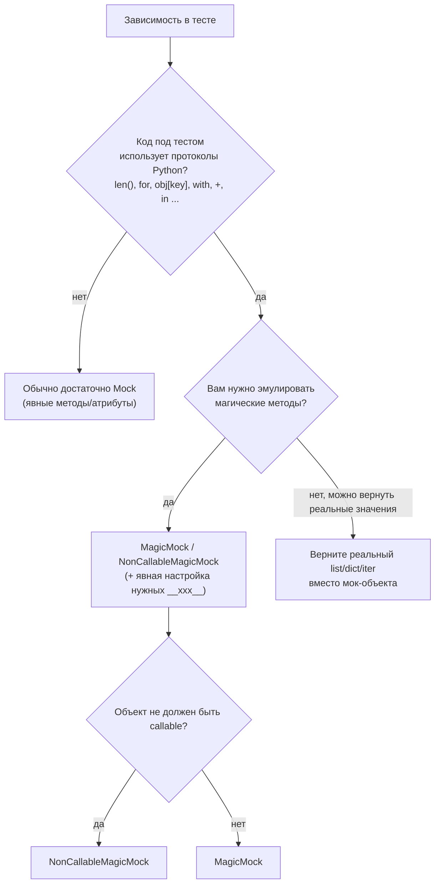

# `Mock` vs `MagicMock`: что даёт «магия» и почему от неё зависит надёжность тестов

Вы пишете тест и подменяете зависимость `Mock()` — всё выглядит логично. А потом код под тестом делает `len(obj)`, проходит по объекту в `for`, использует `obj[key]` или заходит в `with obj:`. И внезапно тест падает с `TypeError`, хотя в проде всё работает.

Первая реакция — заменить `Mock` на `MagicMock`. Тесты снова зелёные. Но через некоторое время выясняется другая проблема: часть тестов стала **слишком терпимой**. Они перестали ловить ошибки интеграции и опечатки в API, потому что «магия» автоматически подстраивается под многие протоколы Python.

## Введение

В `unittest.mock` есть два близких инструмента:

- `Mock` — универсальный мок для методов и атрибутов, который записывает вызовы и позволяет проверять взаимодействия.
- `MagicMock` — тот же мок, но с преднастроенной поддержкой большинства **магических методов** (`__len__`, `__iter__`, `__getitem__`, `__enter__`, `__add__` и т. д.), то есть с поддержкой протоколов Python. ([Python documentation][1])

Чтобы выбрать правильно, важно понимать две вещи:

1. почему `Mock` по умолчанию «не дружит» с магическими методами;
2. какие «дефолты» у `MagicMock` могут помочь, а какие — создать ложную уверенность.

## 1) Что делает обычный `Mock` и почему этого часто достаточно

`Mock` в `unittest.mock` задуман как базовый тестовый двойник: Вы заменяете им часть системы и после действия проверяете, как эта часть использовалась. Он создаёт атрибуты «на лету» и записывает вызовы, аргументы, историю обращений. ([Python documentation][1])

Типичный сценарий — зависимость с явным API: “клиент”, “репозиторий”, “шлюз”, “нотификационный сервис”. Вы не хотите поднимать сеть/БД/внешний сервис, поэтому подставляете мок и проверяете, что вызвали методы с правильными аргументами.

```python
import unittest
from unittest.mock import Mock


class Newsletter:
    def __init__(self, sender):
        self._sender = sender

    def send_welcome(self, email: str) -> None:
        self._sender.send(email, template="welcome")


class TestNewsletter(unittest.TestCase):
    def test_send_welcome_calls_sender(self):
        sender = Mock()
        svc = Newsletter(sender)

        svc.send_welcome("user@example.com")

        sender.send.assert_called_once_with("user@example.com", template="welcome")
```

Здесь `Mock` идеален: он фиксирует взаимодействие и не пытается изображать контейнер, итератор или число.

> **Ключевой ориентир:** если код под тестом обращается к зависимости как к объекту с обычными методами (`client.get()`, `repo.save()`), `Mock` почти всегда достаточно. ([Python documentation][1])

Но как только зависимость используется через **протоколы языка** (итерация, индексирование, `with`, арифметика), `Mock` начинает «сопротивляться». И это не случайность.

## 2) Почему `Mock` ломается на `len()`, `for`, `obj[key]` и других протоколах

### “Магические” методы — не просто методы

Многие операции в Python (синтаксис и built-in функции) вызывают так называемые _special methods_ (`__len__`, `__iter__`, `__getitem__`, `__enter__`, …). Главное отличие: для корректной работы **не гарантируется**, что достаточно положить `__len__` в словарь экземпляра. Для “неявного” вызова интерпретатор ориентируется на то, что специальный метод определён **на типе**, а не в `instance.__dict__`. ([Python documentation][2])

В документации Python это прямо показано на примере: если присвоить `c.__len__ = ...`, то `len(c)` всё равно упадёт, потому что `len()` делает “implicit lookup” специального метода. ([Python documentation][2])

Это объясняет частый сюрприз в тестах: Вы вроде бы «настроили» `__len__` на объекте, а `len(obj)` не заработал.

### Почему `Mock` по умолчанию не создаёт магические методы

`Mock` создаёт атрибуты автоматически почти всегда… но делает **исключение** для имён вида `__xxx__`. По документации `unittest.mock`, “магические методы и атрибуты” не создаются автоматически: вместо этого поднимается `AttributeError`. Причина — интерпретатор может запрашивать такие методы неявно, и возвращать новый мок там, где ожидается реальный магический метод, “путает” интерпретатор. ([Python documentation][1])

На практике это выглядит так:

```python
from unittest.mock import Mock

m = Mock()

len(m)  # TypeError: object of type 'Mock' has no len()
for _ in m:  # TypeError: 'Mock' object is not iterable
    pass

m[0]  # TypeError: 'Mock' object is not subscriptable
with m:  # TypeError: 'Mock' object does not support the context manager protocol
    pass
```

Именно здесь появляется `MagicMock`.

## 3) Что такое `MagicMock` и какая «магия» в нём реально есть

`MagicMock` — это подкласс `Mock`, у которого заранее “подготовлены” (pre-created) большинство полезных магических методов. В документации это описано напрямую: `MagicMock` — “Mock с дефолтными реализациями большинства magic methods”, который можно использовать без ручной конфигурации этих методов. ([Python documentation][1])

У него есть и невызываемая версия — `NonCallableMagicMock`, полезная, когда Вы мокаете объект, который _не должен_ быть callable. Документация также упоминает `NonCallableMock` для обычного `Mock`. ([Python documentation][1])

### Поддерживаемые магические методы

`unittest.mock` документирует набор магических методов, которые мок умеет поддерживать (контейнерные, контекст‑менеджеры, числовые операторы, преобразования типов и др.). Важные для практики группы:

- контейнерные (`__getitem__`, `__setitem__`, `__contains__`, `__len__`, `__iter__`…);
- контекст‑менеджеры (`__enter__`, `__exit__`, а также async-варианты);
- числовые операции (`__add__`, `__mul__`, …) и преобразования (`__int__`, `__float__`, …). ([Python documentation][1])

### “Дефолты” для протокольных методов

Чтобы магические методы можно было использовать “из коробки”, многие из них преднастроены на конкретные значения нужных типов. В документации приведены дефолты, которые важно знать, потому что они напрямую влияют на ветвления в коде:

- `__len__` возвращает `0`
- `__iter__` возвращает `iter([])`
- `__contains__` возвращает `False`
- `__exit__` возвращает `False`
- `__int__` возвращает `1`
- `__bool__` возвращает `True` ([Python documentation][1])

Это и есть практическая “магия”: объект внезапно становится похож на контейнер/итератор/контекст‑менеджер/число, хотя Вы ничего не настраивали.

## 4) Мини-карта выбора: когда нужен `Mock`, когда `MagicMock`

Чтобы не превращать выбор в “дело вкуса”, держите простой критерий: **каким образом код под тестом использует зависимость**.



Решение “верните реальный list/dict/iter” часто недооценивают. Если Вам не нужно проверять взаимодействия с контейнером, то проще и честнее вернуть обычный список или словарь и тестировать логику, а не протоколы моков.

## 5) Практика: где `MagicMock` экономит время и делает тест проще

### Сценарий A: объект используется как контейнер (`obj[key]`, `key in obj`, `len(obj)`)

Допустим, у Вас сервис читает значение из кэша:

```python
class CacheClient:
    def __getitem__(self, key): ...
    def __contains__(self, key): ...
    def __len__(self): ...


class FeatureFlags:
    def __init__(self, cache: CacheClient):
        self._cache = cache

    def is_enabled(self, flag: str) -> bool:
        if flag in self._cache:
            return bool(self._cache[flag])
        return False
```

Если Вы подмените `cache` на `Mock`, тест упадёт уже на `flag in self._cache` — потому что `Mock` “не итерабелен” и не поддерживает `__contains__`. Если Вы подмените на `MagicMock`, протокол начинает работать, и Вы можете управлять поведением через магические методы:

```python
import unittest
from unittest.mock import MagicMock


class TestFeatureFlags(unittest.TestCase):
    def test_enabled_when_present_and_truthy(self):
        cache = MagicMock()
        cache.__contains__.return_value = True
        cache.__getitem__.return_value = "1"

        flags = FeatureFlags(cache)
        self.assertTrue(flags.is_enabled("new-ui"))

        cache.__contains__.assert_called_once_with("new-ui")
        cache.__getitem__.assert_called_once_with("new-ui")
```

Плюс `MagicMock` — Вы пишете тест на поведение без ручного «подкладывания» магических методов в класс.

Но есть и важный нюанс: если Вам не нужна проверка вызовов `__getitem__`, можно вообще не мокать контейнер — можно дать обычный `dict` и сосредоточиться на логике. `MagicMock` нужен, когда контейнер сам по себе — граница системы и Вам важно проверять взаимодействие.

### Сценарий B: зависимость должна быть итератором (`for`, генераторы, `list(obj)`)

Классическая история: код вызывает метод, который возвращает генератор или итератор.

```python
class Repo:
    def iter_ids(self):
        yield from ()


class Service:
    def __init__(self, repo: Repo):
        self._repo = repo

    def sum_ids(self) -> int:
        return sum(self._repo.iter_ids())
```

Если Вы хотите замокать `iter_ids()`, удобнее всего вернуть настоящий итератор, а не “магический” объект:

```python
from unittest.mock import Mock

repo = Mock()
repo.iter_ids.return_value = iter([1, 2, 3])
```

Но если Вам нужно замокать именно «объект, который итерируется» (например, объект-обёртку с `__iter__`), то документация `unittest.mock` в примерах прямо указывает: протокол итерации реализуется `__iter__()`, и его удобно мокать через `MagicMock`. ([Python documentation][3])

Практически это выглядит так:

```python
items = MagicMock()
items.__iter__.return_value = iter([1, 2, 3])

self.assertEqual(list(items), [1, 2, 3])
```

Если Вы попробуете тот же приём с `Mock`, велик шанс получить `TypeError`, потому что `Mock` не поддерживает итерацию протокольным способом.

### Сценарий C: контекст‑менеджер (`with obj:`)

Файлы, транзакции, lock’и, сессии — всё это часто используется через `with`.

`MagicMock` здесь удобен, потому что `__enter__`/`__exit__` уже есть. Но важно знать: документация показывает, что и “обычный” `Mock` можно настроить вручную, если присвоить `__enter__` и `__exit__` явными моками. ([Python documentation][1])

Это рабочий минимализм, когда Вам не нужен полный набор магических методов:

```python
from unittest.mock import Mock

cm = Mock()
cm.__enter__ = Mock(return_value="resource")
cm.__exit__ = Mock(return_value=False)

with cm as r:
    assert r == "resource"

cm.__enter__.assert_called_once_with()
cm.__exit__.assert_called_once()
```

Но если объект одновременно и контекст‑менеджер, и контейнер (или участвует в операторах), `MagicMock` обычно экономит время.

## 6) Где “магия” может испортить тесты: типовые ловушки

`MagicMock` делает тесты проще ровно до момента, когда его дефолтное поведение начинает подменять Вашу модель предметной области. Основная опасность — не в самом `MagicMock`, а в том, что он **тихо** даёт значения по умолчанию, которые выглядят “правдоподобно”.

### Ловушка 1: `len()` и итерация имеют дефолты, которые меняют ветвления

По умолчанию `len(MagicMock()) == 0`, а итерация даёт пустой итератор. ([Python documentation][1])
Если Вы забыли настроить мок, код может уйти в ветку “пусто” и тест этого не заметит, если Вы проверяете только “не упало”.

Плохой тест, который легко сделать случайно:

```python
from unittest.mock import MagicMock


def process(queue, handler):
    if len(queue) == 0:
        return
    for item in queue:
        handler(item)


def test_process_does_not_crash():
    queue = MagicMock()  # len == 0, iter == []
    handler = MagicMock()

    process(queue, handler)

    # тест "зелёный", но он не проверяет ничего полезного
```

Сам код может быть сломан, но тест продолжит быть зелёным, потому что `queue` “по умолчанию пустая”. Это не значит, что `MagicMock` плох. Это значит, что Вы использовали мок там, где нужно было:

- либо вернуть реальный список;
- либо явно настроить `__len__`/`__iter__` под сценарий.

### Ловушка 2: булева истинность `MagicMock` не совпадает с “пустым контейнером”

Документация фиксирует дефолт `__bool__ == True`, даже при `__len__ == 0`. ([Python documentation][1])
Это может быть контринтуитивно: `if mock:` будет истинным, хотя `len(mock)` равно 0.

Если в коде есть смесь `if obj:` и `if len(obj) == 0:`, то `MagicMock` без настройки может вести себя «не как реальный объект», а как странная гибридная сущность. Для тестов это источник шума.

### Ловушка 3: слишком много “цепочек” и слишком мало явной конфигурации

И `Mock`, и `MagicMock` создают атрибуты при обращении. ([Python documentation][1])
Поэтому ошибки вида “вызвали несуществующий метод” легко проскальзывают, если Вы не ограничили интерфейс. Документация прямо предлагает `spec`/`autospec`, чтобы мок “падал так же, как прод”, если его используют неправильно. ([Python documentation][1])

Это отдельная большая тема (обычно её выносят в следующий модуль про `spec` и `autospec`), но принцип важно знать уже здесь: если Вы хотите, чтобы тесты ловили изменения API, не оставляйте моки «без спецификации».

## 7) Важный практический факт: `patch()` по умолчанию создаёт `MagicMock`

Даже если Вы сознательно выбираете `Mock`, в реальной кодовой базе часто используется `patch()`. И тут у многих возникает неожиданность: `patch()` **по умолчанию** подставляет `MagicMock` (а для async-функций — `AsyncMock`). Это прямо написано в документации `unittest.mock.patch`. ([Python documentation][1])

Значит, Вы можете использовать `MagicMock`, даже не импортируя его явно.

Если Вам нужен именно `Mock` (например, чтобы падать на `len()` и не скрывать использование протоколов), Вы можете задать класс через `new_callable`. Документация говорит, что альтернативный класс мока задаётся именно так. ([Python documentation][1])

Мини-пример:

```python
from unittest.mock import patch, Mock

with patch("mymodule.client", new_callable=Mock) as client_mock:
    ...
```

Это полезно как «предохранитель»: `Mock` заставляет Вас увидеть, что код под тестом внезапно использует объект как контейнер/итератор/контекст‑менеджер. А дальше Вы осознанно решаете: это действительно нужно — значит берёте `MagicMock` и настраиваете; или это случайная утечка абстракции — значит меняете код.

## 8) Сводка отличий без лишней теории

Ниже — компактная таблица, которую удобно держать в голове.

| Критерий                                      | `Mock`                                                                   | `MagicMock`                                                                                  |
| --------------------------------------------- | ------------------------------------------------------------------------ | -------------------------------------------------------------------------------------------- |
| Создаёт атрибуты “на лету”, записывает вызовы | да ([Python documentation][1])                                           | да (наследник `Mock`) ([Python documentation][1])                                            |
| Поддерживает магические методы “из коробки”   | нет (по умолчанию не создаёт `__xxx__`) ([Python documentation][1])      | да (предсозданы большинство `__xxx__`) ([Python documentation][1])                           |
| `len(mock)`, `for x in mock`, `mock[key]`     | обычно `TypeError`                                                       | работает, есть дефолты (`len==0`, `iter([])`, `contains==False`) ([Python documentation][1]) |
| Контекст‑менеджер `with`                      | нужно вручную настроить `__enter__/__exit__` ([Python documentation][1]) | поддерживается сразу                                                                         |
| Риск “тихих” дефолтов, влияющих на ветвления  | ниже                                                                     | выше (из-за преднастроенных значений) ([Python documentation][1])                            |
| Невызываемая версия                           | `NonCallableMock` ([Python documentation][1])                            | `NonCallableMagicMock` ([Python documentation][1])                                           |

## Заключение

Заключение: `MagicMock` полезен не потому, что он “лучше”, а потому что он умеет то, что обычный `Mock` принципиально не делает по умолчанию — поддерживает магические методы и протоколы Python. Это особенно важно там, где код использует зависимость через `len()`, итерацию, индексирование, контекст‑менеджеры и операторы. ([Python documentation][1])

Но «магия» имеет цену. У `MagicMock` есть предустановленные возвраты (`len==0`, `iter([])`, `bool==True`), которые могут незаметно менять ветвления и делать тесты менее строгими, если Вы не конфигурируете мок под конкретный сценарий или если мок вообще не нужен и можно вернуть реальный список/словарь. ([Python documentation][1])

Практический вывод простой: начинайте с `Mock` для явного API, переходите на `MagicMock` только когда зависимость реально используется как “протокольный” объект, и не забывайте, что `patch()` по умолчанию уже подсовывает `MagicMock` — иногда это удобно, иногда это источник ложной уверенности. ([Python documentation][1])

## Дополнительные материалы

Официальная документация `unittest.mock` (разделы: The Mock Class, MagicMock and magic method support, patch/new_callable). ([Python documentation][1])
Документация Python: Data model → Special method lookup (почему `len(obj)` и другие операции обходят `instance.__dict__`). ([Python documentation][2])
Примеры `unittest.mock`: как мокать генераторы/итерацию и почему для протоколов часто выбирают `MagicMock`. ([Python documentation][3])
Исходники CPython: реализация `unittest.mock` (если хотите понять, как устроены магические методы и дефолты). ([GitHub][4])

[1]: https://docs.python.org/3/library/unittest.mock.html "unittest.mock — mock object library — Python documentation"
[2]: https://docs.python.org/3/reference/datamodel.html#special-method-lookup "Data model — Special method lookup — Python documentation"
[3]: https://docs.python.org/3/library/unittest.mock-examples.html "unittest.mock — getting started (examples) — Python documentation"
[4]: https://github.com/python/cpython/blob/main/Lib/unittest/mock.py "cpython/Lib/unittest/mock.py — GitHub"
