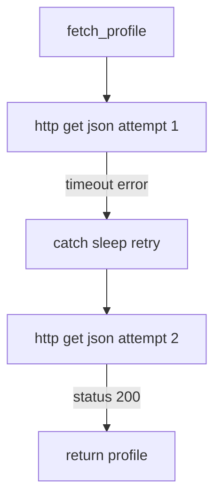

# Сценарии вместо заглушек: `return_value` и `side_effect` в `unittest.mock`

Вы пишете unit‑тест для кода, который ходит в сеть, читает файл или спрашивает текущее время. Вы изолируете зависимость мок‑объектом — и внезапно понимаете, что простого «верни вот это значение» недостаточно. В одном тесте нужно вернуть корректный ответ, в другом — выбросить исключение, в третьем — вернуть разные значения на последовательных вызовах, чтобы проверить retry‑логику.

В `unittest.mock` для этого есть два рычага: `return_value` и `side_effect`. Они выглядят как «мелкие настройки», но на практике именно они определяют, будет ли Ваш тест проверять сценарий или просто «подгонять» зелёный результат.

## Две настройки, которые управляют почти всем

В `unittest.mock` поведение вызова мока задаётся двумя атрибутами:

- `return_value` — значение, которое возвращается при вызове мока;
- `side_effect` — сценарий вызова: функция, исключение или итерируемая последовательность. ([Python documentation][1])

В документации подчёркнуто несколько важных деталей, которые стоит запомнить сразу.

> **Ключевая мысль:**
> `return_value` описывает _что вернуть_, а `side_effect` описывает _как себя вести при вызове_ (включая «вернуть другое», «бросить исключение», «вернуть значения по очереди»). ([Python documentation][1])

Ещё одна вещь, которая влияет на тесты чаще, чем кажется: **дефолтный `return_value` — это новый мок**. Он создаётся при первом обращении к `return_value`. ([Python documentation][1])
Если Вы забыли настроить возврат, то код под тестом начнёт работать с «пустым мок‑объектом», а не с реальным типом данных (число/строка/словарь). Иногда это сразу ломает тест, а иногда делает тест «псевдозелёным».

## Ментальная модель: как мок решает, что вернуть или выбросить

Полезно иметь в голове простую схему. Когда Вы вызываете мок как функцию (`mock(...)`), он действует так:

1. если задан `side_effect`, мок сначала пытается применить его;
2. если `side_effect` не задан (или специально “отказался” обслуживать вызов), мок возвращает `return_value`. ([Python documentation][1])

В документации это описано явно: `side_effect` может быть функцией, исключением или итерируемым объектом; функция вызывается с теми же аргументами, и её результат используется как результат вызова, **если только** она не вернула `DEFAULT`, тогда используется обычный `return_value`. ([Python documentation][1])

Ниже — короткий код‑фрагмент, который делает приоритеты «осязаемыми». Он не привязан к конкретному проекту, но показывает механику.

```python
from unittest.mock import Mock, DEFAULT

m = Mock(return_value=10)


def se(x):
    if x == 0:
        return DEFAULT  # "проваливаемся" к return_value
    return x * 2


m.side_effect = se

assert m(0) == 10  # DEFAULT => return_value
assert m(3) == 6  # side_effect => своё значение
```

Здесь важно не само число, а принцип: `DEFAULT` — инструмент, чтобы сочетать сценарии и «значение по умолчанию» без дублирования логики в тесте. ([Python documentation][1])

## `return_value`: когда нужен «стабильный ответ» и ничего больше

### Самый простой случай: мок возвращает фиксированное значение

`return_value` можно задать двумя равнозначными способами:

- присвоением `mock.return_value = ...`;
- через конструктор: `Mock(return_value=...)`. ([Python documentation][2])

Пример «мок функции»:

```python
from unittest.mock import Mock

get_version = Mock(return_value="1.2.3")
assert get_version() == "1.2.3"
```

Пример «мок метода»:

```python
from unittest.mock import Mock

client = Mock()
client.get_user.return_value = {"id": 42, "name": "Ada"}

assert client.get_user(42)["name"] == "Ada"
```

Документация отдельно показывает, что это одинаково работает и для самого мока, и для его методов. ([Python documentation][2])

### Вложенные вызовы: `cursor().execute()` и другие «цепочки»

Реальные зависимости часто вызываются цепочкой: `connection.cursor().execute(...)`, `session.get(...).json()` и т. п. В таком случае Вы настраиваете **return_value следующего звена**, потому что `cursor()` — это вызов, который возвращает объект. Документация приводит именно такой пример и показывает, что нужно конфигурировать результат вложенного вызова через `.return_value`. ([Python documentation][2])

Практический шаблон:

```python
from unittest.mock import Mock

db = Mock()

# cursor() -> cursor_obj
cursor_obj = db.connection.cursor.return_value

# execute(...) -> list
cursor_obj.execute.return_value = ["row1", "row2"]

rows = db.connection.cursor().execute("SELECT 1")
assert rows == ["row1", "row2"]
```

Этот приём решает две задачи. Он делает цепочку работоспособной и одновременно оставляет место для проверки: Вы можете позже утверждать, что `execute` вызывался с нужным SQL.

### Когда `return_value` становится источником шума

`return_value` хорош, когда результат действительно «один и тот же» для сценария теста. Но есть типовая ловушка: Вы задаёте `return_value` мок‑объектом (или вообще не задаёте), и затем логика под тестом начинает работать с “не теми” типами.

Например, код ожидает, что `client.get_user()` вернёт словарь, а Вы забыли настроить возврат. Тогда `client.get_user()` вернёт новый мок, а `user["id"]` либо упадёт, либо превратится в «магическую» цепочку моков (если Вы где‑то используете `MagicMock`). Ошибка может проявиться не там, где реально проблема, и тест станет труднее читать.

В таких местах почти всегда полезно возвращать **реальные значения** (dict/dataclass/строку), а мок держать только как границу (кто вызван и с чем). Это снижает вероятность «зелёного тумана», когда тест проходит, но на самом деле ничего не проверяет.

## `side_effect`: когда Вам нужен сценарий, а не константа

В документации `unittest.mock` `side_effect` описан как универсальный механизм: это может быть функция, исключение (класс или экземпляр) или итерируемый объект. ([Python documentation][1])

Эти три режима полезно рассматривать отдельно, потому что они решают разные задачи.

### 1) `side_effect` как исключение: тестируем обработку ошибок

Если `side_effect` — исключение (класс или объект), то при вызове мока исключение будет поднято. ([Python documentation][1])

Это удобно, когда Вы тестируете ветки `except`, которые сложно воспроизвести реальными условиями.

```python
import unittest
from unittest.mock import Mock


class TestErrorHandling(unittest.TestCase):
    def test_timeout_path(self):
        http_get = Mock(side_effect=TimeoutError)

        with self.assertRaises(TimeoutError):
            http_get("https://example.test")
```

Ключевая польза здесь в том, что тест становится честным: он не зависит от сети и при этом проверяет реакцию кода на исключение.

### 2) `side_effect` как последовательность: разные ответы на разные вызовы

Если `side_effect` — итерируемый объект, то каждый вызов мока берёт следующий элемент. Элемент может быть значением (тогда он возвращается) или исключением (тогда оно поднимается). ([Python documentation][1])

В документации это показано как «последовательность значений». ([Python documentation][1])
Практически это главный инструмент для тестирования retry‑логики, очередей, повторных запросов, «первый раз не получилось, второй — получилось».

```python
from unittest.mock import Mock

api = Mock()
api.fetch.side_effect = [TimeoutError(), {"ok": True}]  # 1-й вызов падает, 2-й успешен

try:
    api.fetch()
except TimeoutError:
    pass

assert api.fetch() == {"ok": True}
```

#### Важная деталь: `StopIteration` — это Ваш сигнал, что сценарий короче реальности

Если последовательность исчерпалась, мок поднимет `StopIteration`. В документации прямо указано, что значения выдаются из итератора, «пока он не исчерпается», после чего возникает `StopIteration`. ([Python documentation][1])

Это часто выглядит как «странная ошибка в тесте», но на самом деле это полезный сигнал: Ваш код вызвал зависимость больше раз, чем Вы ожидали. Иногда это баг в коде, иногда — неверное ожидание теста.

Если Вам нужно «последнее значение повторять бесконечно», Вы можете явно сказать об этом в сценарии. Например, через `itertools.chain` + `itertools.repeat`, чтобы после нескольких шагов “сценария” началась стабильная фаза:

```python
import itertools
from unittest.mock import Mock

m = Mock()
m.side_effect = itertools.chain(
    [TimeoutError(), TimeoutError(), {"ok": True}],
    itertools.repeat({"ok": True}),
)
```

Это не «трюк ради трюка». Это способ сделать намерение читаемым: “первые два раза падаем, потом всегда успешно”.

### 3) `side_effect` как функция: динамическое поведение по аргументам

Если `side_effect` — функция, она вызывается с теми же аргументами, что и мок, и её результат используется как результат вызова (если только она не вернула `DEFAULT`). ([Python documentation][1])

Этот режим нужен, когда Вы хотите:

- варьировать ответ по входным параметрам;
- делать проверку инвариантов прямо в сценарии (например, “timeout всегда передают <= 1 сек”);
- моделировать более реалистичный контракт без разрастания таблиц `if/else` в тесте.

Пример: «ответ зависит от URL».

```python
from unittest.mock import Mock


def fake_get(url: str):
    if url.endswith("/health"):
        return {"status": "ok"}
    if url.endswith("/users/42"):
        return {"id": 42, "name": "Ada"}
    raise ValueError("unexpected url")


http = Mock(side_effect=fake_get)

assert http("https://example.test/health")["status"] == "ok"
assert http("https://example.test/users/42")["name"] == "Ada"
```

Такой `side_effect` не просто возвращает данные. Он защищает тест от «случайных вызовов»: если код внезапно пошёл на другой URL, тест упадёт с понятной причиной.

## `DEFAULT`: как совместить “общее поведение” и “особые случаи” без дублирования

Документация `unittest.mock` описывает `DEFAULT` как механизм “вернуться к обычному поведению” (`return_value`), когда `side_effect` — функция или последовательность. ([Python documentation][1])

Это полезно, когда большая часть вызовов должна возвращать одно и то же, но для отдельных входов нужен специальный ответ.

```python
from unittest.mock import Mock, DEFAULT

repo = Mock(return_value={"status": "default"})


def se(key):
    if key == "special":
        return {"status": "special"}
    return DEFAULT  # все остальные ключи => return_value


repo.side_effect = se

assert repo("special")["status"] == "special"
assert repo("any")["status"] == "default"
```

Почему это лучше, чем делать всё через функцию? Потому что `return_value` остаётся единственным «источником правды» для дефолта. Вы не размазываете одинаковые значения по нескольким веткам.

## Сброс состояния: как не устроить “утечку сценария” между тестами

Мок — объект. Если Вы переиспользуете его между тестами или делаете несколько “фаз” проверок в одном тесте, Вам нужно уметь сбрасывать историю вызовов и, при необходимости, конфигурацию.

`reset_mock()` сбрасывает информацию о вызовах (`called`, `call_args`, `call_count`, списки вызовов). Документация отдельно уточняет, что по умолчанию `reset_mock()` **не очищает** `return_value` и `side_effect`, если Вы сами их выставляли. ([Python documentation][1])

Если Вам нужно очистить именно настройки, в `reset_mock` есть параметры `return_value=True` и `side_effect=True`, которые сбрасывают соответствующие атрибуты. ([Python documentation][1])

Это выглядит так:

```python
from unittest.mock import Mock

m = Mock(return_value=5)
m("x")
m.reset_mock()  # история очищена, return_value остаётся 5

m.reset_mock(
    return_value=True
)  # теперь return_value возвращается к дефолту (новый Mock)
```

Практический смысл: если тест «внутри себя» делает несколько сценариев одним и тем же мок‑объектом, сбрасывайте историю и (по необходимости) настройки явно. Это снижает риск ложных “assert_called_once” и похожих ошибок.

## Мини‑проект: тестируем retry без сети через `side_effect` (исключения + последовательности)

Чтобы связать всё вместе, полезно посмотреть на один сценарий, где `return_value` и `side_effect` нужны одновременно.

### Производственный код: запрос профиля с retry

```python
# profile_service.py
from __future__ import annotations
from dataclasses import dataclass
from typing import Protocol, Callable, Any


class HttpClient(Protocol):
    def get_json(self, url: str, *, timeout: float) -> dict[str, Any]: ...


@dataclass(frozen=True)
class Profile:
    user_id: int
    name: str


class UserNotFound(Exception):
    pass


class UpstreamError(Exception):
    pass


def fetch_profile(
    http: HttpClient,
    user_id: int,
    *,
    timeout: float = 0.5,
    retries: int = 2,
    sleep: Callable[[float], None] = lambda _: None,
) -> Profile:
    """
    retries=2 => максимум 3 попытки: 1 + 2 повтора
    Повторяем только TimeoutError и UpstreamError.
    """
    url = f"https://api.example.test/users/{user_id}"

    last_exc: Exception | None = None

    for attempt in range(retries + 1):
        try:
            data = http.get_json(url, timeout=timeout)
            if data.get("status") == 404:
                raise UserNotFound(f"user {user_id} not found")
            if data.get("status") == 500:
                raise UpstreamError("upstream 500")
            return Profile(user_id=int(data["id"]), name=str(data["name"]))
        except (TimeoutError, UpstreamError) as e:
            last_exc = e
            if attempt == retries:
                raise
            sleep(0.01)  # backoff (в тестах мы не хотим реально ждать)

    assert last_exc is not None
    raise last_exc
```

Здесь есть две точки, которые в тестах нужно контролировать:

- `http.get_json(...)` — внешняя зависимость, её ответы должны меняться по сценарию;
- `sleep(...)` — нежелательная задержка, её надо «обнулить» (обычно мок/стаб).

Идеально ложится схема: `sleep` можно задать простым `Mock(return_value=None)`, а `http.get_json` — через `side_effect` как последовательность “сначала исключение, потом успех”.

### Схема retry‑сценария



### Тесты: `return_value` для sleep, `side_effect` для сценария сети

```python
# test_profile_service.py
import unittest
from unittest.mock import Mock

from profile_service import fetch_profile, Profile, UserNotFound, UpstreamError


class TestFetchProfile(unittest.TestCase):
    def test_success_first_try(self):
        http = Mock()
        http.get_json.return_value = {
            "id": 7,
            "name": "Grace",
        }  # return_value: стабильно
        sleep = Mock(return_value=None)

        profile = fetch_profile(http, 7, sleep=sleep)

        self.assertEqual(profile, Profile(user_id=7, name="Grace"))
        self.assertEqual(http.get_json.call_count, 1)
        sleep.assert_not_called()

    def test_timeout_then_success(self):
        http = Mock()
        http.get_json.side_effect = [
            TimeoutError(),
            {"id": 42, "name": "Ada"},
        ]  # side_effect: сценарий из двух шагов
        sleep = Mock(return_value=None)

        profile = fetch_profile(http, 42, retries=2, sleep=sleep)

        self.assertEqual(profile.name, "Ada")
        self.assertEqual(http.get_json.call_count, 2)
        sleep.assert_called_once()  # между попытками был backoff

    def test_upstream_500_then_give_up(self):
        http = Mock()
        http.get_json.side_effect = [
            {"status": 500},  # превратится в UpstreamError
            {"status": 500},
            {"status": 500},
        ]
        sleep = Mock(return_value=None)

        with self.assertRaises(UpstreamError):
            fetch_profile(http, 1, retries=2, sleep=sleep)

        self.assertEqual(http.get_json.call_count, 3)
        self.assertEqual(
            sleep.call_count, 2
        )  # sleep между попытками, но не после последней

    def test_not_found_is_not_retried(self):
        http = Mock()
        http.get_json.return_value = {"status": 404}
        sleep = Mock(return_value=None)

        with self.assertRaises(UserNotFound):
            fetch_profile(http, 999, retries=2, sleep=sleep)

        self.assertEqual(http.get_json.call_count, 1)
        sleep.assert_not_called()
```

Что здесь важно именно по теме `return_value`/`side_effect`:

- `return_value` хорошо работает для “всегда одинаковых” зависимостей (например, `sleep` всегда возвращает `None`, а успешный ответ в одном сценарии — один и тот же).
- `side_effect` нужен там, где поведение меняется по попыткам или по входным данным: исключение → успех; ошибка → ошибка → ошибка; и т. п. ([Python documentation][1])
- Если Вы зададите `side_effect` коротким списком, а код вызовет зависимость чаще, Вы получите `StopIteration`. Это корректный сигнал, что сценарий теста не соответствует реальному числу вызовов. ([Python documentation][1])

## Таблица: чем “думать” при выборе `return_value` или `side_effect`

| Задача в тесте                                            | Что ставить                                         | Почему                                                                       |
| --------------------------------------------------------- | --------------------------------------------------- | ---------------------------------------------------------------------------- |
| Зависимость всегда отвечает одинаково                     | `return_value`                                      | Простой и читаемый стаб                                                      |
| Нужно проверить обработку ошибки                          | `side_effect = Exception(...)` или класс исключения | Явно моделируете ветку `except` ([Python documentation][1])                  |
| Один и тот же метод вызывают несколько раз, ответы разные | `side_effect = [..]`                                | Один тестовый сценарий = одна последовательность ([Python documentation][1]) |
| Ответ зависит от аргументов                               | `side_effect = function`                            | Динамический сценарий без разрастания таблиц ([Python documentation][2])     |
| В большинстве случаев один ответ, но есть исключения      | `return_value` + `side_effect` с `DEFAULT`          | Централизуете дефолт и точечно переопределяете ([Python documentation][1])   |

## Частые ошибки (и как их превратить в полезный сигнал)

Ошибка №1. Вы используете `return_value`, когда нужен сценарий.
Симптом: тест проверяет только «успех», но не покрывает ветки retry/ошибок. Исправление: переносите разнообразие в `side_effect` как последовательность или функцию. ([Python documentation][1])

Ошибка №2. `StopIteration` в тесте «из ниоткуда».
Симптом: `StopIteration` возникает при вызове мока. Причина: `side_effect`‑последовательность исчерпалась. Исправление: либо добавьте шаги, либо сделайте «стабильный хвост» через `repeat`, либо уточните ожидания к количеству вызовов. ([Python documentation][1])

Ошибка №3. Мок возвращает мок, и тест “плывёт”.
Симптом: в коде под тестом внезапно сравниваются моки с числами/строками, или условия проходят «по умолчанию». Причина: дефолтный `return_value` — новый мок. ([Python documentation][1])
Исправление: возвращайте реальные типы (dict/dataclass) и задавайте только то, что реально нужно для сценария.

Ошибка №4. История вызовов копится между фазами теста.
Симптом: `assert_called_once` падает «хотя Вы уверены, что вызвали один раз». Причина: мок вызывался раньше, и Вы не сбросили историю. Исправление: используйте `reset_mock()`, а если нужно — сбрасывайте и настройки через `reset_mock(return_value=True, side_effect=True)`. ([Python documentation][1])

## Заключение

Заключение: `return_value` и `side_effect` — это не «два свойства для красоты», а два разных способа описать поведение зависимости. `return_value` фиксирует результат, когда он стабилен. `side_effect` задаёт сценарий: исключения, последовательности, динамику по аргументам. По контракту `unittest.mock` `side_effect` может быть функцией, исключением или итерируемым объектом, и он имеет приоритет над `return_value`, кроме случаев, когда возвращается `DEFAULT`. ([Python documentation][1])

Если Вы держите этот принцип в голове, тесты перестают быть «заглушками ради зелёного» и начинают быть проверкой реальных сценариев: успех, ошибка, повтор, деградация. А значит — меньше случайных падений и меньше ложных успехов.

## Дополнительные материалы

Официальная документация `unittest.mock`: описание `Mock`, `return_value`, `side_effect`, `DEFAULT`, примеры и API. ([Python documentation][1])
Официальная документация `unittest.mock` (examples): короткие примеры настройки `return_value` и `side_effect` (исключения, последовательности, функции). ([Python documentation][2])
Официальная документация `unittest.mock`: `reset_mock(return_value=..., side_effect=...)`, что именно сбрасывается и что остаётся. ([Python documentation][3])
Исходники CPython: реализация `unittest.mock` (полезно, если Вы хотите понять, почему `side_effect` ведёт себя так, как описано в доках). ([GitHub][4])

[1]: https://docs.python.org/3/library/unittest.mock.html "unittest.mock — mock object library — Python documentation"
[2]: https://docs.python.org/3/library/unittest.mock-examples.html "unittest.mock — getting started (examples) — Python documentation"
[3]: https://docs.python.org/3/library/unittest.mock.html#unittest.mock.Mock.reset_mock "unittest.mock — Mock.reset_mock — Python documentation"
[4]: https://github.com/python/cpython/blob/main/Lib/unittest/mock.py "cpython/Lib/unittest/mock.py — GitHub"
[1]: https://docs.python.org/3/library/unittest.mock.html "unittest.mock — mock object library — Python 3.14.3 documentation"
[2]: https://docs.python.org/3/library/unittest.mock-examples.html "unittest.mock — getting started — Python 3.14.3 documentation"
