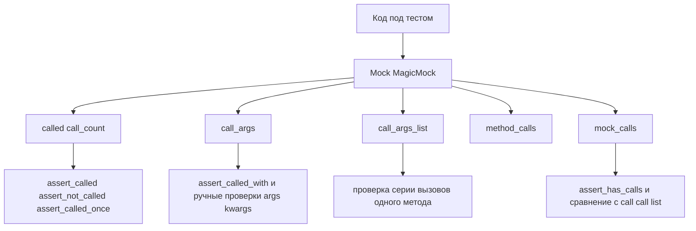

# Проверка взаимодействий в `unittest.mock`: как читать историю вызовов и писать «шумоустойчивые» проверки

Представьте, что у Вас есть функция, которая **ничего не возвращает**, но делает полезную работу: отправляет письмо, пишет в лог, кладёт событие в очередь, дергает внешний API. В проде она «работает», а в тестах возникает вечная дилемма: _что именно проверять_, если итоговое состояние системы не видно, а результат зависит от внешних эффектов?

В этот момент тесты либо превращаются в «пустые зелёные» (проверили, что код “не упал”), либо становятся хрупкими (проверили слишком много и теперь тесты ломаются на каждом рефакторинге). Решение часто одно: **проверять взаимодействия** — кто был вызван, сколько раз, с какими аргументами и в каком порядке.

В `unittest.mock` для этого есть понятный набор инструментов: `assert_called*`, `call_args`, `call_count`, `assert_has_calls` (и несколько связанных сущностей вроде `call`, `mock_calls`, `ANY`). Этот материал — про то, как применять их так, чтобы тесты давали сигнал, а не шум.

## Завязка: что именно мы проверяем, когда «проверяем взаимодействия»

Когда Вы используете мок, у Вас появляются два типа утверждений:

1. **Про состояние**: “после вызова значение изменилось”, “файл создан”, “объект сохранился”.
2. **Про поведение**: “вызвали зависимость вот так-то”, “вызвали один раз”, “вызвали в правильном порядке”.

Этот материал про второй тип — **behavior verification**. Он незаменим, когда внешний эффект невозможно или невыгодно проверять напрямую (сеть, файловая система, очереди, SMTP), либо когда Вы тестируете “оркестрацию”: функцию, которая в основном вызывает другие компоненты.

> **Ключевая мысль:**
> Проверяйте взаимодействия там, где они являются контрактом Вашего кода с внешней границей. Не пытайтесь фиксировать каждую внутреннюю мелочь — это быстро превращает тесты в «страховку от рефакторинга». ([Python documentation][1])

Документация `unittest.mock` прямо позиционирует мок как объект, который «запоминает, как его использовали», чтобы потом делать утверждения о вызовах и аргументах. ([Python documentation][1])

## Что мок реально записывает: «журнал» вызовов, который Вы можете читать

`Mock` и `MagicMock` сохраняют несколько уровней истории. Уровни важны: неверно выбранный уровень даёт либо ложные падения, либо ложные успехи.

### Быстрые ориентиры: `called` и `call_count`

- `called` — булево «вызывали ли хоть раз». ([Python documentation][1])
- `call_count` — сколько раз вызывали мок как функцию. ([Python documentation][1])

Это самый простой уровень: “звонили/не звонили” и “сколько раз”.

### «Последний вызов»: `call_args`

`call_args` — это либо `None`, если мок ещё не вызывали, либо **аргументы последнего вызова**. Документация уточняет формат: это `call`‑объект, который можно воспринимать как кортеж, а также читать через свойства `.args` и `.kwargs`. ([Python documentation][1])

Это удобно, когда Вы хотите:

- быстро понять, _что реально ушло в зависимость_;
- написать кастомную проверку на часть аргументов (например, проверить только `headers`).

### «Все вызовы по порядку»: `call_args_list`

`call_args_list` — список всех вызовов мока по порядку; до первого вызова он пуст. Документация отдельно подчёркивает: длина списка совпадает с количеством вызовов. ([Python documentation][1])

Если Вам нужно проверить **несколько вызовов одного и того же метода** (например, retry или батчи) — это Ваш основной инструмент.

### «Вызовы методов/атрибутов»: `method_calls`

`method_calls` записывает обращения к методам/атрибутам мока и их вложенным методам. Пример из документации показывает, что в список попадают цепочки вроде `mock.property.method.attribute()`. ([Python documentation][1])

Это полезно, когда Вы хотите увидеть “картину” обращения к объекту: какие методы дернули, и в каком порядке.

### «Абсолютно всё»: `mock_calls`

`mock_calls` — самый широкий журнал: он включает вызовы самого мока, его методов, magic‑методов и моков, которые являются `return_value`. ([Python documentation][1])

Есть два важных следствия:

- `assert_has_calls` проверяет именно `mock_calls`, а не `call_args_list`. ([Python documentation][1])
- в `mock_calls` могут появляться вещи, о которых Вы не думали (например, магические методы, если код делает `int(mock)` или использует контекстный менеджер). ([Python documentation][1])

### Визуальная карта: где что хранится и чем обычно проверять



Схема упрощает, но она полезна как «карта местности»: **не все проверки берут данные из одного источника**.

## `assert_called*`: одинаковые названия — разные смыслы

У методов `assert_called*` общий дух (“проверь, что вызывали”), но различия критичны. Ошибка выбора приводит к тестам, которые либо ничего не проверяют, либо проверяют не то.

### `assert_called()` и `assert_not_called()`: бинарный контроль

`assert_called()` утверждает, что мок был вызван хотя бы один раз. ([Python documentation][1])
`assert_not_called()` — что не был вызван ни разу. ([Python documentation][1])

Это полезно, когда аргументы и количество не важны, а важен сам факт “мы вообще дошли до границы”.

Пример: функция должна **не отправлять** уведомление, если нет адреса.

```python
from unittest import TestCase
from unittest.mock import Mock


def maybe_notify(email: str | None, mailer):
    if not email:
        return
    mailer.send(email, "Hello")


class TestNotify(TestCase):
    def test_no_email_no_send(self):
        mailer = Mock()
        maybe_notify(None, mailer)

        mailer.send.assert_not_called()
```

Здесь уместна именно «негативная» проверка: не было взаимодействия.

### `call_count` и `assert_called_once()`: контроль кратности

`call_count` — просто число вызовов. ([Python documentation][1])
`assert_called_once()` — утверждает “вызвали ровно один раз”. ([Python documentation][1])

Если Вам важно, что побочный эффект произошёл **однократно**, `assert_called_once()` обычно читается лучше, чем `self.assertEqual(mock.call_count, 1)`.

### `assert_called_with()` и `assert_called_once_with()`: «последний вызов» и «единственный вызов»

`assert_called_with(*args, **kwargs)` проверяет **последний** вызов: «последний раз вызывали именно так». ([Python documentation][1])
`assert_called_once_with(*args, **kwargs)` проверяет сразу два условия: мок вызвали **ровно один раз** и вызвали его с указанными аргументами. ([Python documentation][1])

Это различие особенно важно, когда Ваш код делает два вызова подряд: тест может неожиданно проверять _не тот_ вызов.

Сценарий: код делает `send("start")`, потом `send("finish")`. Если Вы напишете `assert_called_with("start")`, тест упадёт — последний вызов был “finish”. И падение корректно, но причина неочевидна, если Вы мысленно ожидали “проверить, что start был”.

### `assert_any_call()`: «где угодно в истории»

`assert_any_call(*args, **kwargs)` проходит, если такой вызов был **когда-либо**, а не обязательно последним. Документация подчёркивает отличие от `assert_called_with()` и `assert_called_once_with()`. ([Python documentation][1])

Это хороший вариант, когда вызовов несколько и Вам важно, что _конкретный_ из них присутствует.

## Как уменьшать шум в `assert_called_with`: `ANY` и «проверка по смыслу»

У многих взаимодействий часть аргументов «шумная»: случайный `request_id`, объект‑контекст, время, динамические заголовки. Если проверять это точно, тест будет падать без пользы.

Для таких случаев есть `unittest.mock.ANY`. Документация описывает `ANY` как объект, который «сравнивается равно со всем», и прямо рекомендует использовать его, когда Вы не хотите проверять некоторые аргументы. ([Python documentation][1])

Пример: функция отправляет событие, но `timestamp` формируется внутри.

```python
from unittest import TestCase
from unittest.mock import Mock, ANY


def publish_event(client, user_id: int):
    payload = {
        "user_id": user_id,
        "timestamp": object(),
    }  # условно: генерируемое значение
    client.post("/events", json=payload, timeout=1.0)


class TestEvents(TestCase):
    def test_publish_event_contract(self):
        client = Mock()

        publish_event(client, 10)

        client.post.assert_called_once_with(
            "/events",
            json={"user_id": 10, "timestamp": ANY},
            timeout=1.0,
        )
```

Здесь тест проверяет контракт: URL, `user_id`, факт наличия `timestamp`, таймаут. И не фиксирует то, что не важно для смысла. ([Python documentation][1])

## `call_args`: инструмент не только для отладки, но и для точных проверок

Частая практика — использовать `call_args` только когда тест уже упал. На деле `call_args` полезен, когда Вам нужна проверка, которую неудобно выразить одним `assert_called_with`.

Документация определяет `call_args` как «аргументы последнего вызова», и показывает, что можно читать их через `.args` и `.kwargs`. ([Python documentation][1])

### Пример: проверяем часть `kwargs` и свойства объекта

Допустим, функция отправляет запрос, а в `headers` должен быть токен, который должен начинаться с `Bearer `, но сам токен не фиксирован.

```python
from unittest import TestCase
from unittest.mock import Mock


def fetch_profile(http, token: str):
    http.get("/me", headers={"Authorization": f"Bearer {token}"}, timeout=0.2)


class TestHTTP(TestCase):
    def test_auth_header_shape(self):
        http = Mock()

        fetch_profile(http, token="abc123")

        # 1) можно было бы ANY, но давайте проверим "форму" точнее
        _, kwargs = (
            http.get.call_args
        )  # call_args - кортеж (args, kwargs) :contentReference[oaicite:24]{index=24}
        headers = kwargs["headers"]
        self.assertIn("Authorization", headers)
        self.assertTrue(headers["Authorization"].startswith("Bearer "))
        self.assertEqual(kwargs["timeout"], 0.2)
```

Здесь важно, что `call_args` — это `call`‑объект, но его «кортежность» позволяет распаковать и писать сложные утверждения. Документация прямо говорит, что `call_args` и элементы `call_args_list` — это `call`‑объекты, которые можно распаковывать для более сложных проверок. ([Python documentation][1])

## `call_args_list` и `call_count`: как проверять серию вызовов одного метода

Когда вызовов несколько, `assert_called_with` начинает мешать: он всегда смотрит на последний вызов. В таких сценариях Вы либо используете `assert_any_call`, либо проверяете всю серию через `call_args_list`.

`call_args_list` — список всех вызовов, “в последовательности”. Документация показывает пример и подчёркивает, что он отражает порядок. ([Python documentation][1])

Пример: retry‑логика вызывает `http.get` дважды.

```python
from unittest import TestCase
from unittest.mock import Mock, call


def retry_once(http):
    try:
        return http.get("/data")
    except TimeoutError:
        return http.get("/data")


class TestRetry(TestCase):
    def test_two_attempts(self):
        http = Mock()
        http.get.side_effect = [TimeoutError(), "ok"]

        result = retry_once(http)

        self.assertEqual(result, "ok")
        self.assertEqual(
            http.get.call_count, 2
        )  # call_count — число вызовов :contentReference[oaicite:27]{index=27}
        self.assertEqual(
            http.get.call_args_list, [call("/data"), call("/data")]
        )  # :contentReference[oaicite:28]{index=28}
```

Здесь `call_count` даёт быстрый “счётчик”, а `call_args_list` — доказательство того, что оба вызова были с нужными аргументами. ([Python documentation][1])

## `assert_has_calls`: порядок вызовов, но с нюансами

Когда Ваш код должен вызвать зависимость **несколько раз в определённой последовательности**, естественно тянуться к `assert_has_calls`.

Документация описывает `assert_has_calls(calls, any_order=False)` так:

- проверка идёт по `mock_calls`; ([Python documentation][1])
- при `any_order=False` (по умолчанию) ожидаемые вызовы должны быть **последовательными**, при этом допускаются дополнительные вызовы **до** и **после**; ([Python documentation][1])
- при `any_order=True` порядок не важен, но все ожидаемые вызовы должны присутствовать в `mock_calls`. ([Python documentation][1])

### Пример «порядок важен»: авторизация → списание

Пусть код сначала авторизует платёж, затем списывает.

```python
from unittest import TestCase
from unittest.mock import Mock, call


def process_payment(gateway, amount: int):
    gateway.authorize(amount)
    gateway.capture(amount)


class TestPayment(TestCase):
    def test_order_is_authorize_then_capture(self):
        gateway = Mock()

        process_payment(gateway, 100)

        gateway.assert_has_calls(
            [call.authorize(100), call.capture(100)],
            any_order=False,
        )
```

Здесь `call.authorize(100)` и `call.capture(100)` — это `call`‑объекты, которые в документации предлагаются как удобный способ строить ожидаемые списки вызовов для сравнения с `mock_calls` и для `assert_has_calls`. ([Python documentation][1])

### Нюанс №1: «последовательные» означает **подряд**, без пропусков

Самая частая ошибка ожиданий: считать, что `assert_has_calls` при `any_order=False` проверяет “в правильном порядке, но могут быть другие вызовы между ними”. Документация формулирует это иначе: допускаются дополнительные вызовы до или после, но ожидаемые должны быть последовательными. ([Python documentation][1])

Если Вам важно понимать это точно, полезно заглянуть в реализацию CPython. В `unittest.mock` есть `_CallList.__contains__`, который проверяет наличие списка вызовов как **подсписка** через сравнение с срезами `self[i:i+len_value]`. Это проверка на **непрерывную последовательность** (contiguous). ([GitHub][2])

Практический вывод: если между `authorize` и `capture` произойдёт ещё один вызов (например, `gateway.healthcheck()`), то `assert_has_calls([authorize, capture])` **не пройдёт**, потому что ожидаемая пара больше не стоит подряд.

Если Вам нужно разрешить “лишние” вызовы между ожидаемыми, чаще всего проще:

- проверять каждый ключевой вызов через `assert_any_call`; ([Python documentation][1])
- либо анализировать `mock_calls` вручную и искать подпоследовательность с пропусками (это уже кастомная логика теста).

Ниже — компактный вариант «с пропусками» через ручную проверку, который читабельнее, чем сложная математика:

```python
from unittest.mock import call


def assert_calls_in_order(mock, expected):
    it = iter(mock.mock_calls)
    for e in expected:
        for actual in it:
            if actual == e:
                break
        else:
            raise AssertionError(f"call not found in order: {e!r}")


# использование:
# assert_calls_in_order(gateway, [call.authorize(100), call.capture(100)])
```

Такой подход повышает “сигнал”: Вы явно фиксируете, что допускаете дополнительные вызовы между ожидаемыми, и не пытаетесь заставить `assert_has_calls` делать то, чего он не обещает. ([Python documentation][1])

### Нюанс №2: `assert_has_calls` смотрит в `mock_calls`, а там «много всего»

Поскольку `assert_has_calls` проверяет `mock_calls`, туда могут попадать:

- вызовы методов;
- вызовы магических методов;
- вызовы `return_value`‑моков. ([Python documentation][1])

Иногда это полезно (Вы хотите проверить всю цепочку), но иногда приводит к неожиданным падениям: тест сравнивает с длинной историей, где есть лишние записи.

Если Вы хотите проверить только один метод, часто проще работать с `gateway.authorize.call_args_list` или `gateway.authorize.assert_called_once_with(...)`, чем «таскать» весь `mock_calls`.

### Нюанс №3: вложенные (chained) вызовы и «потеря» аргументов предка

В документации есть важное предупреждение про `mock_calls`: при вложенных вызовах параметры “предка” не записываются так, чтобы влиять на сравнение в дочернем вызове. Пример: `mock.top(a=3).bottom()`, и дальше `mock.mock_calls[-1] == call.top(a=-1).bottom()` даёт `True`. ([Python documentation][1])

Это означает: если Вы строите ожидания на “цепочку”, Вы можете случайно получить ложноположительную проверку аргументов верхнего уровня.

Практическая защита — проверять шаги отдельно:

- отдельно проверяйте `call.top(a=3)` (первую запись);
- отдельно — что был `call.top().bottom()`.

Или вообще избегайте цепочек в коде под тестом там, где Вы хотите фиксировать аргументы каждого уровня.

### Как `call_list()` упрощает проверку цепочек

Если цепочка всё же неизбежна (или код так устроен), в `unittest.mock` есть `call.call_list()`: он разворачивает “chained call” в список промежуточных `call`‑объектов, который удобно сравнивать с `mock_calls`. Документация прямо говорит, что `call_list()` полезен для утверждений о цепочках, потому что ручная сборка списка бывает утомительной. ([Python documentation][1])

## Как повышать сигнал/шум: практические правила выбора проверки

Ниже не «канон», а работающие правила, которые помогают писать тесты, устойчивые к рефакторингу.

### 1) Если Вам важен контракт одного вызова — начинайте с `assert_called_once_with`

Если функция должна сделать **один** вызов к границе — `assert_called_once_with` даёт максимум сигнала в одной строке: и кратность, и аргументы. ([Python documentation][1])

Если тест часто падает из‑за несущественных полей — добавляйте `ANY` для шума. ([Python documentation][1])

### 2) Если вызовов несколько — избегайте `assert_called_with`, пока не уверены, что Вам нужен именно «последний вызов»

`assert_called_with` проверяет “последний вызов” и этим часто вводит в заблуждение в многошаговых сценариях. ([Python documentation][1])
Для “вызов присутствует в истории” лучше `assert_any_call`. ([Python documentation][1])

### 3) Для серии вызовов одного метода: `call_args_list` почти всегда прозрачнее `mock_calls`

`call_args_list` проще читать, потому что там нет “побочного мусора” от других методов. ([Python documentation][1])
`mock_calls` оправдан, когда Вам важна картина «в целом» или порядок между разными методами. ([Python documentation][1])

### 4) Для порядка между разными методами используйте `assert_has_calls`, но помните про «подряд»

Если Вам нужен строгий порядок и строго “один за другим” — `assert_has_calls` подходит хорошо. ([Python documentation][1])
Если Вам нужен порядок, но допускаются промежуточные вызовы — пишите либо несколько `assert_any_call`, либо маленькую вспомогательную проверку на подпоследовательность.

### 5) Не бойтесь “переехать” на `call_args` ради смысла

Если `assert_called_once_with` превращается в 12 аргументов, половина из которых не важна, лучше:

- вытащить `kwargs = mock.call_args.kwargs`; ([Python documentation][1])
- проверить только важные ключи и инварианты (форму строки, наличие поля, диапазон числа).

Это уменьшает шум и повышает читаемость.

### 6) Если Вы делаете несколько фаз проверок одним мок‑объектом — сбрасывайте историю вызовов

`reset_mock()` сбрасывает атрибуты вызовов (`called`, `call_args`, `call_count`, списки вызовов), и документация подчёркивает, что по умолчанию он не очищает `return_value`/`side_effect`, если Вы задавали их обычным присваиванием. ([Python documentation][1])

Это важно, если в одном тесте Вы делаете “фаза 1 / фаза 2” и хотите утверждать «ровно один вызов в фазе 2».

## Мини‑сценарий: связать всё в одном тесте (без лишней строгости)

Ниже — короткий пример, который показывает, как комбинировать проверки взаимодействий так, чтобы тест «держал контракт» и не привязывался к мелочам реализации.

Функция делает две вещи: логирует и отправляет событие. Лог должен быть один раз, отправка — один раз с нужным типом события.

```python
from unittest import TestCase
from unittest.mock import Mock, ANY, call


def register_user(logger, analytics, user_id: int, email: str):
    logger.info("register_user", extra={"user_id": user_id})
    analytics.track("user_registered", {"user_id": user_id, "email": email})


class TestRegister(TestCase):
    def test_interactions(self):
        logger = Mock()
        analytics = Mock()

        register_user(logger, analytics, user_id=1, email="a@b.test")

        logger.info.assert_called_once()  # ровно один лог :contentReference[oaicite:50]{index=50}

        # проверяем смысл аргументов лога через call_args
        _, kwargs = (
            logger.info.call_args
        )  # call_args описан в доках :contentReference[oaicite:51]{index=51}
        self.assertEqual(kwargs["extra"]["user_id"], 1)

        analytics.track.assert_called_once_with(
            "user_registered",
            {"user_id": 1, "email": "a@b.test"},
        )  # :contentReference[oaicite:52]{index=52}

        # если хотите проверить общий порядок действий на уровне "объектов":
        # используйте mock_calls и assert_has_calls
        combined = Mock()
        combined.attach_mock(logger, "logger")
        combined.attach_mock(analytics, "analytics")

        register_user(combined.logger, combined.analytics, 1, "a@b.test")

        combined.assert_has_calls(
            [
                call.logger.info("register_user", extra={"user_id": 1}),
                call.analytics.track("user_registered", ANY),
            ],
            any_order=False,
        )  # порядок и шумоустойчивость через ANY :contentReference[oaicite:53]{index=53}
```

Здесь Вы одновременно используете:

- `assert_called_once` как проверку кратности; ([Python documentation][1])
- `call_args` как доступ к деталям без раздувания `assert_called_once_with`; ([Python documentation][1])
- `assert_called_once_with` как проверку контракта отправки; ([Python documentation][1])
- `assert_has_calls` как проверку порядка; ([Python documentation][1])
- `ANY` как «шумоподавитель» для части аргументов. ([Python documentation][1])

## Заключение

Заключение: проверки взаимодействий — это не “побочный” инструмент мокирования, а отдельный слой тестирования: Вы проверяете **контракт** между Вашим кодом и зависимостью. В `unittest.mock` для этого есть два основных подхода: готовые ассершены (`assert_called*`, `assert_any_call`, `assert_has_calls`) и чтение истории вызовов через `call_args`, `call_args_list`, `mock_calls`, `call_count`. ([Python documentation][1])

Самый частый источник “шума” — неверный выбор инструмента: `assert_called_with` вместо `assert_any_call`, `assert_has_calls` там, где ожидаются “пропуски”, или точные сравнения там, где нужна проверка формы и инвариантов. Документация и реализация CPython помогают понять границы: например, `assert_has_calls` при `any_order=False` проверяет непрерывную последовательность (подсписок), а не «в порядке с пропусками». ([Python documentation][1])

Если Вы держите это в голове и сознательно используете `ANY` и/или `call_args` для смысловых проверок, тесты становятся устойчивее: они фиксируют важное поведение и меньше реагируют на косметические изменения кода. ([Python documentation][1])

## Дополнительные материалы

Официальная документация `unittest.mock`: раздел про утверждения `assert_called*`, `assert_any_call`, `assert_has_calls`, `reset_mock`, атрибуты `call_args`/`call_args_list`/`mock_calls`. ([Python documentation][1])
Официальная документация `unittest.mock`: разделы `call`, `call_list()` и устройство `call`‑объектов (2‑кортеж vs 3‑кортеж, интроспекция args/kwargs). ([Python documentation][2])
Официальная документация `unittest.mock`: `ANY` — как игнорировать часть аргументов, не превращая тест в “проверку случайных деталей”. ([Python documentation][3])
Исходники CPython: реализация `_CallList.__contains__` (почему `assert_has_calls` при `any_order=False` требует непрерывной последовательности). ([GitHub][4])

[1]: https://docs.python.org/3/library/unittest.mock.html "unittest.mock — mock object library — Python documentation"
[2]: https://docs.python.org/3/library/unittest.mock.html#call "unittest.mock.call и call_list() — Python documentation"
[3]: https://docs.python.org/3/library/unittest.mock.html#any "unittest.mock.ANY — Python documentation"
[4]: https://github.com/python/cpython/blob/3.14/Lib/unittest/mock.py "CPython: Lib/unittest/mock.py (ветка 3.14) — GitHub"
[1]: https://docs.python.org/3/library/unittest.mock.html "unittest.mock — mock object library — Python 3.14.3 documentation"
[2]: https://github.com/python/cpython/tree/3.14/Lib/unittest/mock.py "cpython/Lib/unittest/mock.py at 3.14 · python/cpython · GitHub"
