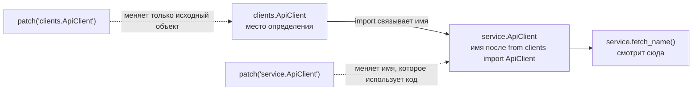

# Почему `patch()` «не сработал»: главное правило `unittest.mock`, без которого тесты лгут

Вы меняете `clients.ApiClient` на mock, запускаете тест, а код под тестом всё равно создаёт реальный объект. На практике это почти всегда означает не проблему в `unittest.mock`, а неверно выбранную цель для `patch()`. Документация Python формулирует принцип прямо: `patch()` временно меняет объект, на который указывает **имя**, и патчить нужно то имя, которое реально использует код под тестом. Поэтому правильная цель для подмены — не обязательно место определения объекта; важнее место, где этот объект **ищется** во время выполнения. ([Python documentation][1])

## Введение

Тема `patch where it is looked up` кажется частной, но на деле она упирается в базовую механику Python: `import` не просто находит модуль, а связывает результат с именем в текущей области видимости. Пока Вы не видите эти связи имён, `patch()` выглядит как набор магических строк. Как только видите — выбор target становится почти механическим. ([Python documentation][2])

## Почему `patch()` иногда будто бы не работает

Посмотрите на минимальный пример:

```python
# clients.py
class ApiClient:
    def fetch_user(self, user_id: int) -> dict:
        return {"id": user_id, "name": "Real User"}
```

```python
# service.py
from clients import ApiClient


def fetch_name(user_id: int) -> str:
    client = ApiClient()
    return client.fetch_user(user_id)["name"]
```

Интуитивная ошибка здесь почти неизбежна: хочется пропатчить `clients.ApiClient`, ведь класс объявлен именно там. Но после `from clients import ApiClient` модуль `service` уже получил собственное имя `ApiClient` в своём namespace. Если позже изменить `clients.ApiClient`, это не перепишет уже связанную ссылку `service.ApiClient`. Именно такой сценарий и разбирает официальная документация в примере с `a.py` и `b.py`: если `b` сделал `from a import SomeClass`, патчить нужно `b.SomeClass`, а не `a.SomeClass`. ([Python documentation][1])

Представьте, что `clients.py` — это телефонный справочник компании, а `service.py` после `from clients import ApiClient` переписал номер в свой блокнот. Если Вы потом измените номер в общем справочнике, запись в блокноте сама не обновится. `patch()` здесь ничего не «ломает». Он просто подчиняется тому, как Python уже связал имена.

## Что на самом деле делает `patch()`

`patch()` можно использовать как декоратор функции, декоратор класса или context manager. Внутри области его действия target заменяется новым объектом, а после выхода из этой области подмена автоматически откатывается. Важно и другое: target должен быть importable, а сам target-resolve происходит в момент выполнения теста, а не в момент, когда Вы написали декоратор. ([Python documentation][1])

Если Вы патчите **класс**, то подменяется сам объект класса. Когда код под тестом делает `ApiClient()`, он получает не «настоящий экземпляр класса», а `return_value` созданного mock-объекта. Поэтому методы экземпляра надо настраивать не на `MockApiClient.fetch_user`, а на `MockApiClient.return_value.fetch_user`. Это частая техническая ошибка даже тогда, когда target path выбран правильно. ([Python documentation][1])

> Сначала найдите выражение, которое реально выполняется в коде под тестом. Потом — namespace, где это выражение ищет имя. Только после этого выбирайте путь для `patch()`.

## Как Python связывает имена и почему это ключ к теме

С точки зрения Python любой `import` состоит из двух операций: сначала находится и загружается модуль, затем результат связывается с именем в локальной области видимости. Для `from ... import name` правило ещё жёстче: ссылка на импортированное значение сохраняется в local namespace под именем `name`. Именно поэтому `from clients import ApiClient` создаёт в `service.py` отдельную привязку `ApiClient`. ([Python documentation][2])

Эту механику можно увидеть даже без `unittest.mock`:

```python
from clients import ApiClient
import clients

saved = ApiClient
clients.ApiClient = object

assert ApiClient is saved
```

Здесь нет тестов и нет моков, но проблема уже видна: после `from clients import ApiClient` локальное имя `ApiClient` продолжает указывать на старый объект, даже если `clients.ApiClient` потом переназначить. `patch()` делает ту же операцию переназначения, только временно. Поэтому он подчиняется тем же правилам привязки имён. ([Python documentation][1])



Диаграмма показывает главный конфликт. В коде под тестом lookup идёт по имени `service.ApiClient`. Поэтому подмена `clients.ApiClient` после импорта `service` не перехватывает вызов, а подмена `service.ApiClient` — перехватывает. Это и есть смысл правила _patch where it is looked up_. ([Python documentation][1])

## Сценарий 1: `from ... import ...`

Вернёмся к примеру выше и посмотрим на тест в стиле `unittest`.

```python
# test_service.py
import unittest
from unittest.mock import patch
import service


class TestService(unittest.TestCase):
    @patch("clients.ApiClient")
    def test_fetch_name_wrong_target(self, MockApiClient):
        MockApiClient.return_value.fetch_user.return_value = {
            "id": 1,
            "name": "Bob",
        }

        self.assertEqual(service.fetch_name(1), "Bob")
```

Такой тест выглядит правдоподобно, но target выбран неверно. После импорта `service` функция `fetch_name()` берёт класс из `service.ApiClient`, а не из `clients.ApiClient`. Поэтому код пойдёт в реальную реализацию и тест либо упадёт, либо — что хуже — начнёт использовать настоящую сеть, файл или базу. Официальная документация описывает этот случай буквально: если модуль под тестом сделал `from a import SomeClass`, патчить надо `b.SomeClass`. ([Python documentation][1])

Правильный вариант выглядит так:

```python
# test_service.py
import unittest
from unittest.mock import patch
import service


class TestService(unittest.TestCase):
    @patch("service.ApiClient")
    def test_fetch_name(self, MockApiClient):
        MockApiClient.return_value.fetch_user.return_value = {
            "id": 1,
            "name": "Bob",
        }

        result = service.fetch_name(1)

        self.assertEqual(result, "Bob")
        MockApiClient.return_value.fetch_user.assert_called_once_with(1)
```

Здесь target совпадает с тем именем, которое реально использует код. Обратите внимание и на настройку поведения: так как патчится класс, настройка `fetch_user()` идёт через `MockApiClient.return_value`. Это следует из документации `patch()`: при подмене класса экземпляр, который создаёт код, оказывается в `return_value` созданного mock-класса. ([Python documentation][1])

## Сценарий 2: `import module`

Теперь изменим только способ импорта:

```python
# service_alt.py
import clients


def fetch_name(user_id: int) -> str:
    client = clients.ApiClient()
    return client.fetch_user(user_id)["name"]
```

В этой версии код под тестом сначала ищет имя `clients`, а затем берёт у этого модуля атрибут `ApiClient`. В официальной документации это и есть «альтернативный сценарий»: если модуль делает `import a` и использует `a.SomeClass`, патчить надо `a.SomeClass`. Для такого кода подмена `clients.ApiClient` уже корректна. ([Python documentation][1])

```python
# test_service_alt.py
import unittest
from unittest.mock import patch
import service_alt


class TestServiceAlt(unittest.TestCase):
    @patch("clients.ApiClient")
    def test_fetch_name(self, MockApiClient):
        MockApiClient.return_value.fetch_user.return_value = {
            "id": 1,
            "name": "Bob",
        }

        result = service_alt.fetch_name(1)

        self.assertEqual(result, "Bob")
        MockApiClient.return_value.fetch_user.assert_called_once_with(1)
```

Разница между первым и вторым сценарием кажется маленькой, но по сути это две разные схемы lookup. В первом случае код ищет локальное имя `ApiClient` внутри `service`. Во втором — имя `clients`, связанное с модулем, и уже у него атрибут `ApiClient`. Поэтому одинаковая на вид зависимость требует разных целей для `patch()`. ([Python documentation][1])

## Время привязки тоже важно: локальный `import` внутри функции

Есть тонкий случай, который часто ломает слишком упрощённое правило «всегда патчите модуль под тестом». Посмотрите на код:

```python
# service_local.py
def fetch_name(user_id: int) -> str:
    from clients import ApiClient

    client = ApiClient()
    return client.fetch_user(user_id)["name"]
```

Здесь binding происходит не при импорте модуля `service_local`, а при **вызове функции**. Из правил `import` следует, что `from ... import ...` сохраняет ссылку в namespace той области, где выполняется оператор `import`. Из документации `patch()` также следует, что target-resolve делается во время выполнения теста. Значит, если Вы подмените `clients.ApiClient` до вызова `fetch_name()`, локальный import внутри функции подхватит уже подменённый объект. Это не исключение из правила, а его более точная версия: важно не только **где** ищут имя, но и **когда** это имя связывается. ([Python documentation][3])

Это полезный вывод для чтения чужого кода. Если зависимость импортируется в теле функции, правила выбора target могут измениться. Поэтому смотреть только на начало файла недостаточно; нужно смотреть на конкретную строку, которая реально исполняется в момент теста.

## Таблица быстрых ориентиров

Когда Вы начинаете мыслить не файлами, а lookup-выражениями, большинство target paths становятся предсказуемыми.

| Код в модуле под тестом                             | Что реально ищет код                   | Обычно патчат                       |
| --------------------------------------------------- | -------------------------------------- | ----------------------------------- |
| `from clients import ApiClient` → `ApiClient()`     | локальное имя `ApiClient` в модуле     | `service.ApiClient`                 |
| `import clients` → `clients.ApiClient()`            | атрибут `ApiClient` у модуля `clients` | `clients.ApiClient`                 |
| `from os import getenv` → `getenv("APP_ENV")`       | локальное имя `getenv` в модуле        | `settings.getenv`                   |
| `from datetime import date` → `date.today()`        | локальное имя `date` в модуле          | `report.date`                       |
| `open("data.txt")` и имя `open` не переопределялось | built-in имя `open`                    | `builtins.open`                     |
| `self.log("x")` при патче метода класса             | дескриптор метода на классе            | `patch.object(MyClass, "log", ...)` |

Первые четыре строки следуют из правил связывания имён при `import` и из официального раздела `Where to patch`. Пятая опирается на то, что при обычном lookup Python ищет имя сначала в локальной области, затем во внешних, затем в глобальной и в builtins; документация `mock` отдельно показывает патчинг builtins и пример с `builtins.open`. Последняя строка опирается на раздел о дескрипторах и patching methods on class. ([Python documentation][1])

Для `date` документация приводит специальный пример: патчат не глобальный `datetime.date`, а `date` в модуле, который его использует. Для `open()` документация показывает стандартный шаблон `patch('builtins.open', ...)`. В обоих случаях мыслительный путь один и тот же: Вы подменяете то имя, по которому код сделает lookup в момент вызова. ([Python documentation][4])

## Когда Вы патчите не модульную функцию, а метод класса

Тема становится ещё интереснее, когда объект lookup — это метод. Документация `unittest.mock` отдельно подчёркивает: `patch()` и `patch.object()` корректно патчат дескрипторы — class methods, static methods и properties — но делать это нужно **на классе**, а не на экземпляре. Иначе Вы патчите не тот уровень, на котором Python разворачивает дескрипторное поведение. ([Python documentation][1])

Ниже пример, где важен не только target, но и `autospec=True`:

```python
import unittest
from unittest.mock import patch


class AuditService:
    def log(self, message: str) -> None:
        print(message)

    def process(self) -> None:
        self.log("started")


class TestAuditService(unittest.TestCase):
    def test_process_logs_message(self):
        with patch.object(AuditService, "log", autospec=True) as mock_log:
            service = AuditService()

            service.process()

            mock_log.assert_called_once_with(service, "started")
```

Здесь `autospec=True` полезен по двум причинам. Во-первых, документация показывает, что при патче unbound method с `autospec=True` подмена делается через реальный function object, который под капотом делегирует в mock. Поэтому при обращении через экземпляр метод становится bound method и получает `self`. Во-вторых, `autospec` фиксирует сигнатуру: вызов с неверными аргументами даст `TypeError`, а не молчаливый зелёный тест. Без `autospec` замена unbound method обычным `Mock` может скрыть ошибки привязки `self`. ([Python documentation][4])

## Самый коварный случай: зависимость захвачена заранее

Есть ситуация, в которой даже правильно выбранный target не поможет. Это происходит, когда зависимость была вычислена и сохранена **до** того, как Вы попытались её патчить. Самый наглядный пример — значения по умолчанию у параметров.

```python
# service.py
from clients import ApiClient


def build_client(client_cls=ApiClient):
    return client_cls()
```

На первый взгляд хочется написать `@patch("service.ApiClient")` и ждать, что `build_client()` начнёт создавать мок. Но документация Python на функции говорит: значения параметров по умолчанию вычисляются в момент выполнения `def`, то есть один раз, когда функция определяется. Значит, `client_cls=ApiClient` уже сохранил старый объект в default parameter, и более поздний `patch("service.ApiClient")` этот default не перепишет. Здесь lookup по имени `ApiClient` уже **не происходит** в момент вызова: функция использует заранее сохранённое значение. ([Python documentation][5])

Исправить это можно двумя путями. Первый — отложить lookup до тела функции:

```python
# service.py
from clients import ApiClient


def build_client(client_cls=None):
    if client_cls is None:
        client_cls = ApiClient
    return client_cls()
```

Теперь `ApiClient` снова ищется в теле функции при вызове, и `patch("service.ApiClient")` сможет повлиять на поведение. Второй путь — не полагаться на patch здесь вообще, а явно передавать фабрику через параметр. Для тестируемости это часто лучше, потому что делает зависимость явной. Вывод важный: правило _patch where it is looked up_ начинается ещё раньше — с вопроса, **происходит ли lookup вообще в этот момент**. Если объект уже захвачен в default parameter, module constant или замыкании, патчить прежнее имя может быть поздно. ([Python documentation][5])

## Ошибки, которые делают тесты ложными

Первая ошибка — включать `create=True` без необходимости. По умолчанию `patch()` падает, если атрибута не существует. Если включить `create=True`, `patch()` создаст этот атрибут на время теста, а потом удалит. Документация прямо предупреждает, что это опасно: так можно написать зелёные тесты для API, которого в реальном коде вообще нет. Для обучения и для повседневных unit-тестов это почти всегда плохой компромисс, если только продакшен-код действительно не создаёт атрибут динамически. ([Python documentation][1])

Вторая ошибка — патчить класс правильно, но настраивать не тот объект. Если код делает `client = ApiClient()`, то метод `fetch_user()` принадлежит экземпляру, а не самому объекту класса. Поэтому настройка должна идти через `MockApiClient.return_value.fetch_user`, а не через `MockApiClient.fetch_user`. Формально target path здесь выбран верно, но тест остаётся неверным технически. ([Python documentation][1])

Третья ошибка — патчить метод на экземпляре, когда Python разворачивает его как дескриптор на классе. Для обычных методов, `@classmethod`, `@staticmethod` и `@property` правильная точка подмены — класс. Именно это рекомендует документация `unittest.mock`. ([Python documentation][1])

## Алгоритм выбора target за 30 секунд

Если нужен практический алгоритм, используйте такой порядок.

1. Откройте код под тестом и найдите **точное выражение**, которое будет выполняться: `ApiClient()`, `clients.ApiClient()`, `getenv(...)`, `date.today()`, `open(...)`.
2. Определите, какое имя Python ищет первым и в каком namespace оно связано именно **к моменту вызова**.
3. Если объект импортирован через `from ... import ...`, почти всегда патчить нужно имя внутри модуля под тестом. Если используется `import module`, обычно патчат атрибут на модуле.
4. Если подменяете класс, помните, что экземпляр живёт в `return_value`. Если подменяете метод класса и важен `self`, используйте `autospec=True`.
5. Если зависимость уже захвачена заранее — в default parameter, константе модуля или closure — проверьте, не поздно ли вообще применять `patch()`. Иногда правильное решение — не новый target, а перенос lookup в тело функции или явная инъекция зависимости. ([Python documentation][1])

Это не «мнемоника для строк с точками». Это способ читать Python-код через призму namespace и времени связывания имён. Как только Вы начинаете так смотреть на код, `patch()` перестаёт казаться капризным инструментом.

## Заключение

У `patch()` нет интуиции. У него есть только одно честное правило: он меняет то имя, которое Вы ему указали. Если код под тестом смотрит на другое имя, подмена не сработает. Поэтому фраза _patch where it is looked up_ — не совет «из практики», а прямое следствие того, как Python импортирует модули, связывает имена и вычисляет значения по умолчанию у функций. ([Python documentation][1])

Самая полезная привычка здесь простая. Перед тем как писать `@patch("...")`, на секунду забудьте про `mock` и спросите себя: **какое имя реально будет искать этот код в момент вызова**. Если Вы ответили на этот вопрос точно, target обычно становится очевидным. Если не ответили, тест, скорее всего, будет либо хрупким, либо ложным.

## Дополнительные материалы

Официальная документация `unittest.mock`: разделы `patch`, `patch.object`, `Where to patch`, `patch builtins`. ([Python documentation][1]) ([Python documentation][1])

Практические примеры из документации `unittest.mock`: подмена `open()`, частичное мокирование `date`, `autospec=True` для методов класса. ([Python documentation][2]) ([Python documentation][4])

Правила `import` и связывания имён: разделы `The import statement` и `The import system`. ([Python documentation][3]) ([Python documentation][4]) ([Python documentation][3])

Исходный код реализации `unittest.mock` в CPython. ([GitHub][5]) ([GitHub][6])

Исходник документации `unittest.mock` в CPython, включая раздел `Where to patch`. ([GitHub][6]) ([GitHub][7])

[1]: https://docs.python.org/3/library/unittest.mock.html "unittest.mock — mock object library"
[2]: https://docs.python.org/3/library/unittest.mock-examples.html "unittest.mock — getting started"
[3]: https://docs.python.org/3/reference/simple_stmts.html#import "The import statement"
[4]: https://docs.python.org/3/reference/import.html "The import system"
[5]: https://github.com/python/cpython/blob/main/Lib/unittest/mock.py "cpython/Lib/unittest/mock.py"
[6]: https://github.com/python/cpython/blob/main/Doc/library/unittest.mock.rst "cpython/Doc/library/unittest.mock.rst"
[1]: https://docs.python.org/3/library/unittest.mock.html "https://docs.python.org/3/library/unittest.mock.html"
[2]: https://docs.python.org/3/reference/import.html "https://docs.python.org/3/reference/import.html"
[3]: https://docs.python.org/3/reference/simple_stmts.html "https://docs.python.org/3/reference/simple_stmts.html"
[4]: https://docs.python.org/3/library/unittest.mock-examples.html "https://docs.python.org/3/library/unittest.mock-examples.html"
[5]: https://docs.python.org/3/reference/compound_stmts.html "https://docs.python.org/3/reference/compound_stmts.html"
[6]: https://github.com/python/cpython/blob/main/Lib/unittest/mock.py "https://github.com/python/cpython/blob/main/Lib/unittest/mock.py"
[7]: https://github.com/python/cpython/issues/130106 "https://github.com/python/cpython/issues/130106"
