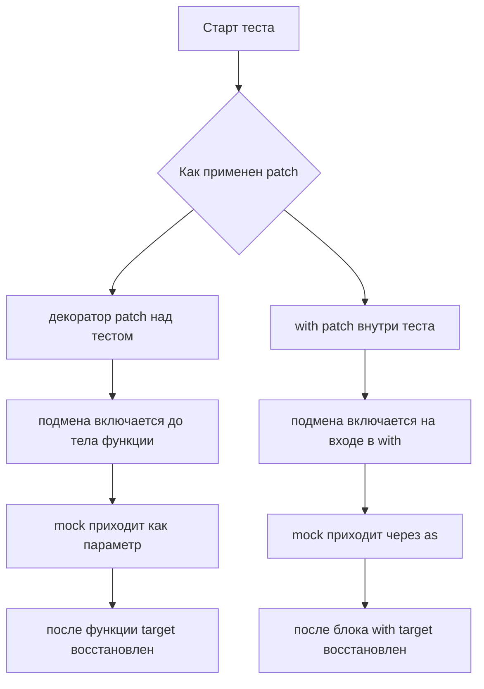

# Не просто синтаксис: как использовать `patch()` как декоратор и как context manager, чтобы тесты были точными

Один и тот же `patch()` может сделать тест прозрачным, а может спрятать границу подмены так, что через неделю Вы сами не поймёте, где именно закончился реальный код и начался mock. Проблема здесь не в «правильном» или «неправильном» синтаксисе. И `@patch(...)`, и `with patch(...)` используют один и тот же механизм временной подмены target с автоматическим восстановлением. Но область действия у них разная: у декоратора подмена живёт внутри всей декорированной функции, а у контекстного менеджера — только внутри блока `with`. ([Python documentation][1])

Именно поэтому тема важна не только для красоты тестов. От выбора формы зависит, насколько широким окажется влияние подмены, как будет выглядеть сигнатура теста, где Вы будете настраивать mock и насколько легко другой разработчик поймёт границы Arrange, Act и Assert. Документация `unittest.mock` прямо описывает `patch()` как function decorator, class decorator и context manager; Python language reference, в свою очередь, точно задаёт семантику `with`, включая вызовы `__enter__()` и `__exit__()` и гарантированное завершение блока с cleanup-логикой. ([Python documentation][1])

## Введение

Когда Вы тестируете код, который ходит в сеть, пишет в файл, обращается к системному времени или создаёт внешний клиент, Вам почти всегда нужна изоляция. `patch()` решает именно эту задачу: временно подменяет импортируемый target на другой объект и затем возвращает исходное значение. Если `new` не передан, `patch()` сам создаёт замену: для обычных целей это `MagicMock`, а для async-функций — `AsyncMock`. Важная деталь: target импортируется в момент выполнения декорированной функции или входа в блок, а не в момент, когда Python читает строку с `@patch(...)`. ([Python documentation][1])

> Главное правило здесь такое: сначала определите **границу подмены**, а уже потом выбирайте синтаксис.
> Если перепутать этот порядок, `patch()` начинает казаться капризным, хотя на деле он ведёт себя очень последовательно. ([Python documentation][1])

## Что на самом деле делает `patch()`

На уровне идеи `patch()` не «отключает зависимость», а временно меняет объект, на который указывает конкретное имя. Документация формулирует это предельно прямо: подмена работает за счёт временного изменения того, на что указывает name, и потому критично важно патчить то имя, которое реально использует код под тестом. Это базовая мысль модуля 8.1, но без неё и тема 8.2 остаётся неполной: и декоратор, и context manager будут бесполезны, если target выбран не в том namespace. ([Python documentation][1])

С точки зрения API у `patch()` есть несколько режимов. Нас сейчас интересуют два. В режиме декоратора он оборачивает функцию теста и включает подмену на время выполнения её тела. В режиме контекстного менеджера он включает подмену на входе в блок `with` и отключает на выходе из него. Если `patch()` сам создаёт mock, то в режиме декоратора этот объект передаётся дополнительным аргументом в тест, а в режиме `with` возвращается через `as`. ([Python documentation][1])

Из этого следует простой, но очень полезный вывод. Между `@patch(...)` и `with patch(...)` нет разницы по «силе» или «правильности». Разница только в форме контроля над временем жизни подмены и в том, как mock попадает в Ваш код теста. Всё остальное — уже следствие этой одной идеи. ([Python documentation][1])

## Пример, на котором будем сравнивать оба стиля

Ниже — маленький модуль, который создаёт внешний клиент оплаты и при успешной оплате отправляет чек. Пример специально простой. Его задача не в том, чтобы показать бизнес-логику, а в том, чтобы наглядно сравнить две формы `patch()`.

```python
# orders.py
from gateway import PaymentClient
from notifications import send_receipt


def charge_order(order_id: int, email: str | None = None) -> str:
    client = PaymentClient()
    response = client.charge(order_id)

    if response["status"] == "ok" and email:
        send_receipt(email, order_id)

    return response["status"]
```

Здесь есть две внешние точки: класс `PaymentClient` и функция `send_receipt`. Это удобно. На одном и том же примере можно показать и патч функции, и патч класса, и настройку `return_value`, и порядок аргументов при нескольких декораторах. Всё, что пойдёт ниже, — это не абстракция «вообще про `patch()`», а повторяемая практика, которую Вы будете видеть в сервисных тестах каждый день. ([Python documentation][1])

## `patch()` как декоратор: когда подмена должна жить весь тест

Начнём с декоратора. Он особенно хорошо читается там, где с первой до последней строки теста Вам нужна одна и та же подменённая зависимость.

```python
import unittest
from unittest.mock import patch
import orders


class TestOrders(unittest.TestCase):
    @patch("orders.send_receipt")
    @patch("orders.PaymentClient", autospec=True)
    def test_charge_order_sends_receipt(self, MockPaymentClient, mock_send_receipt):
        client = MockPaymentClient.return_value
        client.charge.return_value = {"status": "ok"}

        result = orders.charge_order(100, email="student@example.com")

        self.assertEqual(result, "ok")
        client.charge.assert_called_once_with(100)
        mock_send_receipt.assert_called_once_with("student@example.com", 100)
```

Этот пример сразу показывает три фундаментальные вещи. Во-первых, `patch()` в роли декоратора подменяет target на всё время выполнения тестового метода. Во-вторых, созданные им mock-объекты приходят в тест отдельными аргументами. В-третьих, при патче класса реальный «экземпляр клиента», который увидит код под тестом после `PaymentClient()`, находится не в `MockPaymentClient` напрямую, а в `MockPaymentClient.return_value`. Именно туда надо вешать `charge.return_value`. ([Python documentation][1])

Декоратор хорош тем, что убирает лишнюю вложенность. Вы сразу видите на уровне объявления теста, какие зависимости подменяются. Это особенно полезно, когда замена нужна на всей длине метода: и в фазе подготовки, и в фазе вызова, и в фазе проверок. Такой стиль часто делает happy path компактнее и убирает шум конструкции `with`. Это уже практический вывод из documented scope поведения `patch()`: если зона подмены совпадает с телом теста, декоратор обычно оказывается самым прямым способом записать эту идею. ([Python documentation][1])

Но у этого удобства есть цена. Декоратор влияет на сигнатуру теста. Если патчей становится много, имена mock-аргументов начинают занимать половину строки. А если декораторы сложены стопкой, легко перепутать порядок, в котором объекты придут в метод. Документация подчёркивает: при нескольких patch decorators они применяются снизу вверх, и mock-параметры передаются в том же порядке. Именно поэтому в примере выше `MockPaymentClient` идёт раньше `mock_send_receipt`: декоратор для `PaymentClient` расположен ближе к функции. ([Python documentation][2])

Есть ещё одна тонкость, о которой часто забывают. Дополнительный аргумент появляется только тогда, когда `patch()` **сам создаёт** объект замены. Если Вы передали `new=...` или указали replacement вторым позиционным аргументом, `patch()` уже не создаёт mock и, соответственно, ничего не добавляет в сигнатуру теста. Это не мелочь, а типовая причина падений вида `TypeError: test_*() takes 1 positional argument but 2 were given` или, наоборот, «лишний параметр, который не откуда взять». ([Python documentation][1])

## `patch()` как context manager: когда нужна точная граница подмены

Теперь тот же сценарий, но через `with`. Здесь смысл не в том, что тест становится «лучше», а в том, что область действия подмены сужается до конкретного блока.

```python
import unittest
from unittest.mock import patch
import orders


class TestOrders(unittest.TestCase):
    def test_charge_order_sends_receipt_with_context_manager(self):
        with patch("orders.PaymentClient", autospec=True) as MockPaymentClient:
            with patch("orders.send_receipt") as mock_send_receipt:
                client = MockPaymentClient.return_value
                client.charge.return_value = {"status": "ok"}

                result = orders.charge_order(100, email="student@example.com")

                self.assertEqual(result, "ok")
                client.charge.assert_called_once_with(100)
                mock_send_receipt.assert_called_once_with("student@example.com", 100)
```

На этот раз mock-объекты появляются не через сигнатуру теста, а через `as`. Это следует из самой модели `with`: Python вычисляет context expression, вызывает `__enter__()`, связывает его результат с именем после `as`, выполняет блок, а затем вызывает `__exit__()`. Языковая спецификация отдельно гарантирует, что если `__enter__()` завершился успешно, `__exit__()` будет вызван при выходе из блока. Именно на этом механизме и держится автоматическое восстановление target при использовании `patch()` как context manager. ([Python documentation][3])

Практический плюс `with` в другом. Он даёт Вам **видимую границу подмены**. Когда тест длинный или в нём есть часть логики, которая не зависит от внешнего клиента, `with patch(...)` позволяет изолировать только тот фрагмент, где подмена действительно нужна. Это улучшает локальность чтения: посмотрев на тест, Вы сразу понимаете, какие строки выполнялись под подменой, а какие — уже нет. Это не отдельное правило библиотеки, а прямое следствие documented scope у `patch()` и семантики самого `with`. ([Python documentation][1])

Именно поэтому context manager особенно хорош в двух ситуациях. Первая — когда mock нужен только в фазе Act, а подготовка данных и часть проверок не связаны с подменой. Вторая — когда в одном тесте есть несколько коротких независимых фрагментов, каждый со своей локальной подменой. В таких случаях декоратор обычно делает область действия слишком широкой. `with` дисциплинирует тест и не даёт подмене «расползтись» дальше, чем необходимо. ([Python documentation][1])

## Как выглядит разница по времени жизни подмены



Схема выше отражает не «стилистику», а буквальную разницу в области действия: в одном случае рамкой выступает вся декорированная функция, в другом — только блок `with`. Именно поэтому спор «что лучше» без контекста почти всегда бессмысленен. Выбор зависит не от вкуса, а от того, насколько широкой должна быть подмена в конкретном тесте. ([Python documentation][1])

## Одно и то же поведение, но разная эргономика

| Вопрос               | `@patch(...)`                             | `with patch(...)`                            |
| -------------------- | ----------------------------------------- | -------------------------------------------- |
| Где активна подмена  | Во всём теле декорированной функции       | Только внутри блока `with`                   |
| Как получить mock    | Дополнительный параметр теста             | Переменная после `as`                        |
| Когда читается лучше | Когда вся логика теста зависит от подмены | Когда подменить нужно только узкий фрагмент  |
| Главный риск         | Перепутать порядок mock-аргументов        | Раздуть вложенность при большом числе блоков |

Эта таблица — не отдельная доктрина, а сжатое следствие двух документированных фактов: `patch()` как декоратор действует внутри функции и передаёт созданный mock аргументом, а `patch()` как context manager действует внутри блока `with` и возвращает созданный объект через `as`. Всё остальное — уже удобство чтения и управления зоной влияния подмены. ([Python documentation][1])

## Несколько patch сразу: где чаще всего начинается путаница

Когда подмен становится больше одной, декораторный стиль требует аккуратности. Документация прямо говорит, что при nesting patch decorators они применяются снизу вверх, и mock-объекты передаются в тест в этом же порядке. Это стандартное поведение Python decorators, но в тестах его очень легко перепутать, особенно если имена mock-параметров неудачны. ([Python documentation][2])

Ниже — тот же пример, но специально акцентирован порядок аргументов:

```python
@patch("orders.send_receipt")
@patch("orders.PaymentClient", autospec=True)
def test_charge_order_sends_receipt(self, MockPaymentClient, mock_send_receipt): ...
```

Внутренний, то есть нижний декоратор, применяется первым. Поэтому `MockPaymentClient` попадает в метод раньше `mock_send_receipt`. Если Вы это правило забыли, тест не станет «немного менее красивым» — он просто станет трудно читать и легко ломать при рефакторинге. Чем больше stacked decorators, тем выше шанс ошибиться уже на уровне сигнатуры. ([Python documentation][2])

Контекстный менеджер решает эту проблему иначе. Он не меняет сигнатуру теста вовсе. Несколько подмен можно записать либо вложенными `with`, либо несколькими context items в одном `with`, потому что сам язык Python допускает несколько элементов в `with_stmt_contents`, а `patch()` официально поддерживает режим context manager. ([Python documentation][3])

```python
def test_charge_order_sends_receipt_with_one_with(self):
    with (
        patch("orders.PaymentClient", autospec=True) as MockPaymentClient,
        patch("orders.send_receipt") as mock_send_receipt,
    ):
        client = MockPaymentClient.return_value
        client.charge.return_value = {"status": "ok"}

        result = orders.charge_order(100, email="student@example.com")

        self.assertEqual(result, "ok")
        client.charge.assert_called_once_with(100)
        mock_send_receipt.assert_called_once_with("student@example.com", 100)
```

У этой записи другая цена: тест уходит глубже по отступам. Но при двух-трёх патчах она часто читается лучше, чем длинная сигнатура с несколькими аргументами, особенно если часть подмены нужна только локально. Здесь нет универсального победителя. Есть только вопрос: что в конкретном тесте создаёт меньше когнитивного шума — сигнатура или вложенность. ([Python documentation][1])

Кстати, та же логика распространяется и на `patch.object()` и `patch.dict()`: документация и examples показывают, что они тоже умеют работать как context managers, а при желании — и как decorators. Поэтому, если Вы поняли разницу на `patch()`, Вы почти автоматически поняли и семантику соседних patchers. ([Python documentation][2])

## Если патчите класс, смотрите в `return_value`

Это место нужно проговорить отдельно, потому что именно здесь у начинающих тестов часто появляется ощущение, будто `patch()` «не слышит настройку».

Когда Вы патчите класс, `patch()` заменяет сам класс объектом `MagicMock`. Но код под тестом обычно не обращается к классу как к значению. Он делает вызов конструктора: `PaymentClient()`. А вызов `MagicMock` возвращает его `return_value`. Значит, тот объект, который станет «клиентом» внутри production-кода, — это `MockPaymentClient.return_value`, а не `MockPaymentClient` как таковой. Документация показывает это буквально на примере с `Class().method()`. ([Python documentation][1])

```python
with patch("orders.PaymentClient") as MockPaymentClient:
    client = MockPaymentClient.return_value
    client.charge.return_value = {"status": "ok"}

    result = orders.charge_order(100)

    assert result == "ok"
```

Если Вы вместо этого напишете `MockPaymentClient.charge.return_value = ...`, то будете настраивать метод у mock-класса, а не у mock-экземпляра. В реальном тесте это почти всегда означает либо немедленное падение, либо запутанное поведение, где неясно, какой объект Вы на самом деле конфигурируете. Это не частная ловушка одного примера, а системное свойство любого class patch. ([Python documentation][1])

> Запомните короткую формулу:
> **патч класса — настраивайте `return_value`; патч функции — настраивайте сам mock.** ([Python documentation][1])

## `patch()` умеет подставлять не только `MagicMock`

Есть полезный миф, который лучше разрушить сразу: `patch()` — это не синоним «создать `MagicMock`». Это только поведение по умолчанию. Документация позволяет явно подставить готовый объект через `new`, а через `new_callable` — указать фабрику, которая создаст replacement другого типа. Официальные примеры показывают `NonCallableMock` и `io.StringIO` как типичные сценарии. ([Python documentation][1])

Вот очень практичный пример через декоратор:

```python
from io import StringIO
from unittest.mock import patch


def print_status():
    print("done")


@patch("sys.stdout", new_callable=StringIO)
def test_print_status(fake_stdout):
    print_status()
    assert fake_stdout.getvalue() == "done\n"
```

Здесь `patch()` не создаёт `MagicMock` для `sys.stdout`, а даёт Вам настоящий `StringIO`. Это важный момент для понимания декоратора: он может не просто «впрыснуть мок», а передать в тест именно тот replacement-объект, который Вы хотите использовать. Та же логика работает и в режиме context manager. ([Python documentation][1])

Ещё одна полезная деталь из документации: `patch()` принимает произвольные keyword arguments, и они идут в созданный им `MagicMock`/`AsyncMock` или в объект, построенный через `new_callable`. Поэтому для простых случаев настройку можно вынести прямо в строку с patch, например `@patch("module.func", return_value=123)`. Для базовых сценариев это удобно, но на практике сложную конфигурацию всё же обычно легче читать внутри тела теста, рядом с остальным Arrange-кодом. ([Python documentation][1])

## Почему `autospec=True` часто стоит добавить сразу

Сам `patch()` очень гибкий. Настолько гибкий, что без дополнительных ограничений может пропустить неверную сигнатуру вызова или опечатку в API заменяемого объекта. Документация предлагает здесь `autospec=True`: в этом режиме mock создаётся со спецификацией реального объекта, его методы и функции проверяют сигнатуры, а при патче класса его `return_value` получает ту же спецификацию, что и исходный класс. В результате вызов с неправильными аргументами даёт `TypeError`, а случайные несуществующие атрибуты не проходят молча. ([Python documentation][1])

Это напрямую влияет и на тему нашей статьи. И декоратор, и context manager поддерживают `autospec=True` одинаково, потому что оба используют тот же patcher. Поэтому вопрос звучит не «где `autospec` лучше работает», а «нужно ли Вам уже на этом тесте защититься от ложноположительных результатов». Для долгоживущих тестов сервисного слоя ответ часто «да». Именно поэтому в примерах выше `PaymentClient` патчится с `autospec=True`. ([Python documentation][1])

Но у `autospec` есть и ограничение, которое важно знать заранее. Документация прямо показывает, что он плохо видит instance attributes, создаваемые только в `__init__()`, потому что они отсутствуют на самом классе как на spec-объекте. Это значит, что некоторые динамически созданные поля придётся выставлять вручную или делать видимыми через class defaults. `autospec` не магия. Он усиливает надёжность теста ценой более строгого и местами менее прощающего поведения. ([Python documentation][1])

## Частые ошибки, которые ломают восприятие `patch()`

Первая ошибка — выбирать форму по привычке. Если патч нужен только на трёх строках, декоратор делает его область действия шире без пользы. Если патч нужен на всём протяжении теста, `with` иногда просто добавляет лишний уровень отступов. На практике вопрос всегда один: где должна заканчиваться подмена. И уже из этого решения следует синтаксис. ([Python documentation][1])

Вторая ошибка — забывать про сигнатуру декорированного теста. Когда `patch()` сам создаёт replacement, он передаёт его дополнительным аргументом. Когда replacement приходит через `new`, дополнительного аргумента нет. Это маленькое правило порождает disproportionately много бытовых падений в тестах, потому что его легко помнить абстрактно и легко забыть в момент написания кода. ([Python documentation][1])

Третья ошибка — путать порядок mock-аргументов при нескольких декораторах. Документация здесь недвусмысленна: порядок идёт снизу вверх. Если тест внезапно выглядит так, будто `mock_send_receipt` «ведёт себя как PaymentClient», причина часто не в mock, а в перепутанной сигнатуре метода. ([Python documentation][2])

Четвёртая ошибка — настраивать методы у патченного класса, забыв про `return_value`. Если код вызывает `SomeClass()`, реальный рабочий объект теста — это результат вызова mock-класса. Значит, конфигурация поведения экземпляра должна жить на `MockClass.return_value`. Это правило одинаково для декоратора и для context manager. ([Python documentation][1])

Пятая ошибка — надеяться, что форма `patch()` компенсирует неверный target. Не компенсирует. Хоть через `@patch`, хоть через `with patch`, Вы всё равно обязаны патчить имя там, где оно ищется кодом под тестом. Именно поэтому раздел `Where to patch` остаётся обязательным контекстом даже для темы 8.2. ([Python documentation][1])

Шестая ошибка — включать `create=True` просто ради зелёного теста. По умолчанию `patch()` падает, если атрибута не существует. И это хорошо: такое поведение ловит ошибки интерфейса. Документация специально предупреждает, что `create=True` опасен, потому что с ним можно написать проходящий тест против API, которого в реальности вообще нет. Использовать его стоит только там, где production-код действительно создаёт атрибут динамически во время выполнения. ([Python documentation][1])

## Как выбрать форму `patch()` в реальной работе

Если нужен короткий рабочий критерий, он выглядит так. Когда подмена должна жить с первой до последней строки тестового метода, берите декоратор. Когда подмена нужна только в конкретном фрагменте, берите context manager. Если патчите класс, сразу думайте про `return_value`. Если патчей несколько и сигнатура начинает выглядеть тяжелее самого теста, переходите на `with`. Если интерфейс зависимости стабилен и важен, добавляйте `autospec=True`. Все эти правила — не набор «лучших практик из воздуха», а прямое продолжение documented semantics `patch()` и `with`. ([Python documentation][1])

На практике полезно задавать себе один вопрос прямо перед написанием теста: **какой минимальный участок кода действительно должен выполняться под подменой**. Если Вы честно на него ответили, выбор между `@patch(...)` и `with patch(...)` обычно перестаёт быть сомнительным. И это, пожалуй, главный признак того, что тема действительно понята. ([Python documentation][1])

## Заключение

`patch()` как декоратор и `patch()` как context manager — это не два разных инструмента, а две формы одного и того же механизма. Обе временно подменяют target и автоматически восстанавливают его после выхода из области действия. Но одна область действия равна телу функции, а другая — только блоку `with`. Именно из этой разницы вырастает всё остальное: сигнатура теста, уровень вложенности, читаемость и риск перепутать зону влияния mock-объекта. ([Python documentation][1])

Если свести всю тему к одной фразе, она будет такой: **декоратор выбирают не потому, что он короче, а context manager — не потому, что он «более профессиональный»; выбор делают по границе подмены**. Когда Вы видите эту границу ясно, `patch()` перестаёт быть источником случайных ошибок и становится тем, чем и должен быть: точным инструментом управления зависимостями в unit-тесте. ([Python documentation][1])

## Дополнительные материалы

Документация `unittest.mock`: API `patch()`, `patch.object()`, `patch.dict()`, параметры `new`, `new_callable`, `spec`, `autospec`, а также разделы `Nesting Patch Decorators` и `Where to patch`. ([Python documentation][1])

Практические примеры `unittest.mock`: patch decorators, context managers, `StringIO`, `mock_open`, partial mocking `date`. ([Python documentation][2])

Языковая спецификация Python: `with` statement, точная семантика `__enter__()` / `__exit__()` и несколько context items в одном `with`. ([Python documentation][3])

Исходный код `unittest.mock` в CPython, если хотите посмотреть, как patcher реализован в стандартной библиотеке. ([GitHub][4])

Раздел `Where to patch`, к которому стоит возвращаться всякий раз, когда `patch()` кажется «нерабочим». ([Python documentation][5])

[1]: https://docs.python.org/3/library/unittest.mock.html "unittest.mock — mock object library — Python 3.14.3 documentation"
[2]: https://docs.python.org/3/library/unittest.mock-examples.html "unittest.mock — getting started — Python 3.14.3 documentation"
[3]: https://docs.python.org/3/reference/compound_stmts.html#the-with-statement "The with statement — Python language reference"
[4]: https://github.com/python/cpython/blob/main/Lib/unittest/mock.py "cpython/Lib/unittest/mock.py"
[5]: https://docs.python.org/3/library/unittest.mock.html#where-to-patch "Where to patch — unittest.mock"
[1]: https://docs.python.org/3/library/unittest.mock.html "unittest.mock — mock object library — Python 3.14.3 documentation"
[2]: https://docs.python.org/3/library/unittest.mock-examples.html "unittest.mock — getting started — Python 3.14.3 documentation"
[3]: https://docs.python.org/3/reference/compound_stmts.html "https://docs.python.org/3/reference/compound_stmts.html"
