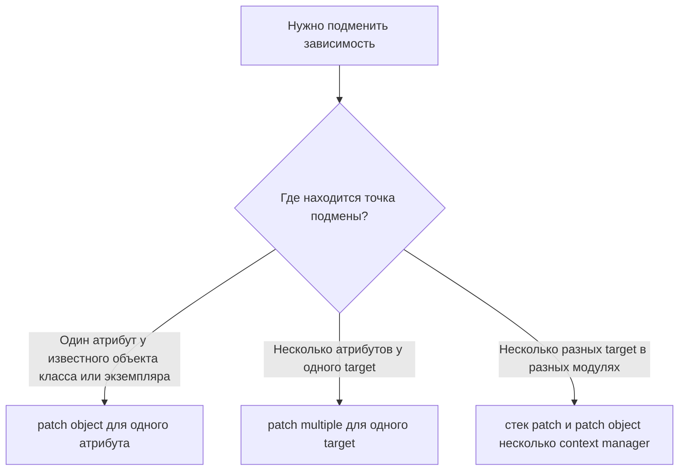

# Когда одного `patch()` уже недостаточно: как применять `patch.object()` и `patch.multiple()` без путаницы

Вы доходите до теста, в котором нужно подменить не одну зависимость, а несколько связанных вещей сразу. В одном месте это метод класса. В другом — пара модульных переменных, которые образуют внутреннее состояние. В третьем — свойство, которое вообще не похоже на обычную функцию. На этом этапе многие начинают механически наращивать цепочку `@patch(...)`, и тест из инструмента проверки превращается в ребус. У стандартной библиотеки для таких случаев есть два более точных инструмента: `patch.object()` для подмены конкретного атрибута на уже известном объекте и `patch.multiple()` для нескольких подмен на одном target за один приём. Оба инструмента входят в `unittest.mock` и официально поддерживаются как декораторы, class decorators и context managers. ([Python documentation][1])

## Введение

У этой темы есть скрытая сложность. Формально она про два API-метода. По сути — про уровень точности, с которым Вы вмешиваетесь в код под тестом. `patch.object()` не просто короче, чем строка вида `"package.module.Class.method"`. Он меняет способ мышления: Вы не ищете dotted path, а берёте уже известный объект и временно подменяете у него именованный атрибут. `patch.multiple()`, в свою очередь, не просто «делает несколько патчей сразу», а работает с одной общей зоной подмены для нескольких атрибутов одного target. Именно в этой разнице и находится практическая польза. ([Python documentation][1])

Если говорить совсем коротко, `patch.object()` нужен там, где у Вас уже есть конкретный класс, экземпляр или модульный объект, и Вы хотите изменить одно его свойство, метод или поле. `patch.multiple()` нужен там, где несколько зависимостей или несколько фрагментов состояния живут на одном target и должны входить в тест как один координированный блок. Официальная документация формулирует эти роли предельно ясно: `patch.object()` патчит named member на object target, а `patch.multiple()` выполняет multiple patches in a single call для одного объекта или строки импорта. ([Python documentation][1])

> Запомните практический критерий выбора: один известный target и один атрибут — `patch.object()`. Один известный target и несколько атрибутов — `patch.multiple()`. Если target-ов несколько, Вы уже вышли за границы задачи `patch.multiple()`. ([Python documentation][1])



Схема важна не как шпаргалка по API, а как фильтр против самой частой ошибки. `patch.multiple()` не предназначен для подмены «всего, что нужно в тесте». Документация задаёт у него один `target`, а уже внутри этого target — набор именованных атрибутов через `**kwargs`. Из этого прямо следует, что если у Вас одна зависимость живёт в модуле сервиса, другая — в `time`, а третья — в стороннем SDK, то `patch.multiple()` здесь не сокращает код, а только создаёт ложное ожидание. ([Python documentation][1])

## `patch.object()`: точечная подмена атрибута без лишней строковой магии

Официальная сигнатура `patch.object()` выглядит так: `patch.object(target, attribute, new=DEFAULT, spec=None, create=False, spec_set=None, autospec=None, new_callable=None, **kwargs)`. Метод можно использовать как decorator, class decorator или context manager. Причём у него есть две основные формы вызова. В трёхаргументной Вы явно передаёте replacement-объект. В двухаргументной replacement опускается, и `unittest.mock` создаёт mock за Вас, а затем передаёт его в тестовую функцию или возвращает через `as` в `with`. Аргументы `new`, `spec`, `create`, `spec_set`, `autospec` и `new_callable` семантически совпадают с `patch()`. ([Python documentation][1])

На практике это означает очень простую вещь. Если класс или объект уже импортирован в тест и находится у Вас в руках как Python-объект, `patch.object()` обычно читается лучше, чем строка с полным путём. Вы меньше думаете о dotted path и больше — о том, какой именно атрибут хотите временно подменить. Это особенно удобно для методов классов, внутренних helper-атрибутов и дескрипторов. Эту «точечность» хорошо видно на минимальном примере. ([Python documentation][1])

```python
# exchange.py
class ExchangeClient:
    def get_rate(self, currency: str) -> float:
        raise NotImplementedError


class InvoiceService:
    def convert(self, amount_rub: float, currency: str) -> float:
        client = ExchangeClient()
        rate = client.get_rate(currency)
        return round(amount_rub / rate, 2)
```

```python
# test_exchange.py
import unittest
from unittest.mock import ANY, patch

from exchange import ExchangeClient, InvoiceService


class TestInvoiceService(unittest.TestCase):
    @patch.object(ExchangeClient, "get_rate", autospec=True)
    def test_convert_uses_gateway_rate(self, mock_get_rate):
        mock_get_rate.return_value = 100.0

        service = InvoiceService()
        result = service.convert(2500, "USD")

        self.assertEqual(result, 25.0)
        mock_get_rate.assert_called_once_with(ANY, "USD")
```

Этот тест показывает сразу несколько важных принципов. Во-первых, используется двухаргументная форма `patch.object(ExchangeClient, "get_rate")`: replacement не передан, поэтому mock создаётся автоматически и попадает в тест как аргумент `mock_get_rate`. Во-вторых, `autospec=True` здесь не декоративный флаг. Он заставляет mock учитывать реальную сигнатуру метода и тем самым снижает риск ложноположительного теста после рефакторинга API. В документации автоспекирование прямо описано как средство защиты от опечаток и дрейфа интерфейса. ([Python documentation][1])

Заметьте и другое. Мы патчим не экземпляр `client`, а атрибут `get_rate` на самом классе `ExchangeClient`. Это не случайность. Для обычных методов, class methods, static methods и properties документация рекомендует патчить именно класс, а не экземпляр: `patch` и `patch.object` корректно подменяют и восстанавливают дескрипторы, но делать это нужно на классе. Если пытаться патчить такой атрибут на инстансе, Вы очень быстро попадёте в зону неочевидного поведения Python descriptor protocol. ([Python documentation][1])

Есть ещё одна тонкость, которую легко не заметить. В примере выше мы могли бы написать и `patch("exchange.ExchangeClient.get_rate")`. Это тоже рабочий путь. Но `patch.object()` выигрывает там, где сам объект уже импортирован и явно присутствует в коде теста. Вы не кодируете путь строкой, а работаете с реальным объектом языка Python. В результате тест меньше зависит от строкового target и лучше показывает намерение: «я временно меняю конкретный атрибут вот у этого класса». Это уже не отдельное правило документации, а следствие того, как устроен API `patch.object()`. ([Python documentation][1])

При этом документация отдельно оговаривает обратный случай: если Вы патчите модуль, включая `builtins`, рекомендуется использовать обычный `patch()`, а не `patch.object()`. Это важное разграничение. `patch.object()` силён там, где target — именно объект, класс, экземпляр или модульный объект, который уже у Вас есть как значение. Для модульных путей и builtins `patch()` обычно остаётся более естественным инструментом. ([Python documentation][3])

## Где `patch.object()` особенно полезен: свойства, classmethod и другие дескрипторы

Одна из сильных сторон `patch.object()` проявляется не на обычных методах, а на дескрипторах. Документация прямо говорит, что и `patch`, и `patch.object` корректно патчат и восстанавливают class methods, static methods и properties. Это очень ценно, потому что именно такие атрибуты часто сложно подменить «наивным» присваиванием, не потеряв читаемость теста. ([Python documentation][1])

Ниже пример со свойством. Для properties в `unittest.mock` есть отдельный тип `PropertyMock`, у которого реализованы `__get__()` и `__set__()`. Его как раз и удобно подавать через `new_callable`. ([Python documentation][1])

```python
from unittest.mock import PropertyMock, patch


class ApiSettings:
    @property
    def base_url(self) -> str:
        return "https://prod.example/api"


with patch.object(ApiSettings, "base_url", new_callable=PropertyMock) as mock_base_url:
    mock_base_url.return_value = "https://test.example/api"

    settings = ApiSettings()
    assert settings.base_url == "https://test.example/api"
```

Это хороший пример того, почему `patch.object()` стоит воспринимать не как «короткую форму patch», а как инструмент для работы с атрибутами объектной модели Python. В документации `PropertyMock` описан именно как mock для property и других descriptors. То есть `patch.object()` здесь становится естественным мостом между структурой Вашего production-кода и тестом: Вы подменяете не строку и не «что-то в модуле», а конкретное descriptor-свойство класса. ([Python documentation][1])

В обычной работе это встречается чаще, чем кажется. Вы можете подменять feature-flag как class attribute, статический helper как `staticmethod`, вычисляемое свойство конфигурации как `property`, а class-level method выбора стратегии как `classmethod`. Во всех этих случаях важна одна дисциплина: патчите на классе. Документация это подчёркивает отдельно именно потому, что для дескрипторов класс — точка правильного lookup и правильного восстановления. ([Python documentation][1])

## `autospec`, `spec_set` и границы безопасности в `patch.object()`

Так как `patch.object()` использует те же механизмы speccing, что и `patch()`, к нему полностью относится тема `autospec=True`. Автоспекирование ограничивает API mock-объекта интерфейсом оригинала, делает это рекурсивно и, что особенно важно, сохраняет сигнатуры функций и методов. Из-за этого вызов mock-а с неправильными аргументами приводит к `TypeError`, а не к зелёному тесту, который пропустил ошибку. Документация прямо рекомендует во многих случаях просто добавить `autospec=True` к существующим вызовам `patch()`. Это замечание в равной степени относится и к `patch.object()`. ([Python documentation][1])

Но у `autospec` есть ограничение, которое студент почти неизбежно встречает на практике. Если Вы автоспецируете класс, атрибуты экземпляра, создаваемые только внутри `__init__`, не появятся на mock автоматически, потому что их нет на самом объекте-спеке как на классе. В официальной документации показан пример, где `thing.a` после `patch(..., autospec=True)` приводит к `AttributeError`, а затем объясняется, что атрибут можно выставить вручную уже после создания mock-а. Если же одновременно включить `spec_set=True`, даже это будет запрещено. Для тестов это означает простое правило: `autospec` повышает надёжность, но не отменяет понимания того, где именно в реальном коде рождаются атрибуты. ([Python documentation][1])

Есть и ещё один механизм безопасности — `create=False` по умолчанию. Если Вы пытаетесь патчить несуществующий атрибут, библиотека поднимет `AttributeError`. Это полезное поведение, потому что оно ловит опечатки и ложные предположения о структуре объекта. `create=True` позволяет временно создать отсутствующий атрибут и затем убрать его после теста. Иногда это нужно для действительно динамических объектов, но в обычных unit-тестах такой флаг стоит включать очень осознанно: иначе Вы можете случайно спрятать баг в имени атрибута. ([Python documentation][1])

## `patch.multiple()`: координированная подмена нескольких атрибутов одного target

Если `patch.object()` — это скальпель, то `patch.multiple()` — это аккуратная связка из нескольких точечных подмен, объединённых одной областью жизни. Его сигнатура в документации выглядит так: `patch.multiple(target, spec=None, create=False, spec_set=None, autospec=None, new_callable=None, **kwargs)`. Важная деталь — именно `target` в единственном числе. Это может быть объект или строка, по которой объект будет импортирован, а сами патчи задаются именованными аргументами. Значения в `kwargs` могут быть либо явными replacement-объектами, либо `DEFAULT`, если Вы хотите, чтобы mock создался автоматически. ([Python documentation][1])

Из этой конструкции сразу следует практическая польза. Когда несколько зависимостей или несколько фрагментов внутреннего состояния живут на одном модуле, классе или объекте, `patch.multiple()` избавляет тест от каскада однотипных `with patch.object(...), patch.object(...), patch.object(...)`. В коде это читается как одна операция: «на время этого теста я подменяю вот этот набор имён на одном target». И именно это делает его хорошим инструментом для модульных singleton-зависимостей, глобальных clients в модуле, внутренних кэшей и связанных state-полей. ([Python documentation][1])

Посмотрите на типичный пример с модульными зависимостями:

```python
# billing_runtime.py
gateway = None
audit = None
metrics = None


def charge_order(order_id: int, amount: int) -> str:
    result = gateway.charge(order_id, amount)

    if result["ok"]:
        audit.write("payment_ok", order_id=order_id, amount=amount)
        metrics.increment("billing.ok")
        return "ok"

    audit.write("payment_failed", order_id=order_id, reason=result["reason"])
    metrics.increment("billing.failed")
    return "failed"
```

```python
# test_billing_runtime.py
import unittest
from unittest.mock import DEFAULT, patch

import billing_runtime


class TestChargeOrder(unittest.TestCase):
    def test_success_path(self):
        with patch.multiple(
            billing_runtime,
            gateway=DEFAULT,
            audit=DEFAULT,
            metrics=DEFAULT,
        ) as deps:
            deps["gateway"].charge.return_value = {"ok": True}

            result = billing_runtime.charge_order(10, 500)

        self.assertEqual(result, "ok")
        deps["gateway"].charge.assert_called_once_with(10, 500)
        deps["audit"].write.assert_called_once_with(
            "payment_ok",
            order_id=10,
            amount=500,
        )
        deps["metrics"].increment.assert_called_once_with("billing.ok")
```

Этот фрагмент показывает ключевую механику `patch.multiple()`. Так как для всех трёх имён использован `DEFAULT`, библиотека сама создаёт mock-объекты. В режиме context manager возвращается словарь, где созданные моки доступны по именам атрибутов. Именно это и описано в документации: `DEFAULT` просит `patch.multiple()` создать mocks, в decorator-форме они передаются в тест по ключевым именам, а в context manager-форме возвращаются словарём. ([Python documentation][1])

Здесь особенно важно то, что `patch.multiple()` хорошо работает не просто с «несколькими зависимостями», а с несколькими зависимостями, принадлежащими одному target. В примере target — модуль `billing_runtime`. Это делает тест композиционно честным: Вы подменяете именно те имена, которые production-код читает из своего модуля, и делаете это одним контекстом. Такой стиль особенно полезен там, где модуль был написан с модульными collaborators, а не с dependency injection через конструктор. ([Python documentation][1])

## `DEFAULT` в `patch.multiple()`: это не «какое-то значение по умолчанию»

Одна из частых путаниц — воспринимать `DEFAULT` как аналог `None` или как маркер «не трогать этот атрибут». В контексте `patch.multiple()` он означает другое: «создай мне mock для этого имени». Документация формулирует это однозначно: если Вы хотите, чтобы `patch.multiple()` создал mocks сам, используйте `DEFAULT` как значение для соответствующих ключей. В decorator-режиме эти mocks приходят по именам параметров; в context manager-режиме — через словарь. ([Python documentation][1])

Поэтому `DEFAULT` — это не просто синтаксическая мелочь, а важный элемент читаемости теста. Он делает явным Ваше намерение: это имя должно быть заменено не на конкретное фиксированное значение, а на тестовый double, который я затем сконфигурирую. Когда Вы видите `gateway=DEFAULT`, `audit=DEFAULT`, `metrics=DEFAULT`, сразу понятно, что тест собирается и управлять поведением этих объектов, и проверять взаимодействия с ними. Это нагляднее, чем набор вручную созданных `MagicMock()` с последующим отдельным присваиванием атрибутов target-объекту. ([Python documentation][1])

При этом `patch.multiple()` может смешивать разные стили подмены. Одни атрибуты могут получать автоматически созданные mocks через `DEFAULT`, другие — конкретные значения. Это следует из самой сигнатуры и примеров в документации, где в `kwargs` передаются replacement-объекты напрямую. На практике такой приём полезен, когда рядом с mock-зависимостями Вы хотите временно изменить и простую конфигурационную константу на том же target. ([Python documentation][1])

## Декораторная форма `patch.multiple()` и странная сигнатура теста

`patch.multiple()` можно использовать не только в `with`, но и как decorator и class decorator. В этой форме автоматически созданные mocks попадают в тест не как позиционные аргументы, а по ключевым именам. Это отличает `patch.multiple()` от обычного `patch()`, где созданный mock передаётся как стандартный дополнительный аргумент. Документация отдельно показывает этот момент и даже предупреждает о комбинации с другими patch-декораторами: сначала идут стандартные аргументы, созданные `patch()`, а уже затем — именованные аргументы из `patch.multiple()`. ([Python documentation][1])

Например, такой тест легален и читается вполне прозрачно:

```python
from unittest.mock import DEFAULT, patch
import billing_runtime


@patch.multiple(
    billing_runtime,
    gateway=DEFAULT,
    audit=DEFAULT,
    metrics=DEFAULT,
)
def test_failed_path(gateway, audit, metrics):
    gateway.charge.return_value = {"ok": False, "reason": "declined"}

    result = billing_runtime.charge_order(10, 500)

    assert result == "failed"
    audit.write.assert_called_once_with(
        "payment_failed",
        order_id=10,
        reason="declined",
    )
    metrics.increment.assert_called_once_with("billing.failed")
```

А вот если Вы сверху добавите обычный `@patch("time.time")`, у функции появится уже и позиционный mock, и именованные параметры из `patch.multiple()`. Это не баг и не «каприз декораторов», а documented behavior. Поэтому на практике у `patch.multiple()` как decorator есть негласное правило: используйте его там, где имена зависимостей по ключам действительно улучшают чтение теста, а не там, где сигнатура уже стала слишком насыщенной. ([Python documentation][1])

## Реальный ориентир из CPython: зачем стандартная библиотека сама использует `patch.multiple()`

Хороший способ понять инструмент — посмотреть, как им пользуется сам проект CPython. В тестах модуля `uuid` `patch.multiple()` применяется для одновременной подмены связанного внутреннего состояния, например `_node` вместе с `_GETTERS`, а в тестах UUIDv7 — для `_last_timestamp_v7` и `_last_counter_v7`. Это показательный случай не из учебника, а из боевого набора тестов стандартной библиотеки: когда несколько полей образуют единую state-группу на одном модуле, их удобно и логично патчить как один блок. ([GitHub][4])

Этот пример важен методически. `patch.multiple()` не обязательно нужен только для «нескольких внешних клиентов». Он очень уместен и для внутренних модульных кэшей, счётчиков, флагов и других связанных атрибутов, которые тест должен сначала зафиксировать, а потом автоматически вернуть в исходное состояние. В таком сценарии он помогает не столько сократить код, сколько сохранить мысль теста: «я вхожу во временное состояние модуля, выполняю сценарий, а затем выхожу из него без утечек». ([GitHub][4])

## Где проходит граница: когда `patch.multiple()` уже не лучший выбор

Самая полезная черта `patch.multiple()` одновременно является и его ограничением. Все общие аргументы — `spec`, `spec_set`, `create`, `autospec`, `new_callable` — применяются ко всем патчам, которые он делает. Документация формулирует это прямо. Из этого следует важный практический вывод: если разные зависимости требуют разного режима speccing или разного `new_callable`, `patch.multiple()` перестаёт быть удобным и начинает скрывать индивидуальные настройки под общим зонтом. В таком месте лучше вернуться к нескольким явным patchers. ([Python documentation][1])

Ровно по этой причине `patch.multiple()` не стоит воспринимать как «более продвинутую версию пачки `patch.object()`». Это другой инструмент. Он хорош, когда у нескольких подмен один жизненный цикл, один target и, как правило, общая логика конфигурации. Если же Вы патчите, например, метод класса с `autospec=True`, свойство через `PropertyMock` и ещё функцию из стороннего модуля, то явные отдельные patchers будут не длиннее по смыслу, но гораздо честнее по структуре. Такой вывод уже является выводом из documented API, а не отдельным явным запретом. ([Python documentation][1])

Ниже удобная практическая таблица.

| Ситуация                                                                                                    | Что обычно выбрать                     | Почему                                                                   |
| ----------------------------------------------------------------------------------------------------------- | -------------------------------------- | ------------------------------------------------------------------------ |
| Нужно временно заменить один метод, свойство или поле у уже импортированного класса/объекта                 | `patch.object()`                       | Вы работаете с одним атрибутом и одним target напрямую.                  |
| Нужно заменить несколько модульных collaborators или несколько связанных state-полей на одном модуле/классе | `patch.multiple()`                     | Один target, одна зона подмены, явная группировка по смыслу.             |
| Нужно патчить разные target в разных модулях                                                                | отдельные `patch()` / `patch.object()` | У `patch.multiple()` один `target`, а не набор независимых target-ов.    |
| Нужно разное `autospec`, разный `new_callable` или разная семантика подмены для каждого атрибута            | отдельные patchers                     | Общие параметры `patch.multiple()` применяются ко всем созданным патчам. |

Таблица не заменяет понимание, но помогает быстро распознать класс задач. Если подмена у Вас «одна и точная», почти всегда выигрывает `patch.object()`. Если подмены несколько, но они естественно принадлежат одному объекту или модулю, тогда уместен `patch.multiple()`. Всё остальное обычно проще выражается явной комбинацией обычных patchers. ([Python documentation][1])

## Частые ошибки, которые делают тест хуже, а не лучше

Первая ошибка — превращать `patch.multiple()` в универсальную форму множественной подмены. Это соблазнительно, потому что название обещает «multiple». Но по документации multiple относится к патчам внутри одного target. Если забыть об этом ограничении, тест начинает маскировать реальную структуру системы и теряет локальность: уже неясно, где модульные зависимости, а где внешние точки входа. ([Python documentation][1])

Вторая ошибка — патчить дескрипторы на экземпляре. Пока Вы работаете с обычным полем, это может казаться безобидным. Но как только в игру входят `@classmethod`, `@staticmethod` или `@property`, правильной точкой подмены становится класс. Документация делает на этом отдельный акцент именно потому, что иначе восстановление и поведение lookup становятся неочевидными. ([Python documentation][1])

Третья ошибка — включать `create=True` как «способ не спорить с библиотекой». По умолчанию `AttributeError` при попытке патчить отсутствующий атрибут — это полезный сигнал. Он означает, что Вы либо ошиблись в имени, либо не до конца понимаете структуру объекта. `create=True` нужен не для обхода защиты, а для редких случаев, когда динамический атрибут действительно существует только во время выполнения. В обычном unit-тесте этот флаг лучше рассматривать как исключение, а не как стандартный рецепт. ([Python documentation][1])

Четвёртая ошибка — полагать, что `autospec` автоматически решит все проблемы достоверности. Он действительно защищает от большого класса ошибок: опечаток, вызовов с неверной сигнатурой и дрейфа API. Но он не «угадывает» instance-атрибуты, которые появляются только после `__init__`. Поэтому хороший тест всё ещё требует понимания конструкции объекта, а не только механического `autospec=True` в каждой строке. ([Python documentation][1])

## И ещё один полезный приём: class decorator для набора однотипных тестов

И `patch.object()`, и `patch.multiple()` можно применять как class decorators. В таком режиме patcher будет оборачивать все методы класса, имена которых подпадают под `patch.TEST_PREFIX`. По умолчанию это `'test'`, что согласовано с тем, как `unittest` находит тестовые методы. Для серии коротких тестов с одним и тем же набором подмен это действительно может сократить boilerplate. Но использовать такую форму стоит тогда, когда shared patching-set действительно общий для всего класса, а не просто «примерно похож» между тестами. Иначе ширина области действия опять начнёт работать против читаемости. ([Python documentation][1])

Смысл этого приёма тот же, что и у всей темы 8.3: выбирать не самый короткий синтаксис, а самую честную границу подмены. Иногда это один локальный `with patch.object(...)`. Иногда — один `patch.multiple(...)` вокруг нужного блока. Иногда — class decorator, если патчинг действительно общий для семейства тестов. В каждом случае выигрывает не тот инструмент, который «умеет больше», а тот, который точнее отражает конструкцию проверяемого кода. ([Python documentation][1])

## Заключение

`patch.object()` и `patch.multiple()` часто ставят в один ряд просто потому, что оба начинаются с `patch`. Но методически это два разных ответа на два разных вопроса. `patch.object()` отвечает на вопрос: «как временно заменить один конкретный атрибут у уже известного объекта». `patch.multiple()` отвечает на другой: «как временно заменить несколько атрибутов у одного target так, чтобы они жили в одной области подмены». И если держать в голове именно эти вопросы, путаницы становится гораздо меньше. ([Python documentation][1])

Для студента здесь особенно важен не синтаксис, а выбор масштаба. Чем точнее Вы видите, где в тесте находится настоящая граница системы, тем реже Вам придётся «спасать» тест лишними моками и каскадами декораторов. Один атрибут — `patch.object()`. Один target и группа связанных атрибутов — `patch.multiple()`. Разные target, разная семантика, разные правила — значит, лучше не упрощать искусственно и собрать тест из нескольких явных patchers. Такой подход делает код короче не всегда, зато почти всегда делает его понятнее. ([Python documentation][1])

## Дополнительные материалы

Официальная документация `unittest.mock`: `patch()`, `patch.object()`, `patch.multiple()`, `PropertyMock`, `autospec`, `DEFAULT`. ([Python documentation][1])

Практические примеры из документации: patch decorators, context managers, `PropertyMock`, работа с несколькими patch decorators. ([Python documentation][2])

Исходный код `unittest.mock` в CPython: полезен, если хотите увидеть реальную реализацию patchers. ([GitHub][3])

Тесты CPython для `uuid`: хороший реальный пример того, как `patch.multiple()` используется для связанного модульного состояния. ([GitHub][4])

[1]: https://docs.python.org/3/library/unittest.mock.html "unittest.mock — mock object library — Python 3.14.3 documentation"
[2]: https://docs.python.org/3/library/unittest.mock-examples.html "unittest.mock — getting started — Python 3.14.3 documentation"
[3]: https://github.com/python/cpython/blob/main/Lib/unittest/mock.py "cpython/Lib/unittest/mock.py"
[4]: https://github.com/python/cpython/blob/main/Lib/test/test_uuid.py "cpython/Lib/test/test_uuid.py"
[1]: https://docs.python.org/3/library/unittest.mock.html "unittest.mock — mock object library — Python 3.14.3 documentation"
[2]: https://docs.python.org/3/library/unittest.mock.html?utm_source=chatgpt.com "unittest.mock — mock object library"
[3]: https://docs.python.org/3/library/unittest.mock-examples.html "unittest.mock — getting started — Python 3.14.3 documentation"
[4]: https://github.com/python/cpython/blob/master/Lib/test/test_uuid.py "https://github.com/python/cpython/blob/master/Lib/test/test_uuid.py"
