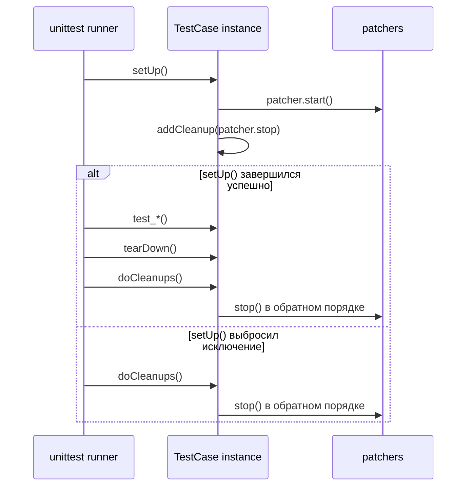

# Когда `patch`-декораторов становится слишком много: как использовать `start()/stop()` в `setUp()` и не утонуть в каскаде подмен

До одного-двух `@patch(...)` тест обычно читается легко. На третьем или четвёртом patch-слое ситуация меняется: сигнатура теста разрастается, порядок mock-аргументов приходится держать в голове, а общая мысль проверки уходит на второй план. В стандартном `unittest.mock` для этого есть отдельный рабочий режим: сохранить patcher-объект, включить подмену через `start()` в `setUp()`, а убрать её через `stop()` в cleanup-фазе. Документация описывает этот подход как способ упростить работу с несколькими patch-ами без вложенных декораторов и `with`-блоков. ([Python documentation][1])

## Введение

Эта тема кажется чисто синтаксической только на первый взгляд. На деле вопрос не в том, **какой способ короче**, а в том, **где живёт общая тестовая фикстура**. Если несколько тестов внутри класса запускаются в одном и том же patched-окружении, логично вынести это окружение в `setUp()`. Тогда заголовки тестовых методов становятся компактнее, а сами patch-ы превращаются из визуального шума в часть общей подготовки сценария. `unittest` как раз строит выполнение вокруг фикстуры: для каждого тестового метода создаётся отдельный экземпляр `TestCase`, затем вызывается `setUp()`, запускается сам тест и, если `setUp()` прошёл успешно, вызывается `tearDown()`. ([Python documentation][2])

## Почему каскад декораторов начинает мешать

Официальные примеры `unittest.mock` прямо признают две типовые проблемы. Первая: если один и тот же patch нужен нескольким тестовым методам, дублирование декораторов на каждом методе быстро превращается в повторение. Вторая: если использовать `patch()` как context manager для нескольких зависимостей, `with`-блоки начинают уходить всё глубже вправо. Именно на этих двух болевых точках и появляется интерес к `start()/stop()`. ([Python documentation][3])

Посмотрите на такой тестовый класс:

```python
import unittest
from unittest.mock import patch
import checkout


class TestCheckout(unittest.TestCase):
    @patch.dict("os.environ", {"PAYMENT_API_KEY": "test-key"}, clear=True)
    @patch("checkout.increment")
    @patch("checkout.send_receipt")
    @patch("checkout.Gateway", autospec=True)
    def test_success(self, MockGateway, mock_send_receipt, mock_increment):
        gateway = MockGateway.return_value
        gateway.charge.return_value = "tx-100"

        result = checkout.checkout(10)

        self.assertEqual(result, "tx-100")
        MockGateway.assert_called_once_with(api_key="test-key")
        gateway.charge.assert_called_once_with(10)
        mock_increment.assert_called_once_with("checkout.ok")
        mock_send_receipt.assert_called_once_with(10, "tx-100")

    @patch.dict("os.environ", {"PAYMENT_API_KEY": "test-key"}, clear=True)
    @patch("checkout.increment")
    @patch("checkout.send_receipt")
    @patch("checkout.Gateway", autospec=True)
    def test_gateway_error(self, MockGateway, mock_send_receipt, mock_increment):
        gateway = MockGateway.return_value
        gateway.charge.side_effect = TimeoutError("gateway down")

        with self.assertRaises(TimeoutError):
            checkout.checkout(10)

        mock_increment.assert_not_called()
        mock_send_receipt.assert_not_called()
```

Формально здесь всё корректно. Но у такого стиля есть практический предел. Тест начинает открываться не с бизнес-идеи, а с технического пролога из патчей. Более того, `unittest.mock` передаёт mock-объекты в порядке применения декораторов снизу вверх, то есть порядок параметров в сигнатуре связан с порядком наложения декораторов, а не с естественным порядком чтения сверху вниз. Документация это отдельно оговаривает. ([Python documentation][1])

Проблема особенно заметна, когда у класса есть «общий фон»: один и тот же ENV, один и тот же внешний клиент, одна и та же функция аудита. В таком месте хочется, чтобы тест говорил прежде всего о сценарии, а не о технике подмены. Именно здесь `setUp()` начинает работать как место для общей patched-фикстуры, а `start()/stop()` — как инструмент управления её жизненным циклом. ([Python documentation][1])

> Если patch нужен почти всем тестам класса и образует общий фон, его часто лучше поднять в `setUp()`. Если patch нужен одному тесту или одной ветке внутри теста, локальный декоратор или `with patch(...)` обычно честнее.

## Что такое patcher и что делают `start()` и `stop()`

В `unittest.mock` вызовы `patch()`, `patch.object()` и `patch.dict()` возвращают patcher-объекты. У всех patcher-объектов есть методы `start()` и `stop()`. `start()` включает подмену, `stop()` возвращает всё в исходное состояние. Документация прямо говорит, что этот механизм нужен как раз для переноса patch-логики в `setUp()` и для случаев, когда нужно сделать несколько подмен без вложенных декораторов или `with`-контекстов. ([Python documentation][1])

Если `patch()` создаёт mock за Вас, то результат `patcher.start()` — это и есть созданный mock-объект. Поэтому в `setUp()` Вы можете сразу сохранить его в атрибут `self` и потом использовать в тестах без дополнительных параметров в сигнатуре методов. Это одна из главных причин, почему подход со `start()` читается проще: моки получают осмысленные имена вроде `self.MockGateway` или `self.mock_send_receipt`, а не приезжают в тест в виде длинной очереди positional arguments. ([Python documentation][1])

Нужно помнить ещё одну деталь. Если Вы патчите **класс**, то код под тестом обычно работает не с самим mock-классом, а с его «экземпляром», который живёт в `MockClass.return_value`. Официальные примеры `unittest.mock` подчёркивают именно это: когда код делает `Foo()`, mock-экземпляр находится через `return_value`, и настраивать нужно уже его методы. ([Python documentation][3])

Минимальная механика выглядит так:

```python
from unittest.mock import patch

patcher = patch("package.module.ClassName")
MockClass = patcher.start()

# здесь package.module.ClassName уже заменён на MockClass

patcher.stop()

# здесь исходный ClassName восстановлен
```

Сам по себе этот пример слишком простой, но он показывает главное: `patch()` в режиме `start()/stop()` не превращается в другой API. Он просто переходит из «декоративной» формы в объектную. Вместо `@patch(...)` Вы теперь управляете тем же патчем вручную и можете встроить его в жизненный цикл `TestCase`. ([Python documentation][1])

## Почему `setUp()` здесь естественен

`unittest` создаёт **новый экземпляр** `TestCase` для каждого отдельного тестового метода. Затем этот экземпляр проходит цикл `setUp()` → `test_*()` → `tearDown()`. Это значит, что атрибуты вида `self.MockGateway`, `self.mock_repo` или `self.mock_send_receipt`, созданные в `setUp()`, не разделяются между тестами: каждый тест получает собственный набор моков и собственную фикстуру. Для start/stop-подхода это принципиально важно, потому что общая patched-среда должна быть общей **только внутри одного теста**, а не для всего класса целиком. ([Python documentation][2])



Диаграмма показывает главную архитектурную мысль темы 8.5. `start()` — это только половина задачи. Вторая половина — гарантированное снятие patch-а, даже если `setUp()` или сам тест падают. В `unittest` это обеспечивается через cleanup-механику: `addCleanup()` регистрирует функции очистки, а `doCleanups()` вызывается безусловно — либо после `tearDown()`, либо сразу после `setUp()`, если `setUp()` выбросил исключение. ([Python documentation][2])

## Наивный вариант: `start()` в `setUp()`, `stop()` в `tearDown()`

Документация `unittest.mock` показывает типовой сценарий: создать patcher в `setUp()`, вызвать `start()`, а затем остановить patcher в `tearDown()`. Для базовых случаев это рабочая схема. ([Python documentation][1])

```python
import unittest
from unittest.mock import patch
import mymodule


class TestFoo(unittest.TestCase):
    def setUp(self):
        self.patcher = patch("mymodule.foo")
        self.mock_foo = self.patcher.start()

    def tearDown(self):
        self.patcher.stop()

    def test_foo(self):
        self.assertIs(mymodule.foo, self.mock_foo)
```

Пока `setUp()` проходит без ошибок, всё хорошо. Но именно здесь скрыта самая неприятная ловушка темы.

## Главная ловушка: если `setUp()` падает, `tearDown()` уже не будет

`unittest` устроен так: если `setUp()` поднял исключение, тест считается ошибочным, сам метод `test_*` не запускается, и `tearDown()` **не вызывается**. Это документированное поведение `TestCase`. И именно из-за него схема «запустил patch в `setUp()`, остановил в `tearDown()`» может оставить утёкший patch, если исключение возникло после `start()` и до входа в `tearDown()`. ([Python documentation][2])

Представьте такой код:

```python
class TestBrokenSetup(unittest.TestCase):
    def setUp(self):
        self.patcher = patch("checkout.Gateway")
        self.MockGateway = self.patcher.start()

        # что-то пошло не так после успешного start()
        raise RuntimeError("broken fixture")

    def tearDown(self):
        self.patcher.stop()
```

На бумаге cleanup есть. На практике — нет. `setUp()` уже включил patch, но до `tearDown()` выполнение не дойдёт. Именно поэтому документация `unittest.mock` специально предупреждает: если использовать `start()/stop()` таким способом, нужно особенно внимательно обеспечить «undo», и `addCleanup()` как раз делает это проще. ([Python documentation][1])

Это и есть кульминация всей темы. Проблема start/stop-подхода не в том, что он сложный. Проблема в том, что без cleanup-механизма он слишком доверяет `tearDown()`, а `tearDown()` по контракту фреймворка не обязана исполняться после неуспешного `setUp()`. ([Python documentation][2])

## Ключевой поворот: `addCleanup()` вместо надежды на `tearDown()`

`TestCase.addCleanup()` добавляет функцию очистки в стек cleanup-обработчиков. Эти функции вызываются в обратном порядке добавления, то есть по LIFO. И самое важное: если `setUp()` не завершился успешно, cleanup-функции всё равно будут вызваны. Именно поэтому `addCleanup(patcher.stop)` — базовый страховочный механизм для `start()/stop()` в `setUp()`. ([Python documentation][2])

Официальные примеры `unittest.mock` предлагают именно такой переход:

```python
import unittest
from unittest.mock import patch
import mymodule


class TestFoo(unittest.TestCase):
    def setUp(self):
        patcher = patch("mymodule.foo")
        self.addCleanup(patcher.stop)
        self.mock_foo = patcher.start()

    def test_foo(self):
        self.assertIs(mymodule.foo, self.mock_foo)
```

Здесь важны сразу три эффекта. Во-первых, `stop()` больше не зависит от вызова `tearDown()`. Во-вторых, patcher можно не хранить в `self`, потому что cleanup уже знает, что вызвать. В-третьих, тест становится короче: cleanup-логика живёт рядом со `start()`, а не в отдельном методе ниже. Документация `unittest.mock` отдельно отмечает, что это дополнительный плюс такого подхода. ([Python documentation][1])

> Для patcher в `setUp()` практическое правило простое: как только Вы решили запускать patch вручную, сразу регистрируйте его `stop()` через `addCleanup()`.

## От одиночного patch-а к реальному рабочему шаблону

Один patch в `setUp()` — это только начало. Реальная ценность `start()/stop()` появляется тогда, когда у Вас две, три или четыре подмены, образующие общий фон для класса тестов. Именно это описывают official examples в разделе про nested patches: вместо того чтобы тащить несколько `with patch(...)` друг в друге, можно сделать простой helper `create_patch`, который запускает patcher, регистрирует cleanup и возвращает созданный mock. ([Python documentation][3])

Документация показывает helper в таком виде:

```python
def create_patch(self, name):
    patcher = patch(name)
    thing = patcher.start()
    self.addCleanup(patcher.stop)
    return thing
```

Идея важнее конкретной сигнатуры. Вынеся `start() + addCleanup()` в одно место, Вы убираете повторение и фиксируете правильный жизненный цикл patch-а. В результате каждая новая подмена в `setUp()` превращается в одну понятную строку. ([Python documentation][3])

## Полный пример: несколько зависимостей без леса декораторов

Ниже — уже не игрушечный, а рабочий учебный пример. В production-коде есть внешний клиент, функция побочного эффекта и зависимость от окружения.

```python
# checkout.py
import os
from payments import Gateway
from notifications import send_receipt
from metrics import increment


def checkout(order_id: int) -> str:
    gateway = Gateway(api_key=os.environ["PAYMENT_API_KEY"])
    tx_id = gateway.charge(order_id)
    increment("checkout.ok")
    send_receipt(order_id, tx_id)
    return tx_id
```

Теперь тест. Здесь `start()/stop()` используются не для красоты, а для того, чтобы общая patched-фикстура была собрана один раз в `setUp()`, а сами тесты говорили о сценариях.

```python
# test_checkout.py
import unittest
from unittest.mock import patch
import checkout


class TestCheckout(unittest.TestCase):
    def create_patch(self, factory, *args, **kwargs):
        patcher = factory(*args, **kwargs)
        self.addCleanup(patcher.stop)
        return patcher.start()

    def setUp(self):
        self.MockGateway = self.create_patch(
            patch,
            "checkout.Gateway",
            autospec=True,
        )
        self.mock_send_receipt = self.create_patch(
            patch,
            "checkout.send_receipt",
        )
        self.mock_increment = self.create_patch(
            patch,
            "checkout.increment",
        )
        self.create_patch(
            patch.dict,
            "os.environ",
            {"PAYMENT_API_KEY": "test-key"},
            clear=True,
        )

        self.gateway = self.MockGateway.return_value

    def test_checkout_returns_transaction_id(self):
        self.gateway.charge.return_value = "tx-100"

        result = checkout.checkout(10)

        self.assertEqual(result, "tx-100")
        self.MockGateway.assert_called_once_with(api_key="test-key")
        self.gateway.charge.assert_called_once_with(10)
        self.mock_increment.assert_called_once_with("checkout.ok")
        self.mock_send_receipt.assert_called_once_with(10, "tx-100")

    def test_checkout_propagates_gateway_timeout(self):
        self.gateway.charge.side_effect = TimeoutError("gateway down")

        with self.assertRaises(TimeoutError):
            checkout.checkout(10)

        self.mock_increment.assert_not_called()
        self.mock_send_receipt.assert_not_called()
```

В этом примере сразу видно несколько сильных сторон подхода. Во-первых, общий фон читается в одном месте: патч класса `Gateway`, патч функции `send_receipt`, патч функции `increment`, временная правка `os.environ`. Во-вторых, тестовые методы не принимают никаких технических параметров; они говорят только о сценарии. В-третьих, helper одинаково работает с `patch()` и `patch.dict()`, потому что документация прямо говорит: все patcher-объекты поддерживают `start()` и `stop()`. ([Python documentation][1])

Обратите внимание и на строку `self.gateway = self.MockGateway.return_value`. Это не stylistic choice, а следствие того, как работает patch класса. Когда патчится класс, сам класс заменяется mock-объектом, а «экземпляр», который получит код под тестом после вызова `Gateway(...)`, находится в `return_value`. Официальные примеры `unittest.mock` подчёркивают именно этот паттерн. ([Python documentation][3])

В результате бизнес-логика остаётся на виду. Первый тест проверяет happy path. Второй — негативный сценарий с `TimeoutError`. Техническая инфраструктура подмены при этом не исчезает совсем, но перестаёт доминировать над смыслом. Именно это и есть образовательная цель темы 8.5: научиться управлять patch-ами как частью фикстуры, а не как шумом над каждым отдельным тестом. ([Python documentation][2])

## Почему helper лучше, чем `self.patcher1`, `self.patcher2`, `self.patcher3`

Документация в разделе `patch methods: start and stop` показывает пример с `self.patcher1` и `self.patcher2` в `setUp()`/`tearDown()`. Это полезно для демонстрации механики. Но в реальном тестовом коде такой стиль быстро деградирует: появляются обезличенные атрибуты, логика остановки размазывается по `tearDown()`, а количество «служебных» имён растёт вместе с числом патчей. ([Python documentation][1])

Helper вроде `create_patch()` делает ровно три полезные вещи. Он связывает `start()` и cleanup в одну атомарную операцию. Он убирает необходимость хранить patcher на `self`, если Вам нужен только созданный mock. И он позволяет тесту оперировать осмысленными именами зависимостей, а не техническими индексами. Это уже не вопрос синтаксического вкуса, а вопрос сопровождения: через месяц `self.mock_repo` всё ещё читается, а `self.patcher3` — уже нет. Официальные примеры как раз ведут к этой форме через секцию про `create_patch`. ([Python documentation][3])

Есть и ещё один тихий плюс. Поскольку cleanup-функции вызываются в обратном порядке добавления, последовательность остановки патчей естественным образом оказывается обратной последовательности запуска. Для большинства patch-ов это не критично, но такая симметрия хорошо совпадает с обычной логикой вложенных context managers и упрощает ментальную модель teardown-фазы. ([Python documentation][2])

## Где этот стиль действительно лучше, а где нет

У `start()/stop()` в `setUp()` есть сильный сценарий применения: несколько зависимостей образуют общий фон для большинства тестов класса. Именно здесь выигрыш максимален. Вы один раз поднимаете клиента, ENV, функцию аудита или репозиторий в patched-виде, а потом в отдельных тестах меняете только поведение конкретного mock-а под сценарий. Это делает тестовый класс похожим на нормальную фикстуру, а не на набор изолированных технических трюков. ([Python documentation][1])

Но этот стиль не нужно объявлять «всегда лучшим». Документация напоминает и про другие формы patch-а. Если один и тот же patch нужен всем тестовым методам класса и речь идёт о простой подмене, `patch()` можно использовать как class decorator: тогда он обернёт все методы, начинающиеся с `test`. Это корректный официальный вариант. ([Python documentation][3])

Если patch нужен только одному конкретному тесту, а не всему классу, локальный декоратор или `with patch(...)` обычно понятнее. Иначе Вы прячете часть контекста в `setUp()`, хотя остальным тестам он не нужен. Иными словами, `start()/stop()` в `setUp()` — это не «более профессиональный» режим, а режим **для общей фикстуры**. Если общей фикстуры нет, лучше не изобретать её искусственно.

Полезное практическое правило здесь такое. Один тест — локальный patch. Один класс с общим patched-фоном — `setUp()` + `addCleanup()`. Один общий patch на весь класс и без особой логики — class decorator. Это уже не буква документации, а рабочая инженерная эвристика, но она хорошо согласуется с тем, как `unittest.mock` раскладывает свои формы применения. ([Python documentation][3])

## Ошибки, которые особенно часто ломают эту технику

Первая ошибка — надеяться только на `tearDown()`. Формально код выглядит аккуратно, но как только `setUp()` падает после `start()`, `tearDown()` уже не будет вызван. Поэтому для patch-ов, которые запускаются вручную, `addCleanup()` — не украшение, а страховка от утечки состояния между тестами. ([Python documentation][2])

Вторая ошибка — думать, что перенос patch-а в `setUp()` каким-то образом исправляет неверный target. Не исправляет. `patch()` по-прежнему должен менять имя в том namespace, где объект **ищется** кодом под тестом. Документация подчёркивает это как общий принцип: patch нужно применять там, где объект lookup-ится, а не обязательно там, где он определён. `setUp()` меняет только организацию фикстуры, но не правило выбора target. ([Python documentation][1])

Третья ошибка — забывать про `return_value`, когда патчится класс. Если production-код делает `Gateway()`, то методы настраиваются уже на `self.MockGateway.return_value`, а не на `self.MockGateway` напрямую. Это типовая причина «неработающих» тестов в сервисном слое. ([Python documentation][3])

Четвёртая ошибка — тащить в `setUp()` вообще все мыслимые patch-и класса. Тогда цена удобства становится слишком высокой: каждый тест зависит от большого скрытого фона, а понять локально, что происходит, уже нельзя без постоянных прыжков в начало класса. Если patch важен только для одного сценария, лучше оставить его рядом с этим сценарием.

Пятая ошибка — использовать `patch.stopall()` как обычный способ уборки. Документация действительно предоставляет `patch.stopall()`, и он останавливает все активные patch-и, которые были запущены через `start()`. Но это аварийная сетка, а не хороший повседневный дизайн cleanup-фазы. Нормальный тест знает, какие patch-и он поднял, и убирает именно их через `addCleanup()`. ([Python documentation][1])

## Небольшое, но важное замечание про `enterContext()`

В современном `unittest` есть соседний инструмент: `TestCase.enterContext()`. Он принимает обычный context manager, вызывает у него `__enter__()`, а `__exit__()` автоматически регистрирует через `addCleanup()`. Этот API добавлен в Python 3.11. Для произвольных context managers это очень удобный путь. Но сам `unittest.mock` по-прежнему документирует `start()/stop()` как естественный способ управлять patcher-объектами в `setUp()`, особенно если Вы строите helper вокруг нескольких patch-ов. ([Python documentation][2])

То есть `enterContext()` — полезный сосед, но не замена теме 8.5. Логика `start()/stop()` остаётся базовой, потому что patcher в `unittest.mock` — это самостоятельный объект с собственным жизненным циклом, и стандартная документация объясняет именно его.

## Заключение

Тема `start()/stop()` в `setUp()` на самом деле не про сокращение количества строк. Она про то, где живёт общая patched-фикстура и кто отвечает за её гарантированную очистку. Когда один и тот же набор подмен нужен нескольким тестам класса, вынесение patch-ов в `setUp()` делает тесты чище: технический фон собирается один раз, а методы `test_*` концентрируются на сценариях. Документация `unittest.mock` прямо предлагает такой режим для нескольких patch-ов без каскада декораторов и `with`-блоков. ([Python documentation][1])

Но настоящий профессиональный поворот в этой теме начинается там, где Вы перестаёте полагаться на `tearDown()` и подключаете `addCleanup()`. Как только это сделано, `start()/stop()` перестаёт быть хрупким ручным режимом и превращается в удобный способ строить общую тестовую фикстуру. Именно тогда helper вроде `create_patch()` становится не просто косметикой, а надёжным рабочим шаблоном: один вызов — один patch, один cleanup, одна осмысленная зависимость в `self`. ([Python documentation][2])

Если свести весь материал к одной практической формуле, она будет такой: **общий patched-фон для класса — поднимайте в `setUp()`; остановку patch-ов регистрируйте через `addCleanup()` сразу же; локальные одноразовые patch-и оставляйте рядом с конкретным тестом**. Это и есть тот баланс между читаемостью, изоляцией и управляемым жизненным циклом, ради которого вообще стоит изучать тему 8.5.

## Дополнительные материалы

Официальная документация `unittest.mock` (разделы: `patch methods: start and stop`, `patch.stopall`, `Where to patch`, class decorators). ([Python documentation][1])

Практические примеры `unittest.mock` (разделы: `Applying the same patch to every test method`, `Nesting Patches`, helper `create_patch`). ([Python documentation][2])

Документация `unittest.TestCase` (`setUp`, `tearDown`, `addCleanup`, `doCleanups`, `enterContext`). ([Python documentation][3])

Исходный код `unittest.mock` в CPython. ([GitHub][4])

[1]: https://docs.python.org/3/library/unittest.mock.html "unittest.mock — mock object library — Python 3.14.3 documentation"
[2]: https://docs.python.org/3/library/unittest.mock-examples.html "unittest.mock — getting started — Python 3.14.3 documentation"
[3]: https://docs.python.org/3/library/unittest.html "unittest — Unit testing framework — Python 3.14.3 documentation"
[4]: https://github.com/python/cpython/blob/main/Lib/unittest/mock.py "cpython/Lib/unittest/mock.py"
[1]: https://docs.python.org/3/library/unittest.mock.html "unittest.mock — mock object library — Python 3.14.3 documentation"
[2]: https://docs.python.org/3/library/unittest.html "unittest — Unit testing framework — Python 3.14.3 documentation"
[3]: https://docs.python.org/3/library/unittest.mock-examples.html "unittest.mock — getting started — Python 3.14.3 documentation"
