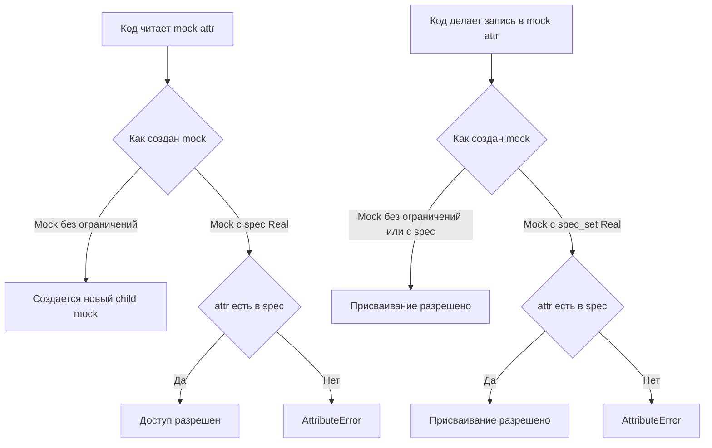

# Зелёный, но ложный: как `spec` и `spec_set` заставляют mock уважать реальный интерфейс

Вы переименовали у внешнего клиента метод `send_email()` в `send()`. Производственный код обновили не везде. Но unit-тесты почему-то остались зелёными. Это не магия и не «особенность именно вашего проекта». Обычный `Mock` по умолчанию очень гибок: он создаёт дочерние моки при обращении к новым атрибутам, а документация `unittest.mock` отдельно предупреждает, что после рефакторинга тесты на моках могут продолжать проходить, даже если код уже использует устаревший API. `spec` и `spec_set` нужны именно для того, чтобы сократить число таких ложноположительных тестов. ([Python documentation][1])

## Введение

В `unittest.mock` аргумент `spec` может быть либо списком строк, либо реальным объектом — классом или экземпляром. В обоих случаях mock получает ограничение по допустимым именам атрибутов. `spec_set` — более строгий вариант: он не только запрещает читать несуществующие атрибуты, но и запрещает их присваивать. Это и есть первая линия защиты от тестов, которые проходят лишь потому, что mock «подыграл» коду под тестом. ([Python documentation][1])

## Сначала проблема: как обычный `Mock` делает тест правдоподобным, но неверным

Начнём с короткой истории, которая очень похожа на реальную разработку. У Вас есть сервис уведомлений и внешний клиент отправки писем.

```python
# notifications.py
class MailerClient:
    def send(self, recipient: str, text: str) -> None:
        raise NotImplementedError


class NotificationService:
    def __init__(self, mailer):
        self.mailer = mailer

    def notify(self, recipient: str, text: str) -> None:
        # В коде остался старый вызов после рефакторинга клиента
        self.mailer.send_email(recipient, text)
```

Теперь тест без `spec`:

```python
# test_notifications.py
import unittest
from unittest.mock import Mock

from notifications import NotificationService


class TestNotificationService(unittest.TestCase):
    def test_notify_with_plain_mock(self):
        mailer = Mock()
        service = NotificationService(mailer)

        service.notify("user@example.com", "Привет")

        mailer.send_email.assert_called_once_with(
            "user@example.com",
            "Привет",
        )
```

Такой тест выглядит осмысленным. Но он лжёт. Почему? Потому что plain `Mock` создаёт новые дочерние моки при обращении к атрибутам. Для него `mailer.send_email` — не ошибка и не сигнал «такого метода нет», а просто ещё один mock, который удобно использовать дальше. Именно эту гибкость документация называет одновременно сильной стороной и источником ложноположительных тестов после рефакторинга API. ([Python documentation][1])

> Обычный `Mock` отлично подходит для быстрых экспериментов.
> Но если Вы проверяете реальный контракт между объектами, его свобода слишком велика.

Документация `unittest.mock-examples` показывает ту же проблему на другом примере: если реальный класс больше не содержит старый метод, а тест всё ещё работает с plain mock, тест может продолжать проходить, хотя производственный код уже отстал от реального интерфейса. Это и есть тот случай, когда зелёный тест перестаёт быть надёжным сигналом качества. ([Python documentation][2])

## Что именно делает `spec`

Теперь сделаем то же самое, но ограничим mock реальным интерфейсом клиента.

```python
import unittest
from unittest.mock import Mock

from notifications import MailerClient, NotificationService


class TestNotificationService(unittest.TestCase):
    def test_notify_with_spec(self):
        mailer = Mock(spec=MailerClient)
        service = NotificationService(mailer)

        with self.assertRaises(AttributeError):
            service.notify("user@example.com", "Привет")
```

Когда Вы передаёте `spec=MailerClient`, mock больше не может притворяться чем угодно. В документации сказано прямо: `spec` может быть списком строк или реальным объектом; если передан объект, список допустимых имён строится через `dir()` этого объекта, а попытка обратиться к атрибуту вне этой спецификации приводит к `AttributeError`. Для нашего примера это означает простое правило: `send` — допустимое имя, `send_email` — нет. Поэтому тест ломается сразу, а не даёт коду тихо пройти по неверному пути. ([Python documentation][1])

Есть важная тонкость. `spec` не делает mock «настоящим экземпляром» класса. Он не копирует реальную реализацию, не подставляет реальные значения полей и не запускает методы оригинала. Он только ограничивает список допустимых имён. Всё, что находится внутри разрешённой поверхности API, по-прежнему остаётся mock-объектом. Это следует из двух фактов документации: обычный mock создаёт дочерние моки при доступе к атрибутам, а `spec` только запрещает доступ к именам вне спецификации. ([Python documentation][1])

Из-за этого полезно мысленно разделять два вопроса. Первый: **какие имена разрешено трогать**. На него отвечает `spec`. Второй: **что именно возвращается при доступе к разрешённому имени**. На этот вопрос `spec` сам по себе не отвечает: Вы по-прежнему получаете mock, пока не настроите его вручную.

Есть и ещё один приятный побочный эффект. Если `spec` построен от реального объекта, у mock меняется поведение `__class__`: он начинает возвращать класс объекта-спеки, и поэтому `isinstance(mock, SomeClass)` проходит успешно. Это удобно там, где код под тестом или вспомогательная логика проверяют тип коллаборатора. ([Python documentation][1])

```python
from unittest.mock import Mock


class MailerClient:
    def send(self, recipient: str, text: str) -> None: ...


mailer = Mock(spec=MailerClient)

assert isinstance(mailer, MailerClient)
```

Если mock сам вызывается как функция, `spec` даёт ещё одну полезную вещь: более умное сопоставление аргументов в `assert_called_with()`. Документация показывает, что callable mock, созданный со `spec` или `spec_set`, использует сигнатуру объекта-спеки при проверке вызовов, поэтому позиционные и именованные аргументы сопоставляются корректнее. Это не тот же уровень жёсткости, что у `autospec`, но для простых вызываемых объектов это уже делает проверки аккуратнее. ([Python documentation][1])

```python
from unittest.mock import Mock


def send_message(user_id, text, urgent=False):
    pass


mock_send = Mock(spec=send_message)

mock_send(10, "hello", urgent=True)
mock_send.assert_called_with(user_id=10, text="hello", urgent=True)
```

Именно в этой точке `spec` превращается из «ещё одного флага» в реальный защитный механизм. Он заставляет test double хотя бы на верхнем уровне уважать контракт реального объекта.



Схема выше отражает самую полезную ментальную модель темы. `spec` ограничивает чтение интерфейса. `spec_set` идёт дальше и ограничивает ещё и запись. А plain `Mock()` по умолчанию слишком либерален и потому часто пропускает то, что в реальном объекте быть не может. ([Python documentation][1])

## Но есть предел: `spec` защищает только сам mock, а не всю глубину вызовов

Это место особенно важно, потому что именно здесь многие впервые думают: «Я же уже добавил `spec`, почему тест всё ещё может соврать?»

Посмотрите на пример:

```python
from unittest.mock import Mock


class ApiClient:
    def fetch(self, user_id: int):
        raise NotImplementedError


client = Mock(spec=ApiClient)

# fetch есть в интерфейсе — это допустимый атрибут
response = client.fetch(10)

# А вот дальше начинается свободная жизнь дочернего мока
response.stauts_code = 500  # опечатка в имени поля
response.jsno.return_value = {"id": 10}  # ещё одна опечатка
```

Оба присваивания выше пройдут. Причина описана в официальной документации прямо: `spec` применяется только к самому mock-объекту. Как только Вы зашли на уровень дочернего мока — например, в `return_value`, в разрешённый метод или в разрешённый атрибут — Вы снова имеете дело с обычным mock, если специально не настроили его иначе. Именно поэтому документация сразу после объяснения `spec` переходит к `autospec`: он нужен, когда Вы хотите рекурсивно ограничить и дочерние объекты тоже. ([Python documentation][1])

Это фундаментальная мысль модуля 9.1. `spec` не превращает весь граф объектов в строгий контракт. Он ставит рамку только вокруг текущего mock. Для большого числа unit-тестов этого уже достаточно, потому что главная цель — поймать устаревшее имя метода или поля на внешнем коллабораторе. Но если баг может спрятаться глубже, например в интерфейсе возвращаемого объекта, одного `spec` уже мало. ([Python documentation][1])

Поэтому полезно воспринимать `spec` не как окончательное решение, а как первый уровень защиты. Он закрывает верхнюю границу интерфейса. Следующий уровень — рекурсивная защита и сигнатуры методов — это уже область `autospec`. ([Python documentation][1])

## Что добавляет `spec_set`

Теперь перейдём к более строгому варианту. На уровне определения разница очень проста: `spec_set` — это более жёсткая форма `spec`. Документация формулирует это буквально так: если использовать `spec_set`, попытка не только получить, но и **установить** атрибут, которого нет в объекте-спеке, приведёт к `AttributeError`. Примеры `unittest.mock-examples` отдельно подчёркивают, что `spec_set` запрещает произвольное присваивание, а не только чтение. ([Python documentation][1])

Посмотрите на разницу в живом коде:

```python
from unittest.mock import Mock


class Gateway:
    def charge(self, amount: int) -> str:
        raise NotImplementedError


gateway_with_spec = Mock(spec=Gateway)
gateway_with_spec.timeout = 5  # это допустимо

gateway_with_spec_set = Mock(spec_set=Gateway)
gateway_with_spec_set.timeout = 5  # AttributeError
```

Именно здесь `spec_set` особенно ценен. Баги бывают не только в чтении несуществующего API, но и в записи в него. Код под тестом может случайно добавлять объекту новое поле, которого у реального класса никогда не было: `timeout`, `cache`, `retries`, `last_error`, что угодно. Обычный `spec` это не поймает. `spec_set` поймает. ([Python documentation][1])

> `spec` ловит чтение несуществующего интерфейса.
> `spec_set` ловит и чтение, и запись в несуществующий интерфейс.

Это звучит почти как мелкая разница, но на практике это разница между «код вызывает несуществующий метод» и «код тайком лепит на mock лишнее состояние, которое реальный объект не поддерживает». Для сервисного слоя, который общается с клиентами, репозиториями и адаптерами, второй тип ошибки встречается не реже первого.

Есть, конечно, и цена. `spec_set` строже. Если в тесте Вы привыкли «донастраивать» mock произвольными атрибутами просто ради удобства, `spec_set` начнёт Вам мешать. И это не всегда плохо: часто такое неудобство как раз показывает, что тест слишком вольно обращается с интерфейсом коллаборатора.

## `spec` от класса, `spec` от экземпляра и `spec` списком строк — это три разных сценария

В документации сказано, что `spec` может быть либо списком строк, либо существующим объектом — классом или экземпляром. Если передан объект, допустимые имена строятся через `dir()` этого объекта. Из этого следует очень практический вывод: `Mock(spec=SomeClass)` и `Mock(spec=SomeClass())` могут давать разную поверхность API. ([Python documentation][1])

Рассмотрим пример:

```python
from unittest.mock import Mock


class UserRepo:
    def __init__(self):
        self.cache = {}

    def get(self, user_id: int):
        raise NotImplementedError
```

Теперь сравним два варианта:

```python
repo_from_class = Mock(spec=UserRepo)
repo_from_instance = Mock(spec=UserRepo())

# repo_from_class.cache  -> вероятен AttributeError
# repo_from_instance.cache -> допустимый атрибут
```

Почему так? Потому что спецификация строится не «из идеи класса вообще», а из результата `dir()` на переданном объекте. Если Вы передали класс, mock видит только то, что находится в классовой поверхности. Если Вы передали экземпляр, mock видит и те атрибуты, которые появились у конкретного объекта после `__init__()`. Та же логика всплывает в документации про autospec: атрибуты, созданные только во время инициализации экземпляра, не видны из класса как такового и поэтому не попадают в ограничение, построенное только по видимой поверхности объекта. ([Python documentation][1])

Но здесь есть важная оговорка. Даже если `repo_from_instance.cache` теперь разрешён, это не настоящий словарь `dict`. Это всё равно mock-атрибут, просто он теперь **разрешён** контрактом. `spec` не копирует реальные значения полей экземпляра. Он только говорит: «да, имя `cache` существует, обращаться к нему можно». Что именно будет стоять за этим именем, Вы всё равно настраиваете сами. Это прямое следствие базового поведения `Mock` создавать дочерние моки при доступе к атрибутам. ([Python documentation][1])

Третья форма — список строк.

```python
transport = Mock(spec=["connect", "send", "close"])

transport.connect()
transport.send("payload")

# transport.reset()  -> AttributeError
```

Такая запись полезна, когда у Вас нет удобного импортируемого объекта, но есть понятный локальный контракт. Например, Вы пишете тест на абстрактный транспортный адаптер и хотите явно зафиксировать, что от него ждёте только `connect`, `send` и `close`. Это рабочий вариант, он полностью поддерживается API. Но у него есть естественный минус: список живёт отдельно от реального объекта и требует ручной поддержки. Кроме того, особое поведение `__class__`, которое позволяет specced mock проходить `isinstance()`, документация гарантирует именно для случая, когда `spec` — это объект, а не список строк. ([Python documentation][1])

На практике это даёт простое правило. Если у Вас есть реальный класс или экземпляр, почти всегда полезнее строить `spec` от него. Если реального объекта нет или он слишком тяжёлый для импорта, список строк остаётся хорошим ручным контрактом. Но его уже надо поддерживать сознательно.

## `spec` через `patch()` и `patch.object()`: меньше ручной сборки, больше дисциплины

В реальных тестах мок часто создаётся не через `Mock(...)`, а через `patch()`. И здесь `spec` со `spec_set` тоже работают. Документация `patch()` говорит прямо: аргументы `spec` и `spec_set` передаются создаваемому mock-объекту, а если Вы пишете `spec=True` или `spec_set=True`, то в качестве спецификации используется сам объект, который Вы патчите. ([Python documentation][1])

Вот типичный пример:

```python
import unittest
from unittest.mock import patch

import billing


class TestBilling(unittest.TestCase):
    @patch("billing.Gateway", spec_set=True)
    def test_charge(self, MockGateway):
        gateway = MockGateway.return_value
        gateway.charge.return_value = "tx-100"

        result = billing.charge_order(100)

        self.assertEqual(result, "tx-100")
        gateway.charge.assert_called_once_with(100)
```

Здесь есть две детали, которые легко пропустить. Первая: `spec_set=True` в `patch()` означает «возьми объект, который патчится, и используй его как spec_set». Вторая: если патчится **класс**, то код под тестом работает с `return_value` созданного mock-класса, и документация отдельно уточняет, что при `spec` или `spec_set` этот `return_value` тоже получает ту же спецификацию. То есть ограничение интерфейса распространяется и на mock-экземпляр, который вернёт `Gateway()`. ([Python documentation][1])

Это особенно удобно в тестах сервисного слоя. Вам не нужно отдельно писать `Mock(spec=Gateway)` и потом вручную внедрять его в код. Достаточно одного `patch("module.Gateway", spec_set=True)`, а дальше работать с `MockGateway.return_value` как с экземпляром подменённого класса. Документация про `patch()` также напоминает, что именно `return_value` будет использоваться, если код под тестом инстанцирует патченный класс. ([Python documentation][1])

То же семейство аргументов понимает и `patch.object()`. Документация прямо говорит, что для `patch.object()` параметры `new`, `spec`, `create`, `spec_set`, `autospec` и `new_callable` имеют тот же смысл, что и для `patch()`. Это удобно, когда target уже есть у Вас как объект, и Вам не нужен строковый путь. ([Python documentation][1])

## Если mock уже создан, его всё ещё можно «затянуть»

Это редкий, но полезный приём. В `Mock` есть метод `mock_add_spec(spec, spec_set=False)`. Он позволяет добавить спецификацию уже существующему mock-объекту. Документация описывает его просто: после вызова только атрибуты из `spec` можно читать, а если `spec_set=True`, то только их же можно и устанавливать. ([Python documentation][1])

Это хороший инструмент миграции, если у Вас есть старые тестовые хелперы, которые возвращают plain mock, а переписывать их все сразу не хочется.

```python
from unittest.mock import Mock


class MailerClient:
    def send(self, recipient: str, text: str) -> None: ...


mailer = Mock()
mailer.mock_add_spec(MailerClient, spec_set=True)

mailer.send("user@example.com", "hi")  # допустимо
# mailer.send_email("user@example.com", "hi")  -> AttributeError
# mailer.timeout = 3                           -> AttributeError
```

Такой приём не заменяет аккуратный дизайн тестов, но помогает ужесточать существующую кодовую базу постепенно, а не одним большим болезненным коммитом.

## Ещё один важный плюс: `MagicMock` перестаёт притворяться тем, чем реальный объект не является

`MagicMock` удобен тем, что у него заранее созданы большинство магических методов. Поэтому он легко ведёт себя как контейнер, итератор, context manager и так далее. Это удобно, но опасно: без ограничений он может выглядеть «слишком способным» по сравнению с реальным объектом. Документация отдельно уточняет, что если использовать `spec` или `spec_set`, то у `MagicMock` будут созданы только те magic methods, которые реально присутствуют в спецификации. ([Python documentation][1])

Практический смысл здесь очень простой. Если реальный объект не является контекстным менеджером, specced `MagicMock` не должен внезапно вести себя так, будто его можно безопасно использовать в `with`. Если объект не является контейнером, specced mock не должен слишком легко притворяться словарём или списком. Это не самая первая мысль, которая приходит в голову, когда Вы изучаете `spec`, но в сложных тестах она помогает не меньше, чем ловля несуществующих обычных методов. ([Python documentation][1])

## Как выбирать между `spec` и `spec_set` на практике

Самое полезное правило звучит так: если Вы хотите быстро закрыть главный класс ложноположительных тестов после рефакторинга интерфейса, начинайте со `spec`. Он уже заставляет mock уважать набор допустимых имён верхнего уровня. Если же коллаборатор в реальном коде не должен обрастать новыми полями на лету, а Вы хотите ловить и несанкционированные присваивания, переходите на `spec_set`. Внешние клиенты, репозитории, адаптеры и шлюзы особенно хорошо подходят для такого ужесточения. ([Python documentation][1])

Когда у объекта есть важные атрибуты экземпляра, созданные в `__init__()`, думайте, от чего строить спецификацию: от класса или от экземпляра. Так как допустимая поверхность формируется через `dir()` переданного объекта, `spec` от экземпляра видит больше реальной инициализированной поверхности, чем `spec` от класса. Это полезно, если Вы тестируете код, который работает с уже сконструированным объектом. ([Python documentation][1])

Если интерфейс уходит вглубь — например, Вам важно не только наличие метода `fetch`, но и то, какой интерфейс у его `return_value`, — одной `spec` уже мало. Документация говорит об этом прямо: спецификация применяется только к самому mock, а рекурсивную защиту и проверку сигнатур даёт уже autospeccing. В структуре курса это как раз и объясняет переход от 9.1 к 9.2. ([Python documentation][1])

## Заключение

`spec` и `spec_set` решают не декоративную проблему и не вопрос «более красивых моков». Они решают проблему доверия к unit-тесту. Пока mock может бесконтрольно создавать новые атрибуты, тест слишком легко остаётся зелёным после того, как реальный интерфейс уже изменился. `spec` ставит первую рамку: использовать можно только те имена, которые есть у реального объекта. `spec_set` делает эту рамку жёстче: нельзя не только читать, но и записывать то, чего в реальном интерфейсе нет. ([Python documentation][1])

Самая полезная привычка здесь очень простая. Каждый раз, когда Вы пишете `Mock()` для внешнего коллаборатора, задайте себе один вопрос: «Хочу ли я, чтобы этот объект мог притвориться чем угодно?» Если ответ «нет», plain `Mock()` почти наверняка слишком мягок. И тогда `spec` или `spec_set` — не усложнение, а нормальная инженерная страховка.

## Дополнительные материалы

Официальная документация `unittest.mock`: конструктор `Mock`, аргументы `spec` и `spec_set`, `mock_add_spec()`, `patch(..., spec=True/spec_set=True)` и раздел `Autospeccing`. ([Python documentation][1]) ([Python documentation][1])

Практические примеры `unittest.mock`: раздел про создание mock из существующего объекта, где хорошо видно, как `spec` ловит устаревшие имена после рефакторинга. ([Python documentation][2]) ([Python documentation][2])

Документация по `patch()`: поведение `spec=True` и `spec_set=True` при патче классов и правило с `return_value` для mock-экземпляра. ([Python documentation][3]) ([Python documentation][1])

Официальное описание `MagicMock`: что происходит с magic methods при использовании `spec` и `spec_set`. ([Python documentation][4]) ([Python documentation][1])

[1]: https://docs.python.org/3/library/unittest.mock.html "unittest.mock — mock object library"
[2]: https://docs.python.org/3/library/unittest.mock-examples.html "unittest.mock — getting started"
[3]: https://docs.python.org/3/library/unittest.mock.html#patch "unittest.mock.patch"
[4]: https://docs.python.org/3/library/unittest.mock.html#magicmock-and-magic-method-support "MagicMock and magic method support"
[1]: https://docs.python.org/3/library/unittest.mock.html "unittest.mock — mock object library — Python 3.14.3 documentation"
[2]: https://docs.python.org/3/library/unittest.mock-examples.html "unittest.mock — getting started — Python 3.14.3 documentation"
