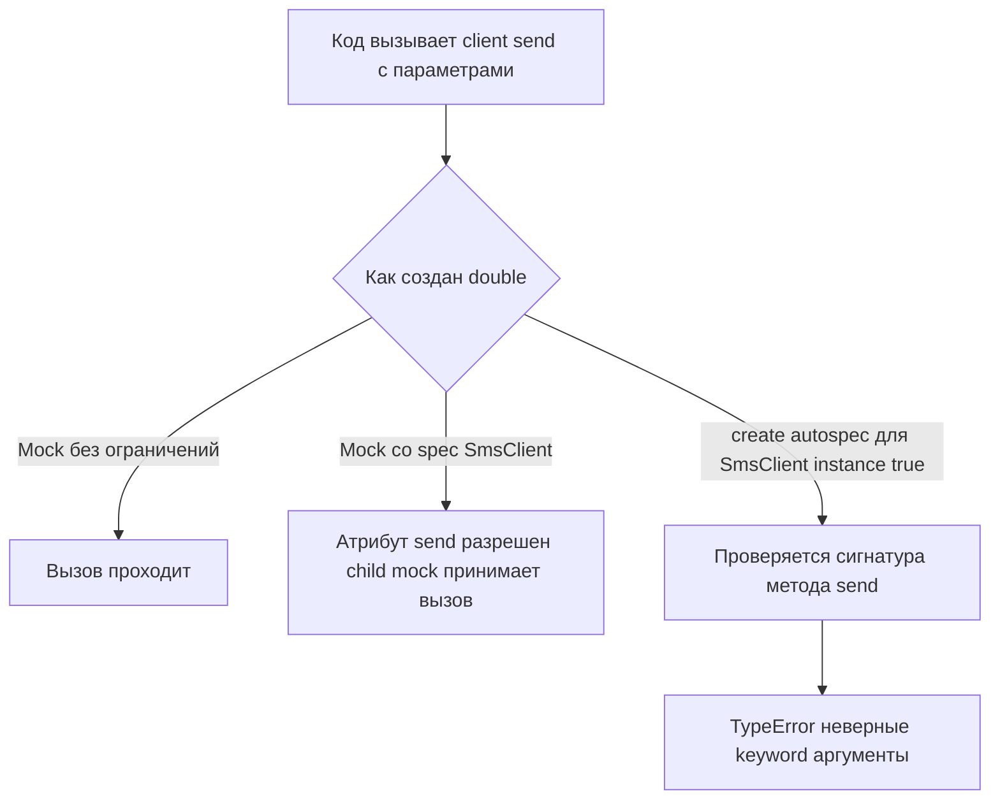

# Почему `Mock` молчит, когда код уже сломан: `autospec=True` и `create_autospec()` против ложнозелёных тестов

Вы меняете сигнатуру метода, забываете обновить один вызов в сервисе, запускаете тесты — и они остаются зелёными. На первый взгляд это выглядит как успех. На деле это один из самых неприятных видов ложноположительного теста: mock оказался слишком гибким и позволил коду сделать то, чего реальный объект уже не позволяет. В `unittest.mock` для этой проблемы есть два ключевых инструмента: `autospec=True` в `patch()` и функция `create_autospec()`. Официальная документация описывает auto-speccing как механизм, который сохраняет API исходного объекта и, что особенно важно, переносит на mock сигнатуры функций, методов и конструкторов. Неправильный вызов в таком случае ломается `TypeError`, а не маскируется под «нормальную работу». ([Python documentation][1])

Тема важна именно после знакомства со `spec` и `spec_set`. Обычный `spec` уже делает тесты лучше: он не даёт обращаться к несуществующим атрибутам на самом mock-объекте. Но этого недостаточно, когда ошибка прячется не в имени верхнеуровневого метода, а в его сигнатуре — например, в неверных keyword-аргументах, забытом обязательном параметре или неправильном вызове конструктора. Auto-speccing закрывает именно этот класс ошибок и делает это рекурсивно: спецификация применяется не только к самому mock, но и к его атрибутам по мере доступа к ним. ([Python documentation][1])

Во всём материале ниже ключевая мысль одна: `autospec` нужен не затем, чтобы mock выглядел «строже», а затем, чтобы он падал в тех же местах, где упал бы реальный объект. Это не делает тест идеальным — `autospec` проверяет форму вызова, а не бизнес-смысл аргументов, — но резко уменьшает число зелёных тестов, которые уже ничего не гарантируют. ([Python documentation][1])

## Введение

В официальной документации `unittest.mock` auto-speccing описан как развитие обычного `spec`. Базовый `spec` ограничивает допустимые имена атрибутов интерфейсом реального объекта. Auto-speccing идёт дальше: он делает это рекурсивно и лениво, а заодно проверяет сигнатуры вызовов у функций, методов и конструкторов. Именно поэтому для `patch()` у Вас есть аргумент `autospec=True`, а для прямого создания test double — функция `create_autospec()`. У обеих один и тот же замысел: дать mock тот контракт, который действительно есть у оригинала. ([Python documentation][1])

Практически это означает следующее. Когда Вы патчите импортированное имя в модуле под тестом, чаще всего удобнее `patch(..., autospec=True)`. Когда зависимость передаётся в код напрямую, например через конструктор сервиса, и Вам нужен mock-объект без patching namespace, естественный выбор — `create_autospec()`. Разница между этими инструментами не в строгости, а в точке входа: `patch(..., autospec=True)` заменяет существующее имя, а `create_autospec()` просто строит новый mock по образцу реального объекта. ([Python documentation][1])

Если сформулировать тему совсем коротко, получится так. `spec` отвечает на вопрос «можно ли вообще обращаться к этому имени». `autospec` отвечает на более строгий вопрос: «если к этому имени обращаться можно, делаете ли Вы это так, как позволил бы реальный объект». Именно поэтому `autospec` — это уже не просто защита от опечаток, а защита от неверного использования интерфейса. ([Python documentation][1])

> Хороший mock не должен быть удобнее реального объекта.
> Если с ним можно сделать больше, чем с настоящей зависимостью, тест начинает врать.

## Почему одного `spec` часто недостаточно

Начнём с классической ситуации. У Вас есть внешний клиент и сервис, который им пользуется.

```python
# alerts.py
class SmsClient:
    def send(self, phone: str, text: str, urgent: bool = False) -> None:
        raise NotImplementedError


class AlertService:
    def __init__(self, sms_client):
        self.sms_client = sms_client

    def alert(self, phone: str, text: str) -> None:
        # Ошибка после рефакторинга клиента:
        # реальные имена аргументов уже другие
        self.sms_client.send(number=phone, body=text)
```

На первый взгляд кажется, что `Mock(spec=SmsClient)` уже должен поймать проблему. Но нет.

```python
# test_alerts.py
import unittest
from unittest.mock import Mock

from alerts import AlertService, SmsClient


class TestAlertService(unittest.TestCase):
    def test_false_green_with_spec(self):
        sms_client = Mock(spec=SmsClient)
        service = AlertService(sms_client)

        service.alert("+79990000000", "Код подтверждения")

        sms_client.send.assert_called_once_with(
            number="+79990000000",
            body="Код подтверждения",
        )
```

Этот тест вполне может остаться зелёным. Причина в том, что `spec` ограничивает сам mock верхнего уровня: имя `send` существует у `SmsClient`, значит доступ к `sms_client.send` разрешён. Но дальше Вы уже работаете с дочерним mock-объектом метода, а не с реальной сигнатурой `SmsClient.send`. Документация `unittest.mock-examples` отдельно подчёркивает: `spec` даёт более умное сопоставление аргументов для самого mock, но если Вам нужно, чтобы такая же строгость работала и для вызовов методов mock-объекта, нужен именно auto-speccing. ([Python documentation][2])

Именно здесь возникает ключевой разрыв между «интерфейс существует» и «интерфейс используется правильно». `spec=SmsClient` поймал бы вызов `sms_client.sned(...)` или `sms_client.push(...)`, потому что таких имён нет в спецификации. Но он не обязан ловить неверные keyword-аргументы у разрешённого метода `send`. Для этого нужен уже не просто список допустимых имён, а реальная сигнатура вызова метода. Эту работу как раз и делает `autospec`. ([Python documentation][1])

## Что именно добавляет `autospec`

Документация формулирует разницу очень чётко. Если в `patch()` указать `autospec=True`, mock создаётся со спецификацией объекта, который заменяется. Причём это работает рекурсивно: атрибуты mock-объекта получают спецификацию соответствующих атрибутов оригинала. А функции и методы получают ту же сигнатуру вызова, что и реальный объект, и при неправильном вызове выбрасывают `TypeError`. Для классов это относится и к конструктору, и к mock-экземпляру в `return_value`. ([Python documentation][1])

У `create_autospec()` тот же принцип. Официальная сигнатура функции — `create_autospec(spec, spec_set=False, instance=False, **kwargs)`. Она строит mock по другому объекту как по спецификации, а функции и методы такого mock-а проверяют аргументы на соответствие реальной сигнатуре. Если передан класс, то его `return_value` тоже получает ту же спецификацию. А если Вам нужен не mock класса, а сразу mock экземпляра, у `create_autospec()` есть для этого параметр `instance=True`. ([Python documentation][1])

На практике `autospec` решает сразу две проблемы. Первая — он рекурсивно ограничивает API, поэтому ошибки не прячутся на дочерних mock-объектах методов. Вторая — он валидирует форму вызова: обязательные аргументы, имена keyword-аргументов и общую сигнатуру. Это именно то, чего обычно не хватает после одной только темы про `spec` и `spec_set`. ([Python documentation][1])



Диаграмма выше показывает самую полезную разницу. Обычный `Mock()` пропускает всё. `Mock(spec=SmsClient)` уже не пропустит несуществующее имя метода, но всё ещё пропустит неверный вызов разрешённого метода. А вот autospecced mock дойдёт до реальной сигнатуры `send` и сломается там, где сломался бы настоящий `SmsClient`. Это и есть основная ценность темы 9.2. ([Python documentation][1])

## `create_autospec()` в прямом использовании: когда зависимость внедряется явно

Теперь перепишем предыдущий тест правильно. Здесь зависимость передаётся в сервис через конструктор, поэтому patch нам не нужен. Нужен сразу корректный double.

```python
# test_alerts.py
import unittest
from unittest.mock import create_autospec

from alerts import AlertService, SmsClient


class TestAlertService(unittest.TestCase):
    def test_autospec_catches_wrong_signature(self):
        sms_client = create_autospec(SmsClient, instance=True)
        service = AlertService(sms_client)

        with self.assertRaises(TypeError):
            service.alert("+79990000000", "Код подтверждения")
```

Почему здесь важен именно `instance=True`? Потому что без него `create_autospec(SmsClient)` строит mock класса. Такой mock ведёт себя как заменитель самого `SmsClient`, а не уже созданного объекта, и его `return_value` будет mock-экземпляром. Но в этом тесте сервис ожидает готовую зависимость, а не класс-фабрику. Документация прямо говорит: если класс используется как spec, то `return_value` будет иметь ту же спецификацию, а передача `instance=True` позволяет использовать класс как спецификацию именно для instance-object. При этом возвращаемый mock будет callable только тогда, когда callable являются реальные экземпляры. ([Python documentation][1])

Это один из самых практичных шаблонов для сервисного слоя. Если зависимость внедряется через конструктор, параметр или фабрику, `create_autospec(..., instance=True)` почти всегда читается лучше, чем лишний `patch()`. Он даёт Вам instance-like mock, который уважает интерфейс реального коллаборатора и не принимает вызовы с неверной сигнатурой. Для unit-теста это очень близко к идеалу: Вы не патчите namespace, а прямо создаёте тот объект, который собираетесь передать в код под тестом. ([Python documentation][1])

Если потом Вы исправите production-код так, чтобы он действительно вызывал метод по правильному контракту, тест будет выглядеть уже так:

```python
# alerts.py
class AlertService:
    def __init__(self, sms_client):
        self.sms_client = sms_client

    def alert(self, phone: str, text: str) -> None:
        self.sms_client.send(phone, text)
```

```python
# test_alerts.py
def test_alert_happy_path(self):
    sms_client = create_autospec(SmsClient, instance=True)
    service = AlertService(sms_client)

    service.alert("+79990000000", "Код подтверждения")

    sms_client.send.assert_called_once_with(
        "+79990000000",
        "Код подтверждения",
    )
```

Здесь полезно заметить одну границу. `autospec` проверяет форму вызова, но не понимает бизнес-смысл значений. Если у метода два строковых параметра, а Вы перепутаете их местами позиционно, `autospec` это не распознает: сигнатура формально соблюдена. То есть `autospec` — это защита от неправильного интерфейса, а не замена доменным assertions. Эту границу важно помнить, чтобы не переоценить инструмент. Основание для такого вывода — сама идея документации про “same call signature”: проверяется именно контракт вызова, а не семантика данных. ([Python documentation][1])

## `autospec=True` в `patch()`: когда код сам ищет имя в модуле

Теперь другой сценарий. Зависимость не внедряется напрямую, а импортируется и инстанцируется внутри функции под тестом. Здесь естественнее использовать `patch()`.

```python
# payments.py
class Gateway:
    def __init__(self, api_key: str, timeout: float = 1.0):
        self.api_key = api_key
        self.timeout = timeout

    def charge(self, amount: int, currency: str = "RUB") -> str:
        raise NotImplementedError
```

```python
# billing.py
from payments import Gateway


def charge_order(amount: int) -> str:
    gateway = Gateway(api_key="secret")
    return gateway.charge(total=amount)  # ошибка: неверное имя keyword-аргумента
```

Тест:

```python
# test_billing.py
import unittest
from unittest.mock import patch

import billing


class TestBilling(unittest.TestCase):
    @patch("billing.Gateway", autospec=True)
    def test_charge_order_uses_gateway_api_correctly(self, MockGateway):
        with self.assertRaises(TypeError):
            billing.charge_order(100)
```

Здесь `autospec=True` делает сразу несколько полезных вещей. Во-первых, `patch()` использует заменяемый объект как spec-объект. Во-вторых, все атрибуты созданного mock-а получают спецификацию соответствующих атрибутов оригинала. В-третьих, для классов `return_value` — то есть mock-экземпляр, который будет стоять за `Gateway(...)` в коде — тоже получает ту же спецификацию. Поэтому вызов `gateway.charge(total=amount)` падает так же, как упал бы реальный метод `Gateway.charge()` с неверным именем аргумента. ([Python documentation][1])

Важно и то, что этот же механизм распространяется на конструктор. В документации отдельно сказано, что auto-speccing переносит сигнатуры функций, методов и конструкторов, а для `create_autospec()` класса копируется сигнатура `__init__`. На практике это означает: если код под тестом сделает `Gateway()` без обязательного `api_key`, autospecced patch сломается `TypeError` уже на конструкторе. Это очень полезно в тех тестах, где раньше класс успешно инстанцировался “как угодно” только потому, что вместо него стоял слишком мягкий `MagicMock`. ([Python documentation][1])

Если Вам нужен доступ к mock-экземпляру, его, как и всегда при patch класса, нужно брать из `MockGateway.return_value`:

```python
@patch("billing.Gateway", autospec=True)
def test_happy_path(self, MockGateway):
    gateway = MockGateway.return_value
    gateway.charge.return_value = "tx-100"

    # после исправления production-кода:
    # return gateway.charge(amount, currency="RUB")

    result = billing.charge_order(100)

    self.assertEqual(result, "tx-100")
    MockGateway.assert_called_once_with(api_key="secret")
    gateway.charge.assert_called_once_with(100, currency="RUB")
```

Такой тест остаётся читабельным, но при этом уже не позволяет коду обращаться с `Gateway` так, как не позволил бы реальный класс. И это как раз тот случай, когда одного `spec=True` было бы мало: Вам нужна не только защита имён, но и защита сигнатур у методов и конструктора. ([Python documentation][2])

## Почему `autospec` особенно полезен при patching метода класса

Есть ещё один сценарий, который особенно хорошо показывает отличие `autospec` от обычного patch-а. Документация `unittest.mock-examples` разбирает patching unbound method — то есть метода на классе, а не на экземпляре. Проблема в том, что если заменить такой метод обычным mock-объектом, он не превратится в bound method при доступе через экземпляр, и `self` не будет передан как первый аргумент. `autospec=True` решает это иначе: patch создаёт реальный function object с той же сигнатурой, который делегирует вызовы во внутренний mock. Благодаря этому при доступе через экземпляр метод снова становится bound method и получает `self`. ([Python documentation][2])

```python
import unittest
from unittest.mock import patch


class Repository:
    def save(self, user_id: int) -> None:
        raise NotImplementedError


class TestRepository(unittest.TestCase):
    def test_patch_unbound_method_with_autospec(self):
        with patch.object(Repository, "save", autospec=True) as mock_save:
            repo = Repository()
            repo.save(10)

        mock_save.assert_called_once_with(repo, 10)
```

Это не просто красивый трюк. В коде сервисного слоя такие проверки встречаются довольно часто: Вы хотите понять, какой именно экземпляр вызвал метод, и с какими аргументами. Без `autospec=True` тут легко получить либо неудобный patch, либо некорректное поведение `self`. Документация прямо показывает этот сценарий как отдельный practical use case для auto-speccing. ([Python documentation][2])

## Чем `autospec=True` и `create_autospec()` отличаются по роли

С точки зрения идеи оба инструмента делают одно и то же: создают autospecced mock и фиксируют контракт вызова. Разница в том, где именно Вы строите этот mock. `autospec=True` — это режим patcher-а. Он нужен, когда код под тестом сам lookup-ит имя в модуле, классе или объекте, а Вы хотите заменить именно это имя. `create_autospec()` — это конструктор mock-объекта. Он нужен, когда никакого lookup патчить не надо: Вы просто хотите получить корректный double и вручную передать его в код. ([Python documentation][1])

`create_autospec()` работает не только с функциями и классами. Документация прямо говорит, что его можно применять и к callable objects, тогда он копирует сигнатуру `__call__`. Для классов он ориентируется на `__init__`, а для async-функций начиная с Python 3.8 возвращает `AsyncMock`. Это полезно помнить даже в синхронном модуле 9: Вы заранее видите, что autospeccing — это не одна маленькая опция patch, а общий механизм построения контрактных mock-объектов. ([Python documentation][1])

На практике выбор обычно простой. Когда Вы патчите имя в модуле, пишите `@patch("module.Name", autospec=True)` или `with patch.object(..., autospec=True)`. Когда Вы передаёте зависимость как аргумент или через dependency injection, используйте `create_autospec(DependencyClass, instance=True)`. Такой разделение почти всегда даёт наиболее читаемый тест. ([Python documentation][1])

## Где `autospec` не всесилен и почему он не включён по умолчанию

Официальная документация отдельно подчёркивает: у autospeccing есть caveats and limitations, и именно поэтому он не является default-поведением. Первая причина — introspection. Чтобы понять, какие атрибуты допустимы, autospec должен обращаться к атрибутам объекта-спеки. Эта работа делается лениво, по мере доступа, и потому масштабируется лучше на глубоких объектах, но всё равно остаётся introspection. Если у объекта есть свойства или дескрипторы, которые во время доступа запускают реальный код, autospec может оказаться неудобным или даже опасным. Документация формулирует это прямо: если свойства или дескрипторы вызывают код, autospec может быть неприменим, и поэтому объекты лучше проектировать так, чтобы интроспекция была безопасной. ([Python documentation][1])

Вторая проблема ещё практичнее. В Python очень часто instance-атрибуты создаются в `__init__()`, а на уровне класса их просто нет. Autospec, построенный от класса, их не увидит, потому что он не создаёт реальный экземпляр при вызове mock-класса — документация специально уточняет, что реальный экземпляр не строится, а используются только attribute lookups и `dir()`. Из-за этого у autospecced mock-класса попытка прочитать такой instance-атрибут может закончиться `AttributeError`. ([Python documentation][1])

```python
from unittest.mock import patch


class Session:
    def __init__(self):
        self.token = "abc"

    def is_valid(self) -> bool:
        return True


with patch("__main__.Session", autospec=True):
    session = Session()
    session.token  # AttributeError
```

Это поведение сначала кажется странным, но оно логично: mock-класс не вызывает реальный `__init__()`, а значит динамически созданное поле `token` нигде не появляется само собой. Документация предлагает несколько путей обхода. Самый простой — выставить нужный атрибут на mock после создания. Более системный — добавить class-level default для такого поля, чтобы оно стало видимым при introspection. Ещё один вариант — использовать альтернативный объект как спецификацию, например тестовый подкласс, и передать его через `autospec=SomeTestClass` в `patch()`. ([Python documentation][1])

Ниже — вариант с class default, который документация прямо рекомендует как наиболее чистый:

```python
class Session:
    token = "abc"

    def __init__(self):
        self.token = "abc"

    def is_valid(self) -> bool:
        return True
```

А вот вариант с альтернативным объектом-спекой, если production-класс менять не хочется:

```python
class Session:
    def __init__(self):
        self.token = "abc"


class SessionForTest(Session):
    token = "abc"


with patch("auth.Session", autospec=SessionForTest) as MockSession:
    session = MockSession.return_value
    session.token
```

Оба подхода прямо вытекают из официальных рекомендаций в разделе Autospeccing: либо дайте autospec видимые class attributes, либо используйте альтернативный spec-object, в котором эти атрибуты уже присутствуют. ([Python documentation][1])

Есть и ещё одна тонкость, о которой легко забыть. Если class attribute равен `None`, autospec не использует `None` как спецификацию для этого члена, потому что такая спецификация была бы бесполезной. Документация прямо говорит: для членов, заданных как `None`, autospec не создаёт строгую спецификацию, и они остаются обычными `MagicMock`. Это важно в моделях и конфигурационных объектах, где поля часто инициализируются через `member = None` с последующим заполнением позже. В таких местах autospec уже не даёт той же строгости, что для методов и видимых non-None атрибутов. ([Python documentation][1])

## `autospec` и `spec_set` можно объединять

Ещё один важный шаг — комбинация `autospec=True` и `spec_set=True`. Документация прямо показывает, что это более агрессивный режим: он не только ограничивает доступ к допустимым атрибутам и проверяет сигнатуры, но и запрещает устанавливать несуществующие атрибуты на mock. Это бывает полезно, если Вы хотите поймать не только неправильные вызовы метода, но и ситуацию, когда код под тестом “навешивает” на зависимость новое поле, которого у реального объекта нет. ([Python documentation][1])

```python
from unittest.mock import create_autospec


class UserRepo:
    def get(self, user_id: int):
        raise NotImplementedError


repo = create_autospec(UserRepo, instance=True, spec_set=True)

# repo.cache = {}  -> AttributeError
# repo.get_by_login("alice") -> AttributeError
```

Но здесь нужен аккуратный баланс. В той же документации показан пример, где при `autospec=True, spec_set=True` уже нельзя просто “дописать” на mock динамический instance-атрибут, которого нет в спецификации. Это полезно, если Вы хотите строгую защиту интерфейса, но может мешать в тех сценариях, где реальный объект как раз создаёт часть состояния динамически в `__init__()`. Поэтому `spec_set` лучше включать осознанно, понимая, какую именно проблему он решает в конкретном тесте. ([Python documentation][1])

## Важное практическое разграничение: `autospec` проверяет форму вызова, но не смысл

Это место стоит проговорить отдельно, потому что именно здесь у начинающих часто возникает завышенное ожидание от инструмента. Auto-speccing действительно переносит на mock реальную сигнатуру вызова и потому ловит неправильные keyword-имена, лишние аргументы, недостающие обязательные параметры и похожие ошибки интерфейса. Но он не анализирует бизнес-валидность аргументов. Если метод ожидает два параметра `(phone, text)`, а Вы передали две строки в неправильном логическом порядке позиционно, autospec формально увидит корректную сигнатуру и не поднимет ошибку. Это прямое следствие того, что документация обещает именно “same call signature”, а не semantic validation значений. ([Python documentation][1])

Из этого вытекает зрелый стиль тестирования. `autospec` нужен для защиты интерфейса. Доменную корректность Вы по-прежнему проверяете содержательными assertions: конкретными аргументами в `assert_called_once_with`, негативными assertions через `assert_not_called()`, проверкой результатов и побочных эффектов. Иными словами, `autospec` не заменяет хороший тест, а делает плохой mock менее опасным.

## Как думать о выборе между `spec`, `spec_set` и `autospec`

Самая полезная рабочая формула выглядит так. Если Вы хотите просто защититься от несуществующих имён на верхнем уровне интерфейса, `spec` уже поможет. Если дополнительно нужно запретить кодe под тестом добавлять произвольные атрибуты, пригодится `spec_set`. А если главная проблема — неверные вызовы реальных методов, конструкторов и callable-объектов, берите `autospec`, при необходимости вместе со `spec_set=True`. Это не разные «стили мокирования», а разные уровни строгости относительно реального контракта. ([Python documentation][1])

Если зависимость передаётся в сервис как готовый объект, чаще всего удобно `create_autospec(Dependency, instance=True)`. Если код сам импортирует или создаёт зависимость по имени, почти всегда лучше `patch(..., autospec=True)`. Если же Вы патчите unbound method на классе и хотите корректно видеть `self` в вызове, `patch.object(..., autospec=True)` почти обязателен. Эти паттерны не просто удобны: они буквально соответствуют тому, как документация описывает роли `create_autospec()`, autospec в `patch()` и поведение unbound methods. ([Python documentation][1])

## Заключение

`autospec=True` и `create_autospec()` — это тот момент, где `unittest.mock` перестаёт быть просто удобным генератором заглушек и начинает работать как защита от ложных тестов. Обычный `Mock` слишком легко позволяет коду обращаться с подменённым объектом так, как нельзя было бы обращаться с настоящим. `spec` уже ограничивает набор допустимых имён, но лишь `autospec` переносит на mock реальную сигнатуру вызова и делает это рекурсивно по мере доступа к атрибутам. ([Python documentation][1])

Главный практический вывод здесь довольно жёсткий. Если Вы тестируете коллаборатор с реальным публичным API — клиент, репозиторий, шлюз, адаптер, фабрику, — plain `Mock()` чаще всего слишком мягок. В лучшем случае он не поймает дрейф интерфейса. В худшем — создаст уверенность там, где код уже сломан. `create_autospec()` и `autospec=True` не устраняют все риски тестирования, но они очень заметно сужают класс ложнозелёных сценариев. А это именно тот эффект, ради которого и стоит тратить время на эту тему. ([Python documentation][1])

## Дополнительные материалы

Официальная документация `unittest.mock`: разделы Autospeccing, `create_autospec()`, `patch()`, `patch.object()`. ([Python documentation][1])

Практические примеры `unittest.mock`: разделы Creating a Mock from an Existing Object и Mocking Unbound Methods. ([Python documentation][2])

Исходный код `unittest.mock` в CPython, если хотите посмотреть внутреннюю реализацию mock-объектов и patchers. ([GitHub][3])

Исходник документации `unittest.mock-examples` в CPython: полезен, если хотите читать примеры в reStructuredText-форме, ближе к исходному тексту стандартной библиотеки. ([GitHub][4])

[1]: https://docs.python.org/3/library/unittest.mock.html "unittest.mock — mock object library — Python 3.14.3 documentation"
[2]: https://docs.python.org/3/library/unittest.mock-examples.html "unittest.mock — getting started — Python 3.14.3 documentation"
[3]: https://github.com/python/cpython/blob/main/Lib/unittest/mock.py "cpython/Lib/unittest/mock.py at main · python/cpython · GitHub"
[4]: https://github.com/python/cpython/blob/main/Doc/library/unittest.mock-examples.rst?plain=1 "cpython/Doc/library/unittest.mock-examples.rst at main · python/cpython · GitHub"
