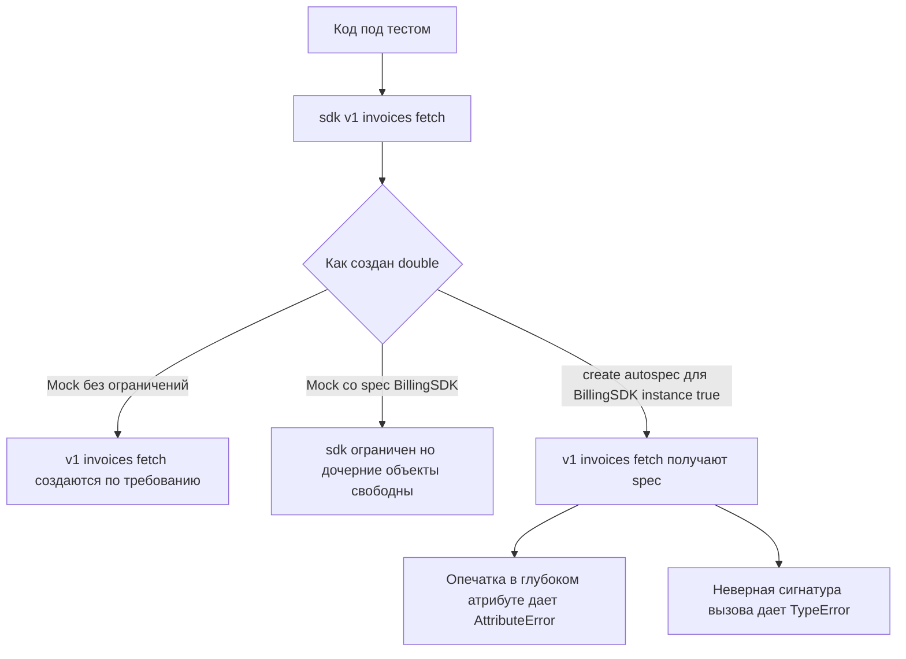

# Когда зависимость уходит в глубину: где `autospec` действительно спасает тесты

Самая неприятная ошибка в моках начинается не на первом вызове, а после первой точки. Пока у Вас один `client.send()`, интерфейс ещё можно держать в голове. Но когда код уходит в цепочку вроде `sdk.v1.invoices.fetch(...)` или `gateway.session.transport.request(...)`, обычный `Mock` слишком легко соглашается на любой сценарий. Официальная документация `unittest.mock` прямо описывает обе стороны этой истории: plain mock создаёт атрибуты на лету, а auto-speccing создаёт mock-объекты с теми же атрибутами и методами, что и заменяемый объект, и проверяет сигнатуры функций, методов и конструкторов. ([Python documentation][1])

## Введение

Изучив `spec` и `spec_set` Вы уже увидели первый уровень защиты: mock можно ограничить интерфейсом реального объекта. Но официальная документация отдельно подчёркивает, что этого часто недостаточно. `spec` действует только на сам mock, а не решает автоматически проблему дочерних методов и более глубоких веток API. Для этой задачи и нужны `autospec=True` в `patch()` или функция `create_autospec()`. Они не просто запрещают лишние имена, а делают спецификацию рекурсивной и переносят на mock реальные сигнатуры вызова. ([Python documentation][1])

Это особенно важно для двух классов объектов. Первый — глубокие зависимости: SDK, клиенты, фасады, фабрики, прокси, где рабочий код обращается не к одному коллаборатору, а к дереву связанных объектов. Второй — динамические объекты, у которых часть интерфейса появляется в `__init__()`, живёт в свойствах или хранится в placeholder-полях вроде `member = None`. Документация `unittest.mock` специально оговаривает обе зоны: auto-speccing делается лениво и потому годится даже для очень сложных и глубоко вложенных объектов, но не включён по умолчанию именно потому, что использует интроспекцию и имеет ограничения для дескрипторов и динамических instance-атрибутов. ([Python documentation][1])

В этой статье под динамическими объектами я буду понимать зависимости, у которых важная часть API видна не сразу на теле класса, а появляется во время инициализации или вычисляется через свойства. Под глубокими зависимостями — цепочки, где тестируемый код проходит через несколько уровней доступа. Это рабочее определение, но оно очень хорошо совпадает с тем, где `autospec` даёт максимальную пользу и где же начинает требовать осторожности. ([Python documentation][1])

## Где начинается ложнозелёный тест

Представьте учебный SDK для биллинга. Он простой, но показывает ровно ту проблему, которую plain mock любит маскировать.

```python
# vendor.py
class InvoicesAPI:
    def fetch(self, *, invoice_id: str, include_history: bool = False) -> dict:
        raise NotImplementedError


class V1API:
    invoices = InvoicesAPI()


class BillingSDK:
    v1 = V1API()


def export_invoice(invoice_id: str, sdk: BillingSDK) -> str:
    payload = sdk.v1.invoices.fetch(id=invoice_id)  # ошибка: должно быть invoice_id=
    return payload["status"]
```

А теперь тест без auto-speccing:

```python
import unittest
from unittest.mock import Mock

from vendor import BillingSDK, export_invoice


class TestExportInvoice(unittest.TestCase):
    def test_false_green_with_spec(self):
        sdk = Mock(spec=BillingSDK)
        sdk.v1.invoices.fetch.return_value = {"status": "ok"}

        result = export_invoice("inv-100", sdk)

        self.assertEqual(result, "ok")
        sdk.v1.invoices.fetch.assert_called_once_with(id="inv-100")
```

Такой тест выглядит правдоподобно, но он уже лжёт. На верхнем уровне `spec=BillingSDK` действительно работает: mock не даст обратиться к несуществующему атрибуту самого `sdk`. Но дальше начинается свободная жизнь дочерних моков. Документация `unittest.mock` прямо говорит, что `spec` применяется только к самому mock, а не решает автоматически проблему методов и атрибутов глубже по цепочке. Поэтому `sdk.v1`, `sdk.v1.invoices` и `sdk.v1.invoices.fetch` здесь слишком гибкие, чтобы поймать неверный keyword-аргумент `id`. ([Python documentation][1])

Именно отсюда рождаются ложнозелёные тесты на глубоких зависимостях. Код уже оторвался от реального контракта внешнего SDK, но test double продолжает соглашаться почти на всё. Чем длиннее цепочка после первой точки, тем выше шанс, что проблема спрячется не в имени верхнего объекта, а в глубоком методе, в его сигнатуре или в неверном переходе между под-объектами. ([Python documentation][1])



> Чем глубже дерево зависимости, тем опаснее ситуация, где mock «умеет больше», чем умеет реальный объект.

## Почему здесь нужен именно `autospec`

Официальная документация формулирует суть авто-спеков очень точно. `autospec=True` в `patch()` и `create_autospec()` создают mock-объекты с тем же API, что и оригинал. Причём это делается рекурсивно: атрибуты mock-объекта получают спецификацию соответствующих атрибутов оригинала. А функции и методы дополнительно проверяются по реальной сигнатуре вызова и выбрасывают `TypeError`, если вызваны неверно. Для классов это относится и к конструктору, и к mock-экземпляру в `return_value`. ([Python documentation][1])

Важна ещё одна деталь. Документация отдельно отмечает, что auto-speccing работает лениво: спецификация создаётся по мере доступа к атрибутам. Поэтому его можно применять даже к очень сложным или глубоко вложенным объектам — буквально к случаям вида «модуль импортирует модуль, который импортирует модуль» — без большого performance hit. Для нашей темы это ключевой аргумент: `autospec` особенно силён не на плоском API из одного метода, а как раз на длинных цепочках зависимостей. ([Python documentation][1])

## Сценарий 1. Деревья SDK и вложенные API

Теперь перепишем предыдущий тест так, чтобы он действительно проверял контракт.

```python
import unittest
from unittest.mock import create_autospec

from vendor import BillingSDK, export_invoice


class TestExportInvoice(unittest.TestCase):
    def test_autospec_catches_wrong_signature(self):
        sdk = create_autospec(BillingSDK, instance=True)
        sdk.v1.invoices.fetch.return_value = {"status": "ok"}

        with self.assertRaises(TypeError):
            export_invoice("inv-100", sdk)
```

Почему это работает? Потому что `create_autospec()` строит mock по другому объекту как по спецификации, а атрибуты на mock используют соответствующие атрибуты исходного объекта как spec. Для функций и методов аргументы проверяются по реальной сигнатуре. Документация также уточняет, что если в качестве spec используется класс, то с `instance=True` Вы получаете mock, который ведёт себя как экземпляр этого класса, а не как mock самого класса. Именно это и нужно для dependency injection в сервисном слое. ([Python documentation][1])

На этом примере хорошо видно, где `autospec` особенно полезен. Глубокая цепочка `sdk.v1.invoices.fetch` остаётся глубокой, բայց уже перестаёт быть бесформенной. Если Вы ошибётесь в имени одного из промежуточных атрибутов, получите `AttributeError`. Если ошибётесь в сигнатуре конечного метода, получите `TypeError`. Если API внешнего SDK изменится при рефакторинге, шанс оставить зелёный, но бессмысленный тест резко снижается. ([Python documentation][1])

Именно поэтому auto-speccing особенно хорош для SDK-клиентов, облачных библиотек, ORM-фасадов и любых модульных деревьев вида `client.users.permissions.list(...)`. Там слишком много точек, в которых plain mock может silently согласиться с неверным контрактом.

## Сценарий 2. Класс, который код создаёт сам

Вторая зона, где `autospec` особенно полезен, — классы, которые тестируемый код инстанцирует сам. В таких местах у Вас две потенциальные ошибки сразу: неправильный вызов конструктора и неправильный вызов методов созданного экземпляра.

```python
# processor.py
from gateway import PaymentGateway


def capture_invoice(invoice_id: str) -> str:
    gateway = PaymentGateway(api_key="secret", timeout=1.0)
    return gateway.capture(id=invoice_id)  # ошибка: должно быть invoice_id=
```

Тест с `patch()`:

```python
import unittest
from unittest.mock import patch

import processor


class TestCaptureInvoice(unittest.TestCase):
    @patch("processor.PaymentGateway", autospec=True)
    def test_autospec_checks_constructor_and_instance_methods(self, MockGateway):
        with self.assertRaises(TypeError):
            processor.capture_invoice("inv-100")
```

Документация `patch()` прямо указывает, что при `autospec=True` mock создаётся со спецификацией заменяемого объекта, а все его атрибуты тоже получают спецификацию соответствующих атрибутов оригинала. Для классов это особенно важно: `return_value` созданного mock-класса, то есть mock-экземпляр, получает ту же спецификацию, что и реальный класс. Поэтому `autospec` здесь одновременно защищает и вызов `PaymentGateway(...)`, и вызов `gateway.capture(...)`. ([Python documentation][1])

Это делает `autospec=True` почти обязательным там, где код сам создаёт внешних клиентов, фабрики, адаптеры и менеджеры соединений. Иначе patch подменит класс слишком мягким `MagicMock`, который примет и неверный `__init__`, и неправильный метод экземпляра.

## Сценарий 3. Методы класса, где важно не потерять `self`

Есть и более тонкий сценарий. Иногда тесту нужно патчить не объект целиком, а unbound method — метод на классе, а не на экземпляре. Для такого случая документация `unittest.mock-examples` отдельно показывает, что обычный mock здесь неудобен: если подменить unbound method plain mock-объектом, он не станет bound method при доступе через экземпляр, и `self` не будет передан первым аргументом. С `autospec=True` patch делает подмену через реальный function object с той же сигнатурой, который делегирует работу внутреннему mock-объекту. Благодаря этому `self` снова ведёт себя правильно. ([Python documentation][2])

```python
import unittest
from unittest.mock import patch


class Repository:
    def save(self, invoice_id: str) -> None:
        raise NotImplementedError


class TestRepository(unittest.TestCase):
    def test_patch_unbound_method_with_autospec(self):
        with patch.object(Repository, "save", autospec=True) as mock_save:
            repo = Repository()
            repo.save("inv-100")

        mock_save.assert_called_once_with(repo, "inv-100")
```

На первый взгляд это частный случай. На практике — нет. В orchestration-коде, сервисных фасадах и хуках жизненного цикла класса именно такие patch-и часто нужны для проверки того, какой экземпляр вызвал метод. И здесь `autospec` полезен уже не только как защита сигнатуры, но и как способ сохранить нормальную модель bound method. ([Python documentation][2])

## Что здесь считать динамическим объектом

В контексте этой темы динамический объект — это зависимость, чья важная часть API не лежит прямо на теле класса как обычный видимый атрибут. Документация `unittest.mock` выделяет два особенно неприятных случая. Первый — свойства и дескрипторы, которые могут запускать код при доступе. Второй — instance-атрибуты, создаваемые только в `__init__()`, которых не видно на классе заранее. Именно поэтому auto-speccing не является поведением по умолчанию: чтобы понять, какие атрибуты доступны, ему приходится интроспектировать исходный объект, а при переходе по атрибутам mock-а под капотом происходит соответствующий переход по атрибутам оригинала. ([Python documentation][1])

Для глубоких зависимостей это двусторонняя история. С одной стороны, именно благодаря такому ленивому рекурсивному обходу `autospec` и умеет защищать длинные цепочки API. С другой — та же интроспекция делает его чувствительным к объектам, где доступ к атрибуту не безвреден. Если property открывает соединение, читает файл, дёргает сеть или запускает сторонний код, auto-speccing может стать проблемой уже на этапе построения спецификации. Документация не просто предупреждает об этом, а прямо советует проектировать объекты так, чтобы интроспекция была безопасной. ([Python documentation][1])

## Где `autospec` упирается в динамику

Самая важная ловушка — instance-атрибуты, которые появляются только в `__init__()`. Документация показывает это на простом примере: если класс создаёт `self.a` в конструкторе, то при `patch(..., autospec=True)` mock-класс не видит этот атрибут автоматически, и обращение к нему приводит к `AttributeError`. Причина проста: при вызове patched class не создаётся реальный экземпляр; under the hood работают только `dir()` и attribute lookups, а не реальное выполнение `__init__()`. ([Python documentation][1])

```python
from unittest.mock import patch


class Session:
    def __init__(self):
        self.token = "abc"


with patch("__main__.Session", autospec=True):
    session = Session()
    session.token  # AttributeError
```

Это важный урок для динамических SDK и session-объектов. Если под-клиенты, токены, конфигурация транспорта или runtime-factory появляются только в конструкторе, autospec их сам не «додумает». И чем глубже Ваш код уходит в такие runtime-атрибуты, тем раньше Вы упрётесь в ограничение. ([Python documentation][1])

Есть и следующий слой сложности. Документация отдельно показывает более строгий режим `autospec=True, spec_set=True`: он не только не даёт получить несуществующий атрибут, но и запрещает устанавливать его вручную. Это полезно, если Вы хотите убедиться, что код не присваивает зависимости чужие поля. Но для динамических объектов это одновременно означает, что самый простой обход — «дописать недостающий runtime-атрибут на mock после создания» — уже перестаёт работать. ([Python documentation][1])

```python
with patch("__main__.Session", autospec=True, spec_set=True):
    session = Session()
    session.token = "abc"  # AttributeError
```

Есть ещё одна особенно коварная зона: члены, инициализированные как `None`. Документация `unittest.mock` прямо говорит, что `None` бесполезен как spec, поэтому autospec не строит строгую спецификацию для членов, заданных как `None`; такие атрибуты становятся обычными `MagicMock`. Для глубоких зависимостей это означает очень неприятную дыру: поле вроде `transport = None` может превратиться в бесконечно гибкий дочерний mock, и глубина цепочки снова начнёт скрывать ошибки. ([Python documentation][1])

```python
from unittest.mock import create_autospec


class ApiClient:
    transport = None


client = create_autospec(ApiClient, instance=True)

# Ниже снова начинается слишком свободная зона:
client.transport.session.request(path="/ping")
```

Такой объект уже не даёт той защиты, на которую Вы рассчитывали. Верхняя поверхность `ApiClient` ограничена, но ветка ниже `transport` снова становится очень мягкой. Именно поэтому dynamic placeholders и глубокие цепочки — опасное сочетание.

## Как приручить динамику, не выключая защиту

Официальная документация предлагает несколько вполне практических способов обхода. Самый прямой — задать нужный runtime-атрибут на mock после создания. Это работает, пока Вы не включили `spec_set=True`. Более устойчивый путь — дать таким атрибутам class-level defaults, чтобы они были видимы уже на этапе интроспекции. Документация прямо называет этот путь, по сути, лучшим решением для instance-атрибутов, которые просто получают значения по умолчанию в `__init__()`. ([Python documentation][1])

Если менять production-класс нельзя или не хочется, docs предлагают ещё два варианта: использовать уже созданный экземпляр как spec вместо класса или передать альтернативный объект в `autospec`, например тестовый подкласс с добавленными defaults. Для `patch()` это поддерживается напрямую: вместо `autospec=True` можно передать `autospec=some_object` и тем самым использовать другой объект как спецификацию. Это очень полезно для динамических клиентов и глубоких зависимостей, где production-класс слишком «пустой» на уровне class body, но Вы можете собрать для теста безопасный surrogate-spec. ([Python documentation][1])

Вот короткий пример такого подхода:

```python
from unittest.mock import patch


class Session:
    def __init__(self):
        self.token = "abc"


class SessionForTest(Session):
    token = "abc"


with patch("__main__.Session", autospec=SessionForTest) as MockSession:
    session = MockSession.return_value
    session.token
```

Это хороший компромисс. Вы не отказываетесь от auto-speccing, но делаете спецификацию видимой и безопасной для интроспекции. Для больших тестовых наборов такой ход обычно лучше, чем возвращаться к plain `Mock()`.

Ниже — короткая карта выбора. Это уже не цитата из документации, а практическая сводка того, что из неё следует.

| Ситуация                                      | Что plain mock прячет                                              | Что даёт `autospec`                                                       | Что проверить отдельно                                         |
| --------------------------------------------- | ------------------------------------------------------------------ | ------------------------------------------------------------------------- | -------------------------------------------------------------- |
| Дерево SDK вроде `sdk.v1.invoices.fetch(...)` | опечатки и неверные kwargs глубоко в цепочке                       | рекурсивный spec и проверку сигнатур                                      | содержательные assertions на результат и побочные эффекты      |
| Класс, который код создаёт сам                | неверный `__init__` и неверные вызовы методов экземпляра           | сигнатуру конструктора и spec на `return_value`                           | настройку `return_value` и бизнес-ветвление                    |
| Патч unbound method                           | потерю `self`                                                      | функцию-подмену с корректным binding                                      | правильный объект-вызвавший метод                              |
| Instance-атрибуты из `__init__()`             | слишком свободный mock или, наоборот, неожиданный `AttributeError` | строгую видимую поверхность, но только если она доступна для интроспекции | class defaults, alternative spec или явную настройку атрибутов |
| Поля вида `member = None`                     | ложное ощущение строгости                                          | верхнеуровневый spec, но не строгую глубину под этим полем                | явную замену `None` на безопасный spec-объект                  |

Эта таблица следует из того, как документация описывает рекурсивное поведение autospec, его ленивую природу и его ограничения на динамических атрибутах и `None`-членах. ([Python documentation][1])

## Практический паттерн для реального сервиса

В обычном сервисном коде рабочий паттерн обычно выглядит так. Если зависимость приходит в конструктор, делайте `create_autospec(Dependency, instance=True)`. Если код сам lookup-ит или создаёт зависимость внутри модуля, используйте `patch(..., autospec=True)`. Если объект динамический и критичные атрибуты рождаются только в `__init__()`, не бросайтесь отключать autospec: сначала проверьте, можно ли сделать class defaults, использовать test-subclass как alternative spec или передать уже безопасный instance-object в качестве spec. Это не отдельные «хитрости», а прямое продолжение documented API: `create_autospec()` строит mock из объекта-спеки и проверяет сигнатуры, `patch(..., autospec=True)` делает то же для patched target, а `autospec=some_object` позволяет использовать альтернативный spec-объект. ([Python documentation][1])

Здесь важно не перепутать цель. `autospec` особенно полезен там, где глубина зависимости делает ручную внимательность ненадёжной. Но он не обязан лечить плохой дизайн объектов. Если модель строит API из side-effect properties, если важные children всегда стартуют с `None`, если настоящий интерфейс появляется только после тяжёлой инициализации, autospec, скорее всего, лишь покажет эту проблему раньше и жёстче. И это полезно: хороший unit-тест должен не закрывать архитектурные трещины мягким mock-ом, а выявлять, где контракт объекта слишком скрыт от теста. ([Python documentation][1])

## Заключение

`autospec` становится особенно ценным не на плоских тестах из одного вызова, а там, где зависимость уходит в глубину. В длинных цепочках вроде `client.api.v1.users.fetch(...)` plain `Mock` слишком легко создаёт нужный мир «по требованию». `spec` делает первый шаг и ограничивает верхний уровень, но именно auto-speccing переносит спецификацию на дочерние объекты и добавляет проверку сигнатур методов, конструкторов и callable-объектов. Поэтому на глубоких зависимостях он не просто полезен, а часто обязателен. ([Python documentation][1])

Но у этой силы есть цена. `autospec` должен интроспектировать исходный объект. Поэтому свойства и дескрипторы с побочными эффектами могут мешать, instance-атрибуты из `__init__()` не видны автоматически, а поля со значением `None` остаются мягкими участками, где глубина снова может скрыть ошибку. Официальная документация не скрывает этих ограничений и предлагает конкретные пути: задавать class defaults, использовать alternative spec object, а в некоторых случаях — строить spec от экземпляра, а не от класса. ([Python documentation][1])

Если свести всю тему к одной практической формуле, она будет такой: **чем глубже дерево зависимости, тем нужнее `autospec`; чем больше в объекте runtime-магии, тем внимательнее надо выбирать, от чего именно строить spec**. Это не компромисс между «удобством» и «строгостью». Это обычная инженерная работа по тому, чтобы зелёный тест снова начал означать то, что должен означать: контракт действительно соблюдён.

## Дополнительные материалы

Официальная документация `unittest.mock`: разделы `Autospeccing`, `patch()`, `patch.object()`, `create_autospec()`. ([Python documentation][1])

Практические примеры `unittest.mock`: раздел `Mocking Unbound Methods` и общие примеры работы с patched class instances. ([Python documentation][2])

Раздел документации, где разобраны caveats auto-speccing: ленивое speccing, безопасная интроспекция, instance-атрибуты из `__init__()`, поля со значением `None`, alternative spec object. ([Python documentation][1])

Исходный код `unittest.mock` в CPython — полезен, если хотите посмотреть реализацию patchers и auto-speccing в стандартной библиотеке. ([github.com][3])

[1]: https://docs.python.org/3/library/unittest.mock.html "https://docs.python.org/3/library/unittest.mock.html"
[2]: https://docs.python.org/3/library/unittest.mock-examples.html "https://docs.python.org/3/library/unittest.mock-examples.html"
[3]: https://github.com/python/cpython/blob/main/Lib/unittest/mock.py "https://github.com/python/cpython/blob/main/Lib/unittest/mock.py"
