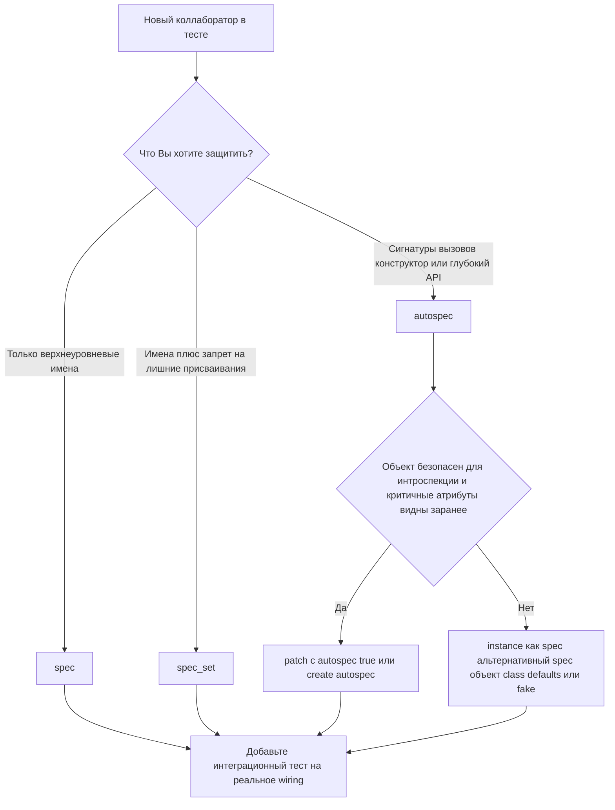

# Когда строгий mock начинает мешать: как выбрать между `spec`, `spec_set` и `autospec` без фанатизма

Очень легко впасть в одну из двух крайностей. Первая — писать тесты на «голых» `Mock()` и потом удивляться, почему код уже сломан, а тесты всё ещё зелёные. Вторая — включить `autospec=True` везде, где только можно, и через неделю обнаружить, что теперь половина времени уходит на борьбу не с багами, а с динамическими атрибутами, свойствами и сложной инициализацией. Официальная документация Python прямо показывает обе стороны: auto-speccing делает mock ближе к реальному контракту, но он не включён по умолчанию именно потому, что у него есть caveats and limitations, связанные с интроспекцией и динамическими объектами. ([Python documentation][1])

## Введение

С точки зрения стандартной библиотеки различия между этими инструментами очень конкретны. `spec` ограничивает mock интерфейсом реального объекта или списком имён: если атрибута нет в спецификации, попытка обратиться к нему даст `AttributeError`. Если `spec` построен от реального объекта, `__class__` у mock будет возвращать класс объекта-спеки, так что `isinstance()` тоже начнёт работать ожидаемо. `spec_set` — более строгая форма: он запрещает не только получать, но и устанавливать атрибуты, которых нет в спецификации. ([Python documentation][1])

`autospec` идёт дальше. По документации `patch(..., autospec=True)` и `create_autospec()` создают mock-объекты с теми же атрибутами и методами, что и заменяемый объект, а функции, методы и конструкторы получают ту же сигнатуру вызова, что и оригинал. Для классов это относится и к `__init__`, и к mock-экземпляру, который живёт в `return_value`. А `create_autospec(..., instance=True)` позволяет использовать класс как спецификацию именно для instance-like mock-а, если зависимость передаётся в код уже как готовый объект. ([Python documentation][1])

Именно здесь появляется правильная постановка задачи. `spec` защищает верхний уровень интерфейса. `spec_set` запрещает коду ещё и «долепливать» объекту новые поля. `autospec` нужен там, где важно не только имя метода, но и **форма его использования**: правильные keyword-аргументы, обязательные параметры, сигнатура конструктора и поведение глубоко вложенного API. Всё это — разные уровни строгости, а не разные вкусовые предпочтения. ([Python documentation][1])

## Почему проблема вообще возникает

Корень проблемы в самой природе `Mock`. Официальная документация прямо пишет: обычный `Mock` — гибкий объект, который создаёт новые child mocks по мере доступа к атрибутам. Один и тот же атрибут при повторном доступе возвращает тот же mock, и это делает библиотеку очень удобной для быстрого старта. Но у этой удобности есть цена: mock слишком легко начинает «уметь» то, чего реальный объект не умеет. ([Python documentation][1])

Небольшой пример:

```python
from unittest.mock import Mock


class MailerClient:
    def send(self, recipient: str, text: str) -> None:
        raise NotImplementedError


class NotificationService:
    def __init__(self, mailer):
        self.mailer = mailer

    def notify(self, recipient: str, text: str) -> None:
        # после рефакторинга в коде остался старый вызов
        self.mailer.send_email(recipient, text)


mailer = Mock()
service = NotificationService(mailer)

service.notify("user@example.com", "Привет")
mailer.send_email.assert_called_once_with("user@example.com", "Привет")
```

Такой тест может пройти, хотя реальный `MailerClient` никакого `send_email()` больше не содержит. Проблема не в том, что `Mock` «сломался». Проблема в том, что по умолчанию он честно создаёт недостающие атрибуты на лету. Документация `unittest.mock` отдельно предупреждает: после рефакторинга кода тесты на моках могут продолжать проходить, даже если продакшен-код всё ещё использует старый API. Она же прямо напоминает, что одних unit-тестов в изоляции недостаточно: без интеграционных проверок остаётся много места для ошибок в wiring между частями системы. ([Python documentation][1])

> Строгий mock нужен не для красоты. Он нужен там, где зелёный тест должен означать: «контракт действительно соблюдён», а не «mock был достаточно вежлив».

## Что строгие спеки действительно дают

Начнём с позитивной стороны. Есть классы тестов, где строгий mock почти всегда окупается. Первый случай — внешний контракт: платёжный шлюз, почтовый клиент, репозиторий, SDK, HTTP-обёртка, объект-конфигурация. Во всех этих местах Вы не хотите, чтобы тест silently разрешал старое имя метода, лишний keyword-аргумент или неверный вызов конструктора. Именно здесь `spec`, `spec_set` и особенно `autospec` уменьшают число ложнозелёных тестов. По документации, `autospec` специально создан для того, чтобы mock «падал так же, как production code», если использовать его неправильно. ([Python documentation][1])

Посмотрите на простой пример с `create_autospec()`:

```python
from unittest.mock import create_autospec


class SmsClient:
    def send(self, phone: str, text: str, urgent: bool = False) -> None:
        raise NotImplementedError


class AlertService:
    def __init__(self, sms_client):
        self.sms_client = sms_client

    def alert(self, phone: str, text: str) -> None:
        # ошибка: неверные имена keyword-аргументов
        self.sms_client.send(number=phone, body=text)


sms_client = create_autospec(SmsClient, instance=True)
service = AlertService(sms_client)

service.alert("+79990000000", "Код")
```

Такой код уже не пройдёт тихо. `create_autospec()` создаёт mock по образцу реального объекта, а функции и методы на нём проверяют аргументы по реальной сигнатуре. В результате неправильный вызов `send(number=..., body=...)` ломается `TypeError`, а не маскируется под нормальный сценарий. Это именно тот класс ошибок, который plain `Mock()` и даже один `spec` ловят хуже. ([Python documentation][1])

Второй случай — глубоко вложенные зависимости. Официальная документация отдельно подчёркивает, что `spec` действует только на сам mock, а не автоматически решает проблему методов и дочерних атрибутов на глубине. После этого она прямо говорит: auto-speccing решает эту проблему, а за счёт ленивого построения спецификации его можно применять даже к очень сложным или deeply nested objects без большого штрафа по производительности. Это как раз и делает `autospec` особенно полезным для SDK-деревьев, фасадов и клиентов с длинной цепочкой вызовов. ([Python documentation][1])

```python
from unittest.mock import create_autospec


class UsersAPI:
    def fetch(self, *, user_id: str) -> dict:
        raise NotImplementedError


class APIv1:
    users = UsersAPI()


class Client:
    v1 = APIv1()


def export_user(user_id: str, client: Client) -> str:
    payload = client.v1.users.fetch(id=user_id)  # ошибка
    return payload["status"]


client = create_autospec(Client, instance=True)
client.v1.users.fetch.return_value = {"status": "ok"}

export_user("u-100", client)
```

Здесь ценность `autospec` максимальна. Чем длиннее цепочка `client.v1.users.fetch(...)`, тем выше шанс, что ошибка прячется не на верхнем уровне, а глубже: в имени промежуточного атрибута, в keyword-аргументе конечного метода, в сигнатуре под-API. Plain mock в таких местах слишком легко достраивает мир под тест. `autospec` начинает этот мир ограничивать. ([Python documentation][1])

Третий случай — классы, которые код инстанцирует сам. Документация `patch()` отдельно указывает: если патч заменяет класс, то его `return_value` — это mock-экземпляр, а при `autospec=True` этот экземпляр получает ту же спецификацию, что и класс. Практически это означает, что Вы защищаете и конструктор, и методы созданного объекта одной строкой `@patch("module.Client", autospec=True)`. Это очень полезно для тестов сервисного слоя, где код создаёт внешнего клиента внутри функции. ([Python documentation][1])

Наконец, есть специальный случай с unbound methods. В официальных примерах `unittest.mock-examples` показано, что `autospec=True` особенно удобен при patching метода на классе: он создаёт реальный function object с той же сигнатурой, и при доступе через экземпляр такой метод становится bound method и получает `self`. Без `autospec=True` обычный `Mock` этого не делает. Это тонкий, но очень полезный сценарий, если Вам важно проверить, какой именно экземпляр вызвал метод. ([Python documentation][2])

## Где спеки начинают мешать

Вот здесь и начинается наш тема по-настоящему. Проблема не в том, что strict mocks плохие. Проблема в том, что они усиливают не только защиту, но и трение. Если выбранная Вами строгость заставляет тест повторно моделировать внутреннюю механику объекта, а не защищает внешний контракт, это уже сигнал подумать о границе теста.

### Динамические атрибуты из `__init__()`

Самое частое столкновение — instance-атрибуты, создаваемые в конструкторе. Документация `unittest.mock` прямо предупреждает: `autospec` не может знать о dynamically created attributes, если их нет на классе. Он ограничивает API видимыми атрибутами, а значит, попытка обратиться к `self.a`, созданному только в `__init__()`, даст `AttributeError`. ([Python documentation][1])

```python
from unittest.mock import patch


class Session:
    def __init__(self):
        self.token = "abc"

    def request(self, path: str) -> dict:
        raise NotImplementedError


with patch("__main__.Session", autospec=True):
    session = Session()
    session.token
```

На первый взгляд это может казаться «перестраховкой библиотеки». Но логика здесь честная: patched class не создаёт настоящий экземпляр, он лишь смотрит на доступную поверхность класса через атрибуты и `dir()`. Документация отдельно подчёркивает это в примечании: вызов мокированного класса не создаёт реальный instance, под капотом происходят только attribute lookups и вызовы `dir()`. Поэтому runtime-состояние, рождающееся только в `__init__()`, `autospec` сам не восстанавливает. ([Python documentation][1])

Именно в этот момент strict mock может начать мешать. Если тесту для нормальной работы нужно «вручную объяснить» mock-объекту половину runtime-состояния реального класса, у Вас два варианта. Либо это всё ещё оправданная цена за защиту важного контракта. Либо тест начал слишком хорошо знать внутренности объекта, и границу изоляции лучше пересмотреть.

### `spec_set` как чрезмерная строгость

Документация предлагает простой обход для предыдущей проблемы: если Вы используете `autospec=True` без `spec_set=True`, нужный runtime-атрибут можно установить на mock после создания вручную. Это не идеально, но иногда достаточно. Однако тут же она показывает и обратную сторону: более агрессивная комбинация `autospec=True, spec_set=True` уже запрещает такую установку. То есть `spec_set` полезен, если Вы хотите гарантировать, что код устанавливает только допустимые атрибуты, но он же ломает сценарии, где легитимный runtime-атрибут не виден на классе заранее. ([Python documentation][1])

```python
from unittest.mock import patch


class Session:
    def __init__(self):
        self.token = "abc"


with patch("__main__.Session", autospec=True, spec_set=True):
    session = Session()
    session.token = "abc"  # AttributeError
```

Это очень показательный конфликт. С одной стороны, `spec_set` защищает от скрытого дрейфа интерфейса и от «самодельных» полей, которых у реального объекта нет. С другой — он может сделать тест неудобным ровно там, где объект по дизайну хранит важное состояние только на уровне экземпляра. В таком случае проблема уже не в том, что `spec_set` «слишком строгий», а в том, что strictness наложена на объект, чья видимая class-level поверхность слишком бедна для этой строгости. ([Python documentation][1])

### Свойства и дескрипторы с побочными эффектами

Следующая зона трения ещё опаснее. По документации, `autospec` не является поведением по умолчанию именно потому, что должен интроспектировать объект: по мере traversal атрибутов на mock под капотом идёт соответствующий traversal оригинального объекта. И если у Вас есть properties или descriptors, которые запускают код при доступе, Вы можете вообще не суметь использовать `autospec` безопасно. Документация говорит об этом прямо и сразу добавляет важную инженерную мысль: объекты лучше проектировать так, чтобы интроспекция была безопасной. ([Python documentation][1])

Представьте такой объект:

```python
class Settings:
    @property
    def token(self) -> str:
        return load_token_from_vault()  # дорого, небезопасно, с побочными эффектами
```

Если strict mock начинает дёргать подобную property просто ради построения спецификации, проблема уже не локальна для теста. Она показывает, что интерфейс объекта сам по себе неудобен для безопасной интроспекции. В такой ситуации «включить autospec везде» — плохая стратегия. Здесь логичнее либо упростить дизайн объекта, либо использовать более узкую точку замены, либо строить альтернативный spec-объект, у которого эта поверхность безопасна.

### `None`-поля и ложное чувство безопасности

Есть ещё одна ловушка, которую легко не заметить. Документация отдельно разбирает случай, когда class member по умолчанию равен `None`, а позже в реальной жизни туда кладётся объект другого типа. Для auto-speccing `None` бесполезен как spec, поэтому он не использует спецификацию для таких членов; они остаются обычными mocks — фактически мягкими участками внутри строгого дерева. Это особенно неприятно на глубоких зависимостях. ([Python documentation][1])

```python
from unittest.mock import create_autospec


class ApiClient:
    transport = None


client = create_autospec(ApiClient, instance=True)

client.transport.session.request(path="/ping")
```

На верхнем уровне у Вас будто бы строгий autospecced client. Но ветка ниже `transport` уже снова слишком свободна. И чем глубже код уходит под такой placeholder, тем сильнее у теста появляется ложное ощущение защищённости: кажется, что включён `autospec`, значит, всё надёжно. На деле целый поддерево API может снова превратиться в обычный `MagicMock`. Именно поэтому strict mocks мешают не только своей строгостью, но и тем, что иногда создают иллюзию строгости там, где её уже нет. ([Python documentation][1])

### Когда тест начинает знать внутренности лучше, чем production-код

Это уже не отдельный пункт документации, а практический вывод из неё. Если для прохождения одного unit-теста Вам приходится добавлять class defaults, руками выставлять runtime-атрибуты, строить альтернативный subclass только ради видимой поверхности API и отдельно обходить `None`-ветви, остановитесь на секунду. Возможно, strict mock здесь не помогает тестировать поведение, а заставляет тест заново моделировать внутреннее устройство объекта. В таком месте лучше спросить себя: **я вообще правильно выбрал объект для подмены?**

Документация косвенно подталкивает именно к такому выводу. Она советует делать интроспекцию безопасной, добавлять class defaults для instance-атрибутов, а также помнить, что даже при хорошем speccing всё равно нужны интеграционные тесты, потому что unit-тесты в изоляции не проверяют wiring системы целиком. Из этого логично следует инженерное правило: чем больше strict mock заставляет Вас заниматься устройством объекта, а не проверкой сценария, тем выше шанс, что здесь проще сработает либо реальный объект, либо небольшой fake, либо тест на более высокой границе. ([Python documentation][1])

## Как выйти из тупика, не выключая защиту

Хорошая новость в том, что документация не просто перечисляет проблемы, а даёт и рабочие обходы. Первый и самый прямой — добавить class attributes как значения по умолчанию для instance members, которые Вы всё равно инициализируете в `__init__()`. В документации это названо, по сути, лучшим способом решить проблему с динамическими атрибутами. ([Python documentation][1])

```python
class Session:
    token = "abc"

    def __init__(self):
        self.token = "abc"

    def request(self, path: str) -> dict:
        raise NotImplementedError
```

Такой код не только лучше ведёт себя с auto-speccing, но и яснее показывает форму объекта на уровне класса. Для тестов это большой плюс: mock видит ожидаемую поверхность, а Вам не нужно каждый раз вручную «доучивать» его нужным полям. Это не означает, что нужно превращать любой класс в витрину из class attributes. Но если поля реально имеют безопасные значения по умолчанию, такой ход часто оправдан. ([Python documentation][1])

Второй путь — использовать не класс, а экземпляр как spec. Документация прямо говорит: если менять production-класс не хочется, можно использовать instance object вместо класса как spec, либо создать тестовый subclass и передать его как альтернативный объект в `autospec`. Это особенно полезно для динамических клиентов, у которых после `__init__()` появляется богатая и уже безопасная поверхность. ([Python documentation][1])

```python
from unittest.mock import create_autospec


class Session:
    def __init__(self):
        self.token = "abc"

    def request(self, path: str) -> dict:
        raise NotImplementedError


real_session = Session()
mock_session = create_autospec(real_session, spec_set=True)
```

В этом варианте спецификация строится уже от инициализированного объекта, а не от «пустого» класса. Это часто естественнее для теста, если код под тестом работает именно с готовой сессией, а не сам создаёт её из класса.

Третий путь — альтернативный spec-объект. Документация показывает, что в `patch()` можно передать не просто `autospec=True`, а `autospec=some_object`. Это позволяет использовать test-only subclass с нужными default-атрибутами, не меняя production-класс напрямую. ([Python documentation][1])

```python
from unittest.mock import patch


class Session:
    def __init__(self):
        self.token = "abc"


class SessionForTest(Session):
    token = "abc"


with patch("module.Session", autospec=SessionForTest) as MockSession:
    session = MockSession.return_value
    session.token
```

Такой подход особенно хорош там, где production-код менять не хочется, но и отказываться от auto-speccing тоже не надо. По сути, Вы делаете видимым для интроспекции тот интерфейс, который в реальной жизни всё равно ожидаете.

Четвёртый путь — осознанно не ставить `spec_set=True`, если Ваша главная цель сейчас — поймать форму вызова и иерархию допустимых атрибутов, а не запретить каждое дополнительное присваивание. Документация прямо показывает, что без `spec_set` можно руками выставить runtime-атрибут после создания autospecced mock-а. Это не самый изящный путь, но иногда он лучше, чем полное отключение strictness. ([Python documentation][1])

## Рабочая матрица выбора

Ниже — практическая матрица, которую удобно держать в голове при написании теста.

| Ситуация                                                         | Базовый выбор                                                | Почему не строже                                   |
| ---------------------------------------------------------------- | ------------------------------------------------------------ | -------------------------------------------------- |
| Нужно защититься от несуществующих имён у внешнего коллаборатора | `spec`                                                       | Часто достаточно верхнеуровневого контракта        |
| Нужно ещё и запретить коду дописывать несуществующие поля        | `spec_set`                                                   | Полезно для стабильных адаптеров и клиентов        |
| Важны сигнатуры методов, конструктора и глубокий API             | `autospec=True` или `create_autospec()`                      | Именно здесь plain mock чаще всего врёт            |
| Объект создаёт важные атрибуты только в `__init__()`             | instance as spec, alternative spec object или class defaults | Слепой `autospec` от класса станет слишком жёстким |
| В дереве есть поля вида `member = None`                          | не полагаться на глубину `autospec` автоматически            | Под такими полями снова появляются обычные mocks   |
| Тест приходится насыщать десятком runtime-атрибутов              | подумать о fake или реальном объекте                         | Вероятно, граница изоляции выбрана неудачно        |

Эта матрица — сжатие documented поведения `spec`, `spec_set`, `autospec`, а также официальных оговорок про интроспекцию, `__init__`-атрибуты, `None`-поля и альтернативный spec-объект. ([Python documentation][1])

## Как принять решение в живом тесте

Самый полезный вопрос здесь не «какой инструмент строже», а «что именно я сейчас охраняю». Если Вы охраняете **имена верхнеуровневого публичного API**, обычно хватает `spec`. Если Вы охраняете ещё и тот факт, что код не должен дописывать объекту произвольные поля, нужен `spec_set`. Если Вы охраняете **форму вызовов** — сигнатуры методов, keyword-аргументы, конструктор, глубоко вложенные ветви SDK — почти всегда нужен `autospec`. Всё это напрямую следует из поведения, описанного в официальной документации. ([Python documentation][1])

Проблема начинается тогда, когда объект сам по себе плохо подходит для безопасной интроспекции. Если у него свойства с побочными эффектами, критичные атрибуты создаются только в `__init__()`, а важные children стартуют с `None`, автоматическая строгость начинает работать против теста. В такой ситуации вопрос уже не в том, “нужен ли `autospec`”, а в том, **от какого объекта вообще строить спецификацию** и не лучше ли подменить уровень выше или ниже. Именно здесь полезны class defaults, spec от экземпляра, альтернативный spec-объект или маленький fake. ([Python documentation][1])



Смысл схемы в том, что строгость нельзя выбирать изолированно от конструкции объекта. Официальная документация сама подсказывает эту логику: `autospec` полезен для глубоких и сложных объектов, но не default из-за ограничений интроспекции; `spec_set` полезен, когда нужно запрещать лишние присваивания, но он же мешает, если важные поля рождаются динамически; а интеграционные тесты всё равно нужны, потому что unit-тесты в изоляции не проверяют всю связку компонентов. ([Python documentation][1])

## Практическая стратегия без крайностей

В живой работе удобно придерживаться простого порядка. Для внешнего клиента со стабильным публичным API начните с `create_autospec(..., instance=True)` или `patch(..., autospec=True)`, если код lookup-ит имя сам. Это даёт хорошую защиту от дрейфа интерфейса. Для простого коллаборатора с одним-двумя методами, где риск — это скорее опечатка имени, чем сигнатуры, часто достаточно `spec`. Для особенно чувствительных адаптеров, где код не должен навешивать новых полей, включайте `spec_set`. Но как только Вы упираетесь в runtime-атрибуты, `None`-placeholder-ветви и свойства с побочными эффектами, не наращивайте strictness механически. Сначала проверьте, не разумнее ли сменить spec-объект или границу теста. ([Python documentation][1])

Есть и ещё одно полезное инженерное правило. Если Вы пишете тест не для внешнего контракта, а для доменной логики, и вместо строгого mock-а можно без труда использовать реальный `dataclass`, маленький in-memory fake или простую ручную реализацию интерфейса, это часто делает тест понятнее. Такая рекомендация уже не является прямой цитатой документации, но она хорошо согласуется с её логикой: strict mocks нужны там, где Вы охраняете контракт зависимости; когда же тест вынужден слишком много знать про внутреннее устройство этой зависимости, чаще всего стоит упростить границу. Дополнительным страховочным слоем всё равно остаются интеграционные тесты, о необходимости которых docs напоминают отдельно. ([Python documentation][1])

## Заключение

Строгие спеки не стоит ни абсолютизировать, ни бояться. `spec`, `spec_set` и `autospec` — это не иерархия “от слабого к сильному ради самого усиления”, а набор инструментов под разные риски. `spec` хорош, когда нужно не дать тесту пользоваться несуществующими именами. `spec_set` хорош, когда важно ещё и запретить несанкционированные присваивания. `autospec` особенно полезен там, где ошибка прячется в сигнатурах вызовов, конструкторах и глубоко вложенных API. Но ровно поэтому он и не default: он требует безопасной интроспекции, плохо переносит часть динамических объектов и может создавать трение там, где важное состояние живёт только на экземпляре или за `None`-placeholder-ветвями. ([Python documentation][1])

Хорошее практическое решение обычно выглядит так: начинайте не с вопроса «насколько строгим сделать mock», а с вопроса «какой именно контракт я хочу защитить этим тестом». Если ответ — внешний стабильный интерфейс, смело ужесточайте double. Если ответ начинает звучать как длинный рассказ о внутреннем runtime-состоянии объекта, значит, strict mock уже не помогает, а сигнализирует о неудачной границе теста. И, как напоминает официальная документация, помните про второй слой защиты: даже самый аккуратный autospec не отменяет интеграционные тесты на реальное соединение частей системы. ([Python documentation][1])

## Дополнительные материалы

Официальная документация `unittest.mock`: `Mock`, `spec`, `spec_set`, `patch`, `patch.object`, `create_autospec`, раздел `Autospeccing`. ([Python documentation][1])

Практические примеры `unittest.mock`: `Mocking Classes`, `Mock for Method Calls on an Object`, `Mocking Unbound Methods`. ([Python documentation][2])

Исходный код `Lib/unittest/mock.py` в CPython — полезен, если хотите посмотреть, как реализованы `_mock_add_spec`, работа со `spec_set` и внутренняя механика autospec. ([GitHub][3])

Исходник примеров `unittest.mock-examples` в CPython — удобен для чтения примеров в первоисточнике. ([GitHub][4])

[1]: https://docs.python.org/3/library/unittest.mock.html "unittest.mock — mock object library — Python 3.14.3 documentation"
[2]: https://docs.python.org/3/library/unittest.mock-examples.html "unittest.mock — getting started — Python 3.14.3 documentation"
[3]: https://github.com/python/cpython/blob/main/Lib/unittest/mock.py "cpython/Lib/unittest/mock.py at main · python/cpython · GitHub"
[4]: https://github.com/python/cpython/blob/main/Doc/library/unittest.mock-examples.rst?plain=1 "cpython/Doc/library/unittest.mock-examples.rst at main · python/cpython · GitHub"
