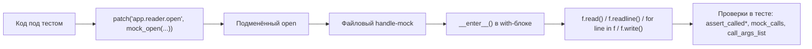

# Файл, которого нет: как тестировать чтение и запись через `mock_open()` и `patch()` без реальной файловой системы

Вы пишете обычную функцию: она открывает файл, читает пару строк, сохраняет отчёт или подмешивает конфиг. Логика простая. Но как только приходит время писать unit-тест, в кадре появляются временные каталоги, очистка артефактов, случайные падения на CI и споры о кодировке. В этот момент важно отделить предмет теста от инфраструктуры. Если Вы проверяете не файловую систему, а собственную логику вокруг `open()`, реальный диск чаще мешает, чем помогает.

Для таких сценариев в стандартной библиотеке Python есть связка `patch()` и `mock_open()`. `patch()` временно подменяет объект в нужном namespace, а `mock_open()` создаёт mock, который имитирует `open()` и файловый дескриптор, в том числе в конструкции `with ... as ...`. Это не “волшебный диск в памяти”, а контролируемая подмена точки входа в файловую систему. Именно поэтому она так полезна в unit-тестах. ([Python documentation][1])

## Введение

В этом материале разберём не только “как заставить тест пройти”, но и как сделать его точным. Сначала Вы увидите ментальную модель `mock_open()`, затем — типовые сценарии чтения и записи, после этого — главный нюанс с namespace, из-за которого подмена часто “не срабатывает”. В финале разберём чтение нескольких файлов, симуляцию ошибок и границы применимости этого инструмента. Опорой будет официальная документация Python и примеры `unittest.mock`, а не неформальные рецепты из блогов. ([Python documentation][1])

## Почему `open()` — это граница системы

У unit-теста узкая задача: проверить поведение Вашего кода при известных входных данных. Реальный файл добавляет в этот сценарий лишние переменные. Нужно создать каталог, положить туда данные, не забыть очистить его после теста и надеяться, что на другой платформе всё поведёт себя так же. Иногда это оправдано. Но если функция должна всего лишь “прочитать текст и вернуть результат парсинга” или “записать строку в файл”, такой тест начинает проверять уже две вещи сразу: и Вашу логику, и работу файловой системы.

`mock_open()` нужен именно для того, чтобы разрезать этот узел. Официальная документация описывает его как helper для замены `open()`. Он работает как для прямого вызова `open()`, так и для использования через context manager. А `patch()` ограничивает действие подмены рамками декорированной функции или блока `with` и автоматически снимает её после выхода, даже если внутри было исключение. Для unit-теста это почти идеальная связка: Вы локально подменили границу системы, проверили логику, вышли из блока — и окружение вернулось в исходное состояние. ([Python documentation][1])

## Что именно делает `mock_open()`

Есть одна мысль, без которой дальше будет сложно: `mock_open()` не создаёт файл. Он создаёт mock для `open()` и mock файлового объекта, который возвращается из `open()`. Если Вы читаете через `read()`, `readline()` или `readlines()`, данные берутся из `read_data`. В актуальной документации отдельно отмечено, что чтение через эти методы расходует `read_data`, а новый вызов mock’а снова начинает чтение с начала. Также `mock_open()` поддерживает итерацию по файлу, например цикл `for line in f`. Если helper уже не хватает, документация прямо говорит: mock у него упрощённый, для более реалистичной модели поведение придётся настраивать вручную или переходить к более реалистичной файловой подмене. ([Python documentation][1])



Эта схема кажется простой, но она снимает большую часть путаницы. Вы не тестируете “файл на диске”. Вы тестируете две вещи: как код вызывает `open(...)`, и что он делает с объектом, который получает из `open(...)`. Именно поэтому в хороших тестах почти всегда есть отдельная проверка аргументов `open()` и отдельная проверка чтения или записи на handle. ([Python documentation][1])

> `mock_open()` полезен тогда, когда предмет теста — не сама файловая система, а Ваш код вокруг неё. Чем раньше Вы проведёте эту границу, тем точнее будут тесты. ([Python documentation][1])

## Сценарий 1. Чтение файла: минимальный тест без диска

Начнём с самого частого случая. Допустим, функция читает имя пользователя из текстового файла.

```python
# app/reader.py
def load_username(path: str) -> str:
    with open(path, "r", encoding="utf-8") as f:
        return f.read().strip()
```

Тест можно написать так:

```python
import unittest
from unittest.mock import mock_open, patch

from app.reader import load_username


class TestLoadUsername(unittest.TestCase):
    def test_reads_username_from_file(self):
        with patch("app.reader.open", mock_open(read_data="alice\n")) as mocked_open:
            username = load_username("user.txt")

        self.assertEqual(username, "alice")
        mocked_open.assert_called_once_with("user.txt", "r", encoding="utf-8")
```

Здесь есть два важных слоя. Первый — `mock_open(read_data="alice\n")`: helper готовит подмену `open()` и файлового объекта так, чтобы `f.read()` вернул заданный текст. Второй — `assert_called_once_with(...)`: Вы проверяете не только результат функции, но и сам контракт обращения к файлу: путь, режим и кодировку. В документации `mock_open()` отдельно показаны оба паттерна — и чтение через `read_data`, и проверка вызова `open()` через `assert_called_once_with()`. ([Python documentation][1])

Это та точка, где начинающие часто делают тест слишком слабым. Они проверяют только `self.assertEqual(username, "alice")` и забывают проверить аргументы `open(...)`. Тогда функция может внезапно начать открывать файл в другом режиме, без кодировки или вообще по неверному пути, а тест всё равно останется зелёным. Mock удобен тем, что позволяет ловить такие регрессии без отдельного интеграционного окружения. ([Python documentation][1])

### Чтение построчно тоже поддерживается

Многие думают, что `mock_open()` подходит только для `read()`. Это не так. В актуальной документации прямо указано, что он поддерживает `readline()`, `readlines()` и итерацию по файлу. Значит, можно писать тесты и для кода, который идёт по строкам. ([Python documentation][1])

```python
# app/reader.py
def load_ids(path: str) -> list[int]:
    with open(path, "r", encoding="utf-8") as f:
        return [int(line.strip()) for line in f if line.strip()]
```

```python
import unittest
from unittest.mock import mock_open, patch

from app.reader import load_ids


class TestLoadIds(unittest.TestCase):
    def test_reads_ids_line_by_line(self):
        data = "10\n20\n\n30\n"

        with patch("app.reader.open", mock_open(read_data=data)):
            result = load_ids("ids.txt")

        self.assertEqual(result, [10, 20, 30])
```

Этот пример полезен сразу по двум причинам. Во-первых, он показывает, что `mock_open()` годится не только для `f.read()`. Во-вторых, он помогает держать тест на уровне поведения: Вас интересует, что функция вернула список ID, а не то, как именно она организовала чтение внутри тела цикла. Подробности чтения Вы проверяете только тогда, когда это действительно часть контракта. ([Python documentation][1])

## Сценарий 2. Запись файла: проверяем не наличие файла, а вызовы

Теперь перейдём к записи. Допустим, функция должна сохранить отчёт.

```python
# app/writer.py
def save_report(path: str, content: str) -> None:
    with open(path, "w", encoding="utf-8") as f:
        f.write(content)
```

Тест:

```python
import unittest
from unittest.mock import call, mock_open, patch

from app.writer import save_report


class TestSaveReport(unittest.TestCase):
    def test_writes_report(self):
        with patch("app.writer.open", mock_open()) as mocked_open:
            save_report("report.txt", "done\n")

        mocked_open.assert_called_once_with("report.txt", "w", encoding="utf-8")

        handle = mocked_open()
        handle.write.assert_called_once_with("done\n")

        self.assertEqual(
            mocked_open.mock_calls,
            [
                call("report.txt", "w", encoding="utf-8"),
                call().__enter__(),
                call().write("done\n"),
                call().__exit__(None, None, None),
            ],
        )
```

В документации `mock_open()` показан этот паттерн почти буквально: сначала проверяется вызов `open()`, затем через handle проверяется `write(...)`. Важная деталь в том, что `mock_open()` уже знает про context manager и избавляет Вас от ручной настройки `__enter__` и `__exit__`, которая на голом `MagicMock` обычно получается шумной. А если хочется увидеть весь маршрут выполнения целиком, можно смотреть в `mock_calls`: по документации этот список хранит вызовы самого mock, его методов, magic methods и mock’ов, возвращённых как `return_value`. Именно поэтому там появляются `__enter__()` и `__exit__()`. ([Python documentation][1])

Такой тест сильнее проверки “создался ли файл”. Он отвечает сразу на три вопроса. Был ли вызван `open()` с правильными аргументами? Был ли вызван `write()`? В каком порядке шли шаги внутри `with`? Для unit-теста этого обычно достаточно. Сам факт наличия файла на диске лучше проверять уже в отдельном интеграционном тесте, если он вообще нужен. ([Python documentation][1])

## Главный нюанс: патчить нужно место lookup, а не “что-то похожее”

Это самый частый источник ложных падений и ложного спокойствия. Документация `patch()` подчёркивает правило очень жёстко: подменять нужно объект там, где система под тестом его ищет, а не там, где объект когда-то был определён. В разделе `Where to patch` это разобрано на примерах с импортами. Для файлов это означает, что вопрос “патчить `builtins.open` или `app.reader.open`?” не имеет универсального ответа. Правильный ответ зависит от того, где и как код реально делает lookup имени. ([Python documentation][1])

Если функция находится в модуле `app.reader` и использует обычный `open(...)`, то в учебных и прикладных тестах удобно патчить `app.reader.open`. Это соответствует правилу “patch where looked up”. Более того, документация отдельно отмечает, что при патче builtins внутри модуля `create=True` добавляется автоматически. Именно поэтому `patch("app.reader.open", ...)` работает, даже если в самом модуле нет явного присваивания `open = ...`. ([Python documentation][1])

При этом в официальных примерах Вы увидите и `patch("builtins.open", ...)`. Это не противоречие. Просто там подмена делается в таком месте, где lookup действительно идёт через `builtins.open`, либо пример намеренно упрощён. Документация по примерам прямо показывает `patch("builtins.open", ...)` и одновременно напоминает, что для любого `patch()` решающим остаётся namespace, в котором имя используется. Поэтому полезно запомнить не строку-магнит “всегда патчить builtins”, а правило: патчите то имя, на которое смотрит Ваш код в момент исполнения. ([Python documentation][2])

Из этого же правила следует важный практический вывод для `pathlib`. Если код вызывает не `open()`, а `Path.open()`, патчить нужно уже не builtins, а тот объект, через который происходит lookup метода. Например, если в модуле написано `from pathlib import Path`, то обычно подмена будет идти через `app.reader.Path.open`. Это уже вывод из общего правила `Where to patch`, а не отдельный “секретный рецепт”. ([Python documentation][1])

## Сценарий 3. Одна функция читает несколько файлов

Обычный `mock_open(read_data="...")` отлично работает, пока все вызовы `open()` должны возвращать одно и то же содержимое. Но реальный код нередко открывает несколько файлов подряд. Для такого случая в официальных примерах `unittest.mock` есть отдельный рецепт: использовать `side_effect`, чтобы на каждый вызов `open()` возвращался новый mock с собственным `read_data`. ([Python documentation][2])

```python
# app/loader.py
def read_many(paths: list[str]) -> dict[str, str]:
    result = {}
    for path in paths:
        with open(path, "r", encoding="utf-8") as f:
            result[path] = f.read()
    return result
```

```python
import unittest
from unittest.mock import call, mock_open, patch

from app.loader import read_many


class TestReadMany(unittest.TestCase):
    def test_returns_content_for_each_file(self):
        data = {
            "a.txt": "A",
            "b.txt": "B",
        }

        def open_side_effect(name, mode="r", encoding=None):
            return mock_open(read_data=data[name])()

        with patch("app.loader.open", side_effect=open_side_effect) as mocked_open:
            result = read_many(["a.txt", "b.txt"])

        self.assertEqual(result, {"a.txt": "A", "b.txt": "B"})
        self.assertEqual(
            mocked_open.call_args_list,
            [
                call("a.txt", "r", encoding="utf-8"),
                call("b.txt", "r", encoding="utf-8"),
            ],
        )
```

Почему нельзя просто дать один `mock_open(read_data="...")` и успокоиться? Потому что документация описывает его поведение как упрощённое: новый вызов mock’а снова стартует чтение с начала `read_data`. Это удобно для простого теста одного файла, но не помогает различать содержимое нескольких файлов. В таких случаях и нужен `side_effect`, который по аргументам `open(...)` создаёт новый handle с нужными данными. В примерах Python этот подход показан именно на словаре “имя файла → содержимое”. ([Python documentation][1])

Отдельно полезно обратить внимание на `call_args_list`. Документация описывает его как список всех вызовов mock’а по порядку. Для сценариев с несколькими файлами это почти обязательная проверка: результат функции может оказаться корректным случайно, а вот список вызовов сразу показывает, в каком порядке и с какими аргументами открывались файлы. ([Python documentation][1])

## Сценарий 4. Ошибки файловой системы без файловой системы

Хороший unit-тест проверяет не только “счастливый путь”. Файлы не всегда существуют, права могут отсутствовать, а чтение и запись могут завершаться исключениями. Для этого у `Mock` есть `side_effect`: по документации он может быть исключением, функцией или итерируемым объектом. Если поставить в `side_effect` исключение, вызов mock’а будет его выбрасывать. Это даёт очень удобный способ моделировать ошибки `open()` без единого реального файла. ([Python documentation][1])

```python
# app/config.py
def load_optional(path: str) -> str:
    try:
        with open(path, "r", encoding="utf-8") as f:
            return f.read()
    except FileNotFoundError:
        return ""
```

```python
import unittest
from unittest.mock import patch

from app.config import load_optional


class TestLoadOptional(unittest.TestCase):
    def test_returns_empty_string_when_file_is_missing(self):
        with patch("app.config.open", side_effect=FileNotFoundError):
            value = load_optional("missing.txt")

        self.assertEqual(value, "")
```

Этот тест важен методически. Он не проверяет ОС, права доступа или существование файла. Он проверяет только реакцию Вашей функции на `FileNotFoundError`. То есть ровно то, что и должен проверять unit-тест. Точно так же можно симулировать `PermissionError`, `OSError` или исключение на уровне `read()` или `write()`, если предмет теста — обработка этих веток. Механика будет той же: `side_effect` у нужного mock-объекта. ([Python documentation][1])

## Где `mock_open()` перестаёт быть хорошим решением

Здесь проходит важная граница. Официальная документация прямо предупреждает, что mock, создаваемый `mock_open()`, довольно упрощённый. Там же сказано, что если контроля над данными недостаточно, mock нужно донастраивать самому, а если нужна более реалистичная файловая модель, можно использовать in-memory filesystem packages. Это хорошая подсказка: `mock_open()` не пытается воспроизвести всю файловую систему. Его задача уже и скромнее. ([Python documentation][1])

Из этого следует практическое правило. Если Вы тестируете “какой путь передали в `open()`”, “что считали из файла”, “что записали в `write()`” или “как обработали `FileNotFoundError`”, `mock_open()` подходит отлично. Но если предмет теста — реальная работа с путями, различие текстового и бинарного режимов на конкретной версии рантайма, поведение временных каталогов, взаимодействие с кодировками на уровне ОС или сценарии, где нужно увидеть настоящий файловый побочный эффект, лучше брать либо временные файлы, либо более реалистичную подмену. Иначе unit-тест начнёт давать ложное ощущение покрытия. ([Python documentation][1])

> Хороший вопрос к себе перед тестом звучит так: “Я проверяю свою логику вокруг файла или я действительно проверяю файловую систему?” Если второе, `mock_open()` уже не лучший инструмент. ([Python documentation][1])

## Рабочий шаблон, который стоит запомнить

Когда в коде встречается `with open(...) as f:`, полезно идти по одной и той же короткой схеме.

Сначала выберите правильную точку патча: не “где определён `open`”, а где Ваш код его ищет. Затем подайте в `mock_open(read_data=...)` те данные, на которых должна работать логика. После выполнения функции отдельно проверьте результат, отдельно — вызов `open(...)`, и отдельно — вызовы на файловом handle, если они важны для контракта. Когда функция открывает несколько файлов или должна падать по разным сценариям, подключайте `side_effect` и историю вызовов через `call_args_list` или `mock_calls`. Все эти элементы прямо поддерживаются стандартным API `unittest.mock`. ([Python documentation][1])

Именно эта схема отличает точный тест от декоративного. Декоративный тест говорит: “Функция что-то вернула”. Точный тест говорит: “Функция открыла нужный файл, в нужном режиме, обработала содержимое ожидаемым способом и корректно отреагировала на исключение”. Для unit-теста вокруг файлов этого обычно достаточно. ([Python documentation][1])

## Заключение

`mock_open()` и `patch()` закрывают очень конкретную учебную и инженерную задачу: позволяют тестировать код, который работает с файлами, не превращая unit-тест в упражнение на управление реальной файловой системой. `mock_open()` подменяет `open()` и файловый handle, `patch()` ограничивает область действия этой подмены, а `side_effect`, `call_args_list` и `mock_calls` помогают сделать проверки точными, а не номинальными. Ключевая мысль всей темы проста: не мокируйте “диск вообще”, мокируйте точку взаимодействия Вашего кода с диском — и проверяйте контракт этого взаимодействия. ([Python documentation][1])

## Дополнительные материалы

- Официальная документация `unittest.mock`: разделы `mock_open`, `patch`, `Where to patch`, `call_args_list`, `mock_calls`, `side_effect`. ([Python documentation][1])
- Официальные примеры `unittest.mock`: раздел `Using side_effect to return per file content`. ([Python documentation][2])
- Исходный код стандартной библиотеки CPython: `Lib/unittest/mock.py`. Полезен, если хотите понять механику patchers и helper’ов глубже. ([GitHub][3])

[1]: https://docs.python.org/3/library/unittest.mock.html "https://docs.python.org/3/library/unittest.mock.html"
[2]: https://docs.python.org/3/library/unittest.mock-examples.html "https://docs.python.org/3/library/unittest.mock-examples.html"
[3]: https://github.com/python/cpython/blob/main/Lib/unittest/mock.py "https://github.com/python/cpython/blob/main/Lib/unittest/mock.py"
