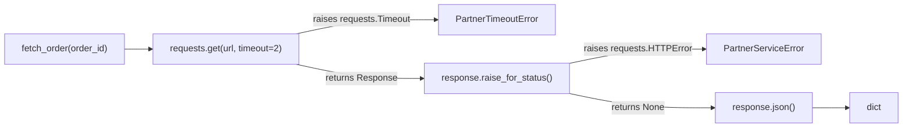

# Запрос ушёл в сеть, тест остался дома: как моделировать успех, таймаут и HTTP 500 в `unittest.mock`

Один из самых хрупких unit-тестов — это тест, который незаметно ходит в реальный интернет. Он может проходить на ноутбуке, падать на CI, зависать без таймаута и скрывать ошибку за случайным ответом внешнего сервиса. В теме HTTP-моков проблема почти всегда одна и та же: в тесте моделируют не ту точку отказа, которая существует в реальном клиенте.

Для `requests` это принципиально важно. Успешный запрос даёт объект `Response`. Таймаут возникает как исключение во время вызова запроса. Ошибка HTTP 4xx/5xx не обязана падать сама по себе: библиотека возвращает `Response`, а `HTTPError` появляется, когда код вызывает `raise_for_status()`. При этом `requests.get()` возвращает `Response`, `Timeout` выбрасывается отдельно, `raise_for_status()` поднимает `HTTPError` на неуспешных статусах, а без явного `timeout` библиотека вообще не ограничивает ожидание по времени. ([requests.readthedocs.io][1])

В `unittest.mock` для этих сценариев у Вас есть две главные ручки. `return_value` задаёт объект, который вернёт вызов mock’а. `side_effect` позволяет сделать вызов “живым”: вернуть разные значения по входным параметрам, выбросить исключение или отдать последовательность значений и ошибок по вызовам. Документация Python отдельно подчёркивает, что `side_effect` может быть функцией, исключением или итерируемым объектом, а `return_value` — это именно то, что возвращается при вызове mock’а. ([Python documentation][2])

## Введение

Сначала зафиксируем базовую модель. Она короткая, но именно на ней строятся все хорошие тесты вокруг сети. ([Python documentation][2])

| Сценарий                          | Что происходит в реальном коде с `requests`                                                     | Что настраивать в тесте                                              |
| --------------------------------- | ----------------------------------------------------------------------------------------------- | -------------------------------------------------------------------- |
| Успех, `200 OK`                   | `requests.get()` возвращает `Response`, `raise_for_status()` возвращает `None`                  | `mocked_get.return_value`                                            |
| Таймаут                           | `requests.get()` выбрасывает `requests.Timeout`                                                 | `mocked_get.side_effect`                                             |
| HTTP 500 при `raise_for_status()` | `requests.get()` возвращает `Response`, а `response.raise_for_status()` выбрасывает `HTTPError` | `mocked_get.return_value` + `response.raise_for_status.side_effect`  |
| HTTP 500 без `raise_for_status()` | Код сам смотрит на `response.status_code` и, возможно, читает `response.json()`                 | `mocked_get.return_value.status_code` и `response.json.return_value` |

> Мокировать нужно не “плохой ответ вообще”, а то место, где этот ответ или эта ошибка действительно появляются в боевом клиенте.

## Код под тестом: минимальный HTTP-клиент без лишних деталей

Возьмём маленькую функцию, в которой уже есть всё нужное: запрос, явный `timeout`, преобразование `Timeout` в доменную ошибку, проверка статуса и чтение JSON.

```python
# app/partner.py
import requests


class PartnerTimeoutError(Exception):
    pass


class PartnerServiceError(Exception):
    pass


def fetch_order(order_id: int) -> dict:
    url = f"https://partner.example/api/orders/{order_id}"

    try:
        response = requests.get(url, timeout=2)
    except requests.Timeout as exc:
        raise PartnerTimeoutError("Partner API timed out") from exc

    try:
        response.raise_for_status()
    except requests.HTTPError as exc:
        raise PartnerServiceError(
            f"Partner API returned status {response.status_code}"
        ) from exc

    return response.json()
```

Эта функция отражает типовой production-паттерн. Она не доверяет сети, всегда передаёт `timeout`, отделяет сетевую проблему от плохого HTTP-статуса и только после этого парсит JSON. Такая последовательность согласуется с тем, как `requests` документирует `Timeout`, `raise_for_status()` и `Response.json()`: таймаут — это исключение при запросе, `raise_for_status()` поднимает `HTTPError` на неуспешных статусах, а успешный вызов `json()` сам по себе не доказывает, что HTTP-ответ был успешным. ([requests.readthedocs.io][3])



Теперь можно разобрать три главных сценария. Именно они чаще всего нужны в реальных unit-тестах вокруг HTTP-клиентов. ([requests.readthedocs.io][3])

## Сценарий 1. Успех: ответ 200 и полезный JSON

Когда запрос успешен, `requests.get()` возвращает объект `Response`. Значит, в тесте нужно настраивать не `side_effect`, а `return_value` patched-функции. А поскольку код дальше вызывает `response.raise_for_status()` и `response.json()`, настраивать нужно именно эти методы у объекта ответа. Это прямое следствие механики `Mock`: результат вызова mock’а живёт в `return_value`. ([Python documentation][2])

```python
import unittest
from unittest.mock import patch

from app.partner import fetch_order


class TestFetchOrder(unittest.TestCase):
    @patch("app.partner.requests.get")
    def test_returns_order_data_on_success(self, mocked_get):
        response = mocked_get.return_value
        response.raise_for_status.return_value = None
        response.json.return_value = {
            "id": 42,
            "status": "paid",
        }

        result = fetch_order(42)

        self.assertEqual(
            result,
            {"id": 42, "status": "paid"},
        )
        mocked_get.assert_called_once_with(
            "https://partner.example/api/orders/42",
            timeout=2,
        )
        response.raise_for_status.assert_called_once_with()
        response.json.assert_called_once_with()
```

В этом тесте важно не только конечное значение `result`. Важно и то, что запрос ушёл по правильному URL и с правильным `timeout`. Документация `requests` прямо предупреждает, что без явного `timeout` запросы не ограничиваются по времени и программа может зависнуть. Поэтому тест, который не проверяет аргумент `timeout`, легко пропускает опасный регресс. ([requests.readthedocs.io][3])

Отдельно обратите внимание на строку `@patch("app.partner.requests.get")`. `patch()` меняет объект в том namespace, где система под тестом его ищет. Документация формулирует это как “patch where it is looked up”: если функция использует `requests.get` из модуля `app.partner`, патчить нужно именно `app.partner.requests.get`, а не абстрактный глобальный `requests.get`. Сам `patch()` можно использовать как декоратор, class decorator или context manager, и после выхода из области действия подмена снимается автоматически. ([Python documentation][2])

## Сценарий 2. Таймаут: ошибка возникает на уровне вызова запроса

С таймаутом ситуация другая. В `requests` это не “плохой `Response`”, а исключение при самом вызове `requests.get(...)`. Более того, документация уточняет, что `timeout` — это не общий лимит на весь download, а ограничение на период отсутствия данных на сокете; если таймаут не задан явно, `requests` вообще не ограничивает ожидание. Для теста из этого следует простой вывод: таймаут моделируется через `side_effect` на patched-функции запроса, а не через `response.status_code`. ([requests.readthedocs.io][3])

```python
import requests
import unittest
from unittest.mock import patch

from app.partner import fetch_order, PartnerTimeoutError


class TestFetchOrderTimeout(unittest.TestCase):
    @patch("app.partner.requests.get")
    def test_converts_timeout_to_domain_error(self, mocked_get):
        mocked_get.side_effect = requests.Timeout()

        with self.assertRaises(PartnerTimeoutError):
            fetch_order(42)

        mocked_get.assert_called_once_with(
            "https://partner.example/api/orders/42",
            timeout=2,
        )
```

Такой тест точен по двум причинам. Во-первых, он моделирует реальную точку возникновения ошибки. Во-вторых, он не даёт функции незаметно потерять `timeout=2`. Это полезнее, чем кажется на первый взгляд: в коде вокруг сети именно исчезновение `timeout` нередко делает систему “почти рабочей”, но склонной к зависаниям на плохой сети. Официальный Quickstart `requests` буквально предупреждает об этом. ([requests.readthedocs.io][3])

Если Вам нужен более узкий сценарий, можно ставить не общий `requests.Timeout`, а `requests.ConnectTimeout` или `requests.ReadTimeout`. API-документация `requests` отмечает, что `Timeout` ловит оба вида, а `ConnectTimeout` описан как безопасный для ретрая сценарий. Это особенно полезно, когда в коде есть retry-логика и Вы хотите различать отказ на соединении и отказ на чтении. ([requests.readthedocs.io][1])

## Сценарий 3. HTTP 500: ответ пришёл, но он неуспешный

Здесь студенты ошибаются чаще всего. Они пишут `mocked_get.side_effect = requests.HTTPError(...)` и думают, что смоделировали `500`. Для голого `requests` это обычно неверно. Библиотека возвращает `Response` даже на 4xx/5xx, а `HTTPError` появляется, когда код вызывает `response.raise_for_status()`. То есть для функции `fetch_order()` ошибка `500` должна жить не на `requests.get`, а на `response.raise_for_status`. ([requests.readthedocs.io][3])

```python
import requests
import unittest
from unittest.mock import patch

from app.partner import fetch_order, PartnerServiceError


class TestFetchOrderHttp500(unittest.TestCase):
    @patch("app.partner.requests.get")
    def test_converts_http_500_to_domain_error(self, mocked_get):
        response = mocked_get.return_value
        response.status_code = 500
        response.raise_for_status.side_effect = requests.HTTPError("500 Server Error")

        with self.assertRaises(PartnerServiceError):
            fetch_order(42)

        mocked_get.assert_called_once_with(
            "https://partner.example/api/orders/42",
            timeout=2,
        )
        response.raise_for_status.assert_called_once_with()
        response.json.assert_not_called()
```

Это и есть точная симуляция `500` для кода, который опирается на `raise_for_status()`. Сеть отработала. Объект ответа существует. Исключение возникает позже, на этапе интерпретации HTTP-статуса. Именно поэтому `response.json()` в этом тесте вообще не должен вызываться: функция обрывает выполнение раньше. Такое поведение полностью соответствует документации `requests`: `raise_for_status()` поднимает `HTTPError` на неуспешных статусах, а на успешных возвращает `None`. ([requests.readthedocs.io][3])

### Когда `500` нужно разбирать вручную, а не через `raise_for_status()`

Но есть второй распространённый паттерн. Иногда код намеренно читает тело ошибки, потому что сервис возвращает полезный JSON даже при `500`. Официальный Quickstart `requests` отдельно предупреждает, что успешный `r.json()` не означает успешный HTTP-ответ: сервер вполне может вернуть JSON с ошибкой при статусе `500`, и этот JSON будет корректно декодирован. В такой ситуации `500` моделируется не через исключение, а через `status_code` и `json.return_value`. ([requests.readthedocs.io][3])

```python
# app/partner_verbose.py
import requests


class PartnerServiceError(Exception):
    pass


def fetch_order_verbose(order_id: int) -> dict:
    url = f"https://partner.example/api/orders/{order_id}"
    response = requests.get(url, timeout=2)

    if response.status_code >= 500:
        payload = response.json()
        raise PartnerServiceError(payload["detail"])

    response.raise_for_status()
    return response.json()
```

```python
import unittest
from unittest.mock import patch

from app.partner_verbose import fetch_order_verbose, PartnerServiceError


class TestFetchOrderVerbose(unittest.TestCase):
    @patch("app.partner_verbose.requests.get")
    def test_reads_json_error_body_on_http_500(self, mocked_get):
        response = mocked_get.return_value
        response.status_code = 500
        response.json.return_value = {
            "detail": "database unavailable",
        }

        with self.assertRaisesRegex(
            PartnerServiceError,
            "database unavailable",
        ):
            fetch_order_verbose(42)

        mocked_get.assert_called_once_with(
            "https://partner.example/api/orders/42",
            timeout=2,
        )
        response.json.assert_called_once_with()
        response.raise_for_status.assert_not_called()
```

Это хороший пример того, что один и тот же HTTP 500 в разных кодовых базах мокируется по-разному. Не потому что тесты “на вкус и цвет”, а потому что в первом случае код доверяет `raise_for_status()`, а во втором — сам анализирует `status_code` и тело ответа. Выбирайте точку mock’а не по названию статуса, а по реальному control flow Вашей функции. ([requests.readthedocs.io][3])

## Сценарий 4. Ретрай: сначала таймаут, потом успех

Как только в коде появляется повторная попытка, `side_effect` становится ещё полезнее. Документация `unittest.mock` позволяет передавать в `side_effect` итерируемый объект, где каждый следующий вызов берёт следующее значение. Причём элементами последовательности могут быть не только обычные return values, но и исключения. Это почти идеальный инструмент для моделирования последовательности “таймаут, потом успешный ответ”. ([Python documentation][2])

```python
# app/retrying_partner.py
import requests


class PartnerTimeoutError(Exception):
    pass


def fetch_order_with_retry(order_id: int, attempts: int = 2) -> dict:
    url = f"https://partner.example/api/orders/{order_id}"
    last_exc = None

    for _ in range(attempts):
        try:
            response = requests.get(url, timeout=2)
            response.raise_for_status()
            return response.json()
        except requests.Timeout as exc:
            last_exc = exc

    raise PartnerTimeoutError("Partner API timed out after retries") from last_exc
```

```python
import requests
import unittest
from unittest.mock import Mock, patch

from app.retrying_partner import fetch_order_with_retry


class TestFetchOrderWithRetry(unittest.TestCase):
    @patch("app.retrying_partner.requests.get")
    def test_retries_after_timeout_and_then_succeeds(self, mocked_get):
        ok_response = Mock()
        ok_response.raise_for_status.return_value = None
        ok_response.json.return_value = {"id": 42, "status": "paid"}

        mocked_get.side_effect = [
            requests.ConnectTimeout(),
            ok_response,
        ]

        result = fetch_order_with_retry(42, attempts=2)

        self.assertEqual(
            result,
            {"id": 42, "status": "paid"},
        )
        self.assertEqual(mocked_get.call_count, 2)
```

Этот тест ценен не только тем, что он зелёный. Он проверяет важную бизнес-логику: после первой ошибки функция действительно делает ещё одну попытку и возвращает результат второй. Здесь полезно помнить два факта из документации. `unittest.mock` разрешает `side_effect`-последовательности из исключений и значений, а `requests` описывает `ConnectTimeout` как отдельный вид таймаута и отмечает, что его ловит общий `Timeout`. Благодаря этому Вы можете моделировать ретрай очень близко к реальной сетевой модели, а не абстрактным “что-то упало, потом прошло”. ([Python documentation][2])

## Когда код использует `requests.Session`

В маленьких функциях обычно патчат `requests.get`. Но в прикладном коде часто встречается `requests.Session`, потому что Session даёт cookie persistence, connection pooling и общую конфигурацию клиента. Если Ваш код хранит session-объект как атрибут, точнее всего патчить именно этот объект, а не весь модуль `requests`. Для этого у `unittest.mock` есть `patch.object()`: он подменяет конкретный атрибут на конкретном объекте. ([requests.readthedocs.io][1])

```python
# app/client.py
import requests


class PartnerClient:
    def __init__(self):
        self.session = requests.Session()

    def fetch_order(self, order_id: int) -> dict:
        response = self.session.get(
            f"https://partner.example/api/orders/{order_id}",
            timeout=2,
        )
        response.raise_for_status()
        return response.json()
```

```python
import unittest
from unittest.mock import patch

from app.client import PartnerClient


class TestPartnerClient(unittest.TestCase):
    def test_fetch_order_uses_session(self):
        client = PartnerClient()

        with patch.object(client.session, "get") as mocked_get:
            response = mocked_get.return_value
            response.raise_for_status.return_value = None
            response.json.return_value = {"id": 42}

            result = client.fetch_order(42)

        self.assertEqual(result, {"id": 42})
        mocked_get.assert_called_once_with(
            "https://partner.example/api/orders/42",
            timeout=2,
        )
```

Если же `Session()` создаётся прямо внутри функции или конструктора, можно патчить сам класс `requests.Session` в модуле под тестом. В этом случае экземпляр клиента будет находиться в `MockSession.return_value`. Это уже та же модель, что и при мокировании классов: patched class заменяется mock’ом, а “созданный объект” живёт в `return_value`. Официальная документация `unittest.mock` описывает этот механизм отдельно и подчёркивает, что при подмене класса именно `return_value` представляет инстанс, который использует код под тестом. ([Python documentation][4])

## Типовые ошибки, из-за которых HTTP-тесты врут

### Ошибка 1. Патчить не тот namespace

Это базовая, но очень дорогая ошибка. Если функция использует `requests.get` внутри модуля `app.partner`, патч `requests.get` в другом месте может вообще не повлиять на код под тестом. Документация `patch()` формулирует правило прямо: подменяйте имя там, где оно lookup’ится системой под тестом. ([Python documentation][2])

### Ошибка 2. Моделировать HTTP 500 как исключение на `requests.get`

Если Ваш код написан поверх обычного `requests`, то `500` — это не таймаут и не отказ сокета. `requests.get()` возвращает `Response`, а `HTTPError` обычно появляется только после `raise_for_status()`. Поэтому `mocked_get.side_effect = requests.HTTPError(...)` уместен лишь тогда, когда Ваш собственный адаптер уже сам выбрасывает такое исключение на уровне запроса. Для прямой работы с `requests` это обычно не та точка отказа. ([requests.readthedocs.io][3])

### Ошибка 3. Не проверять, что в запрос действительно передали `timeout`

Это не косметика. Requests явно пишет, что без явного таймаута запросы не завершаются по времени автоматически и программа может зависнуть. Поэтому проверка `assert_called_once_with(..., timeout=2)` — это часть контракта, а не “лишняя строгость”. ([requests.readthedocs.io][3])

### Ошибка 4. Считать `response.json()` признаком успешного HTTP-ответа

В документации Quickstart есть важное уточнение: JSON может успешно распарситься и в ответе с ошибкой, например при HTTP 500. Поэтому тест, который проверяет только `json.return_value`, но не проверяет статус или вызов `raise_for_status()`, часто оказывается мягче, чем должен быть. ([requests.readthedocs.io][3])

### Ошибка 5. Ловить слишком широкий класс исключений и терять смысл ретрая

Requests документирует и общий `RequestException`, и более узкие классы вроде `Timeout`, `ConnectTimeout`, `ReadTimeout`, `ConnectionError` и `HTTPError`. Если код должен ретраить только таймауты, нет смысла ловить всё подряд. Слишком широкий `except requests.RequestException` легко смешивает транспортные проблемы и осмысленные HTTP-ошибки в одну ветку. ([requests.readthedocs.io][3])

## Как быстро выбрать между `return_value` и `side_effect`

Есть простое правило, которое удобно держать в голове, когда Вы пишете тест с нуля.

Если в боевом коде вызов функции должен **вернуть объект**, почти всегда работает `return_value`. Если вызов должен **упасть прямо в момент обращения**, нужен `side_effect`. Если ошибка возникает **не на самом запросе, а позже на методе ответа**, подменять нужно уже метод ответа, а не функцию запроса. Это правило не является “советом по стилю”; оно вытекает из того, как `Mock` возвращает `return_value`, как `side_effect` вызывает исключения и как `requests` разводит `Timeout`, `Response` и `HTTPError`. ([Python documentation][2])

Ниже — компактный чек-лист, который реально помогает перед запуском теста:

1. Спросите себя, где именно в реальном коде возникает проблема: на вызове `get()`, на `raise_for_status()`, на чтении `json()` или на разборе `status_code`.
2. Патчите тот объект, который код действительно использует, а не “что-то похожее” в другом модуле.
3. Проверяйте не только результат функции, но и параметры HTTP-вызова, особенно `timeout`.
4. Если есть ретрай, моделируйте последовательность вызовов через итерируемый `side_effect`, а не через несколько независимых тестов на один и тот же шаг. ([Python documentation][2])

## Заключение

Хороший HTTP unit-тест не имитирует интернет целиком. Он аккуратно подменяет конкретную границу системы и повторяет ту механику, по которой клиент ведёт себя в реальности. Для `requests` это означает очень ясное разделение: успех моделируется через `return_value` объекта ответа, таймаут — через `side_effect` на вызове запроса, а HTTP 500 — либо через `response.raise_for_status.side_effect`, либо через `status_code` и тело ответа, если код анализирует его вручную. ([Python documentation][2])

Если Вы удерживаете в голове эту модель, тесты становятся не только короче, но и честнее. Они перестают подыгрывать коду и начинают проверять именно тот контракт, который Вы закладываете в сетевой слой: куда ушёл запрос, был ли у него таймаут, как именно Вы реагируете на плохую сеть и где проходит граница между транспортной ошибкой и ошибочным HTTP-ответом. В теме мокирования сети это и есть главная кульминация: точность теста определяется не количеством моков, а правильным выбором точки подмены. ([Python documentation][2])

## Дополнительные материалы

Официальная документация `unittest.mock` — разделы `patch`, `patch.object`, `side_effect`, `return_value`, `Where to patch`. ([Python documentation][2])

Официальные примеры `unittest.mock` — разделы про `return_value`, цепочки вызовов и мокирование классов. Это особенно полезно, если Ваш HTTP-клиент создаёт `Session` или другой адаптер внутри конструктора. ([Python documentation][4])

Quickstart `requests` — разделы `JSON Response Content`, `Response Status Codes`, `Timeouts`, `Errors and Exceptions`. Там хорошо видно различие между `Response`, `HTTPError`, `Timeout` и тем, почему `json()` нельзя считать признаком успешного HTTP-ответа. ([requests.readthedocs.io][3])

API reference `requests` — разделы `Exceptions` и `Session`. Полезно, если Вы хотите разделять `Timeout`, `ConnectTimeout`, `ReadTimeout` и тестировать клиент, построенный на `Session`. ([requests.readthedocs.io][1])

`requests-mock` documentation. Этот инструмент полезен, когда обычных `patch()` и `Mock` уже мало и Вам нужен уровень выше: матчинги по URL, списки ответов, история запросов и выброс исключений как ответов. ([requests-mock.readthedocs.io][5])

`responses`. Библиотека ориентирована именно на mocking для `requests` и поддерживает декларативное описание ответов, матчинг запросов, проверку числа вызовов и сценарии валидации retry-механизма. ([GitHub][6])

`VCR.py`. Подходит для следующего шага после unit-тестов: он записывает реальные HTTP-взаимодействия в cassette-файлы и потом воспроизводит их без сетевого трафика, что даёт детерминизм и скорость в интеграционных тестах. ([vcrpy.readthedocs.io][7])

Если хотите, следующим сообщением я напишу в том же формате лонгрид для темы 10.4 про мокирование времени.

[1]: https://requests.readthedocs.io/en/latest/api/ "Developer Interface — Requests 2.33.0.dev1 documentation"
[2]: https://docs.python.org/3/library/unittest.mock.html "unittest.mock — mock object library — Python 3.14.3 documentation"
[3]: https://requests.readthedocs.io/en/latest/user/quickstart/ "Quickstart — Requests 2.33.0.dev1 documentation"
[4]: https://docs.python.org/3/library/unittest.mock-examples.html "https://docs.python.org/3/library/unittest.mock-examples.html"
[5]: https://requests-mock.readthedocs.io/ "Welcome to requests-mock’s documentation! — requests-mock 1.10.1.dev10 documentation"
[6]: https://github.com/getsentry/responses "GitHub - getsentry/responses: A utility for mocking out the Python Requests library. · GitHub"
[7]: https://vcrpy.readthedocs.io/ "VCR.py  — vcrpy 8.0.0 documentation"
