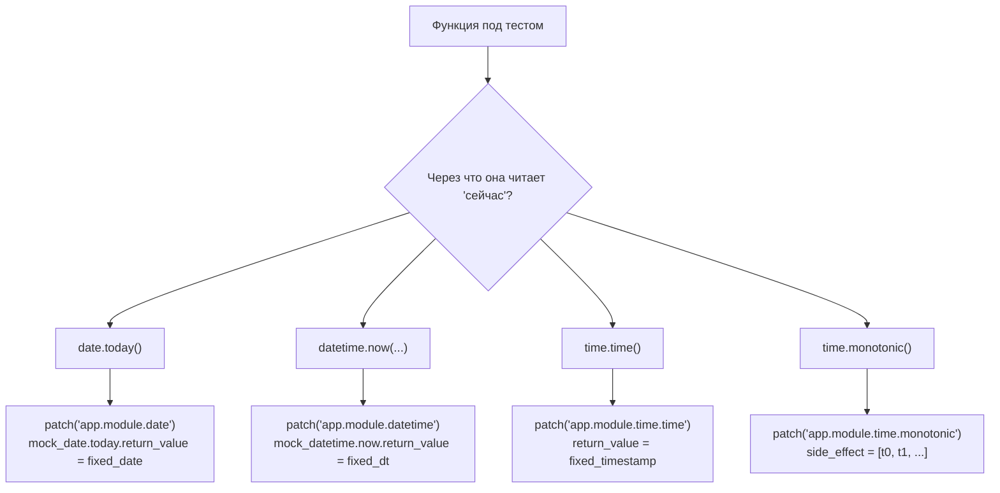

# Завтра уже наступило: как патчить текущую дату и время в `unittest`, чтобы тесты были детерминированными

Тесты на время ломаются особенно неприятно. Код не менялся, входные данные не менялись, а набор вдруг покраснел, потому что наступило другое число, сместился часовой пояс или системные часы подвинула синхронизация. В этот момент Вы понимаете простую вещь: тест проверял не только Вашу логику, но и календарь, часы и настройки среды.

В unit-тесте это почти всегда лишнее. Если предмет проверки — правило “истекло / не истекло”, “сегодня / не сегодня”, “укладываемся в таймаут / не укладываемся”, то источник текущего времени нужно брать под контроль так же, как сеть, файл или внешний клиент. Для этого в стандартной библиотеке есть `unittest.mock.patch()` и `patch.object()`: они временно подменяют нужный объект в нужном namespace, а после выхода из декоратора или `with`-блока автоматически возвращают всё обратно. ([Python documentation][1])

## Введение

У времени в Python нет одного универсального API “сейчас”. `date.today()` возвращает текущую локальную дату. `datetime.today()` возвращает локальные дату и время с `tzinfo=None`. `datetime.now(tz=None)` возвращает текущие дату и время, а если `tz` указан, переводит их в этот часовой пояс. `time.time()` возвращает секунды с эпохи Unix, а `time.monotonic()` даёт монотонные секунды для измерения интервалов и не зависит от перевода системных часов. Если подменить не тот источник времени, тест получится не просто хрупким — он начнёт проверять не ту программу. ([Python documentation][2])

Ниже — короткая карта, которая помогает не запутаться в первых решениях.

| Код под тестом читает        | Что это означает                      | Что обычно патчить                    |
| ---------------------------- | ------------------------------------- | ------------------------------------- |
| `date.today()`               | текущая локальная дата                | символ `date` в модуле под тестом     |
| `datetime.today()`           | текущие локальные дата и время, naive | символ `datetime` в модуле под тестом |
| `datetime.now(timezone.utc)` | текущий момент в UTC, aware           | символ `datetime` в модуле под тестом |
| `time.time()`                | POSIX/Unix timestamp                  | `time.time` в модуле под тестом       |
| `time.monotonic()`           | монотонный счётчик для интервалов     | `time.monotonic` в модуле под тестом  |

Семантика строк в этой таблице следует из документации `datetime` и `time`: `date.today()` эквивалентен `date.fromtimestamp(time.time())`, `datetime.today()` — это локальный naive `datetime`, `datetime.now(tz)` работает с часовым поясом, `time.time()` возвращает секунды с эпохи, а `time.monotonic()` не идёт назад и не зависит от обновления системных часов. ([Python documentation][2])

## Первое правило: патчить нужно не время “вообще”, а место, где код его читает

Это правило важнее любого синтаксиса. `patch()` работает так: он временно меняет объект, на который указывает имя. Из этого прямо следует, что подменять нужно имя, которое использует система под тестом, а не “настоящий объект где-то в стандартной библиотеке”. Документация формулирует это жёстко: patching нужно делать там, где объект looked up, а не обязательно там, где он определён. ([Python documentation][1])

Если модуль делает `from datetime import date`, патчить обычно нужно `app.module.date`. Если он делает `from datetime import datetime`, патчить нужно `app.module.datetime`. Если внутри модуля есть `import time`, а код вызывает `time.monotonic()`, подменять надо `app.module.time.monotonic`. То же касается `time.time()`. Здесь нет магии и нет “особых правил для времени”; это обычное правило `where to patch`, просто на временных API оно особенно часто нарушается. ([Python documentation][1])



Эта схема кажется очевидной только после того, как Вы к ней привыкнете. До этого очень хочется “поправить `datetime` глобально” или замокать `time.time()` в надежде, что это как-то повлияет на `date.today()`. Надёжная стратегия другая: сначала находите точку чтения времени в коде, потом патчите именно этот символ в модуле под тестом. ([Python documentation][1])

> Патчите не абстрактное “текущее время”, а тот конкретный символ, через который код под тестом получает значение “сейчас”.

## Сценарий 1. Фиксируем текущую дату: `date.today()` без хрупкости и без реального календаря

Начнём с самой простой и очень частой задачи. Есть код, который читает сегодняшнюю дату и строит из неё другой `date`-объект.

```python
# app/reports.py
from datetime import date


def month_opening_day() -> date:
    today = date.today()
    return date(today.year, today.month, 1)
```

Если написать к этому прямолинейный тест, он почти неизбежно начнёт зависеть от реального дня запуска. Иногда это выглядит безобидно: expected вычисляется от `date.today()` прямо в тесте. Но тогда тест либо дублирует алгоритм прод-кода, либо тоже начинает читать реальное “сегодня”, то есть делит хрупкость с функцией под тестом.

Официальные примеры `unittest.mock` разбирают именно такой случай. Документация показывает partial mocking для `datetime.date.today()`: вместо попытки “переписать” сам C-реализованный `date.today()` глобально предлагается замокать символ `date` в модуле под тестом, а конструктор `date(...)` пропускать в реальный класс через `side_effect`. Когда класс-мок вызывается, `side_effect` возвращает настоящий `date`; при этом `today()` можно зафиксировать на заранее известном значении. Документация отдельно подчёркивает, что патчить надо не `datetime.date` глобально, а `date` в модуле, который его использует, и замечает, что расчёт expected тем же алгоритмом, что и код под тестом, — классический анти-паттерн. ([Python documentation][3])

```python
import unittest
from datetime import date
from unittest.mock import patch

from app.reports import month_opening_day


class TestMonthOpeningDay(unittest.TestCase):
    def test_returns_first_day_of_current_month(self):
        with patch("app.reports.date") as mock_date:
            mock_date.today.return_value = date(2026, 3, 20)
            mock_date.side_effect = lambda *args, **kwargs: date(*args, **kwargs)

            result = month_opening_day()

        self.assertEqual(result, date(2026, 3, 1))
        mock_date.today.assert_called_once_with()
        mock_date.assert_called_once_with(2026, 3, 1)
```

Это один из самых полезных паттернов во всей теме. Он делает сразу три вещи. Во-первых, “замораживает” текущую дату. Во-вторых, сохраняет нормальную работу конструктора `date(...)`, чтобы код под тестом продолжал получать реальные объекты даты. В-третьих, позволяет проверить и сам вызов `today()`, и вызов конструктора. Всё это укладывается в общую механику `Mock`: `return_value` задаёт, что вернёт вызов mock’а или его метода, а `side_effect` может быть функцией, исключением или итерируемым объектом и срабатывает при вызове mock’а. ([Python documentation][3])

Здесь важно понять не только технику, но и методическую идею. Вы не обязаны заставлять тест “переживать тот же день, что и прод”. Наоборот, хороший тест выбирает день сознательно. Сегодня Вам нужен 20 марта, завтра — 1 января, а для граничного случая — 29 февраля високосного года. Как только Вы перестаёте зависеть от реального календаря, тесты становятся не только стабильнее, но и выразительнее: каждая дата в них перестаёт быть случайной. ([Python documentation][3])

## Сценарий 2. Фиксируем текущий момент: `datetime.now()` и aware UTC вместо `utcnow()`

С датой всё сравнительно просто. С датой и временем сложнее, потому что здесь быстро всплывает тема часовых поясов. Документация `datetime` делит объекты на naive и aware. Aware-объект представляет конкретный момент во времени; naive-объект не содержит достаточно информации, чтобы однозначно соотнести себя с UTC или локальной зоной. Для `datetime` документация также прямо говорит, что `datetime.now()` предпочтительнее `datetime.today()` и `datetime.utcnow()`, а `utcnow()` с Python 3.12 помечен как deprecated; рекомендуемый путь для текущего времени в UTC — вызывать `datetime.now(timezone.utc)` или, в новых версиях, использовать алиас `datetime.UTC`/`timezone.utc`. ([Python documentation][2])

Это меняет стиль кода и стиль теста. Если Ваш сервис работает с моментами истечения токенов, дедлайнами и TTL, лучше сразу писать aware UTC-время. Тогда и тест фиксирует не абстрактный naive `datetime`, а конкретный момент в UTC.

```python
# app/tokens.py
from datetime import datetime, timedelta, timezone


def token_deadline(ttl_seconds: int) -> datetime:
    return datetime.now(timezone.utc) + timedelta(seconds=ttl_seconds)
```

```python
import unittest
from datetime import datetime, timezone
from unittest.mock import patch

from app.tokens import token_deadline


class TestTokenDeadline(unittest.TestCase):
    def test_builds_deadline_from_fixed_utc_now(self):
        fixed_now = datetime(2026, 3, 20, 12, 0, 0, tzinfo=timezone.utc)

        with patch("app.tokens.datetime") as mock_datetime:
            mock_datetime.now.return_value = fixed_now
            result = token_deadline(30)

        self.assertEqual(
            result,
            datetime(2026, 3, 20, 12, 0, 30, tzinfo=timezone.utc),
        )
        mock_datetime.now.assert_called_once_with(timezone.utc)
```

Здесь конструкция уже проще, чем с `date`. Функция не создаёт новые `datetime(...)` вручную, а только вызывает `datetime.now(...)`. Значит, достаточно зафиксировать `mock_datetime.now.return_value`. Сам выбор `timezone.utc` здесь не декоративный. Документация предупреждает, что naive UTC-объекты нередко интерпретируются как локальное время разными методами `datetime`, поэтому предпочтительнее aware UTC. По этой же причине `utcnow()` теперь считается устаревающим API для нового кода. ([Python documentation][2])

Если же Ваш код в том же месте и читает `datetime.now(...)`, и вызывает конструктор `datetime(...)`, можно применить тот же partial mocking-подход, что и для `date`:

```python
with patch("app.tokens.datetime") as mock_datetime:
    mock_datetime.now.return_value = fixed_now
    mock_datetime.side_effect = lambda *args, **kwargs: datetime(*args, **kwargs)
```

Документация показывает этот паттерн на `date`, а general-механика `Mock` объясняет, почему он работает: вызов patched class идёт через mock, а `side_effect` позволяет вернуть реальный объект, сохранив контроль над отдельными методами вроде `now()`. Для `datetime` это не отдельная “спецтехника”, а прямое применение той же модели. ([Python documentation][3])

Есть ещё один неприятный нюанс, который стоит проговорить отдельно. Документация `datetime.now()` отмечает, что два последовательных вызова могут вернуть один и тот же момент, если этого требует точность underlying clock. Из этого следует практическое правило: если внутри теста Вам нужно, чтобы время явно двигалось, не рассчитывайте на естественный тик часов. Задайте последовательность значений сами. ([Python documentation][2])

## Сценарий 3. Внутри теста время должно идти: `side_effect` и последовательность значений

Для одного фиксированного “сейчас” хватает `return_value`. Но бывает другая задача: код читает часы несколько раз, и между вызовами время должно измениться. Здесь `side_effect` полезнее. Документация `Mock` говорит об этом прямо: `side_effect` может быть итерируемым объектом, и тогда каждый вызов mock’а будет брать следующее значение из последовательности. ([Python documentation][1])

Самый частый пример — тест на интервал, дедлайн, budget или timeout. И вот здесь критична ещё одна развилка: измерение интервала не стоит строить на календарном времени. Для этого есть `time.monotonic()`. Документация определяет его как монотонные часы, которые не могут идти назад и не зависят от обновлений системного времени; при этом meaningful являются только разности между вызовами. `time.perf_counter()` похож по идее, но ориентирован на высокое разрешение для коротких интервалов. ([Python documentation][4])

```python
# app/budget.py
import time


def within_budget(step, budget_seconds: float) -> bool:
    started = time.monotonic()
    step()
    elapsed = time.monotonic() - started
    return elapsed <= budget_seconds
```

```python
import unittest
from unittest.mock import Mock, patch

from app.budget import within_budget


class TestWithinBudget(unittest.TestCase):
    def test_true_when_elapsed_time_fits_budget(self):
        step = Mock()

        with patch("app.budget.time.monotonic", side_effect=[100.0, 101.4]):
            self.assertTrue(within_budget(step, 2.0))

        step.assert_called_once_with()

    def test_false_when_elapsed_time_exceeds_budget(self):
        step = Mock()

        with patch("app.budget.time.monotonic", side_effect=[100.0, 103.1]):
            self.assertFalse(within_budget(step, 2.0))

        step.assert_called_once_with()
```

Этот тест ценен тем, что он проверяет ровно ту модель времени, которой живёт прод-код. Функция измеряет интервал через `monotonic()`, и тест управляет именно `monotonic()`. Если вместо этого “заморозить” `datetime.now()`, получится очень правдоподобный, но неправильный тест: он будет управлять другим источником времени, который функция вообще не использует. ([Python documentation][4])

Ниже полезное короткое правило выбора между `return_value` и `side_effect`:

| Что нужно в тесте                       | Что поставить на mock        |
| --------------------------------------- | ---------------------------- |
| одно фиксированное значение “сейчас”    | `return_value`               |
| разное значение на каждом вызове        | `side_effect=[...]`          |
| исключение при чтении часов или таймера | `side_effect=SomeError(...)` |

Эта таблица прямо следует из поведения `Mock`: `return_value` задаёт результат вызова mock’а, а `side_effect` может быть функцией, исключением или последовательностью значений/исключений. ([Python documentation][1])

## Не путайте календарное время и время интервала

Это место, где тесты часто начинают врать без единой синтаксической ошибки. `date.today()` и `datetime.now()` отвечают на вопрос “какая сейчас дата/время на календаре?”. `time.time()` отвечает на вопрос “какой сейчас timestamp?”. `time.monotonic()` отвечает на вопрос “сколько монотонных секунд прошло?”. Это не взаимозаменяемые часы. ([Python documentation][2])

Если код принимает бизнес-решение по гражданской дате — например, “сегодня последний день действия льготы” — патчить нужно календарный источник вроде `date.today()` или `datetime.now(tz)`. Если код считает, истёк ли таймаут ожидания, нужен `time.monotonic()` или `time.perf_counter()`. Если сервис сериализует timestamp в JSON, JWT или внешний протокол, ему ближе `time.time()`. Выбор патча здесь — это не только вопрос техники `mock`, но и вопрос модели времени в самом приложении. ([Python documentation][4])

В этом смысле время похоже на зависимость от базы или HTTP-клиента: сначала Вы выбираете правильную абстракцию, а уже потом мокаете её. Самый хрупкий вариант — использовать один временной API в коде, а в тесте подменять другой “по аналогии”. Такой тест может быть зелёным и всё равно ничего не гарантировать. ([Python documentation][1])

## Часовые пояса и DST: сложность, которая появляется не в коде, а в данных

Проблемы со временем редко живут в самом операторе `+ timedelta(...)`. Они живут в интерпретации. Документация `datetime` различает aware и naive объекты: aware-объект представляет конкретный момент времени, naive — нет. Для `datetime` порядок сравнения между naive и aware объектами вообще приводит к `TypeError`. Если тест случайно смешал два мира, он падает не потому, что правило бизнеса неверно, а потому, что модель времени в коде неоднородна. ([Python documentation][2])

Если Ваше правило зависит не от “UTC сейчас”, а от локального гражданского времени в конкретном регионе, используйте в тесте фиксированный aware `datetime` с конкретной зоной. Для этого в стандартной библиотеке есть `zoneinfo`: модуль даёт реализацию IANA time zones, корректно проходит переходы на летнее/зимнее время и поддерживает `fold` для двусмысленных моментов при обратном переводе часов. ([Python documentation][5])

```python
from datetime import datetime
from zoneinfo import ZoneInfo

BERLIN = ZoneInfo("Europe/Berlin")

fixed = datetime(2026, 10, 25, 2, 30, tzinfo=BERLIN, fold=1)
```

Такое значение имеет смысл там, где бизнес-правило реально живёт в локальном времени региона: отчёт закрывается в полночь по Берлину, акция заканчивается в 02:30 локального времени, расписание зависит от календарной даты пользователя. `zoneinfo` в таких случаях предпочтительнее “ручного смещения на +01:00/+02:00”, потому что документация прямо показывает корректную работу с переходами DST и двусмысленными часами через `fold`. ([Python documentation][5])

Нужно учитывать и инфраструктурную сторону. Документация `zoneinfo` отмечает, что модуль использует системную базу часовых поясов, а при её отсутствии может опираться на first-party пакет `tzdata`; на части систем, особенно Windows, IANA-база не гарантирована, поэтому для кроссплатформенных проектов может потребоваться явная зависимость от `tzdata`. Это важно не только для продакшена, но и для CI, где тесты должны воспроизводиться одинаково. ([Python documentation][5])

## Типовые ошибки, из-за которых тесты на время становятся декоративными

### Патчить “глобальный `datetime`”, а не символ в модуле под тестом

Это базовая ошибка. Документация `patch()` объясняет её на общем примере с импортами: если модуль уже импортировал объект, подмена в месте определения может не повлиять на код под тестом. Со временем это особенно часто происходит из-за строк вроде `from datetime import date` или `from datetime import datetime`. Если функция читает `app.orders.date.today()`, патч `datetime.date` в другом месте может вообще не участвовать в выполнении теста. ([Python documentation][1])

### Использовать `utcnow()` в новом коде и в новых тестах

На старых проектах `utcnow()` встречается постоянно, но в актуальной документации Python он помечен как deprecated с версии 3.12. Причина не косметическая: naive UTC-объекты многими методами `datetime` трактуются как локальные, поэтому документация рекомендует строить текущее UTC-время через `datetime.now(timezone.utc)` или `datetime.now(datetime.UTC)`. Если в коде и тестах уже сегодня использовать aware UTC, часть классов ошибок просто не успевает появиться. ([Python documentation][2])

### Ожидать, что два реальных вызова `datetime.now()` обязательно дадут разные значения

Документация `datetime.now()` прямо предупреждает, что последовательные вызовы могут вернуть один и тот же момент в зависимости от точности underlying clock. Поэтому тест вида “вызвали функцию дважды и ожидаем, что второе значение позже первого” без явного контроля времени — это не детерминизм, а надежда на таймер ОС. Если различие между моментами важно, задайте его сами через `side_effect`. ([Python documentation][2])

### Считать, что таймауты и бюджеты можно тестировать через `datetime.now()`

Это ошибка уровня модели. Для интервалов документация `time` рекомендует монотонные или performance clocks: `monotonic()` не идёт назад и не зависит от системных корректировок времени, `perf_counter()` предназначен для измерения коротких интервалов с максимально доступным разрешением. Если код считает elapsed time, а тест подменяет календарные часы, Вы проверяете другую задачу. ([Python documentation][4])

### Вычислять expected тем же алгоритмом, что и прод-код

Официальный пример partial mocking в `unittest.mock` отдельно обращает внимание на этот анти-паттерн. Если expected строится тем же вычислением, что и код под тестом, тест может стать зелёным вместе с багом. На временных вычислениях это происходит особенно легко: и функция, и test helper зовут `today()`, и оба ошибаются одинаково. Гораздо сильнее зафиксировать исходное “сейчас” и сравнить результат с явно заданным ожидаемым значением. ([Python documentation][3])

## Когда стандартную библиотеку лучше не патчить, а передать часы зависимостью

Патчить `date`, `datetime` и `time` нормально. Это стандартный приём, и документация `unittest.mock` его поддерживает. Но когда временная логика расползается по сервису широко, иногда чище не ловить символы стандартной библиотеки в нескольких местах, а передать зависимость “часы” явно. Тогда точка подмены становится локальной и читаемой. Фактически Вы перестаёте патчить `datetime` и начинаете патчить бизнес-абстракцию. Это уже не требование `mock`, а архитектурный приём, который снижает связность кода.

```python
# app/policy.py
from datetime import datetime, timezone


class Clock:
    def now(self) -> datetime:
        return datetime.now(timezone.utc)


class SessionPolicy:
    def __init__(self, clock: Clock):
        self.clock = clock

    def expired(self, expires_at: datetime) -> bool:
        return self.clock.now() >= expires_at
```

```python
import unittest
from datetime import datetime, timezone
from unittest.mock import patch.object

from app.policy import Clock, SessionPolicy


class TestSessionPolicy(unittest.TestCase):
    def test_expired_uses_injected_clock(self):
        clock = Clock()
        policy = SessionPolicy(clock)
        fixed_now = datetime(2026, 3, 20, 12, 0, tzinfo=timezone.utc)

        with patch.object(clock, "now", return_value=fixed_now):
            result = policy.expired(
                datetime(2026, 3, 20, 11, 59, tzinfo=timezone.utc)
            )

        self.assertTrue(result)
```

Фактическая опора здесь простая: `patch.object()` умеет подменять именованный атрибут объекта, работает как декоратор, class decorator или context manager и принимает те же основные аргументы, что и `patch()`. Временная зависимость при этом уходит из пространства стандартной библиотеки в пространство Вашего собственного объекта, а тест становится проще для чтения. ([Python documentation][1])

Такой подход особенно полезен там, где время участвует в нескольких ветках одного доменного сервиса: создание сессии, проверка истечения, продление срока, аудит. В этих случаях один `Clock` часто оказывается яснее, чем несколько patch target’ов по строкам вида `app.service.datetime`, `app.service.time.monotonic` и `app.service.date`.

## Заключение

Детерминированный тест на время строится не на одном трюке, а на трёх решениях сразу. Сначала Вы выбираете правильный тип времени: календарное, timestamp или интервал. Потом патчите правильный символ — там, где код действительно читает “сейчас”. И только после этого выбираете механику мока: `return_value`, если момент должен быть заморожен, и `side_effect`, если время должно меняться по ходу теста. ([Python documentation][1])

Для `date.today()` официальный partial mocking-паттерн остаётся эталонным: фиксируете `today()`, а конструктор пропускаете в реальный класс. Для `datetime.now()` лучше работать с aware UTC-временем и не строить новый код вокруг `utcnow()`. Для интервалов и таймаутов не подменяйте календарь — патчите `time.monotonic()` или `time.perf_counter()` по той же модели, по которой их использует прод-код. И если временная логика разрослась, не бойтесь передать часы зависимостью и патчить уже их. Это не “обходной путь”, а зрелый способ сделать код тестируемым. ([Python documentation][3])

## Дополнительные материалы

Официальная документация `unittest.mock`: разделы `patch`, `patch.object`, `Where to patch`, `side_effect`, `return_value`. ([Python documentation][1])

Официальные примеры `unittest.mock`: раздел `Partial mocking`, где показан паттерн с `date.today()` и пропуском конструктора через `side_effect`. ([Python documentation][3])

Документация `datetime`: разделы про `date.today()`, `datetime.now()`, `datetime.utcnow()`, aware/naive objects и `datetime.UTC`. ([Python documentation][2])

`What’s New in Python 3.12`: заметка о deprecated-статусе `datetime.utcnow()` и рекомендации использовать aware UTC через `now()`/`fromtimestamp()` с `datetime.UTC`. ([Python documentation][6])

Документация `time`: разделы `time.time()`, `time.monotonic()`, `time.perf_counter()`. ([Python documentation][4])

Документация `zoneinfo`: разделы `Using ZoneInfo`, `fold`, `Data sources`. ([Python documentation][5])

[1]: https://docs.python.org/3/library/unittest.mock.html "https://docs.python.org/3/library/unittest.mock.html"
[2]: https://docs.python.org/3/library/datetime.html "https://docs.python.org/3/library/datetime.html"
[3]: https://docs.python.org/3/library/unittest.mock-examples.html "https://docs.python.org/3/library/unittest.mock-examples.html"
[4]: https://docs.python.org/3/library/time.html "https://docs.python.org/3/library/time.html"
[5]: https://docs.python.org/3/library/zoneinfo.html "https://docs.python.org/3/library/zoneinfo.html"
[6]: https://docs.python.org/3/whatsnew/3.12.html "https://docs.python.org/3/whatsnew/3.12.html"
