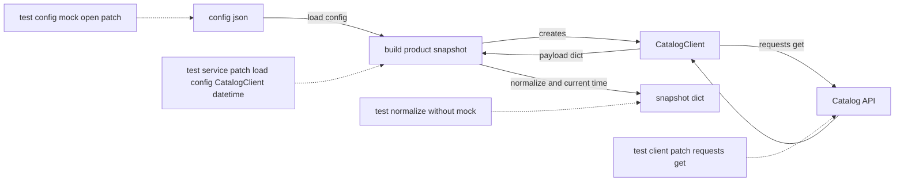

# Один сценарий, четыре границы: как протестировать мини-проект «конфиг → API-запрос → обработка ответа» без реального I/O

На практике внешние зависимости почти никогда не приходят по одной. Код читает конфиг из файла, создаёт клиента, делает HTTP-запрос, проверяет статус ответа и добавляет текущее время в итоговую структуру. Если тестировать такой сценарий “в лоб”, в один момент в тесты просачиваются диск, сеть и системные часы. `unittest.mock` как раз и нужен для того, чтобы временно подменить эти точки взаимодействия: `patch()` работает как декоратор, context manager или class decorator, автоматически снимает подмену после выхода из области действия, а `mock_open()` специально упрощает мокирование `open()` и файлового объекта внутри `with`. В `requests` при этом важно различать типы сбоев: `Timeout` возникает на вызове запроса, а `HTTPError` обычно появляется при `response.raise_for_status()`. ([Python documentation][1])

## Введение

Главная мысль это практики звучит просто: **мокируйте границы, а не вычисления**. Если функция делает чистое преобразование словаря в словарь, ей не нужен `mock`. Если функция вызывает `open()`, `requests.get()` или `datetime.now()`, именно там и проходит seam, который стоит брать под контроль. Такой подход делает тесты короче, а причину падения — понятнее.

## Что именно мы будем строить

Представьте обычную прикладную задачу. У Вас есть файл `config.json`, в котором лежат `base_url`, `api_key` и `timeout`. Есть клиент `CatalogClient`, который по `product_id` запрашивает карточку товара из внешнего API. Есть сервисная функция `build_product_snapshot()`, которая всё это связывает: читает конфиг, создаёт клиента, получает JSON, нормализует поля и добавляет `fetched_at`. Для пользователя это один сценарий. Для unit-тестов — четыре разные границы.

| Слой                  | Что делает                     | Внешняя граница                 |
| --------------------- | ------------------------------ | ------------------------------- |
| `config.py`           | читает JSON-конфиг             | файл                            |
| `client.py`           | делает HTTP-запрос             | сеть                            |
| `service.py`          | оркестрирует сценарий          | создание класса и текущее время |
| `normalize_product()` | приводит данные к нужной форме | границ нет                      |

Такое разбиение не случайно. Когда слой отвечает за одну внешнюю границу, `patch()` становится точным: файл мокируется в `config.py`, HTTP — в `client.py`, а создание клиента и текущее время — в `service.py`. Это полностью соответствует тому, как документация описывает `patch()` и `patch.object()`: подмена должна происходить в namespace использования, а не обязательно в месте определения объекта. Кроме того, если Вы патчите класс, “экземпляр” в коде под тестом живёт в `return_value` patched class; при `autospec=True` и сам mock, и его instance получают API и сигнатуры реального объекта. ([Python documentation][1])



> Сильный тест на такой проект не пытается сразу проверить всё. Он проверяет файл отдельно, HTTP отдельно, оркестрацию отдельно, а чистое преобразование — вообще без моков.

## Каркас мини-проекта

Структура проекта может быть такой:

```text
app/
    __init__.py
    config.py
    client.py
    service.py
tests/
    __init__.py
    test_config.py
    test_client.py
    test_service.py
    test_normalize.py
```

Ниже — сам код. Он небольшой специально. В учебной практике лучше взять короткий сценарий, но довести его до инженерной чистоты, чем утонуть в деталях доменной модели.

### `app/config.py`

```python
import json


def load_config(path: str) -> dict:
    with open(path, "r", encoding="utf-8") as f:
        return json.load(f)
```

### `app/client.py`

```python
import requests


class CatalogTimeoutError(Exception):
    pass


class CatalogResponseError(Exception):
    pass


class CatalogClient:
    def __init__(self, base_url: str, api_key: str, timeout: int = 3) -> None:
        self.base_url = base_url.rstrip("/")
        self.api_key = api_key
        self.timeout = timeout

    def fetch_product(self, product_id: int) -> dict:
        url = f"{self.base_url}/products/{product_id}"

        try:
            response = requests.get(
                url,
                headers={"Authorization": f"Bearer {self.api_key}"},
                timeout=self.timeout,
            )
        except requests.Timeout as exc:
            raise CatalogTimeoutError("Catalog API timed out") from exc

        try:
            response.raise_for_status()
        except requests.HTTPError as exc:
            raise CatalogResponseError(
                f"Catalog API returned status {response.status_code}"
            ) from exc

        return response.json()
```

### `app/service.py`

```python
from datetime import datetime, timezone

from app.client import CatalogClient
from app.config import load_config


def normalize_product(payload: dict, fetched_at: str) -> dict:
    return {
        "id": payload["id"],
        "name": payload["name"].strip(),
        "price": payload["price"],
        "currency": payload.get("currency", "USD"),
        "in_stock": bool(payload.get("in_stock", False)),
        "fetched_at": fetched_at,
    }


def build_product_snapshot(config_path: str, product_id: int) -> dict:
    cfg = load_config(config_path)

    client = CatalogClient(
        base_url=cfg["base_url"],
        api_key=cfg["api_key"],
        timeout=cfg.get("timeout", 3),
    )

    payload = client.fetch_product(product_id)
    fetched_at = datetime.now(timezone.utc).isoformat()
    return normalize_product(payload, fetched_at)
```

Здесь есть несколько важных инженерных решений. Во-первых, `timeout` передаётся в `requests.get()` явно; документация `requests` прямо рекомендует использовать этот параметр почти во всех production-запросах и отдельно предупреждает, что без явного `timeout` библиотека по умолчанию не ограничивает ожидание. Во-вторых, мы вызываем `raise_for_status()` до `json()`, потому что успешный `response.json()` сам по себе не означает успешный HTTP-ответ: сервер вполне может вернуть JSON с описанием ошибки при статусе `500`. В-третьих, время берётся через `datetime.now(timezone.utc)`, то есть через явный источник “сейчас”, который можно подменить в тесте. ([Requests][2])

## Шаг 1. Тестируем чтение конфига без реального файла

Для файлового слоя нам нужен не “фальшивый диск”, а подмена `open()` в модуле `app.config`. Здесь и пригодится `mock_open()`. Официальная документация описывает его как helper для `open()`, который работает и для прямого вызова, и для использования через context manager. Это важно, потому что внутри `with open(...) as f:` используется не сам `open()`, а объект, который он вернул, вместе с его `__enter__()` и `__exit__()`. `mock_open()` специально закрывает эту сложность и позволяет проверять как вызов `open()`, так и вызовы на handle. ([Python documentation][1])

```python
import unittest
from unittest.mock import mock_open, patch

from app.config import load_config


class TestLoadConfig(unittest.TestCase):
    def test_reads_json_config_from_file(self):
        raw = """
        {
            "base_url": "https://catalog.example",
            "api_key": "secret-token",
            "timeout": 5
        }
        """

        with patch("app.config.open", mock_open(read_data=raw)) as mocked_open:
            result = load_config("config.json")

        self.assertEqual(
            result,
            {
                "base_url": "https://catalog.example",
                "api_key": "secret-token",
                "timeout": 5,
            },
        )
        mocked_open.assert_called_once_with(
            "config.json",
            "r",
            encoding="utf-8",
        )
```

В этом тесте мы оставили `json.load()` реальным. И это принципиально. Задача `load_config()` — не эмулировать JSON-парсер, а правильно открыть файл и отдать содержимое в `json.load()`. Если Вы начинаете мокировать и файл, и `json.load()`, тест теряет предмет. Он перестаёт проверять код функции и начинает проверять то, как Вы сами настроили mock. Именно поэтому в unit-тестах стоит оставлять реальными дешёвые и детерминированные вещи, а подменять только внешнюю границу. Это уже не требование библиотеки, а дисциплина проектирования.

Если позже функция начнёт читать несколько файлов подряд, одного `mock_open(read_data=...)` может не хватить. В официальных примерах для этого показан рецепт с `side_effect`: на каждый вызов `open()` возвращается новый mock с собственным `read_data`. Это полезно помнить, но в нашем базовом проекте один файл — значит, базового `mock_open()` достаточно. `side_effect` при этом может быть функцией, исключением или итерируемым объектом; `return_value`, в свою очередь, задаёт то, что вернёт вызов mock. ([Python documentation][3])

## Шаг 2. Тестируем HTTP-клиент без реальной сети

Сетевой слой — самый критичный. Именно здесь чаще всего появляется ложная модель ошибки. В `requests` таймаут — это исключение на самом вызове запроса. Ошибка HTTP-статуса — это не обязательно исключение на `requests.get()`: типовой путь такой, что `requests.get()` возвращает `Response`, а `HTTPError` возникает при `response.raise_for_status()`. Ещё один важный нюанс из документации: успешный `response.json()` не доказывает, что HTTP-ответ был успешен. Поэтому порядок `raise_for_status()` → `json()` в клиенте не случаен. ([Requests][2])

### Успешный запрос

```python
import unittest
from unittest.mock import patch

from app.client import CatalogClient


class TestCatalogClientSuccess(unittest.TestCase):
    @patch("app.client.requests.get")
    def test_fetch_product_success(self, mocked_get):
        response = mocked_get.return_value
        response.raise_for_status.return_value = None
        response.json.return_value = {
            "id": 101,
            "name": "Keyboard",
            "price": 99,
            "currency": "USD",
            "in_stock": True,
        }

        client = CatalogClient(
            base_url="https://catalog.example",
            api_key="secret-token",
            timeout=5,
        )

        result = client.fetch_product(101)

        self.assertEqual(result["name"], "Keyboard")
        mocked_get.assert_called_once_with(
            "https://catalog.example/products/101",
            headers={"Authorization": "Bearer secret-token"},
            timeout=5,
        )
        response.raise_for_status.assert_called_once_with()
        response.json.assert_called_once_with()
```

Здесь весь сценарий строится через `return_value`. Это соответствует модели `Mock`: patched-функция `requests.get()` заменяется mock-объектом, а объект ответа — это его `return_value`. Поэтому методы `raise_for_status()` и `json()` мы настраиваем уже на нём. Документация `unittest.mock` описывает эту механику как базовую: результат вызова mock живёт в `return_value`, а `patch()` по умолчанию создаёт `MagicMock`, если Вы не передали `new` явно. ([Python documentation][1])

### Таймаут

```python
import requests
import unittest
from unittest.mock import patch

from app.client import CatalogClient, CatalogTimeoutError


class TestCatalogClientTimeout(unittest.TestCase):
    @patch("app.client.requests.get")
    def test_fetch_product_timeout(self, mocked_get):
        mocked_get.side_effect = requests.Timeout()

        client = CatalogClient(
            base_url="https://catalog.example",
            api_key="secret-token",
            timeout=5,
        )

        with self.assertRaises(CatalogTimeoutError):
            client.fetch_product(101)

        mocked_get.assert_called_once_with(
            "https://catalog.example/products/101",
            headers={"Authorization": "Bearer secret-token"},
            timeout=5,
        )
```

Здесь уже нужен `side_effect`, потому что в реальности `requests.get()` не возвращает “ответ с таймаутом”; он выбрасывает `Timeout`. Документация `requests` формулирует это буквально: если запрос превышает установленный таймаут, поднимается `Timeout`. Документация `Mock` при этом разрешает использовать в `side_effect` исключение или экземпляр исключения, и тогда mock будет его выбрасывать при вызове. ([Requests][2])

### HTTP 500

```python
import requests
import unittest
from unittest.mock import patch

from app.client import CatalogClient, CatalogResponseError


class TestCatalogClientHttp500(unittest.TestCase):
    @patch("app.client.requests.get")
    def test_fetch_product_http_500(self, mocked_get):
        response = mocked_get.return_value
        response.status_code = 500
        response.raise_for_status.side_effect = requests.HTTPError("500 Server Error")

        client = CatalogClient(
            base_url="https://catalog.example",
            api_key="secret-token",
            timeout=5,
        )

        with self.assertRaises(CatalogResponseError):
            client.fetch_product(101)

        response.raise_for_status.assert_called_once_with()
        response.json.assert_not_called()
```

Это место заслуживает отдельного акцента. Если Ваш код построен вокруг `raise_for_status()`, то `500` надо моделировать не на `requests.get`, а на `response.raise_for_status()`. Иначе тест начинает жить другой сетевой жизнью, чем production-код. Официальная документация `requests` прямо говорит, что `Response.raise_for_status()` поднимает `HTTPError` на неуспешных статусах. ([Requests][2])

## Шаг 3. Тестируем оркестрацию без реального клиента и реального времени

Теперь самый интересный слой. `build_product_snapshot()` сам не ходит в сеть и не читает файл напрямую. Он оркестрирует шаги: берёт конфиг, создаёт `CatalogClient`, получает payload, ставит метку времени и вызывает `normalize_product()`. Если здесь тянуть в тест и диск, и HTTP, и часы, то диагностика станет очень шумной. Поэтому в тесте сервиса нужно оставить реальной только оркестрацию, а три внешние зависимости подменить.

```python
import unittest
from datetime import datetime, timezone
from unittest.mock import patch

from app.service import build_product_snapshot


class TestBuildProductSnapshot(unittest.TestCase):
    def test_orchestrates_config_client_and_timestamp(self):
        fixed_now = datetime(2026, 3, 20, 12, 0, 0, tzinfo=timezone.utc)

        with (
            patch("app.service.load_config") as mock_load_config,
            patch("app.service.CatalogClient", autospec=True) as MockCatalogClient,
            patch("app.service.datetime") as mock_datetime,
        ):
            mock_load_config.return_value = {
                "base_url": "https://catalog.example",
                "api_key": "secret-token",
                "timeout": 5,
            }

            client_instance = MockCatalogClient.return_value
            client_instance.fetch_product.return_value = {
                "id": 101,
                "name": " Keyboard ",
                "price": 99,
                "currency": "USD",
                "in_stock": 1,
            }

            mock_datetime.now.return_value = fixed_now

            result = build_product_snapshot("config.json", 101)

        self.assertEqual(
            result,
            {
                "id": 101,
                "name": "Keyboard",
                "price": 99,
                "currency": "USD",
                "in_stock": True,
                "fetched_at": "2026-03-20T12:00:00+00:00",
            },
        )

        mock_load_config.assert_called_once_with("config.json")
        MockCatalogClient.assert_called_once_with(
            base_url="https://catalog.example",
            api_key="secret-token",
            timeout=5,
        )
        client_instance.fetch_product.assert_called_once_with(101)
        mock_datetime.now.assert_called_once_with(timezone.utc)
```

Здесь сходятся сразу три важных правила `unittest.mock`. Первое: патчить нужно namespace использования, поэтому мы подменяем `app.service.load_config`, `app.service.CatalogClient` и `app.service.datetime`, а не исходные объекты в других модулях. Второе: когда патчится класс, instance находится в `MockClass.return_value`; именно на нём настраиваются методы и проверки вызовов. Третье: `autospec=True` делает mock строже — он получает атрибуты и сигнатуры реального объекта, а для patched class его `return_value` тоже получает spec экземпляра. Это защищает тест от ложноположительных сценариев, где код обращается к несуществующему API клиента. ([Python documentation][1])

Обратите внимание, что здесь мы уже **не** мокируем `open()` и **не** мокируем `requests.get()`. И это не упрощение ради красоты, а нормальная граница ответственности. У `config.py` и `client.py` есть свои unit-тесты. Тест сервиса должен отвечать на другой вопрос: правильно ли сервис связал готовые строительные блоки.

## Шаг 4. Чистое преобразование тестируем без mock вообще

Самый частый промах в таких практиках — желание замокать всё подряд. Но `normalize_product()` не трогает ни диск, ни сеть, ни часы. Это чистая функция. Значит, лучший тест для неё — обычный вызов с обычным входом.

```python
import unittest

from app.service import normalize_product


class TestNormalizeProduct(unittest.TestCase):
    def test_normalizes_payload_without_mocks(self):
        result = normalize_product(
            payload={
                "id": 101,
                "name": " Keyboard ",
                "price": 99,
                "currency": "USD",
                "in_stock": 1,
            },
            fetched_at="2026-03-20T12:00:00+00:00",
        )

        self.assertEqual(
            result,
            {
                "id": 101,
                "name": "Keyboard",
                "price": 99,
                "currency": "USD",
                "in_stock": True,
                "fetched_at": "2026-03-20T12:00:00+00:00",
            },
        )
```

Эта часть практики педагогически важнее, чем кажется. Если студент после темы о моках начинает мокировать чистые функции, значит он освоил синтаксис, но не границы применения инструмента. В хорошей архитектуре mock — это не украшение теста, а способ отрезать внешний мир там, где он действительно входит в систему.

## Где здесь главный вывод

Кульминация этой темы не в том, что Вы выучили четыре имени — `patch`, `mock_open`, `return_value`, `side_effect`. Кульминация в другом: Вы начинаете видеть, **какой именно слой должен знать о какой именно зависимости**.

Файл — это ответственность `config.py`. HTTP — ответственность `client.py`. Создание клиента и текущее время — ответственность `service.py`. Чистая нормализация — вообще не повод для мокирования. Как только Вы так раскладываете проект, тесты становятся очень конкретными. Один тест отвечает на вопрос “как открыт файл”, другой — “как смоделирован таймаут”, третий — “с какими аргументами создан клиент”, четвёртый — “как нормализованы данные”. У каждого теста свой предмет, и это гораздо важнее, чем сама длина теста.

## Типовые ошибки в такой практике

Первая ошибка — патчить не тот namespace. Если `service.py` использует `CatalogClient`, импортированный в `app.service`, патч `app.client.CatalogClient` не обязан повлиять на код сервиса. Документация повторяет это правило прямо: `patch()` важен именно там, где объект looked up. ([Python documentation][1])

Вторая ошибка — моделировать HTTP 500 через `mocked_get.side_effect = HTTPError(...)`, хотя прод-код вызывает `raise_for_status()`. Для `requests` это обычно не та точка отказа. Если код делает `response.raise_for_status()`, то и исключение должно жить там. ([Requests][2])

Третья ошибка — не проверять `timeout` в аргументах запроса. Это выглядит как мелочь, но документация `requests` специально подчёркивает: без явного `timeout` запрос может ждать бесконечно. Поэтому проверка `assert_called_once_with(..., timeout=...)` — это часть контракта, а не косметика. ([Requests][2])

Четвёртая ошибка — тестировать весь сценарий одним большим тестом. Он может быть зелёным, но при падении Вы не поймёте, виноват файл, HTTP, время или нормализация. Разбиение по слоям в этом мини-проекте — не “академическая чистота”, а способ повысить сигнал тестов.

Пятая ошибка — перегружать тест моками там, где достаточно обычного `assertEqual`. Чистое преобразование данных лучше тестировать напрямую. Чем меньше в тесте лишних mock-объектов, тем меньше шансов, что Вы проверяете собственную настройку mock, а не код.

## Практическое задание

### Цель

Написать мини-проект и набор unit-тестов для сценария `конфиг -> API-запрос -> обработка ответа` так, чтобы в тестах **не было реального диска, реальной сети и реального времени**. При этом JSON-парсинг и нормализацию данных оставьте реальными: это часть бизнес-логики, а не внешняя граница.

### Задание

1. Создайте структуру проекта из трёх модулей: `config.py`, `client.py`, `service.py`, плюс каталог `tests/`.

2. Реализуйте в `config.py` функцию `load_config(path: str) -> dict`, которая читает JSON-конфиг из файла.

3. Реализуйте в `client.py` класс `CatalogClient` с конструктором `base_url`, `api_key`, `timeout`. Добавьте метод `fetch_product(product_id: int) -> dict`, который:
   - делает `GET`-запрос к `"{base_url}/products/{product_id}"`;
   - передаёт заголовок `Authorization: Bearer <api_key>`;
   - передаёт `timeout`;
   - преобразует `requests.Timeout` в своё доменное исключение;
   - преобразует HTTP-ошибки через `raise_for_status()` в своё доменное исключение;
   - возвращает `response.json()` на успешном ответе.

4. Реализуйте в `service.py`:
   - функцию `normalize_product(payload: dict, fetched_at: str) -> dict`;
   - функцию `build_product_snapshot(config_path: str, product_id: int) -> dict`, которая:
     - читает конфиг;
     - создаёт `CatalogClient`;
     - получает payload;
     - добавляет `fetched_at` через текущее UTC-время;
     - возвращает нормализованный словарь.

5. Напишите минимум четыре независимых тестовых модуля:
   - `test_config.py` — тест чтения конфига через `mock_open()`;
   - `test_client.py` — тесты успеха, таймаута и HTTP 500 через `patch()` для `requests.get`;
   - `test_service.py` — тест оркестрации через патч `load_config`, патч класса `CatalogClient` и патч текущего времени;
   - `test_normalize.py` — тест чистой нормализации без единого mock.

6. Добейтесь того, чтобы ни один тест не зависел от порядка запуска, текущей даты, наличия файла на диске или доступности сети.

### Подсказки по ключевым частям

Для чтения конфига используйте `patch("app.config.open", mock_open(read_data=...))`. `mock_open()` специально предназначен для подмены `open()`, работает и с `with open(...)`, и с чтением через `read()`/`readline()`/`readlines()`. ([Python documentation][1])

Для сетевого клиента выберите правильную механику mock. Успешный запрос моделируется через `mocked_get.return_value`. Таймаут — через `mocked_get.side_effect = requests.Timeout()`. HTTP 500 для кода, который вызывает `raise_for_status()`, моделируйте через `response.raise_for_status.side_effect = requests.HTTPError(...)`. Именно так устроено поведение `requests`: `Timeout` поднимается на вызове запроса, а `HTTPError` — на `raise_for_status()`. ([Python documentation][1])

В сервисном тесте патчите не `app.client.CatalogClient`, а `app.service.CatalogClient`, если именно это имя использует `service.py`. При патче класса работайте с `MockCatalogClient.return_value`: это и есть mock-экземпляр, который попадёт в код под тестом. Добавьте `autospec=True`, чтобы защищаться от несуществующих методов и неверных сигнатур. ([Python documentation][1])

Текущее время фиксируйте на уровне того символа, который читает сервис. Если в коде написано `from datetime import datetime, timezone`, то для теста обычно нужен `patch("app.service.datetime")`, а не абстрактный патч “глобального datetime”. Это частный случай общего правила `where to patch`. ([Python documentation][1])

### Что проверить перед отправкой (чек-лист)

- В тестах на файл нет реального `config.json`; содержимое подаётся через `mock_open()`. ([Python documentation][1])
- В тестах на HTTP нет ни одного реального запроса; всё идёт через `patch("app.client.requests.get")`. ([Python documentation][1])
- Вызов `requests.get()` проверяется вместе с `timeout`; без явного `timeout` Requests по умолчанию не ограничивает ожидание. ([Requests][2])
- Таймаут моделируется через `side_effect`, а не через “плохой response”. ([Python documentation][1])
- HTTP 500 моделируется на `response.raise_for_status()`, если Ваш код использует этот паттерн. ([Requests][2])
- В тесте сервиса патчится namespace использования: `app.service.load_config`, `app.service.CatalogClient`, `app.service.datetime`. ([Python documentation][1])
- При патче класса используется `MockClass.return_value`, а не `MockClass.some_method` напрямую. ([Python documentation][3])
- Чистая функция нормализации протестирована без mock.
- Ожидаемые значения не вычисляются тем же алгоритмом, что и production-код; они заданы явно.
- Все тесты проходят независимо друг от друга и от даты запуска.

### Советы по улучшению работы

Сначала доведите до ума границы, а уже потом украшайте архитектуру. Если у Вас пока путаются `return_value` и `side_effect`, не усложняйте проект ретраями и fallback-ветками.

Когда базовая версия заработает, добавьте один сценарий на невалидный JSON-ответ. Документация `requests` отмечает, что `response.json()` может поднять `requests.exceptions.JSONDecodeError`, если тело ответа не является корректным JSON. Это хороший следующий шаг после базовых тестов на `200`, `Timeout` и `500`. ([Requests][2])

Ещё один полезный апгрейд — добавить retry только на `ConnectTimeout`. В API-документации `requests` отдельно сказано, что `ConnectTimeout` безопасен для повторной попытки, а общий `Timeout` ловит и `ConnectTimeout`, и `ReadTimeout`. Это уже более интересная инженерная задача, потому что Вам придётся моделировать последовательность вызовов через `side_effect=[requests.ConnectTimeout(), ok_response]`. ([Requests][4])

Если решите усложнить файловую часть и читать несколько конфигов, не пытайтесь натянуть один `mock_open(read_data=...)` на все случаи. Для этого в примерах `unittest.mock` есть рабочий приём: функция в `side_effect` возвращает новый `mock_open()` для каждого имени файла. ([Python documentation][3])

## Заключение

В этой практике важно не количество моков, а качество границ. Хорошо построенный мини-проект позволяет протестировать файл через `mock_open()`, HTTP через `patch()` и `requests.get`, создание клиента через патч класса, а текущее время — через подмену конкретного символа `datetime` в модуле сервиса. Всё это укладывается в один простой принцип: **каждый тест должен изолировать только ту внешнюю зависимость, которая реально нужна для его предмета**. ([Python documentation][1])

Если Вы усвоили именно эту логику, то модуль 10 можно считать пройденным не формально, а по сути. Вы уже не просто умеете писать `patch(...)`; Вы понимаете, где его место в архитектуре теста, где нужен `return_value`, где нужен `side_effect`, а где mock вообще не нужен. Именно это и делает тесты устойчивыми, короткими и полезными.

## Дополнительные материалы

Официальная документация `unittest.mock`: разделы `patch`, `patch.object`, `where to patch`, `mock_open`, `autospec`. ([Python documentation][1])

Официальные примеры `unittest.mock`: разделы `Mocking Classes` и рецепт `Using side_effect to return per file content`. ([Python documentation][3])

Документация `requests`: разделы `Timeouts`, `Errors and Exceptions`, `JSON Response Content`, `Exceptions`. ([Requests][2])

Исходный код `Lib/unittest/mock.py` в CPython — полезен, если хотите посмотреть, как устроены patchers и helper-функции на уровне реализации. ([github.com][5])

[1]: https://docs.python.org/3/library/unittest.mock.html "https://docs.python.org/3/library/unittest.mock.html"
[2]: https://requests.readthedocs.io/en/latest/user/quickstart/ "https://requests.readthedocs.io/en/latest/user/quickstart/"
[3]: https://docs.python.org/3/library/unittest.mock-examples.html "https://docs.python.org/3/library/unittest.mock-examples.html"
[4]: https://requests.readthedocs.io/en/latest/api/ "https://requests.readthedocs.io/en/latest/api/"
[5]: https://github.com/python/cpython/blob/main/Lib/unittest/mock.py "https://github.com/python/cpython/blob/main/Lib/unittest/mock.py"
