# Предупреждение как контракт: как тестировать `warnings` через `assertWarns` и `assertWarnsRegex` в `unittest`

Когда Вы депрекейтите старый API, меняете поведение функции или хотите мягко предупредить пользователя о сомнительном сценарии, warning становится частью контракта. Это уже не “побочный текст в stderr”, а сигнал: категория должна быть правильной, сообщение — понятным, место срабатывания — осмысленным, а сам warning — реально эмититься. Проблема в том, что warnings в Python живут сложнее, чем обычные исключения: они зависят от фильтров, часть из них игнорируется по умолчанию, а повторные сообщения могут подавляться. Поэтому тест “я вроде видел предупреждение руками” здесь ненадёжен. Нужны точные проверки. ([Python documentation][1])

## Введение

Представьте, что у Вас есть старый путь вызова функции, и Вы хотите оставить его на один релиз, но обязать пользователей мигрировать. Если warning не вышел, пользователь не узнает о проблеме. Если warning вышел с неверной категорией, он может быть скрыт фильтром. Если warning указывает на внутренний wrapper, а не на код вызвавшей стороны, разработчик увидит бесполезную трассировку. Хороший тест должен страховать все три точки. Это и есть главная задача темы. ([Python documentation][1])

## Почему warnings плохо тестируются “на глаз”

Предупреждения в Python выдаются через `warnings.warn()`. Они не обязаны прерывать выполнение программы: дальнейшая судьба warning зависит от warning-фильтра. Фильтр может проигнорировать предупреждение, показать его, показать только один раз, показать один раз на модуль, либо превратить warning в исключение. Более того, повторные warnings подавляются по разным правилам для режимов `"default"`, `"module"` и `"once"`. Из-за этого один и тот же код может вести себя по-разному в зависимости от окружения, CLI-флагов и того, было ли такое предупреждение уже увидено раньше. ([Python documentation][1])

По умолчанию в обычной release-сборке Python warning-фильтр включает несколько специальных правил: `DeprecationWarning` из `__main__` показывается, а `DeprecationWarning`, `PendingDeprecationWarning`, `ImportWarning` и `ResourceWarning` в остальных случаях игнорируются. Начиная с Python 3.7, `DeprecationWarning` и `FutureWarning` различаются не по “степени удаления функции”, а по аудитории: `DeprecationWarning` адресован другим Python-разработчикам, а `FutureWarning` — конечным пользователям приложений. Это важно, потому что выбор категории — не косметика, а часть контракта с потребителем Вашего кода. ([Python documentation][1])

При этом `unittest` меняет картину. `TextTestRunner` по умолчанию показывает `DeprecationWarning`, `PendingDeprecationWarning`, `ResourceWarning` и `ImportWarning`, даже если они обычно игнорируются, а `unittest.main()` без явного `-W` использует warning-фильтр `'default'`. Поэтому warning, который “виден в тестах”, не обязательно будет так же виден при обычном запуске библиотеки как импортируемого модуля. Это одна из причин, почему warning-нужно тестировать как контракт, а не как случайный побочный эффект. ([Python documentation][2])

> Главная ловушка warnings в том, что они зависят не только от Вашего кода, но и от глобального состояния warning-фильтров и registry. Если это не учитывать, тесты будут либо хрупкими, либо слишком мягкими. ([Python documentation][1])

## Что именно проверяет `assertWarns`

`TestCase.assertWarns()` существует ровно для того, чтобы проверить: внутри тестируемого куска кода действительно был вызван warning нужной категории. Метод можно использовать в двух формах. Первая — как “callable form”, когда Вы передаёте warning-класс, функцию и её аргументы. Вторая — как context manager, когда код под тестом пишется прямо внутри `with`. Если warning не был вызван, тест падает. Если внутри кода вылетело обычное исключение, это считается ошибкой теста. Чтобы ловить одну из нескольких допустимых категорий, можно передать tuple warning-классов. А в context-manager форме доступен дополнительный `msg=`. ([Python documentation][2])

Ниже — простой учебный пример. Старый путь `str` ещё поддерживается, но уже помечен как deprecated.

```python
# app/limits.py
import warnings


def parse_limit(value):
    if isinstance(value, str):
        warnings.warn(
            "parse_limit() will stop accepting str; pass int instead",
            DeprecationWarning,
            stacklevel=2,
        )
        value = int(value)
    return value
```

Самый короткий тест выглядит так:

```python
import unittest

from app.limits import parse_limit


class TestParseLimit(unittest.TestCase):
    def test_warns_on_string_input_callable_form(self):
        self.assertWarns(DeprecationWarning, parse_limit, "10")
```

Такой тест уже полезен. Он отвечает на конкретный вопрос: warning нужной категории вообще был или нет. Но он почти ничего не говорит о возвращаемом значении, тексте warning и его источнике. Поэтому в живом коде context-manager форма обычно сильнее. Она позволяет одновременно проверить warning и остальное поведение функции. Возможность инспектировать warning через объект контекста — это одна из главных причин, почему `with self.assertWarns(...)` на практике используется чаще, чем callable form. Официальная документация прямо говорит, что context manager сохраняет объект warning в `warning`, а также линию и файл, с которых warning был вызван, в `filename` и `lineno`. ([Python documentation][2])

```python
import unittest

from app.limits import parse_limit


class TestParseLimit(unittest.TestCase):
    def test_warns_and_still_returns_value(self):
        with self.assertWarns(DeprecationWarning) as cm:
            result = parse_limit("10")

        self.assertEqual(result, 10)
        self.assertIn("pass int instead", str(cm.warning))
```

Эта форма уже лучше отражает реальный контракт. Вы страхуете не только наличие warning, но и то, что функция при этом продолжает работать в обратносуместимом режиме. Это типичный сценарий для депрекейтов: поведение ещё доступно, но уже маркируется для миграции. И именно context-manager форма позволяет сделать такой тест коротким и читаемым. ([Python documentation][2])

Есть ещё одна важная деталь. Документация `assertWarns()` отдельно подчёркивает, что метод работает независимо от warning-фильтров, действующих в момент вызова. Это большое отличие от наивных тестов, где Вы просто запускаете код и надеетесь увидеть warning на экране. Для `assertWarns` этого надеяться не нужно: его задача — создать контролируемый тестовый контур и проверить факт warning независимо от текущих глобальных фильтров. ([Python documentation][2])

## Почему context manager почти всегда практичнее

У callable form есть одно достоинство: она короткая. Но у context-manager формы есть три практических преимущества. Во-первых, Вы можете тестировать warning в точке, где есть ещё return value, изменение состояния объекта или дополнительные вызовы. Во-вторых, в `cm.warning` попадает сам объект предупреждения, а значит, Вы можете читать его атрибуты, если warning-класс у Вас кастомный. В-третьих, Вы получаете `filename` и `lineno`, а это уже переход от “warning был” к “warning указывает туда, куда должен”. Для библиотечного кода это обычно гораздо ценнее. ([Python documentation][2])

Это особенно заметно при работе с обёртками. Если функция внутри библиотеки вызывает другую функцию и warning должен указывать на внешний вызов пользователя, Вам мало проверить категорию. Вам нужно убедиться, что `stacklevel` настроен корректно и warning ссылается на вызывающую сторону, а не на внутренний helper. `assertWarns` как раз даёт для этого данные. ([Python documentation][2])

## Когда нужен `assertWarnsRegex`

`assertWarns()` отвечает только на вопрос про категорию. Но в реальном проекте этого часто недостаточно. Warning — это текстовый интерфейс миграции. Если сообщение слишком общее, не содержит имени старого API, не подсказывает замену или содержит неправильный параметр, пользовательский опыт и документация страдают. Для таких случаев существует `assertWarnsRegex()`. Он работает так же, как `assertWarns()`, но дополнительно проверяет, что текст warning соответствует регулярному выражению. В качестве `regex` можно передать либо строку, либо уже скомпилированный регулярный объект; сопоставление делается через `re.search()`, а не через полное совпадение всей строки. ([Python documentation][2])

Продолжим пример и сделаем сообщение чуть богаче:

```python
# app/limits.py
import warnings


def parse_limit(value):
    if isinstance(value, str):
        warnings.warn(
            f"parse_limit() will stop accepting str; got {value!r}; pass int instead",
            DeprecationWarning,
            stacklevel=2,
        )
        value = int(value)
    return value
```

Теперь тест на категорию уже не покрывает главную часть контракта — сам текст миграционного сообщения.

```python
import re
import unittest

from app.limits import parse_limit


class TestParseLimit(unittest.TestCase):
    def test_warning_message_is_informative(self):
        pattern = re.compile(
            r"parse_limit\(\) will stop accepting str; got '10'; pass int instead"
        )

        with self.assertWarnsRegex(DeprecationWarning, pattern):
            parse_limit("10")
```

Здесь важно не переусердствовать с точностью. Раз `assertWarnsRegex()` использует `re.search()`, в большинстве случаев лучше проверять устойчивый фрагмент сообщения, а не весь текст до последней запятой. Если в warning есть динамические значения, версии, пути или числа, лучше матчить важную семантическую часть, а изменчивые куски закрывать регулярным выражением. Иначе тест получится хрупким: он будет падать от безобидной правки формулировки, а не от реальной поломки контракта. Семантически это тот же совет, что и для `assertRaisesRegex()`: проверяйте смысл, а не декоративный шум строки. ([Python documentation][2])

Полезно знать и внутреннюю механику. Реализация `_AssertWarnsContext` в CPython сначала ищет первое warning подходящей категории, а затем, если указан regex, проверяет совпадение по тексту. Если категория совпала, но regex нет, тест падает именно как несоответствие шаблону, а не как “warning не был вызван”. Это мелкая, но важная деталь: падение даёт более точный диагноз. ([GitHub][3])

> `assertWarnsRegex()` нужен не для “красивых тестов”, а для защиты текста как части контракта. Категория отвечает на вопрос “что это за сигнал”, а regex — на вопрос “получит ли разработчик полезную инструкцию по миграции”. ([Python documentation][2])

## Проверка места срабатывания: `filename`, `lineno` и `stacklevel`

Очень многие warning-тесты останавливаются на категории и тексте. Это нормальный базовый уровень, но для библиотек его часто недостаточно. Warning должен указывать не на внутреннюю функцию-обёртку, а на место, где пользователь действительно вызвал deprecated API. За это отвечает `stacklevel` в `warnings.warn()`. Документация `warnings.warn()` прямо показывает типичный паттерн: wrapper передаёт `stacklevel=2`, чтобы warning относился к коду вызывающей стороны, а не к внутренней строке в helper-функции. В новых версиях Python есть и `skip_file_prefixes=`: начиная с 3.12 он позволяет пропускать стек-фреймы из внутренних пакетов, если фиксированный `stacklevel` неудобно поддерживать. ([Python documentation][1])

Допустим, у Вас есть deprecated wrapper:

```python
# app/legacy.py
import warnings

from app.limits import parse_limit


def legacy_parse_limit(value):
    warnings.warn(
        "legacy_parse_limit() is deprecated; use parse_limit()",
        DeprecationWarning,
        stacklevel=2,
    )
    return parse_limit(value)
```

Теперь уже интересно не только то, что warning пришёл, но и откуда он “виден”.

```python
import inspect
import unittest

from app.legacy import legacy_parse_limit


class TestLegacyParseLimit(unittest.TestCase):
    def test_warning_points_to_call_site(self):
        expected_line = inspect.currentframe().f_lineno + 2

        with self.assertWarns(DeprecationWarning) as cm:
            legacy_parse_limit("10")

        self.assertTrue(cm.filename.endswith("test_legacy.py"))
        self.assertEqual(cm.lineno, expected_line)
```

Такой тест страхует `stacklevel`. Если кто-то в будущем случайно уберёт `stacklevel=2` или добавит ещё один внутренний wrapper и забудет подвинуть уровень, тест сразу покажет, что warning начал ссылаться не на тот слой кода. Для библиотек и SDK это одна из самых ценных проверок в теме warnings: Вы тестируете не только факт сигнала, но и его адресность. Документация `unittest` для этого прямо и сохраняет `filename` и `lineno`, а документация `warnings.warn()` объясняет, почему `stacklevel` нужен обёрткам. ([Python documentation][2])

Здесь есть и инженерная тонкость. Проверка `lineno` полезна, но может быть излишне хрупкой, если тест часто редактируется. Поэтому в прикладном коде разумно разделять два уровня строгости. Если Вы тестируете именно корректность `stacklevel`, line-number check оправдан. Если Вам достаточно убедиться, что warning указывает на вызывающий файл, можно ограничиться `filename` и тем, что `lineno` больше нуля. Это уже методический совет, а не требование библиотеки. Но он помогает держать баланс между точностью и поддерживаемостью.

## Почему `assertWarns` устойчивее ручного `catch_warnings`

На первый взгляд кажется, что `assertWarns` — это просто красивый сахар вокруг `warnings.catch_warnings(record=True)`. Частично это так, но внутри он делает несколько важных вещей, из-за которых работает стабильнее, чем многие самодельные решения. Реализация `_AssertWarnsContext` в CPython сначала очищает `__warningregistry__` у загруженных модулей, затем заходит в `warnings.catch_warnings(record=True)` и включает `warnings.simplefilter("always", expected)` для ожидаемой категории. После выполнения кода она просматривает записанные warnings, берёт первый matching warning, а затем сохраняет объект warning и его `filename`/`lineno` для последующей проверки. Именно эта комбинация и объясняет, почему `assertWarns()` по документации “works regardless of the warning filters in place”. ([GitHub][3])

```mermaid
flowchart LR
    A["Код под тестом"] --> B["unittest._AssertWarnsContext"]
    B --> C["очистка __warningregistry__"]
    C --> D["warnings.catch_warnings(record=True)"]
    D --> E["warnings.simplefilter('always', expected)"]
    E --> F["выполнение кода внутри with"]
    F --> G["список пойманных warnings"]
    G --> H["поиск первого matching warning"]
    H --> I["cm.warning / cm.filename / cm.lineno"]
```



Эта внутренняя механика нужна не ради красоты, а из-за устройства warning-системы. В официальной документации `warnings` отдельно сказано, что если warning уже был показан под действием правил `"once"` или `"default"`, то потом он может больше не появиться, пока не будет очищен соответствующий registry. Там же в разделе про тестирование warnings советуют использовать `catch_warnings(record=True)` и включать `"always"` или `"error"` в фильтре, а при проверке нескольких однотипных warnings — следить за длиной списка и учитывать повторное подавление. `assertWarns` делает заметную часть этой работы за Вас. ([Python documentation][1])

Есть и практический вывод. Если Ваша задача — проверить один warning нужной категории, `assertWarns*` почти всегда лучше ручной сборки через `warnings.catch_warnings`. Не потому, что он “моднее”, а потому что в нём уже учтены registry, фильтры и запись результата в удобную структуру. Ручной путь стоит выбирать тогда, когда предмет проверки уже сложнее, чем “хотя бы один matching warning был”. ([Python documentation][2])

## Где `assertWarns` уже недостаточно

У `assertWarns` и `assertWarnsRegex` есть важное ограничение: они отвечают на вопрос “было ли сгенерировано хотя бы одно подходящее предупреждение?”. Для многих случаев этого достаточно. Но если Вам нужно проверить количество warnings, порядок их появления или сразу несколько сообщений одной категории, этих assertion-методов уже мало. И документация `warnings`, и исходный код `unittest` здесь сходятся: для множественных warnings лучше использовать `warnings.catch_warnings(record=True)` и проверять накопленный список. Документация прямо рекомендует при тестировании нескольких операций, генерирующих одинаковые предупреждения, следить за длиной warning-list, а реализация `_AssertWarnsContext` сохраняет только первый matching warning. ([Python documentation][1])

Посмотрите на такой пример:

```python
# app/migrate.py
import warnings


def migrate_both_options():
    warnings.warn("option 'host' is deprecated", DeprecationWarning, stacklevel=2)
    warnings.warn("option 'port' is deprecated", DeprecationWarning, stacklevel=2)
```

Если написать к нему просто `with self.assertWarns(DeprecationWarning):`, тест пройдёт уже на первом warning и ничего не скажет о втором. Для такого контракта нужен другой инструмент.

```python
import unittest
import warnings

from app.migrate import migrate_both_options


class TestMigrateBothOptions(unittest.TestCase):
    def test_emits_two_deprecations_in_order(self):
        with warnings.catch_warnings(record=True) as caught:
            warnings.simplefilter("always")
            migrate_both_options()

        self.assertEqual(len(caught), 2)
        self.assertEqual(
            [str(w.message) for w in caught],
            [
                "option 'host' is deprecated",
                "option 'port' is deprecated",
            ],
        )
        self.assertTrue(issubclass(caught[0].category, DeprecationWarning))
```

Этот тест уже проверяет именно множественный контракт. Он страхует количество, порядок и тексты. И ещё одна деталь здесь важна: если Вы уходите с `assertWarns` на ручной сбор warning-объектов, делайте это только внутри `warnings.catch_warnings()`. Официальная документация подчёркивает, что context manager копирует текущее состояние warning-фильтра и восстанавливает его при выходе. Это защищает другие тесты от случайного загрязнения глобального состояния. ([Python documentation][1])

Нужно помнить и ещё один тонкий момент из исходного кода `unittest`: если внутри `assertWarns()` был вызван warning другой категории, он не считается подходящим и не “перехватывается как ожидаемый”. Что с ним произойдёт дальше, зависит уже от остальных warning-фильтров: его могут скрыть, вывести или превратить в исключение. Это ещё одна причина не делать слишком широкие проверки вроде “ловим любой warning и всё хорошо”. Чем уже и точнее категория, тем честнее тест. ([GitHub][3])

## Типовые ошибки, из-за которых warning-тесты врут

Первая ошибка — ловить слишком широкую категорию. Технически `assertWarns((DeprecationWarning, FutureWarning))` работает, потому что метод принимает tuple warning-классов. Но методически это часто размывает контракт. `DeprecationWarning` и `FutureWarning` в современной документации Python различаются именно по аудитории и дефолтным фильтрам. Если Вы не уверены, кому адресован сигнал, проблема обычно в дизайне API, а не в тесте. ([Python documentation][2])

Вторая ошибка — проверять весь warning-текст буквально там, где он содержит динамические значения. `assertWarnsRegex()` использует `re.search()`, и это хороший повод проверять смысловой фрагмент сообщения, а не всё сообщение целиком. Слишком строгий literal-match быстро превращает полезный контрактный тест в тест на пунктуацию. Это не запрещено библиотекой, но почти всегда ухудшает поддержку набора. ([Python documentation][2])

Третья ошибка — ждать runtime-warning там, где warning возникает на этапе компиляции. Документация `warnings` прямо указывает, что `SyntaxWarning` обычно эмитится при компиляции исходника и поэтому может не подчиняться runtime-фильтрам обычным образом. Если Вы хотите тестировать такой warning, сам `compile()` или `exec()` должен происходить внутри контролируемого блока, а не до входа в `with self.assertWarns(...)`. Для обычных пользовательских warnings эта проблема не возникает, но про `SyntaxWarning` её стоит помнить. ([Python documentation][1])

Четвёртая ошибка — думать, что “раз тесты видят warning, значит и пользователи библиотеки его видят”. Это не всегда так. В обычной release-сборке многие developer-facing warnings игнорируются по умолчанию, а `unittest` runner, наоборот, показывает несколько важных категорий специально. Если warning — часть публичной миграционной политики, полезно отдельно понимать, виден ли он только под тестами, только в `__main__`, либо в обычной библиотечной интеграции тоже. ([Python documentation][1])

Пятая ошибка — забывать, что `assertWarns` не подменяет проверку исключений. Документация формулирует это просто: любой обычный exception внутри проверяемого кода — это error, а не “отрицательный результат warning-проверки”. Поэтому если функция должна сначала предупредить, а потом упасть, проверку warning и проверку exception обычно лучше разводить по отдельным тестам. Иначе тест станет одновременно и слишком сложным, и менее диагностичным. ([Python documentation][2])

## Практический шаблон, который стоит запомнить

Если упростить всю тему до рабочего решения, получится четыре режима.

Когда Вам нужен только факт warning нужной категории, используйте `assertWarns`. Когда категория важна, но ещё важнее текст миграционного сообщения, используйте `assertWarnsRegex`. Когда контракт warning включает правильный call site, работайте с context manager и проверяйте `cm.filename`/`cm.lineno`. А когда нужно проверить количество, порядок или набор из нескольких warning-событий, уходите в `warnings.catch_warnings(record=True)` и делайте проверку списка явно. Эти четыре режима полностью покрывают большую часть прикладных кейсов вокруг warnings в `unittest`. ([Python documentation][2])

Ещё один полезный приём относится уже не к конкретному тесту, а к прогону набора. Если Вы локализуете неожиданное warning-поведение, бывает удобно временно запускать тесты так, чтобы warnings превращались в ошибки. Warning-фильтр поддерживает действие `"error"`, а документация `unittest.main()` позволяет задавать warning-filter на время прогона. Это хороший режим диагностики: он быстро показывает места, где в проекте остались нежданные deprecation или resource warnings. Но для точечных unit-тестов контракт конкретного warning всё равно удобнее выражать через `assertWarns*`. ([Python documentation][1])

## Заключение

`assertWarns` и `assertWarnsRegex` полезны не потому, что позволяют “поймать warning”. С этим можно справиться и руками. Их реальная ценность в другом: они переводят warnings из случайного побочного эффекта в проверяемый контракт. Категория становится частью API, текст — частью миграционного сообщения, а `filename` и `lineno` — частью адресности сигнала. Как только Вы начинаете мыслить warnings именно так, тесты становятся не декоративными, а инженерными. ([Python documentation][2])

Хороший warning-тест отвечает минимум на два вопроса: правильный ли это сигнал и увидит ли потребитель кода полезную подсказку. Отличный warning-тест отвечает ещё и на третий: указывает ли сигнал туда, где разработчик реально должен править код. Для одиночных предупреждений чаще всего хватает `assertWarns` или `assertWarnsRegex`. Для сложных последовательностей — `warnings.catch_warnings(record=True)`. А понимание фильтров, registry и `stacklevel` делает эти тесты не просто зелёными, а надёжными. ([Python documentation][1])

## Дополнительные материалы

1. Официальная документация `unittest`: `assertWarns`, `assertWarnsRegex`, поведение `TextTestRunner` и `unittest.main()` по отношению к warning-фильтрам. ([Python documentation][2])

2. Официальная документация `warnings`: категории предупреждений, warning-фильтр, подавление повторов, `catch_warnings()`, `warn()`, `stacklevel` и `skip_file_prefixes`. ([Python documentation][1])

3. Реализация `_AssertWarnsContext` в CPython: полезна, чтобы понять, как `unittest` очищает `__warningregistry__`, включает `simplefilter("always", expected)` и выбирает первый matching warning. ([GitHub][3])

4. `What’s New in Python 3.7` и PEP 565: изменение видимости `DeprecationWarning` в `__main__` и общая логика дефолтного поведения deprecation warnings. ([Python documentation][4])

5. Если захотите копнуть глубже в практику депрекейтов, полезно дополнительно посмотреть современную документацию `warnings` по decorator `warnings.deprecated` и связи runtime warnings со static type checkers. Это уже следующий слой темы, но он хорошо продолжает логику `assertWarns*`. ([Python documentation][1])

[1]: https://docs.python.org/3/library/warnings.html "https://docs.python.org/3/library/warnings.html"
[2]: https://docs.python.org/3/library/unittest.html "https://docs.python.org/3/library/unittest.html"
[3]: https://github.com/python/cpython/blob/main/Lib/unittest/case.py "https://github.com/python/cpython/blob/main/Lib/unittest/case.py"
[4]: https://docs.python.org/3/whatsnew/3.7.html "What’s New In Python 3.7 — Python 3.14.3 documentation"
