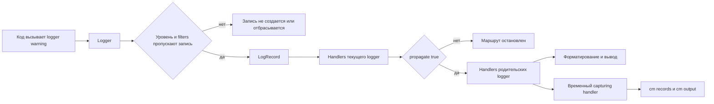

# Лог — это тоже контракт: как тестировать сообщения через `assertLogs` и `assertNoLogs` в `unittest`

Логи часто воспринимают как вторичный шум: что‑то для консоли, что‑то для Kibana, что‑то “на всякий случай”. В тестах из‑за этого возникает перекос. Разработчик проверяет return value, исключения и состояние объекта, но не проверяет, что код вообще сообщил о проблеме на нужном уровне, в нужный logger и в нужной форме. Между тем `unittest` давно умеет тестировать логирование штатно: `assertLogs()` проверяет, что в блоке появился хотя бы один подходящий лог, а `assertNoLogs()` — что подходящих логов не было вовсе. Первый метод появился в Python 3.4, второй — в Python 3.10. ([Python documentation][1])

## Введение

Эта тема глубже, чем кажется. В отличие от `assertRaises()` или `assertWarns()`, проверки логов зависят не только от Вашего кода, но и от живой конфигурации `logging`: иерархии logger’ов, уровней, `propagate`, глобального `logging.disable()` и даже от того, какой logger Вы выбрали как точку наблюдения. Поэтому хороший тест на лог — это не “поймал строку из консоли”, а проверил маршрут `LogRecord` внутри logging-системы. ([Python documentation][1])

> Тест на лог полезен не тогда, когда он доказывает “что-то напечаталось”, а тогда, когда он страхует диагностический контракт кода: **что именно будет видно разработчику или системе наблюдаемости в момент сбоя или важного события**.

## Почему логирование нельзя сводить к `print`

Python `logging` устроен как система из нескольких сущностей. Код пишет в `Logger`. Logger создаёт `LogRecord`. Дальше запись проходит через уровни, фильтры, handler’ы и formatter’ы. У logger’ов есть иерархия имён через точку: `app` — родитель для `app.db`, `app.http`, `app.http.client`. Именно поэтому рекомендованная практика — получать logger через `logging.getLogger(__name__)`: тогда иерархия logger’ов совпадает с иерархией модулей. ([Python documentation][2])

Ключевой механизм здесь — `propagate`. Если `propagate=True`, запись, прошедшая через текущий logger, передаётся handler’ам предков. Если `propagate=False`, маршрут обрывается на текущем logger. Документация отдельно подчёркивает, что при передаче записи вверх по иерархии handler’ам предков уже не применяются уровни и фильтры самих ancestor-logger’ов; запись идёт прямо к их handler’ам. Поэтому то, что “родительский logger всё увидит”, верно только пока какой‑то потомок не отключил `propagate`. ([Python documentation][2])



Из этой схемы следует главный методический вывод темы: `assertLogs()` не проверяет stdout и не “читает консоль”. Он вставляется в logging-маршрут как временный capturing handler и ловит только те `LogRecord`, которые реально дошли до выбранного logger’а и прошли заданный уровень. Поэтому здесь важны не только сообщение и уровень, но и точка подключения. ([Python documentation][1])

## Что именно обещает `assertLogs`

Официальный контракт у `assertLogs(logger=None, level=None)` довольно строгий. Это context manager, который проверяет, что внутри блока был залогирован **хотя бы один** message на указанном logger’е или на одном из его children, причём не ниже указанного уровня. Если logger не указан, используется root logger. Если уровень не указан, используется `logging.INFO`. Возвращаемый объект хранит два атрибута: `records` со списком подходящих `LogRecord` и `output` со списком уже отформатированных строк. ([Python documentation][1])

Это описание уже снимает несколько частых заблуждений. Во‑первых, `assertLogs()` проверяет не ровно один лог, а минимум один. Если подходящих записей две, три или десять, assertion всё равно пройдёт. Во‑вторых, он смотрит не только на точный logger, но и на его descendants. В‑третьих, дефолтный порог — `INFO`, а не `WARNING` и не `DEBUG`. Если код логирует только `DEBUG`, `assertLogs()` без `level="DEBUG"` не сработает. ([Python documentation][1])

Но самое интересное видно в реализации CPython. Внутри `_AssertLogsContext` создаётся `_CapturingHandler`, который складывает сырые `LogRecord` в `watcher.records` и форматированные строки — в `watcher.output`. Для `output` используется formatter по умолчанию `'%(levelname)s:%(name)s:%(message)s'`. Затем контекст сохраняет старые `handlers`, `level` и `propagate` выбранного logger’а, подменяет `handlers` на один capturing handler, выставляет logger’у уровень из assertion и временно ставит `propagate=False`. На выходе старые настройки возвращаются обратно. ([GitHub][3])

Это внутренняя механика объясняет поведение, которое часто удивляет новичков. Почему `cm.output` выглядит как `INFO:app.service:done`? Потому что такой default formatter зашит в `_AssertLogsContext`. Почему во время `assertLogs()` не отрабатывают обычные handler’ы тестируемого logger’а? Потому что его `handlers` на время блока заменяются на один capturing handler. Почему нет дублирования через root handler? Потому что `propagate` временно переключается в `False`. И почему `assertLogs()` может поймать `INFO`, даже если root logger по умолчанию живёт на `WARNING`? Потому что внутри контекста выбранному logger’у явно выставляется заданный уровень, а по умолчанию это `INFO`. ([GitHub][3])

> Если Вы хотите понять странное поведение `assertLogs`, смотрите не только в документацию `unittest`, но и в `_log.py`: этот context manager **меняет handlers, level и propagate** целевого logger’а на время блока. ([GitHub][3])

## Базовый сценарий: проверить, что важное событие действительно попало в лог

Представьте маленькую функцию, которая логирует старт операции.

```python
# app/orders.py
import logging

logger = logging.getLogger(__name__)


def load_order(order_id: int) -> dict:
    logger.info("load_order started: order_id=%s", order_id)
    return {"id": order_id}
```

Тест выглядит так:

```python
import unittest

from app.orders import load_order


class TestLoadOrder(unittest.TestCase):
    def test_logs_start_of_loading(self):
        with self.assertLogs("app.orders", level="INFO") as cm:
            result = load_order(42)

        self.assertEqual(result, {"id": 42})
        self.assertEqual(len(cm.records), 1)
        self.assertEqual(cm.records[0].name, "app.orders")
        self.assertEqual(
            cm.records[0].getMessage(),
            "load_order started: order_id=42",
        )
        self.assertEqual(
            cm.output,
            ["INFO:app.orders:load_order started: order_id=42"],
        )
```

Этот тест хорош тем, что проверяет не только “лог был”, но и три слоя контракта сразу. Во‑первых, лог действительно относится к logger’у `app.orders`. Во‑вторых, уровень — `INFO`. В‑третьих, итоговое человекочитаемое сообщение соответствует ожиданию. При этом для человека, читающего тест, сразу видно, что здесь является предметом проверки: не побочный шум, а факт диагностического события при старте операции. `assertLogs()` возвращает helper с `records` и `output` именно для такого сценария. ([Python documentation][1])

## `records` и `output`: что проверять в каком случае

На практике `assertLogs()` полезен в двух режимах. Первый — быстрый: сравнить `cm.output` со списком строк. Второй — инженерный: разбирать `cm.records` и смотреть поля `LogRecord`. Второй режим обычно сильнее, потому что он меньше зависит от formatter’а и даёт доступ к метаданным записи. Это особенно важно, когда Вы тестируете не просто текст, а уровень, имя logger’а, caller information или наличие `exc_info`. Документация `logging` подробно описывает атрибуты `LogRecord`, включая `name`, `levelname`, `levelno`, `pathname`, `filename`, `lineno`, `funcName`, `msg`, `args` и `message`. ([Python documentation][1])

Ниже — полезное практическое различие:

| Что Вы хотите проверить                                            | Что удобнее использовать |
| ------------------------------------------------------------------ | ------------------------ |
| точный формат, который видит человек                               | `cm.output`              |
| уровень, logger name, `pathname`, `lineno`, `funcName`, `exc_info` | `cm.records`             |
| точное количество записей                                          | `len(cm.records)`        |
| смысл сообщения после подстановки аргументов                       | `record.getMessage()`    |

Это различие вытекает прямо из документации и реализации. `records` — это список сырых `LogRecord`, а `output` — уже отформатированные строки. При этом `LogRecord.getMessage()` собирает итоговый message из `msg` и `args`, а поле `message` формируется formatter’ом. Внутренний capturing handler `unittest` делает и то и другое: сохраняет record как есть и отдельно прогоняет его через formatter. ([Python documentation][1])

Это легко увидеть на примере параметризованного сообщения:

```python
import unittest
import logging


logger = logging.getLogger("shop.billing")


def charge(user_id: int, amount: int) -> None:
    logger.warning("charge failed: user_id=%s amount=%s", user_id, amount)


class TestCharge(unittest.TestCase):
    def test_can_inspect_raw_and_formatted_log(self):
        with self.assertLogs("shop.billing", level="WARNING") as cm:
            charge(7, 150)

        record = cm.records[0]

        self.assertEqual(record.msg, "charge failed: user_id=%s amount=%s")
        self.assertEqual(record.args, (7, 150))
        self.assertEqual(record.getMessage(), "charge failed: user_id=7 amount=150")
        self.assertEqual(
            cm.output,
            ["WARNING:shop.billing:charge failed: user_id=7 amount=150"],
        )
```

Именно здесь видно, почему тесты только по `cm.output` иногда оказываются слишком хрупкими. `output` зависит от formatter’а, а `record.getMessage()` отражает уже собранный смысл сообщения без привязки к финальной строке `LEVEL:logger:message`. Если Ваш контракт — именно человекочитаемый формат, сравнивайте `output`. Если контракт — бизнес‑смысл записи и её метаданные, почти всегда лучше идти через `records`. ([Python documentation][2])

## Иерархия logger’ов: почему `assertLogs("app")` ловит `app.db`, но не ловит `other`

Документация `unittest` говорит прямо: `assertLogs()` проверяет сообщения на logger’е **или одном из его children**. Документация `logging` объясняет, что иерархия имён строится через точку: `foo.bar` — descendant для `foo`. Из этого следует простое правило: `assertLogs("app")` может поймать `app.db`, `app.http`, `app.http.client`, но не поймает `other` и не поймает sibling logger вне ветки `app`. ([Python documentation][1])

```python
import unittest
import logging


parent_logger = logging.getLogger("app")
child_logger = logging.getLogger("app.db")


def query_db() -> None:
    child_logger.error("database timeout")


class TestHierarchy(unittest.TestCase):
    def test_parent_assertion_catches_child_logger(self):
        with self.assertLogs("app", level="ERROR") as cm:
            query_db()

        self.assertEqual(len(cm.records), 1)
        self.assertEqual(cm.records[0].name, "app.db")
        self.assertEqual(cm.records[0].levelname, "ERROR")
        self.assertEqual(cm.records[0].getMessage(), "database timeout")
```

Такой тест работает не потому, что `assertLogs()` умеет “искать похожие имена”, а потому, что logging-system сама строит иерархию logger’ов по namespace. Поэтому тест на родительский logger оказывается естественным способом покрыть целую подсистему, например `payments`, `payments.http`, `payments.retry` и `payments.cache`. Это удобно, но требует аккуратности: чем шире target logger, тем больше риск поймать посторонний шум внутри `with`‑блока. ([Python documentation][2])

## Самая частая ловушка: `propagate=False`

Многие тесты с логами “неожиданно” не ловят сообщение, хотя код точно вызывает `logger.warning(...)`. Очень часто причина в `propagate=False` на потомке. Документация `logging` прямо говорит: если в цепочке `A.B.C -> A.B -> A -> root` какой‑то logger установил `propagate=False`, именно на нём подъём к ancestor handlers останавливается. А документация `assertLogs()` отдельно предупреждает, что root logger по умолчанию ловит все сообщения, **кроме** тех, которые были заблокированы non‑propagating descendant logger’ом. ([Python documentation][2])

Это значит, что такой тест потенциально не пройдёт:

```python
import unittest
import logging


root_target = logging.getLogger()
child = logging.getLogger("app.secret")
child.propagate = False
child.addHandler(logging.NullHandler())


class TestPropagationTrap(unittest.TestCase):
    def test_root_will_not_see_non_propagating_child(self):
        with self.assertLogs(level="WARNING"):
            child.warning("hidden from root")
```

Если Ваша система намеренно использует `propagate=False` на части logger’ов, safest path — писать assertion на конкретный logger этой подсистемы, а не на root. Это делает тест уже по области охвата и лучше соответствует реальной маршрутизации записей. В логировании точка наблюдения важна не меньше, чем текст сообщения. ([Python documentation][1])

## Уровни: почему `assertLogs()` не ловит `DEBUG` по умолчанию

Ещё одна системная ловушка — пороги уровней. По контракту `assertLogs()` и `assertNoLogs()` используют `INFO`, если `level` не передан. Это означает, что `DEBUG`‑сообщения не участвуют в проверке по умолчанию. ([Python documentation][1])

Здесь есть тонкость, которую полезно понимать глубже. В обычной logging‑системе root logger создаётся с уровнем `WARNING`. Но `_AssertLogsContext` внутри `unittest` временно выставляет выбранному logger’у уровень assertion, а если `level` не указан — `INFO`. Поэтому внутри `assertLogs()` Вы можете поймать `INFO` даже там, где вне теста root logger из коробки жил бы на `WARNING`. Это не магия и не поблажка; это сознательное поведение реализации. ([Python documentation][2])

Однако эта подмена не делает logging-систему “всемогущей”. Документация `logging` отдельно указывает, что `Logger.isEnabledFor()` сначала проверяет глобальный порог из `logging.disable(level)`, а уже потом — effective level logger’а. Кроме того, у logger’а есть атрибут `disabled`, который полностью отключает обработку событий. Поэтому если кто‑то в тестовом окружении вызвал `logging.disable(...)` или отключил нужный logger, `assertLogs()` не спасёт ситуацию. Он не обходит глобальные ограничения logging; он работает внутри них. ([Python documentation][2])

В реальной диагностике это даёт простой чек: если `assertLogs()` “не видит” сообщение, проверьте не только имя logger’а, но и три заслонки — `level`, `propagate` и `logging.disable()`. Чаще всего проблема находится именно там.

## Что делает `assertNoLogs`

`assertNoLogs(logger=None, level=None)` — зеркальный context manager. Он проверяет, что внутри блока не было сообщений на указанном logger’е или его children с уровнем не ниже заданного. По умолчанию используются root logger и порог `INFO`. В отличие от `assertLogs()`, context manager ничего не возвращает. Метод появился в Python 3.10. ([Python documentation][1])

Сценарии для `assertNoLogs()` вполне прикладные. Вы тестируете happy path и хотите доказать, что он не шумит `WARNING`/`ERROR`. Вы проверяете идемпотентный retry и хотите убедиться, что успешный проход не пишет ошибку. Вы закрываете баг, где при нормальной работе система всё равно логировала тревожное сообщение. Во всех этих случаях assertion на “тишину” полезнее, чем просто отсутствие exception. ([Python documentation][1])

```python
import unittest
import logging


logger = logging.getLogger("shop.parser")


def parse_price(value: str) -> int:
    return int(value)


class TestParsePrice(unittest.TestCase):
    def test_happy_path_emits_no_warnings_or_errors(self):
        with self.assertNoLogs("shop.parser", level="WARNING"):
            result = parse_price("150")

        self.assertEqual(result, 150)
```

Главная практическая ловушка `assertNoLogs()` — тот же дефолтный `INFO`. Если код пишет `DEBUG`, такой тест пройдёт, потому что `DEBUG` ниже порога. Если Ваша цель — полная тишина, а не “нет warning/error”, опускайте порог до `DEBUG`. ([Python documentation][1])

```python
import unittest
import logging


logger = logging.getLogger("shop.parser")


def parse_price_verbose(value: str) -> int:
    logger.debug("raw input: %s", value)
    return int(value)


class TestParsePriceVerbose(unittest.TestCase):
    def test_default_info_threshold_does_not_fail_on_debug(self):
        with self.assertNoLogs("shop.parser"):
            parse_price_verbose("150")

    def test_debug_threshold_makes_the_check_strict(self):
        with self.assertNoLogs("shop.parser", level="DEBUG"):
            parse_price_verbose("150")
```

Есть и ещё один полезный диагностический нюанс. По исходникам CPython видно, что при провале `assertNoLogs()` сообщение падения включает найденные formatted log messages, а при провале `assertLogs()` выводится сообщение в духе “на таком logger’е не было логов уровня X и выше”. То есть эти assertion’ы полезны не только как проверка, но и как источник достаточно понятной причины падения. Для темы “диагностика” это важно: сам инструмент уже даёт содержательный fail signal, если Вы выбрали правильный logger и порог. ([GitHub][3])

## Продвинутый режим: через `cm.records` можно тестировать caller information

На базовом уровне тест логов отвечает на вопрос “что написали”. На продвинутом — ещё и “кто это написал”. В `logging` методы `debug()`, `info()`, `warning()` и другие принимают `stacklevel`. Документация поясняет: если `stacklevel > 1`, logging пропускает соответствующее число кадров стека при вычислении `filename`, `lineno` и `funcName` в `LogRecord`. Это особенно полезно в helper- и wrapper-функциях, где Вы хотите, чтобы запись указывала не на сам helper, а на код вызывающей стороны. ([Python documentation][2])

Представьте обёртку:

```python
# app/api.py
import logging

logger = logging.getLogger("app.api")


def log_deprecated_api():
    logger.warning("deprecated API used", stacklevel=2)
```

Тест может проверить не только сообщение, но и корректность `stacklevel`:

```python
import inspect
import unittest

from app.api import log_deprecated_api


class TestDeprecatedApiLogging(unittest.TestCase):
    def test_record_points_to_caller(self):
        expected_line = inspect.currentframe().f_lineno + 2

        with self.assertLogs("app.api", level="WARNING") as cm:
            log_deprecated_api()

        record = cm.records[0]
        self.assertEqual(record.funcName, "test_record_points_to_caller")
        self.assertEqual(record.lineno, expected_line)
        self.assertEqual(record.getMessage(), "deprecated API used")
```

Этот тест ценен тем, что он страхует качество диагностики. Если кто‑то уберёт `stacklevel=2`, текст сообщения останется тем же, и наивный тест по `cm.output` ничего не заметит. А вот тест по `funcName` и `lineno` сразу покажет, что лог снова указывает на внутренний helper вместо внешнего вызова. `LogRecord` как раз и хранит эти поля: `pathname`, `filename`, `lineno`, `funcName`. ([Python documentation][2])

> `cm.records` — это не “внутренности ради внутренностей”. Это способ тестировать качество диагностики: caller, уровень, logger name, traceback presence и другие детали, которые невозможно надёжно выразить одной строкой в `cm.output`. ([Python documentation][2])

## Ещё один сильный сценарий: `logger.exception()`

В production-коде ошибки часто логируют через `logger.exception(...)`. Документация `logging` фиксирует две ключевые вещи: `Logger.exception()` пишет сообщение на уровне `ERROR`, а exception information добавляется к записи; метод следует вызывать из exception handler’а. Это удобный кандидат для `assertLogs()`, потому что Вы можете проверить и message, и уровень, и то, что в `LogRecord` действительно есть `exc_info`. ([Python documentation][2])

```python
import unittest
import logging

logger = logging.getLogger("shop.math")


def safe_divide(a: int, b: int):
    try:
        return a / b
    except ZeroDivisionError:
        logger.exception("division failed for a=%s b=%s", a, b)
        return None


class TestSafeDivide(unittest.TestCase):
    def test_logs_exception_with_context(self):
        with self.assertLogs("shop.math", level="ERROR") as cm:
            result = safe_divide(10, 0)

        self.assertIsNone(result)

        record = cm.records[0]
        self.assertEqual(record.levelname, "ERROR")
        self.assertEqual(record.getMessage(), "division failed for a=10 b=0")
        self.assertIsNotNone(record.exc_info)
```

Это заметно сильнее проверки по куску traceback в `cm.output`. Traceback‑текст часто получается хрупким: он зависит от форматирования, путей и иногда от версии Python. А вот `record.exc_info is not None` выражает контракт точнее: код действительно залогировал исключение как exception event, а не просто написал строку уровня `ERROR`. `LogRecord` как раз и хранит `exc_info`, `exc_text`, `message` и другие связанные поля. ([Python documentation][2])

## Связка с предыдущей темой: когда warning перенаправляют в logging

Это уже пограничный сценарий между темами 11.1 и 11.2, но он очень полезен в курсе как мост. Модуль `logging` умеет интегрироваться с `warnings`: `logging.captureWarnings(True)` перенаправляет предупреждения из модуля `warnings` в logging-систему. Документация указывает, что они логируются в logger с именем `'py.warnings'` на уровне `WARNING` и форматируются через `warnings.formatwarning()`. ([Python documentation][2])

```python
import logging
import warnings
import unittest


class TestWarningsBridge(unittest.TestCase):
    def test_warning_can_be_captured_via_logging(self):
        logging.captureWarnings(True)
        try:
            with self.assertLogs("py.warnings", level="WARNING") as cm:
                warnings.warn("legacy path", DeprecationWarning)
        finally:
            logging.captureWarnings(False)

        self.assertEqual(cm.records[0].name, "py.warnings")
        self.assertIn("legacy path", cm.records[0].getMessage())
```

Это не заменяет `assertWarns()` для обычных unit-тестов предупреждений. Но как инженерный приём для интеграции subsystems это полезно: часть legacy-кода живёт в warnings, часть — в logging, а тесту нужна единая точка наблюдения. В таких случаях знание про `'py.warnings'` и `captureWarnings(True)` даёт аккуратный мост между двумя механизмами. ([Python documentation][2])

## Частые ошибки, из-за которых тесты на логи врут

### Ошибка первая: проверять только факт прохождения `assertLogs()`

По контракту `assertLogs()` требует только минимум один подходящий лог. Если блок написал два сообщения вместо одного, assertion всё равно будет зелёным. Поэтому когда количество событий важно, проверяйте `len(cm.records)` явно. Это не дополнительная строгость, а нормальное уточнение контракта. ([Python documentation][1])

### Ошибка вторая: использовать только `cm.output`

`cm.output` удобен, но это уже форматированный текст. Он зависит от formatter’а, а по умолчанию внутри `_AssertLogsContext` формат строится как `LEVEL:logger:message`. Если Вам важны структура и метаданные, а не финальная строка, смотрите в `cm.records`, `record.getMessage()`, `record.levelname`, `record.name`, `record.pathname`, `record.funcName`. Это устойчивее и обычно полезнее для диагностики. ([GitHub][3])

### Ошибка третья: тестировать root logger там, где нужен конкретный subsystem logger

Root logger по умолчанию широк. Документация `unittest` прямо говорит, что он ловит все сообщения, не заблокированные non‑propagating descendants. Из этого следует, что тест на root легко подхватывает посторонний шум внутри блока и так же легко пропускает сообщения от веток с `propagate=False`. Чем конкретнее target logger, тем чище и диагностичнее тест. ([Python documentation][1])

### Ошибка четвёртая: забыть про дефолтный `INFO`

У обоих assertion’ов дефолтный уровень — `INFO`. Поэтому `DEBUG` не участвует в проверке, пока Вы явно не попросите `level="DEBUG"`. Для `assertNoLogs()` это особенно коварно: тест на “тишину” может пройти, хотя внутри блока было полно debug-шума. ([Python documentation][1])

### Ошибка пятая: ожидать, что `assertNoLogs()` есть в любой версии Python

Это неверно. `assertNoLogs()` добавили только в Python 3.10. Если проект поддерживает 3.9 и старше, этот метод недоступен, и придётся использовать другой приём: отдельный handler, кастомный context manager или переход на более новую базовую версию Python. Для курса это тоже важно проговаривать: не все фишки `unittest` одинаково доступны по версиям. ([Python documentation][1])

## Заключение

`assertLogs()` и `assertNoLogs()` полезны не потому, что позволяют “поймать текст из логов”. Их реальная ценность в том, что они переводят логирование в разряд тестируемых контрактов. `assertLogs()` отвечает на вопрос, дошло ли важное событие до нужного logger’а на нужном уровне. `assertNoLogs()` — не зашумил ли код ту ветку, которая должна быть тихой. А `cm.records` позволяет тестировать уже не только наличие сообщения, но и его метаданные: logger name, caller, `exc_info`, уровень и фактический message после подстановки аргументов. ([Python documentation][1])

Главный практический вывод здесь один: в теме логов нельзя ограничиваться синтаксисом assertion’а. Нужно понимать route самой logging-системы — hierarchy, `propagate`, effective level и точку наблюдения. Как только Вы начинаете смотреть на логи именно так, тесты перестают быть косметическими. Они начинают страховать то, что действительно помогает отлаживать код в продакшене: качество и адресность диагностического сигнала. ([Python documentation][2])

## Дополнительные материалы

- Официальная документация `unittest`: разделы `assertLogs`, `assertNoLogs`, примеры с `cm.records` и `cm.output`. ([Python documentation][1])
- Официальная документация `logging`: разделы про иерархию logger’ов, `propagate`, effective level, `LogRecord`, `stacklevel`, `Logger.exception()` и `captureWarnings()`. ([Python documentation][2])
- Исходный код CPython `Lib/unittest/_log.py`: полезен, чтобы понять, как `assertLogs()` временно подменяет handler’ы, выставляет уровень logger’а, отключает `propagate` и формирует `cm.output`. ([GitHub][3])
- `What’s New in Python 3.4`: краткая заметка о появлении `assertLogs()`. ([Python documentation][4])
- `What’s New in Python 3.10`: краткая заметка о появлении `assertNoLogs()`. ([Python documentation][5])

[1]: https://docs.python.org/3/library/unittest.html "https://docs.python.org/3/library/unittest.html"
[2]: https://docs.python.org/3/library/logging.html "https://docs.python.org/3/library/logging.html"
[3]: https://github.com/python/cpython/blob/master/Lib/unittest/_log.py "cpython/Lib/unittest/_log.py at main · python/cpython · GitHub"
[4]: https://docs.python.org/3/whatsnew/3.4.html "What’s New In Python 3.4 — Python 3.14.3 documentation"
[5]: https://docs.python.org/3/whatsnew/3.10.html "What’s New In Python 3.10 — Python 3.14.3 documentation"
