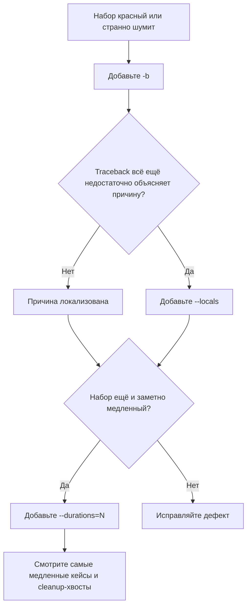

# Когда тесты не помогают, а мешают: как использовать `-b`, `--locals` и `--durations` в `unittest` для быстрой диагностики

Обычно про `unittest` говорят как про фреймворк запуска и проверки. Но на практике в момент падения важнее другое: насколько быстро Вы поймёте, **почему** упал тест, **что именно** он успел вывести и **какой участок набора** тормозит прогон. У стандартного CLI для этого есть три сильных флага: `-b/--buffer`, `--locals` и `--durations`. Они не меняют логику тестов, не требуют переписывать код и часто дают больше пользы, чем ещё один `print()` в случайном месте. В актуальной документации `unittest` эти опции описаны как штатная часть CLI: `-b` буферизует `stdout` и `stderr`, `--locals` показывает локальные переменные в traceback, а `--durations N` печатает `N` самых медленных тестов. По версиям это тоже важно: `-b` появился в Python 3.2, `--locals` — в 3.5, `--durations` — в 3.12. В Python 3.14 вывод `unittest` ещё и раскрашивается по умолчанию, поэтому ниже я буду показывать упрощённый монохромный вывод. ([Python documentation][1])

## Введение

Если смотреть на эти флаги по отдельности, они кажутся мелкими. Один “про консоль”, второй “про traceback”, третий “про время”. Но вместе они покрывают три типовых режима аварийной диагностики. `-b` отвечает на вопрос: “какой именно тест породил этот шум и стоит ли видеть вывод успешных тестов вообще?” `--locals` отвечает на вопрос: “какое состояние было в кадре в момент падения?” `--durations` отвечает на вопрос: “где именно набор теряет время?” Это и есть минимальный рабочий набор для triage без IDE, без внешних плагинов и без переписывания раннера. Если Вы запускаете тесты через CLI, это первое, что стоит держать под рукой. Сам `python -m unittest` без аргументов эквивалентен `python -m unittest discover`; если же Вам нужны параметры discovery вроде `-s`, `-p` или `-t`, субкоманду `discover` уже нужно вызывать явно. ([Python documentation][1])

Ниже — короткая карта темы. Она полезна именно как карта, а не как шпаргалка по синтаксису.

| Флаг              | Какой вопрос он решает             | Что реально меняется                                                              |
| ----------------- | ---------------------------------- | --------------------------------------------------------------------------------- |
| `-b` / `--buffer` | Откуда взялся консольный шум?      | Вывод успешных тестов пропадает, вывод упавших остаётся и прикладывается к ошибке |
| `--locals`        | Какое состояние привело к падению? | Traceback начинает включать локальные переменные                                  |
| `--durations N`   | Какие тесты самые медленные?       | В конце прогона печатается список самых медленных кейсов                          |

Эта таблица напрямую следует из CLI-документации `unittest` и из API `TextTestRunner` / `TestResult`: у раннера есть параметры `buffer`, `tb_locals` и `durations`, а `TestProgram` CLI передаёт их в runner при запуске. ([Python documentation][1])

Чтобы разговор не остался абстрактным, дальше будем опираться на один маленький демонстрационный файл. Он специально собран так, чтобы показать все три флага на одном наборе.

```python
# test_cli_diagnostics_demo.py
import sys
import time
import unittest


def normalize_user(payload: dict) -> dict:
    user_id = payload["id"]
    raw_name = payload["name"]
    clean_name = raw_name.strip()
    min_length = 3

    if len(clean_name) < min_length:
        raise ValueError("name is too short")

    return {"id": user_id, "name": clean_name}


class TestCliDiagnosticsDemo(unittest.TestCase):
    def test_chatty_but_green(self):
        print("debug: entered happy path")
        print("debug: nothing is wrong", file=sys.stderr)
        self.assertTrue(True)

    def test_failure_after_output(self):
        print("stdout: loaded fixture")
        print("stderr: legacy warning", file=sys.stderr)
        self.assertEqual(2 + 2, 5)

    def test_error_with_state(self):
        payload = {"id": 17, "name": " x "}
        normalize_user(payload)

    def test_slow_network_like_case(self):
        time.sleep(0.120)
        self.assertTrue(True)

    def test_fast_body_but_slow_cleanup(self):
        self.addCleanup(time.sleep, 0.080)
        self.assertTrue(True)
```

Этот пример не претендует на “правильный стиль прод-кода”. Его цель другая: на одном файле показать, что шумный green-test, обычный failure, error с локальным состоянием и медленный cleanup диагностируются разными флагами и разными слоями вывода. Для `--durations` здесь особенно важен `addCleanup`: документация `unittest` отдельно подчёркивает, что длительность теста включает выполнение cleanup-функций, а не только тело тестового метода. ([Python documentation][1])

## Сначала уберите шум: `-b` / `--buffer`

В официальной CLI-документации `unittest` флаг `-b/--buffer` описан очень прагматично: стандартные потоки `stdout` и `stderr` буферизуются во время прогона тестов; вывод успешных тестов отбрасывается; вывод теста, завершившегося failure или error, выводится обычным образом и добавляется к сообщению об ошибке. Это же поведение отражено и в атрибуте `TestResult.buffer`: если он истинный, `sys.stdout` и `sys.stderr` буферизуются между `startTest()` и `stopTest()`, а накопленный вывод публикуется только для ошибок и падений. ([Python documentation][1])

Запуск без буферизации обычно выглядит так:

```bash
python -m unittest test_cli_diagnostics_demo.py
```

Упрощённо вывод будет похож на такой:

```text
debug: entered happy path
debug: nothing is wrong
.stdout: loaded fixture
stderr: legacy warning
FE..
======================================================================
FAIL: test_failure_after_output (...)
...
======================================================================
ERROR: test_error_with_state (...)
...
```

Это терпимо на пяти тестах. На пятистах — уже нет. Самая неприятная часть такого вывода в том, что строки от passing-тестов смешиваются с действительно полезным выводом от failing-теста. В наборе появляется консольный мусор, но его источник не всегда виден с первого взгляда. И именно эту проблему решает `-b`. Семантика тут очень проста: passing-тест перестаёт печатать в реальную консоль, failing-тест — нет. ([Python documentation][1])

Теперь тот же набор с буферизацией:

```bash
python -m unittest -b test_cli_diagnostics_demo.py
```

Упрощённо результат будет ближе к такому:

```text
.FE..
======================================================================
FAIL: test_failure_after_output (...)
...
Stdout:
stdout: loaded fixture

Stderr:
stderr: legacy warning
...
```

Заметьте, что строки из `test_chatty_but_green` исчезли полностью. Это не случайный побочный эффект, а прямой контракт флага: вывод успешных тестов discard’ится. А вот вывод упавшего теста не просто остаётся — он встраивается в текст failure/error. Для CI это особенно удобно: даже если общий поток логов свёрнут, нужный `stdout` / `stderr` виден прямо в теле ошибки. ([Python documentation][1])

На уровне реализации этот механизм устроен не “магически”, а довольно буквально. В `unittest.result.TestResult` при `buffer=True` раннер временно подменяет `sys.stdout` и `sys.stderr` на `io.StringIO()` между `startTest()` и `stopTest()`. Если тест завершился failure, error или неуспешным `subTest`, `_mirrorOutput` выставляется в `True`; после этого буфер либо приклеивается к тексту traceback, либо дублируется в исходные потоки с заголовками `Stdout:` и `Stderr:`. Именно поэтому буферизуются прежде всего обычные `print()` и записи в эти Python-потоки. ([GitHub][2])

Из этой реализации следует ещё один важный инженерный вывод. `-b` не подавляет собственный служебный вывод `TextTestRunner`: у раннера есть отдельный stream, который по умолчанию создаётся из `sys.stderr` в момент инициализации `TextTestRunner`, а буферизация тестового вывода делается уже позже, на уровне `TestResult`. Поэтому строки вида `F`, `E`, summary и traceback не исчезают; исчезает только “побочный” `stdout`/`stderr` конкретных тестов. Это удобно: флаг режет шум, но не ослепляет сам раннер. ([Python documentation][1])

Практически это означает очень простое правило. Если набор стал шумным из-за legacy `print()`, временной отладки или chatty helper’ов, первым движением почти всегда должен быть `-b`. Он особенно полезен в двух ситуациях. Первая — когда green-тесты засоряют лог и мешают читать единственное настоящее падение. Вторая — когда Вы хотите быстро понять, относится ли какой-то загадочный `stderr` вообще к failing-тесту или он печатается в полностью успешной ветке. В обоих случаях `-b` даёт выигрыш без переписывания ни одного теста. Это не “косметика вывода”, а быстрый способ поднять сигнал/шум. ([Python documentation][1])

## Потом раскройте состояние: `--locals`

Если `-b` отвечает на вопрос “что этот тест напечатал?”, то `--locals` отвечает на вопрос “с какими значениями он упал?”. Официальное описание в CLI короткое: `--locals` показывает локальные переменные в traceback. На уровне API этому соответствует `tb_locals=True` у `TextTestRunner`, а в `TestResult` есть атрибут `tb_locals`, который включает показ locals при форматировании traceback. В исходниках это делается через `traceback.TracebackException(..., capture_locals=self.tb_locals, compact=True)`. Иными словами, `unittest` не запускает отдельный отладчик, а просто строит traceback так, чтобы в нём оказались локальные переменные кадров. ([Python documentation][1])

Запуск для нашей демо-ошибки выглядит так:

```bash
python -m unittest --locals test_cli_diagnostics_demo.py
```

Упрощённый фрагмент traceback для `test_error_with_state` станет длиннее примерно так:

```text
ERROR: test_error_with_state (...)
Traceback (most recent call last):
  File ".../test_cli_diagnostics_demo.py", line 29, in test_error_with_state
    normalize_user(payload)
    payload = {'id': 17, 'name': ' x '}
  File ".../test_cli_diagnostics_demo.py", line 12, in normalize_user
    raise ValueError("name is too short")
    user_id = 17
    raw_name = ' x '
    clean_name = 'x'
    min_length = 3
ValueError: name is too short
```

Здесь важно не только то, что traceback стал длиннее. Важнее то, что он стал **объясняющим**. Без `--locals` Вы знаете только тип ошибки и путь выполнения. С `--locals` Вы уже видите конкретное состояние: какой был `payload`, во что превратился `raw_name`, чему равнялся `min_length`. Для pure-function тестов, парсеров, нормализаторов, валидации и ветвящейся бизнес-логики это часто дешевле и полезнее, чем ставить точку останова или добавлять одноразовые `print()`. ([Python documentation][1])

Механически `traceback` делает здесь две вещи. Во-первых, `TracebackException` умеет работать с `capture_locals=True`. Во-вторых, документация `traceback` прямо говорит, что при включённом `capture_locals` локальные переменные попадают в traceback, причём в `StackSummary` они сохраняются как объектные представления, то есть через `repr()` значений. Это очень полезная деталь: Вы видите не “живые объекты” и не интерактивный REPL, а уже подготовленное текстовое представление состояния. ([Python documentation][3])

У этого есть и практические последствия. Раз в traceback попадают представления locals, вывод почти неизбежно разрастается. Если в локальных переменных лежат большие словари, ORM-объекты, токены, пароли или просто длинные payload’ы, `--locals` сделает падение гораздо информативнее, но и гораздо тяжелее для чтения. Это не отдельное ограничение `unittest`, а прямое следствие того, что traceback начинает показывать repr локальных значений. Поэтому в локальном triage флаг очень полезен, а в CI-логах с чувствительными данными его стоит включать осознанно. Этот вывод — инженерное следствие механики `capture_locals`, а не отдельная специальная оговорка CLI. ([Python documentation][3])

Есть и тонкая, но важная деталь для любителей точного поведения. В `unittest` locals добавляются не к “сырому” traceback со всеми внутренними кадрами раннера. Сначала результат очищает traceback от служебных уровней `unittest`, а затем уже передаёт его в `TracebackException` с `capture_locals=self.tb_locals`. Поэтому `--locals` обогащает уже очищенный traceback, а не превращает вывод в dump внутренних кадров самого раннера. Это одна из причин, почему флаг остаётся практичным даже на длинных стектрейсах. ([GitHub][2])

Отдельный нюанс появился в Python 3.12 на стороне модуля `traceback`: если при `capture_locals=True` какой‑то объект в locals ломается на `repr()`, это вторичное исключение больше не выбрасывается наружу вызывающему коду. Для диагностики это хорошая новость: включение `--locals` стало безопаснее в наборах, где в локальных переменных встречаются объекты с экзотическим `__repr__`. ([Python documentation][3])

## Наконец измерьте хвосты: `--durations`

Первые два флага помогают, когда набор красный и шумный. `--durations` нужен, когда набор зелёный или почти зелёный, но медленный. В CLI `unittest` он описан как `--durations N`: показать `N` самых медленных тест-кейсов, а если `N=0`, показать все. Эта опция появилась только в Python 3.12, и это важно для совместимости: если проект живёт на 3.11 и ниже, такого флага просто нет. В `TestResult` для этого появился атрибут `collectedDurations`, а в `TextTestRunner` — параметр `durations`. ([Python documentation][1])

Запуск на нашей демонстрации:

```bash
python -m unittest --durations=3 test_cli_diagnostics_demo.py
```

В упрощённом виде конец прогона будет выглядеть примерно так:

```text
Slowest test durations
----------------------------------------------------------------------
0.120s     test_slow_network_like_case (__main__.TestCliDiagnosticsDemo)
0.080s     test_fast_body_but_slow_cleanup (__main__.TestCliDiagnosticsDemo)
0.000s     test_failure_after_output (__main__.TestCliDiagnosticsDemo)

(durations < 0.001s were hidden; use -v to show these durations)
----------------------------------------------------------------------
Ran 5 tests in 0.203s
```

Сразу видно две вещи. Первая: список отсортирован по убыванию времени. Вторая: в нём оказался тест с быстрым телом, но медленным cleanup. И это не совпадение. По документации `addDuration(test, elapsed)` получает время теста в секундах **вместе** с cleanup-функциями, а в исходниках раннера durations печатаются из уже собранного `result.collectedDurations`. Значит, `--durations` показывает не только “медленные `sleep()` в теле теста”, но и хвосты из `addCleanup()`, `tearDown()`-подобных действий и вообще любой медленной финализации кейса. Для реальных наборов это крайне полезно: очень часто медленным оказывается не сам assert, а уборка ресурсов. ([Python documentation][1])

Если посмотреть в `TextTestRunner._printDurations()`, станет видно ещё несколько точных деталей поведения. Раннер сортирует `result.collectedDurations` по убыванию elapsed time. Если `self.durations > 0`, он берёт только первые `N`; если `self.durations == 0`, выводит все. При этом в невverbose режиме, то есть при `verbosity < 2`, все durations меньше `0.001` секунды скрываются, и раннер прямо пишет подсказку “use -v to show these durations”. Это означает, что связка `--durations=0 -v` даёт максимально полный список, а `--durations=10` без `-v` удобнее как фильтр по действительно заметным хвостам. ([Python documentation][1])

Это хороший момент, чтобы не перепутать назначение инструмента. `--durations` — не микробенчмарк и не профилировщик. Он измеряет elapsed time тест-кейсов в условиях конкретного прогона раннера и именно в той форме, в какой `unittest` их выполняет, включая cleanup. Его сила не в абсолютной точности до микросекунд, а в быстрой локализации хвостов: какие именно тесты системно выбиваются вверх и где сначала копать. Такой способ чтения прямо вытекает из того, что раннер собирает durations по тест-кейсам и печатает их уже после завершения прогона. ([Python documentation][1])

Есть и важный мост между CLI и API. Внутри `unittest.main` CLI-аргументы `buffer`, `tb_locals` и `durations` передаются в `TextTestRunner`; если раннер пользовательский и не принимает эти новые параметры, исходники пытаются откатиться на более старую сигнатуру. Это полезно знать, если Вы запускаете `unittest` не только из консоли, но и через кастомный runner в проекте или IDE: флаг `--durations=10` — это не отдельная магия командной строки, а CLI-обёртка над параметром `TextTestRunner(durations=10)`. ([Python documentation][1])

## Как эти три флага складываются в реальный triage

Отдельно каждый флаг решает свою задачу. Вместе они образуют очень хороший маршрут диагностики. Сначала Вы убираете шум, потом раскрываете состояние, потом ищете медленные хвосты. Для командной работы это особенно удобно, потому что маршрут воспроизводим: любой участник может повторить его из одной команды без локальной IDE-конфигурации. CLI здесь важен именно как общий, дешёвый и предсказуемый интерфейс. ([Python documentation][1])



На практике рабочая команда часто выглядит так:

```bash
python -m unittest discover -s tests -b --locals --durations=10 -v
```

Это полезная “широкая сеть” для локального triage: `discover` нужен, если Вы ещё и настраиваете `-s/-p/-t`; `-b` режет шум passing-тестов; `--locals` расширяет traceback состоянием; `--durations=10` печатает хвосты; `-v` помогает читать имена тестов и показывает даже очень маленькие durations, которые иначе были бы скрыты. Возможность комбинировать эти флаги напрямую вытекает из того, что CLI передаёт их как независимые параметры раннеру. ([Python documentation][1])

Если же нужен более узкий и дешёвый проход, полезно держать в голове три коротких режима. Для шумного but otherwise понятного падения — `-b`. Для красного теста с недостаточным traceback — `--locals`. Для жалоб на медленный прогон — `--durations=N`, а если подозреваете, что мелких хвостов много, добавьте `-v`. Это не единственно возможная стратегия, но она хорошо совпадает с архитектурой самих флагов и с тем, как они встроены в `TextTestRunner`. ([Python documentation][1])

## Три частые ошибки чтения этих флагов

Первая ошибка — думать, что `-b` “показывает вывод failing-тестов лучше”. Технически он делает не только это. Он ещё и **прячет** вывод passing-тестов. Поэтому полезность флага именно в селективности: Вы сокращаете консольный шум и одновременно приклеиваете relevant output к failure/error. Если набор и так почти бесшумен, `-b` ничего кардинально не меняет. Но на chatty-наборах разница обычно очень заметна. ([Python documentation][1])

Вторая ошибка — воспринимать `--locals` как встроенный debugger. Это не так. `unittest` не даёт интерактивного доступа к объектам, не останавливает исполнение и не открывает REPL. Он форматирует traceback через `TracebackException` с `capture_locals=True`, то есть добавляет в печатный вывод представления локальных значений. Для triage этого часто достаточно, но это всё же форматирование исключения, а не live-debugging session. ([GitHub][2])

Третья ошибка — читать `--durations` как “сколько времени занял именно тестовый метод”. По документации и по исходникам это неверно: elapsed time включает cleanup-функции, а список строится из durations уже завершённых кейсов. Поэтому если медленным оказывается тест с быстрым телом, это не баг отчёта. Часто это как раз полезная находка: тормозит не основная логика, а финализация ресурсов. ([Python documentation][1])

## Заключение

Флаги `-b`, `--locals` и `--durations` не делают `unittest` “новым фреймворком”. Они делают гораздо более важную вещь: увеличивают ценность уже существующего падения. `-b` превращает зашумлённый консольный поток в релевантный вывод конкретного failing-теста. `--locals` превращает голый traceback в объяснение состояния. `--durations` превращает ощущение “набор почему‑то медленный” в конкретный список хвостов. Все три возможности встроены в стандартный runner `unittest`, официально документированы и прямо поддерживаются CLI. ([Python documentation][1])

Если свести тему к одному практическому правилу, оно будет таким: **когда тесты падают, сначала повышайте качество сигнала, а не количество `print()`**. В `unittest` для этого уже есть базовый инструментарий. Сначала уберите шум через `-b`. Затем, если причина всё ещё неочевидна, включите `--locals`. И если набор раздражает не только падениями, но и временем, посмотрите `--durations`. Это простой маршрут, но он опирается на реальную механику `TextTestRunner`, а значит работает предсказуемо и воспроизводимо. ([Python documentation][1])

## Дополнительные материалы

Официальная документация `unittest` — разделы: Command-line options, `TestResult`, `TextTestRunner`, `unittest.main()`. ([Python documentation][1])

Официальная документация `traceback` — разделы: `TracebackException`, `capture_locals`, `StackSummary.extract()`. ([Python documentation][2])

Изменения в Python 3.12 — заметка про добавление `--durations` в `unittest`. ([Python documentation][3])

Исходный код `unittest.runner` в CPython — полезен для понимания того, как печатаются durations и где именно раннер сортирует и скрывает очень маленькие значения. ([GitHub][4])

Исходный код `unittest.result` в CPython — полезен для понимания того, как работает `-b`, как подменяются `sys.stdout` / `sys.stderr` и как `tb_locals` передаётся в `TracebackException`. ([GitHub][5])

[1]: https://docs.python.org/3/library/unittest.html "unittest — Unit testing framework — Python documentation"
[2]: https://docs.python.org/3/library/traceback.html "traceback — Print or retrieve a stack traceback — Python documentation"
[3]: https://docs.python.org/3/whatsnew/3.12.html "What’s New In Python 3.12 — Python documentation"
[4]: https://github.com/python/cpython/blob/main/Lib/unittest/runner.py "cpython/Lib/unittest/runner.py at main · python/cpython · GitHub"
[5]: https://github.com/python/cpython/blob/main/Lib/unittest/result.py "cpython/Lib/unittest/result.py at main · python/cpython · GitHub"
[1]: https://docs.python.org/3/library/unittest.html "unittest — Unit testing framework — Python 3.14.3 documentation"
[2]: https://github.com/python/cpython/blob/main/Lib/unittest/result.py "https://github.com/python/cpython/blob/main/Lib/unittest/result.py"
[3]: https://docs.python.org/3/library/traceback.html "https://docs.python.org/3/library/traceback.html"
