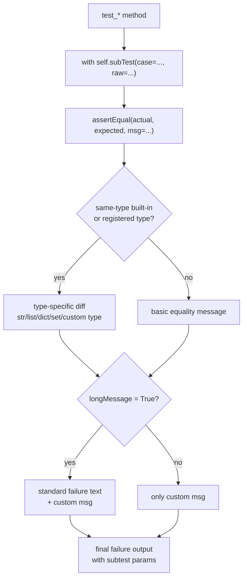

# Падение, из которого всё понятно: как использовать `subTest`, осмысленные `assert`-сообщения и минимум шума в `unittest`

Тест становится полезным не в тот момент, когда он просто красный. Он становится полезным, когда из его падения сразу видно, **какой сценарий сломан, в чём именно расхождение и какая бизнес-идея нарушена**. В `unittest` для этого не нужен внешний плагин. Основные инструменты уже есть в стандартной библиотеке: `subTest()` для пометки близких сценариев, `msg=` и `longMessage` для управления текстом ошибки, типоспецифические `assert*`-методы для встроенных diff и `maxDiff` для контроля длины этих diff. ([Python documentation][1])

## Введение

Тема полезных сообщений падения на первый взгляд выглядит второстепенной. Кажется, что главное — правильно проверить результат, а текст ошибки уже как-нибудь приложится. На практике всё наоборот. Если тест падает сообщением вроде `False is not true`, Вы тратите время на повторный запуск, `print()`, дебаггер и ручное воспроизведение. Если тот же тест падает с меткой подслучая, коротким бизнес-комментарием и точным diff, большая часть диагностики уже сделана за Вас. Именно поэтому в `unittest` стоит думать не только о том, **что** Вы проверяете, но и о том, **как будет выглядеть падение**, когда проверка не пройдёт. ([Python documentation][1])

> Хорошее сообщение падения отвечает на три вопроса: какой кейс сломан, что именно не совпало и почему эта проверка вообще важна.

## Начинается всё с выбора assert: `assertTrue` против осмысленного сравнения

Официальная документация `unittest` формулирует разницу очень жёстко. `assertTrue(x)` проверяет только то, что `bool(x) is True`. `assertEqual(a, b)` делает больше: если оба значения одного типа и этот тип входит в набор поддерживаемых встроенных типов — например, `list`, `tuple`, `dict`, `set`, `frozenset` или `str` — `unittest` автоматически выбирает типоспецифическую функцию сравнения, чтобы построить более полезное сообщение об ошибке. Для строк по умолчанию используется `assertMultiLineEqual()`, для последовательностей и словарей — методы, которые показывают различия, а не просто факт неравенства. ([Python documentation][1])

Это означает очень простой практический вывод. Если Вы пишете так:

```python
import unittest


class TestProfile(unittest.TestCase):
    def test_profile_snapshot_bad(self):
        actual = {"id": 7, "name": " Alice ", "role": "admin"}
        expected = {"id": 7, "name": "Alice", "role": "admin"}

        self.assertTrue(actual == expected)
```

то в случае падения Вы почти наверняка получите слишком общий сигнал. Внутри `assertTrue` нет знания о структуре словаря. Для него есть только булево выражение, которое оказалось ложным. В CPython это действительно реализовано так: если выражение ложно, сообщение собирается по шаблону `"<repr(expr)> is not true"`. Когда `expr` уже превратился в `False`, Вы теряете весь контекст структуры данных. ([Python documentation][1])

Гораздо сильнее писать так:

```python
import unittest


class TestProfile(unittest.TestCase):
    def test_profile_snapshot_good(self):
        actual = {"id": 7, "name": " Alice ", "role": "admin"}
        expected = {"id": 7, "name": "Alice", "role": "admin"}

        self.assertEqual(actual, expected)
```

Теперь `unittest` знает, что Вы сравниваете два словаря одного типа, и переключается на словарное сравнение с полезным diff. Для списков и кортежей он показывает только различия между последовательностями, для множественных строк — diff по строкам, а для строк как типа по умолчанию использует `assertMultiLineEqual()`. То есть Вы не просто делаете тест “более питоническим”; Вы сознательно выбираете assertion, которая умеет строить хороший текст падения для конкретной структуры данных. ([Python documentation][1])

Это не означает, что `assertTrue()` плох сам по себе. Он уместен там, где предмет проверки действительно булев: например, `is_valid_token()` возвращает `True` или `False`, и никакой дополнительной структуры у результата нет. Но как только Вы проверяете равенство, вхождение, тип, пустоту, наличие ключа или содержимое контейнера, лучше выбирать assert, которая называет отношение явно: `assertEqual`, `assertIn`, `assertIsNone`, `assertDictEqual`, `assertListEqual` и так далее. Название assert тогда становится частью будущего сообщения об ошибке. ([Python documentation][1])

## Хороший `msg=` не дублирует diff, а добавляет смысл

Все assert-методы в `unittest` принимают аргумент `msg`. Документация подчёркивает это отдельно. Но здесь есть важная деталь, которую легко упустить: у `TestCase` есть атрибут `longMessage`, и по умолчанию он равен `True`. Это значит, что пользовательское сообщение не заменяет встроенное, а **добавляется к нему**. Когда `longMessage=False`, наоборот, Ваш `msg` заменяет стандартный текст падения. Внутренний метод `_formatMessage()` в CPython делает это буквально: при `longMessage=True` он склеивает стандартное сообщение и пользовательское через `:`. ([Python documentation][1])

На практике это очень полезное поведение. Вот хороший шаблон:

```python
import unittest


class TestPricing(unittest.TestCase):
    def test_vip_discount_order(self):
        actual_total = 100
        expected_total = 90

        self.assertEqual(
            actual_total,
            expected_total,
            msg="VIP-скидка должна применяться после валидации купона",
        )
```

В этом примере встроенное сообщение ответит на вопрос **что именно не совпало** — `100 != 90`. А Ваш `msg` ответит на вопрос **какое бизнес-правило стоит за этой проверкой**. Получается двухслойное падение: сначала факт расхождения, потом короткий смысл. Именно в таком режиме `msg=` наиболее полезен. ([Python documentation][1])

Самая частая ошибка здесь — попытка дублировать в `msg` сами значения `actual` и `expected`, которые `unittest` уже и так покажет. Когда `longMessage=True`, такой `msg` только раздувает вывод. В итоге Вы получаете не больше пользы, а больше шума. Поэтому у хорошего пользовательского сообщения обычно одна задача: добавить доменный смысл, который нельзя автоматически вывести из diff. Например, “публичный JSON-контракт”, “сначала нормализация, потом округление”, “идентификатор не должен зависеть от регистра”. Всё остальное встроенные assert-методы уже умеют сказать сами. ([Python documentation][1])

Иногда возникает желание поставить `self.longMessage = False`, чтобы оставить только свой текст. Документация это разрешает: значение можно поменять на уровне класса или отдельно внутри тестового метода, и перед каждым тестом настройка сбрасывается. Но в большинстве реальных тестов это не улучшает диагностику, а обедняет её. Выигрыш по шуму получается сомнительным, а встроенный diff теряется полностью. Поэтому `longMessage=False` стоит включать только тогда, когда Вы сознательно строите собственное, более полезное сообщение и готовы заменить стандартное целиком. ([Python documentation][1])

## `subTest()` нужен не для красоты, а чтобы не терять сценарии

`subTest(msg=None, **params)` — это context manager, который превращает фрагмент одного тестового метода в отдельный подслучай. В документации прямо сказано, что он полезен, когда между тестами есть очень небольшие различия, например параметры. `msg` и `params` могут быть любыми значениями и показываются, если подслучай падает. Один тестовый метод может содержать сколько угодно `subTest`-блоков, и они могут быть вложенными. В разделе What’s New for Python 3.4 `subTest()` описан как способ динамически порождать отдельно идентифицируемые подслучаи, которые продолжают выполняться даже тогда, когда некоторые из них падают. ([Python documentation][1])

Представьте обычный табличный тест на нормализацию логина:

```python
import unittest


def normalize_login(raw: str) -> str:
    return raw.strip().lower()


class TestNormalizeLogin(unittest.TestCase):
    def test_examples(self):
        cases = [
            {"case": "plain", "raw": "Alice", "expected": "alice"},
            {"case": "spaces", "raw": "  Alice  ", "expected": "alice"},
            {"case": "upper", "raw": "ADMIN", "expected": "admin"},
            {"case": "broken case", "raw": " Bob ", "expected": "bbo"},
        ]

        for case in cases:
            with self.subTest(case=case["case"], raw=case["raw"]):
                self.assertEqual(
                    normalize_login(case["raw"]),
                    case["expected"],
                    msg="логин должен обрезать внешние пробелы и приводиться к lower-case",
                )
```

Если такой тест падает на одном кейсе, Вы получаете не безликое “что-то в цикле пошло не так”, а сообщение с параметрами подслучая. Оно будет выглядеть примерно так:

```text
FAIL: test_examples (...) (case='broken case', raw=' Bob ')
AssertionError: 'bob' != 'bbo'
- bob
+ bbo
 : логин должен обрезать внешние пробелы и приводиться к lower-case
```

Здесь важно то, что диагностика стала адресной. Видно, **какой именно кейс** упал, а не только имя общего тестового метода. Это и есть главная ценность `subTest()`. Документация показывает тот же эффект на цикле по числам: без `subTest()` выполнение остановится на первом падении, а значение параметра не будет выведено прямо в заголовке failure; с `subTest()` у Вас будут отдельные сообщения вроде `(i=1)`, `(i=3)`, `(i=5)`. ([Python documentation][1])

Здесь есть и ещё одна важная вещь для темы “минимум шума”. По документации `TestResult.addSubTest()` успешные подслучаи по умолчанию не делают ничего, а упавшие подслучаи записываются как обычные failures. То есть `subTest()` хорошо масштабируется: Вы можете прогнать десятки или сотни близких комбинаций, не засоряя вывод сообщениями о каждом удачном кейсе. В обычном сценарии Вы видите только проблемы, но эти проблемы уже снабжены параметрами. Именно поэтому `subTest()` почти всегда лучше ручных `print(case)` внутри цикла. ([Python documentation][1])

Важное ограничение тоже стоит проговорить. `subTest()` хорош там, где тело проверки одно и то же, а меняются только входы или небольшие условия. Если у сценариев разный `setUp`, разная фикстура, разная бизнес-идея или хочется отдельное имя для каждого кейса, лучше писать отдельные `test_*`-методы. `subTest()` не заменяет декомпозицию набора; он улучшает диагностику внутри одного действительно однотипного теста.

## Шум чаще всего убирается не сокращением текста, а правильным diff

Когда говорят “минимум шума”, легко впасть в крайность и начать обрезать сообщения. В `unittest` чаще работает другой подход: **не прятать diff, а строить его правильным методом и ограничивать только там, где он действительно разрастается**. Для строк есть `assertMultiLineEqual()`, для последовательностей — `assertSequenceEqual()` и её специализированные варианты, для словарей — `assertDictEqual()`. Документация прямо говорит, что эти методы строят сообщения с различиями, а для списков и кортежей показывают только различия между ними. Через обычный `assertEqual()` это тоже работает автоматически, если типы совпадают и входят в список поддерживаемых. ([Python documentation][1])

Хороший пример — проверка большого JSON-подобного словаря:

```python
import unittest


class TestContract(unittest.TestCase):
    def test_response_contract(self):
        actual = {
            "id": 7,
            "name": "Alice",
            "role": "admin",
            "permissions": ["read", "write"],
            "meta": {"source": "api", "version": 2},
        }
        expected = {
            "id": 7,
            "name": "Alice",
            "role": "admin",
            "permissions": ["read", "write", "delete"],
            "meta": {"source": "api", "version": 3},
        }

        self.assertDictEqual(
            actual,
            expected,
            msg="публичный JSON-ответ не должен менять контракт без явной миграции",
        )
```

Если такой тест падает, Вам не нужно вручную печатать весь `actual`, весь `expected` и потом глазами выискивать две отличающиеся ветки. `assertDictEqual()` уже делает полезную работу: оно строит diff словарей. А пользовательское сообщение сверху даёт только бизнес-контекст. Это и есть хороший баланс между полнотой и шумом. ([Python documentation][1])

Но бывают случаи, когда diff действительно огромен: snapshot-тесты, длинные многострочные строки, большие payload’ы, разветвлённые конфиги. Для этого у `TestCase` есть `maxDiff`. Документация фиксирует, что по умолчанию он равен `80*8` символам, влияет на методы, которые выводят diff — `assertSequenceEqual()` и методы на его основе, `assertDictEqual()` и `assertMultiLineEqual()` — а значение `None` снимает лимит полностью. В исходниках CPython есть даже отдельное сообщение для усечённого diff: “Diff is X characters long. Set self.maxDiff to None to see it.” ([Python documentation][1])

Это значит, что такой тест вполне легален и часто полезен:

```python
import unittest


class TestLargeSnapshot(unittest.TestCase):
    def test_snapshot(self):
        self.maxDiff = None

        actual = {
            "users": [{"id": i, "active": True} for i in range(5)],
            "meta": {"version": 2, "source": "api"},
        }
        expected = {
            "users": [{"id": i, "active": True} for i in range(5)],
            "meta": {"version": 1, "source": "api"},
        }

        self.assertEqual(
            actual,
            expected,
            msg="версия схемы в snapshot должна совпадать с зафиксированным контрактом",
        )
```

Но здесь важно не превратить `maxDiff=None` в глобальную привычку. Полный diff полезен, когда он действительно помогает локализовать расхождение. Если расхождение почти всегда маленькое, дефолтный лимит сохраняет читаемость лучше. То есть “минимум шума” в этой части достигается не тотальным обрезанием, а тем, что Вы открываете полный diff только там, где он действительно даёт сигнал.

## Для своих типов есть отдельный путь: `addTypeEqualityFunc()`

До этого момента мы говорили о встроенных типах. Но у прикладного кода почти всегда есть доменные объекты: `Money`, `UserSnapshot`, `InvoiceLine`, `RateLimit`, `ProductVersion`. Документация `unittest` прямо говорит, что `assertEqual()` может использовать не только встроенные типоспецифические сравнения, но и пользовательские методы, зарегистрированные через `addTypeEqualityFunc()`. В исходниках `TestCase` это описано ещё яснее: механизм нужен, чтобы `TestCase`-подклассы могли регистрировать свои функции сравнения и выдавать более приятные сообщения об ошибке для собственных типов. ([Python documentation][1])

Представьте простой доменный объект:

```python
from dataclasses import dataclass
import unittest


@dataclass
class Money:
    amount: int
    currency: str


class DomainTestCase(unittest.TestCase):
    def setUp(self):
        self.addTypeEqualityFunc(Money, self.assertMoneyEqual)

    def assertMoneyEqual(self, first, second, msg=None):
        if (first.amount, first.currency) != (second.amount, second.currency):
            standard = (
                f"Money differs: amount {first.amount} != {second.amount}, "
                f"currency {first.currency!r} != {second.currency!r}"
            )
            if msg is not None:
                standard = f"{standard} : {msg}"
            raise self.failureException(standard)


class TestPrice(DomainTestCase):
    def test_tariff_currency(self):
        self.assertEqual(
            Money(100, "USD"),
            Money(100, "EUR"),
            msg="тариф должен оставаться в валюте публичного прайса",
        )
```

Зачем это нужно, если `dataclass` и так имеет вменяемый `repr`? Затем, что доменный diff почти всегда хочется видеть в терминах значимых полей, а не в виде общего `Money(amount=100, currency='USD') != Money(amount=100, currency='EUR')`. `addTypeEqualityFunc()` позволяет вложить в сообщение именно тот уровень детализации, который полезен для Вашего предметного кода. И самое главное — после регистрации Вы продолжаете писать обычное `self.assertEqual(...)`. То есть тест остаётся коротким, а падение становится богаче. ([Python documentation][1])

Этот приём особенно полезен там, где стандартный `repr` объекта слишком шумный: много технических полей, вложенные структуры, служебные UUID, timestamps, внутренние флаги. Если их выводить целиком в каждом падении, полезный сигнал тонет. Типоспецифическая функция равенства решает это аккуратно: Вы оставляете в failure только те поля, которые действительно важны для смысла сравнения.

## Все слои вместе: как строится действительно полезное падение

Когда тест устроен хорошо, сообщение об ошибке собирается не из одной детали, а из нескольких слоёв. Подслучай отвечает на вопрос “какой именно набор входов сломан”. Типоспецифический assert отвечает на вопрос “что конкретно не совпало”. Пользовательское `msg=` отвечает на вопрос “какое бизнес-правило стоит за этой проверкой”. А `longMessage=True` позволяет эти слои не выбирать, а сложить вместе. Это не специальная магия, а нормальная композиция штатных механизмов `unittest`. ([Python documentation][1])



На практике это может выглядеть так:

```python
import unittest


def normalize_profile(payload: dict) -> dict:
    return {
        "id": payload["id"],
        "name": payload["name"].strip(),
        "role": payload["role"].lower(),
    }


class TestNormalizeProfile(unittest.TestCase):
    """Проверяем публичный контракт нормализации профиля."""

    def test_examples(self):
        cases = [
            {
                "case": "trim and lower",
                "payload": {"id": 1, "name": " Alice ", "role": "ADMIN"},
                "expected": {"id": 1, "name": "Alice", "role": "admin"},
            },
            {
                "case": "broken expectation",
                "payload": {"id": 2, "name": " Bob ", "role": "MANAGER"},
                "expected": {"id": 2, "name": "Bbo", "role": "manager"},
            },
        ]

        for case in cases:
            with self.subTest(case=case["case"], payload=case["payload"]):
                self.assertEqual(
                    normalize_profile(case["payload"]),
                    case["expected"],
                    msg="normalize_profile() не должен менять публичный контракт ответа",
                )
```

Если такой тест падает, у Вас одновременно есть имя общего теста, метка подслучая, параметры, diff словаря и короткое бизнес-сообщение. Это и есть целевой уровень качества. Вам уже не нужно гадать, в каком кейсе ошибка, не нужно руками печатать payload и не нужно дублировать структуры в `msg=`. Каждый слой сообщения отвечает за свою задачу. ([Python documentation][1])

### Тихий, но полезный дополнительный слой — docstring теста

Есть ещё один инструмент, о котором часто забывают. У `TestCase.shortDescription()` стандартная реализация берёт первую строку docstring тестового метода. А `TextTestResult.getDescription()` в CPython использует `shortDescription()`, если descriptions включены. Это означает, что короткая первая строка docstring может дать дополнительный человеческий контекст к падению или verbose-выводу, не раздувая `msg=` в каждом assert. ([Python documentation][1])

Именно поэтому в длинных тестах и особенно в тестах с `subTest()` короткая docstring часто работает лучше, чем длинный комментарий в каждом assertion. Она добавляет общий смысл на уровень тестового метода, а `msg=` остаётся для локального бизнес-правила конкретной проверки. Это тихий способ сделать вывод понятнее, не превращая его в полотно текста. ([Python documentation][1])

## Где проходит граница между полезным текстом и шумом

В этой теме есть простое практическое правило: хороший текст ошибки **не пересказывает diff, а дополняет его**. Если встроенный assert уже показывает, что `role='admin'` превратился в `role='admni'`, не нужно второй раз писать это же в `msg=`. Если `subTest(case='upper role', raw='ADMIN')` уже показал имя сценария, не нужно дублировать его в каждой строке сообщения. Если `assertDictEqual()` уже строит разницу словарей, не нужно печатать оба словаря вручную. Документация и реализация `unittest` как раз дают для этого все нужные слои: встроенный diff, параметры подслучая и короткое пользовательское сообщение. ([Python documentation][1])

И наоборот, шум обычно появляется в трёх местах. Первое — слишком общий assert вроде `assertTrue(actual == expected)`, который теряет структуру. Второе — слишком подробный `msg=`, который повторяет уже встроенную информацию и делает падение вдвое длиннее. Третье — отсутствие `subTest()` в табличных сценариях, из-за чего первый упавший кейс обрывает цикл и скрывает остальные проблемные комбинации. Именно эти три места чаще всего и стоит чинить в первую очередь, когда Вы разбираете “плохие сообщения падения” в старом наборе тестов. ([Python documentation][1])

## Заключение

Полезное сообщение падения в `unittest` не появляется само. Оно проектируется так же, как проектируется тест. Сначала Вы выбираете assert, которая знает структуру данных и умеет строить хороший diff. Потом добавляете `msg=` не для повторения значений, а для короткого бизнес-контекста. Дальше, если внутри одного теста есть много близких сценариев, оборачиваете их в `subTest()`, чтобы падение сразу показывало параметры кейса и не обрывалось на первой ошибке. Если diff стал слишком большим, управляете им через `maxDiff`, а для своих типов — через `addTypeEqualityFunc()`. ([Python documentation][1])

В результате хороший failure сообщает не “что-то пошло не так”, а три конкретные вещи: **какой именно сценарий упал, где именно расхождение и какая идея системы нарушена**. Это и есть главное содержание темы 11.4. Не писать больше текста. Писать точнее. Использовать встроенные механизмы `unittest` так, чтобы падение само становилось коротким объяснением дефекта. ([Python documentation][1])

## Дополнительные материалы

Официальная документация `unittest`: разделы про `subTest()`, типоспецифические `assert*`-методы, `msg`, `longMessage`, `maxDiff` и `shortDescription()`. ([Python documentation][1])

What’s New in Python 3.4: заметка о появлении `subTest()` и о том, что один тестовый метод может порождать множество отдельно идентифицируемых подслучаев, которые продолжают выполняться даже при частичных падениях. ([Python documentation][2])

Исходный код CPython `Lib/unittest/case.py`: полезен, если хотите понять внутреннюю механику `_formatMessage()`, дефолт `longMessage=True`, значение `maxDiff = 80*8`, сообщение об усечённом diff и назначение `addTypeEqualityFunc()`. ([GitHub][3])

Исходный код CPython `Lib/unittest/runner.py`: полезен для понимания того, как `TextTestResult` собирает описание теста через `shortDescription()` и почему краткая первая строка docstring может улучшить читаемость verbose-вывода и текста падений. ([GitHub][4])

[1]: https://docs.python.org/3/library/unittest.html "https://docs.python.org/3/library/unittest.html"
[2]: https://docs.python.org/3/whatsnew/3.4.html "What’s New In Python 3.4 — Python 3.14.3 documentation"
[3]: https://github.com/python/cpython/blob/main/Lib/unittest/case.py?utm_source=chatgpt.com "cpython/Lib/unittest/case.py at main"
[4]: https://github.com/python/cpython/blob/main/Lib/unittest/runner.py "https://github.com/python/cpython/blob/main/Lib/unittest/runner.py"
