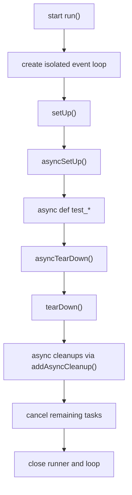

# Один тест — один цикл: как `IsolatedAsyncioTestCase` позволяет писать `async def test_*` и управляет `event loop` за Вас

Асинхронный код в тестах ломается не только на `await`. Он ломается на уровне жизненного цикла. Нужно где-то создать `event loop`, где-то его закрыть, не потерять `contextvars`, не смешать синхронные и асинхронные хуки, не оставить фоновые задачи жить после теста. Именно для этого в стандартной библиотеке Python с версии 3.8 существует `unittest.IsolatedAsyncioTestCase`: класс, который даёт писать coroutine-тесты как обычные `test_*`, но при этом поднимает и завершает цикл событий по правилам самого `unittest`. ([Python documentation][1])

## Введение

Если смотреть на `IsolatedAsyncioTestCase` слишком поверхностно, легко свести тему к одному тезису: “теперь можно писать `async def test_*`”. Это правда, но это только верхний слой. На самом деле класс решает более важную задачу: он задаёт **изолированный жизненный цикл теста**, в котором есть отдельный цикл событий, понятный порядок вызова `setUp` и `tearDown`, корректная работа с `contextvars`, отмена оставшихся задач в конце теста и, начиная с Python 3.13, настраиваемая фабрика цикла через `loop_factory`. Эта последняя деталь особенно важна сейчас, потому что сама policy system в `asyncio` в документации Python 3.14 уже помечена как deprecated и запланирована к удалению в Python 3.16. ([Python documentation][2])

> Ключевая мысль темы звучит так: `IsolatedAsyncioTestCase` — это не “синтаксический сахар над `await`”, а отдельный контракт выполнения теста, в котором `unittest` сам берёт на себя цикл событий и его очистку. Такой контракт прямо описан в документации класса и виден в реализации CPython. ([Python documentation][2])

## Почему обычного `TestCase` быстро становится мало

Теоретически корутину можно запустить и без `IsolatedAsyncioTestCase`: руками через `asyncio.run()`, через `loop.run_until_complete()` или через собственный тестовый хелпер. На простом примере это кажется безобидным. Но как только появляются асинхронная подготовка фикстуры, фоновая задача, доступ к текущему циклу из `setUp()` или несколько связанных top-level async-вызовов, Вы уже сами превращаетесь в автора раннера. А значит, сами отвечаете за создание цикла, его закрытие, контекст, отмену задач и согласованность хуков. `asyncio.Runner` как раз и существует для сценариев, где несколько async-вызовов должны выполняться в одном loop и одном `contextvars.Context`, а `IsolatedAsyncioTestCase` строится именно на этой идее. ([Python documentation][3])

С точки зрения самой стандартной библиотеки ответ давно дан. В What’s New for Python 3.8 прямо сказано, что `unittest` получил поддержку coroutine-тестов через `unittest.IsolatedAsyncioTestCase`. Документация самого класса формулирует это так же прямо: он предоставляет API, похожий на `TestCase`, и **принимает корутины как тестовые функции**. То есть это не “один из способов”, а штатный способ писать async-тесты на чистом `unittest`. ([Python documentation][1])

## Базовый рабочий пример: `async def test_*`

Самый маленький тест выглядит так:

```python
import asyncio
import unittest


class FakeUserClient:
    async def fetch_user(self, user_id: int) -> dict:
        await asyncio.sleep(0)
        return {"id": user_id, "name": "Alice"}


class TestFakeUserClient(unittest.IsolatedAsyncioTestCase):
    async def test_fetch_user(self):
        client = FakeUserClient()

        user = await client.fetch_user(7)

        self.assertEqual(user, {"id": 7, "name": "Alice"})
```

Здесь нет ручного `asyncio.run()`, нет явного создания loop, нет `run_until_complete()`. Вы просто пишете coroutine-тест, а `unittest` делает остальное. Это и есть базовый педагогический выигрыш `IsolatedAsyncioTestCase`: вы перестаёте думать о низкоуровневом запуске и начинаете думать о поведении тестируемого async-кода. Именно ради этого класс и был добавлен в стандартную библиотеку. ([Python documentation][1])

Но на этом уровне легко пропустить более важный факт. Документация `run()` у `IsolatedAsyncioTestCase` говорит не просто о “запуске корутины”, а о том, что для теста **создаётся новый event loop**, а в конце теста все задачи в этом loop отменяются. Если соединить это с обычной моделью `unittest`, где для каждого тестового метода создаётся отдельный экземпляр `TestCase`, Вы получаете практический вывод: в типичном наборе каждый `async def test_*` выполняется на своём loop и не должен протекать в соседний кейс через висящие задачи или текущее состояние цикла. ([Python documentation][2])

## Что именно гарантирует класс

Главная гарантия здесь — изоляция. На уровне публичной документации она выражена очень коротко: `run()` создаёт новый цикл событий для теста, собирает результат в `TestResult` и в конце отменяет все задачи в этом loop. Для async-тестов это огромный плюс: даже если внутри кейса кто-то успел запустить фоновые задачи через `asyncio.create_task()`, они не должны пережить сам тест. Это не освобождает Вас от аккуратной очистки ресурсов, но резко снижает риск того, что соседний тест унаследует “висящую” активность от предыдущего. ([Python documentation][2])

Из этого есть полезное практическое следствие. Если внутри теста Вы создаёте фоновые задачи, относитесь к ним как к сущностям, которые в конце кейса могут быть отменены. В документации `asyncio` по задачам отдельно сказано, что отмена приводит к `asyncio.CancelledError` в корутине при ближайшей возможности, а cleanup-логику лучше писать через `try/finally`. Это хорошо сочетается с моделью `IsolatedAsyncioTestCase`: если задача доживает до конца теста, framework её отменит, а Ваш код должен уметь корректно закрываться при отмене. ([Python documentation][2])

## Порядок вызова: где именно живёт async-часть теста

`IsolatedAsyncioTestCase` важен ещё и тем, что задаёт очень чёткий порядок хуков. В актуальной документации он описан не абстрактно, а на примере: `setUp()` вызывается первым, затем `asyncSetUp()`, потом сам `async def test_*`, после него `asyncTearDown()`, затем обычный `tearDown()`, а уже после этого выполняются async-cleanup-функции, добавленные через `addAsyncCleanup()`. В примере из документации итоговый список событий выглядит так: `["setUp", "asyncSetUp", "test_response", "asyncTearDown", "tearDown", "cleanup"]`. ([Python documentation][2])

Ниже — компактная карта жизненного цикла:

| Этап                | Тип метода          | Когда вызывается        | Важная деталь                    |
| ------------------- | ------------------- | ----------------------- | -------------------------------- |
| `setUp()`           | синхронный          | первым                  | обычный `TestCase`-хук           |
| `asyncSetUp()`      | асинхронный         | после `setUp()`         | вызывается прямо перед тестом    |
| `async def test_*`  | асинхронный         | после `asyncSetUp()`    | выполняется в изолированном loop |
| `asyncTearDown()`   | асинхронный         | сразу после теста       | вызывается до `tearDown()`       |
| `tearDown()`        | синхронный          | после `asyncTearDown()` | обычный `TestCase`-хук           |
| `addAsyncCleanup()` | асинхронный cleanup | после `tearDown()`      | выполняется как cleanup-фаза     |

Эта последовательность не придумана “по аналогии”. Она прямо задокументирована в разделе `IsolatedAsyncioTestCase`, а `asyncSetUp()` и `asyncTearDown()` отдельно описаны как хуки до и после тестового метода. ([Python documentation][2])



Эта схема полезна не только для запоминания. Она снимает типичную путаницу начинающих: async-cleanup идёт не “вместо `tearDown()`”, а после него; `asyncTearDown()` идёт не после всех cleanup, а до обычного `tearDown()`; а loop живёт на всём протяжении тестового кейса, а не только на время самого `async def test_*`. Всё это следует из публичной документации класса. ([Python documentation][2])

## Под капотом: почему реализация не просто делает `run_until_complete()` несколько раз

Самая интересная часть темы лежит уже не в пользовательской документации, а в исходниках CPython. В `Lib/unittest/async_case.py` есть важный комментарий: `IsolatedAsyncioTestCase` **не** строится как серия отдельных вызовов `loop.run_until_complete(self.asyncSetUp())`, `loop.run_until_complete(test())`, `loop.run_until_complete(self.asyncTearDown())`. Реализация специально уходит от такого дизайна, потому что каждый отдельный `run_until_complete()` создаёт новую задачу со своим `ContextVar`-контекстом, а классу нужно, чтобы `setUp()`, тест и `tearDown()` работали в одном согласованном async-контексте. Именно поэтому в реализации сохраняется `contextvars.copy_context()`, а вызовы coroutine-фрагментов идут через `Runner.run(..., context=self._asyncioTestContext)`. ([GitHub][4])

Для вас это важная мысль: `IsolatedAsyncioTestCase` решает не только вопрос “как дождаться корутину”, но и вопрос **целостности контекста** внутри всего тестового кейса. Если у Вас в проекте используются `contextvars`, request-scoped значения или любая другая логика, завязанная на текущий async-контекст, эта деталь уже перестаёт быть “внутренностью ради внутренности”. Она объясняет, почему стандартный класс надёжнее самодельного хелпера на нескольких `run_until_complete()`. ([GitHub][4])

Текущая реализация CPython также показывает, что `IsolatedAsyncioTestCase` использует `asyncio.Runner`. В `_setupAsyncioRunner()` создаётся `asyncio.Runner(debug=True, loop_factory=self.loop_factory)`, а в `run()` runner поднимается перед `super().run(result)` и закрывается в блоке `finally`. Сама документация `asyncio.Runner.close()` говорит, что закрытие runner финализирует асинхронные генераторы, завершает default executor, закрывает event loop и освобождает встроенный `contextvars.Context`. Иначе говоря, закрытие loop в async-тесте — это не “только `loop.close()`”, а более широкий финал lifecycle. ([GitHub][4])

Есть ещё одна техническая деталь, которую полезно знать. В `_callSetUp()` исходники CPython сначала вызывают `self._asyncioRunner.get_loop()`, и только потом исполняют обычный `setUp()`. Комментарий рядом сформулирован очень прямо: loop принудительно инициализируется и ставится текущим, чтобы `setUp()` мог вызывать `get_event_loop()` и получать правильный экземпляр loop. Это особенно интересно на фоне современных изменений в `asyncio`: в документации Python 3.14 policy system уже deprecated, а `DefaultEventLoopPolicy.get_event_loop()` теперь поднимает `RuntimeError`, если текущий loop не установлен. То есть `IsolatedAsyncioTestCase` не просто “как-то создаёт loop”, а в текущей реализации CPython делает это достаточно рано, чтобы синхронный `setUp()` тоже видел корректный цикл. ([GitHub][4])

## Как правильно получать loop внутри теста

Хотя `IsolatedAsyncioTestCase` берёт на себя управление loop, иногда тесту всё равно нужен доступ к самому объекту цикла событий. Например, если Вы тестируете низкоуровневый API, создаёте `Future` через loop, проверяете `loop.time()` или используете callback-методы. Здесь есть простое практическое правило: **внутри coroutine-кода предпочитайте `asyncio.get_running_loop()`**. Документация `asyncio` отдельно подчёркивает, что в корутинах и callback’ах эта функция предпочтительнее `get_event_loop()`, потому что её поведение проще и она возвращает именно running loop в текущем потоке. ([Python documentation][5])

```python
import asyncio
import unittest


class TestLoopAccess(unittest.IsolatedAsyncioTestCase):
    async def test_running_loop_is_available(self):
        loop = asyncio.get_running_loop()

        self.assertTrue(loop.is_running())
        self.assertGreaterEqual(loop.time(), 0.0)
```

Если же loop нужен именно в синхронном `setUp()`, то в текущей реализации CPython это тоже работает:

```python
import asyncio
import unittest


class TestSetupCanSeeLoop(unittest.IsolatedAsyncioTestCase):
    def setUp(self):
        self.loop_from_setup = asyncio.get_event_loop()

    async def test_same_loop_is_used(self):
        running = asyncio.get_running_loop()
        self.assertIs(self.loop_from_setup, running)
```

Но здесь важно понимать нюанс. Первый пример опирается на публичную рекомендацию `asyncio` и устойчив как API-практика. Второй пример опирается на текущее устройство `IsolatedAsyncioTestCase` в CPython, где loop специально инициализируется перед `setUp()`. Это полезно знать, но ещё полезнее помнить разницу: **в async-коде нормой считается `get_running_loop()`**, а доступ к loop из синхронного `setUp()` — это скорее мост между старой и новой моделями тестирования. ([Python documentation][5])

## `loop_factory`: как теперь настраивать цикл событий

Начиная с Python 3.13 у `IsolatedAsyncioTestCase` появился атрибут `loop_factory`. В документации `unittest` сказано, что он передаётся в `asyncio.Runner`, и его можно переопределить в подклассе значением `asyncio.EventLoop`, чтобы не использовать policy system. Это не случайная удобная опция, а явный шаг в сторону новой модели настройки loop, потому что сама policy system в `asyncio` с Python 3.14 уже deprecated и планируется к удалению в Python 3.16. Документация `asyncio.Runner` и `asyncio.run()` прямо рекомендует использовать `loop_factory` вместо policy, а `asyncio.EventLoop` в документации `asyncio` описан как алиас к наиболее эффективной реализации для платформы: `SelectorEventLoop` на Unix и `ProactorEventLoop` на Windows. ([Python documentation][2])

Это даёт очень простой и современный шаблон:

```python
import asyncio
import unittest


class TestWithExplicitLoopFactory(unittest.IsolatedAsyncioTestCase):
    loop_factory = asyncio.EventLoop

    async def test_platform_default_loop_is_used_explicitly(self):
        loop = asyncio.get_running_loop()
        self.assertTrue(loop.is_running())
```

Практический смысл у этого не только “архитектурный”. Если раньше проекты нередко опирались на `asyncio.set_event_loop_policy(...)`, то в актуальной ветке Python документация уже советует уходить от policy system. Поэтому для тестового кода `loop_factory` — это не экзотическая настройка, а forward-looking способ управлять loop без ставки на устаревающий глобальный механизм. ([Python documentation][6])

## Чего делать не стоит

### Не вызывайте `asyncio.run()` внутри `async def test_*`

Это одна из самых частых ошибок у тех, кто только переходит с синхронных тестов. Внутри `IsolatedAsyncioTestCase` Ваш тест уже исполняется на loop, созданном runner’ом. Документация `asyncio.run()` и `asyncio.Runner.run()` прямо говорит, что эти функции нельзя вызывать, когда в том же потоке уже работает другой event loop. Поэтому внутри `async def test_*` правильный путь — это просто `await`, а не вложенный `asyncio.run()`. ([Python documentation][3])

```python
import asyncio
import unittest


async def fetch_value():
    await asyncio.sleep(0)
    return 10


class TestBadPattern(unittest.IsolatedAsyncioTestCase):
    async def test_bad(self):
        # Плохо: внутри теста loop уже работает
        value = asyncio.run(fetch_value())
        self.assertEqual(value, 10)
```

Правильная версия короче и честнее:

```python
class TestGoodPattern(unittest.IsolatedAsyncioTestCase):
    async def test_good(self):
        value = await fetch_value()
        self.assertEqual(value, 10)
```

### Не возвращайте значение из тестового метода

Обычный тестовый метод в `unittest` ничего не должен возвращать, и для `IsolatedAsyncioTestCase` это правило такое же. В What’s New for Python 3.11 отдельно отмечено, что возврат значения, отличного от `None`, из `TestCase` и `IsolatedAsyncioTestCase` теперь deprecated. Текущая реализация CPython это подтверждает: если async-тест вернул не `None`, код в `_callTestMethod()` явно эмитит `DeprecationWarning`. ([Python documentation][7])

```python
import unittest


class TestReturnValue(unittest.IsolatedAsyncioTestCase):
    async def test_bad(self):
        return 123  # Не делайте так
```

### Не рассчитывайте, что “утекшая” задача переживёт тест

Документация `IsolatedAsyncioTestCase.run()` говорит, что в конце теста все задачи в event loop отменяются. Документация `asyncio` по задачам добавляет важный практический комментарий: при отмене в корутину вбрасывается `CancelledError`, а cleanup-логику стоит писать через `try/finally`; подавлять `CancelledError` без причины не рекомендуется. Отсюда следует полезный инженерный вывод: если тест запускает фоновую задачу, относитесь к ней как к ресурсу, который framework всё равно будет гасить в конце кейса. Если этой задаче нужен аккуратный cleanup, пишите его явно. ([Python documentation][2])

## Рабочий шаблон, с которого удобно начинать

Когда вы только входите в тему, обычно нужен не набор отдельных фактов, а устойчивый каркас. Для `IsolatedAsyncioTestCase` такой каркас может быть вот таким:

```python
import asyncio
import unittest


class FakeConnection:
    def __init__(self):
        self.closed = False

    @classmethod
    async def open(cls):
        await asyncio.sleep(0)
        return cls()

    async def get(self, path: str) -> dict:
        await asyncio.sleep(0)
        return {"path": path, "status": 200}

    async def close(self):
        await asyncio.sleep(0)
        self.closed = True


class TestFakeConnection(unittest.IsolatedAsyncioTestCase):
    loop_factory = asyncio.EventLoop

    def setUp(self):
        self.loop = asyncio.get_event_loop()

    async def asyncSetUp(self):
        self.conn = await FakeConnection.open()

    async def test_get(self):
        running = asyncio.get_running_loop()
        self.assertIs(self.loop, running)

        response = await self.conn.get("/health")
        self.assertEqual(response, {"path": "/health", "status": 200})

    async def asyncTearDown(self):
        await self.conn.close()

    def tearDown(self):
        self.assertTrue(self.conn.closed)
```

Этот пример специально сочетает все основные идеи темы. Есть обычный `setUp()`, который видит текущий loop. Есть `asyncSetUp()` и `asyncTearDown()` для работы с асинхронным ресурсом. Есть `async def test_*`, где loop уже можно брать через `get_running_loop()`. Есть `loop_factory`, который делает конфигурацию явной и не полагается на устаревающий policy-механизм. Именно такой шаблон помогает понять `IsolatedAsyncioTestCase` как систему, а не как одну магическую базовую class declaration. ([Python documentation][2])

## заключение

`IsolatedAsyncioTestCase` полезен не потому, что экономит пару строк вокруг `await`. Его реальная ценность в другом: он делает async-тест **нормальным объектом `unittest`**, у которого есть понятный lifecycle, отдельный loop, правильный порядок хуков и аккуратное завершение через runner. На публичном уровне это выражается в трёх вещах: можно писать `async def test_*`, на тест создаётся новый loop, а в конце все задачи этого loop отменяются. Под капотом картина ещё сильнее: текущая реализация CPython строит тест на `asyncio.Runner`, передаёт один `contextvars.Context` через весь кейс и инициализирует loop до обычного `setUp()`. ([Python documentation][2])

Если свести тему к одному практическому правилу, оно будет таким: **внутри coroutine-тестов не управляйте loop вручную, если за Вас это уже делает `IsolatedAsyncioTestCase`**. Пишите `await`, используйте `get_running_loop()` там, где loop действительно нужен, выносите специфическую настройку в `loop_factory`, а cleanup фоновых задач проектируйте так, как будто их в конце теста отменят. Для современной ветки Python это и есть самый прямой путь: он совпадает и с документацией `unittest`, и с направлением развития самого `asyncio`, где policy system уже уходит в deprecation. ([Python documentation][5])

## Дополнительные материалы

Официальная документация `unittest`: раздел `IsolatedAsyncioTestCase`, порядок `setUp()` / `asyncSetUp()` / `asyncTearDown()` / `tearDown()`, `loop_factory`, `addAsyncCleanup()`, `run()`. ([Python documentation][2])

Официальная документация `asyncio.Runner`: `run()`, `close()`, lazy initialization, `loop_factory`, запрет вложенного запуска loop в одном потоке. ([Python documentation][3])

Официальная документация `asyncio` по event loop: почему в coroutine предпочтителен `get_running_loop()`, что такое `asyncio.EventLoop`, и как он связан с платформой. ([Python documentation][5])

Документация `asyncio` по policy system: статус deprecation в Python 3.14 и план удаления в Python 3.16. ([Python documentation][6])

What’s New in Python 3.8: появление `unittest.IsolatedAsyncioTestCase` как штатной поддержки coroutine-тестов. ([Python documentation][1])

What’s New in Python 3.11: deprecation возврата значения, отличного от `None`, из `TestCase` и `IsolatedAsyncioTestCase`. ([Python documentation][7])

Исходный код CPython `Lib/unittest/async_case.py`: устройство `IsolatedAsyncioTestCase`, использование `asyncio.Runner`, ранняя инициализация loop перед `setUp()`, перенос `contextvars.Context`, предупреждение о ненулевом return value. ([GitHub][4])

[1]: https://docs.python.org/3/whatsnew/3.8.html "What’s New In Python 3.8 — Python 3.14.3 documentation"
[2]: https://docs.python.org/3/library/unittest.html "unittest — Unit testing framework — Python 3.14.3 documentation"
[3]: https://docs.python.org/3/library/asyncio-runner.html "Runners — Python 3.14.3 documentation"
[4]: https://github.com/python/cpython/blob/master/Lib/unittest/async_case.py "cpython/Lib/unittest/async_case.py at main · python/cpython · GitHub"
[5]: https://docs.python.org/3/library/asyncio-eventloop.html "https://docs.python.org/3/library/asyncio-eventloop.html"
[6]: https://docs.python.org/3/library/asyncio-policy.html "Policies — Python 3.14.3 documentation"
[7]: https://docs.python.org/3/whatsnew/3.11.html "What’s New In Python 3.11 — Python 3.14.3 documentation"
