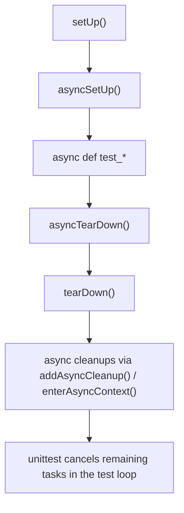

# Не надейтесь на один `tearDown`: как `asyncSetUp()`, `asyncTearDown()` и async-cleanup делают async-тесты устойчивыми

Самая неприятная ошибка в async-тесте происходит не тогда, когда падает `await`, а тогда, когда `asyncSetUp()` успевает открыть первый ресурс, ломается на втором и оставляет после себя полуинициализированное окружение. Документация `unittest` прямо говорит, что `asyncTearDown()` вызывается только если `asyncSetUp()` завершился успешно. Значит, одной симметричной пары `asyncSetUp()`/`asyncTearDown()` хватает не всегда: для пошагового захвата ресурсов нужен отдельный cleanup-механизм. ([Python documentation][1])

## Введение

`IsolatedAsyncioTestCase` появился в стандартной библиотеке Python в версии 3.8 как штатный способ писать `async def test_*` в `unittest`. Класс создаёт для теста отдельный `event loop`, а в конце выполнения отменяет все задачи, оставшиеся в этом loop. Начиная с Python 3.13 у него есть `loop_factory`, а в Python 3.14 сама policy system `asyncio` уже помечена как deprecated и запланирована к удалению в Python 3.16, поэтому явная настройка loop через `loop_factory` становится современным путём конфигурации. ([Python documentation][1])

Но тема 12.2 не про запуск loop как таковой. Она про жизненный цикл ресурсов внутри async-теста. Где открывать соединение. Где закрывать его. Что делать, если подготовка упала посередине. Как гарантировать, что cleanup не пропадёт. И почему `enterAsyncContext()` часто оказывается чище, чем ручной `try/finally` в каждом тесте. Всё это уже встроено в `unittest`, но работает хорошо только тогда, когда Вы понимаете порядок вызовов и границы каждого инструмента. ([Python documentation][1])

Здесь полезно помнить и одну внутреннюю деталь реализации. Текущий CPython не строит `IsolatedAsyncioTestCase` как цепочку отдельных `run_until_complete()` для `setUp`, теста и `tearDown`. В исходниках прямо сказано, что такой подход ломал бы передачу `ContextVar`-контекста между фазами. Поэтому класс использует `asyncio.Runner`, копирует `contextvars.Context` и прогоняет async-фрагменты в одном согласованном контексте. Это не просто техническая тонкость: именно поэтому setup, test body и teardown ведут себя как части одного async-сценария, а не как три изолированных запуска. ([Python documentation][2])

## Сначала — ментальная модель

У `IsolatedAsyncioTestCase` есть очень чёткий порядок выполнения. Сначала идёт обычный `setUp()`, затем `asyncSetUp()`, потом сам `async def test_*`, после него `asyncTearDown()`, затем синхронный `tearDown()`, и только потом выполняются cleanup-функции, зарегистрированные через `addAsyncCleanup()`. Документация показывает этот порядок явно на примере и даже приводит итоговую последовательность событий: `["setUp", "asyncSetUp", "test_response", "asyncTearDown", "tearDown", "cleanup"]`. ([Python documentation][1])



Эта схема важна не для запоминания ради запоминания. Она отвечает на очень практический вопрос: в какой фазе какой инструмент вообще имеет смысл. `asyncSetUp()` подходит для основной подготовки асинхронной фикстуры. `asyncTearDown()` подходит для симметричного освобождения этой фикстуры, если setup дошёл до конца. `addAsyncCleanup()` нужен там, где ресурсы захватываются по одному и каждый из них надо страховать сразу после успешного `await`. А `enterAsyncContext()` нужен тогда, когда ресурс уже умеет жить как async context manager и Вы хотите использовать этот контракт прямо в тесте. ([Python documentation][1])

Ниже — короткая карта выбора инструмента.

| Инструмент            | Когда брать                                                        | Главная оговорка                                                            |
| --------------------- | ------------------------------------------------------------------ | --------------------------------------------------------------------------- |
| `asyncSetUp()`        | нужно подготовить async-фикстуру перед каждым тестом               | если setup упал, он считается ошибкой, а не обычным падением тестового тела |
| `asyncTearDown()`     | нужна симметричная финализация после теста                         | вызывается только если `asyncSetUp()` завершился успешно                    |
| `addAsyncCleanup()`   | ресурсы захватываются пошагово и cleanup надо регистрировать сразу | лучше добавлять cleanup немедленно после каждого успешного acquire          |
| `enterAsyncContext()` | ресурс уже реализует `__aenter__` / `__aexit__`                    | автоматически добавляет `__aexit__` в cleanup-стек                          |

Эта таблица собрана не “по опыту”, а из сочетания публичной документации `unittest` и текущей реализации CPython: docs фиксируют порядок вызовов и контракт `asyncTearDown()`, а исходники показывают, что async-cleanup встроен в общий cleanup-механизм `TestCase`. ([Python documentation][1])

## Симметричный случай: когда `asyncSetUp()` и `asyncTearDown()` действительно достаточно

Начать лучше с простого сценария. У Вас есть один асинхронный ресурс: клиент, соединение, транспорт, сессия. Setup полностью открывает его, teardown полностью закрывает. Здесь пара `asyncSetUp()`/`asyncTearDown()` работает отлично и читается почти так же естественно, как обычные `setUp()` и `tearDown()` в синхронном тесте. Документация класса прямо позиционирует эти методы как async-аналоги обычных fixture hooks. ([Python documentation][1])

```python
import asyncio
import unittest


class FakeAsyncClient:
    def __init__(self):
        self.closed = False

    @classmethod
    async def connect(cls):
        await asyncio.sleep(0)
        return cls()

    async def fetch_user(self, user_id: int) -> dict:
        await asyncio.sleep(0)
        return {"id": user_id, "name": "Alice"}

    async def close(self):
        await asyncio.sleep(0)
        self.closed = True


class TestFakeAsyncClient(unittest.IsolatedAsyncioTestCase):
    async def asyncSetUp(self):
        self.client = await FakeAsyncClient.connect()

    async def asyncTearDown(self):
        await self.client.close()

    async def test_fetch_user(self):
        user = await self.client.fetch_user(7)
        self.assertEqual(user, {"id": 7, "name": "Alice"})
```

В таком тесте всё выглядит линейно и честно. Setup подготовил клиента. Тест его использовал. Teardown его закрыл. Более того, документация `unittest` уточняет, что `asyncTearDown()` вызывается даже если сам тестовый метод завершился исключением, но только если `asyncSetUp()` прошёл успешно. Исключения из `asyncSetUp()` и `asyncTearDown()` — кроме `AssertionError` и `SkipTest` — считаются ошибками, а не обычными test failures. Это важно для чтения отчёта: падение в setup/teardown — это обычно проблема фикстуры, а не проверки результата. ([Python documentation][1])

Именно в этой границе и скрыта следующая проблема. Пока ресурс один и setup атомарен, симметрия работает. Но как только setup состоит из нескольких шагов, простой симметрии уже недостаточно.

## Где схема ломается: частично успешный setup

Представьте реальный тест сервиса. Сначала нужно открыть соединение с БД. Потом поднять временный брокер подписок. Потом создать клиент поверх этих двух зависимостей. И ошибка может случиться не в начале, а посередине. Вот так:

```python
import asyncio
import unittest


class FakeDB:
    @classmethod
    async def connect(cls):
        await asyncio.sleep(0)
        return cls()

    async def close(self):
        await asyncio.sleep(0)


class FakeBroker:
    @classmethod
    async def connect(cls):
        await asyncio.sleep(0)
        return cls()

    async def close(self):
        await asyncio.sleep(0)


class TestFragileSetup(unittest.IsolatedAsyncioTestCase):
    async def asyncSetUp(self):
        self.db = await FakeDB.connect()
        self.broker = await FakeBroker.connect()
        raise RuntimeError("broken fixture after acquiring resources")

    async def asyncTearDown(self):
        await self.broker.close()
        await self.db.close()

    async def test_something(self):
        self.fail("this line is never reached")
```

С точки зрения Python-кода здесь всё “логично”: setup открыл два ресурса, teardown их закрывает. Но с точки зрения жизненного цикла теста здесь уже есть дефект. Документация `unittest` прямо говорит, что `asyncTearDown()` будет вызван только если `asyncSetUp()` завершился успешно. В этом примере `db` и `broker` уже получены, но `asyncSetUp()` в целом не завершился. Значит, на `asyncTearDown()` рассчитывать нельзя. ([Python documentation][1])

И вот здесь появляется настоящая роль async-cleanup. Она не дублирует `asyncTearDown()`. Она закрывает дыру между “ресурс уже захвачен” и “весь setup ещё не считается успешным”. Это и есть главный сюжет этой темы: `asyncTearDown()` хорош для симметрии, `addAsyncCleanup()` — для надёжности при пошаговом захвате ресурсов. ([Python documentation][1])

> Практическое правило здесь очень жёсткое: если ресурс уже успешно открыт, его cleanup нужно регистрировать сразу, а не ждать конца `asyncSetUp()`.

## Надёжный паттерн: регистрируйте cleanup сразу после каждого успешного `await`

`addAsyncCleanup()` существует именно для такого сценария. Публичная документация формулирует его кратко: метод принимает coroutine, которую можно использовать как cleanup-функцию. Но важнее внутренняя механика: в текущем CPython `addAsyncCleanup()` просто делегирует в общий стек cleanup-функций `TestCase`, а `_callCleanup()` у `IsolatedAsyncioTestCase` умеет выполнять и sync-, и async-cleanup. Это означает, что async-cleanups участвуют в той же модели, что и обычные cleanups: они вызываются через `doCleanups()` безусловно после `tearDown()`, а если `setUp()`-фаза сломалась, — после этой ошибки; порядок вызова остаётся LIFO, то есть в обратном порядке регистрации. ([Python documentation][1])

Вот та же фикстура, но уже с правильной стратегией:

```python
import asyncio
import unittest


class FakeDB:
    @classmethod
    async def connect(cls):
        await asyncio.sleep(0)
        return cls()

    async def close(self):
        await asyncio.sleep(0)


class FakeBroker:
    @classmethod
    async def connect(cls):
        await asyncio.sleep(0)
        return cls()

    async def close(self):
        await asyncio.sleep(0)


class TestRobustSetup(unittest.IsolatedAsyncioTestCase):
    async def asyncSetUp(self):
        self.db = await FakeDB.connect()
        self.addAsyncCleanup(self.db.close)

        self.broker = await FakeBroker.connect()
        self.addAsyncCleanup(self.broker.close)

        # Даже если здесь будет исключение,
        # cleanup для broker и db уже зарегистрирован.
        raise RuntimeError("broken fixture after acquiring resources")

    async def test_something(self):
        self.fail("this line is never reached")
```

Этот стиль меняет главное: cleanup привязан не к “успешному завершению всей фазы”, а к факту успешного захвата конкретного ресурса. Это особенно важно в setup, который растёт шаг за шагом. Открыли БД — сразу зарегистрировали её закрытие. Открыли брокер — сразу зарегистрировали его закрытие. Создали временный каталог через async API — сразу зарегистрировали удаление. Такой код не только безопаснее. Он и читается лучше: открытие и закрытие стоят рядом в одном локальном фрагменте мысли. ([Python documentation][1])

Поскольку cleanup-стек работает в LIFO-порядке, ресурсы закрываются в обратной последовательности. Для реальных систем это обычно именно то, что нужно: сначала отпускается самый внутренний или самый поздно созданный объект, потом его зависимости. Документация `addCleanup()` прямо фиксирует обратный порядок вызова, а реализация `IsolatedAsyncioTestCase` показывает, что async-cleanup встроен в этот же стек. ([Python documentation][1])

## `asyncTearDown()` и `addAsyncCleanup()` не конкуренты

После этого шага легко сделать неправильный вывод: раз есть `addAsyncCleanup()`, значит `asyncTearDown()` больше не нужен. Это не так. У этих инструментов разные роли. `asyncTearDown()` хорошо подходит для симметричного освобождения основной фикстуры, которая точно существует, если setup прошёл. `addAsyncCleanup()` нужен для incremental cleanup — то есть для защиты частично успешных фаз и для ресурсов, появляющихся по дороге. На практике они очень хорошо работают вместе. Основной долгоживущий объект закрывается в `asyncTearDown()`, а мелкие или промежуточные ресурсы регистрируются через cleanup-стек прямо в момент появления. ([Python documentation][1])

Показательный случай — фоновые задачи. Допустим, `asyncSetUp()` запускает heartbeat-задачу или подписку на очередь. Даже если framework всё равно отменит оставшиеся задачи в конце теста, это только safety net. Если Вы хотите, чтобы задача завершилась предсказуемо, дождалась отмены и освободила свой ресурс, лучше оформить это отдельным async-cleanup, а не надеяться на финальное “общее гашение” loop. Документация `run()` у `IsolatedAsyncioTestCase` гарантирует отмену оставшихся задач в конце теста, а документация `asyncio` по task cancellation рекомендует писать cleanup внутри корутин через `try/finally` и, если `CancelledError` перехватывается, обычно пробрасывать его дальше после завершения cleanup. ([Python documentation][1])

Ниже — хороший шаблон для фоновой задачи:

```python
import asyncio
import contextlib
import unittest


async def heartbeat(events: list[str]):
    try:
        while True:
            events.append("tick")
            await asyncio.sleep(1)
    finally:
        events.append("heartbeat-stopped")


class TestBackgroundTask(unittest.IsolatedAsyncioTestCase):
    async def asyncSetUp(self):
        self.events = []
        self.task = asyncio.create_task(heartbeat(self.events))

        async def stop_task():
            self.task.cancel()
            with contextlib.suppress(asyncio.CancelledError):
                await self.task

        self.addAsyncCleanup(stop_task)

    async def test_task_is_running(self):
        await asyncio.sleep(0)
        self.assertIn("tick", self.events)
```

Здесь cleanup устроен правильно по двум причинам. Во-первых, отмена и ожидание задачи оформлены как единая async-cleanup-функция. Во-вторых, сама задача написана cancellation-safe и освобождает свой ресурс в `finally`. В результате тест не зависит от того, что framework когда-нибудь в конце отменит всё подряд: он закрывает именно ту задачу, которую сам создал, и делает это в контролируемом месте. Это инженерно сильнее и обычно надёжнее для диагностики. ([Python documentation][1])

## `enterAsyncContext()`: когда cleanup можно вообще не писать руками

Когда ресурс уже умеет жить как async context manager, писать `await resource.__aenter__()` и отдельно регистрировать `__aexit__()` руками нет смысла. Для этого у `IsolatedAsyncioTestCase` есть `enterAsyncContext(cm)`. Документация описывает его очень прямо: метод входит в переданный asynchronous context manager, возвращает результат `__aenter__()` и, если вход успешен, автоматически добавляет `__aexit__()` как cleanup через `addAsyncCleanup()`. Сам метод появился в Python 3.11. ([Python documentation][1])

```python
import asyncio
import unittest


class FakeSession:
    async def __aenter__(self):
        await asyncio.sleep(0)
        return self

    async def __aexit__(self, exc_type, exc, tb):
        await asyncio.sleep(0)
        self.closed = True

    async def get(self, path: str) -> dict:
        await asyncio.sleep(0)
        return {"path": path, "status": 200}


class TestEnterAsyncContext(unittest.IsolatedAsyncioTestCase):
    async def asyncSetUp(self):
        self.session = await self.enterAsyncContext(FakeSession())

    async def test_get(self):
        response = await self.session.get("/health")
        self.assertEqual(response, {"path": "/health", "status": 200})
```

Этот способ особенно хорош, когда асинхронный ресурс уже спроектирован с контекстным протоколом как нормальная часть API. Тогда тест использует тот же жизненный цикл, что и production-код: вход через `__aenter__`, выход через `__aexit__`. Никаких лишних мостов между “как ресурс задуман” и “как тест его закрывает” не возникает. Более того, текущая реализация CPython делает здесь ещё одну полезную вещь: она отдельно проверяет наличие `__aenter__`/`__aexit__` на типе объекта, и если объект поддерживает только обычный синхронный контекстный протокол, формирует `TypeError` с подсказкой, что, вероятно, имелся в виду `enterContext()`. Это уже именно деталь текущего CPython, но она помогает быстрее понять класс ошибки. ([Python documentation][1])

## Как это выглядит в полном тесте

Ниже — пример, где все инструменты работают вместе. Есть синхронный `setUp()`, который готовит данные теста. Есть `asyncSetUp()`, где поднимается основной async-ресурс. Есть `enterAsyncContext()` для временной async-сессии. Есть отдельный async-cleanup для фоновой задачи. И есть `asyncTearDown()` для симметричного закрытия основной фикстуры.

```python
import asyncio
import contextlib
import unittest


class FakeConnection:
    def __init__(self):
        self.closed = False

    @classmethod
    async def open(cls):
        await asyncio.sleep(0)
        return cls()

    async def close(self):
        await asyncio.sleep(0)
        self.closed = True

    async def fetch(self, key: str) -> str:
        await asyncio.sleep(0)
        return f"value:{key}"


class FakeSession:
    async def __aenter__(self):
        await asyncio.sleep(0)
        return self

    async def __aexit__(self, exc_type, exc, tb):
        await asyncio.sleep(0)

    async def ping(self) -> bool:
        await asyncio.sleep(0)
        return True


async def watcher(events):
    try:
        while True:
            events.append("watch")
            await asyncio.sleep(1)
    finally:
        events.append("watcher-stopped")


class TestFullLifecycle(unittest.IsolatedAsyncioTestCase):
    async def asyncSetUp(self):
        self.events = []

        self.conn = await FakeConnection.open()

        self.session = await self.enterAsyncContext(FakeSession())

        self.task = asyncio.create_task(watcher(self.events))

        async def stop_task():
            self.task.cancel()
            with contextlib.suppress(asyncio.CancelledError):
                await self.task

        self.addAsyncCleanup(stop_task)

    async def asyncTearDown(self):
        await self.conn.close()

    async def test_fetch_and_ping(self):
        value = await self.conn.fetch("user:7")
        alive = await self.session.ping()

        self.assertEqual(value, "value:user:7")
        self.assertTrue(alive)
```

Этот тест полезен как модель. Здесь не всё свалено в `asyncTearDown()` и не всё переведено в cleanup-стек. У каждого инструмента своя задача. Основной ресурс `conn` закрывается симметрично в `asyncTearDown()`. Async context manager `session` освобождается через `enterAsyncContext()`. Фоновая задача `watcher` закрывается собственным cleanup, потому что её надо именно отменить и дождаться, а не просто “перестать иметь на неё ссылку”. Такой раздел функций почти всегда читается лучше и масштабируется спокойнее, чем одна большая teardown-функция на все случаи жизни. ([Python documentation][1])

## Несколько важных ловушек

Первая ловушка — регистрировать cleanup слишком поздно. Если ресурс захвачен, а `addAsyncCleanup()` ставится только в конце `asyncSetUp()`, Вы уже потеряли главное преимущество механизма. Между этими двумя строками может случиться исключение, и ресурс останется без зарегистрированного выхода. Документация `asyncTearDown()` здесь не оставляет лазеек: без успешного завершения `asyncSetUp()` этот хук не запустится. Поэтому правило “сразу после успешного acquire — сразу cleanup” в async-тестах не факультативно, а практически обязательно. ([Python documentation][1])

Вторая ловушка — путать loop cleanup и ресурсный cleanup. Да, `run()` в конце теста отменит оставшиеся задачи loop. Но это не то же самое, что корректно закрыть конкретный ресурс в понятной точке и с понятным порядком. Framework даёт страховочную сетку, а не замену дисциплине управления ресурсами. Для фоновых задач, соединений, временных async-сессий и подписок всё равно лучше явно описать их shutdown-контракт в `asyncTearDown()`, `addAsyncCleanup()` или `enterAsyncContext()`. ([Python documentation][1])

Третья ловушка — использовать в coroutine-коде `get_event_loop()` по привычке, как будто тема cleanup с loop никак не связана. В актуальной документации `asyncio` прямо сказано, что в корутинах и callback’ах предпочтителен `get_running_loop()`, потому что его поведение проще и он явно работает с текущим running loop. Кроме того, в Python 3.14 `get_event_loop()` уже поднимает `RuntimeError`, если текущий loop не установлен. Для `IsolatedAsyncioTestCase` это особенно важно: cleanup-код и основной test body живут в loop, которым управляет framework, и читать его лучше тем API, который отражает именно этот контракт. ([Python documentation][3])

## заключение

`asyncSetUp()` и `asyncTearDown()` дают async-тесту понятную форму, но не закрывают всю задачу управления ресурсами. Они отлично работают в симметричном сценарии, где основная фикстура либо полностью поднялась, либо вообще не успела ничего захватить. Реальные тесты обычно сложнее: ресурсы открываются по шагам, часть инициализации может упасть посередине, а фоновые задачи требуют отдельного завершения. Именно поэтому в `IsolatedAsyncioTestCase` рядом с async-хуками существуют `addAsyncCleanup()` и `enterAsyncContext()`. Вместе они дают то, что в async-тестах важнее всего: предсказуемый жизненный цикл ресурса даже при частично успешном setup. ([Python documentation][1])

Если свести весь материал к одному практическому правилу, оно будет таким: `asyncTearDown()` оставляйте для основной симметричной фикстуры, а любой ресурс, который появился в середине `asyncSetUp()`, страхуйте cleanup сразу после успешного `await`. Когда ресурс уже умеет быть async context manager, не пишите лишний boilerplate — входите в него через `enterAsyncContext()`. Такой стиль лучше согласуется и с публичной документацией `unittest`, и с текущим устройством CPython, и с самой природой async-кода, где одна ошибка в середине setup’а не должна превращаться в утечку состояния для следующих тестов. ([Python documentation][1])

## Дополнительные материалы

Официальная документация `unittest` по `IsolatedAsyncioTestCase`, `asyncSetUp()`, `asyncTearDown()`, `addAsyncCleanup()`, `enterAsyncContext()` и порядку вызова хуков. ([Python documentation][1])

Официальная документация `asyncio.Runner`: зачем он нужен для нескольких async-вызовов в одном loop и одном `contextvars.Context`, и почему `loop_factory` становится основной точкой настройки loop. ([Python documentation][2])

Официальная документация `asyncio` по event loop API: `get_running_loop()`, `get_event_loop()`, изменения Python 3.14 и статус policy system. ([Python documentation][3])

Официальная документация `asyncio` по отмене задач: `CancelledError`, `try/finally` и рекомендации по cleanup внутри корутин. ([Python documentation][4])

What’s New in Python 3.11: появление `enterAsyncContext()` в `IsolatedAsyncioTestCase`. ([Python documentation][5])

Исходный код CPython `Lib/unittest/async_case.py`: комментарии про `contextvars`, использование `asyncio.Runner`, делегирование async-cleanup в общий cleanup-стек и раннюю инициализацию loop перед `setUp()`. ([GitHub][6])

[1]: https://docs.python.org/3/library/unittest.html "unittest — Unit testing framework — Python 3.14.3 documentation"
[2]: https://docs.python.org/3/library/asyncio-runner.html "Runners — Python 3.14.3 documentation"
[3]: https://docs.python.org/3/library/asyncio-eventloop.html "Event loop — Python 3.14.3 documentation"
[4]: https://docs.python.org/3/library/asyncio-task.html?utm_source=chatgpt.com "Coroutines and tasks"
[5]: https://docs.python.org/3/whatsnew/3.11.html?utm_source=chatgpt.com "What's New In Python 3.11 — Python 3.14.3 documentation"
[6]: https://raw.githubusercontent.com/python/cpython/main/Lib/unittest/async_case.py "raw.githubusercontent.com"
