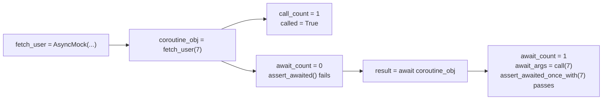

# Не каждый вызов — это `await`: как `AsyncMock` правильно мокирует async-функции в `unittest`

В асинхронных тестах очень легко написать код, который выглядит правдоподобно, но проверяет не то. Вы подменяете async-функцию обычным `Mock`, получаете `TypeError` при `await`. Или, хуже, берёте `AsyncMock`, вызываете его, видите `called=True` и решаете, что всё прошло, хотя корутину вообще никто не `await`-нул. Для синхронного кода граница между “вызвали” и “использовали результат” обычно не так драматична. Для async-кода это две разные стадии, и `unittest.mock` отражает это напрямую. Именно поэтому в Python 3.8 в стандартной библиотеке появился `AsyncMock`, а вместе с ним — отдельные await-assertions. ([Python documentation][1])

## Введение

Тема `AsyncMock` на самом деле не про один класс, а про корректную модель async-границы в тесте. Вам нужно ответить сразу на несколько вопросов. Что именно должен возвращать mock после `await`? Где проверять сам факт ожидания, а где — только факт вызова? Как патчить async-функцию так, чтобы mock сам стал awaitable? Что делать, если у класса одновременно есть sync- и async-методы? И как мокировать не только `await some_func()`, но и `async for` или `async with`? Все эти сценарии уже покрыты стандартным `unittest.mock`; важно не изобретать свои приёмы там, где библиотека давно даёт штатный API. ([Python documentation][2])

> Для async-границы факт вызова и факт `await` — это разные события. `AsyncMock` специально хранит их отдельно, а `unittest` даёт отдельные assert-методы именно для `await`. ([Python documentation][2])

## Что такое `AsyncMock` на уровне контракта

Официальная документация определяет `AsyncMock` как асинхронную версию `MagicMock`. У этого определения есть два практических следствия. Во-первых, объект `AsyncMock` распознаётся как async function. Во-вторых, результат его вызова является awaitable-объектом. Именно это делает `AsyncMock` естественной подменой для `async def`-функций: код под тестом может сделать `await mocked_func(...)`, и это будет валидный сценарий, а не ошибка типа. ([Python documentation][2])

Ниже — минимальный пример:

```python
import asyncio
import unittest
from unittest.mock import AsyncMock


async def is_active(user_id: int, repo) -> bool:
    user = await repo.fetch_user(user_id)
    return user["active"]


class TestIsActive(unittest.IsolatedAsyncioTestCase):
    async def test_reads_user_from_async_repository(self):
        repo = unittest.mock.Mock()
        repo.fetch_user = AsyncMock(return_value={"id": 7, "active": True})

        result = await is_active(7, repo)

        self.assertTrue(result)
        repo.fetch_user.assert_awaited_once_with(7)
```

Если бы здесь вместо `AsyncMock` стоял обычный `Mock(return_value={"id": 7, "active": True})`, то `await repo.fetch_user(7)` попытался бы ожидать обычный словарь и упал бы по типу. Это и есть первая базовая причина использовать `AsyncMock`: он соответствует контракту `async def`, а не только контракту “какой-то вызываемый объект”. Документация фиксирует это очень прямо: `AsyncMock` распознаётся как coroutine function, а `mock()` даёт awaitable. ([Python documentation][2])

Для ориентира полезно держать в голове простую таблицу:

| Что Вы мокируете                        | Обычно подходит                               | Почему                                                                     |
| --------------------------------------- | --------------------------------------------- | -------------------------------------------------------------------------- |
| обычную sync-функцию                    | `Mock` / `MagicMock`                          | код делает обычный вызов без `await`                                       |
| async-функцию                           | `AsyncMock`                                   | вызов должен вернуть awaitable                                             |
| объект с `async with` / `async for`     | `MagicMock` или `AsyncMock`                   | у обоих есть поддержка `__aenter__`, `__aexit__`, `__aiter__`, `__anext__` |
| класс со смешанными sync/async-методами | `AsyncMock(spec=Class)` или autospecced patch | async-методы станут `AsyncMock`, sync-методы — `MagicMock`/`Mock`          |

Поведение из последней строки не “магия по договорённости”, а документированный механизм: если у `Mock`, `MagicMock` или `AsyncMock` задать spec класса, в котором есть и синхронные, и асинхронные функции, библиотека автоматически делает async-атрибуты `AsyncMock`, а sync-атрибуты — `MagicMock` или `Mock` в зависимости от родительского типа. ([Python documentation][2])

## Главная ловушка: вызвали, но не `await`-нули

Именно здесь большинство первых async-тестов становятся ложноположительными. Для sync-функции “вызвали mock” и “использовали mock” почти одно и то же. Для async-функции это не так. Документация `AsyncMock` специально показывает пример, где после `coroutine_mock = mock()` у объекта уже `called=True`, но `assert_awaited()` всё ещё падает, потому что сам результат вызова никто не ожидал через `await`. Только после реального `await coroutine_mock` assert проходит. ([Python documentation][2])

Вот этот сценарий в чистом виде:

```python
import unittest
from unittest.mock import AsyncMock


class TestAwaitTrap(unittest.IsolatedAsyncioTestCase):
    async def test_called_is_not_the_same_as_awaited(self):
        fetch_user = AsyncMock(return_value={"id": 7})

        coroutine_obj = fetch_user(7)

        fetch_user.assert_called_once_with(7)
        with self.assertRaises(AssertionError):
            fetch_user.assert_awaited()

        result = await coroutine_obj

        self.assertEqual(result, {"id": 7})
        fetch_user.assert_awaited_once_with(7)
```

Это не “экзотический edge case”. Это центральная логика `AsyncMock`. Библиотека отдельно ведёт обычную историю вызовов и отдельную историю await’ов: `call_count`, `call_args` и `call_args_list` описывают вызовы; `await_count`, `await_args` и `await_args_list` описывают ожидания. Для async-кода это принципиально разные уровни проверки. ([Python documentation][2])

Полезно запомнить это в виде короткой схемы:



Эта разница и определяет хороший стиль проверок. Если Вы тестируете async-границу, `assert_called_once_with()` часто недостаточен. Он подтверждает, что кто-то породил coroutine object, но не подтверждает, что код её действительно дождался. Для реальной async-логики куда полезнее `assert_awaited()`, `assert_awaited_once_with()`, `assert_any_await()` и `assert_has_awaits()`. Все эти методы появились вместе с `AsyncMock` и работают именно поверх await-истории. ([Python documentation][2])

## `return_value` и `side_effect` в async-мире

У `AsyncMock` есть та же пара основных рычагов, что и у обычных mock-объектов: `return_value` и `side_effect`. Но трактовать их нужно с поправкой на `await`. Документация описывает поведение так: результат `mock()` — awaitable, и **после `await`** его исход определяется `side_effect` или `return_value`. Если `side_effect` — функция, await вернёт результат этой функции. Если `side_effect` — исключение, await поднимет его. Если `side_effect` — итерируемый объект, каждый следующий await вернёт следующий элемент, а когда последовательность закончится, сразу поднимется `StopAsyncIteration`. Если `side_effect` не задан, await вернёт `return_value`; по умолчанию это новый `AsyncMock`. ([Python documentation][2])

Это поведение удобно разбирать на примерах. Сценарий успеха:

```python
import unittest
from unittest.mock import AsyncMock


class TestReturnValue(unittest.IsolatedAsyncioTestCase):
    async def test_success_path(self):
        fetch_user = AsyncMock(return_value={"id": 7, "name": "Alice"})

        result = await fetch_user(7)

        self.assertEqual(result, {"id": 7, "name": "Alice"})
        fetch_user.assert_awaited_once_with(7)
```

Сценарий ошибки:

```python
import asyncio
import unittest
from unittest.mock import AsyncMock


class TestSideEffectException(unittest.IsolatedAsyncioTestCase):
    async def test_timeout_path(self):
        fetch_user = AsyncMock(side_effect=asyncio.TimeoutError())

        with self.assertRaises(asyncio.TimeoutError):
            await fetch_user(7)

        fetch_user.assert_awaited_once_with(7)
```

Сценарий последовательности для retry или нескольких ответов подряд:

```python
import unittest
from unittest.mock import AsyncMock


class TestSideEffectSequence(unittest.IsolatedAsyncioTestCase):
    async def test_multiple_results(self):
        poll_status = AsyncMock(side_effect=["pending", "pending", "ready"])

        first = await poll_status()
        second = await poll_status()
        third = await poll_status()

        self.assertEqual([first, second, third], ["pending", "pending", "ready"])
        self.assertEqual(poll_status.await_count, 3)
```

Именно на этом месте возникает один из самых частых практических багов. Поскольку по умолчанию `return_value` у `AsyncMock` — это новый `AsyncMock`, неинициализированный mock легко начинает вести себя “слишком правдоподобно”: код ждёт словарь, список или число, а получает ещё один async-mock. Тест при этом может упасть далеко от места настройки или, хуже, пройти по ложной ветке. Из документированного контракта здесь следует простое правило: для async-функций почти всегда полезно явно задавать `return_value` как **финальный awaited-результат**, а не оставлять дефолтную цепочку моков. ([Python documentation][2])

## Почему `assert_has_awaits()` часто полезнее серии одноточечных проверок

Когда async-функция вызывается несколько раз, особенно в retry-сценариях, простой `assert_awaited_once_with()` уже не помогает. Здесь нужна проверка всей последовательности ожиданий. Для этого у `AsyncMock` есть `assert_has_awaits(calls, any_order=False)`. Документация уточняет, что метод проверяет список `await_args_list`. Если `any_order=False`, ожидания должны идти в заданной последовательности, хотя до и после них могут быть дополнительные await’ы. Если `any_order=True`, порядок неважен, но все перечисленные await’ы должны присутствовать. ([Python documentation][2])

```python
import unittest
from unittest.mock import AsyncMock, call


class TestRetrySequence(unittest.IsolatedAsyncioTestCase):
    async def test_checks_full_await_sequence(self):
        send = AsyncMock()

        await send("first")
        await send("second")

        send.assert_has_awaits([call("first"), call("second")])
        self.assertEqual(send.await_args_list, [call("first"), call("second")])
```

В реальном коде это особенно полезно для polling, повторных попыток, пакетной обработки и любых async-пайплайнов, где важна не просто частота обращений, а их конкретная траектория. Документация отдельно подчёркивает, что `await_args_list` хранит все ожидания по порядку, а `await_count` — их количество. `reset_mock()` при этом сбрасывает и обычную историю вызовов, и async-историю: `await_count` становится `0`, `await_args` — `None`, а `await_args_list` очищается. ([Python documentation][2])

```python
import unittest
from unittest.mock import AsyncMock, call


class TestResetMock(unittest.IsolatedAsyncioTestCase):
    async def test_reset_clears_await_history(self):
        worker = AsyncMock()

        await worker("a")
        await worker("b")

        self.assertEqual(worker.await_count, 2)
        self.assertEqual(worker.await_args_list, [call("a"), call("b")])

        worker.reset_mock()

        self.assertEqual(worker.await_count, 0)
        self.assertIsNone(worker.await_args)
        self.assertEqual(worker.await_args_list, [])
```

Это полезно, когда один и тот же mock живёт внутри длинного теста в нескольких фазах. Без `reset_mock()` Вы рискуете смешать ожидания из разных этапов сценария и получить менее точную диагностику. ([Python documentation][2])

## `patch()` и `autospec`: правильная подмена async-цели

Писать `fetch_user = AsyncMock()` руками удобно не всегда. В реальных тестах async-функцию чаще всего подменяют через `patch()`. И здесь у `unittest.mock` уже есть правильное поведение по умолчанию: если `new` не передан, `patch()` создаёт `AsyncMock`, когда цель патча — async function, и `MagicMock` во всех остальных случаях. Это поведение документировано отдельно, и оно действует с Python 3.8. ([Python documentation][2])

Отсюда следует важный практический вывод: когда Вы патчите **саму async-функцию**, `new_callable=AsyncMock` обычно не нужен. Вот рабочий шаблон:

```python
# app/service.py
async def fetch_remote_user(user_id: int, *, include_deleted: bool = False) -> dict:
    raise NotImplementedError


async def load_user_name(user_id: int) -> str:
    data = await fetch_remote_user(user_id, include_deleted=False)
    return data["name"]
```

```python
import unittest
from unittest.mock import patch

from app.service import load_user_name


class TestLoadUserName(unittest.IsolatedAsyncioTestCase):
    @patch("app.service.fetch_remote_user", autospec=True)
    async def test_loads_name(self, mock_fetch_remote_user):
        mock_fetch_remote_user.return_value = {"name": "Alice"}

        result = await load_user_name(7)

        self.assertEqual(result, "Alice")
        mock_fetch_remote_user.assert_awaited_once_with(7, include_deleted=False)
```

Здесь одновременно работают два правила. Первое: патчить нужно объект в том namespace, где система под тестом его **ищет**, а не обязательно там, где он определён. Документация `patch()` называет это ключевым принципом и отдельно выносит в раздел _Where to patch_. Второе: `autospec=True` создаёт mock со спецификацией заменяемого объекта; функции и методы получают проверку сигнатуры, а для классов spec распространяется и на возвращаемый instance. Если цель патча — async function, `patch()` с 3.8 всё равно создаст `AsyncMock`. ([Python documentation][2])

Именно `autospec` в async-мире особенно ценен. В исходниках CPython видно, что для async-signature wrapper’а библиотека генерирует async-функцию, сначала проверяющую `sig.bind(*args, **kwargs)`, а затем делающую `return await mock(*args, **kwargs)`. Это объясняет, почему autospecced async-mocks умеют не только ждать, но и ловить неправильную сигнатуру вызова на уровне теста, а не где-то позже в runtime. ([GitHub][3])

Если нужен не patch, а явное создание спека, можно использовать `create_autospec()`. Документация отдельно говорит, что с Python 3.8 `create_autospec()` возвращает `AsyncMock`, если цель — async function. Это удобный путь, когда Вы хотите подготовить mock заранее и передать его в тестируемый объект как зависимость вручную. ([Python documentation][2])

## Смешанные API: когда в одном объекте есть и sync-, и async-методы

Это типичный прикладной случай. У клиента есть синхронный метод `build_url()`, асинхронный `fetch_json()`, возможно, ещё sync-метод `close()` или `stats()`. Мокировать такие объекты “на глаз” неудобно: где-то хочется `AsyncMock`, где-то обычный mock. И тут `unittest.mock` уже даёт полезную автоматизацию. Если spec объекта или класса содержит и синхронные, и асинхронные функции, библиотека сама определяет, что должно стать `AsyncMock`, а что — `MagicMock` или `Mock`. Для родителя типа `AsyncMock` или `MagicMock` синхронные функции будут `MagicMock`, а async-функции — `AsyncMock`; для родителя типа `Mock` sync-часть станет `Mock`, async-часть всё равно станет `AsyncMock`. ([Python documentation][2])

```python
import unittest
from unittest.mock import AsyncMock


class ApiClient:
    def build_url(self, user_id: int) -> str:
        raise NotImplementedError

    async def fetch_json(self, url: str) -> dict:
        raise NotImplementedError


async def load_profile(user_id: int, client: ApiClient) -> dict:
    url = client.build_url(user_id)
    payload = await client.fetch_json(url)
    return {"id": payload["id"], "name": payload["name"].strip()}


class TestMixedApi(unittest.IsolatedAsyncioTestCase):
    async def test_client_with_sync_and_async_methods(self):
        client = AsyncMock(ApiClient)
        client.build_url.return_value = "/users/7"
        client.fetch_json.return_value = {"id": 7, "name": " Alice "}

        result = await load_profile(7, client)

        self.assertEqual(result, {"id": 7, "name": "Alice"})
        client.build_url.assert_called_once_with(7)
        client.fetch_json.assert_awaited_once_with("/users/7")
```

Это хороший паттерн сразу по двум причинам. Во-первых, у Вас остаётся единый mock-объект, отражающий реальный API клиента. Во-вторых, проверки автоматически разводятся по смыслу: sync-метод проверяется через `assert_called_once_with()`, async-метод — через `assert_awaited_once_with()`. И это опять не “стилистика”, а прямое следствие того, как `unittest.mock` строит дочерние моки по spec. ([Python documentation][2])

## `AsyncMock` умеет не только `await`: `async for` и `async with`

Тема “корректное мокирование async-функций” быстро упирается в то, что async-код живёт не только в `await some_func()`. Он живёт ещё и в `async for`, и в `async with`. Официальные примеры `unittest.mock` отдельно разбирают оба сценария. С Python 3.8 `AsyncMock` и `MagicMock` поддерживают асинхронные итераторы через `__aiter__`, а их `return_value` можно использовать, чтобы задать элементы для `async for`. С той же версии поддерживаются asynchronous context managers через `__aenter__` и `__aexit__`; по умолчанию эти методы сами являются `AsyncMock`-объектами. Поддержка `__aenter__`, `__aexit__`, `__aiter__` и `__anext__` также отдельно отмечена в документации `MagicMock`. ([Python documentation][4])

Сначала `async for`:

```python
import unittest
from unittest.mock import MagicMock


async def collect_ids(source):
    return [item["id"] async for item in source]


class TestAsyncIterator(unittest.IsolatedAsyncioTestCase):
    async def test_async_for(self):
        source = MagicMock()
        source.__aiter__.return_value = [
            {"id": 1},
            {"id": 2},
            {"id": 3},
        ]

        result = await collect_ids(source)

        self.assertEqual(result, [1, 2, 3])
```

Теперь `async with`:

```python
import unittest
from unittest.mock import MagicMock, AsyncMock


async def fetch_health(session_cm):
    async with session_cm as client:
        return await client.get("/health")


class TestAsyncContextManager(unittest.IsolatedAsyncioTestCase):
    async def test_async_with(self):
        session_cm = MagicMock()
        client = AsyncMock()
        client.get.return_value = {"status": "ok"}

        session_cm.__aenter__.return_value = client

        result = await fetch_health(session_cm)

        self.assertEqual(result, {"status": "ok"})
        session_cm.__aenter__.assert_awaited_once()
        session_cm.__aexit__.assert_awaited_once()
        client.get.assert_awaited_once_with("/health")
```

Эти примеры важны потому, что они расширяют правильную mental model. AsyncMock — это не только замена для “голой async-функции”. Это ещё и удобный строительный блок для всего асинхронного протокола Python: ожиданий, асинхронного контекстного менеджмента и асинхронной итерации. Именно поэтому в реальных тестах Вы нередко увидите смесь `AsyncMock` и `MagicMock`: первый хорошо выражает async-callable, второй удобен как контейнер с поддержкой magic methods, включая async magic methods. ([Python documentation][4])

## Частые ошибки, из-за которых async-тесты “зелёные, но лживые”

Самая опасная ошибка уже обсуждалась: проверять только вызов, а не ожидание. Если код породил coroutine object, но не `await`-нул его, `assert_called_once_with()` всё равно пройдёт. Документация `AsyncMock` специально показывает этот разрыв: `called=True` ещё не означает `awaited=True`. Поэтому для async-границы главная проверка почти всегда должна быть await-ориентированной. ([Python documentation][2])

Вторая ошибка — оставлять дефолтный `return_value`. По документации это новый `AsyncMock`, а не доменный результат. Если Ваша функция после `await` ждёт словарь, число, список или пользовательский объект, лучше задавать `return_value` явно. Иначе тест получает ещё один mock и легко начинает проверять цепочку моков, а не поведение системы. ([Python documentation][2])

Третья ошибка — патчить не тот namespace. Для async-функций это ничем не отличается от sync-мира: `patch()` должен менять имя там, где система под тестом его **ищет**. Документация выносит это правило отдельно как _Where to patch_. Очень часто проблема “мой AsyncMock не сработал” на самом деле оказывается проблемой “я патчил место определения, а не место использования”. ([Python documentation][2])

Четвёртая ошибка — игнорировать `autospec` там, где у async-функции важная сигнатура. Документация `patch(autospec=True)` и `create_autospec()` прямо говорит, что mock получает ту же сигнатуру, а неправильный вызов приводит к `TypeError`. Для async-кода это особенно полезно: тест начинает ловить не только отсутствие `await`, но и дрейф API по аргументам. ([Python documentation][2])

Наконец, пятая ошибка — забывать, что async-функция может быть только частью большого интерфейса. Если у класса несколько sync- и async-методов, ручное присваивание `obj.method = AsyncMock()` на глаз часто превращается в хрупкую конструкцию. Спецификация класса через `AsyncMock(Class)` или autospecced patch обычно даёт более честную модель API и более сильные ошибки при рассинхронизации интерфейса. ([Python documentation][2])

## Рабочий шаблон, который стоит сделать привычкой

Когда Вы мокируете async-функцию в `unittest`, полезно придерживаться одной и той же короткой последовательности.

Сначала определите, что именно Вы заменяете: отдельную async-функцию, async-метод класса, объект со смешанным API, async iterator или async context manager. Затем выберите инструмент: `AsyncMock` для async-callable, `patch()` для подмены зависимости по имени, `autospec=True` для защиты сигнатуры, `MagicMock` или `AsyncMock` с magic methods — для `async with` и `async for`. После этого задайте **финальный awaited-результат** через `return_value` или сценарий ошибок/повторных ответов через `side_effect`. И в конце проверяйте не только вызов, но и сам await через `assert_awaited*` и `await_args_list`. Все эти шаги прямо поддерживаются стандартной библиотекой; ничего внешнего для базовой async-мокировки не требуется. ([Python documentation][2])

## Заключение

`AsyncMock` полезен не потому, что “умеет await”. Его реальная ценность в том, что он делает async-границу тестируемой **по правилам async-кода**, а не по правилам обычного вызова функции. Он отдельно хранит историю вызовов и историю ожиданий, умеет подставляться под `patch()` для async-целей, сочетается с `autospec`, автоматически встраивается в смешанные sync/async-спеки и поддерживает асинхронные итераторы и контекстные менеджеры. Всё это давно входит в стандартный `unittest.mock` и документировано в актуальной документации Python. ([Python documentation][2])

Если свести весь материал к одному практическому правилу, оно будет таким: **для async-функций проверяйте не просто то, что mock вызвали, а то, что его действительно `await`-нули с правильными аргументами и на правильной границе системы**. Как только это становится привычкой, async-тесты перестают быть “почти правильными” и начинают реально страховать Ваш код от тех багов, которые особенно трудно заметить в асинхронном исполнении. ([Python documentation][2])

## Дополнительные материалы

Официальная документация `unittest.mock`: разделы `AsyncMock`, `patch()`, `create_autospec()`, `Where to patch`, `Autospeccing`. ([Python documentation][2])

Официальные примеры `unittest.mock`: разделы `Mocking asynchronous iterators` и `Mocking asynchronous context manager`. ([Python documentation][4])

What’s New in Python 3.8: заметка о добавлении `AsyncMock` и await-assertions в стандартную библиотеку. ([Python documentation][1])

Исходный код CPython `Lib/unittest/mock.py`: полезен, если хотите посмотреть, как для autospec async-функций генерируется wrapper с проверкой сигнатуры и `return await mock(*args, **kwargs)`. ([GitHub][3])

[1]: https://docs.python.org/3/whatsnew/3.8.html "What’s New In Python 3.8 — Python 3.14.3 documentation"
[2]: https://docs.python.org/3/library/unittest.mock.html "unittest.mock — mock object library — Python 3.14.3 documentation"
[3]: https://github.com/python/cpython/blob/main/Lib/unittest/mock.py "cpython/Lib/unittest/mock.py at main · python/cpython · GitHub"
[4]: https://docs.python.org/3/library/unittest.mock-examples.html "unittest.mock — getting started — Python 3.14.3 documentation"
