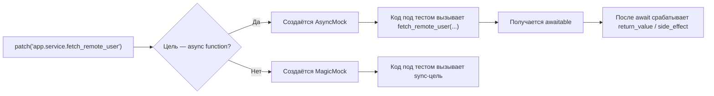

# `patch()` в async-коде без иллюзий: что именно возвращается и как этим пользоваться правильно

В синхронных тестах к `patch()` быстро привыкают: подменили зависимость, получили `MagicMock`, проверили `assert_called_once_with()` и пошли дальше. В async-коде эта привычка ломается сразу в трёх местах. Во-первых, `patch()` не всегда возвращает тот тип mock, который Вы ожидаете. Во-вторых, сам вызов и последующий `await` — это разные события. В-третьих, у async-mock по умолчанию после `await` возвращается не Ваш словарь или число, а новый `AsyncMock`, если Вы не задали поведение явно. Именно поэтому тема 12.4 — не про “ещё один синтаксис для патча”, а про корректную модель асинхронной границы в тесте. `AsyncMock` появился в стандартной библиотеке в Python 3.8, и с той же версии `patch()` начал автоматически возвращать `AsyncMock` для async-функций. ([Python documentation][1])

## Введение

Когда Вы патчите async-цель, нужно понимать сразу несколько уровней поведения. Какой объект создаёт `patch()` по умолчанию. Что именно возвращается из `with patch(...) as mock_...`. Что будет после вызова patched-функции и что произойдёт только после `await`. Как работают `return_value` и `side_effect` у `AsyncMock`. Что меняется, если включить `autospec=True`. И почему `patch.object()` для async-метода класса — это отдельная история, особенно если Вам нужен корректный `self` и проверка сигнатуры. Всё это подробно покрыто документацией `unittest.mock`, примерами к ней и исходным кодом CPython. ([Python documentation][2])

## Что именно возвращает `patch()` для async-цели

Если отвечать строго по документации, базовое правило очень короткое. Когда `new` не передан, `patch()` заменяет async-функцию объектом `AsyncMock`, а всё остальное — объектом `MagicMock`. В режиме decorator созданный mock передаётся дополнительным аргументом в декорируемую функцию; в режиме context manager этот mock возвращается из `with ... as ...`. Те же смысловые правила действуют и для `patch.object()`: он принимает те же основные аргументы и так же умеет работать как decorator, class decorator и context manager. ([Python documentation][2])

Это удобно держать в голове в виде трёх коротких случаев:

- `patch("pkg.mod.async_func")` при `new=DEFAULT` даёт `AsyncMock`. ([Python documentation][2])
- `patch("pkg.mod.sync_func")` при `new=DEFAULT` даёт `MagicMock`. ([Python documentation][2])
- `patch(..., new_callable=...)` создаёт объект через Ваш `new_callable`, а не через стандартный выбор `AsyncMock`/`MagicMock`. ([Python documentation][2])

Из этого сразу следует важная, но часто упускаемая деталь: `patch()` принимает решение по **самой patched-цели**, а не по тому, “живёт ли рядом async-код”. Если цель — синхронная функция, даже если она потом участвует в `async with` или возвращает объект для асинхронного протокола, `patch()` по умолчанию создаст `MagicMock`, а не `AsyncMock`. Это просто следствие документированного правила “async function → AsyncMock, иначе → MagicMock”. ([Python documentation][2])

Ещё одна полезная часть контракта: keyword-аргументы, переданные в `patch()`, идут в создаваемый mock. Для async-цели они передаются в `AsyncMock`, для sync-цели — в `MagicMock`, а при `new_callable` — в объект, созданный через эту фабрику. Значит, `return_value`, `side_effect`, имя и другие атрибуты можно задавать прямо в вызове `patch()`, не только отдельными присваиваниями внутри теста. ([Python documentation][2])



Смысл этой схемы полностью совпадает с документацией `patch()` и `AsyncMock`: async-цель получает `AsyncMock`, вызов такого mock создаёт awaitable-объект, а итог после `await` определяется `return_value` или `side_effect`. ([Python documentation][2])

> В async-теме вопрос “что вернул `patch()`?” нужно задавать дважды: сначала для самой patched-цели, потом для результата её вызова после `await`.

## Базовый сценарий: патчим async-функцию через context manager

Начнём с самой частой ситуации. Есть модульный async-хелпер, который тестируемая функция вызывает внутри себя.

```python
# app/service.py
async def fetch_remote_user(user_id: int) -> dict:
    raise NotImplementedError


async def load_user_name(user_id: int) -> str:
    data = await fetch_remote_user(user_id)
    return data["name"]
```

Тест выглядит так:

```python
import unittest
from unittest.mock import patch

from app.service import load_user_name


class TestLoadUserName(unittest.IsolatedAsyncioTestCase):
    async def test_returns_name_from_remote_payload(self):
        with patch("app.service.fetch_remote_user") as mock_fetch_remote_user:
            mock_fetch_remote_user.return_value = {"id": 7, "name": "Alice"}

            result = await load_user_name(7)

        self.assertEqual(result, "Alice")
        mock_fetch_remote_user.assert_awaited_once_with(7)
```

Здесь важно понимать, что находится в переменной `mock_fetch_remote_user`. Поскольку patched-цель — `async def fetch_remote_user(...)`, `patch()` без `new` создаёт `AsyncMock`. Когда код под тестом вызывает `fetch_remote_user(7)`, он получает awaitable; когда делает `await`, итог берётся из `return_value`. Это не особенность примера, а прямой контракт `AsyncMock`: вызов даёт awaitable, а результат после `await` определяется `side_effect` или `return_value`. ([Python documentation][2])

Именно поэтому `return_value` у `AsyncMock` нужно понимать как **финальный awaited-результат**, а не как “объект, который вернёт обычный вызов”. В нашем примере после `await fetch_remote_user(7)` код получает словарь `{"id": 7, "name": "Alice"}`. Если бы `return_value` не был задан, по документации после `await` вернулся бы новый `AsyncMock`. Это одна из самых частых причин странных падений в async-тестах: mock настроен по умолчанию, тестируемый код ждёт словарь, а получает очередной mock-объект. ([Python documentation][2])

При желании тот же сценарий можно оформить короче, потому что `patch()` умеет принимать конфигурацию mock прямо в аргументах:

```python
import unittest
from unittest.mock import patch

from app.service import load_user_name


class TestLoadUserNameShort(unittest.IsolatedAsyncioTestCase):
    @patch("app.service.fetch_remote_user", return_value={"id": 7, "name": "Alice"})
    async def test_returns_name(self, mock_fetch_remote_user):
        result = await load_user_name(7)

        self.assertEqual(result, "Alice")
        mock_fetch_remote_user.assert_awaited_once_with(7)
```

Этот стиль опирается на документированное поведение `patch()`: keyword-аргументы идут в создаваемый mock, а при использовании decorator сам mock передаётся в тест дополнительным аргументом. Для async-цели это будет именно `AsyncMock`. ([Python documentation][2])

## Главная ловушка: `called` не значит `awaited`

Это место стоит разобрать отдельно, потому что здесь async-тесты чаще всего становятся “зелёными, но лживыми”. Документация `AsyncMock` подчёркивает: факт вызова и факт ожидания разделены. Можно вызвать mock, получить coroutine-like объект, увидеть `mock.called == True` — и всё ещё не выполнить ни одного `await`. Для этого у `AsyncMock` есть отдельные assert-методы: `assert_awaited()`, `assert_awaited_once()`, `assert_awaited_with()`, `assert_awaited_once_with()`, `assert_any_await()` и `assert_has_awaits()`. ([Python documentation][2])

```python
import unittest
from unittest.mock import AsyncMock


class TestAwaitVsCall(unittest.IsolatedAsyncioTestCase):
    async def test_called_is_not_enough(self):
        fetch = AsyncMock(return_value={"id": 7})

        coroutine_obj = fetch(7)

        fetch.assert_called_once_with(7)

        with self.assertRaises(AssertionError):
            fetch.assert_awaited()

        result = await coroutine_obj

        self.assertEqual(result, {"id": 7})
        fetch.assert_awaited_once_with(7)
```

В этом примере первая проверка подтверждает только то, что код породил awaitable-объект. Она не подтверждает, что этот объект был реально использован как async-вызов. Только `assert_awaited*` фиксирует настоящий контракт async-функции. Поэтому для patched async-целей в большинстве случаев правильная проверка — не `assert_called_once_with()`, а `assert_awaited_once_with()`. Документация `AsyncMock` показывает этот разрыв на примере буквально: после `coroutine_mock = mock()` объект уже считается called, но `assert_awaited()` всё ещё падает, пока не выполнен реальный `await`. ([Python documentation][2])

> Для синхронной зависимости “вызвали” часто означает “использовали”. Для асинхронной — нет. Пока корутина не была `await`-нута, поведение системы ещё не завершилось.

## `return_value`, `side_effect` и сценарии ошибок

У `AsyncMock` всё решается теми же двумя рычагами, что и у обычных mock-объектов, только с поправкой на `await`. По документации, если `side_effect` — функция, после `await` вернётся её результат. Если `side_effect` — исключение, `await` поднимет это исключение. Если `side_effect` — итерируемый объект, каждый следующий await вернёт следующий элемент последовательности, а при исчерпании сразу поднимется `StopAsyncIteration`. Если `side_effect` не задан, используется `return_value`; по умолчанию это новый `AsyncMock`. ([Python documentation][2])

Вот сценарий ошибки сети:

```python
import asyncio
import unittest
from unittest.mock import patch

from app.service import load_user_name


class TestRemoteError(unittest.IsolatedAsyncioTestCase):
    @patch("app.service.fetch_remote_user", side_effect=asyncio.TimeoutError())
    async def test_propagates_timeout(self, mock_fetch_remote_user):
        with self.assertRaises(asyncio.TimeoutError):
            await load_user_name(7)

        mock_fetch_remote_user.assert_awaited_once_with(7)
```

А вот сценарий с последовательностью ответов, который особенно полезен для retry или polling:

```python
import unittest
from unittest.mock import AsyncMock, call


class TestPolling(unittest.IsolatedAsyncioTestCase):
    async def test_sequence_of_awaited_results(self):
        poll_status = AsyncMock(side_effect=["pending", "pending", "ready"])

        first = await poll_status()
        second = await poll_status()
        third = await poll_status()

        self.assertEqual([first, second, third], ["pending", "pending", "ready"])
        poll_status.assert_has_awaits([call(), call(), call()])
```

Из этих примеров следует хороший практический вывод. В async-тестах `return_value` почти всегда стоит задавать явно как финальное значение после `await`, а `side_effect` — использовать для исключений и последовательностей ответов. Так тест читается ближе к реальному контракту API, а не к внутреннему устройству mock-объекта. Это полностью согласуется с публичной документацией `AsyncMock`. ([Python documentation][2])

## Что меняется, если включить `autospec=True`

До сих пор мы говорили о режиме, где `patch()` просто создаёт `AsyncMock` и подставляет его на место async-функции. С `autospec=True` картина становится тоньше — и именно здесь тема “что возвращается” перестаёт быть банальной.

Публичная документация `patch()` говорит, что `autospec=True` создаёт mock со спецификацией объекта, который заменяется: у mock будут те же атрибуты, а функции и методы будут проверять сигнатуру и поднимать `TypeError` при неправильном вызове. Для unbound methods в примерах `unittest.mock-examples` показано ещё важнее: `autospec=True` патчит метод **реальным function object**, который сохраняет сигнатуру и делегирует вызов mock’у под капотом; благодаря этому при обращении через экземпляр корректно передаётся `self`. ([Python documentation][2])

Для async-целей это же видно уже в исходниках CPython. Функция `_set_async_signature()` генерирует `async def`-обёртку, сначала делает `sig.bind(*args, **kwargs)`, а затем выполняет `return await mock(*args, **kwargs)`. После этого `_setup_async_mock()` добавляет на обёртку прокси-методы `assert_awaited`, `assert_awaited_once_with`, `assert_has_awaits` и другие. То есть при `autospec=True` Вы работаете не с “голым AsyncMock”, а с **асинхронной обёрткой с исходной сигнатурой**, которая делегирует внутрь реальному async-mock. ([GitHub][3])

Это очень полезно при patching метода класса:

```python
import unittest
from unittest.mock import patch


class ApiClient:
    async def fetch_user(self, user_id: int, *, include_deleted: bool = False) -> dict:
        raise NotImplementedError


async def load_name(client: ApiClient, user_id: int) -> str:
    data = await client.fetch_user(user_id, include_deleted=False)
    return data["name"]


class TestAutospecAsyncMethod(unittest.IsolatedAsyncioTestCase):
    @patch.object(ApiClient, "fetch_user", autospec=True)
    async def test_preserves_self_and_signature(self, mock_fetch_user):
        mock_fetch_user.return_value = {"name": "Alice"}

        client = ApiClient()
        result = await load_name(client, 7)

        self.assertEqual(result, "Alice")
        mock_fetch_user.assert_awaited_once_with(client, 7, include_deleted=False)
```

Здесь `autospec=True` даёт сразу две вещи. Во-первых, patched-метод остаётся корректно bind’ящимся методом, поэтому в await-истории появляется `client` как первый аргумент. Во-вторых, неправильная сигнатура — например, лишний аргумент или неверное имя keyword-аргумента — приведёт к `TypeError` на уровне теста. Для async-методов это особенно полезно, потому что дрейф сигнатуры иначе нередко обнаруживается поздно и в более шумном месте. Документированный смысл `autospec` даёт общий контракт, а исходники CPython показывают, как этот контракт реализован именно для async-целей. ([Python documentation][2])

## `patch.object()` для async-атрибутов

Если зависимость не импортируется по строковому пути, а уже висит на объекте или классе как атрибут, используйте `patch.object()`. Документация прямо говорит, что `patch.object()` принимает те же основные аргументы, что и `patch()`, и ведёт себя так же как decorator, class decorator и context manager. Это означает, что всё, что мы обсудили про async-цели, `new_callable`, `autospec` и конфигурирующие kwargs, переносится и на `patch.object()` без смены модели. ([Python documentation][2])

```python
import unittest
from unittest.mock import patch


class UserGateway:
    async def fetch(self, user_id: int) -> dict:
        raise NotImplementedError


async def get_user_name(gateway: UserGateway, user_id: int) -> str:
    data = await gateway.fetch(user_id)
    return data["name"]


class TestPatchObjectAsync(unittest.IsolatedAsyncioTestCase):
    async def test_patch_object_on_instance(self):
        gateway = UserGateway()

        with patch.object(gateway, "fetch") as mock_fetch:
            mock_fetch.return_value = {"name": "Alice"}

            result = await get_user_name(gateway, 7)

        self.assertEqual(result, "Alice")
        mock_fetch.assert_awaited_once_with(7)
```

Для instance-атрибута этого обычно достаточно. Для метода класса, особенно unbound method, чаще полезен `autospec=True`, как в предыдущем разделе. Логика та же, просто точка патча другая. ([Python documentation][2])

## Патчить нужно там, где объект ищется, а не там, где он определён

Это правило одинаково важно и в sync-, и в async-тестах. Документация `patch()` подчёркивает его отдельно в разделе _Where to patch_: нужно менять объект в том namespace, где система под тестом его **lookup’ит**, а не обязательно в месте определения. Если модуль `service.py` сделал `from app.client import fetch_remote_user`, то функция внутри `service.py` ищет имя `fetch_remote_user` именно в `app.service`, а не в `app.client`. Значит, патчить надо `app.service.fetch_remote_user`. ([Python documentation][2])

```python
# app/service.py
from app.client import fetch_remote_user


async def load_name(user_id: int) -> str:
    data = await fetch_remote_user(user_id)
    return data["name"]
```

Правильный патч:

```python
@patch("app.service.fetch_remote_user")
async def test_load_name(self, mock_fetch_remote_user): ...
```

Неправильный патч:

```python
@patch("app.client.fetch_remote_user")
async def test_load_name(self, mock_fetch_remote_user): ...
```

Async-специфика здесь ничего не меняет. Если патч стоит не в том месте, Вы можете получить очень убедительный тестовый код с `AsyncMock`, `assert_awaited_once_with()` и красивыми сообщениями, который при этом вообще не влияет на систему под тестом. Поэтому правило namespace в async-теме ничуть не менее критично, чем выбор между `called` и `awaited`. ([Python documentation][2])

## Когда patched-цель синхронная, а асинхронность начинается позже

Это один из самых полезных нюансов темы. В async-коде далеко не каждая зависимость сама по себе является `async def`. Часто patched-цель — обычная sync-фабрика, а уже её возвращаемый объект участвует в `async with` или `async for`. По документированному правилу `patch()` в таком случае создаст `MagicMock`, потому что сама patched-цель не async-function. Но это не проблема: с Python 3.8 и `MagicMock`, и `AsyncMock` умеют поддерживать асинхронные контекстные менеджеры через `__aenter__` / `__aexit__` и асинхронные итераторы через `__aiter__`. По умолчанию `__aenter__` и `__aexit__` сами являются `AsyncMock`. ([Python documentation][2])

Вот рабочий пример:

```python
# app/service.py
def open_session():
    raise NotImplementedError


async def ping() -> dict:
    async with open_session() as client:
        return await client.get("/health")
```

```python
import unittest
from unittest.mock import AsyncMock, patch

from app.service import ping


class TestAsyncWithFactory(unittest.IsolatedAsyncioTestCase):
    @patch("app.service.open_session")
    async def test_ping(self, mock_open_session):
        client = AsyncMock()
        client.get.return_value = {"status": "ok"}

        mock_open_session.return_value.__aenter__.return_value = client

        result = await ping()

        self.assertEqual(result, {"status": "ok"})
        mock_open_session.return_value.__aenter__.assert_awaited_once()
        mock_open_session.return_value.__aexit__.assert_awaited_once()
        client.get.assert_awaited_once_with("/health")
```

Здесь `mock_open_session` — не `AsyncMock`, а обычный автоматически созданный `MagicMock`, потому что `open_session` — синхронная функция. Но её `return_value` уже умеет играть роль async context manager. Это хороший пример того, почему в async-теме нельзя механически ожидать `AsyncMock` “везде, где рядом есть await”. Решение принимает сам `patch()`, и решает он по типу patched-цели. ([Python documentation][2])

## Смешанные sync/async API: когда у объекта оба мира сразу

Реальные клиенты редко состоят только из `async def`. У них часто есть синхронные вспомогательные методы, свойства, builder’ы и один-два async-метода для сети или I/O. Документация `AsyncMock` описывает полезное поведение: если задать spec класса, в котором есть и синхронные, и асинхронные функции, библиотека автоматически сделает async-методы `AsyncMock`, а sync-методы — `MagicMock` или `Mock` в зависимости от родительского типа mock-объекта. Это сильно уменьшает ручную настройку и делает интерфейс мокированной зависимости ближе к реальному. ([Python documentation][2])

```python
import unittest
from unittest.mock import AsyncMock


class ApiClient:
    def build_url(self, user_id: int) -> str:
        raise NotImplementedError

    async def fetch_json(self, url: str) -> dict:
        raise NotImplementedError


async def load_profile(client: ApiClient, user_id: int) -> dict:
    url = client.build_url(user_id)
    payload = await client.fetch_json(url)
    return {"id": payload["id"], "name": payload["name"].strip()}


class TestMixedApi(unittest.IsolatedAsyncioTestCase):
    async def test_spec_detects_sync_and_async_methods(self):
        client = AsyncMock(ApiClient)
        client.build_url.return_value = "/users/7"
        client.fetch_json.return_value = {"id": 7, "name": " Alice "}

        result = await load_profile(client, 7)

        self.assertEqual(result, {"id": 7, "name": "Alice"})
        client.build_url.assert_called_once_with(7)
        client.fetch_json.assert_awaited_once_with("/users/7")
```

Это уже не чистый `patch()`-пример, но для темы он полезен. Он показывает, что в async-мокировании стандартная библиотека умеет не только “подставить awaitable вместо функции”, но и сохранить форму смешанного интерфейса, чтобы тест не деградировал до набора ручных присваиваний. ([Python documentation][2])

## Несколько типичных ошибок

Здесь полезно зафиксировать несколько практических промахов, которые встречаются чаще других.

- Проверять только `assert_called*` для async-цели. Документация прямо показывает, что `called=True` может быть уже после обычного вызова mock, хотя `assert_awaited()` ещё падает. Для async-границы этого мало. ([Python documentation][2])
- Оставлять дефолтный `return_value` у `AsyncMock`. По документации после `await` в таком случае вернётся новый `AsyncMock`, а не доменный результат. Это часто даёт странные ложные цепочки моков. ([Python documentation][2])
- Патчить место определения вместо места использования. `patch()` работает там, где имя lookup’ится системой под тестом, и docs выносят это правило отдельно. ([Python documentation][2])
- Забывать про `autospec=True` для методов класса, где важны `self` и сигнатура. Документация примеров показывает смысл этого подхода для unbound methods, а исходники CPython раскрывают тот же механизм для async-обёртки. ([Python documentation][4])
- Добавлять `new_callable=AsyncMock` автоматически “на всякий случай”. Для настоящей async-функции это обычно лишний boilerplate: по умолчанию `patch()` и так создаст `AsyncMock`, если `new` не передан. ([Python documentation][2])

## заключение

`patch()` в async-коде становится понятным в тот момент, когда Вы перестаёте думать о нём как о “магическом создателе моков” и начинаете видеть три конкретных слоя. Первый слой — **что именно подменяется**: async-function получает `AsyncMock`, sync-function — `MagicMock`, если `new` не передан. Второй слой — **что происходит после вызова**: у async-мока вызов создаёт awaitable, а результат после `await` управляется `return_value` или `side_effect`. Третий слой — **как проверять контракт**: для async-границы важны не только `assert_called*`, но прежде всего `assert_awaited*`. Всё остальное — `autospec`, `patch.object()`, `async with`, смешанные API — уже вырастает из этих трёх идей. ([Python documentation][2])

Практически это сводится к очень простой привычке. Когда Вы патчите async-цель, сначала спросите себя, какая именно функция или метод lookup’ится кодом. Потом зафиксируйте финальный awaited-результат, а не оставляйте дефолтный `return_value`. И в конце проверяйте не “был ли вызов”, а “был ли он реально `await`-нут с правильными аргументами”. При включённом `autospec=True` добавляется ещё один уровень защиты — сигнатура и корректное поведение методов класса. Именно такой стиль делает async-тесты не просто рабочими, а по-настоящему надёжными. ([Python documentation][2])

## Дополнительные материалы

Официальная документация `unittest.mock`: разделы `patch`, `patch.object`, `AsyncMock`, `Where to patch`, `create_autospec`. ([Python documentation][2])

Официальные примеры `unittest.mock`: разделы про async context manager, async iterator и `autospec` для методов. ([Python documentation][4])

What’s New in Python 3.8: добавление `AsyncMock` и await-assertions в стандартную библиотеку. ([Python documentation][1])

Исходный код CPython `Lib/unittest/mock.py`: полезен, если хотите посмотреть, как `autospec` для async-целей создаёт `async def`-обёртку с проверкой сигнатуры и `return await mock(...)`, а также как на эту обёртку навешиваются `assert_awaited*`. ([GitHub][3])

[1]: https://docs.python.org/3/whatsnew/3.8.html "What’s New In Python 3.8 — Python 3.14.3 documentation"
[2]: https://docs.python.org/3/library/unittest.mock.html "https://docs.python.org/3/library/unittest.mock.html"
[3]: https://github.com/python/cpython/blob/main/Lib/unittest/mock.py "https://github.com/python/cpython/blob/main/Lib/unittest/mock.py"
[4]: https://docs.python.org/3/library/unittest.mock-examples.html "https://docs.python.org/3/library/unittest.mock-examples.html"
