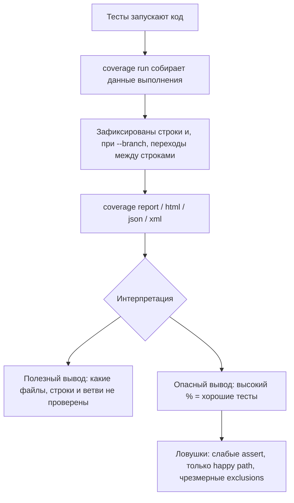

# Покрытие как прибор, а не как KPI: как использовать `coverage.py`, не подменяя качество одной цифрой

Процент покрытия легко гипнотизирует команду. В отчёте появляется 87%, потом 91%, потом кто-то предлагает довести до 100% — и кажется, будто качество тестов растёт автоматически. Но сама документация `coverage.py` описывает инструмент намного скромнее и точнее: он измеряет, какие части кода выполнялись, и помогает понять, что тесты задевают, а что нет. Это полезный индикатор, но не доказательство того, что тесты действительно проверяют поведение хорошо. В FAQ проекта эта мысль сформулирована ещё прямее: coverage полезен, но он не идеален. ([Coverage][1])

Нас интересует именно про такой взгляд на `coverage.py`: как измерять покрытие в проектах на `unittest`, как читать отчёты без самообмана, как настраивать инструмент так, чтобы он помогал разработке, и почему метрика покрытия должна быть нижним порогом дисциплины, а не заменой инженерного мышления. Я опираюсь на актуальную официальную документацию `coverage.py` и Python `unittest`. ([Coverage][1])

## Введение

Если упростить тему до одного вопроса, он звучит так: **что именно coverage измеряет, а что он принципиально измерить не может**. Документация `coverage.py` отвечает на первую часть очень ясно: во время выполнения инструмент наблюдает, какие строки были исполнены, затем анализирует исходники, чтобы понять, какие строки _могли_ быть исполнены, и после этого строит отчёт о покрытии и пропусках. То есть у него есть три фазы: execution, analysis и reporting. На уровне возможностей это означает, что coverage хорошо отвечает на вопрос «какой код запускался», но не отвечает на вопрос «насколько хороши assertions, набор сценариев и границы тестов». ([Coverage][2])

> Покрытие отвечает на вопрос «что исполнялось», а не на вопрос «насколько хорошо это было проверено». Поэтому coverage — это измерительный прибор, а не автоматическая оценка качества. ([Coverage][1])

## Что именно измеряет `coverage.py`

По умолчанию `coverage.py` измеряет line coverage, то есть statement coverage: какие исполнимые строки были выполнены. Документация в quick start и capabilities фиксирует это прямо. Branch coverage — отдельный режим: его нужно включать, и тогда coverage начинает учитывать не только сами строки, но и возможные переходы между ними, то есть branch destinations. В branch-режиме итоговый процент считается уже по execution opportunities: каждая исполнимая строка — это одна возможность, и каждый возможный выход ветвления — ещё одна возможность. ([Coverage][1])

Это фундаментально меняет смысл цифры. Если у Вас есть только line coverage, отчёт может сказать: «строка `if` была выполнена». Но он ещё не говорит, проходили ли обе ветви. Branch coverage как раз ловит такие ситуации. В документации сказано, что при branch measurement инструмент собирает пары номеров строк — source и destination — и сравнивает измеренные переходы с теми, которые статический анализ считает возможными. Именно поэтому branch coverage обычно даёт более честный сигнал для кода с развилками, ретраями, обработкой исключений и условной логикой. ([Coverage][3])

Полезно держать эту логику в голове визуально:



Именно в точке `E` появляется главное различие между метрикой и качеством. Инструмент честно собрал данные. Но смысл этим данным всё равно придаёт разработчик. Coverage не видит, была ли проверка сильной, увидел ли тест регрессию, охватил ли он отрицательные сценарии, правильно ли изолированы зависимости. Эти вопросы лежат уже за пределами самого прибора. ([Coverage][2])

Есть ещё один важный, но контринтуитивный момент из FAQ. Строки `def` и `class` считаются выполненными, когда модуль импортируется: именно тогда Python создаёт объекты функций и классов. Поэтому умеренный процент покрытия возможен даже там, где тесты почти не проверяют логику, а просто импортируют модуль и проходят по верхнему уровню. Документация прямо предупреждает: это может выглядеть неожиданно, но с точки зрения исполнения это честно — определения действительно выполнялись. ([Coverage][4])

Вот почему coverage нельзя читать как «процент хорошо протестированного поведения». Это процент исполненных возможностей, а не процент качественно доказанных свойств системы. Разница кажется тонкой только до первого реального проекта. Потом она становится центральной. ([Coverage][1])

## Почему высокий процент легко обманывает

Покажу это на коротком примере. Ниже — рабочий модуль и два разных стиля тестов. Оба могут дать приятную картину в coverage-отчёте, но ценность у них разная.

```python
# app/discount.py
def final_price(user_type: str, amount: int) -> int:
    if user_type == "vip":
        return int(amount * 0.9)
    if user_type == "staff":
        return int(amount * 0.8)
    return amount
```

Слабая версия тестов:

```python
# tests/test_discount_weak.py
import unittest
from app.discount import final_price


class TestFinalPriceWeak(unittest.TestCase):
    def test_smoke(self):
        self.assertIsNotNone(final_price("vip", 100))
        self.assertIsNotNone(final_price("staff", 100))
        self.assertIsNotNone(final_price("user", 100))
```

Сильнее и честнее:

```python
# tests/test_discount_strong.py
import unittest
from app.discount import final_price


class TestFinalPriceStrong(unittest.TestCase):
    def test_examples(self):
        cases = [
            {"user_type": "vip", "amount": 100, "expected": 90},
            {"user_type": "staff", "amount": 100, "expected": 80},
            {"user_type": "user", "amount": 100, "expected": 100},
        ]
        for case in cases:
            with self.subTest(user_type=case["user_type"], amount=case["amount"]):
                self.assertEqual(
                    final_price(case["user_type"], case["amount"]),
                    case["expected"],
                    msg="скидка должна зависеть от роли пользователя",
                )
```

Обе версии исполняют код. Coverage увидит, что функции вызывались, ветви проходились, строки были задействованы. Но только вторая версия действительно проверяет результат и бизнес-смысл вычисления. Первая почти не защищает код от регрессии: если в `vip`-ветке появится ошибка и функция начнёт возвращать 91 вместо 90, coverage останется почти таким же, а слабый тест всё равно пройдёт. Этот разрыв как раз и объясняет, почему документация говорит, что coverage помогает оценивать эффективность тестов, но не является совершенной метрикой сам по себе. ([Coverage][1])

Branch coverage улучшает сигнал, но не снимает проблему полностью. Да, он увидит, были ли пройдены разные направления условной логики. Да, в HTML-отчёте частично непокрытые ветви подсвечиваются жёлтым, а missing branch destinations показываются отдельно. Но даже branch coverage не знает, _что именно_ Вы проверили после выполнения ветви. Он видит исполнение пути, а не силу проверки на этом пути. ([Coverage][3])

Отсюда практическое правило. Если Вам нужна более честная цифра, включайте branch coverage. Если Вам нужно реальное качество тестов, повышайте качество самих тестов: assertions, негативные сценарии, граничные значения, ошибки, meaningful mocks, проверка контрактов. Coverage может подсветить пробел, но не может за Вас придумать хороший сценарий. ([Coverage][3])

## Базовый рабочий цикл с `unittest`

Quick start в официальной документации предлагает очень простой принцип: если Ваша команда обычно запускает тесты через `python ...`, замените начало команды на `coverage run ...`. Для `unittest` пример в документации дан буквально: `python3 -m unittest discover` превращается в `coverage run -m unittest discover`. А документация Python `unittest` уточняет, что `python -m unittest` эквивалентен `python -m unittest discover`, если Вы не передаёте специальные аргументы discovery. ([Coverage][1])

Для проекта на `unittest` базовый и полезный цикл обычно выглядит так:

```bash
coverage erase
coverage run --branch --source=app -m unittest discover
coverage report -m --skip-covered
coverage html
```

Эта последовательность хороша по нескольким причинам. `coverage erase` убирает старые данные; это полезно, потому что FAQ прямо предупреждает: если исходники сдвинулись, старые line numbers могут давать странные результаты, и явная очистка помогает от такой путаницы. `coverage run --branch` включает branch coverage. `--source=app` делает измерение сфокусированным именно на Вашем прикладном пакете. А `coverage report -m --skip-covered` сразу выводит текстовый отчёт с пропущенными строками и скрывает файлы, где уже 100%. ([Coverage][4])

Почему `--source` так важен? Документация на `Specifying source files` говорит две полезные вещи. Во-первых, без `source` coverage по умолчанию измеряет весь код, кроме стандартной библиотеки Python. Во-вторых, если `source` задан, coverage может находить и **полностью неисполненные** файлы внутри этого источника, потому что умеет просматривать дерево исходников и включать в отчёт то, что не запускалось вообще. Для отчёта по продукту это почти всегда лучше: Вы не смешиваете прикладной код с лишними модулями и не теряете пустые пробелы в пакете. Документация там же напоминает, что measurement добавляет speed penalty, так что фокусировка полезна не только для честности отчёта, но и для производительности. ([Coverage][5])

Есть ещё одна тонкая, но важная мысль из quick start. Coverage сам по себе не различает тестовый код и код продукта; в документации это сказано явно. То есть включать тесты в measurement — допустимый и осознанный сценарий. Но если Вы строите метрику именно для качества продуктового пакета, а не хотите мерить ещё и “насколько выполняются сами тестовые модули”, лучше явно ограничить измеряемый source. Иначе один процент начинает отвечать сразу на два разных вопроса. ([Coverage][1])

## Как читать текстовый отчёт без самообмана

`coverage report` — это не “устаревший интерфейс перед HTML”. Наоборот, это быстрый инструмент ежедневной работы. Документация `coverage report` показывает, что базовая таблица содержит `Stmts`, `Miss` и `Cover`, а опция `-m` добавляет столбец `Missing` с пропущенными строками. Если branch coverage включён, в отчёт добавляются ещё `Branch` и `BrPart`, а в `Missing` появляются стрелки вроде `40->45`, обозначающие непройденные переходы между строками. ([Coverage][6])

Это очень практично. Когда Вы видите строку вроде:

```text
app/discount.py      12   2  83%   7, 10->12
```

это значит не просто “покрытие упало”. Это значит: одна исполнимая строка не запускалась вовсе, а ещё один branch transition не был пройден. То есть coverage даёт не только процент, но и адрес. И чем быстрее Вы переходите от процента к адресу, тем полезнее инструмент. ([Coverage][6])

Опции `--skip-covered` и `--skip-empty` кажутся мелкими, но в ежедневной практике они очень важны. Документация `coverage report` и configuration reference объясняют их одинаково: первая скрывает файлы со 100% покрытием, вторая — файлы без исполнимого кода. Это не улучшает метрику, но резко улучшает читаемость. В большом проекте такой фильтр часто экономит больше времени, чем ещё одна десятая процента в итоговой цифре. ([Coverage][6])

Если нужен единичный показатель для CI или для сводного отчёта, `coverage report` умеет `--format=total`, а если нужен более человекочитаемый текстовый артефакт для комментария в PR — `--format=markdown`. Но здесь важно не перепутать удобство вывода с содержанием. Даже когда CI видит только одну цифру, разработчику всё равно нужно читать адресные пропуски через `-m` или HTML. Иначе метрика снова превращается в KPI без диагноза. ([Coverage][6])

## HTML-отчёт — это не украшение, а рабочая карта пропусков

Документация `coverage html` описывает HTML-отчёт как аннотированный исходный код: модульные страницы с подсветкой того, что было выполнено и чего не было. Цвета важны и функциональны: зелёный означает исполненные строки, красный — пропущенные, серый — исключённые, а жёлтый появляется для partial branches при branch coverage. Документация также отмечает, что coverage хранит рядом с HTML-отчётом служебные данные и при повторной генерации в ту же директорию умеет пропускать неизменившиеся страницы, ускоряя следующий прогон. ([Coverage][7])

Это превращает HTML-отчёт в хороший режим для анализа “последних 10–20%” покрытия. Текстовый report лучше для сводки, HTML лучше для ответа на вопрос: _что именно происходит в конкретной функции_. Особенно полезен он в ветвящейся логике: жёлтые строки с partial branches и подписи недостающих переходов дают визуальный сигнал намного быстрее, чем чтение чисел в таблице. ([Coverage][3])

Команда обычно простая:

```bash
coverage html
```

По умолчанию каталог — `htmlcov`, но его можно поменять либо флагом `-d`, либо через `[html] directory` в конфиге. Это стоит делать, только если у Вас в проекте уже есть договорённость о другой структуре артефактов. В большинстве случаев дефолтный `htmlcov` удобен и узнаваем. ([Coverage][7])

## Настройка, которая помогает команде, а не завышает цифру

Coverage удобнее всего работает, когда настройки живут рядом с кодом и повторяются одинаково в локальном запуске, в CI и в любых скриптах команды. Configuration reference прямо говорит: конфигурационный файл нужен для согласованного повторного запуска и для параметров, которые не всегда удобно держать в команде запуска. По умолчанию coverage ищет `.coveragerc` в текущей директории. Если его нет и явно не указан другой файл, инструмент последовательно смотрит в `.coveragerc.toml`, `setup.cfg`, `tox.ini` и `pyproject.toml`. ([Coverage][8])

Для современного проекта на `unittest` хороший базовый вариант может выглядеть так:

```toml
# pyproject.toml
[tool.coverage.run]
branch = true
source = ["app"]
dynamic_context = "test_function"

[tool.coverage.report]
show_missing = true
skip_covered = true
skip_empty = true
fail_under = 85.0
precision = 1
exclude_also = [
    "def __repr__",
    "if settings\\.DEBUG",
    "raise NotImplementedError",
]

[tool.coverage.html]
directory = "htmlcov"
show_contexts = true
```

Почему именно эти настройки? `branch = true` включает branch coverage. `source = ["app"]` ограничивает measurement прикладным кодом и позволяет видеть вообще неисполненные файлы. `show_missing = true` делает текстовый report адресным. `skip_covered = true` и `skip_empty = true` снижают шум. `fail_under = 85.0` превращает coverage в защитный порог от деградации, а `precision = 1` нужна, потому что documentation explicitly warns: если используете нецелое `fail_under`, точность вывода надо настроить так, чтобы десятичные значения имели смысл. `dynamic_context = "test_function"` даёт возможность позже понять, какой тест прошёл по какой строке. А `show_contexts = true` позволяет показать эти данные в HTML-отчёте. ([Coverage][8])

Отдельно важно, что configuration reference рекомендует для исключений использовать не старое `exclude_lines`, а `exclude_also`, если Вы хотите добавить свои правила, не уничтожая стандартный набор. Документация формулирует это прямо: `exclude_also` предпочтительнее, потому что сохраняет дефолтные шаблоны вроде `pragma: no cover`, тогда как `exclude_lines` заменяет весь список целиком. Та же логика есть и для partial branches: `partial_also` лучше, чем голое `partial_branches`, если Вы не хотите потерять дефолтный `pragma: no branch`. ([Coverage][8])

## Исключения: где coverage помогает, а где его можно “накрасить”

У `coverage.py` есть совершенно законный механизм исключения кода из отчёта. Документация `Excluding code from coverage.py` описывает стандартные исключения по умолчанию: строка с `# pragma: no cover` исключается из line coverage; для branch coverage есть `# pragma: no branch`; кроме того, coverage автоматически не ругается на некоторые заведомо частичные конструкции вроде `if True:`, `while True:` и ветвей `if TYPE_CHECKING:`. ([Coverage][9])

Это полезно. В реальном коде действительно бывает отладочная ветка, платформенный guard, абстрактный метод, защитный `raise NotImplementedError`, код для type checkers или сознательно частичная ветка цикла. Без исключений отчёт быстро начинает шуметь по местам, которые не добавляют ценности. Но именно здесь coverage чаще всего превращают в косметику: вместо того чтобы признать пробел и дописать тест, разработчик ставит pragma и возвращает цифру на прежний уровень. ([Coverage][10])

Вот корректный и некорректный стиль на одном примере:

```python
from typing import TYPE_CHECKING

if TYPE_CHECKING:
    from app.types import UserDTO


def render_debug(user) -> str:
    if user.debug:  # pragma: no cover
        return f"DEBUG<{user.id}>"
    return str(user.id)


def retry_forever(fetch):
    while True:  # pragma: no branch
        result = fetch()
        if result is not None:
            return result
```

Здесь `TYPE_CHECKING`, чисто debug-ветка и заведомо частичная ветка retry-цикла — разумные кандидаты на исключение. Но если Вы начинаете прятать под `pragma: no cover` обычную прикладную логику, которую просто неудобно тестировать, coverage перестаёт быть измерителем и становится инструментом маскировки. Документация и по `exclude_also`, и по `exclude_lines` отдельно предупреждает: шаблоны — это regex, они могут overmatch, whole blocks can be excluded, а careless pattern легко скроет гораздо больше, чем Вы планировали. ([Coverage][8])

Из этого вытекает хорошее командное правило: любой `pragma: no cover` и любое новое правило в `exclude_also` должны проходить через такой же review, как и production-код. Иначе Вы оптимизируете не тесты, а картинку отчёта.

## Контексты: когда одного процента уже мало

Одна из самых недооценённых возможностей coverage — measurement contexts. Документация описывает их как механизм записи контекста, в котором строка или ветка была выполнена. И FAQ даёт очень практический вопрос, на который contexts отвечают: «какой тест прошёл по этой строке?» Для этого можно включить `dynamic_context = test_function`, а потом использовать `--contexts` при генерации HTML-отчёта. В HTML есть и отдельная опция `--show-contexts`, которая помечает строки контекстами, которые их выполнили. ([Coverage][11])

Это особенно полезно, когда процент уже высокий, но Вы пытаетесь понять качество оставшегося покрытия. Например, строка помечена зелёной, но на самом деле её задевает только один широкий интеграционный тест, который почти ничего про неё не утверждает. Или наоборот: важная ветка покрыта несколькими узкими unit-тестами, и это уже другой уровень уверенности. Coverage без contexts показывает только “исполнялось / не исполнялось”. Coverage с contexts показывает, **какой именно тип тестов дал это покрытие**. ([Coverage][11])

Именно здесь coverage перестаёт быть просто KPI и начинает становиться инструментом инженерного анализа. Вы больше не спорите о цифре “85 или 87”. Вы смотрите, что из критической логики покрыто только широким happy-path сценарием, а что действительно закрыто адресными тестами. В такой форме contexts очень хорошо поддерживают мысль всей темы: измерять — да, подменять качество метрикой — нет. ([Coverage][11])

## Как строить разумную политику команды

Теперь самая важная прикладная часть. Документация `coverage report` и configuration reference честно дают командную механику: `--fail-under` или `[report] fail_under` позволяют проваливать сборку, если общее покрытие ниже заданного значения; exit status в этом случае будет `2`. Документация прямо называет это годным механизмом pass/fail для CI. То есть использовать порог в pipeline — абсолютно штатная практика. ([Coverage][12])

Но этот порог должен быть именно **guardrail**, а не доказательство качества. Хорошая политика обычно выглядит так:

Нижний порог есть, чтобы не допускать деградации. Например, проект не падает ниже 85%. Это удерживает команду от незаметного сползания назад. Но сам по себе проход порога ещё ничего не гарантирует. После этого всё равно нужен взгляд на `coverage report -m`, на branch gaps, на exclusions и на качество самих тестов. Это уже инженерное решение, а не механическая цифра. Документация coverage даёт Вам адресность через `-m`, HTML, contexts и branch stats; игнорировать их и смотреть только на TOTAL — значит сознательно выбрасывать самую полезную часть инструмента. ([Coverage][6])

Есть и более тонкая вещь. Если команда однажды выбрала порог, ей не обязательно сразу гнаться за 100. Configuration reference прямо предупреждает: `fail_under = 100` провалит любую величину строго меньше 100, независимо от десятичной точности. Для многих реальных систем это слишком жёстко и провоцирует либо гонку за косметическими тестами, либо чрезмерные exclusions. Намного здоровее постепенно поднимать floor и отдельно обсуждать критические модули, где branch coverage и quality of assertions важнее общей средней цифры. ([Coverage][8])

Отдельная зрелая практика — различать “coverage как контроль регрессии” и “coverage как карта долга”. Первое — это `fail_under`, не дающий проекту деградировать. Второе — это регулярная работа по отчёту: посмотреть пропущенные строки и ветви в важных модулях, понять, где нужны ещё сценарии, где coverage обманчиво высок из-за импорта, где exclusions пора пересмотреть. Документация даёт для этого все нужные механизмы: summary report, HTML, contexts, exclusions, branch measurement. Но решение всё равно принимает команда, а не сама метрика. ([Coverage][6])

## Короткий рабочий шаблон для проекта на `unittest`

Если нужна практическая отправная точка без долгих обсуждений, можно начать так:

```bash
coverage erase
coverage run --branch --source=app -m unittest discover
coverage report -m --skip-covered
coverage html
```

```toml
[tool.coverage.run]
branch = true
source = ["app"]
dynamic_context = "test_function"

[tool.coverage.report]
show_missing = true
skip_covered = true
skip_empty = true
fail_under = 85
exclude_also = [
    "def __repr__",
    "raise NotImplementedError",
]

[tool.coverage.html]
show_contexts = true
```

Этого уже достаточно, чтобы coverage начал выполнять свою настоящую функцию: показывать непроверенные области, а не просто генерировать красивую цифру в CI. Дальше команда обычно дозревает до тонких настроек сама — когда появляются реальные branch-gaps, вопросы к exclusions или желание увидеть, какой тест задел конкретную строку. И это нормальный путь. Coverage лучше внедрять как прибор наблюдения, а не как лозунг “у нас должно быть N процентов”. ([Coverage][5])

## Заключение

`coverage.py` полезен именно тогда, когда Вы не просите от него невозможного. Он прекрасно измеряет, какие строки и ветви выполнялись, помогает находить пропуски, умеет показывать непокрытые файлы, строить HTML-карту, фильтровать шум, записывать contexts и жёстко удерживать проект от деградации через `fail_under`. Всё это делает его сильным инструментом разработки. Но он не умеет оценивать смысл assertions, полноту набора сценариев, адекватность моков и качество проектных решений. Это уже область тест-дизайна и инженерного review. ([Coverage][1])

Поэтому healthiest mindset для команды звучит так: покрытие — это навигатор, а не цель поездки. Используйте его, чтобы видеть слепые зоны. Включайте branch coverage, настраивайте `source`, читайте `Missing`, не злоупотребляйте exclusions, подключайте contexts там, где нужна глубина анализа. И держите `fail_under` как нижний порог дисциплины, а не как замену качественным тестам. Тогда coverage действительно помогает разработке — и перестаёт быть просто числом в badge. ([Coverage][5])

## Дополнительные материалы

Официальная документация `coverage.py`: quick start, capabilities и базовый рабочий цикл `coverage run` → `coverage report -m` → `coverage html`. ([Coverage][1])

Официальная документация `coverage.py`: `Specifying source files` — зачем нужен `--source`, как работают `include`/`omit`, почему measurement стоит фокусировать и как coverage находит полностью неисполненные файлы. ([Coverage][5])

Официальная документация `coverage.py`: `Branch coverage measurement` — как считаются execution opportunities, partial branches и зачем нужен `# pragma: no branch`. ([Coverage][3])

Официальная документация `coverage.py`: `Coverage summary: coverage report` и `HTML reporting: coverage html` — `-m`, `--skip-covered`, стрелки missing branches, цвета HTML-отчёта, contexts в HTML. ([Coverage][6])

Официальная документация `coverage.py`: `Configuration reference` — `.coveragerc`, `pyproject.toml`, `[run] source`, `[run] branch`, `[run] dynamic_context`, `[report] fail_under`, `precision`, `show_missing`, `skip_covered`, `exclude_also`. ([Coverage][8])

Официальная документация `coverage.py`: `FAQ and other help` — почему `def`-строки считаются выполненными при импорте, как работает `coverage erase`, как узнать, какой тест прошёл по строке, и почему coverage сам по себе не идеален как метрика качества. ([Coverage][4])

Официальная документация Python: `unittest` command-line interface и `discover`, чтобы правильно собирать команду вида `coverage run -m unittest discover`. ([Python documentation][13])

[1]: https://coverage.readthedocs.io/ "Coverage.py — Coverage.py 7.13.5 documentation"
[2]: https://coverage.readthedocs.io/en/7.13.4/howitworks.html "How coverage.py works — Coverage.py 7.13.4 documentation"
[3]: https://coverage.readthedocs.io/en/latest/branch.html "Branch coverage measurement — Coverage.py 7.13.5 documentation"
[4]: https://coverage.readthedocs.io/en/7.12.0/faq.html "FAQ and other help — Coverage.py 7.12.0 documentation"
[5]: https://coverage.readthedocs.io/en/7.13.4/source.html "Specifying source files — Coverage.py 7.13.4 documentation"
[6]: https://coverage.readthedocs.io/en/latest/commands/cmd_report.html "Coverage summary: coverage report — Coverage.py 7.13.5 documentation"
[7]: https://coverage.readthedocs.io/en/latest/commands/cmd_html.html "HTML reporting: coverage html — Coverage.py 7.13.5 documentation"
[8]: https://coverage.readthedocs.io/en/latest/config.html "Configuration reference — Coverage.py 7.13.5 documentation"
[9]: https://coverage.readthedocs.io/en/latest/excluding.html?utm_source=chatgpt.com "Excluding code from coverage.py - Read the Docs"
[10]: https://coverage.readthedocs.io/en/latest/excluding.html "Excluding code from coverage.py — Coverage.py 7.13.5 documentation"
[11]: https://coverage.readthedocs.io/en/7.13.4/contexts.html "Measurement contexts — Coverage.py 7.13.4 documentation"
[12]: https://coverage.readthedocs.io/en/latest/commands/cmd_reporting.html "Reporting — Coverage.py 7.13.5 documentation"
[13]: https://docs.python.org/3/library/unittest.html "unittest — Unit testing framework — Python 3.14.3 documentation"
