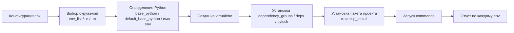

# Один проект, много Python: как использовать `tox` для запуска в нескольких окружениях и не утонуть в конфигурации

На раннем этапе проекта всё обычно выглядит просто: одна версия Python, один набор зависимостей, один запуск тестов. Проблемы начинаются позже. На CI уже нужен Python 3.11, 3.12 и 3.13. Локально у части команды есть только одна версия интерпретатора. Линтеры и type-checking хотят свои зависимости. Документация хочется собирать отдельно. И вдруг оказывается, что “просто запустить тесты” — это уже не одна команда, а маленькая система оркестрации. Именно эту задачу и решает `tox`: он описывает окружения, создаёт их, ставит зависимости и запускает команды в изоляции. В официальном user guide `tox` прямо называется _environment orchestrator_ и показывается как инструмент не только для тестов, но и для линтеров, форматтеров, генерации документации и сборочных задач. ([Tox][1])

## Введение

Тема `tox` часто подаётся как “обёртка вокруг виртуальных окружений”. Это слишком слабое описание. В актуальной документации жизненный цикл `tox` выглядит так: загрузка конфигурации, выбор окружений, создание virtualenv, установка зависимостей, при необходимости сборка и установка пакета проекта, запуск команд и итоговый отчёт по каждому окружению. Для запуска нескольких Python-версий и разных dependency-профилей это гораздо ближе к правде, чем образ “одного большого ini-файла”. ([Tox][2])

## С какой модели начать

Полезно думать о `tox` не как о “запуске тестов”, а как о конвейере для каждого выбранного окружения. Сначала `tox` читает конфигурацию. Потом выбирает целевые окружения. Затем для каждого окружения определяет Python-интерпретатор, создаёт или переиспользует virtualenv, устанавливает `deps` и `dependency_groups` либо, в новых конфигурациях, ставит зависимости из `pylock.toml`, затем при необходимости устанавливает пакет проекта и только после этого запускает команды. Если в окружении несколько команд, они идут по порядку и останавливаются на первой ошибке. Это базовая рабочая модель, и без неё `tox` действительно кажется “магией”. ([Tox][2])



Именно из этой модели вытекают почти все практические решения. Если Вы понимаете, в какой фазе что происходит, Вам проще понять, где задавать Python-версию, где хранить тестовые зависимости, а где отделять `lint` и `type` от `test`. В свежем разделе _System overview_ документация `tox` описывает этот жизненный цикл практически в такой же последовательности. ([Tox][2])

## Где `tox` ищет конфиг и почему это важно

Одна из самых неприятных проблем в `tox` — думать, что Вы правите один конфиг, а реально запускается другой. Актуальная reference-документация перечисляет порядок поиска очень чётко: `tox.ini`, затем `setup.cfg`, затем `pyproject.toml` с `legacy_tox_ini`, затем нативный `pyproject.toml` под `tool.tox`, и только потом `tox.toml`. Если в репозитории лежат сразу несколько вариантов, побеждает не тот, который “новее”, а тот, который выше в этом приоритете. Это важно проговорить отдельно, потому что именно из-за такой ситуации команды иногда неделями живут с конфигом, который никто не исполняет. ([Tox][3])

С форматом тоже важно не опираться на старые статьи. Свежая документация уже говорит, что INI и TOML покрывают одни и те же возможности разным синтаксисом, а единственное остающееся INI-специфическое место — generative section names. Это сочетается с changelog `tox` 4.42–4.43, где отдельно зафиксированы новые возможности TOML: условные выражения через `factor.NAME` и TOML-native генерация `env_list` через `product`-dict syntax. Если Вы читали старые материалы, где TOML называли “урезанным форматом без матриц”, учитывайте, что это уже не полная картина. ([Tox][4])

Практически это означает простую рекомендацию. Для нового проекта можно спокойно брать нативный TOML-конфиг в `pyproject.toml` или `tox.toml`. Для существующего проекта с короткими factor-секциями и историческим `tox.ini` переходить на TOML только “ради моды” необязательно. Важнее, чтобы команда понимала текущий формат и не держала параллельно несколько конфликтующих конфигов. ([Tox][3])

## Версии Python: `env_list`, `base_python` и предсказуемость

У `tox` есть две связанные задачи: понять, **какие окружения запускать**, и понять, **какой Python использовать** для каждого из них. Первая решается через `env_list`: это список окружений, которые запускаются по умолчанию, если пользователь ничего явно не выбрал в CLI. Вторая — через `base_python`, имя окружения и, в актуальном `tox` 4.42+, через `default_base_python` как запасной интерпретатор, если в имени окружения нет Python-фактора и явный `base_python` тоже не задан. В свежем _System overview_ это сформулировано буквально: сначала `base_python`, затем попытка извлечь Python из имени env, затем `default_base_python`, и только потом — Python, под которым запущен сам `tox`. ([Tox][3])

Это особенно важно для окружений вроде `lint`, `type`, `docs` или `coverage`. Их имена сами по себе не говорят, на каком Python они должны жить. Если ничего не задать, `tox` может упасть обратно на host Python, а это уже порождает знаменитый сценарий “локально всё работало на 3.13, а в CI `tox` крутится под 3.11”. Именно поэтому в проектах с несколькими версиями Python лучше либо кодировать версию в имени тестового окружения, либо явно задавать `base_python` для сервисных env’ов. А если проект поддерживает свежий `tox` 4.42+, можно централизованно задать `default_base_python` как предсказуемый fallback. Это отдельно отмечено и в changelog, и в конфигурационном описании. ([Tox][3])

Есть ещё одна практическая ловушка. Документация `base_python` прямо предупреждает: если оставить его неуказанным, а пакет проекта требует более новый Python, чем тот, под которым установлен сам `tox`, можно получить ошибку уже на фазе сборки и установки пакета. То есть проблема возникнет не потому, что тесты не запустились, а потому, что выбранный по умолчанию Python не совместим с `Requires-Python` пакета. Это хороший пример того, почему явная модель выбора интерпретатора в `tox` лучше неявной. ([Tox][3])

Ниже — рабочий и современный минимальный вариант в `pyproject.toml`:

```toml
[dependency-groups]
test = ["pytest>=8"]
lint = ["ruff>=0.6"]
type = ["mypy>=1.11"]

[tool.tox]
requires = ["tox>=4"]
env_list = ["3.11", "3.12", "3.13", "lint", "type"]
skip_missing_interpreters = true

[tool.tox.env_run_base]
dependency_groups = ["test"]
commands = [["python", "-m", "unittest", "discover", "-s", "tests"]]

[tool.tox.env.lint]
base_python = "3.13"
skip_install = true
dependency_groups = ["lint"]
commands = [["ruff", "check", "."]]

[tool.tox.env.type]
base_python = "3.13"
skip_install = true
dependency_groups = ["type"]
commands = [["mypy", "src", "tests"]]
```

В этом примере тестовые env’ы по версиям Python идут по `env_list`, а `lint` и `type` намеренно привязаны к одному явному интерпретатору. `skip_install = true` для них оправдан, потому что этим окружениям не нужен установленный пакет проекта как тестируемый артефакт; им нужен virtualenv и набор инструментов. Reference-документация `tox` описывает `skip_install` именно как способ оставить управление virtualenv, но не ставить текущий пакет в окружение. ([Tox][3])

## Как думать о зависимостях: `dependency_groups`, `deps`, `constraints`, `extras`

Самая сильная часть современного `tox` — это то, что он уже не заставляет сваливать все зависимости в одно поле. У Вас есть как минимум четыре разных механизма, и у каждого своя роль.

### `dependency_groups`

С версии 4.22 `tox` поддерживает `dependency_groups` — группы зависимостей по PEP 735. Документация прямо рекомендует этот путь, если Вы задаёте обычные PEP 508 requirement strings и не тянете requirement/constraint-файлы. Эти группы ставятся в окружение **до** установки пакета проекта и его зависимостей. Для командной поддержки это очень удобный вариант: тестовые, type-check и lint-зависимости живут в одной структуре и не дублируются по разным env’ам. ([Tox][3])

### `deps`

`deps` — это более старый и более общий механизм. В нём можно указывать обычные Python-зависимости, requirement files через `-r` и constraint files через `-c`. То есть это хороший инструмент, когда у Вас уже есть исторический `requirements-test.txt`, жёсткие constraints или смешанный dependency-source. Но если у Вас только обычные requirement-строки, сама документация советует предпочесть `dependency_groups`. Это делает конфиг чище и лучше сочетается с современным `pyproject.toml`. ([Tox][3])

### `constraints`

С версии 4.28 у `tox` есть отдельная настройка `constraints`. Это важное уточнение: docs подчёркивают, что она предпочтительнее, если Вы хотите, чтобы constraints распространялись не только на дополнительные зависимости из `deps`, но и на package dependencies. В больших проектах это часто полезнее, чем `-c` внутри `deps`, потому что цель constraints почти всегда шире одной первой установки. ([Tox][3])

### `extras`

Если у пакета уже есть `project.optional-dependencies` в `pyproject.toml`, то `tox` умеет ставить пакет вместе с этими extras через настройку `extras`. How-to guide объясняет пользу очень прямо: это позволяет не дублировать dependency-списки одновременно в `pyproject.toml` и в `tox`-конфиге. Для env’ов вроде `docs`, `postgres`, `redis` или `cli` это очень здоровый путь. ([Tox][5])

Для ориентира удобно держать вот такую таблицу:

| Механизм            | Когда брать                                                          | Сильная сторона                                 |
| ------------------- | -------------------------------------------------------------------- | ----------------------------------------------- |
| `dependency_groups` | обычные dev/test/tool requirements                                   | современно и без дублирования                   |
| `deps`              | нужны `-r`, `-c` или исторические requirement-файлы                  | совместимость и гибкость                        |
| `constraints`       | нужно стабилизировать версии package dependencies и test deps вместе | честнее, чем `-c` только в `deps`               |
| `extras`            | пакет уже описывает optional dependencies                            | не дублируете одни и те же списки в двух местах |

Это разделение даёт важный организационный эффект. Вы перестаёте спрашивать “куда вообще положить зависимость?” и начинаете спрашивать “какого типа это зависимость?”. Для поддерживаемости это гораздо лучше одного огромного списка `deps`. И это не философия, а прямой вывод из текущей reference- и how-to-документации `tox`. ([Tox][3])

## А если нужен не список, а lock-файл

Это уже новый уровень, но для 2026 года его нельзя игнорировать. В актуальном _System overview_ и changelog указано, что с `tox` 4.44 можно использовать `pylock.toml` по PEP 751 через настройку `pylock`. В этом режиме `tox` ставит уже зафиксированные зависимости из lock-файла, фильтруя их по extras, dependency groups и platform markers. При этом `pylock` взаимоисключается с `deps`, потому что lock-файл уже должен содержать весь разрешённый граф зависимостей. ([Tox][2])

Для темы 13.2 это не базовый сценарий, но полезно знать логику развития инструмента. Если проект живёт на fully locked dependencies, `tox` уже умеет работать не только с “сырыми” списками зависимостей, но и с lock-режимом. То есть сам инструмент всё лучше подстраивается под взрослые dependency-policy команды, а не только под учебные `deps = pytest`. ([Tox][2])

## Группировка и порядок: `labels` и `depends`

Как только окружений становится больше трёх-четырёх, читать и запускать их по одному становится неудобно. Для этого в `tox` есть два разных механизма, и их важно не путать.

`labels` — это способ **группировать** окружения по смыслу. How-to guide показывает это на примере `test` и `check`: тестовые env’ы получают label `test`, а `lint` и `type` — label `check`, после чего можно запускать их группами через `tox run -m check` или `tox run -m test`. Это лучший способ не заставлять разработчика помнить полное имя каждого окружения. ([Tox][5])

`depends` — это способ задать **порядок** между окружениями. И здесь есть очень важная оговорка. Документация повторяет её несколько раз: `depends` не “подтягивает” зависимые env’ы в запуск автоматически. Он только упорядочивает **уже выбранный** набор целей. То есть если Вы выбрали `coverage`, а она зависит от `3.*`, `tox` не обязан сам внезапно расширить запуск до всех Python-окружений, если они не входят в выбранный target set. Документация even gives almost this exact warning. ([Tox][3])

> `depends` — это про порядок внутри выбранного запуска, а не про автоматическое расширение списка окружений. Если этот принцип не держать в голове, конфигурация с `coverage` и `build` начинает вести себя неожиданно. ([Tox][3])

Самый полезный пример здесь — агрегирующее coverage-окружение. Официальный how-to прямо показывает pattern: тесты гоняются в нескольких Python-версиях, каждое окружение пишет свой `.coverage.<hash>`, а отдельное env `coverage` с `depends = ["3.*"]` делает `coverage combine` и итоговый report. Это очень хороший пример того, как `depends` должен использоваться в живом проекте: не для dependency-installation, а для orchestration порядка между готовыми окружениями. ([Tox][5])

```toml
[tool.tox]
env_list = ["3.11", "3.12", "3.13", "coverage"]

[tool.tox.env_run_base]
deps = ["coverage[toml]"]
commands = [["coverage", "run", "-p", "-m", "unittest", "discover", "-s", "tests"]]

[tool.tox.env.coverage]
skip_install = true
deps = ["coverage[toml]"]
depends = ["3.*"]
commands = [
  ["coverage", "combine"],
  ["coverage", "report", "--fail-under=80"],
]
```

Именно здесь особенно полезно помнить ещё один свежий факт: `depends` умеет glob-паттерны через `fnmatch`, так что `3.*` — это не хак, а штатный документированный синтаксис. ([Tox][2])

## Локальная машина и CI — это не один и тот же режим

На локальной машине разработчик редко держит все поддерживаемые Python-версии одновременно. На CI, наоборот, Вам обычно нужна строгая и предсказуемая среда. Поэтому режимы `tox` для локальной работы и для pipeline не должны быть одинаковыми “по инерции”.

Для локальной разработки полезна настройка `skip_missing_interpreters = true` либо CLI-опция `--skip-missing-interpreters true`. Документация прямо объясняет её назначение: `tox` не падает, если часть заявленных env’ов не может быть создана из-за отсутствующих интерпретаторов. Это особенно уместно на developer box, где у человека может быть только подмножество поддерживаемых версий. CLI также даёт `--discover PATH`, чтобы сначала искать Python-исполняемые файлы в указанных местах — это помогает на нестандартных установках и системах с несколькими менеджерами версий. ([Tox][3])

На CI логика обычно другая. How-to guide показывает рекомендованный pattern для GitHub Actions: матрица по `python-version`, `setup-python`, установка `tox`, затем `tox run -e ${{ matrix.python-version }}`. Это хороший компромисс: CI сам гарантирует наличие конкретного интерпретатора, а `tox` внутри job отвечает за зависимость и команды для именно этого env. Такой подход проще дебажить, чем один гигантский job на все версии сразу, и он лучше изолирует version-specific падения. ([Tox][5])

Есть ещё один взрослый организационный плюс у такого разделения. Локально разработчик может запускать `tox run` целиком, `tox run -m check` для всех статических env’ов или `tox run -e 3.12` для конкретной версии. А CI не обязан повторять весь сценарий разработки один в один: ему выгоднее быть явным и детерминированным по каждому target env. Документация `tox` поддерживает оба режима. ([Tox][6])

## Параллельный запуск: ускорение без новой конфигурационной каши

Когда окружений много, возникает естественное желание гонять их параллельно. У актуального CLI для этого есть `tox run-parallel`, а также опции `-p/--parallel`, `--parallel-live` и `--parallel-no-spinner`. Это штатная часть интерфейса, а не плагин. Если окружения независимы, такой режим даёт ощутимый выигрыш. ([Tox][6])

Но у параллельного режима есть практический нюанс: сами команды внутри env’ов должны быть изолированы не только по virtualenv, но и по временным каталогам. How-to guide показывает это на pytest и рекомендует в parallel mode передавать уникальный `--basetemp={env_tmp_dir}`. Даже если Ваш проект использует `unittest`, сама идея остаётся верной: если test runner или вспомогательные утилиты пишут во временные пути, эти пути должны быть разнесены по env’ам, а не шариться между ними. ([Tox][5])

## Частые ошибки, которые портят поддерживаемость

Первая ошибка — держать в одном env всё подряд: тесты, линтеры, type-checking, docs. Формально `tox` это позволяет. Но документация явно говорит, что команды внутри env идут по порядку и останавливаются на первой ошибке. Поэтому один перегруженный env даёт плохую диагностику и делает зависимостной стек лишне тяжёлым. Отдельные `lint`, `type`, `docs`, `3.12`, `3.13` обычно полезнее одного `all`. ([Tox][3])

Вторая ошибка — рефлекторно запускать `-r` при любой проблеме. Свежий _System overview_ объясняет, что `tox` сам отслеживает изменения зависимостей проекта: новые зависимости доставляются на следующем запуске, удаление зависимостей вызывает автоматическое пересоздание окружения, и это работает даже для requirements-файлов внутри `deps`. То есть `--recreate` нужен не “по привычке”, а тогда, когда Вы действительно хотите принудительно пересоздать env. ([Tox][2])

Третья ошибка — дублировать один и тот же dependency-список в нескольких местах. Если у пакета уже есть extras, используйте `extras`. Если у проекта уже есть групповые dev-dependencies, используйте `dependency_groups`. Если нужны constraints на package dependencies, используйте отдельный `constraints`. Чем позже команда разведёт эти роли, тем болезненнее будет переписывать конфиг. ([Tox][3])

Четвёртая ошибка — не думать о typo-safety. How-to guide отдельно предупреждает, что по умолчанию `tox -e <name>` с неописанным env может всё равно сработать и создать окружение с дефолтными настройками, а это легко маскирует опечатки. Для env’ов, похожих на Python-версии, сделано исключение, но для произвольных имён вроде `unt` вместо `unit` такой сценарий вполне реален. Это один из тех нюансов, которые редко знают новички и из-за которых команды иногда “успешно ничего не тестируют”. ([Tox][5])

## заключение

`tox` полезен не потому, что умеет создавать virtualenv. Это умеют и другие инструменты. Его ценность в том, что он даёт **одну точку управления матрицей Python-версий, наборами зависимостей и сценариями запуска**. `env_list` отвечает за default targets, `base_python` и `default_base_python` — за выбор интерпретатора, `dependency_groups` / `deps` / `constraints` / `extras` — за dependency-policy, `labels` — за смысловые группы, `depends` — за порядок между выбранными env’ами. Когда эти роли разделены, конфигурация перестаёт быть “магическим файлом” и становится читаемой картой проекта. ([Tox][3])

Самый здоровый способ внедрять `tox` в проект — не пытаться описать всё сразу. Начните с двух-трёх env’ов: пара версий Python и один `lint` либо `type`. Затем вынесите зависимости из сырых `deps` туда, где им место: в `dependency_groups`, `extras` или `constraints`. После этого добавьте `labels`, если окружений стало много, и `depends`, если у Вас появился агрегирующий env вроде `coverage`. Такой путь почти всегда лучше, чем большой “идеальный” конфиг с первого дня. ([Tox][5])

И последнее. Если Вы читали старые заметки про `tox`, перепроверьте версии. В 2026 году `tox 4` уже заметно современнее, чем многие старые статьи: TOML-конфиг стал полноценнее, появились `dependency_groups`, `default_base_python`, `pylock`, а часть старых рекомендаций про формат и матрицы уже устарела. В теме инструментов интеграции это особенно важно: свежая модель обычно экономит много времени на сопровождении. ([Tox][7])

## Дополнительные материалы

Официальная документация `tox`: обзор, базовый пример `env_list`, разнесение env’ов для тестов, линтинга и type-checking. ([Tox][1])

Reference по конфигурации `tox`: форматы файлов, порядок поиска конфигов, `env_list`, `skip_missing_interpreters`, `base_python`, `dependency_groups`, `deps`, `constraints`, `extras`. ([Tox][3])

How-to guides `tox`: примеры для coverage-агрегатора через `depends`, группировки env’ов через `labels`, CI-паттерны, `extras` и constraints. ([Tox][5])

CLI reference `tox`: `tox run`, `-e`, `-m`, `--discover`, `--skip-missing-interpreters`, parallel options. ([Tox][6])

Changelog `tox` 4.42–4.44: `default_base_python`, TOML factor conditions, TOML-native product `env_list`, `pylock.toml`. Если в проекте сложная матрица и старая документация противоречит текущему поведению, начинать проверку стоит именно отсюда. ([Tox][7])

[1]: https://tox.wiki/en/4.34.1/user_guide.html "User Guide - tox"
[2]: https://tox.wiki/en/4.50.1/explanation.html "Concepts - tox"
[3]: https://tox.wiki/en/latest/_sources/config.rst.txt "tox.wiki"
[4]: https://tox.wiki/en/latest/config.html?utm_source=chatgpt.com "Configuration"
[5]: https://tox.wiki/en/4.36.1/howto.html "How-to Guides - tox"
[6]: https://tox.wiki/en/4.21.2/cli_interface.html "tox - CLI interface - tox"
[7]: https://tox.wiki/en/latest/changelog.html "Release History - tox"
