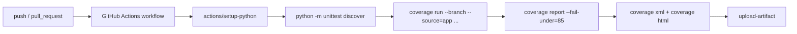

# Минимальный CI без самообмана: `python -m unittest discover` и отчёт покрытия на каждый `push` и `pull_request`

Минимальный CI для Python-проекта не должен быть большим. Он должен делать две вещи стабильно и без сюрпризов: запускать тот же тестовый прогон, который Вы можете повторить локально, и публиковать coverage-результат, который умеет завалить pipeline, если покрытие упало ниже договорённого порога. Для `unittest` это особенно удобно: `python -m unittest` без аргументов эквивалентен `python -m unittest discover`, а `coverage report --fail-under=...` завершает процесс с кодом `2`, то есть естественно встраивается в pass/fail-логику CI. ([Python documentation][1])

## Введение

Если убрать всё второстепенное, у минимального CI-контура для проекта на `unittest` есть три обязанности. Первая — найти и запустить тесты предсказуемо. Вторая — измерить покрытие кода и показать, какие строки или ветви не были задействованы. Третья — превратить это в понятный сигнал на каждом `push` и `pull_request`, чтобы регрессия ловилась до merge, а не после него. Документация Python `unittest`, `coverage.py` и GitHub Actions покрывает все три части без внешних надстроек. ([Python documentation][3])



Эта схема кажется слишком простой только до первого реального проекта. На практике именно в этих шести шагах скрываются почти все типичные сбои: тесты не находятся из-за неверной структуры, CI запускает не ту команду, coverage меряет лишние файлы, отчёт не падает при деградации, а HTML/XML не сохраняются как артефакты для разбора в PR. Хороший “минимум” нужен как раз затем, чтобы все эти ошибки закрыть самым коротким способом. ([Python documentation][3])

## Начинать нужно не с YAML, а с локальной команды

Первое правило хорошего CI звучит скучно, но работает безотказно: команда в workflow должна совпадать с командой, которую Вы можете воспроизвести локально. GitHub в Python-гайде формулирует это буквально: в workflow можно использовать те же команды, которые Вы используете локально для сборки и тестирования кода. Поэтому CI лучше строить не от “как бы написать `.github/workflows/ci.yml`”, а от одной честной локальной команды, которая уже даёт правильный результат. ([GitHub Docs][4])

Для проекта на `unittest` минимальный локальный цикл обычно выглядит так:

```bash
python -m unittest discover -s tests -p "test*.py" -t .
coverage run --branch --source=app -m unittest discover -s tests -p "test*.py" -t .
coverage report -m --fail-under=85
coverage xml -o coverage.xml
coverage html
```

Здесь важно не только то, что команды короткие. Важно, что каждая из них решает отдельную инженерную задачу. `unittest discover` отвечает за воспроизводимый поиск тестов. `coverage run --branch --source=app` измеряет не только line coverage, но и ветви, а также ограничивает measurement прикладным кодом. `coverage report -m --fail-under=85` одновременно печатает адресные пропуски и может завалить сборку, если общий порог не достигнут. `coverage xml` и `coverage html` создают два разных вида артефактов: машинно-читаемый и человеко-читаемый. Всё это — штатные команды из официальной документации. ([Python documentation][3])

Почему лучше писать именно `python -m unittest discover`, а не просто `python -m unittest`? Потому что Python-документация говорит: без аргументов это действительно один и тот же запуск, но как только Вам нужны `-s`, `-p` или `-t`, подкоманду `discover` нужно указывать явно. Это особенно важно в CI, где неявный shortcut со временем почти всегда начинает мешать: структура проекта меняется, появляется `src/`, переименовываются тестовые шаблоны, и прозрачный `discover` оказывается заметно удобнее shorthand-режима. ([Python documentation][3])

Там же в документации есть ещё одна деталь, из-за которой CI иногда “ломается внезапно”: для test discovery файлы должны быть importable как модули или пакеты от верхнего уровня проекта, а их имена должны быть валидными идентификаторами. То есть минимальный CI — это не только команда запуска, но и договорённость о структуре репозитория. Если тесты лежат в `tests/`, а пакет проекта импортируется от корня, discovery обычно остаётся предсказуемым. ([Python documentation][3])

## Что даёт `coverage run --branch --source=app`

Именно в этой строке находится главный переход от “тесты запускаются” к “CI даёт инженерный сигнал”. По документации `coverage.py`, если указать `--source`, то измеряться будет только код в этих каталогах или пакетах, а сам инструмент сможет включать в отчёт и полностью неисполненные файлы, потому что умеет искать их в исходном дереве. При этом учитываются только importable-файлы, а случайные мусорные файлы редактора и не-Python расширения игнорируются. Для прикладного CI это почти всегда именно то, что нужно. ([Coverage.py][5])

Флаг `--branch` делает отчёт честнее. В branch-режиме coverage считает не только строки, но и возможные переходы между строками. Документация формулирует это как execution opportunities: каждая исполнимая строка — одна возможность, и каждая branch destination — ещё одна. Именно поэтому код с ветвлениями, обработкой ошибок и retry-сценариями лучше измерять с `--branch`, а не только по строкам. И именно поэтому в HTML partial branches подсвечиваются жёлтым, а не просто “зелёным как всё остальное”. ([Coverage.py][6])

Отдельно полезно понимать, что coverage не подменяет качество тестов одной цифрой. Он честно показывает, какие строки и ветви исполнялись. Но он не знает, насколько сильными были assertions, были ли покрыты негативные сценарии и не построен ли набор только вокруг happy path. Поэтому в CI coverage нужен как прибор и нижний guardrail, а не как замена ревью качества тестов. Это следует уже не из одной конкретной команды, а из самой модели работы инструмента: measurement, analysis, reporting. ([Coverage.py][7])

## Минимальная конфигурация `coverage.py`

Чтобы не повторять одни и те же опции в локальном запуске и в CI, разумно вынести базовые настройки в конфиг. Coverage умеет читать конфигурацию из `.coveragerc`, `setup.cfg`, `tox.ini` и `pyproject.toml`; это явно описано в документации `coverage xml`, а reference-документация покрывает сами секции `[run]`, `[report]`, `[html]` и `[xml]`. ([Coverage.py][8])

Минимальный рабочий вариант может быть таким:

```toml
# pyproject.toml
[tool.coverage.run]
branch = true
source = ["app"]

[tool.coverage.report]
show_missing = true
skip_covered = true
skip_empty = true
fail_under = 85

[tool.coverage.html]
directory = "htmlcov"

[tool.coverage.xml]
output = "coverage.xml"
```

Почему именно эти настройки? `branch = true` включает измерение ветвей. `source = ["app"]` ограничивает measurement прикладным кодом и помогает видеть вообще неисполненные файлы. `show_missing = true` делает текстовый отчёт адресным. `skip_covered = true` и `skip_empty = true` убирают лишний шум и позволяют сосредоточиться на реальных пробелах. `fail_under` задаёт порог, ниже которого `coverage report` завершится кодом `2`. А `html.directory` и `xml.output` просто фиксируют предсказуемые имена артефактов. Все эти опции документированы в configuration reference. ([Coverage.py][9])

Здесь есть одна важная граница. Такой конфиг делает отчёт удобным и жёстким, но не “улучшает” сами тесты. Поэтому порог покрытия в CI лучше воспринимать как защиту от деградации, а не как доказательство того, что тестовый набор уже хороший. На практике для минимального CI куда полезнее честный порог 80–85% и адресные missing lines, чем декоративная гонка за 100% ценой слабых smoke-тестов и избыточных исключений. Факт, что `--fail-under` специально предназначен для pass/fail-условия в CI, coverage-документация говорит прямо. ([Coverage.py][10])

## Минимальный workflow на каждый `push` и `pull_request`

Теперь можно переходить к GitHub Actions. Workflow syntax GitHub позволяет запускать workflow по событиям `push` и `pull_request`; для обоих событий доступны фильтры по веткам и путям, а если Вы задаёте и `branches`, и `paths`, должны совпасть обе группы условий. Для минимального CI это даёт две стратегии: либо запускать всегда, либо сразу ограничить workflow кодовыми директориями и главной веткой. ([GitHub Docs][11])

Ниже — минимальный, но уже инженерно полезный workflow:

```yaml
name: ci

on:
  push:
    branches: [main]
  pull_request:
    branches: [main]

jobs:
  tests:
    runs-on: ubuntu-latest

    steps:
      - uses: actions/checkout@v5

      - name: Set up Python
        uses: actions/setup-python@v5
        with:
          python-version: "3.12"
          cache: "pip"

      - name: Install dependencies
        run: |
          python -m pip install --upgrade pip
          pip install -r requirements.txt
          pip install coverage

      - name: Run unit tests with coverage
        run: |
          coverage run --branch --source=app -m unittest discover -s tests -p "test*.py" -t .
          coverage report -m --fail-under=85
          coverage xml -o coverage.xml
          coverage html

      - name: Upload coverage artifacts
        if: ${{ always() }}
        uses: actions/upload-artifact@v4
        with:
          name: coverage-report
          path: |
            coverage.xml
            htmlcov/
          retention-days: 7
```

Этот YAML не пытается решать всё сразу. Он делает только минимально необходимое: выкачивает код, поднимает Python, ставит зависимости, гоняет `unittest discover`, измеряет coverage, валит job при просадке ниже порога и загружает HTML/XML-отчёты как артефакты. GitHub в Python-гайде показывает `actions/checkout@v5`, `actions/setup-python@v5`, установку зависимостей через `pip` и встроенное кэширование pip через `cache: 'pip'` у `setup-python`. Отдельная документация по artifacts подтверждает, что `upload-artifact` может загружать как отдельные файлы, так и директории, а `retention-days` задаёт срок хранения артефакта. ([GitHub Docs][4])

Строка `if: ${{ always() }}` на upload-шаге нужна затем, чтобы coverage-артефакты сохранялись даже если тестовый шаг уже упал. В документации GitHub expression `always()` описан как статус-функция, заставляющая шаг выполняться независимо от успеха предыдущих шагов; GitHub прямо рекомендует использовать её на шагах, которые должны отработать даже после ошибки, например на выгрузке логов. Для публикации HTML/XML coverage это именно тот случай. ([GitHub Docs][12])

Если Ваш проект живёт не на `requirements.txt`, а на другом файле зависимостей, workflow легко адаптируется. Но сам принцип сохраняется: CI должен использовать те же команды, что и локальный запуск, а кэш зависимостей должен быть простой и предсказуемый. В официальном Python-гайде GitHub отдельно отмечает, что `setup-python` умеет кэшировать зависимости для pip, а для более тонкого контроля можно использовать отдельный cache action. Для минимального CI встроенного `cache: pip` обычно хватает. ([GitHub Docs][4])

## Что этот минимум уже делает хорошо

Во-первых, он даёт одинаковую точку входа для разработчика и для CI. Это резко снижает число ситуаций “локально зелёно, в PR красно, но команда другая”. Во-вторых, он привязывает coverage к каждому `push` и `pull_request`, а не к редкому ручному прогону. В-третьих, он сохраняет coverage как артефакт, так что падение в PR можно разбирать не только по консольному логу, но и по HTML-подсветке строк и ветвей. В HTML coverage зелёным показывает исполненные строки, красным — пропущенные, серым — исключённые, а жёлтым — частично непокрытые ветви. Это уже довольно сильный базовый цикл обратной связи. ([GitHub Docs][13])

Ещё одно достоинство такого минимума в том, что он не притворяется “полной платформой качества”. Здесь нет матрицы по версиям Python, нет `tox`, нет линтинга, нет type-checking, нет покрытия нескольких операционных систем. Всё это полезно, но всё это — следующий слой зрелости. Минимальный CI должен быть маленьким ровно настолько, чтобы его действительно запускали на каждый `push` и `pull_request`, а не откладывали “пока не напишем идеальный pipeline”. Это уже вывод из инженерной практики, но он хорошо согласуется с тем, как GitHub Actions и `coverage.py` устроены на уровне документации: инструменты позволяют наращивать слой за слоем, а не заставляют собирать сложную матрицу в первый день. ([GitHub Docs][2])

## Первый апгрейд после минимума

Когда базовый workflow уже работает, первый полезный апгрейд — не матрица Python и не `tox`, а экономия лишних запусков. Workflow syntax GitHub позволяет задавать `branches` и `paths` для `push` и `pull_request`; если определить оба фильтра, workflow запустится только тогда, когда совпадут и ветка, и изменённые пути. Это хороший следующий шаг, когда проект уже стабилен, а Вы не хотите гонять CI на каждом изменении `README.md`. ([GitHub Docs][11])

Такой фрагмент можно добавить позже:

```yaml
on:
  push:
    branches: [main]
    paths:
      - "app/**"
      - "tests/**"
      - ".github/workflows/ci.yml"
      - "pyproject.toml"
  pull_request:
    branches: [main]
    paths:
      - "app/**"
      - "tests/**"
      - ".github/workflows/ci.yml"
      - "pyproject.toml"
```

Следующий апгрейд — уже матрица Python или `tox`, но это логично относить к отдельному уровню зрелости. Минимальный CI должен сначала научиться честно отвечать на вопрос: “текущий код хотя бы проходит `unittest discover`, и не просело ли покрытие относительно нашего минимального порога?” Только после этого есть смысл наращивать сложность. ([Python documentation][1])

## Типичные ошибки, которые ломают даже минимальный контур

Первая ошибка — запускать в CI не ту команду, которую Вы не запускали локально ни разу. Это звучит очевидно, но на практике очень часто встречается. GitHub Python guide прямо рекомендует использовать в workflow те же команды, что и локально. Если локально Вы живёте на `python -m unittest discover -s tests -t .`, то и в CI лучше начинать с неё, а не изобретать “специальный CI-режим”. ([GitHub Docs][4])

Вторая ошибка — не ограничить measurement через `--source`. В результате coverage начинает учитывать лишний код, а отчёт перестаёт отвечать на вопрос о продукте. Документация `coverage.py` очень ясно пишет: если `source` не задан, инструмент по умолчанию измеряет весь код, кроме стандартной библиотеки; а если `source` задан, coverage может находить и совсем неисполненные файлы в указанном дереве. Для продуктового CI это почти всегда лучше. ([Coverage.py][5])

Третья ошибка — собирать coverage, но не использовать `--fail-under`. В таком режиме отчёт есть, но pipeline не защищает от регрессии. Официальная документация coverage прямо говорит, что `--fail-under` можно использовать как pass/fail-условие на CI-сервере. Поэтому минимальный CI без coverage-порога — это обычно только половина минимального CI. ([Coverage.py][10])

Четвёртая ошибка — генерировать HTML/XML, но не сохранять их как артефакты. Документация GitHub по artifacts описывает их именно как способ сохранить build/test output для отладки падений и просмотра coverage после окончания workflow. Если отчёт существует только внутри временного runner’а, команда получает пользу только от числа в консоли, а не от реальной карты пропусков. ([GitHub Docs][13])

## Заключение

Минимальный CI для проекта на `unittest` — это не “маленький YAML ради галочки”. Это договорённость о трёх вещах: как именно ищутся и запускаются тесты, как измеряется и интерпретируется покрытие, и какой сигнал получает команда на каждый `push` и `pull_request`. В Python эту основу удобно строить на `python -m unittest discover`, потому что discovery уже встроен в стандартную библиотеку. А coverage-часть удобно строить на `coverage run --branch --source=...`, `coverage report -m --fail-under=...`, `coverage xml` и `coverage html`, потому что эти команды покрывают и статус, и диагностику, и артефакты. ([Python documentation][3])

Хороший минимум не обязан быть большим. Он обязан быть честным. Если он запускается на каждом `push` и `pull_request`, использует ту же команду, что и локально, валит pipeline при реальном проседании покрытия и оставляет coverage-артефакт для разбора, — это уже рабочая CI-основа. Всё остальное — матрицы Python, `tox`, линтеры, type-checking, публикация отчётов, Codecov — стоит добавлять поверх этой базы, а не вместо неё. ([GitHub Docs][11])

## Дополнительные материалы

Официальная документация Python `unittest`: CLI, `discover`, требования к test discovery и эквивалентность `python -m unittest` и `python -m unittest discover`. ([Python documentation][3])

Официальная документация `coverage.py`: `coverage report`, `--fail-under`, `coverage xml`, `coverage html`, branch coverage и `--source`. ([Coverage.py][10])

Configuration reference `coverage.py`: `[run] branch`, `[run] source`, `[report] fail_under`, `[report] show_missing`, `[report] skip_covered`, `[report] skip_empty`, `[html] directory`, `[xml] output`. ([Coverage.py][9])

GitHub Docs по workflow syntax: события `push` и `pull_request`, фильтры `branches` и `paths`, правило одновременного срабатывания branch/path filters. ([GitHub Docs][11])

GitHub Docs по Python workflows: `actions/checkout@v5`, `actions/setup-python@v5`, установка зависимостей через `pip`, встроенное кэширование `cache: pip`. ([GitHub Docs][4])

GitHub Docs по artifacts и expressions: `upload-artifact`, `retention-days`, `always()` для шагов, которые должны отработать даже после ошибки предыдущего шага. ([GitHub Docs][13])

Если нужно, я продолжу в том же формате на тему 13.4 про анти-паттерны тестов или 13.5 про рефакторинг под тестируемость.

[1]: https://docs.python.org/3/library/unittest.html?utm_source=chatgpt.com "unittest — Unit testing framework — Python 3.14.3 documentation"
[2]: https://docs.github.com/articles/getting-started-with-github-actions?utm_source=chatgpt.com "Understanding GitHub Actions"
[3]: https://docs.python.org/3/library/unittest.html "unittest — Unit testing framework — Python 3.14.3 documentation"
[4]: https://docs.github.com/actions/guides/building-and-testing-python "Building and testing Python - GitHub Docs"
[5]: https://coverage.readthedocs.io/en/latest/source.html "Specifying source files — Coverage.py 7.13.5 documentation"
[6]: https://coverage.readthedocs.io/en/latest/branch.html "Branch coverage measurement — Coverage.py 7.13.5 documentation"
[7]: https://coverage.readthedocs.io/?utm_source=chatgpt.com "Coverage.py — Coverage.py 7.13.5 documentation"
[8]: https://coverage.readthedocs.io/en/7.13.4/commands/cmd_xml.html "XML reporting: coverage xml — Coverage.py 7.13.4 documentation"
[9]: https://coverage.readthedocs.io/en/7.11.3/config.html "Configuration reference — Coverage.py 7.11.3 documentation"
[10]: https://coverage.readthedocs.io/en/latest/commands/cmd_reporting.html "Reporting — Coverage.py 7.13.5 documentation"
[11]: https://docs.github.com/actions/using-workflows/workflow-syntax-for-github-actions "Workflow syntax for GitHub Actions - GitHub Docs"
[12]: https://docs.github.com/en/actions/reference/workflows-and-actions/expressions "Evaluate expressions in workflows and actions - GitHub Docs"
[13]: https://docs.github.com/en/actions/tutorials/store-and-share-data "Store and share data with workflow artifacts - GitHub Docs"
