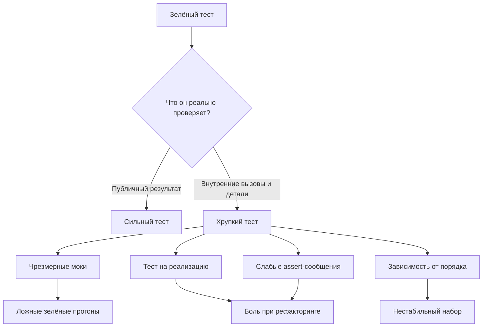

# Зелёный набор, который ничего не защищает: анти-паттерны тестов в `unittest`

Тест может быть зелёным и при этом оставаться плохим инженерным активом. Он может проходить только потому, что слишком подробно повторяет реализацию, подменяет половину системы моками, сравнивает не то, что действительно важно, или опирается на случайный порядок запуска. `unittest` даёт сильные инструменты — фикстуры, типоспецифические `assert*`, `unittest.mock`, `subTest()`, `maxDiff` — но сам по себе не защищает от неудачного дизайна тестов. Это уже ответственность автора набора. ([Python documentation][1])

## Введение

У `unittest` есть здоровая базовая модель. Каждый тестовый метод получает собственный экземпляр `TestCase`, `setUp()` и `tearDown()` вызываются один раз на тест, а сам framework ориентирован на автоматизацию и воспроизводимый прогон. При этом порядок тестовых методов внутри класса определяется сортировкой имён как строк, а в текущей реализации CPython test discovery дополнительно сортирует пути перед импортом, чтобы порядок исполнения был воспроизводим даже на файловых системах с нестабильным порядком обхода. То есть framework даёт Вам стабильную среду — но именно поэтому плохие тестовые привычки могут долго оставаться незамеченными: набор “стабильно зелёный”, хотя его устойчивость на самом деле искусственная. ([Python documentation][1])

Если говорить совсем коротко, хороший тест проверяет **наблюдаемое поведение** системы при понятных входах и даёт адресный сигнал при падении. Плохой тест проверяет внутреннюю хореографию вызовов, держится за частные детали устройства, сыпется от безопасного рефакторинга и не умеет объяснить, что именно сломалось. В статье Мартина Фаулера это различие описано через state verification и behavior verification: mock-based тесты склонны проверять взаимодействия с коллабораторами, а классические тесты чаще смотрят на итоговое состояние и результат. Сам по себе ни один подход не “запрещён”, но именно в области избыточного interaction-based testing начинаются самые болезненные анти-паттерны. ([martinfowler.com][3])



## Чрезмерные моки: когда тест начинает проверять свою же подмену

`unittest.mock` предназначен для того, чтобы заменять части системы под тестом mock-объектами и делать assertions о том, как эти объекты использовались. Но у этого удобства есть цена: обычный `Mock` по умолчанию создаёт новые дочерние моки при обращении к атрибутам, а `patch()` без дополнительных ограничений создаёт `MagicMock`. Это делает мок очень гибким, но одновременно открывает дверь для ложноположительных тестов: Вы можете незаметно “придумать” API, которого в реальном объекте никогда не существовало. Официальная документация прямо рекомендует использовать autospec, если Вы хотите, чтобы mock имел ту же API-поверхность и ту же сигнатуру вызова, что и настоящий объект. Она же отдельно предупреждает, что `create=True` у `patch()` опасен, потому что с ним можно написать проходящие тесты против API, которого на самом деле нет. ([Python documentation][2])

Это и есть сердце анти-паттерна “чрезмерные моки”. Проблема не в том, что моки плохи сами по себе. Проблема в том, что тест перестаёт быть проверкой поведения и становится проверкой того, как именно Вы настроили свои подмены. Фаулер как раз называет это сдвигом от state verification к behavior verification. Для неудобных коллабораторов — сеть, почта, внешний API — это нормально и часто необходимо. Для простых, дешёвых и детерминированных коллабораторов — уже повод задуматься, не пишете ли Вы тест слишком низкоуровнево. Сам Фаулер в таких “easy collaborations” описывает классический подход так: использовать реальные объекты и проверять результат, а не обязательную последовательность вызовов. ([martinfowler.com][3])

Плохо это выглядит примерно так:

```python
# app/order_service.py
class OrderService:
    def __init__(self, repo, formatter, notifier):
        self.repo = repo
        self.formatter = formatter
        self.notifier = notifier

    def render_order(self, order_id: int) -> str:
        order = self.repo.get(order_id)
        total = self.formatter.format_money(order["total"])
        self.notifier.track_view(order_id)
        return f"Order #{order_id}: {total}"
```

```python
# tests/test_order_service_bad.py
import unittest
from unittest.mock import Mock

from app.order_service import OrderService


class TestOrderServiceBad(unittest.TestCase):
    def test_render_order(self):
        repo = Mock()
        formatter = Mock()
        notifier = Mock()

        repo.get.return_value = {"total": 1200}
        formatter.format_money.return_value = "$12.00"

        service = OrderService(repo, formatter, notifier)

        result = service.render_order(7)

        repo.get.assert_called_once_with(7)
        formatter.format_money.assert_called_once_with(1200)
        notifier.track_view.assert_called_once_with(7)
        self.assertEqual(result, "Order #7: $12.00")
```

На первый взгляд тест выглядит нормально. Но он уже привязан к каждой внутренней ступени алгоритма: что сервис отдельно вызывает `format_money`, что он отдельно трекает просмотр, что именно в такой последовательности читает поля заказа. Любой безопасный рефакторинг — например, перенос форматирования в `repo.get()` или отказ от `notifier.track_view()` в пользу событийной очереди — сломает тест даже при сохранении публичного контракта. Это именно тот тип привязки к реализации, о котором предупреждает Фаулер: изменение outbound calls начинает ломать тесты раньше, чем меняется поведение метода. ([martinfowler.com][3])

Сильнее выглядит тест, где cheap dependency оставлена реальной или заменена простым fake, а проверка сосредоточена на результате:

```python
# tests/test_order_service_better.py
import unittest

from app.order_service import OrderService


class FakeRepo:
    def get(self, order_id: int) -> dict:
        return {"total": 1200}


class RealFormatter:
    def format_money(self, cents: int) -> str:
        return f"${cents / 100:.2f}"


class NullNotifier:
    def track_view(self, order_id: int) -> None:
        pass


class TestOrderServiceBetter(unittest.TestCase):
    def test_render_order(self):
        service = OrderService(FakeRepo(), RealFormatter(), NullNotifier())

        result = service.render_order(7)

        self.assertEqual(result, "Order #7: $12.00")
```

Такой тест слабее контролирует внутреннюю choreography и сильнее страхует именно поведение. Если же зависимость действительно внешняя и мок нужен по делу, у него должен быть “повод”: сеть, база, очередь, время, I/O или дорогой, нестабильный ресурс. И тогда лучше сразу делать подмену строже через `autospec=True` или `create_autospec()`, чтобы mock падал так же, как production-код, если Вы ошиблись в сигнатуре или API. Официальная документация формулирует это буквально: autospec создаёт mock с теми же атрибутами, методами и call signature, что и настоящий объект. ([Python documentation][2])

## Тесты на реализацию: когда рефакторинг превращается в ложную аварию

Следующий анти-паттерн логически вырастает из первого. Как только тест начинает наблюдать не публичный эффект, а внутренний механизм, он оказывается завязан на реализацию. Фаулер формулирует проблему очень жёстко: mockist-тесты, которые проверяют outbound calls системы под тестом, более тесно связаны с реализацией метода; изменение взаимодействий с коллабораторами с высокой вероятностью ломает такие тесты, а это мешает рефакторингу. ([martinfowler.com][3])

У Python-специфики тут есть ещё один слой. `patch()` работает не по принципу “заменить объект вообще”, а по принципу “временно поменять объект, на который указывает имя в конкретном namespace”. Документация `unittest.mock` подчёркивает это отдельно: патчить нужно там, где объект **ищется**, а не там, где он был определён. Это полезное правило само по себе, но оно же показывает, насколько тесты, построенные вокруг patch-деталей, чувствительны к структуре импортов. Переехал helper, изменилась форма импорта — и тест уже требует переписывания, хотя поведение функции осталось прежним. ([Python documentation][2])

Посмотрите на такой пример:

```python
# app/usernames.py
def _normalize(raw: str) -> str:
    return raw.strip().lower()


def public_name(raw: str) -> str:
    return _normalize(raw).title()
```

Хрупкий тест:

```python
# tests/test_usernames_bad.py
import unittest
from unittest.mock import patch

from app.usernames import public_name


class TestUsernamesBad(unittest.TestCase):
    @patch("app.usernames._normalize")
    def test_public_name_calls_normalize(self, mock_normalize):
        mock_normalize.return_value = "alice"

        result = public_name(" Alice ")

        mock_normalize.assert_called_once_with(" Alice ")
        self.assertEqual(result, "Alice")
```

Этот тест формально корректен. Но он проверяет не только то, что `public_name()` возвращает `"Alice"`, а ещё и то, что внутри неё обязательно существует private helper `_normalize`, который вызывается ровно один раз с конкретным аргументом. Если завтра Вы инлайните нормализацию прямо в `public_name()` или переименуете helper без изменения контракта функции, тест рухнет. То есть он будет сигналить не о дефекте поведения, а о дефекте соответствия старой внутренней архитектуре. Это и есть textbook-случай теста на реализацию. ([Python documentation][2])

Гораздо устойчивее такая версия:

```python
# tests/test_usernames_good.py
import unittest

from app.usernames import public_name


class TestUsernamesGood(unittest.TestCase):
    def test_public_name_formats_user_visible_name(self):
        self.assertEqual(
            public_name(" Alice "),
            "Alice",
            msg="public_name() должна убрать внешние пробелы и сделать имя человекочитаемым",
        )
```

Здесь тест знает только то, что должен знать внешний потребитель функции: вход и наблюдаемый результат. Внутренний helper может исчезнуть, разветвиться, переместиться в класс, стать методом или превратиться в таблицу правил — пока публичный контракт сохраняется, тест остаётся зелёным. Именно такая свобода и есть главная ценность рефакторинга, которую implementation-coupled tests чаще всего отнимают. ([martinfowler.com][3])

Это не означает, что interaction-based проверки запрещены. Они нужны там, где сам внешний контракт **и есть взаимодействие**: отправили письмо, вызвали внешний клиент, передали команду в брокер, записали событие в аудит. Но если тест проверяет private helper, частный порядок вычислений или точную внутреннюю декомпозицию на вызовы, это уже не контракт системы, а её сегодняшнее устройство. На таких тестах набор обычно начинает “сыпаться от рефакторинга”, хотя пользовательского дефекта нет. ([martinfowler.com][3])

## Хрупкие проверки: когда assertion сообщает меньше, чем должна

Третий анти-паттерн выглядит мелочью, но бьёт по диагностике сильнее, чем кажется. Документация `unittest` прямо рекомендует избегать `assertTrue(a == b)` там, где есть более конкретные методы, потому что специальные assert’ы дают лучшее сообщение об ошибке. `assertEqual()` для одинаковых типов автоматически подключает типоспецифические сравнения для `list`, `tuple`, `dict`, `set`, `frozenset` и `str`; для строк по умолчанию используется `assertMultiLineEqual()`, для последовательностей и словарей строятся diff, а для наборов — список различий между множествами. Есть и отдельный `assertCountEqual()`, который сравнивает последовательности без учёта порядка и с учётом кратности элементов. ([Python documentation][1])

Это означает, что хрупкая проверка — не только та, что “ломается часто”, но и та, что **плохо объясняет** своё падение. Если тест сравнивает списки через `assertTrue(result == expected)`, Вы выбрасываете встроенный diff и заменяете его на бедное `False is not true`. Если тест сравнивает порядок там, где порядок семантически не важен, Вы сами делаете его более хрупким, чем предметная область. И если тест проверяет длинные строки без `assertMultiLineEqual()`, он прячет самое полезное — различия между строками — под общий failure. Документация `unittest` по assert-методам описывает все эти специализированные варианты именно как способ получить более полезные сообщения об ошибках. ([Python documentation][1])

Плохой вариант:

```python
import unittest


class TestPayloadBad(unittest.TestCase):
    def test_payload(self):
        actual = {
            "id": 7,
            "name": "Alice",
            "roles": ["admin", "editor"],
        }
        expected = {
            "id": 7,
            "name": "Alice",
            "roles": ["editor", "admin"],
        }

        self.assertTrue(actual == expected)
```

Проблем здесь две. Во-первых, тест вообще не объяснит различие как diff словаря. Во-вторых, он жёстко зафиксировал порядок ролей, хотя в предметной модели роли часто являются множеством, а не последовательностью. Документация `assertCountEqual()` прямо говорит, что метод проверяет одинаковый состав элементов независимо от порядка и учитывает кратности; при несовпадении он строит сообщение со списком различий. Это именно тот инструмент, который нужен для order-insensitive коллекций. ([Python documentation][1])

Сильнее так:

```python
import unittest


class TestPayloadBetter(unittest.TestCase):
    def test_payload(self):
        actual = {
            "id": 7,
            "name": "Alice",
            "roles": ["admin", "editor"],
        }
        expected = {
            "id": 7,
            "name": "Alice",
            "roles": ["editor", "admin"],
        }

        self.assertEqual(actual["id"], expected["id"])
        self.assertEqual(actual["name"], expected["name"])
        self.assertCountEqual(
            actual["roles"],
            expected["roles"],
            msg="набор ролей важен, но их порядок в ответе не является контрактом",
        )
```

Здесь проверка совпадает с реальным контрактом данных. Это и есть главный способ борьбы с хрупкостью: не “меньше проверять”, а проверять именно то, что действительно важно для системы. Если порядок значим — сравнивайте последовательность. Если не значим — не превращайте случайный порядок в часть API. Документация `unittest` даёт все нужные assert-методы для такого разграничения. ([Python documentation][1])

Есть и ещё один часто недооценённый слой — качество failure-сообщения. Все `assert*` принимают `msg`, а `longMessage=True` по умолчанию означает, что пользовательское сообщение не заменяет стандартное, а добавляется к нему. Это удобно: встроенный diff отвечает на вопрос “что не совпало”, а Ваш `msg` — на вопрос “какое бизнес-правило здесь важно”. Одновременно у `TestCase` есть `maxDiff`: он ограничивает длину diff для assert-методов, которые выводят различия, и по умолчанию равен `80*8` символам; если поставить `None`, ограничение снимается. Всё это официально задокументировано в `unittest`. ([Python documentation][1])

```python
import unittest


class TestLargeDiff(unittest.TestCase):
    maxDiff = None

    def test_contract(self):
        actual = {"meta": {"version": 2, "source": "api"}, "ok": True}
        expected = {"meta": {"version": 1, "source": "api"}, "ok": True}

        self.assertEqual(
            actual,
            expected,
            msg="версия публичного ответа не должна меняться без явной миграции",
        )
```

Такой тест не менее строгий, но намного полезнее в момент падения. Он не только ломается, но и объясняет, _почему_ это падение важно. А это уже противоположность хрупкому тесту.

## Зависимость от порядка: самый коварный анти-паттерн в зелёном наборе

Пожалуй, самый неприятный smell из всей четвёрки — зависимость от порядка. Она коварна именно потому, что часто выглядит как стабильность. Документация `unittest` прямо говорит, что порядок выполнения тестовых методов определяется сортировкой имён методов как строк. Кроме того, на уровне discovery текущая реализация CPython сортирует пути перед импортом, чтобы порядок исполнения был воспроизводимым даже на файловых системах с нестабильным порядком. Если к этому добавить тот факт, что framework создаёт новый экземпляр `TestCase` для каждого тестового метода и вызывает `setUp()`/`tearDown()` отдельно на каждый тест, получается очень обманчивая картина: порядок стабилен, фикстуры локальны, всё вроде бы выглядит предсказуемо. Но как только в игру вступают модульные глобальные переменные, файлы, БД, `os.environ`, внешние процессы или разделяемые кэши, стабильный порядок начинает просто маскировать зависимость. ([Python documentation][1])

Плохой пример:

```python
import unittest

STATE = []


class TestOrderDependent(unittest.TestCase):
    def test_01_add_item(self):
        STATE.append("x")
        self.assertEqual(STATE, ["x"])

    def test_02_state_is_empty(self):
        self.assertEqual(STATE, [])
```

Пока методы называются `test_01_*` и `test_02_*`, набор может воспроизводимо падать или воспроизводимо “случайно работать” в зависимости от того, какая логика в нём спрятана. Но сам smell уже налицо: второй тест зависит не от своей локальной фикстуры, а от того, оставил ли первый что-то в модульной глобальной переменной. Framework здесь не виноват. Он честно создаёт новый `TestCase` instance на каждый метод. Просто сам объект `STATE` живёт вне этой фикстуры и переживает оба теста. Документация `unittest` как раз помогает это увидеть: новый экземпляр создаётся на каждый test method, значит любой shared state за пределами instance already deserves suspicion. ([Python documentation][1])

Надёжнее так:

```python
import unittest


class TestOrderIndependent(unittest.TestCase):
    def setUp(self):
        self.state = []

    def test_add_item(self):
        self.state.append("x")
        self.assertEqual(self.state, ["x"])

    def test_state_is_empty(self):
        self.assertEqual(self.state, [])
```

Здесь состояние живёт внутри instance-фикстуры, которую `unittest` создаёт отдельно для каждого теста. Если же shared state нельзя убрать в instance — например, Вы трогаете временный файл, глобальный реестр, переменные окружения или внешнюю базу — его нужно явно очищать или изолировать так, чтобы тест не зависел от соседей. Сам `unittest` гарантирует только lifecycle своих fixture hooks, а не стерильность внешнего мира. Этот вывод — уже инженерная интерпретация официального lifecycle `TestCase`. ([Python documentation][1])

Здесь есть ещё одно важное следствие. Стабильный порядок не делает зависимость “нормальной”. Наоборот, он делает её более трудноуловимой. Сегодня discovery в CPython сортирует пути, а методы сортируются по имени. Завтра Вы переименуете тест, разобьёте модуль на два файла, запустите подмножествo кейсов, добавите новый test class или другой runner — и скрытая связь всплывёт. Именно поэтому зависимость от порядка обычно считается одним из самых дорогих smells: она нарушает локальность причин и делает поведение набора зависящим от контекста запуска, а не от содержания отдельного теста. ([Python documentation][1])

## Почему эти четыре анти-паттерна обычно приходят вместе

В реальных проектах почти никогда не бывает так, что набор страдает ровно одним smell. Чаще цепочка выглядит так. Сначала в коде появляются чрезмерные моки, потому что так быстрее “изолировать” тест. Затем тест начинает проверять внутренние вызовы и превращается в implementation-coupled. После этого assertions становятся слишком общими или наоборот слишком точными не по смыслу, а по форме. И наконец, где-то с краю начинает жить shared state, который никто не очищает, потому что набор и так “пока стабилен”. В итоге зелёный цвет перестаёт означать доверие. Он начинает означать лишь то, что текущее сочетание порядка, моков и внутренних деталей пока ещё совпадает с ожиданиями тестов. Это уже не факт из документации, а наблюдаемая инженерная динамика — но она очень хорошо объясняется теми механизмами `unittest` и `unittest.mock`, которые мы разобрали выше.

Из этого вытекает очень простой и практичный способ ревью. Если тест мокирует много внутренних коллабораторов, сразу спросите себя, не проверяет ли он реализацию. Если он проверяет реализацию, сразу посмотрите, нет ли там хрупких assertions на порядок, строковое совпадение или частный diff. А если набор внезапно “зависит от переименования тестов”, ищите shared state. Такая последовательность мышления обычно приводит к проблеме быстрее, чем поиск “почему именно сломался CI”.

## заключение

Анти-паттерны тестов опасны не тем, что делают набор некрасивым. Они опасны тем, что портят сам смысл автоматизированной проверки. Чрезмерные моки смещают внимание с поведения системы на поведение подмены. Тесты на реализацию ломаются от безопасного рефакторинга и наказывают проект за внутренние улучшения. Хрупкие assertions ухудшают диагностику и нередко фиксируют случайные детали как часть контракта. Зависимость от порядка превращает набор в неявную последовательную программу вместо независимых тестовых кейсов. Всё это происходит в рамках корректного, штатного `unittest` — то есть framework не запрещает Вам написать плохой тест, он только даёт хорошие инструменты, если Вы ими пользуетесь по делу. ([Python documentation][1])

Хорошее практическое правило в конце курса звучит так: **мокируйте только реальные границы, проверяйте публичное поведение, выбирайте assert по смыслу данных и проектируйте каждый тест так, будто он может быть запущен первым, последним или единственным**. Это не делает тесты идеальными автоматически, но резко снижает вероятность всех четырёх анти-паттернов сразу. А значит, зелёный прогон снова начинает означать то, что и должен означать: код действительно защищён от регрессии. ([martinfowler.com][3])

## Дополнительные материалы

Официальная документация `unittest`: общая модель framework, fixture lifecycle, порядок запуска методов, типоспецифические `assert*`, `assertCountEqual`, `longMessage`, `maxDiff`. ([Python documentation][1])

Официальная документация `unittest.mock`: `patch()`, autospec, `where to patch`, поведение `Mock` при ленивом создании атрибутов, опасность `create=True`. ([Python documentation][2])

Официальные примеры `unittest.mock`: `patch.object(..., autospec=True)` для методов и корректная передача `self` в unbound method. ([Python documentation][4])

Текущая реализация CPython `unittest.loader.discover()`: сортировка путей перед импортом для воспроизводимого порядка discovery. ([GitHub][5])

Martin Fowler, _Mocks Aren’t Stubs_: различие между state verification и behavior verification, риск привязки mockist-тестов к реализации и влияние этого на рефакторинг. ([martinfowler.com][3])

[1]: https://docs.python.org/3/library/unittest.html "unittest — Unit testing framework — Python 3.14.3 documentation"
[2]: https://docs.python.org/3/library/unittest.mock.html "unittest.mock — mock object library — Python 3.14.3 documentation"
[3]: https://martinfowler.com/articles/mocksArentStubs.html "Mocks Aren't Stubs"
[4]: https://docs.python.org/3/library/unittest.mock-examples.html "unittest.mock — getting started — Python 3.14.3 documentation"
[5]: https://github.com/python/cpython/blob/main/Lib/unittest/loader.py "cpython/Lib/unittest/loader.py at main · python/cpython · GitHub"
